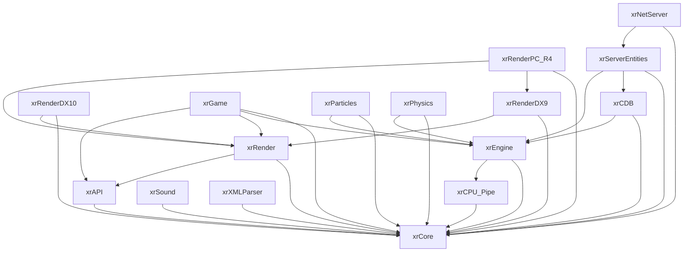

# Зависимости между модулями

Граф `#include`-зависимостей между модулями `src/`. Построен по статическому анализу + ручной корректировке.

> Стрелка `A → B`: модуль A `#include`'ит заголовки модуля B.
> Граф **ацикличен** (слои не перепрыгиваются).

## Граф

## Таблица зависимостей

| Модуль | Тянет (include'ит) | Зачем |
|---|---|---|
| `xrCore` | — | Фундамент, без внутренних зависимостей |
| `xrCPU_Pipe` | `xrCore` | Типы/математика для SIMD-версий функций |
| `xrEngine` | `xrCore`, `xrCPU_Pipe` | Планировщик, ввод, консоль, Lua-биндинг на базе core |
| `xrAPI` | `xrCore` | C-контракт рендера |
| `xrRender` | `xrCore`, `xrAPI` | Pipeline, константы, постобработка |
| `xrRenderDX9` | `xrCore`, `xrRender` | D3D9-реализация |
| `xrRenderDX10` | `xrCore`, `xrRender` | D3D10-реализация |
| `xrRenderPC_R4` | `xrCore`, `xrRenderDX9`, `xrRender` | Основной бэкенд (D3D9) |
| `xrGame` | `xrCore`, `xrEngine`, `xrRender`, `xrAPI` | Игровая логика поверх ядра+рендера |
| `xrParticles` | `xrCore`, `xrEngine` | Частицы (рендерятся через рендер) |
| `xrSound` | `xrCore` | Звук (BASS/FMOD обвязка) |
| `xrPhysics` | `xrCore`, `xrEngine` | Обвязка PhysX |
| `xrXMLParser` | `xrCore` | XML-парсер |
| `xrCDB` | `xrCore`, `xrEngine` | CSE (серверные сущности) |
| `xrServerEntities` | `xrCore`, `xrCDB`, `xrEngine` | Мост CSE ↔ логика |
| `xrNetServer` | `xrCore`, `xrServerEntities` | Сетевой протокол |

## Прямые `#include` между `xrGame` и другими

`xrGame` — самый «толстый» модуль, он тянет:
- `xrCore` — типы, FS, INI, сжатие, строки
- `xrEngine` — `CObject`, `CSheduler`, `Effector`, `xr_input`, Lua-биндинг
- `xrRender`/`xrAPI` — рендерные вызовы через контракт
- `xrPhysics` — физика
- `xrSound` — звук
- `xrParticles` — частицы
- `xrXMLParser` — XML

Обратных зависимостей нет: ни `xrEngine`, ни `xrRender` не знают про `xrGame`.

## Примечания

- `xrGame` содержит **и** клиентский код (`game_cl_*`, `Level_*`), **и** серверный (`game_sv_*`, `xrServer_*`). Разделение — не по модулю, а по префиксу классов и `#ifdef`.
- `xrServerEntities` и `xrCDB` — серверная часть, но компилируются вместе с клиентом (для shared-типов).
- Полный список `#include`-зависимостей внутри `xrGame` (подмодули) будет на страницах [xrGame](../modules/game/index.md) и его подразделов.

## Инструмент

Граф можно воспроизвести скриптом (TODO: `docs/tools/gen_include_graph.py`):
1. Обойти `src/**/*.h`, `src/**/*.cpp`.
2. Вытащить `#include "xr*.h"`.
3. Сгруппировать по каталогу → JSON.
4. Сгенерировать mermaid `graph TD`.
