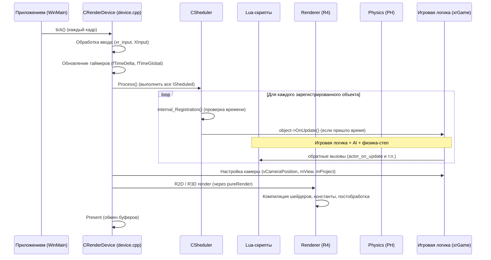

# Цикл кадра

Канонический порядок выполнения одного кадра в X-Ray Monolith. Это «скелет», к которому привязываются все модули: любой объект, эффект, AI-агент, физика — всё исполняется в рамках этого цикла.

## Обзор



## Детали

### 1. Точка входа

`WinMain` (в `xrEngine/x_ray.cpp`) создаёт `CRenderDevice` (через `Device.create()`) и входит в цикл:

```cpp
while (Device.active()) {
    Device.tick();
}
```

### 2. `Device.tick()` — `device.cpp`

Каждый кадр `tick()`:
1. **Ввод**: `xr_input` обрабатывает клавиатуру/мышь/XInput.
2. **Таймеры**: `fTimeDelta` (время с прошлого кадра), `fTimeGlobal` (абсолютное), `dwFrame` (счётчик кадров).
3. **`CSheduler.Process()`** — см. ниже.
4. **Камера**: `vCameraPosition`, `vCameraDirection`, `mView`, `mProject`, `mFullTransform` — заполняются из состояния `CActor`/`CGameGraph`.
5. **Рендер**: `R2D`/`R3D` через `pureRender`-регистраторы (`Device.seqRender`), которые вызывают бэкенд (R4).
6. **Present**: обмен front/back буферов.

### 3. `CSheduler` — `xrSheduler.h`

Планировщик кадров. Хранит список `ISheduled`-объектов, каждому назначено `dwTimeForExecute` (интервал).

- `Register(ISheduled* A, BOOL RT)` — добавить в планировщик. `RT=FALSE` → в `Items` (обычный), `RT=TRUE` → в `ItemsRT` (real-time, каждый кадр).
- `Process()` → `Update()` → для каждого объекта, у которого `dwTimeForExecute` наступило, вызывает `A->OnUpdate()`.
- `EnsureOrder(Before, After)` — гарантирует порядок исполнения двух объектов в кадре.
- `ProcessStep()` — одноступенчатое выполнение (для debug/step-through).

> **Важно**: `CSheduler` — **не** рекурсивный. Один вызов `Process()` обрабатывает все объекты **один раз**. Порядок — по времени исполнения, не по приоритету.

### 4. `ISheduled` — интерфейс

```cpp
class ISheduled {
public:
    virtual void OnUpdate() = 0;   // вызывается CSheduler
    virtual void OnFrame() = 0;    // вызывается каждый кадр (не через sheduler)
    // ...
};
```

Все игровые объекты (`CGameObject`), эффекты (`CEffector`), AI-агенты реализуют `ISheduled` и регистрируются в `CSheduler`.

### 5. Lua-обратные вызовы

Внутри `OnUpdate()` игровых объектов вызываются Lua-функции:
- `actor_on_update`, `level_on_update`, `on_game_start`, `on_frame` и т.п.
- Механизм: `ai_script_lua_extension` + `script_binder` (luabind). См. [Граница скриптинга](scripting-boundary.md).

### 6. Рендер

`Device.seqRender` — `CRegistrator<pureRender>`. При `tick()` вызывает всех зарегистрированных `pureRender`-объектов в порядке регистрации. Это точка, где `xrGame` «отдаёт» кадры рендеру.

### 7. Физика

`CPhysicsGame` (в `xrGame`) — отдельный `ISheduled`, обновляется в кадре. Вызывает `PhysicsWorld::step()`, затем применяет результаты к объектам.

## Ключевые свойства цикла

- **Однопоточный на кадр**: `tick()` выполняется в главном потоке. Физика/сети — в отдельных потоках, но синхронизируются на границах кадра.
- **Детерминированный порядок**: `CSheduler` гарантирует порядок `OnUpdate`. `EnsureOrder` — для явного порядка между объектами.
- **Кадр не блокируется на Lua**: Lua-вызовы — синхронные, но имеют лимиты времени (см. [Граница скриптинга](scripting-boundary.md)).
- **Таймеры**: `fTimeDelta` — для физики/анимаций, `dwFrame` — для frame-counter'ов (shader bus использует).

## Связанные страницы

- [Модель объектов](object-model.md) — кто реализует `ISheduled`.
- [Граница скриптинга](scripting-boundary.md) — как Lua встраивается в цикл.
- [xrEngine: Sheduler](../modules/xr-engine/scheduler.md) — детальный разбор `CSheduler`.
- [xrEngine: Device](../modules/xr-engine/device.md) — детальный разбор `device.cpp`.
