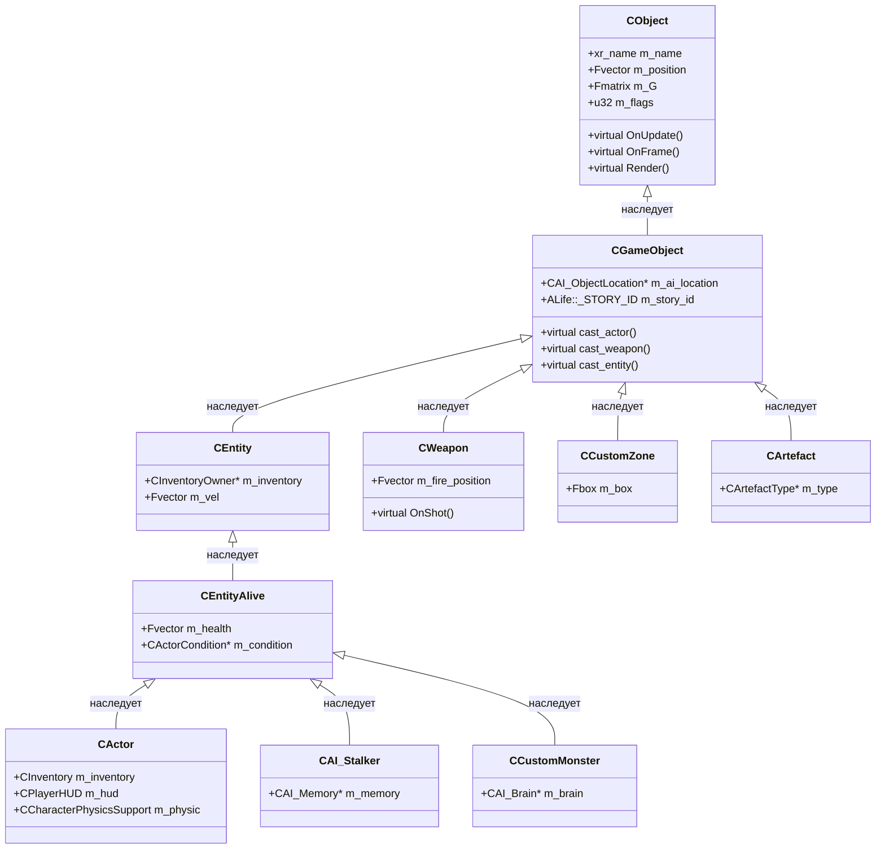

# Модель объектов

Иерархия объектов X-Ray Monolith. Это «дерево классов», к которому сводится всё игровое: персонажи, оружие, зоны, частицы — всё наследуется от этой иерархии.

## Иерархия (клиент)



> **Примечание**: `CGameObject` наследует **три** класса — `CObject` (движок), `CUsableScriptObject` (скриптинг), `CScriptBinder` (Lua-биндинг). На диаграмме показана только ветка `CObject`.

## Базовые классы

### `CObject` — `xrEngine/xr_object.h`

Базовый **рендерящийся** объект движка. Хранит:
- `xr_name m_name` — имя
- `Fvector m_position`, `Fmatrix m_G` — трансформ
- `u32 m_flags` — флаги состояния
- Реализует `ISheduled` (`OnUpdate`, `OnFrame`) и `IRenderable` (`Render`)

**Не** знает про игровую логику — только про «я объект в мире, у меня трансформ и рендер».

### `CGameObject` — `xrGame/GameObject.h`

Базовый **игровой** объект. Наследует `CObject` + скриптовые миксы. Хранит:
- `CAI_ObjectLocation* m_ai_location` — связь с AI
- `ALife::_STORY_ID m_story_id` — ID в ALIFE
- `animation_movement_controller* m_anim_mov_ctrl` — анимация
- Набор `cast_*()` — «умные» downcast'ы без `smart_cast` (см. `cast_actor()`, `cast_weapon()`, `cast_entity()`)

> **`cast_*()` вместо `smart_cast`**: X-Ray использует виртуальные `cast_*()` для избежания дорогого `dynamic_cast`/`smart_cast` в hot-path. Каждый подкласс переопределяет свой `cast_*`.

### `CEntity` / `CEntityAlive`

`CEntity` — объект с инвентарём. `CEntityAlive` — живой объект (здоровье, условия). `CActor` — игрок, `CAI_Stalker` — AI-сталкер, `CCustomMonster` — монстр.

### `CWeapon`

Оружие. Наследует `CGameObject`. Подклассы: `CWeaponMagazined`, `CWeaponPistol`, `CWeaponShotgun`, `CWeaponAK74`, `CWeaponSVD` и т.п. (см. [Оружие](../modules/game/weapons.md)).

## Серверная иерархия (CSE)

Сервер ведёт **параллельную** иерархию — **CSE** (Client-Server Entity), в `xrCDB`:

```
CSE_Abstract
  ├── CSE_ALife_Object (базовый ALIFE)
  │     ├── CSE_ALife_Human (сталкер)
  │     ├── CSE_ALife_Monster (монстр)
  │     └── CSE_ALife_Trader (торговец)
  ├── CSE_Paragon (игрок/сущность)
  ├── CSE_Item (предмет)
  ├── CSE_Weapon
  └── CSE_Zone
```

CSE — **сериализуемые** структуры, состояние которых передаётся по сети. Клиентская `CGameObject` и серверная CSE связаны через `xrServerEntities` (мост).

## Связи

- **`CObject` ↔ Renderer**: `CObject::Render()` → `xrRender` (через `xrAPI`).
- **`CGameObject` ↔ AI**: `m_ai_location` → `CAI_ObjectLocation` (ALIFE). См. [ALIFE](../modules/game/alife.md).
- **`CGameObject` ↔ Physics**: `CPhysicsShellHolder` → `CPhysicsShell` (PH). См. [Физика](../modules/game/physics.md).
- **`CGameObject` ↔ Lua**: `CScriptBinder` + `CUsableScriptObject` → `script_binder`. См. [Граница скриптинга](scripting-boundary.md).
- **`CGameObject` ↔ CSE**: синхронизация состояния через сеть. См. [Сеть](../modules/network.md).

## Ключевые свойства

- **Одна иерархия, два мира**: клиент — `CGameObject`, сервер — CSE. Синхронизация — через сеть.
- **`cast_*()` вместо `smart_cast`**: performance-решение, каждый подкласс знает свой тип.
- **Множественное наследование**: `CGameObject` = `CObject` + `CUsableScriptObject` + `CScriptBinder`. Не случайно — игра, скриптинг, биндинг — три независимые ответственности.
- **`ISheduled`**: все объекты — `ISheduled`, т.е. все участвуют в [цикле кадра](frame-loop.md).

## Связанные страницы

- [Цикл кадра](frame-loop.md) — как объекты исполняются.
- [Граница скриптинга](scripting-boundary.md) — как объекты экспортируются в Lua.
- [xrGame: Объекты](../modules/game/objects.md) — детальный разбор `CGameObject`/`CActor`.
- [ALIFE](../modules/game/alife.md) — как AI использует объект-модель.
