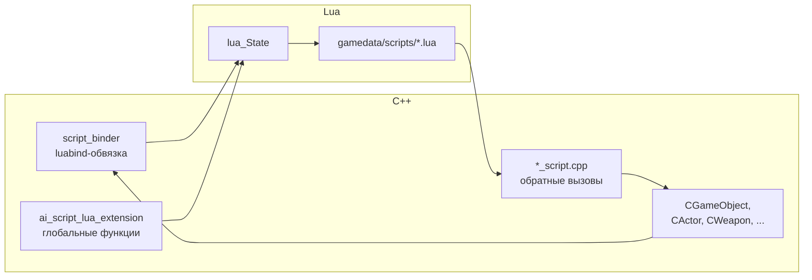

# Граница скриптинга

Где C++ встречает Lua. X-Ray Monolith использует **Lua 5.1** + **luabind** для скриптинга. Граница — это набор механизмов, через которые C++ экспортирует объекты в Lua, а Lua вызывает C++ и получает обратные вызовы.

## Компоненты границы

## Механизмы

### 1. `script_binder` — luabind-обвязка

`xrGame/script_binder.h`/`.cpp` — базовый класс для экспорта C++-объектов в Lua через luabind.

- `CScriptBinder` — микс, который `CGameObject` наследует. Даёт объекту `m_script_object` (указатель на Lua-объект).
- Каждый экспортируемый класс имеет `*_script.cpp` (например, `ActorCondition_script.cpp`, `CustomZone_script.cpp`), где описывается:
  - какие методы/поля видны из Lua
  - как Lua-объект создаётся/уничтожается
  - как обрабатываются ошибки

### 2. `ai_script_lua_extension` — глобальные функции

`xrEngine/ai_script_lua_extension.h`/`.cpp` — набор глобальных Lua-функций, доступных из любого скрипта:
- `game_object_create`, `game_object_destroy`
- `render2d_*`, `render3d_*` (рендерные вызовы)
- `log`, `debug`
- `shader_bus` (см. [Shader Bus](../modules/renderer/shader-bus.md))
- ...

Регистрируются при инициализации Lua-машины.

### 3. `*_script.cpp` — обратные вызовы

Файлы `*_script.cpp` (в `xrGame`) — **обратные вызовы** из C++ в Lua:
- `actor_script.cpp` — `actor_on_update`, `actor_on_death`
- `level_script.cpp` — `level_on_update`, `on_game_start`
- `CustomZone_script.cpp` — `zone_on_update`

Эти функции вызываются C++ **синхронно** в [цикле кадра](frame-loop.md).

### 4. `ai_script_lua_debug` — отладчик

`xrEngine/ai_script_lua_debug.cpp` — интеграция Lua-отладчика (pdb, breakpoints).

## Lua-машина

- **Версия**: Lua 5.1 (в `src/3rd party/lua/`).
- **`lua_State`**: одна на процесс (для клиента), одна на сервер (для `xrServerEntities`).
- **Инициализация**: `xrGame/xrGame.cpp` → `CreateLua()` → регистрация расширений → загрузка `gamedata/scripts/lua/*.lua`.
- **Загрузка скриптов**: `gamedata/scripts/` — основной каталог. Порядок загрузки — алфавитный, `on_game_start` вызывается после загрузки.

## Протокол ошибок

- Lua-ошибка → `ai_script_lua_debug` ловит → пишет в лог + показывает в консоли.
- `DEBUGGER_ERRORMESSAGE` (см. `xrServerEntities/script_lua_helper.cpp`) — хук для серверного отладчика.
- **Никогда** не проглатывать Lua-ошибки молча — это ломает состояние.

## Лимиты

- **Время**: Lua-вызовы синхронны в кадре. Длинный скрипт = фризы. Нет built-in таймаута — только дисциплина.
- **Память**: Lua-машина имеет свой GC. `shared_str`/`xr_string` — C++-строки, при передаче в Lua копируются.
- **Потоки**: Lua **не потокобезопасная**. Все вызовы — из главного потока (или из серверного потока для сервера).

## Что доступно из Lua

| Категория | Примеры |
|---|---|
| Объекты | `game_object`, `actor`, `weapon`, `zone`, `artifact` |
| Рендер | `render2d_text`, `render3d_set_material`, `shader_bus` |
| Физика | `physics_create_box`, `physics_ray_test` |
| Звук | `sound_play`, `sound_set_position` |
| UI | `ui_show`, `ui_hide`, `ui_set_text` |
| Сеть | `net_send`, `net_broadcast` (только сервер) |
| Системные | `log`, `debug`, `game_id`, `game_name` |

Полный список — см. [Lua Reference](../api/lua-reference.md) (итерация 14).

## Связанные страницы

- [Цикл кадра](frame-loop.md) — где Lua-вызовы исполняются.
- [Модель объектов](object-model.md) — какие объекты экспортируются.
- [xrEngine: Lua-биндинг](../modules/xr-engine/lua-binding.md) — детальный разбор `ai_script_lua_extension` + `script_binder`.
- [Shader Bus](../modules/renderer/shader-bus.md) — пример фичи, доступной из Lua.
