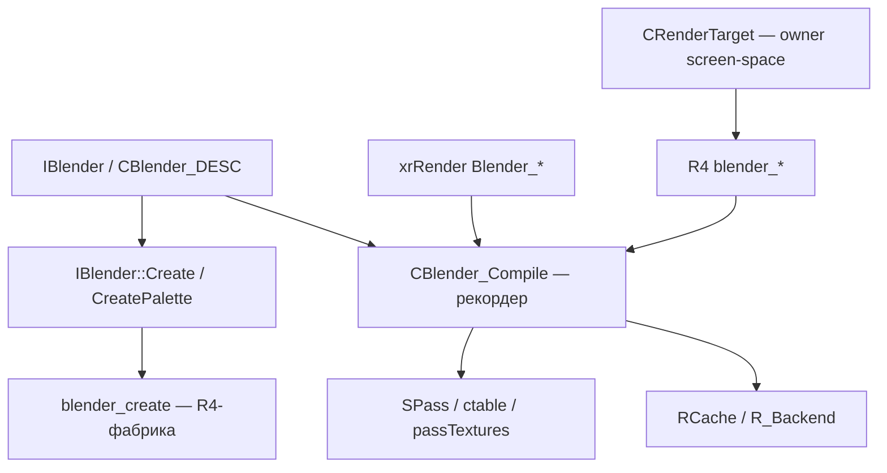
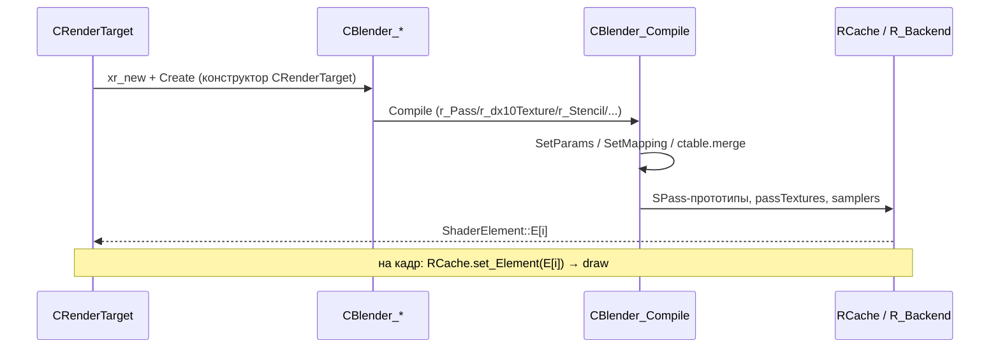

# Renderer: Blenders (библиотека)

> Итерация 3, порцион 15. Активный бэкенд — R4 (DX11); D3D9-ветки помечены.

## Ответственность

Blender в X-Ray — описание **набора pass'ов** (элементов) одного материала/
эффекта: какие шейдеры, текстуры, samplers, blend/stencil-режимы, в каком
порядке. Задачи библиотеки:

- базовая инфраструктура: `IBlender` (прогрессивная загрузка из `.s`/`.lua`
  через `CPropertyBase`), `CBlender_DESC` (реестр CLSID/названия), фабрика
  `IBlender::Create` + палитра `CreatePalette`;
- «рекордер» `CBlender_Compile` — трансляция декларативного описания в
  конкретные DX10/11-ресурсы (SPass-прототипы, ctable'ы, списки текстур/
  матриц/констант) на этапе `Compile`;
- конкретные world-блендеры из `xrRender/Blender_*` (terrain BmmD, lmap
  LmEbB, model EbB, particles, screen-set, editor, detail, tree);
- screen-space/post-process блендеры R4 из `xrRenderPC_R4/blender_*`
  (blur, combine, DoF, gasmask, HDR10 bloom/flare, LUT, nightvision/
  heatvision/fakescope, bloom, SMAA/TAA, sunshafts, SSAO, ssfx_*).

**Не покрывается**: light-блендеры (`blender_light_*`) и
`CBlender_deffer_*`/`CBlender_accum_*`/`CBlender_luminance` — порционы
12–13 ([R4: scene](r4-scene.md), [R4: deferred](r4-deferred.md)); сами
post-process фазы, **вызывающие** эти блендеры, — порцион 14
([R4: post-process](r4-postprocess.md)). Здесь — только сами
реализации `Compile()`.

## Место в архитектуре

- Палитра блендеров строится при инициализации рендера:
  `IBlender::CreatePalette()` (Blender_Palette.cpp) — список из 21 CLSID,
  engine-создание через `RImplementation.blender_create`
  (R4-фабрика — `r2_blenders.cpp`, порцион 12); редакторская `Create` —
  большой switch на CLSID.
- World-блендеры — «прогрессивные»: `.s`/`LS_Load` Lua-скрипты
  ([Ресурсы](resources.md), порцион 7) заполняют `CPropertyBase`
  (`oPriority`, `oStrictSorting`, `oT_Name`, `oT_xform`...), затем
  `IBlender::_cpp_Compile` запускает `BT->Compile(CBlender_Compile&)`.
- Screen-space блендеры R4 — **не прогрессивные** (`description.CLS = 0`):
  создаются напрямую в конструкторе `CRenderTarget` (`r4_rendertarget.cpp`
  L387–472) и компилируются там же через `ShaderElement::create`-обёртки
  (`s_sunshafts.create(b_sunshafts, "r2\\sunshafts")` и т.п.).
- `CBlender_Compile` — общий для всех блендеров «язык записи»:
  `r_Pass/r_TessPass/r_ComputePass` + `r_dx10Texture/r_dx10Sampler/
r_Stencil/r_StencilRef/r_CullMode/r_ColorWriteEnable` (DX10/11 API) и
  legacy fixed-function `PassSET_*/Stage*` (D3D9, в R4 не компилируется —
  `Blender_Recorder_R2.cpp` целиком за `#if !USE_DX10/11`).

## Публичный API

### `IBlender` (Blender.h)

| Член                                                                | Назначение                                                                                                                             |
| ------------------------------------------------------------------- | -------------------------------------------------------------------------------------------------------------------------------------- |
| `CPropertyBase` (база)                                              | прогрессивная загрузка: `oPriority` (0..3, def 1), `oStrictSorting` (def TRUE), `oT_Name` (def `"$base0"`), `oT_xform` (def `"$null"`) |
| `virtual void Create()`                                             | engine: `::RImplementation.blender_create(description.CLS)`; editor: switch по CLSID                                                   |
| `virtual void Destroy()`                                            | сброс `description.CLS`                                                                                                                |
| `static IBlender* Create(const BLender_CLSID&)` / `CreatePalette()` | фабрика и палитра                                                                                                                      |
| `virtual void Save/Load(LS_section*)`                               | секции `General` / `Base Texture`                                                                                                      |
| `virtual BOOL Compile(CBlender_Compile&)`                           | базовая реализация — только `SetParams` (см. quirk ниже)                                                                               |
| `canBeDetailed/canBeLMAPped/canUseSteepParallax()`                  | свойства для `uber_deffer`                                                                                                             |
| `description` (`CBlender_DESC`)                                     | `CLS`, `cName` (<128, без `.`), `cComputer` (CLSID), `cTime`, `version`                                                                |

### `CBlender_Compile` (Blender_Recorder.h) — «язык записи»

| Метод                                                                                               | Назначение                                                                                                                                                                        |
| --------------------------------------------------------------------------------------------------- | --------------------------------------------------------------------------------------------------------------------------------------------------------------------------------- |
| `SetParams(priority, strict)`                                                                       | `iElement = (priority*2 + (strict?0:1))` — **индекс элемента**; DEBUG `VERIFY(1 == iPriority/2)` при strict                                                                       |
| `SetMapping(i)`                                                                                     | DX10/11: привязка `passTextures`/samplers к DX slots (реализация — `Blender_Recorder_StandartBinding.cpp`; здесь описана на уровне интерфейса)                                    |
| `r_Pass(vs, ps, blend, aref)` — 3 overload'а                                                        | создание SPass-прототипа: `_CreateState/PS/VS/GS/HS/DS/CS`, `ctable.merge`, `SetMapping`; PS/VS строчатся `strlwr`; `PassSET_ZB` — `bZWrite = FALSE`, если pass не первый (quirk) |
| `r_TessPass(...)`                                                                                   | + HS/DS, `TessMethod` (`NO_TESS`/`TESS_PN`/`TESS_HM`/`TESS_PN_HM`)                                                                                                                |
| `r_ComputePass(...)`                                                                                | compute-shader pass (используется HDAO, см. порцион 14)                                                                                                                           |
| `r_dx10Texture(name, rt_id)` / `r_dx10Sampler(name, state)`                                         | добавление текстуры (по `r2_RT_*` или имени файла) и sampler-state в текущий pass                                                                                                 |
| `r_Stencil(ref, mask, func)` / `r_StencilRef(ref)` / `r_CullMode(cull)` / `r_ColorWriteEnable(...)` | DX10/11 state                                                                                                                                                                     |
| `r_End()`                                                                                           | завершение текущего элемента (заполнение `ShaderElement::E`)                                                                                                                      |
| `L_textures[]/L_constants[]/L_matrices[]`                                                           | глобальные (per-Compile) списки, индексация `$base0..7`/`$null` через `ParseName`                                                                                                 |
| `detail_texture/detail_scaler`, `bEditor/bDetail/bDetail_Diffuse/bDetail_Bump`, `bUseSteepParallax` | ввод для detail-блендеров (заполняются `_cpp_Compile` из `DEV->m_textures_description`)                                                                                           |

### `CBlender_Compile::SetMapping`

`Blender_Recorder_StandartBinding.cpp` (1596 стр.) — DX10/11-привязка
`passTextures`/samplers к DX11 constant/sampler slots; здесь не
разбирается построчно (покрытие — порцион 15, но не детально), ключевое:
вызывается из `r_Pass*` на каждый pass, использует
`uber_deffer`-хелперы для shared-названий (`s_base`, `s_lmap`, ...).

## Внутреннее устройство

### Базовый конвейер `IBlender::_cpp_Compile` (Blender_Recorder.cpp)

1. **Detail-текстуры**: `DEV->m_textures_description.GetDetailTexture` →
   `detail_texture`; `GetTextureUsage` → `bDetail_Diffuse`/`bDetail_Bump`
   (R2+: `ps_r2_ls_flags.test(R2FLAG_DETAIL_BUMP)` — bump-слой схлопывается
   в diffuse); `UseSteepParallax`; `TessMethod = 0`;
2. `BT->Compile(*this)` — виртуальный, в конкретном блендере;
3. `r_End()` — завершение.

`SetParams` — quirk: `VERIFY(1 == (iPriority/2))` при `StrictB2F`
(release — только `Msg`+disable в редакторе).

`IBlender::Compile` (Blender.cpp) — **editor и non-editor ветки
идентичны**: обе `C.SetParams(oPriority.value, oStrictSorting.value)` —
quirk, редакторская кастомизация не различается.

### Палитра (Blender_Palette.cpp)

21 CLSID (`Blender_CLSID.h`): `B_DEFAULT ('LM ')`, `B_DEFAULT_AREF`,
`B_VERT`, `B_VERT_AREF`, `B_LmBmmD`, `B_LaEmB`, `B_LmEbB`, `B_B`,
`B_BmmD ('BmmD Old ')`, `B_PARTICLE`, `B_SCREEN_SET`, `B_SCREEN_GRAY`,
`B_LIGHT`, `B_BLUR`, `B_SHADOW_TEX`, `B_SHADOW_WORLD`, `B_DETAIL`,
`B_TREE`, `B_MODEL`, `B_MODEL_EbB`, `B_EDITOR_WIRE`, `B_EDITOR_SEL`.
Дедупликация — `TYPES_EQUAL` по `typeid` raw_name; `std::sort` по
`getComment()`.

R4-фабрика (`r2_blenders.cpp`, порцион 12 — здесь только сводка):
`B_SCREEN_GRAY`, `B_LIGHT`, `B_LaEmB`, `B_B`, `B_SHADOW_TEX/WORLD`,
`B_BLUR` → **0** (не реализованы); остальные — прямое
`xr_new<CBlender_*>`.

### `CBlender_BmmD` (Blender_BmmD.cpp, version 3) — terrain

Поля: `oR/G/B/A_Name` — имена detail-текстур (quirk: дефолт A —
`"yantar"` (опечатка, видимо «янтарь»/yantra)).

R3/R4 (активна, `#else` после R2):

| Элемент                 | Shaders                                                                                            | Текстуры                                                                                                     | Примечание                                                                                                                                                                                                                                     |
| ----------------------- | -------------------------------------------------------------------------------------------------- | ------------------------------------------------------------------------------------------------------------ | ---------------------------------------------------------------------------------------------------------------------------------------------------------------------------------------------------------------------------------------------- |
| `SE_R2_NORMAL_HQ`       | R4+`ssfx_terrain` → `uber_deffer("terrain","terrain_high")` + isLandscape; иначе `("impl","impl")` | `s_mask`, `s_lmap`, `s_dt_r/g/b/a`, `s_dn_r/g/b/a` (mask+`_bump`); R4: `s_height_r/g/b/a`                    | R4 puddles: `s_puddles_normal` (`fx\water_normal`), `s_puddles_perlin` (`fx\puddles_perlin`), `s_puddles_mask`, `s_rainsplash` (`fx\water_sbumpvolume`); `smp_base`+`smp_linear`; **stencil всегда `0xff 0x7f KEEP/REPLACE/KEEP`, ref `0x01`** |
| `SE_R2_NORMAL_LQ`       | R4 → `("base","terrain_mid")` (иначе `("base","impl")`)                                            | `s_lod_texture` — `$game_textures$/<mask>_<base>_lod_textures.dds` (fallback `terrain\default_lod_textures`) | R4: `smp_linear`, stencil                                                                                                                                                                                                                      |
| `case 3` (magic number) | `("base","terrain_low")`                                                                           | `smp_linear`                                                                                                 | SSFX low-terrain — **магическое число, не `SE_*`-константа**                                                                                                                                                                                   |
| `SE_R2_SHADOW`          | R4+`ssfx_terrain` → `shadow_direct_terrain`/`dumb`, иначе `shadow_direct_base`/`dumb`              | `s_base`                                                                                                     | color-write off                                                                                                                                                                                                                                |

R1-ветка (`SE_R1_*` → `impl_dt`/`impl_point`/`impl_spot`/`impl_l`) и R2
prepass (`R2FLAG_TERRAIN_PREPASS`) — legacy.

### `CBlender_LmEbB` (Blender_Lm(EbB).cpp, version 0x1) — lmap

Поля: `oT2_Name`/`oT2_xform` (def `$null`), `oBlend`.

R3/R4 (активна): **один** forward-пасс `lmapE`/`lmapE` (blend при `oBlend`) —
quirk: **не deferred** (в отличие от BmmD). `s_base`+`smp_base`,
`s_lmap`+`smp_linear`, `s_hemi` (`L_textures[2]`)+`smp_rtlinear`, `s_env`.
R1-ветка (`lmapE`-pass'ы HQ/LQ/POINT/SPOT/LMODELS) — legacy.

### `CBlender_Model_EbB` (Blender_Model_EbB.cpp, version 0x1)

R3/R4 (активна):

| Условие                                    | Shaders                                                          | Текстуры                                                                                                                    |
| ------------------------------------------ | ---------------------------------------------------------------- | --------------------------------------------------------------------------------------------------------------------------- |
| `oBlend` (forward)                         | `model_env_lq`; R4+`ssfx_glass`+`!HudElement` → **`ssfx_glass`** | `s_base`, `s_env`; glass: `s_accumulator` (`r2_RT_accum`), `s_screen` (`$user$generic_temp`), `s_glass` (`fx\glass_normal`) |
| `!oBlend`, `SE_R2_NORMAL_HQ`, `HudElement` | `uber_deffer("model_hud","base_hud")`                            | `s_hud_rain` (`fx\hud_rain`)                                                                                                |
| `!oBlend`, `SE_R2_NORMAL_HQ`               | `uber_deffer("model","base")`                                    | —                                                                                                                           |
| `SE_R2_NORMAL_LQ`                          | `("model","base",false,0,true)`                                  | —                                                                                                                           |
| `SE_R2_SHADOW`                             | `shadow_direct_model`/`dumb`                                     | color-write off                                                                                                             |

`SE_R2_NORMAL_HQ` (deferred): **stencil всегда `0xff 0x7f REPLACE`, ref `0x01`**.
`oBlend`+`!HudElement`+`ssfx_glass` — glass-шейдер (L210–212).

### `CBlender_Particle` (Blender_Particle.cpp, version 0)

Поля: `oBlendCount = 6` (`SET/BLEND/ADD/MUL/MUL_2X/ALPHA-ADD`), `oAREF`
(def 32), `oClamp`.

R2/R3/R4 (активна):

| Элемент                | SET                                            | Остальные                                                  |
| ---------------------- | ---------------------------------------------- | ---------------------------------------------------------- |
| `SE_R2_NORMAL_HQ/LQ`   | `deffer_particle`/`deffer_particle` (aref 200) | `particle`-варианты (per blend mode)                       |
| `SE_R2_SHADOW`         | `particle` (color-write off)                   | `particle-clip` / `particle_s-blend`/`-add`/`-mul`/`-aadd` |
| `case 4` (deffer-EMAP) | пусто                                          | пусто                                                      |

`s_base` (clamp через `i_dx10Address` на `smp_base` при `oClamp`),
`s_position` (`$user$position`)+`smp_nofilter` (soft particles).

### `CBlender_Screen_SET` (Blender_Screen_SET.cpp, version 4)

10 blend-режимов (0..9): `SET, BLEND, ADD, MUL, MUL_2X, ALPHA-ADD,
MUL_2X(B^D) (wallmarks), SET(2r), BLEND(2r), BLEND(4r)`;
`VER_2/4/5` — 7/9/10 элементов. **Только DX10/11** (D3D9-ветка с
stages — не компилируется в R4):

| Режим     | VS                      | PS             |
| --------- | ----------------------- | -------------- |
| 6         | `stub_notransform_t_m2` | `stub_default` |
| 7, 8      | `stub_notransform_t_m2` | `stub_default` |
| 9         | `stub_notransform_t_m4` | `stub_default` |
| остальные | `stub_notransform_t`    | `stub_default` |

`s_base`+`smp_base` (CLAMP при `oClamp`); `PassSET_ZB(oZTest,oZWrite)`
вызывается **после** `r_Pass` (quirk).

### Editor-блендеры

- `CBlender_Editor_Wire` (`oT_Factor`): `r_Pass("editor","simple_color")`
  - `r_ColorWriteEnable()`.
- `CBlender_Editor_Selection`: `r_Pass("editor","simple_color",...,SRCALPHA,INVSRCALPHA)`.

### `CBlender_Detail_Still` / `CBlender_Tree`

Подробно — [Детали](detail.md) (§Blenders): `B_DETAIL` (v0) →
`uber_deffer(detail_w/detail_s,"base")` + ATOC-вариант (`base_atoc` +
`XRDX10RS_ALPHATOCOVERAGE`, затем main-pass `D3DCMP_EQUAL`), stencil
`0xff 0x7f ref 0x01`, `CULL_NONE`. `B_TREE` (v1, `canBeDetailed=TRUE`) —
`tree`/`tree_s`/`tree_branch` (DX11 `ssfx_branches`), `s_waves`
(`fx\wind_wave`)+`smp_linear2`, ATOC, `SE_R2_SHADOW`
(`shadow_direct_tree(_s)(_aref)`, aref 200 при `oBlend`).

### R4 screen-space: blur-семейство (blender_blur.cpp)

10 классов, `description.CLS = 0` (создаются напрямую в `CRenderTarget`):

| Класс                                         | Элементы                                         | Shaders / RT                                                                                                                                                   |
| --------------------------------------------- | ------------------------------------------------ | -------------------------------------------------------------------------------------------------------------------------------------------------------------- |
| `CBlender_blur`                               | 0..5 (fullres/halfres/quarterres H/V)            | `pp_blur`; `s_image` = `r2_RT_generic0` или `r2_RT_blur_h_2/4/8`; `s_position` = `r2_RT_P`; `s_lut_atlas` (`shaders\lut_atlas`); `smp_nofilter`+`smp_rtlinear` |
| `CBlender_ssfx_ssr`                           | 0..5 (ssr, blur1, blur2, combine, noblur, gloss) | `ssfx_ssr*` / `rt_ssfx_ssr*`; `blue_noise` (`fx\blue_noise`)                                                                                                   |
| `CBlender_ssfx_volumetric_blur`               | 0,1,2,3,5                                        | blur-fазы + `ssfx_volumetric_combine`                                                                                                                          |
| `CBlender_ssfx_ao`                            | 0..5 (ao, blur1, blur2, IL, il_blur1, il_blur2)  | `ssfx_ao*`/`ssfx_il*`; jitter0 `JITTER(0)`                                                                                                                     |
| `CBlender_ssfx_sss` / `CBlender_ssfx_sss_ext` | 0..2 / 0,1,2                                     | `sss*` / `sss_ext*`, `combine`                                                                                                                                 |
| `CBlender_ssfx_rain`                          | 0,1                                              | MSAA-вариант `r2_RT_generic0_r` (quirk)                                                                                                                        |
| `CBlender_ssfx_water_blur`                    | 0..2,5                                           | blur-fазы, `noblur`, waves (`fx\water_height`)                                                                                                                 |
| `CBlender_ssfx_motion_blur`                   | 0,1                                              | motion blur                                                                                                                                                    |
| `CBlender_ssfx_fog_scattering`                | 0,2,3                                            | scattering, blur2, blur4                                                                                                                                       |

### `CBlender_combine` / `CBlender_combine_msaa` (blender_combine.cpp)

`CBlender_combine`: case 0 — `combine_1`/`combine_1_nomsaa` (blend
`INVSRCALPHA/SRCALPHA`, **stencil `LESSEQUAL 0xff` ref `0x01`**), ~15
`r2_RT_*` текстур + envs/sky + `ssfx_ao/il` + `motion_vectors` +
`jitter(C)`; case 1..5 — `combine_2_AA/_NAA/_AA_D/_NAA_D` + post-process
(pустой) — все через `stub_notransform_aa_AA` VS; `s_image/s_bloom/
s_bloom_new/s_distort/s_blur_2/4/8/s_lut_atlas/s_lens_dirt/s_noise_1`.

`CBlender_combine_msaa` — те же case'ы, но `combine_1_msaa`; **quirk**:
`Compile()` пишет `::Render->m_MSAASample = atoi(Definition)`;
`s_distort` = `r2_RT_generic1_r`; NAA — z-write TRUE.

### `CBlender_dof` (blender_dof.cpp)

case 0 — `depth_of_field` (`s_image` = `r2_RT_generic0`, `s_blur_2`);
case 1 — `post_processing`, `samplero_pepero` = `r2_RT_dof` (quirk:
опечатка в имени ресурса).

### Gasmask (blender_gasmask_*.cpp)

- `CBlender_gasmask_drops`: `gasmask_drops`; `s_image` = `r2_RT_generic0`;
  `s_noise` = `shaders\gasmasks\mask_noise`.
- `CBlender_gasmask_dudv`: `gasmask_dudv`; `s_image` = `r2_RT_generic0`;
  `s_mask_droplets` + **10** `s_mask_nm_1..10` (`shaders\gasmasks\`).

### HDR10 (blender_hdr10_*.cpp)

7 классов, общий паттерн (downsample → Kawase blur ping-pong → upsample,
`r4_RT_HDR10_halfres0/1`):

- `CBlender_hdr10_bloom_downsample` (`hdr10_bloom_downsample`,
  `s_hdr10_game` = `r2_RT_generic0`), `_blur` (0/1), `_upsample` (0/1 +
  `s_hdr10_game`);
- `CBlender_hdr10_lens_flare_downsample/_fgen/_blur/_upsample` — тот же
  паттерн.

### `CBlender_lut` (blender_lut.cpp)

`pp_lut`; `s_image` = `r2_RT_generic0`; `debug_noise` = `fx\blue_noise`;
`s_lut_atlas`.

### Nightvision / fakescope / heatvision (blender_nightvision.cpp)

- `CBlender_nightvision`: case 0 — `copy_nomsaa` (dummy); case 1/2/3 —
  `nightvision_gen_1/2/3` (`s_position/s_image/s_bloom_new/s_blur_2/4/8`
  - **`s_heat` = `r2_RT_heat`** — `//--DSR-- HeatVision`, fork-маркировка);
- `CBlender_fakescope`: `fakescope`, `s_scope` = `r2_RT_scopert`
  (комментарий «crookr»);
- `CBlender_heatvision`: case 0 — `copy_nomsaa`; case 1 — `heatvision`
  (`//--DSR--` маркировка).

### `CBlender_pp_bloom` (blender_pp_bloom.cpp)

case 0 — `pp_bloom`; `s_image` = `r2_RT_generic0` + `s_blur_2/4/8`.

### `CBlender_smaa` / `CBlender_ssfx_taa` (blender_smaa.cpp)

- `CBlender_smaa`: case 0 — `pp_smaa_ed`/`pp_smaa_ed`; case 1 —
  `pp_smaa_bc` + `s_edgetex` (`r2_RT_smaa_edgetex`), `s_areatex`
  (`shaders\smaa\area_tex_dx11`), `s_searchtex` (`shaders\smaa\search_tex`);
  case 2 — `pp_smaa_nb` + `s_blendtex` (`r2_RT_smaa_blendtex`);
- `CBlender_ssfx_taa`: case 0 — `ssfx_taa_prepare`; case 1 — `ssfx_taa`
  (`s_current` = `r2_RT_generic0`, `s_previous` = `r2_RT_ssfx_prev_frame`,
  `s_motion_vectors` = `r2_RT_ssfx_taa`, `s_mv`, `s_depth` = `r2_RT_P`,
  `s_previous_depth` = `r2_RT_ssfx_prevPos`, `s_ssfx_temp`); case 2 —
  `ssfx_taa_sharp`.

### `CBlender_sunshafts` (blender_ss_sunshafts.cpp)

case 0 — `ogse_sunshafts_mask` (через `ssss_notransform` VS); case 1/2 —
`ogse_sunshafts_blur` (`r2_RT_sunshafts0/1`); case 3 — blur
(`r2_RT_sunshafts0`); case 4 — `ogse_sunshafts_final` + `jitter(C)`.

### `CBlender_SSAO_noMSAA` / `CBlender_SSAO_MSAA` (blender_ssao.cpp)

- `CBlender_SSAO_noMSAA`: case 0 — `ssao_calc_nomsaa` (через `combine_1`
  VS), **stencil `LESSEQUAL 0xFF` ref `0x01`**, `CULL_NONE`;
  `s_position/s_tonemap/s_half_depth` + `jitter(C)`; case 1 — `depth_downs`
  (для HBAO);
- `CBlender_SSAO_MSAA`: case 0 — `ssao_calc_msaa`, **stencil
  `EQUAL 0x81` ref `0x81`** (отличается от noMSAA!); **quirk**:
  `Compile()` пишет `::Render->m_MSAASample = atoi(Definition)`.

## Взаимодействие

- **Кто вызывает**:
  - world-блендеры — через `RCache.set_Element` в draw-цикле
    ([R4: scene](r4-scene.md), порцион 12; [Пайплайн:
    секторы](sector.md));
  - screen-space блендеры — из фаз `CRenderTarget`
    ([R4: post-process](r4-postprocess.md), порцион 14:
    `phase_combine/phase_ssao/phase_bloom/phase_hdr10_*/phase_pp/...`) и
    `r4_rendertarget.cpp` (конструктор — создание + `create`-обёртки,
    L387–472);
  - `uber_deffer`/`uber_shadow` — из world-блендеров
    (BmmD/Model_EbB/Detail_Still/Tree, [R4:
    deferred](r4-deferred.md), порцион 13).
- **Кого вызывают**:
  - `CBlender_Compile` → `RCache`/`R_Backend` (SPass-прототипы,
    [Устройство рендера](render-device.md),
    [Константы](constants.md), [Ресурсы](resources.md));
  - `Blender_Palette` → `RImplementation.blender_create`
    ([R4: scene](r4-scene.md), порцион 12);
  - `CRenderTarget` (владелец всех `b_*`) → `xr_new<CBlender_*>` +
    `ShaderElement::create` — [R4: deferred](r4-deferred.md),
    [R4: post-process](r4-postprocess.md).
- **Связанные**: [Свет](lights.md) (light-блендеры — порцион 12),
  [Детали](detail.md) (B_DETAIL/B_TREE), [Визуалы](visuals.md) (tree),
  [VSM / SMAP](vsm-smap.md) (shadow-элементы), [Occlusion](occlusion.md),
  [Shader bus](shader-bus.md) (`.s`-скрипты), [Ресурсы](resources.md)
  (`LS_Load`/`CPSLibrary`).

## Потоки данных

## Конфигурация

| cvar / поле                                                      | Назначение                                                                                        |
| ---------------------------------------------------------------- | ------------------------------------------------------------------------------------------------- |
| `oPriority` / `oStrictSorting`                                   | `IBlender`-поля (0..3 / bool) — индекс элемента (`SetParams`)                                     |
| `oT_Name` / `oT_xform`                                           | базовая текстура / xform (`$base0`/`$null`)                                                       |
| `oR/G/B/A_Name`                                                  | `CBlender_BmmD` — detail-текстуры (A = `"yantar"` — quirk)                                        |
| `oBlend`                                                         | `CBlender_LmEbB/Model_EbB/Detail_Still/Tree` — forward vs deferred                                |
| `oAREF`                                                          | alpha-ref (def 32, particle; 200/220 — shadow-pass'ы)                                             |
| `oClamp`                                                         | `CBlender_Particle/Screen_SET` — CLAMP-адресация                                                  |
| `dx10_msaa_alphatest` (`MSAA_ATEST_DX10_0_ATOC`)                 | gate ATOC-вариантов (Detail_Still, Tree)                                                          |
| `ps_r2_ls_flags` (`R2FLAG_DETAIL_BUMP`/`R2FLAG_TERRAIN_PREPASS`) | detail-bump, terrain-prepass (BmmD)                                                               |
| `dx11_hdr10` / `ssfx_glass` / `ssfx_terrain` / `ssfx_branches`   | R4-флаги, меняющие набор шейдеров/текстур (детект по файлам, порцион 12)                          |
| `m_MSAASample`                                                   | глобал `::Render`, пишется `CBlender_combine_msaa::Compile`/`CBlender_SSAO_MSAA::Compile` (quirk) |

## Ограничения-дебаг

- **`IBlender::Compile`** — editor и non-editor ветки **идентичны**
  (Blender.cpp) — quirk.
- **`SetParams`** — `VERIFY(1 == iPriority/2)` при strict (DEBUG),
  release — `Msg`+disable.
- **`CBlender_BmmD`** — `case 3:` — **магическое число** (не `SE_*`),
  SSFX low-terrain; `"yantar"` — опечатка в дефолте `oA_Name`.
- **`CBlender_LmEbB`** — R2+: **не deferred** (один forward-пасс `lmapE`)
  — quirk относительно BmmD.
- **`CBlender_Screen_SET`** — `PassSET_ZB` вызывается **после** `r_Pass`.
- **`CBlender_dof`** — `samplero_pepero` — опечатка в имени ресурса
  (`r2_RT_dof`).
- **`CBlender_combine_msaa` / `CBlender_SSAO_MSAA`** — **пишут
  `::Render->m_MSAASample`** в `Compile()` (глобал-мутация, quirk).
- **`CBlender_SSAO_MSAA`** — stencil `EQUAL 0x81` ref `0x81`
  (отличается от noMSAA `LESSEQUAL 0xFF` ref `0x01`) — не перепутать.
- **`CBlender_ssfx_rain`** — MSAA-вариант `r2_RT_generic0_r` (quirk).
- **`CBlender_nightvision/heatvision`** — `s_heat` = `r2_RT_heat`,
  `//--DSR--` — fork-маркировка (DSR-форк).
- **`CBlender_fakescope`** — `r2_RT_scopert`, комментарий «crookr».
- **Все R4 screen-space** — `description.CLS = 0` (не через фабру,
  создаются напрямую в `CRenderTarget`).
- **`Blender_Recorder_R2.cpp`** — D3D9-only (`#if !USE_DX10/11`), в R4
  **не компилируется** — исторический.
- **`SetMapping`** (`Blender_Recorder_StandartBinding.cpp`, 1596 стр.) —
  описана на уровне интерфейса, не разобрана построчно.
