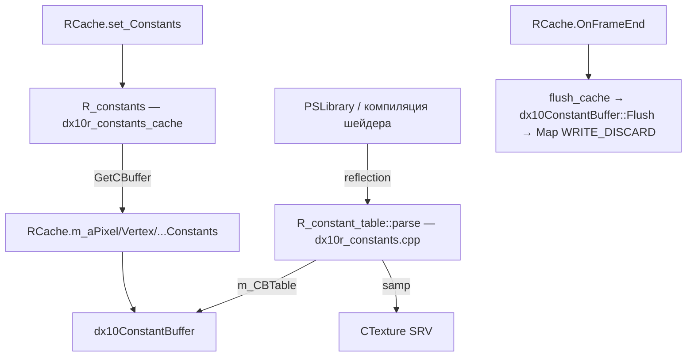
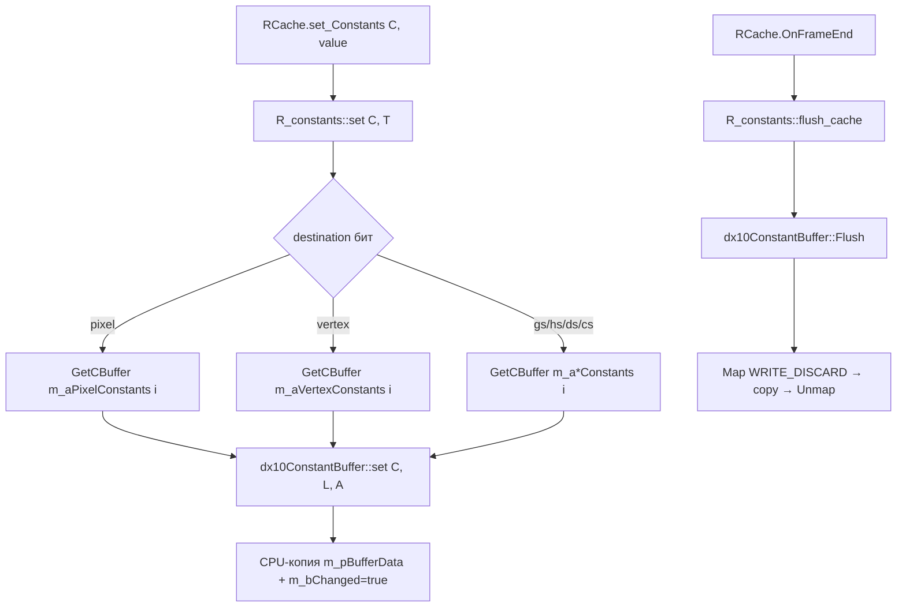

# Renderer: шейдерные константы

## 1. Ответственность

Модель шейдерных констант R4: описание констант/таблиц (`R_constant`/`R_constant_table`), разбор reflection-данных DX11-шейдеров в таблицы, кодирование CB-индексов в `destination`, запись значений в dynamic constant buffers (`dx10ConstantBuffer`, `R_constants`), flush в конце кадра. Плюс SH-ресурсы — обёртки GPU-объектов (VS/PS/GS/HS/DS/CS, состояния, декларации, RT, текстуры).

Страница — спутник [Устройства рендера](render-device.md) (порцион 2). CB-массивы живут в `RCache` (`CBackend`), полный API бэкенда — порционы 3/5.

## 2. Место в архитектуре

См. [Архитектура](../../architecture/overview.md), [Зависимости](../../architecture/dependencies.md).



- `R_constant`/`R_constant_table` — бэкенд-агностичное описание (`src/Layers/xrRender/r_constants.h/.cpp`).
- Активный parse — `src/Layers/xrRenderDX10/dx10r_constants.cpp` (D3D9-версия в `r_constants.cpp` — `#if !defined(USE_DX10) && !defined(USE_DX11)`, мёртвая в R4).
- Активный `R_constants` — `src/Layers/xrRenderDX10/dx10r_constants_cache.h/.cpp`; `r_constants_cache.h` — только include-shim (старый D3D9-код закомментирован L14–183).

## 3. Публичный API

| Класс/функция             | Назначение                                                                                                                                                |
| ------------------------- | --------------------------------------------------------------------------------------------------------------------------------------------------------- |
| `R_constant`              | Описание константы: `name`, `type` (RC_*), `destination`, `R_constant_load ps/vs/gs/hs/ds/cs/samp`, `handler`                                             |
| `R_constant_table`        | Таблица констант одного шейдера: `table` (сортированный `xr_vector<ref_constant>`), `m_CBTable` (CB-массив под DX10/11), `parse`, `merge`, `get`, `equal` |
| `R_constants` (dx10)      | Запись значений: `set(C, T)`, `seta(C, e, T)`, `flush()`, `access_direct`                                                                                 |
| `dx10ConstantBuffer`      | Dynamic `ID3DBuffer` + CPU-копия данных + dirty-флаг: `set/seta`, `AccessDirect`, `Flush`, `Similar`                                                      |
| `SVS/SPS/SGS/SHS/SDS/SCS` | Пакеты {shader + constants + signature} для каждой стадии                                                                                                 |
| `SState`                  | Пакет {ID3DState* + SimulatorStates}                                                                                                                      |
| `SDeclaration`            | Input layout: `vs_to_layout` + `dx10_dcl_code`/`dcl_code`                                                                                                 |
| `SInputSignature`         | `ID3DBlob*` signature                                                                                                                                     |
| `CConstant`               | Legacy FFP-константа (programmable/waveform)                                                                                                              |
| `CMatrix`                 | Legacy FFP-матрица (TCM/рефлексии)                                                                                                                        |
| `CRT`                     | Render-target обёртка (RTV/DSV/UAV)                                                                                                                       |
| `CTexture`                | Texture обёртка (SRV, видео/анимированные текстуры)                                                                                                       |

## 4. Внутреннее устройство

### Кодирование CB-индексов (`r_constants.h`)

Enums: `RC_float=0`, `RC_int=1`, `RC_bool=2`, `RC_sampler=99`, `RC_dx10texture=100`, `RC_dx11UAV=101`. Классы: `RC_1x1/RC_1x4/RC_1x3/RC_1x2/RC_2x4/RC_3x4/RC_4x4/RC_1x4a/RC_3x4a/RC_4x4a`.

Destination-флаги + **CB index encoding**:

```
RC_dest_pixel    = (1<<0)
RC_dest_vertex   = (1<<1)
RC_dest_sampler  = (1<<2)
RC_dest_geometry = (1<<3)
RC_dest_hull     = (1<<4)
RC_dest_domain   = (1<<5)
RC_dest_compute  = (1<<6)
```

В старших битах `destination` упакован **4-bit индекс CB** (0..14) по shader type:

| Shader type | shift | маска                            |
| ----------- | ----- | -------------------------------- |
| vertex      | 12    | `RC_dest_vertex_cb_index_mask`   |
| pixel       | 16    | `RC_dest_pixel_cb_index_mask`    |
| geometry    | 8     | `RC_dest_geometry_cb_index_mask` |
| hull        | 20    | `RC_dest_hull_cb_index_mask`     |
| domain      | 24    | `RC_dest_domain_cb_index_mask`   |
| compute     | 28    | `RC_dest_compute_cb_index_mask`  |

`CB_BufferTypeMask = 0x70`: `CB_BufferVertexShader=0x20`, `CB_BufferPixelShader=0x40`, и т.п. — тип CB кодируется в `m_CBTable[i].index`.

`R_constant_load {u16 index, u16 cls}` — `index` = **байтовый оффсет в CB** (под DX10/11), `cls` = RC_* класс.

`R_constant : xr_resource`: `shared_str name`, `u16 type`, `u32 destination`, `R_constant_load ps/vs/gs/hs/ds/cs/samp`, `R_constant_setup* handler`. `get_load(destination)` — switch по младшему байту.

`R_constant_table : xr_resource_flagged`: `c_table table` (сортированный по имени `xr_vector<ref_constant>`), `cb_table m_CBTable` (вектор `{u32 encoded index, ref_cbuffer}` под DX10/11). `merge` (D3D9-версия в `r_constants.cpp` — `#if !defined(USE_DX10) && !defined(USE_DX11)`; **активный parse — в `dx10r_constants.cpp`**). `get(name)` — lower_bound по сортированному `table` (shared_str). Деструктор → `DEV->_DeleteConstantTable(this)`.

`R_constant_setup` — абстрактный `setup(R_constant*)` (хук авто-заполнения констант).

### Parse reflection → таблица (`src/Layers/xrRenderDX10/dx10r_constants.cpp`)

**`parseConstants(ID3DShaderReflectionConstantBuffer*, destination)`** — обход reflection-переменных:

- Типы: `D3D10_SVT_FLOAT/BOOL/INT`.
- `r_index = VarDesc.StartOffset` (байтовый оффсет, `VERIFY < 0x10000`).
- Классы: `SCALAR`, `VECTOR` (4/3/2), `MATRIX_ROWS` (4x4, 4x3, 4x2).
- **`D3D10_SVC_OBJECT`** → `VERIFY(!"Implement shader object parsing.")` + **bSkip** — самплеры в CB **не** парсятся как константы (они идут через `parseResources`).

**`parseResources(pReflection, ResNum, destination)`** — `GetResourceBindingDesc`:

- `D3D10_SIT_TEXTURE` → `RC_dx10texture`
- `D3D10_SIT_SAMPLER` → `RC_sampler`
- `D3D11_SIT_UAV_RWTYPED` → `RC_dx11UAV`
- Bind point: `ResDesc.BindPoint + CTexture::rstPixel/rstVertex/rstGeometry/rstHull/rstDomain/rstCompute` (базовые оффсеты стадий).
- `destination = RC_dest_sampler`, `samp.load` получает index+cls.

**`R_constant_table::parse` (L364):**

```cpp
// на каждый constant buffer iBuf:
updatedDest = destination | (iBuf << dest_to_shift_value(destination));
uiBufferIndex = iBuf | dest_to_cbuf_type(destination);
parseConstants(...);
Resources->_CreateConstantBuffer(pTable) → m_CBTable.push_back({uiBufferIndex, tempBuffer});
parseResources(...);
std::sort(table, p_sort);  // финальная сортировка по имени
```

### `R_constants` (`src/Layers/xrRenderDX10/dx10r_constants_cache.h/.cpp`)

Активный класс (тот же имя, что у закомментированного D3D9-наследника в `r_constants_cache.h`).

- `set(R_constant*, T)` / `seta(C, e, T)` — шаблоны, диспетчеризация по destination-биту → `set(C, C->ps/vs/gs/hs/ds/cs, A, BT_*)`.
- Приватные `set/seta` для `Fmatrix/Fvector4/float/int` → `GetCBuffer(C, BType)` → `dx10ConstantBuffer&` → `Buffer.set(C, L, A)` / `Buffer.seta(...)`.
- `GetCBuffer` (cpp L6): декодирует CB index из `C->destination` (mask/shift) → `RCache.m_aPixelConstants[i]` / `m_aVertexConstants[i]` / `m_aGeometryConstants[i]` / `m_aHullConstants[i]` / `m_aDomainConstants[i]` / `m_aComputeConstants[i]` (`VERIFY` non-null).
- `flush_cache()` — `Flush()` всех non-null буферов в 6 массивах (0..MaxCBuffers-1=13).
- `access_direct(C, DataSize, ppVData, ppGData, ppPData)` — прямой pointer в mapped CB data для bulk-записи.
- `flush()` неconditionally вызывает `flush_cache()`.

### `dx10ConstantBuffer` (`src/Layers/xrRenderDX10/dx10ConstantBuffer.h`)

`dx10ConstantBuffer : xr_resource_named`:

- `ID3DBuffer` (dynamic, `D3D_CPU_ACCESS_WRITE`), CPU-копия `m_pBufferData`, `m_bChanged` dirty-флаг, `m_MembersList` (reflection type descs).
- `set/seta` для `Fmatrix/Fvector4/float/int` — запись в CPU-копию.
- `AccessDirect` — pointer в mapped region.
- `Flush()` — `Map WRITE_DISCARD` → копирование CPU data → Unmap (если `m_bChanged`).
- `Similar` — сравнение для кэша.
- Создаётся через `Resources->_CreateConstantBuffer(pTable)`. `ref_cbuffer` typedef.

### SH-ресурсы (`src/Layers/xrRender/SH_*`)

**`SH_Atomic.h/.cpp`** — атомарные GPU-обёртки (все `xr_resource_named`/`flagged`, деструкторы через `DEV->_Delete*`):

- `SInputSignature` — DX10/11: `ID3DBlob* signature` wrapper.
- `SVS {ID3DVertexShader* vs, R_constant_table constants, ref_input_sign signature}`.
- `SPS {ps, constants}`, `SGS {gs, constants}` (DX10/11).
- `SHS/SDS/SCS {sh, constants}` — hull/domain/compute (DX11 only).
- `SState {ID3DState* state, SimulatorStates state_code}`.
- `SDeclaration` — DX10/11: `xr_map<ID3DBlob*, ID3DInputLayout*> vs_to_layout` + `dx10_dcl_code` (INPUT_ELEMENT_DESC array) + `dcl_code` (DX9-style для сравнения); D3D9: `IDirect3DVertexDeclaration9* dcl`.
- typedef'ы: `ref_vs/ref_ps/ref_gs/ref_hs/ref_ds/ref_cs/ref_state/ref_declaration/ref_input_sign`.

**`SH_Constant.h/.cpp`** — `CConstant : xr_resource_named`:

- `Fcolor const_float` + `u32 const_dword`, режимы `modeProgrammable=0/modeWaveForm`.
- WaveForms `_R/_G/_B/_A`.
- `Calculate()` per-frame (кэш по `dwFrame == RDEVICE.dwFrame`): в waveform-режиме `set_float(_R.Calculate(t), ...)` с `t = RDEVICE.fTimeGlobal`.
- `Similar` — mode+waveforms; Load/Save (waveform mode).
- **Legacy FFP-анимированная константа** — в R4 не используется активно, но тип ресурса жив.

**`SH_Matrix.h/.cpp`** — `CMatrix : xr_resource_named`:

- `Fmatrix xform`, режимы `modeProgrammable=0/modeTCM/modeS_refl/modeC_refl/modeDetail`.
- TCM-флаги `tcmScale/tcmRotate/tcmScroll`, WaveForms `scaleU/scaleV/rotate/scrollU/scrollV`.
- `Calculate()` per-frame:
  - `modeTCM` — UV transform (center .5,.5 → rotate `rotate(t)*t` → scale → scroll `*sU/sV` → uncenter).
  - `modeS_refl` — screen-space reflection matrix из `RDEVICE.mView` (U/V basis rows ×.5).
  - `modeC_refl` — инверсия view (4-я строка zeroed).
- Load/Save.

**`SH_RT.h/.cpp`** — `CRT : xr_resource_named` (render-target обёртка):

- `ID3DTexture2D* pSurface`, `ID3DRenderTargetView* pRT`, `ID3DDepthStencilView* pZRT` (DX10/11), `ID3D11UnorderedAccessView* pUAView` (DX11).
- `ref_texture pTexture`, w/h/fmt, `_order` (creation timestamp).
- `resptrcode_crt` + `ref_rt`. Куб-версия `CRTC` — **закомментирована** (DX10 cut).

**`SH_Texture.h`** — `CTexture : xr_resource_named` (см. ниже).

### `CRT::create` (`src/Layers/xrRenderDX10/dx10SH_RT.cpp`)

DX11-сигнатура: `create(Name, w, h, f, SampleCount, useUAV)`:

- Asserts: device+name+w+h. Размер — cap `D3D_REQ_TEXTURE2D_U_OR_V_DIMENSION`.
- Usage из fmt (D24S8 и т.п. → depthstencil).
- **Format conversion**: `fmt != D3DFMT_D24S8` → `dx10TextureUtils::ConvertTextureFormat(fmt)`, иначе `DXGI_FORMAT_R24G8_TYPELESS`.
- `DEV->Evict()` перед create.
- `D3D_TEXTURE2D_DESC`: `MipLevels=1`, `SampleDesc.Count=SampleCount`.
- **BindFlags**: non-MSAA → `SHADER_RESOURCE | (DEPTH_STENCIL or RENDER_TARGET)`; MSAA → `D3D_STANDARD_MULTISAMPLE_PATTERN` quality (если `RImplementation.o.dx10_msaa_opt`) + (depth ? DEPTH_STENCIL : SRV|RT).
- **UAV**: если `FeatureLevel >= 11_0 && !depth && SampleCount==1 && useUAV` → добавить `D3D11_BIND_UNORDERED_ACCESS`.
- Create текстуры; depth → DSV (view format `D24_UNORM_S8_UINT` или `D32_FLOAT` (R32_TYPELESS)); MSAA → `D3D_DSV_DIMENSION_TEXTURE2DMS`; иначе RTV.
- UAV: `D3D11_UAV_DIMENSION_TEXTURE2D`, `NumElements = w*h`.
- Финал: `pTexture = DEV->_CreateTexture(Name); pTexture->surface_set(pSurface)`.

`destroy()`: release текстуры surface first, затем RTV/DSV/UAV/surface; stats_manager increment/decrement. `reset_begin/reset_end` (destroy + recreate с сохранёнными параметрами). `resptrcode_crt::create` → `DEV->_CreateRT(...)`.

### `CTexture` stage scheme

`ResourceShaderType` enum:

```
rstPixel    = 0
rstVertex   = D3DVERTEXTEXTURESAMPLER0
rstGeometry = rstVertex + 256
rstHull     = rstGeometry + 256
rstDomain   = rstHull + 256
rstCompute  = rstDomain + 256
rstInvalid
```

Базовые оффсеты стадий — используются `RCache::get_ActiveTexture` (маппинг `CTexture::rst*` ranges → `textures_ps[16]`/`textures_vs[4]`/`textures_gs[16]`/`textures_hs/ds/cs[16]` (DX11)) и `parseResources`.

Apply-функции: `apply_load/apply_theora/apply_avi/apply_seq/apply_gif/apply_normal` (видео/анимированные текстуры). `Preload/Load/PostLoad/Unload`. `surface_set/surface_get`, `get_SRView()`. Флаги `bLoaded/bUser/seqCycles/MemoryUsage/bLoadedAsStaging` (DX10/11 staging upload). `fastdelegate::FastDelegate1<u32> bind` (callback привязки текстуры). `m_is_hot/m_is_glowing` (DSR mod flags: HeatVision/SilencerOverheat). `m_play_time/seqMSPF` union, `seqDATA` (анимированные текстуры — массив surfaces), `m_pSRView` + `m_seqSRView` (DX10/11 SRV arrays), `desc_cache/desc` (кэш texture desc).

## 5. Взаимодействие

**Кто вызывает это:**

- `PSLibrary` (порцион 7) — компиляция шейдера → `R_constant_table::parse`.
- `RCache::set_Constants` — `R_constants::set` (порционы 3–14).
- `RCache::OnFrameEnd` — `flush_cache`.
- `ResourceManager` (порцион 7) — `_CreateConstantBuffer`, `_DeleteConstantTable`.

**Кто это вызывает:**

- `R_constants::set` → `dx10ConstantBuffer::set` → CPU-копия.
- `dx10ConstantBuffer::Flush` → `ID3DBuffer::Map WRITE_DISCARD`.
- `CRT::create` → `HW.pDevice->CreateTexture/...View` ([render-device.md](render-device.md)).
- `CConstant/Calculate` → `RDEVICE.fTimeGlobal` (legacy).

## 6. Потоки данных и управления

### Запись констант



### Parse шейдера

```mermaid
flowchart TD
    A[PSLibrary → компиляция → ID3DShaderReflection] --> B[R_constant_table::parse]
    B --> C[по каждому CB iBuf]
    C --> D[updatedDest = destination | iBuf << shift]
    D --> E[parseConstants — START_OFFSET → R_constant_load]
    E --> F[Resources->_CreateConstantBuffer → m_CBTable]
    C --> G[parseResources — SAMPLER/TEXTURE/UAV → samp.load]
    B --> H[std::sort table by name]
```

## 7. Конфигурация

| Параметр                   | Тип  | Действие                                                                                          |
| -------------------------- | ---- | ------------------------------------------------------------------------------------------------- |
| `dx10_msaa_opt`            | cvar | `CRT::create`: MSAA → `D3D_STANDARD_MULTISAMPLE_PATTERN` quality                                  |
| `ps_r4_hdr10_on`           | cvar | Влияет на swap chain format (см. [render-device.md](render-device.md)) — не на константы напрямую |
| `RCache.m_a*Constants[14]` | поля | `MaxCBuffers = 14` — максимум CB на shader type                                                   |

## 8. Известные ограничения и дебаг

1. **`R_constant_table::merge()`** — маркер `/// !!!!!!!!FIX THIS FOR DX11!!!!!!!!!` (L200 `r_constants.cpp`) — merge в DX11 **не проверен**.
2. **`parseConstants` — `D3D10_SVC_OBJECT`** → `VERIFY(!"Implement shader object parsing.")` + bSkip: самплеры в CB **не** парсятся как константы (они идут через `parseResources`).
3. **CB index 4-bit** — максимум 16 CB на shader type; `MaxCBuffers = 14` (2 не используются).
4. **`CConstant`/`CMatrix`** — legacy FFP-анимированные ресурсы; в R4 активно не используются, но типы живы в `ResourceManager`.
5. **`CRTC`** (cube RT) — **закомментирована** в `SH_RT.h` (DX10 cut).
6. **`r_constants_cache.h`** — 90% файла закомментированный D3D9-код; активен только include-shim на `dx10r_constants_cache.h`.
7. **`access_direct`** — прямой pointer в mapped CB; при использовании — нельзя менять `m_bChanged` (flush идёт по CPU-копии).
8. **`R_constant_load.index`** — байтовый оффсет в CB (не регистр); `VERIFY < 0x10000` (64KB limit).
9. **`RTV/DSV` форматы** — depth: `D24_UNORM_S8_UINT` или `D32_FLOAT` (R32_TYPELESS); non-depth — из `ConvertTextureFormat(fmt)`.
10. **UAV** — только non-depth, non-MSAA, `FeatureLevel >= 11_0`; `NumElements = w*h`.
