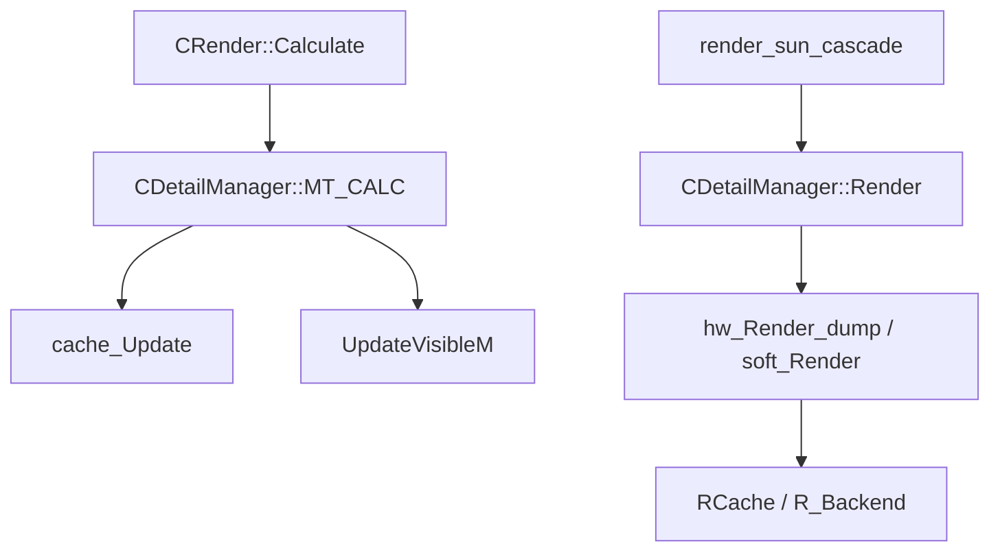
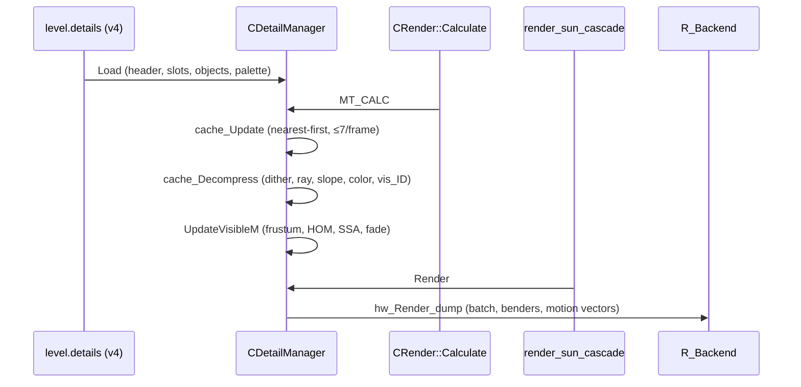

# Renderer: детали (grass/крюки)

> Итерация 3, порцион 10. Активный бэкенд — R4 (DX11); D3D9-ветки помечены.

## Ответственность

Система детализации ландшафта — травы и других мелких объектов («деталей»),
генерируемых **на лету** из плотностных слоёв, хранящихся в сжатом виде в
`level.details` (формат v3/v4). Задачи:

- загрузка и кэширование слотов деталей (плотность/высота/цвет/палитры);
- ленивый «декомпресс» слотов вблизи игрока (лимит на кадр);
- расчёт видимого набора деталей за кадр (`UpdateVisibleM`) — frustum, SSA,
  fade, выбор wave-варианта;
- рендер: hw (vertex shader, DX11) и soft (CPU) конвейеры, ветер/волны,
  interactive grass (benders), motion vectors;
- данные моделей деталей (`CDetail`) и blenders (`B_DETAIL`, `B_TREE`).

## Место в архитектуре

- Владелец — `CRender` (`RImplementation`): поле `Details`
  ([Обзор](index.md), [Точка входа](factory.md)).
- Вызовы на кадр:
  - `Calculate` → `Details->MT_CALC()` ([Пайплайн: секторы](sector.md));
  - `render_sun_cascade` → `Details->Render()` при `rsGrassShadow`
    ([VSM / SMAP](vsm-smap.md));
  - `Load`/`Unload` из `CRender::level_Load`/`level_Unload` ([Обзор](index.md)).
- Шейдеры: `details\set` (grass VS/PS, `grass_align`), `details\set\wind`
  (interactive benders), tree-шейдеры (`tree\set` — рендер деревьев
  [Визуалы](visuals.md), порцион 8).
- Константы grass benders — из `GData` (`grass_shader_data`,
  `IGame_Persistent::GrassBenders*` — [Персистент](../xr-engine/persistent.md),
  итерация 2).

## Публичный API

`CDetailManager` (DetailManager.h, реализация — 5 файлов + `dx10DetailManager_VS.cpp`):

| Метод                                       | Назначение                                                                                                                         |
| ------------------------------------------- | ---------------------------------------------------------------------------------------------------------------------------------- |
| `Load(LEVEL_NAME, details_name, pSettings)` | загрузка `level.details` v3/v4, объектов, слотов, `cache_Initialize`, `hw_Load`/`soft_Load`, `swing_desc` из `[details]` pSettings |
| `Unload()`                                  | освобождение кэша, объектов, VB/IB                                                                                                 |
| `UpdateVisibleM(CFrustum&)`                 | пересчёт `m_visibles[0..2]` (still/wave1/wave2)                                                                                    |
| `Render()`                                  | рендер видимых деталей (hw/soft), флаг «begin of grass render»                                                                     |
| `MT_CALC()`                                 | once-per-frame: `cache_Update` + `UpdateVisibleM`                                                                                  |
| `MT_SYNC()`                                 | latch `m_frame_rendered` (вызывается из `Render`)                                                                                  |
| `details_clear()`                           | `fade_distance = 99999`; очистка `m_visibles` при `ps_ssfx_grass_shadows.x <= 0`                                                   |

Данные: `m_slots` (`Slot` grid), `cache_level1`/`cache`/`cache_pool`
(CACHE-файл), `m_visibles[3]` (0 = still, 1 = wave1, 2 = wave2),
`m_frame_calc`/`m_frame_rendered` (latch), `fade_distance`, `wind_strength_factor`,
`swing_desc` (`SSwingValue` — лerp-анимируемые амплитуда/фаза/частота волн).

Константы: `dm_size = 24` (grid-размер), `dm_cache1_count = 4`,
`dm_max_objects = 16383`, `dm_obj_in_slot = 4`, `DETAIL_SLOT_SIZE = 2.f`,
`DETAIL_RADIUS` — радиус «плотного» кэша, задаётся в конструкторе
(динамическая аллокация cache-массивов).

## Внутреннее устройство

### Формат данных (DetailFormat.h)

Файл `level.details`: `DetailHeader` + слоты.

- **v3** (legacy, 16 B/слот): 6-bit id объекта, `expand_v3`/`pack_v3`
  — расширение в 20 B при чтении.
- **v4** (рабочий, 20 B/слот): `DetailSlot` — `id0..id3` (4 × 14 bit),
  `c_dir`/`c_hemi` (4 bit), `y_base` (12 bit, шаг 20 см, смещение −200 м),
  `y_height` (8 bit, шаг 10 см), `palette[4]` (`DetailPalette` — 4 × 4 bit,
  индексы в 4-цветную палитру уровня). Поля `w_y`/`r_ybase`/`r_yheight`/
  `w_qclr`/`r_qclr` — read/write-обёртки.

Каждый слот хранит до 4 объектов (id + вариация) и плотностную/цветовую
информацию; реальные вершинные модели — в `level.objects` (см. `Load`).

### Кэш (DetailManager_CACHE.cpp)

- `cache_Initialize` — grid слотов + level1 «супер-слоты» (4×4 объединение)
  для coarse-видимости.
- `cache_Task` — пер-слот задача: empty-детект, `vis.box` из `y_base`/
  `y_height`, очистка items.
- `cache_Validate` — сверка версии/состава слота с файлом.
- `cache_Update` (из `MT_CALC`): сдвиг shift-matrix по позиции игрока,
  исполнитель задач — **nearest-first** по `distance`, лимит
  `dm_max_decompress = 7` (14 в редакторе) декомпрессий за кадр; полное
  unpack при заполнении слота; mega-update level1 vis.
- `QueryDB` — офсеты слота `dtH.offs_x/z`; out-of-bounds → `DS_empty`.

### Генерация объектов (DetailManager_Decompress.cpp)

`cache_Decompress` — «декомпрессия» слота в вершинный набор:

- box-query статики (`xrc`) в зоне слота;
- плотность: `density` × `ps_r__Detail_density`; jitter-разброс;
  `InterpolateAndDither` по 4×4→16×16 dither-карте `bwdithermap`;
- случайный выбор объекта — `CRandom`, seed = `hash2(sx, sz)`
  (детерминировано по слоту);
- позиция: grid + jitter; ray вниз по `triCount` (пропуск `flPassable`),
  slope-лимит `ps_ssfx_terrain_grass_slope`;
- scale: `m_fMinScale*0.5 .. m_fMaxScale*0.9` × `ps_current_detail_height`;
- `mRotY`: случайный yaw + выравнивание по нормали террейна
  (`ps_ssfx_terrain_grass_align`);
- цвет: `c_hemi`/`c_sun` из `qclr` слота;
- `vis_ID`: `0` = still (если `DO_NO_WAVING` или `!UseVS`), иначе
  `1` = wave1 (75%) / `2` = wave2 (25%);
- `Bounds` — tight по сгенерированным вершинам.

### Видимость (DetailManager.cpp)

`UpdateVisibleM` (раз в кадр из `MT_CALC`):

- frustum-тест `vis.box`;
- `HOM.visible` — occlusion (см. [Occlusion](occlusion.md));
- fade по `fade_distance`;
- SSA-фильтр: `r_ssaDISCARD` (отброс) / `r_ssaCHEAP` (упрощённый);
- `r_items[0..2]` — still/wave1/wave2 списки; заполнение `m_visibles`.

`MT_CALC` — latch `m_frame_calc`, условие `m_frame_rendered + 1 == dwFrame`
(расчёт не чаще, чем рендер).

### Рендер

`Render` — `MT_SYNC`; `m_blender_mode.w = 1` (флаг «begin of grass render»
для shader-bus, см. [Shader bus](shader-bus.md)); `wind_strength_factor`
(из [Окружение](../xr-engine/environment.md)); `CULL_NONE`; ветка hw/soft.

**Активный путь — `dx10DetailManager_VS.cpp` (DX10/11):**

- `hw_Load_Shaders` — `details\set`, константы `consts`/`wave`/`dir2D`/
  `array` + `s_consts`/`s_xform`/`s_array`;
- статические `prev_frame`/`prev_time`/`prev_dir1`/`prev_dir2` — motion
  vectors (состояние прошлого кадра, once-per-frame save);
- swing timers `m_time_rot_1/2`, `m_time_pos` (как в D3D9-ветке);
- `hw_Render_dump` (per-pass): `RCache.set_Element(lod_id, iPass)`;
  `set_c` по `shared_str` именам: `consts`/`wave`/`dir2D`/`xform`/
  `grass_align`/`wave_prev`/`dir2D_prev`;
- **interactive grass (benders)**: `ps_ssfx_grass_interactive` —
  `BendersQty = min(16, ps_ssfx_grass_interactive.y + 1)`, `player_pos`,
  `benders_pos`/`benders_prevpos`/`benders_setup` из `GData`
  (`g_pGamePersistent->grass_shader_data`);
- `exdata` — normal + alpha; `c_storage = array` (`hw_BatchSize` × 4 `Fvector4`);
- per instance: alpha lerp (`GoToValue`), scale-fade по `fade_distance`/
  `light_position`, 3×4 матрица + color `(s,s,s,h)` + exdata; batch flush;
- `vis.clear_not_free()` gated `ps_ssfx_grass_shadows.x <= 0` + R2-флаги.

`hw_Load_Geom` (общий, `DetailManager_VS.cpp`): вершина `vertHW`
(xyz float + `short4` u,v,t,mid, pack(1)), QC-квантование `quant = 16384`,
`hw_BatchSize = (dwRegisters − c_hdr = 10) / 4`, clamp 0..64; fill VB/IB
per object × batch; DX10/11 — `dx10BufferUtils::CreateVertexBuffer/
IndexBuffer` + CPU-копия (см. [Ресурсы](resources.md)).

> **D3D9-ветка** `hw_Render`/`hw_Render_dump` в `DetailManager_VS.cpp`
> **не компилируется** в R4 (`#if !defined(USE_DX10) && !defined(USE_DX11)`) —
> описана только для истории.

**Soft-конвейер** (`DetailManager_soft.cpp`, R1): `_VertexStream`/
`_IndexStream`, per-lock fill (`vs_size = 3000`), CPU-трансформ вершин,
рендерится **только `m_visibles[0]`** (still); wave-рендер — только hw.

### Модели деталей (DetailModel.h/.cpp)

`CDetail : IRender_DetailModel`:

- `Load` — shader `fnS`/`fnT`, `m_Flags` (`DO_NO_WAVING`),
  `m_fMinScale`/`m_fMaxScale`, вершины `fvfVertexIn` (P + u + v),
  индексы u16, `bv_bb`/`bv_sphere`;
- `Optimize` — `xrStripify`/`xrSimulate` (load-time, см. [Визуалы](visuals.md)),
  cache = `HW.Caps.geometry.dwVertexCache`;
- `transfer` — 2 версии: обычная и с du/dv offset для UV.

### Blenders

- `CBlender_Detail_Still` (`B_DETAIL`, version 0): `Compile` per R1/R2/R3 —
  R3-ветка (активна и в R4, т.к. `#else` после `RENDER==R_R2`):
  `SE_R2_NORMAL_HQ/LQ` → `uber_deffer` `detail_w`/`detail_s`, ATOC-вариант,
  stencil, cull none.
- `CBlender_Tree` (`B_TREE`, version 1, `canBeDetailed = TRUE`): R3-ветка —
  `tree`/`tree_s`/`tree_branch` (DX11 `ssfx_branches`), `uber_deffer`,
  `s_waves` `fx\wind_wave`, shadow `SE_R2_SHADOW`. Рендер деревьев —
  [Визуалы](visuals.md) (порцион 8), wind/wave константы там же.

### R_tree (R_Backend_tree)

`R_tree` — бандл `R_constant*` (`c_m_xform_v`/`c_m_xform`/`c_consts`/
`c_wave`/`c_wind`/`c_c_scale`/`c_c_bias`/`c_c_sun`) + `set_*`-обёртки
(R_cache-маппер для tree-шейдеров) в поле `R_Backend::tree`.
**В R4 не используется** (поиск по `src/Layers` не нашёл вызовов —
tree-рендер идёт через `RCache.set_c` напрямую из `FTreeVisual`,
[Визуалы](visuals.md)) — legacy-остаток, не удалять без проверки
R1/R2-сборок.

## Взаимодействие

- `CRender::Calculate` — `MT_CALC` (расчёт видимости)
  ([Пайплайн: секторы](sector.md)).
- `render_sun_cascade` — `Details->Render()` при `rsGrassShadow`
  ([VSM / SMAP](vsm-smap.md)).
- `GData` / `IGame_Persistent` — grass benders: `grass_shader_data`,
  `ps_ssfx_grass_interactive` ([Персистент](../xr-engine/persistent.md)).
- `CEnvironment` — `wind_strength_factor`, `wind_anim`
  ([Окружение](../xr-engine/environment.md)).
- `R_Backend`/`RCache` — draw calls, константы, VB/IB
  ([Устройство рендера](render-device.md), [Константы](constants.md),
  [Ресурсы](resources.md)).
- `HOM` / `CHOM` — occlusion-тест видимости слотов
  ([Occlusion](occlusion.md)).
- `level.details`/`level.objects` — данные
  ([LTX-формат](../../data/ltx-format.md), итерация 13).

## Потоки данных

## Конфигурация

| cvar / поле                   | Назначение                                                     |
| ----------------------------- | -------------------------------------------------------------- |
| `ps_r__Detail_density`        | множитель плотности генерации                                  |
| `ps_ssfx_terrain_grass_slope` | лимит наклона террейна для травы                               |
| `ps_ssfx_terrain_grass_align` | выравнивание травы по нормали                                  |
| `ps_ssfx_grass_interactive`   | interactive grass: x = вкл, y = число benders (0..15)          |
| `ps_ssfx_grass_shadows`       | x ≤ 0 — тени травы выкл (gate очистки vis, `details_clear`)    |
| `ps_current_detail_height`    | масштаб высоты деталей                                         |
| `ps_r2_wait_sleep` и др.      | не относится (см. [Occlusion](occlusion.md))                   |
| pSettings `[details]`         | `swing_desc` — амплитуда/фаза/частота волн (SSwingValue, lerp) |

## Ограничения-дебаг

- `m_visibles[3]` — 0 = still, 1 = wave1, 2 = wave2 (vis_ID).
- `dm_max_decompress = 7` (14 в редакторе) — декомпрессий за кадр;
  при большем количестве слотов вблизи — ленивое заполнение.
- `DETAIL_RADIUS` — радиус «плотного» кэша; вне него — only level1 vis.
- v3-формат — legacy: читается через `expand_v3` (6-bit id → 14-bit).
- `soft_Render` рендерит только still; wave — только hw.
- `hw_Render_dump` — batch flush по `hw_BatchSize`; `c_storage` =
  `hw_BatchSize` × 4 `Fvector4` (арей-буфер инстансов).
- `R_tree` — мёртвый в R4 (см. выше).
- Debug-рендер: `hw_Render_dump` — `RCache.set_Element(lod_id, iPass)`;
  имена констант — `shared_str` (опечатка → молча пропуск).
