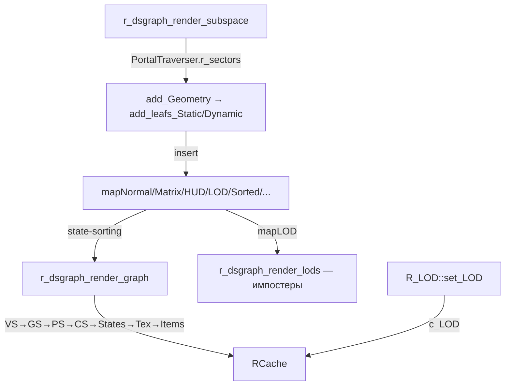
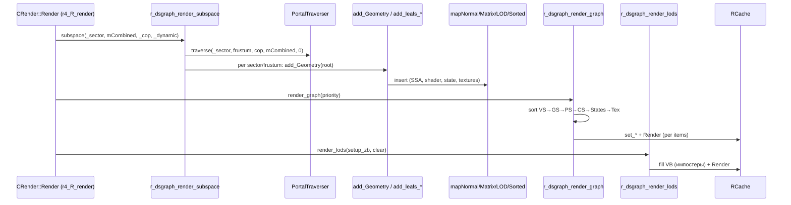

# Renderer: динамическая сцена (dsgraph)

## 1. Ответственность

Динамическая сцена графа рендера: вставка визуалов в state-sorting иерархию (`r_dsgraph_insert_*`), state-sorting рендер (VS→GS→PS→CS→States→Textures→Items, минимизация переключений состояний) и LOD-импостеры. Не выбирает, *что* видно (это traversal — [sector](sector.md), occlusion — [occlusion](occlusion.md)) — только *как* отсортировать и отрисовать видимое.

Историческое ядро (`xrRender/`), переиспользуемое в R4.

## 2. Место в архитектуре

См. [Архитектура](../../architecture/overview.md), [Зависимости](../../architecture/dependencies.md), [Пайплайн: секторы](sector.md).

- `R_dsgraph_structure` — базовый класс `CRender` (R4: `r4.h`). Все карты-состояния и списки — в нём.
- `r_dsgraph_render_subspace` — вызывается из R4-пайплайна ([R4: scene](r4-scene.md)) для рендера сектора (статика через `PortalTraverser.r_sectors` + динамика через `q_frustum`).
- `R_LOD` — R4-обёртка LOD-константы (shader-based LOD).



## 3. Публичный API

| Класс/функция | Назначение |
|---|---|
| `R_dsgraph_structure` | Базовый класс `CRender`: `r_dsgraph_insert_dynamic/static`, `r_dsgraph_render_graph/hud/hud_ui/cam_ui/lods/sorted/emissive/wmarks/distort/landscape/water/water_ssr`, `r_dsgraph_render_subspace`, `add_Geometry`/`add_leafs_Static`/`add_leafs_Dynamic`, `r_pmask`, `r_dsgraph_destroy` |
| `R_dsgraph` (namespace) | Типы: `_NormalItem`/`_MatrixItem`/`_MatrixItemS`/`_LodItem`, `mapNormal_T`/`mapMatrix_T` (state-sorting иерархии), `mapSorted_T`/`mapHUD_T`/`mapLOD_T` (сортированные) |
| `R_LOD` | `set_LOD(float)` (shader LOD-константа), `set_LOD(R_constant*)`, `unmap()` |
| `R_feedback` | Маркерный интерфейс: `rfeedback_static(dxRender_Visual*)` (feedback рендеримой геометрии) |

## 4. Внутреннее устройство

### `R_dsgraph_structure` — карты-состояния (`r__dsgraph_structure.h`)

**State-sorting иерархии** (NORMAL и MATRIX — два параллельных дерева):

- **NORMAL** (статика, `val_pTransform == NULL`): `mapNormalPasses[2][SHADER_PASSES_MAX]` — `FixedMAP`-иерархия:
  ```
  mapNormalVS (vs_type) → [GS: mapNormalGS →] [PS: mapNormalPS → [HS/DS + CS: mapNormalCS →] mapNormalStates (ID3DState*) → mapNormalTextures (STextureList*) → mapNormalItems (_NormalItem[])]
  ```
  `vs_type`/`ps_type`/`gs_type`/`hs_type`/`ds_type` — в R4: `SVS*`/`ID3DPixelShader*`/`ID3DGeometryShader*`/`ID3D11HullShader*`/`ID3D11DomainShader*` (или `ref_*` под `USE_RESOURCE_DEBUGGER`).

- **MATRIX** (динамика, с xform): `mapMatrixPasses[2][SHADER_PASSES_MAX]` — та же иерархия, но `_MatrixItem` (копия `Matrix`/`PrevMatrix`).

- **Сортированные** (по SSA/дистанции): `mapSorted` (`_MatrixItemS`, `distSQ`), `mapHUD`/`mapCamAttached`/`mapLOD` (`_LodItem`), `mapDistort`/`mapHUDDistort`, `mapHUDSorted`/`mapCamAttachedSorted`, `mapLandscape`, `mapWater`, `HUDMaskCamAttached`; DX11: `mapScopeHUD`/`mapScopeHUDSorted` (3D shader scopes, Redotix99).

- **Emissive/wmarks** (`RENDER != R_R1`): `mapWmark`, `mapEmissive`, `mapHUDEmissive`, `mapCamAttachedEmissive`.

**Runtime-списки**: `nrmVS/nrmGS/nrmPS/nrmCS/nrmStates/nrmTextures/nrmTexturesTemp` (NORMAL), `matVS/matGS/matPS/matCS/matStates/matTextures/matTexturesTemp` (MATRIX), `lstLODs`/`lstLODgroups`/`lstRenderables`/`lstSpatial`/`lstVisuals`/`lstRecorded`.

**Feedback/recorder**: `val_pObject/val_pTransform/val_bHUD/val_bCamAttached/val_bInvisible/val_bRecordMP/val_feedback/val_feedback_breakp/val_recorder`; `phase`, `marker`, `pmask[2]`/`pmask_wmark`; `counter_S/D`.

`r_dsgraph_destroy()` — `destroy()` всех карт + `clear()` всех списков.

### `r_dsgraph_insert_dynamic` / `r_dsgraph_insert_static` (`r__dsgraph_build.cpp`)

**`r_dsgraph_insert_dynamic(pVisual, Center)`**:
1. `vis.marker == RI.marker` → return (уже вставлен в этом кадре); `vis.marker = RI.marker`.
2. `SSA = CalcSSA(distSQ, Center, pVisual)` = `R / distSQ` (R = `vis.sphere.R`); `SSA <= r_ssaDISCARD` → return.
3. **Distortion**: `sh_d = &*shader->E[4]` (L_special), `o.distortion && sh_d->flags.bDistort && pmask[...]` → `mapDistort`/`mapHUDDistort` (insert `distSQ`).
4. `sh = rimp_select_sh_dynamic(pVisual, distSQ)`; `!pmask[sh->flags.iPriority/2]` → return.
5. **DX11 3D scopes** (`sh->flags.iScopeLense`): 1 → `mapHUD` (EPS), 2 → `mapScopeHUD` (`distSQ`), 3 → `mapScopeHUDSorted` (`distSQ`).
6. Иначе — вставка в `mapNormalPasses`/`mapMatrixPasses` (по `val_pTransform`).

**`r_dsgraph_insert_static(pVisual)`** — аналогично, но для статики (без xform, `mapNormalPasses`).

**`add_leafs_Dynamic(pVisual)`** (по `pVisual->Type`):
- `MT_PARTICLE_GROUP` — все children → `add_leafs_Dynamic`.
- `MT_HIERRARHY` — все children → `add_leafs_Dynamic`.
- `MT_SKELETON_ANIM/RIGID` — `m_lod` + `ssa < r_ssaLOD_A` → `add_leafs_Dynamic(m_lod)` (LOD-импостер скелета); иначе `CalculateBones(TRUE)` + `CalculateWallmarks()` + children.
- `default` — `r_dsgraph_insert_dynamic(pVisual, Tpos)`.

**`add_leafs_Static(pVisual)`** (по `pVisual->Type`):
- `!HOM.visible(pVisual->vis)` → return (HOM-culling, см. [occlusion](occlusion.md)).
- `phase != PHASE_NORMAL && eNoShadow` → return.
- `eIgnoreOptimization && !IsValuableToRender(...)` → return.
- `MT_PARTICLE_GROUP`/`MT_HIERRARHY` — children.
- `MT_SKELETON_ANIM/RIGID` — `CalculateBones(TRUE)` + children.
- `MT_LOD` (`FLOD`) — `ssa = CalcSSA(...) * lod_factor`; `ssa < r_ssaLOD_A`:
  - `ssa < r_ssaDISCARD` → return;
  - иначе → `mapLOD` (импостер, `distSQ`);
  - `ssa > r_ssaLOD_B || phase == PHASE_SMAP` → children (полная геометрия).
- `MT_TREE_PM/MT_TREE_ST`/`default` — `r_dsgraph_insert_static`.

### `r_dsgraph_render_graph` (`r__dsgraph_render.cpp`)

State-sorting рендер NORMAL (и MATRIX) для pass-ов:

1. `RenderDUMP.Begin()` (Device.Statistic).
2. `set_xform_world(Fidentity)`.
3. **Per pass** (`iPass < SHADER_PASSES_MAX`):
   - `vs = mapNormalPasses[_priority][iPass]`; `vs.getANY_P(nrmVS)` → `std::sort(cmp_vs_nrm)` (по SSA).
   - **Per VS**: `set_VS`; **per GS** (`USE_DX10/11`): `set_GS`, sort; **per PS**: `set_PS`; **per CS** (`USE_DX11`: `set_HS`/`set_DS`): `set_Constants`; **per States**: `set_States`; **per Textures**: `set_Textures` + `apply_lmaterial`; **items**: `mapNormal_Render(items)` (рендер всех визуалов с одинаковым state-набором).
   - `items.clear()` if `_clear`.
4. Сброс `nrm*` списков после каждого уровня.

`cmp_vs_nrm`/`cmp_ps_nrm`/... — сортировка по SSA (экранная площадь), минимизация переключений.

### `r_dsgraph_render_lods` (`r__dsgraph_render_lods.cpp`) — LOD-импостеры

1. `mapLOD.getLR(lstLODs)` (front-to-back, `_setup_zb`) или `getRL` (back-to-front).
2. `shid = _setup_zb ? SE_R1_LMODELS : SE_R1_NORMAL_LQ`.
3. **Fill VB**: `uiVertexPerImposter = 4`, `uiImpostersFit = RCache.Vertex.GetSize() / (vb_stride * 4)`; per-импостер:
   - `alpha`: `scale = (ssa - r_ssaLOD_B) / (r_ssaLOD_A - r_ssaLOD_B)`, `iA = (1 - scale) * 255`.
   - **Выбор граней**: `Ldir = normalize(sphere.P - camera)`; 8 `FLOD::_face` (N — нормаль); `dot = Ldir · N` → sort; `best`/`next`/`next_2` → `alpha_blend = 0.5 + 0.5 * (1 - (fB - fC) / (fA - fC))`.
   - 4 вершины (quad): `p0/p1` (позиции FB/FA + shift), `n0/n1` (нормали), `sun_af` (цвет sun + alpha), `t0/t1` (UV), `rgbh0/rgbh1` (hemi).
4. **Render**: per pass, per group (по shader): `set_Element(shid, pass)`, `set_Geometry(firstV->geom)`, `Render(TRIANGLELIST, vOffset, 0, 4*count, 0, 2*count)` (4 вершины, 2 индекса на импостер).
5. `stat.r.s_flora_lods.add(4 * p_count)`.

### `r_dsgraph_render_subspace` (`r__dsgraph_render.cpp`)

Рендер сектора (вызывается из R4-пайплайна):
1. **DualRender-принудитель**: box-query в `rmPortals` (радиус `EPS_L * 20`) → `bDualRender = TRUE` для попавшихся.
2. `PortalTraverser.traverse(_sector, ViewBase, _cop, mCombined, 0)` (см. [sector](sector.md)).
3. **Статика**: per `r_sectors[s]` → per `r_frustums[v]` → `set_Frustum` + `add_Geometry(root)` (→ `add_leafs_Static`).
4. **Динамика** (`_dynamic`): `q_frustum(STYPE_RENDERABLE)` → per renderable: `sector->r_marker == i_marker` (видимый сектор) + `View->testSphere_dirty` → `renderable->renderable_Render()`.

### `R_LOD` (`src/Layers/xrRenderPC_R4/R_Backend_LOD.cpp`)

- `c_LOD` — `R_constant*` (shader-константа LOD).
- `set_LOD(float LOD)`: `factor = clampr(ceil(LOD⁵ * 8), 1, 7)` → `RCache.set_c(c_LOD, factor)`.
- `set_LOD(R_constant* C)` / `unmap()` — установка/сброс константы.

## 5. Взаимодействие

- **Вызывает**: `RCache` (state-setters, render), `CHOM::visible` (add_leafs_Static), `PortalTraverser` (subspace), `g_SpatialSpace->q_frustum` (динамика), `rimp_select_sh_dynamic` (shader-выбор), `apply_lmaterial` (light-материал).
- **Вызывается из**: `CRender::Render`/`RenderToTarget` (r4_R_render — [R4: scene](r4-scene.md)), `CRender::Calculate` (вставка динамики), `FStaticRender` (R1, не активен).
- Зависимости: `r__dsgraph_types.h` (типы), `r__sector.h` (CSector/CPortal), `xrEngine/render.h` (`IRender_interface`), `xrCDB/ispatial.h` (`ISpatial`).

## 6. Потоки данных/управления



## 7. Конфигурация

- `ps_r__ssaDISCARD`, `ps_r2_ssaLOD_A`, `ps_r2_ssaLOD_B` — SSA-пороги (в `Calculate`, см. [sector](sector.md)).
- `ps_r__LOD` — множитель LOD (в `g_fSCREEN`).
- `r_pmask(true, true)` — pass-маски (по умолчанию оба pass'а включены).
- `rsOcclusionDraw` — DEBUG (см. [sector](sector.md)).

## 8. Известные ограничения/дебаг

- `mapNormalPasses[2]` / `mapMatrixPasses[2]` — 2 приоритета (`priority/2`); `pmask[2]` — по 1 bit на приоритет.
- `add_leafs_Dynamic` для `MT_SKELETON_ANIM/RIGID` — `CalculateWallmarks()` с комментарием `//. bug?` (подозрительный вызов).
- `FLOD` — 8 граней (куб-импостер); выбор 2 лучших по dot + blend с 3-й.
- `R_LOD::set_LOD` — `LOD⁵ * 8` (clampr 1..7) — магическая кривая.
- `R_feedback` — маркерный интерфейс (нет реализации в xrRender; используется xrGame).
- `mapLOD.getLR`/`getRL` — front-to-back / back-to-front (по `_setup_zb`).
- `counter_S/D` — счётчики статик/динамик (для отладки).
- `lstRecorded`/`val_recorder` — coarse-структура recorder (multi-pass).
- DEBUG: `USE_RESOURCE_DEBUGGER` — `ref_*` вместо сырых указателей; `USE_DOUG_LEA_ALLOCATOR_FOR_RENDER` — кастомный аллокатор.
