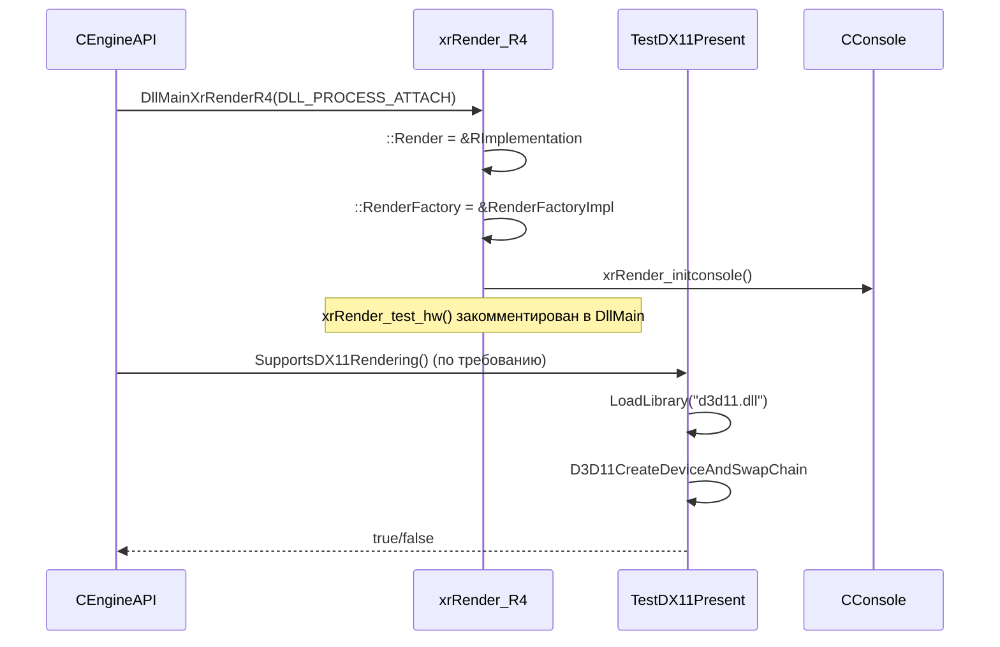

# Renderer: точка входа и фабрика

## 1. Ответственность

Точка входа R4-бэкенда: установка глобальных указателей рендера, регистрация консольных cvar'ов, проверка HW, фабрика render-объектов. Не реализует рендер — только инициализация и создание объектов.

## 2. Место в архитектуре

См. [Архитектура](../../architecture/overview.md), [Зависимости](../../architecture/dependencies.md).

`DllMainXrRenderR4` вызывается из `CEngineAPI` (xrEngine) при запуске. `RenderFactoryImpl` используется через `::RenderFactory` для создания `IFontRender`, `IImGuiRender` и т.д.

## 3. Публичный API

| Класс/функция | Назначение |
|---|---|
| `DllMainXrRenderR4` | Точка входа R4: `::Render = &RImplementation`, `::RenderFactory = &RenderFactoryImpl`, `::DU = &DUImpl`, `UIRender = &UIRenderImpl`, `DRender = &DebugRenderImpl`, `xrRender_initconsole()` |
| `SupportsDX11Rendering` | `extern "C"` экспортер: `xrRender_test_hw() ? true : false` |
| `xrRender_test_hw` | Проверка DX11: `TestDX11Present()` (LoadLibrary d3d11.dll, D3D11CreateDeviceAndSwapChain) |
| `TestDX11Present` | Создаёт window class + window + DXGI swap chain, проверяет feature level 11.0 |
| `dxRenderFactory` | Фабрика: `Create*/Destroy*` для ~20 типов render-объектов |
| `RenderFactoryImpl` | Глобальный экземпляр `dxRenderFactory` |
| `xrRender_initconsole` | Регистрация ~200 cvar'ов (r1_*, r2_*, r3_*, r4_*, ssfx_*, shader_param_*, markswitch_*, heat_vision_*, sil_glow_*) |
| `RImplementation` | Глобальный `CRender` (R4), `r4.cpp` |
| `::Render` | `IRender_interface*`, xrAPI.h |
| `::RenderFactory` | `dxRenderFactory*`, xrAPI.h |
| `::DU` | `CDUInterface*`, xrAPI.h |
| `UIRender` | `IUIRender*`, xrAPI.h |
| `DRender` | `IDebugRender*`, xrAPI.h |

## 4. Внутреннее устройство

### `DllMainXrRenderR4` (`xrRender_R4.cpp`)

```cpp
BOOL DllMainXrRenderR4(HANDLE hModule, DWORD ul_reason_for_call, LPVOID lpReserved)
{
    switch (ul_reason_for_call)
    {
    case DLL_PROCESS_ATTACH:
        //  Can't call CreateDXGIFactory from DllMain
        //if (!xrRender_test_hw())  return FALSE;
        ::Render = &RImplementation;
        ::RenderFactory = &RenderFactoryImpl;
        ::DU = &DUImpl;
        UIRender = &UIRenderImpl;
        DRender = &DebugRenderImpl;
        xrRender_initconsole();
        break;
    case DLL_THREAD_ATTACH:
    case DLL_THREAD_DETACH:
    case DLL_PROCESS_DETACH:
        break;
    }
    return TRUE;
}
```

- Вызывается из `CEngineAPI::InitializeNotDedicated`/`CreateRendererList` (xrEngine) при `STATIC_RENDERER_R4`.
- `xrRender_test_hw()` **закомментирован** в `DllMain` (комментарий: «Can't call CreateDXGIFactory from DllMain»).
- `::vid_mode_token` — не инициализируется здесь (комментарий: «inited by HW»).
- `SupportsDX11Rendering()` — `extern "C"` экспортер, вызывает `xrRender_test_hw()`.

### `xrRender_test_hw` (`r2_test_hw.cpp`, xrRenderPC_R4)

```cpp
BOOL xrRender_test_hw()
{
    //CHW  _HW;
    //HRESULT hr;
    //_HW.CreateD3D();
    //hr = _HW.m_pAdapter->CheckInterfaceSupport(__uuidof(ID3DDevice), 0);
    //_HW.DestroyD3D();
    return TestDX11Present();
}
```

`TestDX11Present()`:
1. `LoadLibrary("d3d11.dll")` — если не загрузился → `Msg("* DX11: failed to load d3d11.dll")`, return false.
2. `GetProcAddress(hD3D11, "D3D11CreateDeviceAndSwapChain")` — если не найден → `Msg("* DX11: failed to get address of ...")`, return false.
3. Регистрирует window class `TestDX11WindowClass` (`WndProc2` → `DefWindowProc`).
4. Создаёт window `WS_OVERLAPPEDWINDOW`, 800×600, `DXGI_FORMAT_R8G8B8A8_UNORM`, 60Hz, 1 sample.
5. `D3D11CreateDeviceAndSwapChain(NULL, D3D_DRIVER_TYPE_HARDWARE, NULL, 0, {D3D_FEATURE_LEVEL_11_0}, 1, D3D11_SDK_VERSION, &sd, ...)` — проверяет `SUCCEEDED(hr)`.
6. Освобождает все ресурсы, `FreeLibrary`, `DestroyWindow`.

Старая DX10-проверка (`CHW`, `CheckInterfaceSupport(__uuidof(ID3DDevice), 0)`) **закомментирована**.

### `dxRenderFactory` (`dxRenderFactory.h/.cpp`)

Фабрика без интерфейса (комментарий: `/* : public IRenderFactory */` — `IRenderFactory` в `RenderFactory.h` **закомментирован**).

```cpp
#define RENDER_FACTORY_IMPLEMENT(Class) \
    I##Class* dxRenderFactory::Create##Class() \
    { \
        return xr_new<dx##Class>(); \
    } \
    void dxRenderFactory::Destroy##Class(I##Class *pObject) \
    { \
        xr_delete((dx##Class*&)pObject); \
    }
```

Создаваемые типы (все `#ifndef _EDITOR`, кроме `FontRender`):

| Тип | Условие |
|---|---|
| `UISequenceVideoItem` | always |
| `UIShader` | always |
| `StatGraphRender` | always |
| `ConsoleRender` | always |
| `RenderDeviceRender` | always |
| `ObjectSpaceRender` | `DEBUG` only |
| `ApplicationRender` | always |
| `WallMarkArray` | always |
| `StatsRender` | always |
| `FlareRender` | always |
| `ThunderboltRender` | always |
| `ThunderboltDescRender` | always |
| `RainRender` | always |
| `LensFlareRender` | always |
| `ImGuiRender` | always |
| `EnvironmentRender` | always |
| `EnvDescriptorMixerRender` | always |
| `EnvDescriptorRender` | always |
| `FontRender` | always (вне `#ifndef _EDITOR`) |

Глобал: `dxRenderFactory RenderFactoryImpl;` (`dxRenderFactory.cpp`).

### `xrRender_initconsole` (`xrRender_console.cpp`)

Регистрация ~200 cvar'ов через `CMD1`–`CMD4`. Основные группы:

- **Common**: `screenshot`, `r__dtex_range`, `r__wallmark_ttl`, `r__supersample`, `r__geometry_lod`, `r__detail_density`, `r__detail_height`, `r__no_ram_textures`, `r__tf_aniso`, `r__tf_mipbias`, `r2_aa`, `r2_aa_kernel`, `r2_mblur`, `r__exposure`, `r__gamma`, `r__saturation`, `r__color_grading`, `r__bloom_weight`, `r__bloom_thresh`, `r__nightvision`, `r__fakescope`, `r__3Dfakescope`, `r__heatvision`, `r2_terrain_z_prepass`, `r2_water_reflections`, `r2_mblur_enabled`, `r__lens_flares`, `r2_smaa`, `r2_gi`, `r2_gi_clip/depth/photons/refl`.
- **R1** (legacy): `r1_ssa_lod_a/b`, `r1_lmodel_lerp`, `r1_dlights`, `r1_dlights_clip`, `r1_pps_u/v`, `r1_glows_per_frame`, `r1_detail_textures`, `r1_fog_luminance`, `r1_software_skinning`.
- **R2**: `r2_ssa_lod_a/b`, `r2em`, `r2_tonemap*`, `r2_ls_bloom_*`, `r2_ls_dsm_kernel`, `r2_ls_psm_kernel`, `r2_ls_ssm_kernel`, `r2_ls_squality`, `r2_zfill`, `r2_zfill_depth`, `r2_allow_r1_lights`, `r__actor_shadow`, `r2_gloss_factor/min`, `r_screenshot_mode`, `r2_sun`, `r2_sun_details`, `r2_sun_focus`, `r2_exp_donttest_shad`, `r2_sun_tsm`, `r2_sun_tsm_proj/bias`, `r2_sun_near/far`, `r2_sun_near_border`, `r2_sun_depth_*`, `r2_sun_lumscale*`, `r2_sun_lumscale_color` (demonized), `r2_dof`, `r2_dof_*`, `r2_dof_enable`, `r2_volumetric_lights`, `r2_sunshafts_mode`, `r2_ss_sunshafts_*`, `r2_tnmp_*` (tonemap).
- **R3**: `r3_msaa`, `r3_use_dx10_1`, `r3_msaa_alphatest`, `r3_minmax_sm`, `r3_dynamic_wet_surfaces*`, `r3_volumetric_smoke`.
- **R4** (HDR10): `r4_hdr10_on`, `r4_hdr10_whitepoint_nits`, `r4_hdr10_ui_nits`, `r4_hdr10_pda_intensity`, `r4_hdr10_colorspace`, `r4_hdr10_tonemapper`, `r4_hdr10_tonemap_mode`, `r4_hdr10_exposure/contrast/contrast_middle_gray/saturation/brightness/gamma/ui_saturation`, `r4_hdr10_bloom_*`, `r4_hdr10_flare_*`, `r4_hdr10_sun_*`, `r4_enable_tessellation`, `r4_wireframe`.
- **SSFX** (shader-based): `ssfx_floravariation`, `ssfx_taa`, `ssfx_motionblur`, `ssfx_fog_scattering`, `ssfx_fog`, `ssfx_pom_*`, `ssfx_terrain_*`, `ssfx_bloom_*`, `ssfx_sss_*`, `ssfx_hud_hemi`, `ssfx_il_*`, `ssfx_ao_*`, `ssfx_water*`, `ssfx_ssr*`, `ssfx_terrain_quality/offset`, `ssfx_shadows`, `ssfx_volumetric`, `ssfx_shadow_bias`, `ssfx_lut`, `ssfx_wind_grass/trees`, `ssfx_florafixes_*`, `ssfx_wetsurfaces_*`, `ssfx_is_underground`, `ssfx_gloss_*`, `ssfx_lightsetup_1`, `ssfx_hud_drops_*`, `ssfx_blood_decals`, `ssfx_rain_*`, `ssfx_grass_shadows`, `ssfx_shadow_cascades`, `ssfx_grass_interactive`, `ssfx_int_grass_params_*`, `ssfx_wpn_dof_*`.
- **Shader params**: `shader_param_1..8` (Fvector4, -100..100).
- **Bus** (shader bus): `bus_list`, `bus_get`, `bus_force`, `bus_release`.
- **Markswitch**: `markswitch_current`, `markswitch_count`, `markswitch_color`.
- **3D scopes**: `s3ds_param_1..4`.
- **Heat vision** (DSR): `heat_vision_cooldown`, `heat_vision_cooldown_time`, `heat_vision_zombie_cold`, `heat_vision_mode`, `heat_vision_steps`, `heat_vision_blurring`, `heat_vision_args_1/2`.
- **Silencer overheat** (DSR): `sil_glow_max_temp`, `sil_glow_shot_temp`, `sil_glow_cool_temp_rate`, `sil_glow_color`.
- **DEBUG**: `dump_resources`, `r__lsleep_frames`, `r__ssa_glod_start/end`, `r__wallmark_shift_pp/v`, `stat_models`, `r__detail_l_ambient/aniso`, `r__d_tree_w_*`, `r2_use_nvdbt`, `r2_mt`, `render_memory_stats`, `r3_fog_reload`.

Особенности:
- `ps_r__common_flags.set(RFLAG_NO_RAM_TEXTURES, TRUE)` — **по умолчанию** для R3/R4.
- `CMD3(CCC_Preset, "_preset", &ps_Preset, qpreset_token)` — пресет качества.
- `CMD4(CCC_Integer, "rs_skeleton_update", &psSkeletonUpdate, 2, 128)` — интервал обновления скелета.

### `RImplementation` (`r4.cpp`)

```cpp
CRender RImplementation;
```

`CRender` (`r4.h`) наследует `R_dsgraph_structure` (xrRender):
- `_options o` — битовые флаги HW-features (ssfx_*, ssao_*, smap, mrt, fp16, dx10_msaa, dx11_hdr10 и т.д.).
- `_stats stats` — счётчики (l_total, l_visible, s_used, o_queries и т.д.).
- `CSector* pLastSector`, `Fvector vLastCameraPos`, `xr_vector<IRender_Portal*> Portals`, `xr_vector<IRender_Sector*> Sectors`, `CHOM HOM`, `R_occlusion HWOCC`.
- `xr_vector<FSlideWindowItem> SWIs`, `xr_vector<ref_shader> Shaders`, `xr_vector<ID3DVertexBuffer*> nVB/xVB`, `xr_vector<ID3DIndexBuffer*> nIB/xIB`, `xr_vector<dxRender_Visual*> Visuals`, `CPSLibrary PSLibrary`.
- `CDetailManager* Details`, `CModelPool* Models`, `CWallmarksEngine* Wallmarks`, `CRenderTarget* Target`.
- `CLight_DB Lights`, `CLight_Compute_XFORM_and_VIS LR`, `SMAP_Allocator LP_smap_pool`, `light_Package LP_normal/LP_pending`.
- `xr_vector<sun::cascade> m_sun_cascades`, `ID3DQuery* q_sync_point[CHWCaps::MAX_GPUS]`.
- `create()/destroy()/reset_begin()/reset_end()` — lifecycle.
- `render_main/forward/smap_direct/indirect/lights/sun/sun_near/sun_filtered/menu/rain`.
- `shader_compile()` — компиляция шейдеров (D3D11, `ID3DBlob`, disasm).
- `model_Create/Duplicate/Delete/Prefetch/Clear/Exists`.
- `add_StaticWallmark/add_SkeletonWallmark/clear_static_wallmarks`.
- `occ_visible/occq_begin/occq_end/occq_get` — occlusion culling.
- `Calculate()/Render()` — основной цикл.
- `Screenshot/ScreenshotAsyncBegin/End`.
- `OnFrame()` — `pureFrame`.

## 5. Взаимодействие

- **Вызывает**: `CSheduler` (через `pureFrame`), `CConsole` (cvar'ы), `CRenderDevice` (xrEngine).
- **Вызывается из**: `CEngineAPI` (xrEngine) — `DllMainXrRenderR4`, `CRenderDevice` (xrEngine) — `::Render->Calculate/Render`, `CGameFont`/`CStatGraph`/`CEffect_Rain`/`CEffect_Thunderbolt`/`CLensFlare` (xrEngine) — через `RenderFactory->Create*`.

## 6. Потоки данных/управления



## 7. Конфигурация

- `_preset` — пресет качества (token).
- `rs_skeleton_update` — интервал обновления скелета (2–128).
- `r__no_ram_textures` — по умолчанию **включён** для R3/R4.
- `r4_hdr10_on` — HDR10 (0/1).
- `r4_enable_tessellation` — DX11 tessellation (0/1).
- `r4_wireframe` — wireframe (0/1).

## 8. Известные ограничения/дебаг

- `xrRender_test_hw()` **закомментирован** в `DllMain` — HW не проверяется при загрузке; вызывается только через `SupportsDX11Rendering()`.
- `IRenderFactory` (в `RenderFactory.h`) **закомментирован** — `dxRenderFactory` не реализует интерфейс.
- `::vid_mode_token` — не инициализируется в `DllMain` (инициализируется HW).
- `R1`/`R2`/`R3` cvar'ы регистрируются в R4 — историческое наследие.
- `TestDX11Present` — создаёт реальное окно (800×600) при проверке HW.
