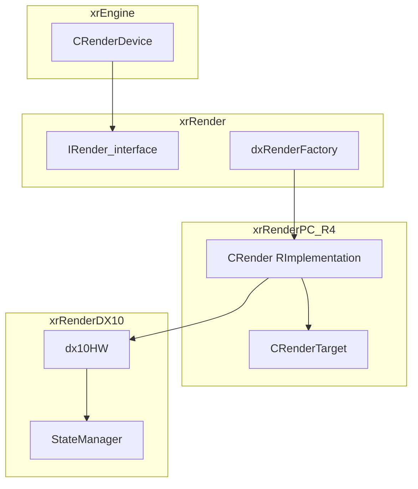

# Renderer (xrRender / R4)

`xrRender` — бэкенд-агностичный слой рендера (визуалы, скелеты, dsgraph, детали, свет, blenders). `xrRenderPC_R4` — DX11-бэкенд (класс `CRender`, глобал `RImplementation`). `xrRenderDX10` — DX10/11-утилиты (HW, state manager, SH-обёртки).

Активный бэкенд — **R4** (`STATIC_RENDERER_R4` в `xrEngine.vcxproj`).

| Бэкенд | API             | Статус                           |
| ------ | --------------- | -------------------------------- |
| R1     | D3D9 legacy     | не документируется               |
| R2     | D3D9 + advanced | не документируется               |
| R3     | DX10            | не документируется               |
| **R4** | **DX11**        | **активный, дальше — только R4** |

> `xrRenderDX9/` — не входит в проект R4 (нет в sln/R4-proj), не документируется.
> Исторические `r2_*` файлы (r2_R_calculate/lights/sun/sector_detect/test_hw/blenders) — D3D9-эпоха, но **компилируются в R4** (в `xrRender_R4.vcxproj`); документируются с пометкой «историческое ядро, переиспользуемое в R4».

## Структура

| Страница                                          | Что покрывает                                                                                                                                                                                                                                                                                                                                                                                                                                                                                                                                                                                                                                                                                                                                                                                                                                                                                                                                                                                                                                                                                                                                                                                                                                                                                                                                                                                                                                                                                        |
| ------------------------------------------------- | ---------------------------------------------------------------------------------------------------------------------------------------------------------------------------------------------------------------------------------------------------------------------------------------------------------------------------------------------------------------------------------------------------------------------------------------------------------------------------------------------------------------------------------------------------------------------------------------------------------------------------------------------------------------------------------------------------------------------------------------------------------------------------------------------------------------------------------------------------------------------------------------------------------------------------------------------------------------------------------------------------------------------------------------------------------------------------------------------------------------------------------------------------------------------------------------------------------------------------------------------------------------------------------------------------------------------------------------------------------------------------------------------------------------------------------------------------------------------------------------------------- |
| [Точка входа и фабрика](factory.md)               | `DllMainXrRenderR4`, `RImplementation`, `RenderFactoryImpl` (`dxRenderFactory`), `xrRender_test_hw` (`r2_test_hw`), `xrRender_initconsole`, глобалы                                                                                                                                                                                                                                                                                                                                                                                                                                                                                                                                                                                                                                                                                                                                                                                                                                                                                                                                                                                                                                                                                                                                                                                                                                                                                                                                                  |
| [Устройство рендера](render-device.md)            | `dxRenderDeviceRender`, `CHW`/`HWCaps` (`dx10HW`), `xrD3DDefs`/`DXCommonTypes`, StateManager (6 глобалов), `R_DStreams`, `xr_effgamma`                                                                                                                                                                                                                                                                                                                                                                                                                                                                                                                                                                                                                                                                                                                                                                                                                                                                                                                                                                                                                                                                                                                                                                                                                                                                                                                                                               |
| [Шейдерные константы](constants.md)               | `r_constants`/`dx10r_constants`, CB-кодирование в `destination`, `R_constants`/`dx10ConstantBuffer`, `SH_*` (Atomic/Constant/Matrix/RT/Texture + `dx10SH_RT`)                                                                                                                                                                                                                                                                                                                                                                                                                                                                                                                                                                                                                                                                                                                                                                                                                                                                                                                                                                                                                                                                                                                                                                                                                                                                                                                                        |
| [Пайплайн: секторы и traversal](sector.md)        | _(порцион 3)_ — `r__sector`, `r__sector_traversal`, `r2_sector_detect`, `r__pixel_calculator`, `QueryHelper`                                                                                                                                                                                                                                                                                                                                                                                                                                                                                                                                                                                                                                                                                                                                                                                                                                                                                                                                                                                                                                                                                                                                                                                                                                                                                                                                                                                         |
| [Occlusion](occlusion.md)                         | _(порцион 4)_ — `r__occlusion`, `occRasterizer`, `light_vis`                                                                                                                                                                                                                                                                                                                                                                                                                                                                                                                                                                                                                                                                                                                                                                                                                                                                                                                                                                                                                                                                                                                                                                                                                                                                                                                                                                                                                                         |
| [Динамическая сцена (dsgraph)](dsgraph.md)        | _(порцион 5)_ — `r__dsgraph_structure/build/render/render_lods`, `R_Backend_LOD`                                                                                                                                                                                                                                                                                                                                                                                                                                                                                                                                                                                                                                                                                                                                                                                                                                                                                                                                                                                                                                                                                                                                                                                                                                                                                                                                                                                                                     |
| [VSM / SMAP](vsm-smap.md)                         | `R_Backend_xform`, `r_sun_cascades`, `light_smapvis`, `SMAP_Allocator`, `r2_R_sun` (legacy), `r4_R_sun_support` (`FixedConvexVolume`/`DumbConvexVolume`), `R_Backend_hemi`                                                                                                                                                                                                                                                                                                                                                                                                                                                                                                                                                                                                                                                                                                                                                                                                                                                                                                                                                                                                                                                                                                                                                                                                                                                                                                                           |
| [Ресурсы и модели](resources.md)                  | `ResourceManager` (core/Loader/Reset/Scripting + DX10-версии), `ModelPool`, `CTexture`/`texture_load`, `STextureParams`/`CTextureDescrMngr` (.thm), `ColorMapManager`, `CPSLibrary`, `tga`, `R_Backend_Runtime` (`CBackend`/`R_xforms`), `dx10Texture/BufferUtils`                                                                                                                                                                                                                                                                                                                                                                                                                                                                                                                                                                                                                                                                                                                                                                                                                                                                                                                                                                                                                                                                                                                                                                                                                                   |
| [Визуалы](visuals.md)                             | `dxRender_Visual` (OGF-load, shader/texture, vis), `Fvisual` (verts/indices/`m_fast`), `FHierrarhyVisual` (children), `FProgressive` (slide-window LOD), `FTreeVisual_ST/PM` (wind/wave consts), `FLOD` (8-facet imposter), `CSkeletonX_ST/PM` (skin 1W..4W), `xrStripify`/`NvTriStrip`/`VertexCache`                                                                                                                                                                                                                                                                                                                                                                                                                                                                                                                                                                                                                                                                                                                                                                                                                                                                                                                                                                                                                                                                                                                                                                                                |
| [Скелеты и анимация](kinematics.md)               | `CKinematics` (`CalculateBones`, `BuildBoneMatrix`, `Bone_Calculate`, wallmarks), `CKinematicsAnimated` (`PlayCycle`/`PlayFX`, `CBlend`-стек, dequant, `UpdateTracks`), `CSkeletonX` (render modes soft/single/skin 1B..4B, `_Render`, bone-pick), `CBlend`/`CBlendInstance`, `CSkeletonWallmark`                                                                                                                                                                                                                                                                                                                                                                                                                                                                                                                                                                                                                                                                                                                                                                                                                                                                                                                                                                                                                                                                                                                                                                                                    |
| [Детали](detail.md)                               | `CDetailManager` (format v3/v4, cache grid, decompress, `UpdateVisibleM`, `MT_CALC/SYNC`, hw/soft render, DX11 `hw_Render_dump` — benders/motion vectors), `CDetail`, `Blender_detail_still`/`Blender_tree` (R3-ветка), `R_tree` (legacy)                                                                                                                                                                                                                                                                                                                                                                                                                                                                                                                                                                                                                                                                                                                                                                                                                                                                                                                                                                                                                                                                                                                                                                                                                                                            |     |
| [Свет](lights.md)                                 | `light` (IRender_Light: spatial_move/export_/xform_calc/gi_generate/vis_*, SSS), `CLight_DB` (Load/LoadHemi/Update/add_light/Create), `light_Package` (v_point/v_spot/v_shadowed, sort), `CROS_impl` (LightTrack: hemisphere 26-лучей, sun ray, AO-трекинг, smart_update), `CRender::Calculate` (Lights sync), `CRender::render_lights` (SMAP packing, shadowed/unshadowed phases, render_indirect), `smapvis` (инкрементальная видимость), `compute_xf_spot` (SMAP sizing)                                                                                                                                                                                                                                                                                                                                                                                                                                                                                                                                                                                                                                                                                                                                                                                                                                                                                                                                                                                                                          |
| [R4: scene/lighting phase](r4-scene.md)           | _(порцион 12)_ — `r4`, `r4_loader`, `r4_R_render`, `r2_blenders`, `Light_Render_Direct`, `blender_light_*`                                                                                                                                                                                                                                                                                                                                                                                                                                                                                                                                                                                                                                                                                                                                                                                                                                                                                                                                                                                                                                                                                                                                                                                                                                                                                                                                                                                           |
| [R4: deferred / накопление](r4-deferred.md)       | `CRenderTarget` (RT-карта кадра: Position/Color/Accumulator/MSAADepth/SSFX-RT, условное создание), `phase_scene_*`/`phase_accumulator`/`phase_vol_accumulator` (clear-once, stencil), light-marker (5..255, MSAA 0x80, overflow→stencil-reset), `accum_direct/_cascade/_f/_lum/_volumetric` (sun masking+lighting, CSC cuboid, sunfilter, TSM-lum, sunshafts), `accum_point/spot/reflected/volumetric` (Carmack-reverse masking, blend-copy, GI 0x01/0x81, SSS fade), `draw_volume` (spheres/cones/omnipart), `enable_scissor`/`u_DBT_*` (no-op), `mark_msaa_edges`, `create_minmax_SM`, `uber_deffer`/`uber_shadow`, `CBlender_deffer_aref/flat/model` (forward vs deferred, ATOC, HUD)                                                                                                                                                                                                                                                                                                                                                                                                                                                                                                                                                                                                                                                                                                                                                                                                             |     |
| [R4: post-process](r4-postprocess.md)             | `r4_rendertarget_phase_*` (combine/pp/bloom/hdao/ssao/hdr10__/luminance/occq/rain/smap_D/smap_S/ssfx__), `dx11HDAOCSBlender`, `dx11MinMaxSMBlender`, `ComputeShader`/`CSCompiler`, `DoAsyncScreenshot`, `phase_combine_volumetric`/`phase_wallmarks`                                                                                                                                                                                                                                                                                                                                                                                                                                                                                                                                                                                                                                                                                                                                                                                                                                                                                                                                                                                                                                                                                                                                                                                                                                                 |
| [Blenders (библиотека)](blenders.md)              | `IBlender`/`CBlender_DESC` (CPropertyBase: oPriority/oStrictSorting/oT_Name/oT_xform), `IBlender::Create`/`CreatePalette` (21 CLSID, дедуп `TYPES_EQUAL`), `CBlender_Compile` (рекордер: `r_Pass`/`r_TessPass`/`r_ComputePass`, `r_dx10Texture`/`r_dx10Sampler`/`r_Stencil`/`r_StencilRef`/`r_CullMode`/`r_ColorWriteEnable`, `SetParams`/`SetMapping`, `ParseName` `$null`/`$base0..7`, `L_textures/constants/matrices`, detail-texture/`TessMethod`), `_cpp_Compile` (detail-textures из `DEV->m_textures_description`, `R2FLAG_DETAIL_BUMP`, steep-parallax); world: `CBlender_BmmD` (terrain, `uber_deffer`, puddles, `case 3` magic, `yantar` quirk), `CBlender_LmEbB` (forward-only quirk), `CBlender_Model_EbB` (glass `ssfx_glass`, HUD `model_hud`/`base_hud`), `CBlender_Particle` (6 blend modes, soft particles), `CBlender_Screen_SET` (10 режимов, stub-шейдеры), `CBlender_Editor_Wire`/`_Selection`, `CBlender_Detail_Still`/`CBlender_Tree` (→ detail.md); R4 screen-space: `blender_blur` (10 классов: blur/ssr/volumetric/ao/sss/sss_ext/rain/water_blur/motion_blur/fog_scattering), `blender_combine`/`_msaa` (`m_MSAASample` quirk), `blender_dof` (`samplero_pepero` typo), `blender_gasmask_drops`/`_dudv`, `blender_hdr10_bloom`/`_lens_flare` (7 классов), `blender_lut`, `blender_nightvision`/`_fakescope`/`_heatvision` (DSR fork), `blender_pp_bloom`, `blender_smaa`/`CBlender_ssfx_taa`, `blender_ss_sunshafts`, `blender_ssao` (`_noMSAA`/`_MSAA`, stencil-разница) |     |
| [Частицы и wallmarks](particles-wallmarks.md)     | `CParticleEffect` (fixed-step `OnFrame`, `ExecuteAnimate`/`ExecuteCollision`, SSE-sprite-стрим, PAPI-обёртка), `CParticleGroup` (таймлайн `m_Time0/m_Time1`, related/free-дети), `CPEDef`/`CPGDef` (PED/PGD-чанки, INI Save2/Load2, `Compile`), `ParticleEffectActions` (30 `EPA*`, `actions_token[]`, PAPI-байт-код), `dxParticleCustom`, `CWallmarksEngine` (static: DFS-вырезка из стат. меша, bias-рендер, TTL-фейд; skeleton: one-shot через `CKinematics`), `dxWallMarkArray`, `dxRainRender` (капли-линии `effects\rain`, плющи `dm\rain.dm`), R4: `render_rain`/`phase_rain`/`draw_rain` (wet-surfaces, rain-SMAP, 3 screen-space паса, MSAA per-sample)                                                                                                                                                                                                                                                                                                                                                                                                                                                                                                                                                                                                                                                                                                                                                                                                                                     |
| [UI-обвязка и прочее](dx-bridges.md)              | _(порцион 17)_ — `dxUIRender`, `dxFontRender`, `dxImGuiRender`, `dxConsoleRender`, `dxStatsRender`, `dxEnvironmentRender`, `dxLensFlareRender`, `dxThunderboltRender`, `dxDebugRender`, `HOM`, `3DFluid`                                                                                                                                                                                                                                                                                                                                                                                                                                                                                                                                                                                                                                                                                                                                                                                                                                                                                                                                                                                                                                                                                                                                                                                                                                                                                             |
| [Postprocessing (общий обзор)](postprocessing.md) | общий обзор post-processing (обновляется в порционе 14)                                                                                                                                                                                                                                                                                                                                                                                                                                                                                                                                                                                                                                                                                                                                                                                                                                                                                                                                                                                                                                                                                                                                                                                                                                                                                                                                                                                                                                              |
| [Shader Bus](shader-bus.md)                       | фича для мододелов (готова с итерации 0)                                                                                                                                                                                                                                                                                                                                                                                                                                                                                                                                                                                                                                                                                                                                                                                                                                                                                                                                                                                                                                                                                                                                                                                                                                                                                                                                                                                                                                                             |

## Карта связей

- **`R_dsgraph_structure`** (xrRender) — базовый класс `CRender`: реализует `IRender_interface` + `pureFrame`, содержит dsgraph-карты (`mapNormalPasses`, `mapHUD`, `mapLOD`, `mapWmark` и др.), `val_pObject`/`val_pTransform`/`phase`/`pmask`.
- **`CRender`** (xrRenderPC_R4) — R4-наследник: `create/destroy/reset`, `render_main/forward`, `shader_compile`, `model_*`, `light_*`, `wallmark*`, `Screenshot`. Глобал `RImplementation` (`r4.cpp`).
- **`dxRenderFactory`** — фабрика render-объектов (`CreateFontRender` и т.д.); глобал `RenderFactoryImpl` (`dxRenderFactory.cpp`).
- **`::Render`/`::RenderFactory`/`::DU`/`UIRender`/`DRender`** — глобалы, устанавливаются `DllMainXrRenderR4`.

## Статус порционов (итерация 3)

| #   | Порцион                        | Страницы                           | Статус    |
| --- | ------------------------------ | ---------------------------------- | --------- |
| 1   | Точка входа и фабрика          | `factory.md`                       | ✅ готово |
| 2   | Устройство рендера и константы | `render-device.md`, `constants.md` | ✅ готово |
| 3   | Пайплайн: секторы и traversal  | `sector.md`                        | ✅ готово |
| 4   | Occlusion                      | `occlusion.md`                     | ✅ готово |
| 5   | Динамическая сцена (dsgraph)   | `dsgraph.md`                       | ✅ готово |
| 6   | VSM / SMAP                     | `vsm-smap.md`                      | ✅ готово |
| 7   | Ресурсы и модели               | `resources.md`                     | ✅ готово |
| 8   | Визуалы                        | `visuals.md`                       | ✅ готово |
| 9   | Скелеты и анимация             | `kinematics.md`                    | ✅ готово |
| 10  | Детали                         | `detail.md`                        | ✅ готово |
| 11  | Свет                           | `lights.md`                        | ✅ готово |
| 12  | R4: scene/lighting phase       | `r4-scene.md`                      | ✅ готово |
| 13  | R4: deferred / накопление      | `r4-deferred.md`                   | ✅ готово |
| 14  | R4: post-process               | `r4-postprocess.md`                | ✅ готово |
| 15  | Blenders (библиотека)          | `blenders.md`                      | ✅ готово |
| 16  | Частицы и wallmarks            | `particles-wallmarks.md`           | ✅ готово |
| 17  | UI-обвязка и прочее            | `dx-bridges.md`, `misc.md`         | ⬜        |
