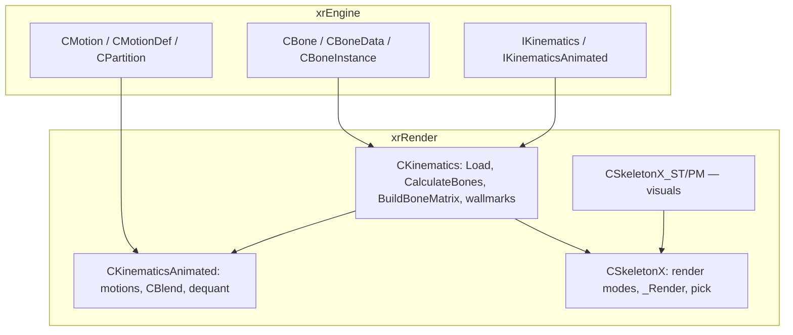
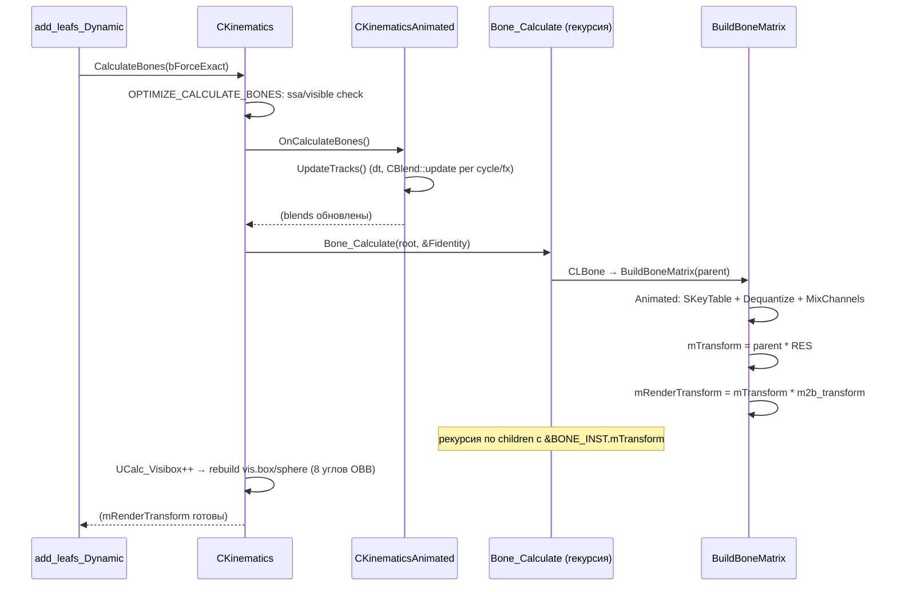

# Renderer: скелеты и анимация

## 1. Ответственность

Механика скелетов в рантайме: иерархия костей (`CBoneData`/`CBoneInstance`), пересчёт трансформаций по кадру (`CalculateBones` → `Bone_Calculate` → `BuildBoneMatrix`), видимость костей, wallmarks (следы ударов на костях) и **анимационный блендинг** — `PlayCycle`/`PlayFX`, `CBlend`-стек (`eAccrue`/`eFalloff`/`eFREE_SLOT`), де-квантизация `.omf`-движений и сборка матриц из квантованных ключей. Плюс **скиннинг-рендер** `CSkeletonX`: выбор режима (soft/hw-1B..4B/single) и отправка `mRenderTransform` в константный буфер `sbones_array`.

Чего это **НЕ делает**: не управляет видимостью объектов (это [dsgraph](dsgraph.md) / [sector](sector.md) / [occlusion](occlusion.md)); не хранит данные движений `.omf` (`CMotion`/`CKey`/`CMotionDef`/`CPartition` — [Скелет и анимация](../xr-engine/skeleton-motion.md)); не рисует сам (`RCache.Render`/`CBackend` draw calls — [Устройство рендера](render-device.md), [Шейдерные константы](constants.md)); не владеет вершинными буферами скин-геометрии (`CSkeletonX_ST/PM` pack-вершины — [Визуалы](visuals.md)).

## 2. Место в архитектуре

См. [Архитектура](../../architecture/overview.md), [Зависимости](../../architecture/dependencies.md), [dsgraph](dsgraph.md).

- `IKinematics`/`IKinematicsAnimated` — интерфейсы из xrEngine ([render.md](../xr-engine/render.md)); реализуются `CKinematics`/`CKinematicsAnimated` (xrRender).
- Кости `CBone`/`CBoneData`/`CBoneInstance`, `.omf`-данные (`CMotion`/`CMotionDef`/`CPartition`), `vertBoned1W..4W` — [Скелет и анимация](../xr-engine/skeleton-motion.md) (итерация 2).
- Скinned-визуалы `CSkeletonX_ST/PM` (pack-вершины) — [Визуалы](visuals.md); здесь — только `CSkeletonX`-база (режимы, `_Render`, bone-pick).
- `CModelPool` создаёт `CKinematics`/`CKinematicsAnimated` по `MT_*` ([Ресурсы и модели](resources.md)); вставка в сцену — `add_leafs_Dynamic` (`MT_SKELETON_ANIM/RIGID` → `CalculateBones` + `CalculateWallmarks`, [dsgraph](dsgraph.md)).
- Коллизии по костям (`CCF_Skeleton`) читают `LL_GetData/LL_GetTransform` — [Коллизии](../xr-engine/collide-physics.md); `CFM_DynamicMesh::_RayQuery` уточняет хит через `PickBone` — [Fmesh](../xr-engine/fmesh.md).



## 3. Публичный API

| Класс/функция         | Назначение                                                                                                                                                                                                                                                                                                                                                                                                                                                                                                                                                                 |
| --------------------- | -------------------------------------------------------------------------------------------------------------------------------------------------------------------------------------------------------------------------------------------------------------------------------------------------------------------------------------------------------------------------------------------------------------------------------------------------------------------------------------------------------------------------------------------------------------------------- |
| `IKinematics`         | Кости: `Bone_Calculate`, `Bone_GetAnimPos`, `PickBone`, `EnumBoneVertices`; `LL_BoneID/Name_dbg/UserData/Bones`, `LL_GetBoneInstance/GetBoneData/LL_GetData`, `LL_BoneCount`, `LL_VisibleBoneCount`, `LL_GetTransform`/`LL_GetTransform_R`, `LL_GetBox/GetBox`, `LL_GetBindTransform`, `LL_GetBoneGroups`, `LL_Get/SetBoneRoot`, `LL_Get/SetBoneVisible`, `LL_SetBonesVisible`, `GetVisualByBone`, `CalculateBones(bForceExact)`, `CalculateBones_Invalidate`, `Callback/SetUpdateCallback`, `NeedUCalc`, `dcast_RenderVisual`/`dcast_PKinematics`                         |
| `IKinematicsAnimated` | Анимация: `OnCalculateBones`, `LL_PartBlendsCount/PartBlend/IterateBlends`, `LL_MotionsSlotCount/MotionsSlot`, `LL_GetMotionDef/RootMotion/Motion`, `LL_BuldBoneMatrixDequatize`/`LL_BoneMatrixBuild`, `GetBlendDestroyCallback/SetBlendDestroyCallback`, `SetUpdateTracksCalback`/`GetUpdateTracksCalback` (опечатка в имени — как в коде), `LL_MotionID/PartID`, `LL_PlayCycle` (2), `LL_CloseCycle`, `LL_SetChannelFactor`, `UpdateTracks`, `LL_UpdateTracks`, `ID_Cycle(_Safe)`, `PlayCycle` (3), `ID_FX(_Safe)`, `PlayFX` (2), `partitions()`, `get_animation_length` |
| `CBlend`              | Бленд-стек: `blendAmount/timeCurrent/timeTotal`, `motionID`, `bone_or_part`, `channel`, `ECurvature blend` (`eFREE_SLOT`/`eAccrue`/`eFalloff`), `blendAccrue/blendFalloff/blendPower/speed`, `playing/stop_at_end_callback/stop_at_end/fall_at_end`, `Callback/CallbackParam`, `dwFrame`; `update(dt, cb)`/`update_time`/`update_play`/`update_falloff`, `set_*_state`                                                                                                                                                                                                     |
| `CKinematics`         | `: FHierrarhyVisual, IKinematics` — кости, `CalculateBones` (в `SkeletonRigid.cpp`), `BuildBoneMatrix`/`CLBone`/`BoneChain_Calculate`, видимость, wallmarks, `m_lod`/`pUserData`                                                                                                                                                                                                                                                                                                                                                                                           |
| `CKinematicsAnimated` | `: CKinematics, IKinematicsAnimated` — `m_Motions` (слоты `.omf`), `CBlendInstance` per кость, `blend_cycles[MAX_PARTS]`/`blend_fx`, `channels`, `UpdateTracks`/`LL_UpdateTracks`/`LL_UpdateFxTracks`, `IBlend_Create/Startup`, `BuildBoneMatrix` (dequant-override)                                                                                                                                                                                                                                                                                                       |
| `CSkeletonX`          | `: Fvisual, IRender_Mesh` — `RenderMode` (soft/single/skin 1B..4B), `Vertices1W..4W`, `BonesUsed`, `_Load` (выбор режима), `_Render`/`_Render_soft`, `get_pos_bones` 1W..4W, `_PickBoneSoft*`/`_FillVerticesSoft*`, `has_visible_bones`, `_DuplicateIndices` (DX10/11)                                                                                                                                                                                                                                                                                                     |
| `CSkeletonWallmark`   | Данные wallmark: `m_Parent`, `m_XForm` (`const Fmatrix*`), `m_Shader`, `m_ContactPoint`, `fTimeStart/End`, `m_LocalBounds`, `WMFace {vert[3], uv[3], bone_id[3][4], weight[3][3]}`, `m_Faces`, `m_Bounds` (world), `Similar`                                                                                                                                                                                                                                                                                                                                               |

## 4. Внутреннее устройство

### `CKinematics` — кости и пересчёт (`SkeletonCustom.h/.cpp`)

- Поля: `bones` (`vecBones*` shared), `bone_instances` (`CBoneInstance*`), `bone_map_N/P` (accel по имени), `iRoot`, `visimask`/`hidden_bones` (`Flags64` — **лимит 64 кости**, `VERIFY3`), `UCalc_Time/Visibox/ThisFrame`, `UCalc_Mutex`+`UCalc_Mutex2` (2 критсеха), `Matrix_Prev`/`Matrix_Temp` (motion vectors), `wallmarks` (`SkeletonWMVec`) + `wm_frame`, `CurrentFrame`, `m_lod` (LOD-визуал из `OGF_S_LODS`), `pUserData` (`OGF_S_USERDATA` → `CInifile`), `m_is_original_lod`.
- `Load` (L164–335): `inherited::Load` → `OGF_S_LODS` → `m_lod = ::Render->model_CreateChild(lod_name)` (не из потока — `VERIFY3`); `OGF_S_USERDATA` (не `_EDITOR`); `OGF_S_BONE_NAMES` (count ≤64, имя+parent, obb, visimask/hidden_bones `set TRUE`); sort accel; parent→root (`BI_NONE` = пустое имя, `R_ASSERT` один root); `OGF_S_IKDATA` (vers, game_mtl_name, shape, `IK_data.Import`, bind_transform из XYZ+T, mass, center_of_mass; `root->CalculateM2B(Fidentity)`); `AfterLoad(this, child_idx)` per child; unique/sort `child_faces`; `LL_Validate()`.
- `CalculateBones` (**реализация в `SkeletonRigid.cpp` L23–175**, не в Custom — название файла вводит в заблуждение): `PROF_EVENT`; early-out `RDEVICE.dwTimeGlobal == UCalc_Time`; под `#ifdef OPTIMIZE_CALCULATE_BONES` (define в `src/xrEngine/device.h`, всегда): при `g_bootComplete && spatialParent`: `GetPerceivedDist`/`CalcSSADynamic`, `ssa_k = IK_CALC_SSA / ssa`, `update_rate_k = max(1, ssa_k)`; `visibleCheck = (perceived_dist < IK_ALWAYS_CALC_DIST) || ViewBase.testSphere_dirty(...)` — невидимый → `bForceExact = FALSE`, `update_rate_k = max(2, ...)`; `r_optimize_calculate_bones && canBeOptimized() && ssa < IK_CALC_SSA` → `bForceExact = FALSE`. `UCalc_Mutex`; `OnCalculateBones()` (override в Animated → `UpdateTracks`); slow early-out `dwTimeGlobal < UCalc_Time + UCalc_Interval * update_rate_k`; `Visibility_Update`; `UCalc_Time = now`; DEBUG `Statistic->Animation.Begin/End`; `Bone_Calculate(bones->at(iRoot), &Fidentity)`; `UCalc_Visibox++`, при `>= psSkeletonUpdate` → rebuild `vis.box/sphere` по 8 углам OBB видимых костей (scatter: `UCalc_Visibox = -randI(ps-1)`), `UCalc_ThisFrame`; `Update_Callback(this)`.
- `BuildBoneMatrix` (Rigid L199–212): видимая → `mTransform = parent * bind_transform`, `mTransformHidden = mTransform`; скрытая → `mTransform.c = parent->c` (scale 0, позиция родителя), `mTransformHidden` полный.
- `CLBone` (L214–223): если не `callback_overwrite` → `BuildBoneMatrix`; callback → `bi.callback()(&bi)`; **`mRenderTransform = mTransform * m2b_transform`**.
- `Bone_Calculate` (L236–245): `UCalc_Mutex2` (per-bone критсех), `CLBone(channel u8(-1))`, рекурсия по children с `&BONE_INST.mTransform`.
- `BoneChain_Calculate` (L247–274): top-down от root, `ignore_callbacks` → временный clear callback (восстановление после), copy `parrent_bi` (value-copy — изоляция).
- `Bone_GetAnimPos` (L225–234): value-copy `bi`, `BoneChain_Calculate`, `#ifndef MASTER_GOLD R_ASSERT(_valid)`.
- `LL_SetBoneVisible` (L508–539): hide → `mTransformHidden = mTransform`, `mTransform.scale(0,0,0)`, `c = parent->mTransform.c`, `mRenderTransform` rebuild; show → restore + `CalculateBones_Invalidate`; recursive по children; `Visibility_Invalidate`. `LL_SetBonesVisible(mask)` — batch-вариант.
- `Visibility_Update` (L568–600): перемещение children ↔ `children_invisible` по `has_visible_bones()`.
- `GetVisualByBone` (L338–360, fork DSR): по `BonesUsed` (linear `has_bone_id` в `CSkeletonX`).
- `LL_GetBindTransform` (L612–616): рекурсия `parent * bind_transform` (массив по всем костям). `LL_GetBoneGroups` (L893–908): per-child списки костей с `child_faces`.

### `CSkeletonWallmark` + wallmarks (`SkeletonCustom.cpp`)

- `AddWallmark` (L664–763): world→model луч; per видимая пикабельная кость (`!sfNoPickable`) `TestRayOBB` → `child->PickBone`; `cp = S + D*dist`; `TestSphereOBB(cp, size)` → test_bones; дедуп `Similar(shader, cp, 0.02f)` (swap-pop); новый `CSkeletonWallmark` (ttl = arg или `ps_r__WallmarkTTL`), `m_LocalBounds = sphere(cp, size*2)`, world `m_Bounds`; normal = avg(нормаль три, `-D`); `BuildMatrix` (орто-камера на нормаль, scale `1/(0.9*size)`) + random rotateZ ±20°; per child × test_bones → `FillVertices`.
- `CalculateWallmarks` (L770–799): once-per-frame (`wm_frame`), `w = (now - TimeStart)/TimeEnd` (`TimeEnd -1` → 0), `w<1 && testSphere_dirty(m_Bounds)` → `RImplementation.add_SkeletonWallmark(wm)` (закомм. `::Render->add_SkeletonWallmark`); expired → `need_remove = true`, затем `remove_if(zero_wm_pred)` — **ищет `nullptr`, но expired-ветка его не ставит** (см. §8).
- `RenderWallmark` (L801–884): per `WMFace` per вершина: 1/2/3/4-link skinning по `mRenderTransform` + веса; `wm->XFORM()->transform_tiny(V->p, P)`, uv, `color = rgba(128,128,188, floor(w*255))` (fade-in по времени), `FVF::LIT`.
- `PickBone` (L643–662): world→model (invert `parent_xform`), per child `PickBone` (`CSkeletonX` — ray-tri по `mRenderTransform`), hit → world back.

### `CKinematicsAnimated` — анимация и блендинг (`SkeletonAnimated.h/.cpp`)

- Поля: `Update_LastTime`, `blend_instances` (`CBlendInstance*` — per-bone `BlendSVec` ≤ `MAX_BLENDED`), `m_Motions` (`MotionsSlotVec`: `SMotionsSlot { shared_motions motions; BoneMotionsVec bone_motions }` — слоты `.omf`), `m_Partition` (`CPartition*`), `m_blend_destroy_callback`/`m_update_tracks_callback`, `blend_pool` (svector ≤ `MAX_BLENDED_POOL` `CBlend`), `blend_cycles[MAX_PARTS]`, `blend_fx` (≤ `MAX_BLENDED`), `channels` (`animation::channels`).
- `CBlendInstance::blend_add` (L23–36): при `MAX_BLENDED` — если `fall_at_end` → **return (потеря blend!)**, иначе drop наименьшего `blendAmount`.
- `Bone_Motion_Start/Stop` (рекурсивно по subtree) / `_IM` (только одна кость — для cycles per-part bones).
- `LL_MotionID/ID_Cycle(_Safe)/ID_FX(_Safe)` — поиск **с конца** `m_Motions` (последний слот = приоритет).
- `IBlendSetup` (L308–343): mixing → `eAccrue`, `blendAmount=EPS_S`; non-mixing → `eAccrue`, `blendAmount=1`; `timeTotal` из root-bone motion; `stop_at_end = noloop`; `stop_at_end_callback = TRUE`; **`fall_at_end = stop_at_end && (channel > 1)`**.
- `IFXBlendSetup` (L345–369): accrue, amount `EPS_S`, power/speed из def, bone = `bone_or_part`, `stop_at_end = FALSE`, `fall_at_end = FALSE`, channel 0.
- `LL_PlayCycle` (L371–413): `!valid` → 0; **`part == BI_NONE` → рекурсия по всем `MAX_PARTS`, return 0 (не CBlend!)**; `part >= MAX_PARTS`/пустой part → 0; **только `channel == 0`**: mixing → `LL_FadeCycle(part, falloff, 1<<channel)`, else `LL_CloseCycle`; `IBlend_Create` (0 → return 0); per part-bone `Bone_Motion_Start_IM`; `blend_cycles[part].push_back`. `LL_FadeCycle` (L245–260): per cycle с mask → `set_falloff_state`, `blendFalloff = falloff`, **`stop_at_end_callback = FALSE`** (callback не должен приходить). `LL_CloseCycle` (L262–287): `free_state` + `Bone_Motion_Stop_IM` + erase (iter-fix).
- `PlayCycle` (3 обёртки: by name → `R_ASSERT` valid; by `MotionID` → `m_def->bone_or_part`; by partition+speed). `PlayFX` (L487–502): `m_def->bone_or_part`, power × `power_scale`. `LL_PlayFX` (L506–522): **`blend_fx.size() >= MAX_BLENDED` → return 0**; `BI_NONE` → `iRoot`; `Bone_Motion_Start` (рекурсивно).
- `UpdateTracks` (L627–643): once-per-frame (`Update_LastTime == dwTimeGlobal` → return); `dt = min(66ms, delta)`; **`GetUpdateTracksCalback()`** (fork: внешний callback решает тикнуть ли — если true, `Update_LastTime = now` и return, т.е. внешний сам обновляет) else `LL_UpdateTracks(dt, false, false)`.
- `LL_UpdateTracks` (L539–576): per part (непустые): per cycle: **`!b_force && B.dwFrame == RDEVICE.dwFrame` → skip** (once-per-frame latch), `B.dwFrame = now`; `B.update(dt, B.Callback) && !leave_blends` → `DestroyCycle` + erase. Затем `LL_UpdateFxTracks(dt)`.
- `LL_UpdateFxTracks` (L578–625): per fx: `!stop_at_end_callback` → `playing = FALSE` (skip); `update_time(dt)`; switch state: **eAccrue** → `blendAmount += dt*accrue*power*speed`, `>= power` → clamp + `set_falloff_state`; **eFalloff** → `blendAmount -= dt*falloff*power*speed`, `<= 0` → `set_free_state` + `Bone_Motion_Stop` (рекурсивный) + erase. (FX обновляются вручную, cycles — через `CBlend::update`.)
- `DestroyCycle` (L524–534): callback `BlendDestroy(B)` → `set_free_state` → per part-bone `Bone_Motion_Stop_IM`.
- `IBlend_Create` (L761–770): `UpdateTracks()` сначала; поиск `eFREE_SLOT`; **переполнение → return 0** (FATAL закомментирован — не crash, blend теряется).
- `IBlend_Startup` (L733–759): pool = `MAX_BLENDED_POOL` × free `CBlend`, cycles/fx clear, `channels.init()`. Вызывается в `Spawn`/`Copy`/`Load`.
- `Load` (L772–924): `inherited::Load`; lambda `loadOMF(path)`: `$level$` → `$game_meshes$` (иначе `Debug.fatal`); **кэш `g_pMotionsContainer->has(path)`** → create(NULL) (ref), иначе `FS.r_open` + create(reader); **fork-DSR**: после `stalker_animation.omf` → доп. `FS.file_list("$game_meshes$", "actors\\modded_stalker_animations\\*.omf")` → loadOMF per file. Чанки: `OGF_S_MOTION_REFS` (stringZ list, `R_ASSERT set_cnt < MAX_ANIM_SLOT`, `\\*.omf` → file_list merge game_meshes+level), `OGF_S_MOTION_REFS2` (u32 count + stringZ), else fallback: `N + ".ogf"` → `motions.create(nm, data, bones)`. `R_ASSERT(m_Motions.size())`. `m_Partition = m_Motions[0].motions.partition(); m_Partition->load(this, N)` (только первый слот!). Per slot: `bone_motions.resize(bones->size())`, `MS.motions.bone_motions(BD->name)`. `IBlend_Startup()`.
- `BuildBoneMatrix` (L1021–1088, override): `SKeyTable keys`; `LL_BuldBoneMatrixDequatize` (L927–961): per blend в `blend_instances[bone]` с `channel_mask`: `Dequantize(*D, *B, M)` (`CKey` из `CMotion` по timeCurrent), `QR2Quat(M._keysR[0], BK.Q)`, T: `flTKeyPresent` → `QT16_2T`/`QT8_2T` (по `flTKey16IsBit`), else `M._initT`; `keys_substruct` для `channels.rule(j).extern_ == add`. `LL_BoneMatrixBuild` (L964–1019): per канал (j=0 всегда, остальные при count>0): `channels.get_def(j, BC)`, `process_single_channel(channel_keys, BC, keys, blends, count)`, `MixChannels(Result, ...)`; `RES.mk_xform(Q, T)`; видимая → `mTransform = parent * RES` + hidden copy; скрытая → `mTransform.c = parent->c`, `mTransformHidden = parent * RES`. DEBUG: `check_scale`, `_valid`, `dbg_box.contains` VERIFY2.
- `OnCalculateBones` (L1091–1094): → `UpdateTracks()`.
- `Spawn` (L711–721): inherited + `IBlend_Startup` + construct blend_instances + `channels.init()`. `Copy` (L700–709): PCOPY m_Motions/m_Partition + `IBlend_Startup`.
- `get_animation_length` (L289–306): root-bone motion `GetLength() / m_def->Speed()`.
- `LL_SetChannelFactor` → `channels.set_factor`. `SetUpdateTracksCalback` (опечатка в имени — как в коде).
- `#ifdef _EDITOR`: public + `ID_Motion(N, slot)`.

### `CSkeletonX` — скиннинг-рендер (`SkeletonX.h/.cpp`)

- `RenderMode`: `RM_SKINNING_SOFT`/`RM_SINGLE`/`RM_SKINNING_1B..4B`. `Vertices1W..4W` (ref_smem vertBoned — shared/CRC-дедуп), `BonesUsed` (ref_smem u16, использованные bone-idx), union: `cache_DiscardID/vCount/vOffset` (soft) / `RMS_boneid` (single) / `RMS_bonecount` (skin, max bone ID + 1). `Parent`, `ChildIDX`. `m_Indices` (ref_smem u16, DX10/11-копия IB).
- `_Load` (L228–418): `s_bones_array_const = "sbones_array"`, `s_bones_array_prev_const = "sbones_array_prev"` (глобалы shared_str!); **`hw_bones_cnt = u16((HW.Caps.geometry.dwRegisters - 22 - 3)/3)`** (L239 — DX11-номинальные 16 → `(16-25)/3 = -3` → u16-wrap 65533 → **лимит не работает**, см. [Визуалы](visuals.md)); R1: `ps_r1_SoftwareSkinning == 1` → hw = 0; `_EDITOR` → hw = 0. Per `dwVertType` (`OGF_VERTEXFORMAT_FVF_1L..4L` / 1..4): scan `bids` (unique bone ids) + `sw_bones_cnt` (max bone id); 1L: `bids.size() == 1` → `RM_SINGLE` (`RMS_boneid`, `shader_option_skinning(0)`), `sw_bones_cnt <= hw_bones_cnt` → `RM_SKINNING_1B` (`RMS_bonecount = sw+1`, option 1), else soft (`Vertices1W.create(crc32, ...)`); 2L–4L: аналогично без single. Default → `Debug.fatal`. `BonesUsed.create(crc32(bids))` (комментарий fork DSR: `--DSR-- SilencerOverheat (1 -> 0). Why was 1 tho?`).
- `_Render` (L59–166): DX11 `ssfx_motionvectors`: `Device.dwFrame > Parent->CurrentFrame` → shift `Matrix_Prev/Temp` + per-bone `mRenderTransform_prev/temp`; single → `p_WV = v_prev * (Matrix_Prev * bone_prev)`, `set_c("m_wvp_prev")`; skin → `m_wvp_prev = m_p_prev * m_v_prev * Matrix_Prev`. SWITCH: SOFT → `_Render_soft` (+stat sw); SINGLE → `W = m_w * GetTransform_R(boneid)`, `set_xform_world(W)`, `RCache.Render` (stat inst); SKIN 1–4 → per `RMS_bonecount` костей: `set_ca(sbones_array, mid*3, 9 floats)` из `LL_GetTransform_R` (col-major: _11,_21,_31,_41 / _12... / _13...); DX11 motionvectors: аналогично `sbones_array_prev` из `mRenderTransform_prev`; `RCache.Render`; stat per mode.
- `_Render_soft` (L168–226): `_VertexStream` ring (`DiscardID`/vCount cache → перескининг только при сбросе); `PSGP.skin1W..4W(Dest, *VerticesNW, vCount, Parent->bone_instances)` (см. итерация 2, порцион 1 — `PSGP` = `xrCPU_Pipe`); `RCache.Render` с vOffset.
- `get_pos_bones` 1W/2W/3W/4W (L436–493): `transform_tiny` per link + lerp/сумма весов (4-й вес = `1 - w0 - w1 - w2`).
- `_PickBoneSoft1W..4W` (L500–522): template `pick_bone<vertBonedNW>` — ray-tri по скин-вершинам (internals не покрыты).
- `_FillVerticesSoft1W..4W` (L568–743): per face из `child_faces`: bone_id[4] + weight[3] из вершин; `transform_tiny` per link → `p[k]` (skinned в текущем `mRenderTransform`); `test_normal.mknormal`, `cosa < EPS` → skip; `TestSphereTri(wm.ContactPoint(), size, p)` → uv из `view` (ortho) → `wm.m_Faces.push_back`.
- `has_visible_bones` (L420–433): SINGLE → `GetBoneVisible(RMS_boneid)`; else per `BonesUsed` linear.
- `_DuplicateIndices` (L746–758, DX10/11): `OGF_INDICES` → `m_Indices.create(crc32)` (CPU-копия IB — DX10 не читает IB).

### `vertRender` (pack 2)

`vertRender` (`SkeletonXVertRender.h`): `#pragma pack(2)`, `P` (Fvector) + `N` (Fvector) + uv — для wallmark-рендера и soft-skinning.

## 5. Взаимодействие

- **Вызывает**: `g_pMotionsContainer` (кэш `.omf` — [Ресурсы и модели](resources.md)), `PSGP.skin1W..4W` (CPU-скиннинг, [Цикл кадра](../xr-engine/frame-loop.md)), `RCache.set_ca/set_xform_world/Render` ([Шейдерные константы](constants.md)), `RImplementation.add_SkeletonWallmark` (wallmark-engine, [Частицы и wallmarks](particles-wallmarks.md)), `spatialParent->GetPerceivedDist/CalcSSADynamic` ([Устройство](../xr-engine/device.md)), `ViewBase.testSphere_dirty` (frustum-cull), `::Render->model_CreateChild` (LOD — [Ресурсы и модели](resources.md)), `Dequantize`/`QR2Quat`/`QT16_2T`/`QT8_2T`/`process_single_channel`/`MixChannels` ([Скелет и анимация](../xr-engine/skeleton-motion.md)).
- **Вызывается из**: `add_leafs_Dynamic` (`MT_SKELETON_ANIM/RIGID` → `CalculateBones` + `CalculateWallmarks`, [dsgraph](dsgraph.md)); `CModelPool`/`model_Create*` (создание — [Ресурсы и модели](resources.md)); `IKinematicsAnimated` от xrGame через `dcast_PKinematicsAnimated` (`PlayCycle`/`PlayFX`); `CCF_Skeleton::BuildState` (коллизии — [Коллизии](../xr-engine/collide-physics.md)); `CFM_DynamicMesh::_RayQuery` → `PickBone` (ray-pick — [Fmesh](../xr-engine/fmesh.md)); `CRender::Calculate` (frustum-видимость).
- Зависимости: `xrEngine/render.h` (`IRenderVisual`, `IKinematics`), `xrEngine/SkeletonMotions.h` (`CMotion`/`CMotionDef`/`CPartition`), `xrEngine/SkeletonMotionDefs.h` (`MAX_PARTS`/`SAMPLE_FPS`), `KinematicsAnimated.h`/`KinematicAnimatedDefs.h` (`IKinematicsAnimated`, `CBlend`, `SKeyTable`, `MAX_BLENDED`/`MAX_CHANNELS`), `animation_blend.h` (`CBlend`), `fmesh.h` (`OGF_*`), `FVisual.h`/`FSkinned.h` (visuals).

## 6. Потоки данных/управления



```mermaid
graph TD
    PC[PlayCycle / PlayFX] --> BL[IBlend_Create + IBlendSetup/IFXBlendSetup]
    BL --> CY[blend_cycles[part] / blend_fx]
    UP[UpdateTracks per кадр] --> CY
    UP --> FX[LL_UpdateFxTracks]
    CY --> ST{CBlend.update}
    ST -->|eAccrue| AC[blendAmount += dt*accrue*power]
    ST -->|eFalloff| FO[blendAmount -= dt*falloff*power]
    AC -->|>= power| FO
    FO -->|<= 0| FR[set_free_state + Bone_Motion_Stop + erase]
    AC -->|at_end, fall_at_end| FO
    FR --> POOL[IBlend: eFREE_SLOT → pool]
```

## 7. Конфигурация

- `UCalc_Interval = 100` мс (`Kinematics.h`, комментарий «10 fps») — минимальный интервал `CalculateBones`.
- `psSkeletonUpdate = 32` — период rebuild `vis.box/sphere` (каждые 32 `UCalc_Visibox`).
- `IK_CALC_DIST = 100.f`, `IK_ALWAYS_CALC_DIST = 20.f`, `IK_CALC_SSA = 0.006f` (xrGame, `CharacterPhysicsSupport.cpp` L53–55) — пороги SSA-оптимизации.
- `r_optimize_calculate_bones` (cvar `r__optimize_calculate_bones`, 0/1, xrGame `console_commands.cpp` L3108) — включение SSA-оптимизации.
- `OPTIMIZE_CALCULATE_BONES` (define в `src/xrEngine/device.h` L27, всегда) — ветка `CalculateBones`.
- `ps_r1_SoftwareSkinning` (R1: 1 → hw = 0, только soft-skinning).
- `ssfx_motionvectors` (`o.ssfx_motionvectors`) — DX11 motion-vector pass (`sbones_array_prev`, `Matrix_Prev/Temp`).
- `ps_r__WallmarkTTL` — TTL wallmark (если не задан аргументом `AddWallmark`).
- `MAX_PARTS = 4`, `SAMPLE_FPS = 30.f`, `KEY_Quant = 32767.f` (`SkeletonMotionDefs.h`, xrEngine).
- `MAX_BLENDED = 16`, `MAX_CHANNELS = 4`, `MAX_BLENDED_POOL = 16*4*4 = 256`, `MAX_ANIM_SLOT = 48` (`KinematicAnimatedDefs.h`, xrRender).
- `ps_r__common_flags` `RFLAG_NO_RAM_TEXTURES` — не влияет на кости напрямую.
- `VLOAD_NOVERTICES` — флаг `Load` для skinned-пути (вершины отдельно, [Визуалы](visuals.md)).

## 8. Известные ограничения/дебаг

- **64-костный лимит**: `visimask`/`hidden_bones` — `Flags64`, `VERIFY3` — скелет >64 костей не поддерживается.
- **`hw_bones_cnt` DX11 u16-wrap**: `(16-25)/3 = -3` → `u16` = 65533 → лимит не работает (DX9-механизм, см. [Визуалы](visuals.md)).
- **Blend loss**: `CBlendInstance::blend_add` при `MAX_BLENDED` — если `fall_at_end` → `return` (blend теряется); `IBlend_Create` при переполнении → `return 0` (FATAL закомментирован, не crash, blend теряется).
- **`UpdateTracks` external callback**: `GetUpdateTracksCalback()` — если установлен, внешний код решает тикнуть ли (если true — `Update_LastTime = now` и return, т.е. внешний сам обновляет).
- **Wallmark expiry quirk**: `CalculateWallmarks` — expired-ветка ставит `need_remove = true`, затем `remove_if(zero_wm_pred)` ищет `nullptr`, но `nullptr` **не ставится** (expired-ветка не нулит `intrusive_ptr`) — expired wallmarks **не удаляются** из вектора (потенциальная утечка).
- **`SetUpdateTracksCalback`** — опечатка в имени (как в коде, не «исправлять»).
- **`LL_PlayCycle(BI_NONE)`** — рекурсия по всем партициям, возвращает 0 (не `CBlend`) — легко ошибиться.
- **`m_Partition`** — только из первого слота `m_Motions[0]`; `bone_motions` per слот.
- **Fork DSR**: `GetVisualByBone` (SilencerOverheat), `modded_stalker_animations` в `Load`, `BonesUsed` CRC-комментарий.
- **DEBUG**: `LL_DumpBlends_dbg`, `check_kinematics`, `DebugRender`, `Statistic->Animation`, `RenderDUMP_SKIN` timer, `ps_r__WallmarkTTL`, `dbg_box` (VERIFY2 в `BuildBoneMatrix`).
- **Не покрыто**: `AnimationKeyCalculate.h` (`Dequantize`, `QR2Quat`, `QT16_2T`, `QT8_2T`, `SKeyTable`, `process_single_channel`, `MixChannels`, `animation::channels`, `keys_substruct` — вызовы описаны, internals нет; данные `CMotion`/`CKey*` — [Скелет и анимация](../xr-engine/skeleton-motion.md)); `IKinematicsAnimated` (forward, API в `CKinematicsAnimated`); `CSkinned`/`CSkeletonX_ST/PM` ([Визуалы](visuals.md), порцион 8); `dx10ResourceManager`/`CBackend` draw calls (порционы 7, 12–14).
