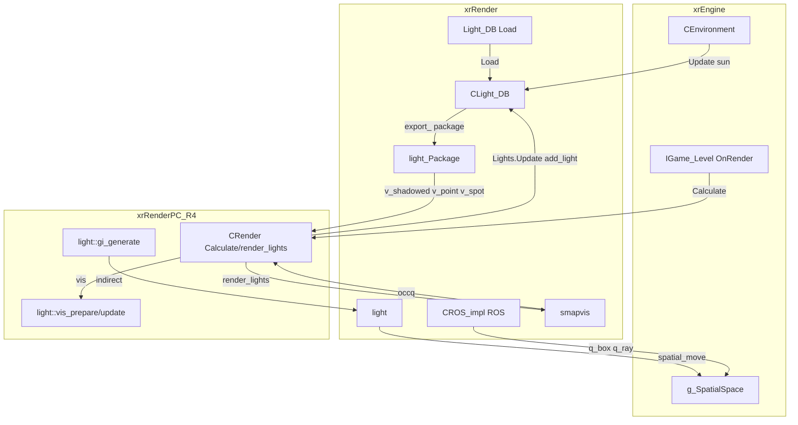
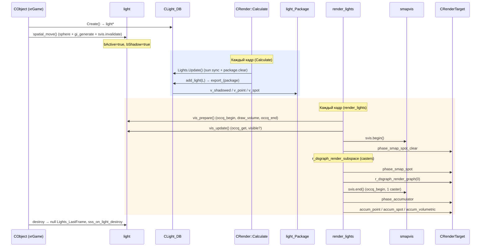
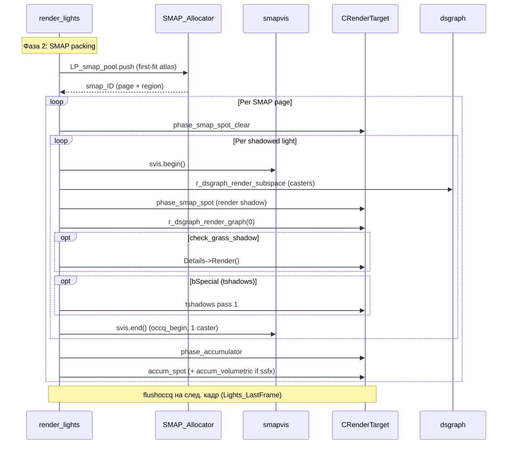
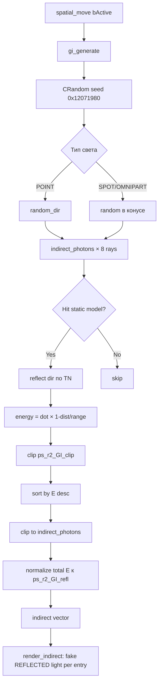
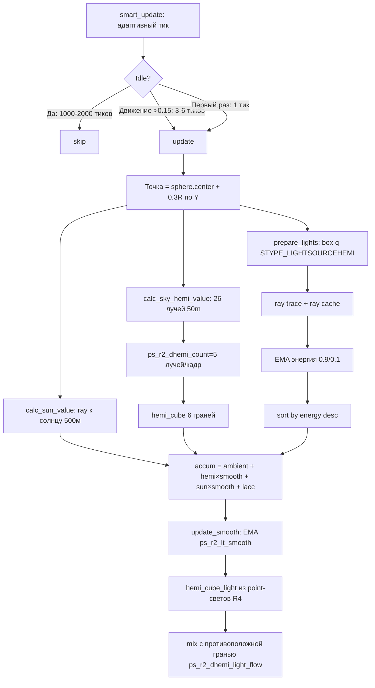

# Renderer: свет

## Ответственность

Световой подсистема R4 отвечает за **всё, что связано с источниками света**:
репрезентация (`light`), реестр и синхронизация с окружением (`CLight_DB`),
упаковка на кадр (`light_Package`), culling по occlusion query
(`light::vis_*`), генерация теневых карт динамических светов (`smapvis`,
`render_lights`), генерация GI-фотонов (`light::gi_generate`) и
ambient/AO-трекинг через hemisphere-сэмплирование (`CROS_impl`).

**Чего она НЕ делает**: рендер солнечного VSM-пайплайна (каскады, TSM,
near/middle/far) — это [VSM / SMAP](vsm-smap.md) (порцион 6). Конкретные
shader-блендеры света (`blender_light_direct/point/spot/reflected/mask`) и
`CRenderTarget::phase_smap_spot/accum_*` — порционы 12–14. Класс
`CLight_Render_Direct` целиком (кроме `compute_xf_spot`) — порцион 12.
`SMAP_Allocator` — уже в [vsm-smap](vsm-smap.md).

## Место в архитектуре

Свет — мост между **окружением** (xrEngine, [Окружение](../xr-engine/environment.md):
`CEnvironment::CurrentEnv` → `sun_dir/sun_color`), **спатиальным пространством**
(`g_SpatialSpace`: `STYPE_LIGHTSOURCE`/`STYPE_LIGHTSOURCEHEMI`/
`STYPE_RENDERABLE`) и **render-target пайплайном R4** (порционы 12–14).



## Публичный API

### `light` (`src/Layers/xrRender/light.h`, `: IRender_Light, ISpatial`)

| Метод                            | Назначение                                                                                                                        |
| -------------------------------- | --------------------------------------------------------------------------------------------------------------------------------- |
| `set_volumetric(b)`              | Включить/выключить volumetric (force-on при `ps_ssfx_volumetric.x > 0`)                                                           |
| `set_volumetric_intensity(f)`    | Задаёт интенсивность (на деле читает `ps_ssfx_volumetric.y`, **параметр игнорируется**)                                           |
| `set_volumetric_distance(f)`     | Задаёт дистанцию (на деле хардкод `1.0f`, **параметр игнорируется**)                                                              |
| `spatial_move()`                 | Per-тип вычисление bounding sphere; вызывает `gi_generate()` если `bActive`; `svis.invalidate()`                                  |
| `set_texture(T)`                 | Создаёт `s_spot`/`s_point`/`s_volumetric` + MSAA-варианты; R4: `accum_volumetric_nomsaa`                                          |
| `export_(pkg)`                   | Разложение в `light_Package`: POINT+bShadow → 6 OMNIPART детей; SPOT+bShadow → self в `v_shadowed`; без тени → `v_point`/`v_spot` |
| `xform_calc()`                   | Once-per-frame (`m_xform_frame` latch): поворот из direction/right, масштаб per тип                                               |
| `get_LOD()`                      | `1` если `!bShadow`; иначе SSA-based fade через `ps_r2_slight_fade`/`r_ssaGLOD_start/end`                                         |
| `set_cone(deg)`                  | Угол конуса; `VERIFY < 121°` (комментарий: «120 is hard limit»)                                                                   |
| `vis_prepare()`                  | Подготовка occlusion test (см. ниже)                                                                                              |
| `vis_update()`                   | Обработка результата occlusion query                                                                                              |
| `gi_generate()`                  | Фотонная генерация GI (см. ниже)                                                                                                  |
| `vis_data hom` / `get_homdata()` | Sfera→box для HOM-culling                                                                                                         |

Поля-флаги (битовое поле `type`): `type` (LT: DIRECT/POINT/SPOT/OMNIPART/REFLECTED),
`bStatic`, `bActive`, `bShadow`, `bVolumetric`, `bHudMode`.
Позиция по умолчанию `(0,-1000,0)` — при первом `spatial_move` без установки
выводит DEBUG-предупреждение «Uninitialized light position».

SSS-поля: `sss_id`, `sss_refresh`, `sss_priority`, `sss_is_playerlight`,
делегат `sss_on_light_destroy`.

Деструктор: нулит соответствующие записи в `RImplementation.Lights_LastFrame`,
вызывает `sss_on_light_destroy`.

### `CLight_DB` (`src/Layers/xrRender/Light_DB.h`)

| Метод                     | Назначение                                                                                                                                                                                                                                                                                                            |
| ------------------------- | --------------------------------------------------------------------------------------------------------------------------------------------------------------------------------------------------------------------------------------------------------------------------------------------------------------------- |
| `Load(Reader)`            | Читает чанк `fsL_LIGHT_DYNAMIC` из LTX: `Flight` (D3D9-legacy struct) + u32 controller; DIRECTIONAL → `sun_original` (type DIRECT) + копия `sun_adapted`; остальные → POINT в `v_static`. `R_ASSERT2(sun_original && sun_adapted, "Where is sun?")`                                                                   |
| `LoadHemi(Reader)`        | Читает `$level$/build.lights` чанк 1: `R_Light` struct; только D3DLIGHT_POINT → `v_hemi` с `STYPE_LIGHTSOURCEHEMI`                                                                                                                                                                                                    |
| `Update()`                | Синхронизация солнца из `Environment().CurrentEnv`: `sun_dir` VERIFY y<0; позиция = камера − 500·dir; adapted: `AD = (0,−0.75,0) + sun_dir` (while-loop если magnitude < 0.001); цвет × `ps_r2_sun_lumscale²` × `ps_r2_sun_lumscale_color`; range=600; `!is_sun_static()` → adapted=original. Затем `package.clear()` |
| `add_light(L, noshadows)` | Once-per-frame latch (`frame_render`); `noshadows` → `bShadow=FALSE`; static + `!R2FLAG_R1LIGHTS` → skip; иначе → `export_(package)`                                                                                                                                                                                  |
| `Create()`                | Создаёт `light*`: `bStatic=false`, `bActive=false`, `bShadow=true`                                                                                                                                                                                                                                                    |

### `light_Package` (`src/Layers/xrRender/Light_Package.h`)

| Поле         | Назначение                                                                                   |
| ------------ | -------------------------------------------------------------------------------------------- |
| `v_point`    | Сырые `light*` — point-светы без тени                                                        |
| `v_spot`     | Сырые `light*` — spot-светы без тени                                                         |
| `v_shadowed` | Сырые `light*` — shadowed (spot + omnipart)                                                  |
| `sort()`     | `stable_sort` по `pred_light_cmp`: pending первыми (по `query_order`), затем по `range` desc |

Хранит **сырые указатели** `light*` (не `ref_light`); владение — через
`CLight_DB::v_static` или вызывающий код.

### `CROS_impl` (`src/Layers/xrRender/LightTrack.h`, `: IRender_ObjectSpecific`)

| Метод                        | Назначение                                                                                            |
| ---------------------------- | ----------------------------------------------------------------------------------------------------- |
| `update(O)`                  | Once-per-frame: сэмплирование hemisphere (26 лучей), sun-value ray, AO-трекинг статических источников |
| `smart_update(O)`            | R4: адаптивный тик — 1 тик при idle, 3–6 при движении (>0.15), 1000–2000 ticks до следующего          |
| `update_smooth()`            | EMA-сглаживание `ps_r2_lt_smooth` (def 1.0) на hemi/sun/cube                                          |
| `get_luminocity()`           | `max(approximate.rgb)` clamp [0,1]                                                                    |
| `get_luminocity_hemi_cube()` | Возвращает `hemi_cube_smooth` (используется `CEffect_Rain::hemi_factor`)                              |

Константы: `lt_hemisamples=26`, `lt_inc=4`, `lt_dec=2`, `MODE` def `TRACE_ALL`.

## Внутреннее устройство

### `light` — пространственное представление

**`spatial_move()`** — вычисление bounding sphere per тип:

- `POINT`/`REFLECTED`: сфера в позиции радиусом `range`.
- `SPOT`: описывающая сфера с obtuse/acute-логикой — если угол конуса > 90°,
  центр смещён назад от позиции; иначе — перед. Радиус — по формуле
  с `tan(cone/2)`.
- `OMNIPART`: сфера со смещением `range * RSQRTDIV2` (для 6-гранного
  cubemap-разложения POINT+bShadow).

После вычисления: если `bActive` → `gi_generate()`; затем
`svis.invalidate()` (пересчёт теневой карты).

**`set_texture`** — создание текстур:

- `s_spot` — для spot (projective texture).
- `s_point` — для point (cubemap).
- `s_volumetric` — для volumetric smoke.
- MSAA-варианты при `dx10_msaa_opt`.
- R4: `accum_volumetric_nomsaa` (без MSAA для volumetric).
- `#pragma todo` «Only shadowed spot implements projective texture».

**`export_(light_Package& pkg)`** — разложение на кадр:

- `POINT` + `bShadow` → создаёт **6 детей OMNIPART** (`omnipart[0..5]`)
  с `cmNorm[6]`/`cmDir[6]` (нормали/направления граней куба).
  **Quirk**: `cmNorm[6]` — для +X и −X **обе** используют `(0,1,0)`
  (дублирование), вероятно legacy.
  Отслеживание через `omnipart_num`/`omipart_parent`.
- `SPOT` + `bShadow` → self в `v_shadowed`.
- Без тени → `v_point` (POINT) или `v_spot` (SPOT).

**`xform_calc()`** — once-per-frame (`m_xform_frame` latch):

- Построение поворота из `direction`/`right` (auto up если `right = 0`).
- Масштаб per тип:
  - `POINT`: `range`.
  - `SPOT`: `2*range*tan(cone/2)` × `range`.
  - `OMNIPART`: `2*range`.

**`get_LOD()`**:

- `!bShadow` → `1`.
- Иначе: SSA-based fade через `ps_r2_slight_fade` (def 0.5) и
  `r_ssaGLOD_start/end` — плавное уменьшение LOD по расстоянию.

### `CLight_DB` — реестр и синхронизация

**`Load`** — чтение из LTX (чанк `fsL_LIGHT_DYNAMIC`):

- `Flight` — D3D9-legacy struct (≈ `D3DLIGHT9`, из `_d3d_extensions.h`);
  u32 controller-поле.
- DIRECTIONAL → `sun_original` (type DIRECT) + копия `sun_adapted`.
- Остальные → POINT в `v_static`.
- `R_ASSERT2(sun_original && sun_adapted, "Where is sun?")`.

**`LoadHemi`** — чтение `$level$/build.lights` чанк 1:

- `R_Light` struct (hemisphere light data).
- Только `D3DLIGHT_POINT` → `v_hemi` с `STYPE_LIGHTSOURCEHEMI`.

**`Update`** — синхронизация солнца (вызывается из `CRender::Calculate`):

- `sun_dir` из `Environment().CurrentEnv`; `VERIFY(y < 0)`.
- Позиция солнца = позиция камеры − `500 * sun_dir` (магическое число).
- Adapted sun: `AD = (0, −0.75, 0) + sun_dir`;
  while-loop нормализации если magnitude < 0.001
  («for some reason E.sun_dir can point-up» workaround).
- Цвет: `sun_color × ps_r2_sun_lumscale² × ps_r2_sun_lumscale_color`.
- `range = 600`.
- `!is_sun_static()` → `sun_adapted = sun_original` (динамическое солнце).
- Затем `package.clear()`.

**`add_light(L, noshadows)`** — once-per-frame latch (`frame_render`):

- `noshadows` → `L.bShadow = FALSE`.
- `L.bStatic && !R2FLAG_R1LIGHTS` → skip (статические светы не добавляются
  в динамический пакет по умолчанию).
- Иначе → `L.export_(package)`.

### `light_Package` — упаковка на кадр

**`sort()`** — `stable_sort` по `pred_light_cmp`:

1. Pending-светы (с pending occlusion query) первыми, по `query_order`.
2. Остальные по `range` desc (дальние — раньше).

### `CROS_impl` — AO / hemisphere трекинг

**`update(O)`** — once-per-frame:

- Точка сэмплирования = центр `vis.sphere` + `0.3*R` по Y
  (quirk: «sample point above center», причина не задокументирована).
- **`calc_sun_value`**: ray к солнцу (500 м, `rqtBoth`),
  каждый `lt_hemisamples/4..lt_hemisamples/2` кадров (адаптивная частота).
- **`calc_sky_hemi_value`**: 26 лучей (`hdir[26]`), 50 м, `rqtStatic`,
  `ps_r2_dhemi_count` = 5 лучей/кадр (остаточные накапливаются в
  `hemi_cube[6]`).
- **`prepare_lights`**: box-query `STYPE_LIGHTSOURCEHEMI` вокруг точки,
  ray-trace видимости с ray cache, EMA энергии 0.9/0.1,
  сортировка по энергии desc.
  **R4-специфика**: фильтр `source->flags.bStatic` — только статические
  источники (динамические не трекаются для AO).
- **Accum**: `ambient + hemi*hemi_smooth + sun*sun_smooth + lacc`
  (или `(0.1,0.1,0.1)` если `!TRACE_LIGHTS`).
- **R4 `hemi_cube_light[6]`**: из point-светов с attenuation
  `1/(a0+a1*d+a2*d²) − d*falloff`, ×2 для динамических;
  `hemi_value` = `avg(lacc) * ps_r2_dhemi_light_scale`;
  `hemi_cube` смешивается с противоположной гранью через
  `ps_r2_dhemi_light_flow`.

**`smart_update`** (R4-адаптивный тик):

- Первый раз: 1 тик.
- Позиция изменилась (>0.15): 3–6 тиков.
- Idle: 1000–2000 тиков до следующего.
- Счётчик `sky_rays_uptodate`.

**`update_smooth`**: EMA `ps_r2_lt_smooth` (def 1.0) на hemi/sun/cube.

**`hdir[26]`** — 26 направлений hemisphere-сэмплирования
(икосаэдр-подобное, переупорядочено от оригинального 26-точечного набора).

### `CRender::Calculate` (`r2_R_calculate.cpp`)

> Историческое ядро, переиспользуемое в R4.

1. SSA-пороги из `g_fSCREEN`: `width*height*fov_factor*(EPS + ps_r__LOD)`.
2. `detectSector` при смене позиции камеры → `OnSectorChanged`.
3. Dual-render portal detection (box-query вокруг камеры).
4. **`Lights.Update()`** — синхронизация солнца + `package.clear()`.
5. Sphere query `STYPE_LIGHTSOURCE` вокруг камеры
   → `spatial_updatesector` + `Lights.add_light(L)`.

### `CRender::render_lights` (`r2_R_lights.cpp`)

> Историческое ядро, переиспользуемое в R4.

Вызывается **дважды** из `r4_R_render.cpp`:

- `render_lights(LP_normal)` — «Lighting, non dependant on OCCQ».
- `render_lights(LP_pending)` — «Lighting, dependant on OCCQ».

**`hud_light_apply/restore`**: сохраняет/восстанавливает позицию+направление
для `bHudMode` светов (HUD→world transform).

**Фаза 1** — `v_shadowed`:

- `vis_update` для каждого.
- Удаление невидимых.
- `compute_xf_spot` для видимых (SMAP sizing).

**Фаза 2** — SMAP packing:

- Итеративный: sort по `X.S.size` desc.
- `LP_smap_pool.push` — first-fit в atlas.
- Назначение `smap_ID` per atlas page.
- Reverse в конце (чтобы самые большие — последними).

**Основной цикл** `while(v_shadowed.size())`:
Per SMAP page:

1. `phase_smap_spot_clear`.
2. Per light: `svis.begin` → `r_dsgraph_render_subspace` →
   `phase_smap_spot` → `r_dsgraph_render_graph(0)` →
   grass shadows (если `check_grass_shadow`) →
   tshadows pass 1 (если `bSpecial`) → `svis.end`.
3. `phase_accumulator`.
4. `accum_point`/`accum_spot` для unshadowed.
5. `accum_spot` + `accum_volumetric` для shadowed spots
   (volumetric при `ssfx_volumetric` в 1/8 рез).

**После цикла**: оставшиеся `v_point`/`v_spot` — accumulated.

**`render_indirect`** (GI):

- Гated `R2FLAG_GI`.
- Per `indirect` entry: создаёт фейковый REFLECTED light.
- Energy clip `ps_r2_GI_clip`.
- Range из linear falloff approximation.
- `Target->accum_reflected`.

### `compute_xf_spot` (`Light_Render_Direct_ComputeXFS.cpp`)

> Файл входит в порцион 12 по плану, но `compute_xf_spot` —
> неотъемлемая часть SMAP sizing, поэтому документирован здесь.

- `tan_shift` per тип: OMNIPART 0.3, POINT 0.2007, SPOT 0.061
  (комментарий «Ray Twitty»).
- Size hysteresis (`_epsilon = 1%`) — чтобы избежать SMAP resize flicker.

### `light::gi_generate` (`light_GI.cpp`)

- Photon-style: `indirect_photons` (def 16, range 8..64) × 8 rays.
- **`CRandom` seed `0x12071980`** (фиксированный) — детерминированные фотоны.
- Ray из позиции света в случайном направлении:
  - `POINT`: `random_dir`.
  - `SPOT`/`OMNIPART`: random в пределах конуса.
- Попадание в static model → отражённое направление
  `LI.D = dir.reflect(TN)`, энергия `dot * (1 − dist/range)`,
  clip `ps_r2_GI_clip`.
- **Quirk**: `LI.S = spatial.sector` с комментарием `. BUG`.
- Sort by E desc, clip to `indirect_photons`,
  нормализация суммарной E к `ps_r2_GI_refl` (0.9).

### `light::vis_prepare / vis_update` (`light_vis.cpp`)

**`vis_prepare`**:

- Если photon count изменился → `gi_generate`.
- Scheduled test (`frame2test`).
- Safe area из FOV/aspect.
- Skip test при `R2FLAG_EXP_DONT_TEST_*` или если камера внутри объёма
  → видимый, малый delay (1–3 кадра).
- Иначе: pending, `xform_calc`, `occq_begin`,
  **stencil hack** для volumetric spot+shadow (`set_Stencil(FALSE)`),
  `Target->draw_volume(this)`, `occq_end`.

**`vis_update`**:

- `!pending` → return.
- `occq_get`.
- Видимый если `fragments > cullfragments(4)`.
- Видимый → большой delay (10–20 кадров).
- Невидимый → каждый кадр.

### `smapvis` (`light_smapvis.h/.cpp`, `: R_feedback`)

> Файл в `xrRenderPC_R2/`, но **компилируется в R4** через
> `xrRender_R4.vcxproj`. Историческое ядро, переиспользуемое в R4.

Состояния: `state_counting` (0) → `state_working` (1) → `state_usingTC` (3)
(quirk: enum пропускает 2).

| Метод                | Назначение                                                                                                                                                          |
| -------------------- | ------------------------------------------------------------------------------------------------------------------------------------------------------------------- |
| `invalidate()`       | `state_counting`, `frame_sleep = dwFrame + ps_r__LightSleepFrames`                                                                                                  |
| `begin()`            | counting → ничего; working → mark invisible + set feedback breakpoint; usingTC → mark                                                                               |
| `end()`              | counting → working если sleep истёк (записывает `test_count`); working → 1 GPU occq per frame (1 caster, `rfeedback_static` → `testQ_V`); `testQ_frame = dwFrame+1` |
| `flushoccq()`        | Вызывается из `CRender::Render`/`render_main` через `Lights_LastFrame`; если 0 фрагментов → invisible, иначе advance; все done → `state_usingTC`                    |
| `mark()`             | Ставит `vis.marker` на невидимые визуалы (отключает обработку)                                                                                                      |
| `rfeedback_static()` | R4 dsgraph вызывает при обнаружении уже-известного-невидимого визуала → останавливает рендер, записывает в occq                                                     |

**Inкрементальный подход**: 1 GPU occlusion query на свет на кадр
(1 caster), результат через `flushoccq` на следующий кадр.

### `CLight_DB::Create` и жизненный цикл

```
Create() → light* (bStatic=false, bActive=false, bShadow=true)
  → spatial_move() (bounding sphere + gi_generate + svis.invalidate)
  → CRender::Calculate: Lights.add_light() → export_(package)
  → CRender::render_lights: vis_prepare/vis_update, SMAP, accum
  → деструктор: null Lights_LastFrame, sss_on_light_destroy
```

## Взаимодействие

**Кто вызывает меня**:

- `CRender::Calculate` (`r2_R_calculate.cpp`) → `Lights.Update()`,
  `Lights.add_light(L)`.
- `CRender::render_main` / `r4_R_render.cpp` → `render_lights(LP_normal)`,
  `render_lights(LP_pending)`.
- `CRender::Render` / `render_main` → `svis.flushoccq()` через
  `Lights_LastFrame`.
- `CRender::reset` (`r4.cpp`) → `svis.resetoccq()`.
- `CLevel::OnRender` (`IGame_Level`) → `Calculate` → `Render`.
- `CEnvironment` (xrEngine) → `CLight_DB::Update` (sun sync).
- `CEffect_Rain::OnFrame` → `CROS_impl::get_luminocity_hemi_cube()`.

**Кого вызываю я**:

- `g_SpatialSpace` — `q_box(STYPE_LIGHTSOURCEHEMI)`, `q_ray`,
  `spatial_move` (bounding volume registration).
- `CRenderTarget` (порционы 12–14) — `phase_smap_spot_clear/spot`,
  `accum_point/spot/volumetric/reflected`, `draw_volume`.
- `R_occlusion` (HWOCC) — `occq_begin/end/get`.
- `SMAP_Allocator` (`LP_smap_pool`) — SMAP atlas allocation.
- `CDetailManager::Render` (grass shadows) — `check_grass_shadow`.
- `r_dsgraph_render_subspace` (dsgraph, порцион 5) — рендер casters.
- `Environment()` (xrEngine) — `CurrentEnv` (sun data).
- `CLight_Render_Direct::compute_xf_spot` (порцион 12) — SMAP sizing.

## Потоки данных / управления

### Жизненный цикл света (create → add → render → destroy)



### SMAP generation per light (shadowed)



### GI photon generation



### CROS AO update



## Конфигурация

### Console variables (`xrRender_console.cpp`)

| cvar                       | Тип      | Def          | Назначение                          |
| -------------------------- | -------- | ------------ | ----------------------------------- |
| `ps_r2_ls_flags`           | Flags32  | см. ниже     | Флаги рендеринга света              |
| `ps_r2_GI_photons`         | int      | 16 (8..64)   | Число GI-фотонов                    |
| `ps_r2_GI_clip`            | float    | `EPS_L`      | Clip энергии GI                     |
| `ps_r2_GI_refl`            | float    | 0.9          | Нормализация суммарной E GI         |
| `ps_r2_sun_lumscale`       | float    | 1.0          | Масштаб яркости солнца              |
| `ps_r2_sun_lumscale_color` | Fvector  | (1,1,1)      | Цветовой масштаб солнца             |
| `ps_r2_dhemi_sky_scale`    | float    | 0.08         | Масштаб sky hemisphere              |
| `ps_r2_dhemi_light_scale`  | float    | 0.2          | Масштаб light hemisphere            |
| `ps_r2_dhemi_light_flow`   | float    | 0.1          | Смешивание с противоположной гранью |
| `ps_r2_dhemi_count`        | int      | 5            | Лучей hemisphere per кадр           |
| `ps_r2_lt_smooth`          | float    | 1.0          | EMA-сглаживание CROS                |
| `ps_r2_slight_fade`        | float    | 0.5          | SSA fade для slight                 |
| `ps_ssfx_shadows`          | Fvector3 | (256,1536,0) | SMAP min/max res                    |
| `ps_ssfx_volumetric`       | Fvector4 | (1,1,3,1)    | force/intensity/quality/unused      |
| `ps_r2_ls_squality`        | float    | 1.0          | Shadow quality                      |

### `ps_r2_ls_flags` — биты

| Бит   | Флаг                              | Def         | Назначение                    |
| ----- | --------------------------------- | ----------- | ----------------------------- |
| 0     | `R2FLAG_SUN`                      | set         | Рендер солнца                 |
| 1     | `R2FLAG_EXP_DONT_TEST_UNSHADOWED` | —           | Не тестировать unshadowed     |
| 2     | `R2FLAG_EXP_SPLIT_SCENE`          | —           | Разделение сцены              |
| 3     | `R2FLAG_EXP_MT_CALC`              | —           | Multi-thread calc             |
| 4     | `R3FLAG_DYN_WET_SURF`             | —           | Dynamic wet surface           |
| 5     | `R3FLAG_VOLUMETRIC_SMOKE`         | —           | Volumetric smoke              |
| 6     | `R2FLAG_DETAIL_BUMP`              | —           | Detail bump                   |
| 7     | `R2FLAG_DOF`                      | —           | Depth of field                |
| 8     | `R2FLAG_SOFT_PARTICLES`           | —           | Soft particles                |
| 9     | `R2FLAG_SOFT_WATER`               | —           | Soft water                    |
| 10    | `R2FLAG_STEEP_PARALLAX`           | —           | Steep parallax                |
| 11    | `R2FLAG_SUN_FOCUS`                | —           | Sun focus (TSM)               |
| 12    | `R2FLAG_SUN_TSM`                  | —           | Sun TSM                       |
| 13    | `R2FLAG_TONEMAP`                  | —           | Tonemap                       |
| **6** | **`R2FLAG_GI`**                   | **NOT set** | **GI (opt-in через консоль)** |
| 20    | `R2FLAG_VOLUMETRIC_LIGHTS`        | set         | Volumetric lights             |

> **`R2FLAG_GI` не установлен по умолчанию** — GI включается вручную:
> `r2_ls_flags +64` (или `r2_ls_flags 64` через toggle).

## Известные ограничения / дебаг

1. **`set_volumetric_intensity`** — **игнорирует параметр**, читает
   `ps_ssfx_volumetric.y`.
2. **`set_volumetric_distance`** — **хардкод `1.0f`**, игнорирует параметр.
3. **`gi_generate`**: `LI.S = spatial.sector` с комментарием `. BUG` —
   сектор может быть устаревшим.
4. **`gi_generate`**: фиксированный `CRandom` seed `0x12071980` —
   детерминированные фотоны (одинаковые на каждом уровне).
5. **`cmNorm[6]` в `export_`**: для +X и −X **обе** используют `(0,1,0)`
   как нормаль (дублирование) — вероятно legacy.
6. **`Light_DB::Load`** читает `Flight` (D3D9 `D3DLIGHT9`-подобный struct
   из `_d3d_extensions.h`) — исторический формат.
7. **`sun_adapted`** позиция: offset `−500` — магическое число.
8. **`AD = (0,−0.75,0) + sun_dir`** — workaround «for some reason
   E.sun_dir can point-up»; while-loop нормализации.
9. **`smapvis::flushoccq`**: 1 GPU occlusion query на свет на кадр
   (1 caster) — инкрементальный подход.
10. **`compute_xf_spot`**: `tan_shift` per тип (OMNIPART 0.3, POINT 0.2007,
    SPOT 0.061) — комментарий «Ray Twitty».
11. **`compute_xf_spot`**: size hysteresis (`_epsilon = 1%`) —
    защита от SMAP resize flicker.
12. **`render_lights`**: `HOM.Disable()` вызывается **дважды**
    (перед циклом и в accumulator phase).
13. **`CROS_impl::update`**: `position.y += 0.3*R` — точка сэмплирования
    выше центра (причина не задокументирована).
14. **`CROS_impl::prepare_lights`**: R4 фильтрует только
    `source->flags.bStatic` (динамические светы не трекаются для AO).
15. **`light_Package`** хранит сырые `light*` (не `ref_light`) —
    владение через `CLight_DB::v_static`/вызывающий код.
16. **`smapvis`** state enum пропускает 2
    (`counting=0`, `working=1`, `usingTC=3`).
17. **`vis_prepare`**: `xform_calc` + `RCache.set_xform_world(m_xform)` —
    собственный xform света используется для volume rendering.
18. **`R2FLAG_GI`** не установлен по умолчанию — GI opt-in через консоль.

### PIX_EVENT имена (debug)

- `SHADOWED_LIGHTS` — фаза рендеринга shadowed lights.
- `POINT_LIGHTS` — накопление point lights.
- `SPOT_LIGHTS` — накопление spot lights.
- `VOLUMETRIC_LIGHTS` — volumetric pass.
- `INDIRECT_LIGHTS` — GI reflected pass.

> См. также: [Occlusion](occlusion.md) (порцион 4) — `light::vis_*`
> частично покрыт там; полный разбор — здесь.
> [VSM / SMAP](vsm-smap.md) (порцион 6) — `smapvis`, `SMAP_Allocator`.
> [R4: scene/lighting](r4-scene.md) (порцион 12) — `CLight_Render_Direct`,
> `blender_light_*`.
> [R4: deferred](r4-deferred.md) (порцион 13) — `CRenderTarget::accum_*`.
