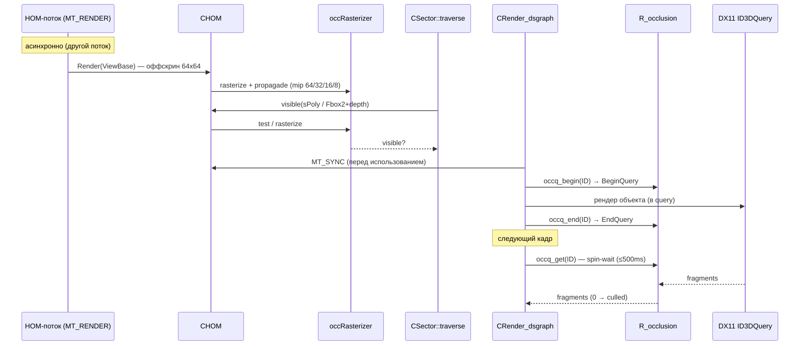

# Renderer: occlusion (HOM + GPU occlusion queries)

## 1. Ответственность

Окклюзионный culling R4: два независимых механизма — **HOM** (Home-Oriented culling, CPU-rasterizer с оффскрин-буфером, асинхронный поток) для culling'а порталов/геометрии и **GPU occlusion queries** (`R_occlusion`) для culling'а динамических объектов и светов. Не рендерит сцену в основной framebuffer — только в служебные буферы.

## 2. Место в архитектуре

См. [Архитектура](../../architecture/overview.md), [Зависимости](../../architecture/dependencies.md), [Пайплайн: секторы](sector.md).

- `CHOM` — поле `CRender::HOM`, вызывается из `CSector::traverse` (VQ_HOM) и из dsgraph-пайплайна.
- `R_occlusion HWOCC` — поле `CRender`, используется из dsgraph (culling динамических) и из `light::vis_prepare/vis_update` (culling светов).
- `occRasterizer Raster` — глобал, CPU-rasterizer для HOM-пирамиды.

```mermaid
graph TD
    HOM[CHOM — HOM.cpp] -->|MT_RENDER — асинхронный поток| RT[оффскрин RT 64x64]
    RT -->|mip 64/32/16/8| Occ[occRasterizer Raster — CPU]
    Sec[CSector::traverse — VQ_HOM] -->|visible(sPoly / Fbox2+depth)| HOM
    DSG[CRender_dsgraph — динамические] -->|occq_begin/end/get| OCCQ[R_occlusion HWOCC]
    Light[light::vis_prepare/vis_update] -->|occq + draw_volume| OCCQ
    OCCQ -->|ID3DQuery OCCLUSION| GPU[DX11]
```

## 3. Публичный API

| Класс/функция | Назначение |
|---|---|
| `CHOM` | `Load()` (из `$level$/level.hom`), `Unload()`, `Render(CFrustum&)`, `Render_ZB()`, `Enable()/Disable()`, `MT_RENDER()`/`MT_SYNC()` (асинхронный поток), `visible(vis_data&)`/`visible(Fbox3&)`/`visible(sPoly&)` (3D, медленный), `visible(Fbox2&, float depth)` (2D, быстрый), `occlude(Fbox2&)` (заглушка) |
| `occRasterizer` (глобал `Raster`) | `clear()`, `rasterize(occTri*)`, `test(x0,y0,x1,y1,z)`, `propagade()`, `get_frame()/get_depth()/get_depth_level(0..3)` |
| `occTri` | `adjacent[3]`, `raster[3]`, `plane`, `area`, `flags`, `skip`, `center` |
| `R_occlusion` | `occq_create(limit)`, `occq_destroy()`, `occq_begin(u32& ID)` → order, `occq_end(u32& ID)`, `occq_get(u32& ID)` → fragments (`u64` в DX10/11) |
| `QueryHelper` | `CreateQuery/GetData/BeginQuery/EndQuery` (DX11: `HW.pContext`, см. [sector](sector.md)) |

## 4. Внутреннее устройство

### `CHOM` (`src/Layers/xrRender/HOM.h/.cpp`)

Поля: `xrXRC xrc`, `CDB::MODEL* m_pModel` (для 3D-тестов), `occTri* m_pTris`, `BOOL bEnabled`, `Fmatrix m_xform/m_xform_01`, `xrCriticalSection MT`, `volatile u32 MT_frame_rendered`.

**Загрузка** — `Load()`:
1. `$level$/level.hom` (chunk 1): поток `HOM_poly { Fvector v1,v2,v3; u32 flags; }` (`#pragma pack(4)`) → `CDB::Collector::add_face_packed_D(..., 0.01f)` (merge близких вершин).
2. `calc_adjacency(adjacency)` → `m_pTris` (occTri: `adjacent[3]` (или `(occTri*)(-1)` если нет), `flags = clT.dummy`, `area` (Герон), `plane.build(v0,v1,v2)`, `raster[3]` (проекции), `center`).
3. `m_pModel` — `CDB::MODEL` для 3D-тестов.

**Асинхронный рендер** — `MT_RENDER()` (`__stdcall`):
- `MT.Enter()`; если `MT_frame_rendered != Device.dwFrame` и не main menu → `ViewBase.CreateFromMatrix(Device.mFullTransform, FRUSTUM_P_LRTB + FRUSTUM_P_FAR)`, `Enable()`, `Render(ViewBase)`.
- `MT_SYNC()` — обёртка (skip в main menu). Вызывается из dsgraph перед использованием HOM-данных.
- `Render(CFrustum&)` — оффскрин-рендер сцены в 64×64 RT + mипы; `Render_ZB()` — рендер с depth-only.
- `psOSSR = 0.001f` — oversampling-коэффициент.

**Видимость-тесты**:
- `visible(sPoly& P)` / `visible(Fbox3& B)` / `visible(vis_data&)` — **3D, медленный**: проекция в HOM-координаты → `Raster.rasterize` → проверка глубины.
- `visible(Fbox2& B, float depth)` — **2D, быстрый**: прямоугольник в viewport-пространстве 0..1 + глубина → `Raster.test(...)`.
- `occlude(Fbox2&)` — **пустая заглушка** (нет тела).
- TBB (`tbb/parallel_for`) — используется в рендере HOM (параллельный по триангулам).

### `occRasterizer` (`occRasterizer.h/.cpp`, `occRasterizer_core.cpp`)

Константы: `occ_dim_0 = 64`, `occ_dim_1..3 = 32/16/8`, `occ_dim = 68` (2px-рамка).

Поля:
- `occTri* bufFrame[68][68]` — карта треугольников на пиксель.
- `float bufDepth[68][68]` — float-глубина (base level).
- `occD bufDepth_0[64][64]` (s32), `bufDepth_1[32][32]` (s16), `bufDepth_2[16][16]`, `bufDepth_3[8][8]` — **квантованные мипы** (Hiz-стиль).

Квантование: `occQ_s32 = 0x40000000` ([-2..2] в s32), `occQ_s16 = 16383` ([-2..2] в s16); `df_2_s32/s16` (+`up`-варианты — ceil), `ds32_2_f/ds16_2_f`.

Методы:
- `clear()` — сброс пирамиды.
- `rasterize(occTri* T)` — растеризация треугольника в `bufFrame` + `bufDepth` (per-pixel).
- `test(x0, y0, x1, y1, z)` — **быстрый 2D-тест**: прямоугольник × глубина через мипы (проверка на каждом уровне).
- `propagade()` — мип-пропагация: `bufDepth_0 → _1 → _2 → _3` (min-пулинг с квантованием).
- DEBUG: `dbg_pixel_boxes[64*64]` (pixel-боксы для отладки), `on_dbg_render()`.

### `R_occlusion` (`src/Layers/xrRender/r__occlusion.h/.cpp`)

Константа: `occq_size = 2 * 768` (1536 queries, queue).

Поля: `BOOL enabled`, `xr_vector<_Q> pool` (sorted max..min по `order`), `xr_vector<_Q> used`, `xr_vector<u32> fids` (свободные ID). `_Q { u32 order; ID3DQuery* Q; }`. `iInvalidHandle = 0xFFFFFFFF`. `occq_result = u64` (DX10/11), `u32` (DX9).

**Дисциплина аллокации** (комментарий в заголовке): allocate (A,B,C,D) → free (A,B,C,D) → allocate... — pool отсортирован так, чтобы переиспользовались **самые старые** query (FIFO по `order`); предположение: используемых query ≪ общего числа.

- **`occq_create(limit)`**: `enabled = !strstr(Core.Params, "-no_occq")`; создаёт `limit` query (`CreateQuery(D3DQUERYTYPE_OCCLUSION)` — `VERIFY(!"No default.")` если не OCCLUSION), `std::reverse(pool)` (чтобы `pool.back()` = самый старый).
- **`occq_begin(u32& ID)`** → `order`:
  - `!enabled` → 0.
  - `pool.empty()` → `ID = iInvalidHandle` (предотвращение crash при >1536 query), return 0.
  - `stats.o_queries++`.
  - Если `fids` не пуст → `ID = fids.back()` (переиспользование), `used[ID] = pool.back()`; иначе `ID = used.size()`, `used.push_back(pool.back())`. `pool.pop_back()`.
  - `CHK_DX(BeginQuery(used[ID].Q))`. Return `used[ID].order`.
- **`occq_end(u32& ID)`**: `!enabled` или `iInvalidHandle` → return; `CHK_DX(EndQuery(used[ID].Q))`.
- **`occq_get(u32& ID)`** → `fragments`:
  - `!enabled`/`iInvalidHandle` → `0xFFFFFFFF`.
  - Spin-wait: `while (GetData(...) == S_FALSE) { SwitchToThread() || Sleep(ps_r2_wait_sleep); if (elapsed > 500ms) { fragments = -1; break; } }` — таймаут 500 мс (query считается видимым).
  - `D3DERR_DEVICELOST` → `0xFFFFFFFF`.
  - `fragments == 0` → `stats.o_culled++`.
  - Возврат query в `pool` (sorted insertion по `order`), `used[ID].Q = 0`, `fids.push_back(ID)`.
  - Таймер `RenderDUMP_Wait` (Device.Statistic).

### `light::vis_prepare` / `vis_update` (`src/Layers/xrRenderPC_R4/light_vis.cpp`)

Culling динамических светов через occlusion query:

**`vis_prepare()`**:
- Если `indirect_photons != ps_r2_GI_photons` → `gi_generate()`.
- Если `frame < vis.frame2test` → return (сохраняет старый результат).
- `safe_area` — из FOV/aspect (near-плоскость + углы): `max(VIEWPORT_NEAR, x0, x1, c)` где `x0 = near/cos(FOV*aspect/2)`, `x1 = near/cos(FOV/2)`, `c = sqrt(x0²+x1²)`.
- `skiptest`: `R2FLAG_EXP_DONT_TEST_UNSHADOWED && !flags.bShadow` или `R2FLAG_EXP_DONT_TEST_SHADOWED && flags.bShadow`.
- `vis.distance = |camera - spatial.sphere.P|`; если `skiptest || distance <= sphere.R*1.01 + safe_area` → `vis.visible = true`, `pending = false`, `frame2test = frame + randI(1..3)`.
- Иначе: `pending = true`, `xform_calc()`, `RCache.set_xform_world(m_xform)`, `vis.query_order = occq_begin(vis.query_id)`; **stencil-хак для volumetric spot+shadow**: `set_Stencil(FALSE)` (иначе `set_Stencil(TRUE, LESSEQUAL, 0x01, 0xff, 0x00)`); `Target->draw_volume(this)` (рендер объёма света в occlusion query); `occq_end(vis.query_id)`.

**`vis_update()`**:
- `!pending` → return.
- `fragments = occq_get(vis.query_id)`.
- `vis.visible = fragments > cullfragments` (`cullfragments = 4` — порог, чтобы один пиксель не считался видимым).
- `visible` → `frame2test = frame + randI(10..20)` (редкий ре-тест); `invisible` → `frame + 1` (повтор каждый кадр).

Константы: `delay_small_min/max = 1/3`, `delay_large_min/max = 10/20`, `cullfragments = 4`.

### `QueryHelper` (см. [sector](sector.md))

Обёртки `CreateQuery/GetData/BeginQuery/EndQuery` — DX11-путь: `HW.pDevice->CreateQuery(&desc, ppQuery)`, `HW.pContext->GetData(pQuery, pData, DataSize, 0)`, `HW.pContext->Begin/End(pQuery)`.

## 5. Взаимодействие

- **Вызывает**: `CHOM` → `occRasterizer Raster`, `CDB::Collector`/`CDB::MODEL`, TBB `parallel_for`, `Device.mFullTransform`, `Environment` (skip в main menu).
- `R_occlusion` → `QueryHelper` → `HW.pDevice`/`HW.pContext` (см. [Устройство рендера](render-device.md)).
- `light::vis_*` → `RImplementation.occq_*`, `Target->draw_volume` (см. [R4: scene/lighting](r4-scene.md)), `gi_generate` (см. [Свет](lights.md)).
- **Вызывается из**: `CSector::traverse` (VQ_HOM, [sector](sector.md)), `CRender_dsgraph` (culling динамических + `HOM.MT_SYNC`), `light::vis_prepare/vis_update` ([Свет](lights.md)), `CRender::create` (`HWOCC.occq_create(occq_size)`).

## 6. Потоки данных/управления



## 7. Конфигурация

- `-no_occq` — отключает `R_occlusion` (cvar/param в `Core.Params`).
- `ps_r2_wait_sleep` — sleep-интервал в `occq_get` spin-wait.
- `rsOcclusionDraw` — DEBUG-отрисовка порталов (см. [sector](sector.md)).
- `ps_r2_ls_flags` (`R2FLAG_EXP_DONT_TEST_UNSHADOWED`/`R2FLAG_EXP_DONT_TEST_SHADOWED`) — skip vis-теста светов.
- `ps_r2_GI_photons` — пересчёт GI-фотонов при смене.

## 8. Известные ограничения/дебаг

- `CHOM::occlude(Fbox2&)` — **пустая заглушка** (нет тела).
- `occq_get` — spin-wait до 500 мс; при таймауте query считается видимым (`fragments = -1`); `SwitchToThread()` перед `Sleep` (уступка другим потокам).
- `occq_begin` при пустом pool → `iInvalidHandle` (без crash, query просто не создаётся) — защита от >1536 query за кадр.
- `R_occlusion` — `enabled` определяется **однократно** в `occq_create` по `Core.Params` (не меняется на лету).
- `light::vis_prepare` — volumetric spot+shadow: `set_Stencil(FALSE)` — хак (комментарий: «Light is visible if it's frustum is visible. Only for volumetric»).
- `cullfragments = 4` — порог: ≤4 пикселя = невидимый (защита от одиночных пикселей/артефактов).
- HOM-рендер — **асинхронный**: `MT_SYNC` должен быть вызван перед использованием; в main menu — skip.
- DEBUG: `CHOM::OnRender`/`stats` (`tris_in_frame_visible`/`tris_in_frame`), `occRasterizer::on_dbg_render`/`dbg_pixel_boxes`.
- `psOSSR = 0.001f` — oversampling, магическое число.
