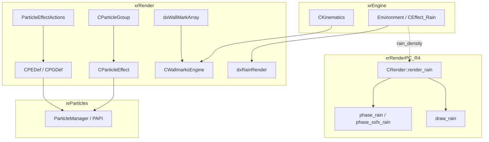
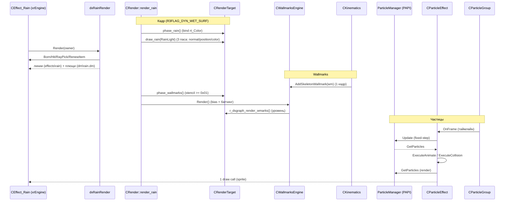

# Renderer: частицы и wallmarks

> Итерация 3, порцион 16. Активный бэкенд — R4 (DX11); D3D9/редакторские ветки помечены.

## 1. Ответственность

Порцион закрывает два независимых «спецэффектных» подсистема xrRender +
R4-обвязку:

- **Particle system** (`ParticleEffect*`): декларативные sprite-эффекты.
  `CParticleEffect` — рендерный «обёрнутый» объект вокруг **PAPI**
  (`ParticleManager`, пространство имён `PAPI`, движок симуляции — модуль
  `xrParticles`, итерация 4): держит хэндлы эффекта и action-листа,
  тикает `OnFrame` (fixed-step аккьюмьюлятор), вызывает `ExecuteAnimate`
  (анимация кадров спрайта) и `ExecuteCollision` (ray-pick коллизии),
  стримит sprite-вертексы в VB и рендерит один draw call на эффект.
  `CParticleGroup` — композиция N эффектов по таймлайну (`m_Time0/m_Time1`)
  с «дети-эффектами» (related/free child); `CPEDef`/`CPGDef` — сериализуемые
  определения (PED/PGD-чанки, INI-варианты Save2/Load2);
  `ParticleEffectActions` — редакторская библиотека «actions» (`EParticleAction`
  - 30 подклассов), компилируемая в байт-код PAPI.
- **Wallmarks** (`CWallmarksEngine`): декакали на геометрии. Статические
  wallmarks — вырезаются из статического меша уровня (DFS-обход смежных
  треугольников с плоскостным тестом) в момент попадания; скелетные
  (динамические) wallmarks — добавляются через `CKinematics::AddWallmark`
  (порцион 9), рендерятся один кадр и удаляются. Рендер — батчинг по
  shader-slot'ам, с bias-матрицами, чтобы wallmark рисовался «сверху»
  геометрии.
- **Rain** (`dxRainRender` + R4): два независимых слоя — «капли» (линии,
  `effects\rain`) и «плющи» (detail-модель `dm\rain.dm`, `effects\rain_splash`
  при `ssfx_rain`); плюс **динамический wet-surfaces** (`render_rain` /
  `phase_rain` / `draw_rain`) — screen-space «мокрость» на deferred-буферах
  с собственной shadow-map.

**Не покрывается**: internals `ParticleManager`/`PAPI` (симуляция частиц,
компиляция действий) — `xrParticles`, итерация 4; `CEffect_Rain` как объект
окружения (Born/Hit/RayPick/RenewItem/Particle-пул) — `xrEngine/Rain.cpp`,
уже покрыто в итерации 2 (см. [Эффекты](../xr-engine/effects.md));
`CSkeletonWallmark`/`CKinematics::RenderWallmark` — [Скелеты](kinematics.md)
(порцион 9); RT-фаза `phase_wallmarks()` — `r4_rendertarget_phase_combine.cpp`,
уже покрыта в [R4: post-process](r4-postprocess.md) (порцион 14) — здесь
только указатель.

## 2. Место в архитектуре

- **Частицы**: `CParticleEffect`/`CParticleGroup` создаются через
  `RImplementation.model_CreatePE`/`model_CreateParticles`
  ([Ресурсы](resources.md), порцион 7 — `CModelPool`/`PSLibrary.FindPED`/
  `FindPGD`). Симуляция живёт в `xrParticles` (`ParticleManager`);
  xrRender-обёртка — только tики, коллизии, анимация кадров и vertex-стрим.
- **Wallmarks**: `CWallmarksEngine` создаётся в `CRenderTarget`/`CRender`
  при `level_Load` (см. [R4: scene](r4-scene.md), порцион 12 —
  `r4_loader.cpp`); вызов рендера — из `CRender::Render` между
  `phase_scene_end` и flush occq (порцион 12): `Target->phase_wallmarks();
Wallmarks->Render();` (`r4_R_render.cpp` L490–497). Уровень-ваалмарки —
  `r_dsgraph_render_wmarks()` (dsgraph-карта `mapWmark`, порцион 5).
- **Rain (капли/плющи)**: `CEffect_Rain::Render()` (xrEngine, итерация 2)
  делегирует `m_pRender->Render(*this)` → `dxRainRender::Render`
  (фабрика — `dxRenderFactory`, порцион 1).
- **Rain (wet-surfaces)**: `CRender::Render` при `R3FLAG_DYN_WET_SURF`
  вызывает `render_rain()` (порцион 12 — [R4: scene](r4-scene.md));
  внутри — SMAP-проход + `phase_rain()` + `draw_rain()`.

## 3. Публичный API

### `CParticleEffect` (ParticleEffect.h, `namespace PS`)

| Член                                                                                 | Назначение                                                                                                                                                            |
| ------------------------------------------------------------------------------------ | --------------------------------------------------------------------------------------------------------------------------------------------------------------------- |
| `CParticleEffect()` / `~CParticleEffect()`                                           | ctor: `ParticleManager()->CreateEffect(1)` + `CreateActionList()`; dtor: `OnDeviceDestroy` + `DestroyEffect/ActionList`                                               |
| `Compile(CPEDef* def)`                                                               | привязка def: `RefreshShader()`, `LoadActions` (из `m_Def->m_Actions`), `SetMaxParticles`, `SetCallback(OnEffectParticleBirth/Dead, this, 0)`, init `m_fElapsedLimit` |
| `Play()` / `Stop(bDefferedStop = TRUE)` / `IsPlaying()`                              | `ParticleManager()->PlayEffect/StopEffect` + флаги `flRT_Playing/DefferedStop`                                                                                        |
| `OnFrame(u32 dt)`                                                                    | fixed-step тик (см. §4.2)                                                                                                                                             |
| `Render(float LOD)`                                                                  | sprite-стрим + 1 draw call (см. §4.3)                                                                                                                                 |
| `UpdateParent(m, velocity, bXFORM)`                                                  | `flRT_XFORM`: хранить матрицу (статичный эффект); иначе `ParticleManager()->Transform(actionList, m, velocity)`                                                       |
| `SetBirthDeadCB(bc, dc, owner, param)`                                               | переопределение PAPI-колбэков (используется `CParticleGroup`)                                                                                                         |
| `SetDestroyCB` / `SetCollisionCB`                                                    | user-колбэки (`m_DestroyCallback`/`m_CollisionCallback`)                                                                                                              |
| `SetHudMode(b)` / `GetHudMode()`                                                     | `flRT_HUDmode` — рендер в HUD-projection                                                                                                                              |
| `OnDeviceCreate/OnDeviceDestroy`                                                     | создание/уничтожение `geom` (`FVF::F_LIT` + `RCache.QuadIB`) при `dfSprite`                                                                                           |
| `Copy(pFrom)`                                                                        | **`FATAL("Can't duplicate particle system - NOT IMPLEMENTED")`**                                                                                                      |
| `GetDefinition/GetHandleEffect/GetHandleActionList/Name/GetTimeLimit/ParticlesCount` | accessors                                                                                                                                                             |

### `CParticleGroup` (ParticleGroup.h, `namespace PS`)

| Член                                                     | Назначение                                                                                                                               |
| -------------------------------------------------------- | ---------------------------------------------------------------------------------------------------------------------------------------- |
| `Compile(CPGDef* def)`                                   | пересоздаёт `items[]` (1:1 с `def->m_Effects`): `model_CreatePE(*m_EffectName)` + `SetBirthDeadCB(OnGroupParticleBirth/Dead, this, idx)` |
| `OnFrame(u32 dt)`                                        | таймлайн: start/stop по `m_Time0/m_Time1`, тик каждого `SItem` (см. §4.4)                                                                |
| `Play()` / `Stop(bDefferedStop = TRUE)`                  | reset `m_CurrentTime = 0` + propagation в `items[]`                                                                                      |
| `SItem::StartRelatedChild` / `StopRelatedChild`          | «ребёнок 1:1» на частицу (см. §4.4)                                                                                                      |
| `SItem::StartFreeChild`                                  | одноразовый независимый ребёнок; **looped-эффект → `Debug.fatal`**                                                                       |
| `SetHudMode/GetHudMode/ParticlesCount/GetTimeLimit/Name` | агрегация по `items[]`                                                                                                                   |
| `Copy`                                                   | **`FATAL("...NOT IMPLEMENTED")`** (как у PE)                                                                                             |

### `CPEDef` (ParticleEffectDef.h, `namespace PS`)

| Член                                                                                                           | Назначение                                                                                                                                                                                                                                                                                                                                                      |
| -------------------------------------------------------------------------------------------------------------- | --------------------------------------------------------------------------------------------------------------------------------------------------------------------------------------------------------------------------------------------------------------------------------------------------------------------------------------------------------------- |
| `m_Flags` (`df*`)                                                                                              | `dfSprite` (1<<0), `dfFramed` (1<<10), `dfAnimated` (1<<11), `dfRandomFrame` (1<<12), `dfRandomPlayback` (1<<13), `dfTimeLimit` (1<<14), `dfAlignToPath` (1<<15), `dfCollision` (1<<16), `dfCollisionDel` (1<<17), `dfVelocityScale` (1<<18), `dfCollisionDyn` (1<<19), `dfWorldAlign` (1<<20), `dfFaceAlign` (1<<21), `dfCulling` (1<<22), `dfCullCCW` (1<<23) |
| `m_Frame` (`SFrame`)                                                                                           | `m_fTexSize` (def `(32/256, 64/128)`), `m_iFrameDimX` (def 8), `m_iFrameCount` (def 16), `m_fSpeed` (def 24); `CalculateTC(frame, lt, rb)`                                                                                                                                                                                                                      |
| `m_Actions` (`CMemoryWriter`)                                                                                  | скомпилированный action-list (PAPI-байт-код)                                                                                                                                                                                                                                                                                                                    |
| `m_uStep`/`m_fStep`                                                                                            | период тика, def 33 мс; `GetUStep()/GetFStep()` умножают на `ps_particle_update_coeff`                                                                                                                                                                                                                                                                          |
| `m_MaxParticles`, `m_fTimeLimit`, `m_VelocityScale`, `m_APDefaultRotation` (def `(-PI/2, 0, 0)`)               | параметры                                                                                                                                                                                                                                                                                                                                                       |
| collision: `m_fCollideOneMinusFriction` (def 1), `m_fCollideResilience` (def 0), `m_fCollideSqrCutoff` (def 0) | параметры `ExecuteCollision`                                                                                                                                                                                                                                                                                                                                    |
| `Save/Load(IWriter/IReader)` — PED-чанки; `Save2/Load2(CInifile)`                                              | сериализация (см. §4.5)                                                                                                                                                                                                                                                                                                                                         |
| `CreateShader/DestroyShader`                                                                                   | `m_CachedShader.create(m_ShaderName, m_TextureName)`                                                                                                                                                                                                                                                                                                            |
| `ExecuteAnimate(particles, p_cnt, dt)`                                                                         | сдвиг `m.frame` по `m_Frame` (см. §4.5)                                                                                                                                                                                                                                                                                                                         |
| `ExecuteCollision(particles, p_cnt, dt, owner, cb)`                                                            | ray-pick коллизии (см. §4.5)                                                                                                                                                                                                                                                                                                                                    |
| `Compile(EPAVec& v)`                                                                                           | редакторская: перекомпиляция `m_EActionList` → `m_Actions`                                                                                                                                                                                                                                                                                                      |
| `m_EActionList` (`EPAVec`)                                                                                     | «DIRTY HACK TO MAKE PARTICLE IMPORT AND EXPORT WORK» — редакторские action-объекты                                                                                                                                                                                                                                                                              |

### `CPGDef` (ParticleGroup.h)

| Член                                                 | Назначение                                                                                                                                                                                                                                               |
| ---------------------------------------------------- | -------------------------------------------------------------------------------------------------------------------------------------------------------------------------------------------------------------------------------------------------------- |
| `SEffect`                                            | `m_EffectName`, `m_OnPlayChildName`, `m_OnBirthChildName`, `m_OnDeadChildName`, `m_Time0`, `m_Time1`, `m_Flags` (`flDefferedStop` 1<<0, `flOnPlayChild` 1<<1, `flEnabled` 1<<2, `flOnPlayChildRewind` 1<<4, `flOnBirthChild` 1<<5, `flOnDeadChild` 1<<6) |
| `m_Effects` (`EffectVec`), `m_fTimeLimit`, `m_Flags` | определение группы                                                                                                                                                                                                                                       |
| `Save/Load` (PGD-чанки), `Save2/Load2`               | сериализация (см. §4.4)                                                                                                                                                                                                                                  |

### `CWallmarksEngine` (WallmarksEngine.h)

| Член                                                                                                                | Назначение                                                                            |
| ------------------------------------------------------------------------------------------------------------------- | ------------------------------------------------------------------------------------- |
| `AddStaticWallmark(pTri, pVerts, contact_point, hTexture, sz, ttl = 0, ignore_opt = false, random_rotation = true)` | вырезка декала из стат. меша; overload с `float rotation` (demonized fork)            |
| `AddSkeletonWallmark(intrusive_ptr<CSkeletonWallmark> wm)`                                                          | регистрация одного-кадрного dynamic wallmark; **skip при `RImplementation.val_bHUD`** |
| `AddSkeletonWallmark(xf, obj: CKinematics*, sh, start, dir, size, ttl, ignore_opt)`                                 | делегирование `obj->AddWallmark(...)` (порцион 9)                                     |
| `Render()`                                                                                                          | батчинг + bias + уровень-ваалмарки (см. §4.6)                                         |
| `clear()`                                                                                                           | освобождение всех slots + `static_pool`                                               |

### `dxParticleCustom` (dxParticleCustom.h)

`class dxParticleCustom : public dxRender_Visual, public IParticleCustom` —
базовый «визуал-частица»: поле `ref_geom geom` + `dcast_ParticleCustom()`.
Наследники — `CParticleEffect` и `CParticleGroup`.

### `dxRainRender` (dxRainRender.h)

| Член                          | Назначение                                                                                                                                            |
| ----------------------------- | ----------------------------------------------------------------------------------------------------------------------------------------------------- |
| `dxRainRender()`              | загрузка `dm\rain.dm` (`model_CreateDM`), `SH_Rain.create("effects\rain", "fx\fx_rain")`, `hGeom_Rain` (`FVF::F_LIT` + `QuadIB`), `hGeom_Drops` (`XYZ | DIFFUSE | TEX1`); DX11: `SH_Splash.create("effects\rain_splash", "fx\fx_rain")`при`o.ssfx_rain` |
| `Render(CEffect_Rain& owner)` | основной проход (см. §4.7)                                                                                                                            |
| `GetDropBounds()`             | `DM_Drop->bv_sphere` — bounds для спавна плющей                                                                                                       |
| `Copy(_in)`                   | **`*this = *(dxRainRender*)&_in`** — опасный cast (quirk)                                                                                             |

### `dxWallMarkArray` (dxWallMarkArray.h)

| Член                     | Назначение                                                                                                               |
| ------------------------ | ------------------------------------------------------------------------------------------------------------------------ |
| `AppendMark(s_textures)` | DX11: `"effects\wallmark"`, либо `"effects\wallmark_blood"` если `o.ssfx_blood` && имя текстуры содержит `wm_blood_`     |
| `GenerateWallmark()`     | случайный выбор из `m_CollideMarks`; возвращает `wm_shader` через `((dxUIShader*)&*res)->hShader = ...` (bit-cast quirk) |
| `dxGenerateWallmark()`   | `ref_shader*`-вариант                                                                                                    |
| `clear/empty/Copy`       | `Copy` — **`*this = *(dxWallMarkArray*)&_in`** (quirk)                                                                   |

## 4. Внутреннее устройство

### 4.1 `CParticleEffect` — tики и лимиты

- **Ctor**: `ParticleManager()->CreateEffect(1)` + `CreateActionList()` —
  два хэндла на стороне PAPI; `m_RT_Flags.zero()`, `m_MemDT = 0`.
- **`Compile`**: `RefreshShader()` (= `OnDeviceDestroy` + `OnDeviceCreate`);
  `IReader F(m_Def->m_Actions.pointer(), ...)` → `ParticleManager()->LoadActions`;
  `SetMaxParticles(m_HandleEffect, m_Def->m_MaxParticles)`;
  `SetCallback(..., OnEffectParticleBirth, OnEffectParticleDead, this, 0)`;
  при `dfTimeLimit` — `m_fElapsedLimit = m_Def->m_fTimeLimit`.
- **`OnFrame(frame_dt)`** — fixed-step аккьюмьюлятор:
  `m_MemDT += frame_dt`; `StepCount = m_MemDT / uDT_STEP` (остаток — `%`),
  **`clamp(StepCount, 0, 3)`** — максимум 3 шага за кадр («99ms — avoid
  slowdown after loading»); в цикле: при `dfTimeLimit` — отсчёт
  `m_fElapsedLimit -= fDT_STEP`, при `< 0` — reset и `Stop(true)` + `break`;
  `ParticleManager()->Update(effect, actionList, fDT_STEP)`; затем
  `GetParticles` → `ExecuteAnimate` (при `dfFramed | dfAnimated`) и
  `ExecuteCollision` (при `dfCollision`, с `m_CollisionCallback`);
  rebuild `vis.box/sphere` из `m.pos[]` + max `m.size`; при `flRT_DefferedStop`
  && `p_cnt == 0` — снять оба флага + `break`. При неигре — `vis.box` =
  точка `m_InitialPosition` + `EPS_L`.
- **`OnEffectParticleBirth`** (free function, `PS::`): при `dfRandomFrame` —
  `m.frame = randI(FrameCount)*255`; при `dfAnimated && dfRandomPlayback` &&
  `randI(2)` — флаг `Particle::ANIMATE_CCW` (обратное воспроизведение).
- **`OnEffectParticleDead`** — пустая.

### 4.2 `CParticleEffect::Render` — активная R4-ветка

Файл `ParticleEffect.cpp` содержит **две** реализации `Render` и **три**
`FillSprite` — ветвятся `#ifndef _EDITOR` / `#else`:

- **`#ifndef _EDITOR` (активна в R4)**: `FillSprite_fpu` (FPU-версия,
  примитив), `FillSprite(pv, T, R, pos, ..., sina, cosa)` — **SSE**
  (`_mm_*`, `_sin/_cos` передаются заранее), обёрнут в `Lock m_sprite_section`
  (quirk — lock на каждый вызов), `FillSprite(pv, pos, dir, ...)` — SSE
  crossproduct + `normalize_safe` (весь SSE), `magnitude_sse`,
  `ParticleRenderStream(pv, count, particles, pPE)` — главный цикл;
  `CParticleEffect::Render` — вызывает `ParticleRenderStream`.
- **`#else` (редактор/D3D9, не компилируется в R4)**: три FPU-версии
  `FillSprite` + `Render` с inline-циклом (без стриминга).

**`ParticleRenderStream`** (L450–570) — на частицу:

- `lt/rb` = `(0,0)/(1,1)`; при `dfFramed` —
  `m_Def->m_Frame.CalculateTC(iFloor(m.frame/255), lt, rb)`;
- `_mm_prefetch(&particles[i+1], _MM_HINT_NTA)` × 2 (кэш-префекч);
- кэш `angle/sina/cosa`: пересчёт только при смене `m.rot.x` (комментарий
  Xottab_DUTY: angle — float, но хранится в `DWORD`-поле `m.rot.x`,
  `0xFFFFFFFF` = sentinel);
- `r_x/r_y = m.size.* * 0.5`; при `dfVelocityScale` — `magnitude_sse(m.vel)`
  → `r_x += speed * m_Def->m_VelocityScale.x` (и y);
- **ориентация спрайта**:
  - `dfAlignToPath`:
    - `speed < EPS_S && dfWorldAlign` — ось из `m_APDefaultRotation`
      (`M.setXYZ`), `FillSprite(pv, M.k, M.i, ...)`;
    - `speed >= EPS_S && dfFaceAlign` — `M.k = vel/speed`, `M.j = (0,1,0)`
      (или `(0,0,1)` при `|dot| > .99`), `M.i = j×k` normalize —
      billboard «лицом» по траектории;
    - иначе — `dir = vel/speed` (или `(-APDefaultRotation.y, -x)` при
      нулевой скорости), `FillSprite(pv, pos, dir, ...)`;
  - без `dfAlignToPath` — billboard к камере:
    `FillSprite(pv, RDEVICE.vCameraTop, RDEVICE.vCameraRight, ...)`;
- при `flRT_XFORM` — позиция/направление трансформируются `m_XFORM`
  (`transform_tiny`/`transform_dir`) + `M.mulA_43(m_XFORM)`.

**`Render`** (L572–627): `GetParticles` → при `p_cnt > 0` && `dfSprite`:
`RCache.Vertex.Lock(p_cnt*4*4, geom->vb_stride, dwOffset)` →
`ParticleRenderStream` → `Unlock(dwCount = p_cnt << 2)`; при `dwCount`:
`#ifndef _EDITOR` — HUD-мод: `Device.mFullTransform = mFullTransformHud`,
`RCache.set_xform_project(Device.mProjectHud)`, `RImplementation.rmNear()`,
`ApplyTexgen(mFullTransform)` (матрица texel-adjust `0.5/-0.5` + `mVPTexgen`);
`RCache.set_xform_world(Fidentity)`, `set_Geometry(geom)`,
`set_CullMode` по `dfCulling`/`dfCullCCW` (иначе `CULL_NONE`),
`RCache.Render(D3DPT_TRIANGLELIST, dwOffset, 0, dwCount, 0, dwCount/2)`;
restore HUD-состояния.

**`ApplyTexgen`** (L15–43): DX10/11 — фиксированная `mTexelAdjust`
(`0.5/-0.5/1/0.5/0.5`); D3D9 — `+0.5/w, +0.5/h`; `RCache.set_c("mVPTexgen",
mTexelAdjust * mVP)`.

### 4.3 `CParticleGroup` — таймлайн и дети

- **`Compile(def)`**: очистка старых `items[]` (`Clear` + `model_Delete`),
  `items.resize(def->m_Effects.size())`; на каждый `SEffect` —
  `RImplementation.model_CreatePE(*m_EffectName)`,
  `SetBirthDeadCB(OnGroupParticleBirth, OnGroupParticleDead, this, idx)`,
  `items[idx].Set(eff)`.
- **`OnFrame(u_dt)`** (L500–551): при `flRT_Playing`: `ct = m_CurrentTime`,
  `f_dt = u_dt/1000`; по каждому enabled `SEffect`:
  - если `I.IsPlaying()` && `(ct <= Time1) && (ct+f_dt >= Time1)` —
    `I.Stop(SEffect::flDefferedStop)` (остановка по таймауту);
  - иначе если `!flRT_DefferedStop` && `(ct <= Time0) && (ct+f_dt >= Time0)`
    — `I.Play()` (старт по таймлайну).
    `m_CurrentTime += f_dt`; при `> m_fTimeLimit` (и limit > 0) &&
    `!flRT_DefferedStop` — `Stop(true)`; затем каждый `SItem::OnFrame`
    (агрегация `box`, `bPlaying`); при `flRT_DefferedStop && !bPlaying` —
    снять оба флага; `vis.box = box` (+ sphere). При неигре — `vis.box` =
    `m_InitialPosition` + `EPS_L`.
- **`SItem::OnFrame`** (L366–455): тик `E = _effect`; при `IsPlaying`:
  `bPlaying = true`, merge `E->vis.box`; при `flOnPlayChild &&
m_OnPlayChildName.size()` — `GetParticles(E->GetHandleEffect(), particles,
p_cnt)`; **`VERIFY(p_cnt == _children_related.size())`**; на частицу i —
  `M.translate(particles[i].pos)`, `vel = (pos - posB) / C->m_Def->GetFStep()`,
  `C = _children_related[i]`, `C->UpdateParent(M, vel, FALSE)` (ребёнок
  следует за частицей 1:1). Затем по `_children_related` — `OnFrame` + при
  stop && `flOnPlayChildRewind` — `E->Play()` (рестарт); по `_children_free`
  — `OnFrame` + при stop — `model_Delete` + `remove_if(zero_vis_pred)`.
- **`OnGroupParticleBirth`** (free function, L328): `PS::OnEffectParticleBirth`
  (базовые случайные frame/CCW); при `flOnBirthChild` —
  `StartFreeChild(PE, *m_OnBirthChildName, m)`; при `flOnPlayChild` —
  `StartRelatedChild(PE, *m_OnPlayChildName, m)`.
- **`OnGroupParticleDead`** (L344): `PS::OnEffectParticleDead` (пусто);
  при `flOnPlayChild` — `StopRelatedChild(idx)` (ребёнок → free); при
  `flOnDeadChild` — `StartFreeChild(PE, *m_OnDeadChildName, m)`.
- **`StartRelatedChild`** (L210): `model_CreatePE(eff_name)`;
  `SetHudMode(emitter->GetHudMode())`; `M.identity()`, `vel = (m.pos -
m.posB) / C->m_Def->GetFStep()`; при `emitter->flRT_XFORM` —
  `M.set(emitter->m_XFORM)`, `M.transform_dir(vel)`; `p = M * m.pos`,
  `M.c = p`; `C->Play()`, `C->UpdateParent(M, vel, FALSE)`;
  `_children_related.push_back(C)`.
- **`StopRelatedChild(idx)`** (L234): `VERIFY(idx < size)`;
  `((CParticleEffect*)V)->Stop(TRUE)`; `_children_free.push_back(V)`;
  swap-pop из `_children_related`.
- **`StartFreeChild`** (L244): аналогично, но при `!C->IsLooped()` —
  push в `_children_free`; при looped — **`Debug.fatal`** («Can't use looped
  effect as 'On Birth' child»).
- **`SItem::Clear`** (L191): `GetVisuals` (temp-список `_effect` +
  `_children_related` + `_children_free`) → `model_Delete` + `*it = 0`;
  затем `_effect = 0`, `_children_*.clear_not_free()` (комментарий Igor:
  «Previous code didn't zero _source_ pointers»).
- **`Copy`** — `FATAL("Can't duplicate particle system - NOT IMPLEMENTED")`.

### 4.4 `CPGDef` — сериализация (PGD)

- **Чанки**: `PGD_VERSION 0x0003`; `PGD_CHUNK_VERSION 0x0001`,
  `NAME 0x0002`, `FLAGS 0x0003`, **`EFFECTS 0x0004 // obsolete`**,
  `TIME_LIMIT 0x0005`, **`EFFECTS2 0x0007`** — quirk: `Load` читает
  `PGD_CHUNK_EFFECTS` (0x0004), но заголовок помечает его obsolete, а
  `EFFECTS2` (0x0007) нигде не читается и не пишется — мёртвое определение.
- **`Load`**: `version` VERIFY `PGD_VERSION`; `m_Name`, `m_Flags`,
  `m_fTimeLimit` (или 0); при `m_fTimeLimit <= 0` — вычисляется как
  `max(Time1)` по всем эффектам (`dont_calc_timelimit`); `EFFECTS` чанк —
  `count`, затем на эффект: `m_EffectName`, `m_OnPlayChildName`,
  `m_OnBirthChildName`, `m_OnDeadChildName` (stringZ), `m_Time0`, `m_Time1`,
  `m_Flags` (u32).
- **`Save`**: зеркально; `EFFECTS` чанк.
- **`Load2/Save2` (INI)**: секция `_group` (`flags`, `effects_count`,
  `timelimit`); на эффект — секция `effect_%04d` (`effect_name`,
  `on_play_child`, `on_birth_child`, `on_death_child`, `time0`, `time1`,
  `flags`); при `Save2` — `on_*` пишутся `""` при снятом флаге.

### 4.5 `CPEDef` — сериализация (PED) + execute

- **Чанки**: `PED_VERSION 0x0001`; `VERSION 0x0001`, `NAME 0x0002`,
  `EFFECTDATA 0x0003`, `ACTIONLIST 0x0004`, `FLAGS 0x0005`, `FRAME 0x0006`,
  `SPRITE 0x0007`, `TIMELIMIT 0x0008`, `TIMELIMIT2 0x0009`,
  `SOURCETEXT_ 0x0020 // obsolete`, `COLLISION 0x0021`, `VEL_SCALE 0x0022`,
  `EDATA 0x0024`, `ALIGN_TO_PATH 0x0025`.
- **`Load`**: `version` VERIFY; `m_Name`; `EFFECTDATA` → `m_MaxParticles`;
  `ACTIONLIST` → `m_Actions.w(F.pointer(), action_list)` (сырой PAPI-байт);
  `FLAGS` → `m_Flags`; условно: `SPRITE` (`m_ShaderName`, `m_TextureName`),
  `FRAME` (`m_Frame` raw `sizeof(SFrame)`), `TIMELIMIT`, `COLLISION`
  (`m_fCollideOneMinusFriction/Resilience/SqrCutoff`), `VEL_SCALE`,
  `ALIGN_TO_PATH`; при `pCreateEAction` (редактор) + `EDATA` —
  `m_EActionList` + `Compile(m_EActionList)`.
- **`Save`**: зеркально; `EDATA` чанк всегда пишется (редакторские actions).
- **`Save2/Load2` (INI)**: секция `_effect` (`update_step`, `max_particles`,
  `flags`), `sprite` (`shader`, `texture`), `frame` (`tex_size`, `reserved`,
  `dim_x`, `frame_count`, `speed`), `timelimit` (`value`), `collision`
  (`one_minus_friction`, `collide_resilence` — **опечатка «resilence»**,
  `sqr_cutoff`), `velocity_scale` (`value`), `align_to_path`
  (`default_rotation`); при `pCreateEAction` — `action_count` + секции
  `action_%04d` (`action_type` + `Load2/Save2`).
- **`ExecuteAnimate`** (L120–131): `speedFac = m_Frame.m_fSpeed * dt`;
  на частицу: `f = (m.frame/255 + (ANIMATE_CCW ? -1 : 1) * speedFac)`;
  wrap по `m_iFrameCount` (`f -= count` / `f += count`);
  `m.frame = iFloor(f * 255)`.
- **`ExecuteCollision`** (L133–207): обратный обход (`p_cnt-1 → 0`,
  «so Remove will work»); на частицу: `dir = pos - posB`, `dist`; при
  `dist >= EPS` — normalize; **`#ifdef _EDITOR`** — `Tools->RayPick`;
  **иначе** — `collide::rq_result RQ`, `rq_target = dfCollisionDyn ?
rqtBoth : rqtStatic`, `g_pGameLevel->ObjectSpace.RayPick(posB, dir, dist,
RT, RQ, NULL)`; `pt = posB + dir * RQ.range`; нормаль: при `RQ.O` (объект)
  — `(0,1,0)`, иначе — `mknormal` из вершин статики; **первый хит**
  (`pick_cnt == 1`) — вызов `cb(owner, m, pt, n)` (user-колбэк, может
  `break`); при `dfCollisionDel` — `RemoveParticle`; иначе — декомпозиция
  `m.vel` на `vn = (vel·n)n`, `vt = vel - vn`; при `vt.length2() <=
m_fCollideSqrCutoff` — `vel = vt - vn * Resilience` (без трения), иначе
  `vel = vt * OneMinusFriction - vn * Resilience`; `pos = posB + vel * dt`;
  `pick_needed = true` (повторный pick, до 2 итераций — `pick_cnt < 2`).
- **`Compile(EPAVec&)`** (L499–517): `m_Actions.clear()`; `w_u32(v.size())`;
  по каждому `flEnabled` action — `(*it)->Compile(m_Actions)` + `cnt++`;
  `seek(0)`, `w_u32(cnt)` — quirk: двойной запись размера (первый — общий
  `v.size()`, второй — `cnt` enabled).

### 4.6 `CWallmarksEngine`

- **Структуры**: `static_wallmark` — `Fsphere bounds`,
  `xr_vector<FVF::LIT> verts`, `m_fTimeStart` (= `RDEVICE.fTimeGlobal` при
  аллоке), `m_fTimeEnd` (def `ps_r__WallmarkTTL * 15.f`);
  `wm_slot` — `ref_shader shader`, `StaticWMVec static_items` (reserve 256),
  `xr_vector<intrusive_ptr<CSkeletonWallmark>> skeleton_items` (reserve 256).
  `static_pool` — free-list (`static_wm_allocate/destroy`).
- **Константы**: `wallmark_range_static = 100.f`,
  `wallmark_range_skeleton = 50.f` (cull-cheat);
  `W_DIST_FADE = 15.f` + `W_DIST_FADE_SQR` + `I_DIST_FADE_SQR` — **объявлены,
  но не используются в `Render`** (quirk — legacy fade);
  `MAX_TRIS = 1024 * 16` (= 16384) — батч-лимит вертексов на стрим.
- **`AddStaticWallmark`** (L318–329): при `!ignore_opt` &&
  `contact_point.distance_to_sqr(vCameraPosition) > sqr(100.f)` — return;
  `lock.Enter()` (физика может добавлять параллельно); `AddWallmark_internal`;
  `lock.Leave()`.
- **`AddWallmark_internal`** (L209–304):
  - **query**: `bb_query.set(contact, contact).grow(sz * 2.5)` →
    `xrc.box_options(CDB::OPT_FULL_TEST)` →
    `box_query(ObjectSpace.GetStaticModel(), ...)`; при 0 tri — return;
  - **collector**: `sml_collector.clear()`, `add_face_packed_D` (исходный tri)
    - все найденные (кроме `pTri`), `calc_adjacency(sml_adjacency)`;
  - **normal**: `N.mknormal(pVerts[pTri->verts...])` → `sml_normal`;
  - **матрица**: `BuildMatrix(mView, 1/sz, contact_point)` —
    `at = contact - sml_normal`, `y = (0,1,0)` (или `(1,0,0)` при
    `|sml_normal.y| > .99`), `right = y×n`, `up = n×right`,
    `mView.build_camera(from, at, up)`, `mScale.scale(1/sz)`,
    `mView.mulA_43(mScale)`; затем `mRot.rotateZ(deg2rad(rotation))`,
    `mView.mulA_43(mRot)` (demonized fork);
  - **clipper**: `sml_clipper.CreateFromMatrix(mView, FRUSTUM_P_LRTB)`;
  - **wallmark**: `static_wm_allocate()`; при `ttl` — `m_fTimeEnd = ttl`;
    `RecurseTri(0, mView, *W)`; при `verts.size() < 3` — destroy + return;
    иначе — `bounds` sphere;
  - **dedup**: `FindSlot(hShader)` (или `AppendSlot`); по `static_items` —
    при `wm->bounds.P.similar(W->bounds.P, 0.02f)` — **replace** (destroy
    старого, `*it = W`); иначе — `push_back(W)`.
- **`RecurseTri`** (L134–191) — DFS: `T = sml_collector.getT() + t`;
  при `T->dummy` — return; `T->dummy = 0xffffffff` (visited-mark);
  `sml_poly_src` = 3 вершины; `sml_clipper.ClipPoly(src, dest)` → `P`; при
  `P` — **tri-fan**: `V0/V1` из `(*P)[0]/[1]` (UV из `mView.transform_tiny`
  → `(1+UV.x)*.5, (1-UV.y)*.5`), цикл `i = 2..P->size()` — `V2`,
  `push_back(V0, V1, V2)`, `V1 = V2`; **рекурсия**: по 3 смежным
  (`sml_adjacency[3*t + i]`), при `adj != 0xffffffff` — `test_normal.mknormal`,
  `cosa = test_normal.dot(sml_normal)`; **при `cosa < 0.034899f` (cos 88°) —
  `continue`** (плоскостной тест — не уходить на скаты); иначе —
  `RecurseTri(adj, ...)`.
- **`BuildMatrix`** (L193–206): auto-up (см. выше).
- **`AddSkeletonWallmark(intrusive_ptr<CSkeletonWallmark>)`** (L344–361):
  при `RImplementation.phase != PHASE_NORMAL` — return; при
  `!RImplementation.val_bHUD` — `lock.Enter()`, `FindSlot(wm->Shader())`
  (или `AppendSlot`), `slot->skeleton_items.push_back(wm)`,
  `#ifdef DEBUG` — `wm->used_in_render = Device.dwFrame` (frame-latch для
  VERIFY в `Render`); `lock.Leave()`.
- **`AddSkeletonWallmark(xf, obj, sh, start, dir, size, ttl, ignore_opt)`**
  (L331–342): при `phase != PHASE_NORMAL` — return; при `!ignore_opt` &&
  `xf->c.distance_to_sqr(cam) > sqr(50.f)` — return; `VERIFY(obj && xf &&
size > EPS_L)`; `lock.Enter()`, `obj->AddWallmark(...)` (порцион 9),
  `lock.Leave()`.
- **`BeginStream`/`FlushStream`** (L364–385):
  `BeginStream` — `RCache.Vertex.Lock(MAX_TRIS * 3, hGeom->vb_stride,
w_offset)`; `FlushStream` — `Unlock(w_count)`, при `w_count` —
  `set_Shader(shader)`, `set_Geometry(hGeom)`, при `bSuppressCull` —
  `CULL_NONE` (иначе `CULL_CCW`), `RCache.Render(D3DPT_TRIANGLELIST,
w_offset, w_count / 3)` (triangle-list, без IB — вертексы идут подряд),
  `Device.Statistic->RenderDUMP_WMT_Count += w_count / 3`.
- **`Render()`** (L387–522):
  - **bias**: `Device.mProject._43 -= ps_r__WallmarkSHIFT` (def 0.0001);
    `set_xform_world(Fidentity)`, `set_xform_project(Device.mProject)`;
    `mViewPos = vCameraPosition + vCameraDirection * ps_r__WallmarkSHIFT_V`
    (def 0.0001), `Device.mView.build_camera_dir(mViewPos, camDir, camTop)`,
    `set_xform_view(Device.mView)` — wallmark рисуется «сверху» геометрии;
  - **статистика**: `RenderDUMP_WM.Begin()`, сброс `WMS/WMD/WMT_Count`;
    `ssaCLIP = r_ssaDISCARD / 4`;
  - **`lock.Enter()`** (физика параллельно);
  - **по каждому slot**:
    - `BeginStream`;
    - **static wallmarks**: по `static_items` —
      `ViewBase.testSphere_dirty(bounds.P, bounds.R)`; при видимом:
      `ssa = R² / dst` (screen-space area); при `ssa >= ssaCLIP` — при
      `w_count + W->verts.size() >= MAX_TRIS * 3` — `FlushStream` +
      `BeginStream`; `static_wm_render(W, w_verts)` (заполнение цвета:
      `a = (fTimeGlobal - TimeStart) / TimeEnd` (или 0 при `TimeEnd == -1`),
      `aC = iFloor(a * 255)` clamp 0..255, `color_rgba(128, 128, 128, aC)`
      — **серый fade**); затем — **TTL**: при `TimeEnd == -1` — `w_it++`
      (infinite); иначе — `w = (fTimeGlobal - TimeStart) / TimeEnd`; при
      `w < 1` — `w_it++`; при `w >= 1` — `static_wm_destroy(W)`, swap-pop;
    - `FlushStream` + `BeginStream`;
    - **skeleton (dynamic) wallmarks**: по `skeleton_items` — при `!W` —
      continue; `#ifdef DEBUG` — VERIFY `W->used_in_render == Device.dwFrame`
      (frame-latch из `AddSkeletonWallmark`); при
      `w_count + W->VCount() >= MAX_TRIS * 3` — `FlushStream(TRUE)`
      (suppress cull) + `BeginStream`; `try { W->Parent()->RenderWallmark(W,
w_verts); } catch (...) { Msg("! Failed to render dynamic wallmark");
w_verts = w_save; }`; `#ifdef DEBUG` — `W->used_in_render = u32(-1)`;
    - **`slot->skeleton_items.clear()`** — dynamic wallmarks живут один кадр;
    - `FlushStream(TRUE)` (suppress cull);
  - `lock.Leave()`;
  - **уровень-ваалмарки**: `RImplementation.r_dsgraph_render_wmarks()`
    (dsgraph-карта `mapWmark`, порцион 5);
  - **restore**: `Device.mView = mSavedView`, `Device.mProject._43 = _43`,
    `set_xform_view/project`.

### 4.7 `dxRainRender::Render`

- **Константы** (дублируются в `xrEngine/Rain.cpp` — quirk, см. §7):
  `max_desired_items = 2500`, `source_radius = 15` (комм. `//12.5f`),
  `source_offset = 20.f` (комм. `// 40`), `max_distance = source_offset * 1.5f`
  (= 30), `sink_offset = -(max_distance - source_offset)` (= -10),
  `drop_length = 5.f`, `drop_width = 0.30f`, `drop_angle = 3.0f`,
  `drop_max_angle = deg2rad(35)`, `drop_max_wind_vel = 20.f`,
  `drop_speed_min = 40.f`, `drop_speed_max = 80.f`, `max_particles = 1000`,
  `particles_cache = 400`, `particles_time = .3f`;
  **`current_items` — file-scope global** (не член класса — quirk).
- **`factor = ...rain_density`**; при `< EPS_L` — return.
- **SSFX**: DX11 && `o.ssfx_rain` — `_drop_len/width/speed = ps_ssfx_rain_1.
x/y/z`, `_splash_SH = SH_Splash`, `rain_max_particles = ps_ssfx_rain_drops_
setup.x`, `rain_radius = ps_ssfx_rain_drops_setup.y`.
- **`desired_items = iFloor(0.01 * (1 + factor * 99) * rain_max_particles)`**;
  при `current_items < desired_items` — `current_items += diff` (плавный
  рост; при падении — только по мере `Hit`/`Born` — `current_items--`).
- **`factor_visual = factor / 2 + .5`**; `u_rain_color = color_rgba_f(
rain_color.*, factor_visual)`.
- **Spawn**: при `owner.items.size() < current_items` — цикл
  `owner.Born(one, rain_radius, _drop_speed)` + `push_back`.
- **Source plane**: `norm = (0,-1,0)`, `upper = cam + (0, source_offset, 0)`
  (= +20 по Y), `src_plane.build(upper, norm)`.
- **Обновление** (по `current_items`):
  - при `one.dwTime_Hit < Device.dwTimeGlobal` — `owner.Hit(one.Phit)`,
    при `current_items > desired_items` — `current_items--`;
  - при `one.dwTime_Life < Device.dwTimeGlobal` — `owner.Born(one,
rain_radius, _drop_speed)`, при `> desired` — `current_items--`;
  - `dt = Device.fTimeDelta`; `one.P.mad(one.D, one.fSpeed * dt)` (интег-
    рация);
  - **wrap-around**: `wdir = (one.P.x - cam.x, 0, one.P.z - cam.z)`,
    `wlen = |wdir|²`; при `wlen > b_radius_wrap_sqr = sqr(rain_radius * 1.5)`:
    `wlen = sqrt(wlen)`; при `(one.P.y - cam.y) < sink_offset` —
    `one.invalidate()`; иначе — `inv_dir = -D`, `wdir /= wlen`,
    `one.P += wdir * -(wlen + rain_radius)` (проекция на источник);
    `src_plane.intersectRayPoint(one.P, inv_dir, src_p)`; при хите —
    `owner.RayPick(src_p, one.D, height = max_distance, rqtBoth)`: при
    `_sqr(height) <= dist_sqr` — `invalidate()`, иначе —
    `owner.RenewItem(one, height - sqrt(dist_sqr), TRUE)`; при промахе —
    `RenewItem(one, max_distance - sqrt(dist_sqr), FALSE)`; при отсутствии
    пересечения с плоскостью — `invalidate()`.
  - **линия**: `pos_head = one.P`, `pos_trail = pos_head - D * _drop_len *
factor_visual`;
  - **culling**: `sC = (head + trail) / 2`, `sR = |head - trail| / 2`;
    при `!ViewBase.testSphere_dirty(sC, sR)` — continue;
  - **вертексы**: `lineTop = cross(camDir, lineD)`, `w = _drop_width`,
    `s = one.uv_set` (flip-вариант UV), 4 вертекса `FVF::LIT`
    (`pos_trail ± lineTop * w`, `pos_head ± lineTop * w`), UV из
    `static Fvector2 UV[2][4]` (flip по `uv_set`).
- **Draw (линии)**: `vCount = verts - start`; `Unlock(vCount)`; при
  `vCount` — `set_CullMode(CULL_NONE)`, `set_xform_world(Fidentity)`,
  `set_Shader(SH_Rain)`, `set_Geometry(hGeom_Rain)`,
  `RCache.Render(D3DPT_TRIANGLELIST, vOffset, 0, vCount, 0, vCount / 2)`
  (triangle-strip-подобный вызов — `vCount / 2` примитивов),
  `set_CullMode(CULL_CCW)`,
  **`set_c("ssfx_rain_setup", ps_ssfx_rain_2)`** (Alpha, Brightness,
  Refraction, Reflection).
- **Плющи (particles)**: `P = owner.particle_active`; при `!P` — return;
  `set_Shader(_splash_SH)` (или `DM_Drop->shader` без SSFX),
  `set_c("ssfx_rain_setup", ps_ssfx_rain_3)` (Alpha, Refraction);
  `mXform/mScale`; `vCount_Lock = particles_cache * DM_Drop->number_vertices`,
  `iCount_Lock = particles_cache * DM_Drop->number_indices`;
  `RCache.Vertex.Lock(vCount_Lock, hGeom_Drops->vb_stride, v_offset)`,
  `_IS.Lock(iCount_Lock, i_offset)`; по списку `P->next`:
  `P->time -= dt`; при `< 0` — `owner.p_free(P)`, continue; при
  `ViewBase.testSphere_dirty(P->bounds.P, P->bounds.R)` —
  `scale = P->time / particles_time`, `mScale.scale(scale)`,
  `mXform.mul_43(P->mXForm, mScale)`, `DM_Drop->transfer(mXform, v_ptr,
u_rain_color, i_ptr, pcount * number_vertices)`, `v_ptr += number_vertices`,
  `i_ptr += number_indices`, `pcount++`; при `pcount >= particles_cache` —
  **flush**: `Unlock`, `set_Geometry(hGeom_Drops)`,
  `RCache.Render(D3DPT_TRIANGLELIST, v_offset, 0, vCount_Lock, i_offset,
iCount_Lock / 3)`, re-Lock, `pcount = 0`; после цикла — flush остатка.

### 4.8 R4: `render_rain` / `phase_rain` / `draw_rain`

**`CRender::render_rain`** (`r4_R_rain.cpp`, вызывается из `CRender::Render`
при `R3FLAG_DYN_WET_SURF`, порцион 12):

- `fRainFactor = ps_ssfx_gloss_method == 0 ? rain_density : wetness_factor`;
  при `< EPS_L` — return.
- **`light RainLight`** (placeholder): `direction = (0,-1,0)`,
  **`source_offset = 10000.f`** (hardcoded; ранее `static const 40.f` —
  закомментировано), `position = cam + (0, 10000, 0)`.
- **Bounding sphere**: `fRainFar = ps_r3_dyn_wet_surf_far`;
  `ex_project.build_projection(deg2rad(FOV), ASPECT, VIEWPORT_NEAR, fRainFar)`,
  `ex_full = ex_project * mView`, `ex_full_inverse = invert(ex_full)`;
  радиус bounding sphere: `H = fRainFar`, `a = tan(FOV/2)`,
  `c = tan(FOV*ASPECT/2)`, `b_2 = H² * (1 + a² + c²)`,
  **`fBoundingSphereRadius = b_2 / (2 * H)`** (формула `b² = 2RH`).
- **Cull-frustum**: `t_volume = DumbConvexVolume<DEBUG ? true : false>`;
  8 углов frustum'а (`corners[8]`, `facetable[6][4]`) → `wform(fullxform_inv,
corners[i])` → `hull.points`; `hull.compute_caster_model(cull_planes,
RainLight.direction)` (кастер-модель для направленного света);
  **largest-sector hack** (аналог sun cascades): `largest_sector` = сектор
  с максимальным `vis.box.getvolume()`; `cull_COP = cam + dir *
(-tweak_rain_COP_initial_offs = -1200)` + `(x,z) += fBoundingSphereRadius *
camDir`; `cull_frustum` из `cull_planes`.
- **Ortho-проекция**: `L_dir = (0,-1,0)`, `L_right = (1,0,0)` (или `(0,0,1)`
  при `|dot| > .99`), `L_up = L_dir × L_right` normalize, `L_right = L_up ×
L_dir` normalize, `mdir_View.build_camera_dir(L_pos, L_dir, L_up)`;
  frustum-BB → `bb`; `bb.min/max.x/y = ±fBoundingSphereRadius + vRectOffset`
  (offset по camDir x/z); **`D3DXMatrixOrthoOffCenterLH(mdir_Project,
bb.min.x, bb.max.x, bb.min.y, bb.max.y, bb.min.z -
tweak_rain_ortho_xform_initial_offs (1000), bb.min.z + 2 * 1000)`**;
  `cull_xform = mdir_Project * mdir_View`.
- **Resolution**: `limit = min(o.smapsize, ps_r3_dyn_wet_surf_sm_res)`
  (def 256); `view_dim = limit`, `fTexelOffs = .5 / smapsize`;
  `m_viewport` (view→pixel); `m_viewport_inv = invert`;
  **pixel-snap камеры**: `cam_proj = wform(cull_xform, (0,0,0))`,
  `cam_pixel = wform(m_viewport, cam_proj)`, `cam_pixel.x/y = floor`,
  `cam_snapped = wform(m_viewport_inv, cam_pixel)`, `diff = cam_snapped -
cam_proj`, `adjust.translate(diff)`, `cull_xform.mulA_44(adjust)`;
  `RainLight.X.D.minX/maxX/minY/maxY = 0..limit`.
- **SMAP-проход**: `bSpecialFull = mapNormalPasses[1][0].size() ||
mapMatrixPasses[1][0].size() || mapSorted.size()`; **`VERIFY(!bSpecialFull)`**;
  `HOM.Disable()`, `phase = PHASE_SMAP`, `r_pmask(true, false)`;
  `r_dsgraph_render_subspace(cull_sector, &cull_frustum, cull_xform,
cull_COP, FALSE)` (заполнение dsgraph); `RainLight.X.D.combine = cull_
xform`; при `bNormal || bSpecial` — `Target->phase_smap_direct(&RainLight,
SE_SUN_RAIN_SMAP)`, `set_xform_world/view(Fidentity)`,
  `set_xform_project(RainLight.X.D.combine)`, `r_dsgraph_render_graph(0)`;
  restore: `r_pmask(true, false)`, `set_xform_world(Fidentity)`,
  `set_xform_view(Device.mView)`, `set_xform_project(Device.mProject)`.
- **Accumulate**: `Target->phase_rain()`, `Target->draw_rain(RainLight)`.

**`CRenderTarget::phase_rain`** (`r4_rendertarget_phase_rain.cpp`): bind
`rt_Color` + base/MSAA depth; `RImplementation.rmNormal()`.
**`phase_ssfx_rain`**: viewport `w/8 × h/8`; bind `rt_ssfx_rain` (без depth);
`CULL_NONE`, stencil off; full-screen quad `g_combine`;
`set_Element(!msaa ? s_ssfx_rain->E[0] : s_ssfx_rain->E[1])`;
`Render(TRIANGLELIST, 0, 4, 0, 2)`; restore viewport.

**`CRenderTarget::draw_rain(RainSetup)`** (`r4_rendertarget_draw_rain.cpp`):

- **Masking-блок — полностью закомментирован** (L30–59 — legacy).
- `fRainFar = 250` (default) или `ps_r3_dyn_wet_surf_far` при
  `ps_ssfx_gloss_method == 0`; **depth-clip**: `center_pt = cam + camDir *
fRainFar`, `Device.mFullTransform.transform(center_pt)`, `d_Z = center_pt.z`.
- **`m_TexelAdjust`**: `fRange = 1`, `fBias = -0.0001`,
  `fTexelOffs = .5 / smapsize`; `view_dimX/Y = (maxX - minX) / smapsize`,
  `view_sx/sy = minX/Y / smapsize`; матрица `view_dimX/2, -view_dimY/2,
fRange, view_dimX/2 + view_sx + fTexelOffs, view_dimY/2 + view_sy +
fTexelOffs, fBias`.
- **`m_shadow`**: `xf_project = m_TexelAdjust * RainSetup.X.D.combine`,
  `m_shadow = xf_project * Device.mInvView`.
- **`m_clouds_shadow`** — **identity-ish**: `static float w_shift = 0`
  (не используется — wind-shift закомментирован); `m_xform.identity()`,
  `normal = (1,0,0)`, `localnormal = m_xform * normal` normalize,
  `m_clouds_shadow = m_xform * Device.mInvView`, `m_clouds_shadow.mulA_44(
m_xform.scale(1,1,1))`, `m_clouds_shadow.mulA_44(m_xform.translate(
localnormal * w_shift))` (degenerate — фактически identity).
- **Jitter-текстура**: `scale_X = dwWidth / TEX_jitter`, `offset = .5 /
TEX_jitter`; `j0 = (offset, offset)`, `j1 = (scale_X, scale_X) + offset`.
- **Вертексы**: `g_combine_2UV` — 4 вертекса `FVF::TL2uv` (full-screen,
  UV0 = `(0,1)/(0,0)/(1,1)/(1,0)`, UV1 = jitter `(0, scale_X)/(0, 0)/(scale_
X, scale_X)/(scale_X, 0)`).
- **Три паса** (full-screen quad, `g_combine_2UV`):
  - **E[1] (normal → `rt_Accumulator`)**: bind `rt_Accumulator` + base/MSAA
    depth; `set_Element(s_rain->E[1])`; константы `Ldynamic_dir` (view-space
    rain dir), `WorldX/WorldZ` (view-space X/Z), `m_shadow`, `m_sunmask`
    (= `m_clouds_shadow`), `RainDensity` (`fRainFactor`), `RainFallof`
    (`ps_r3_dyn_wet_surf_near`, `ps_r3_dyn_wet_surf_far`);
    non-MSAA: stencil `EQUAL 0x01 / 0x01 / 0`; MSAA: per-pixel `EQUAL 0x01 /
0x81 / 0`, затем per-sample `s_rain_msaa[i]->E[0]` +
    `SetSampleMask(1 << i)` (или `msaa_opt` — один пас `s_rain_msaa[0]`);
  - **E[2] (apply normal → `rt_Position`)**: bind `rt_Position` + base/MSAA
    depth; `set_Element(s_rain->E[2])`; те же константы; тот же stencil-паттерн;
  - **E[3] (apply gloss → `rt_Color`)**: bind `rt_Color` + base/MSAA depth;
    `set_Element(s_rain->E[3])`; те же константы; тот же stencil-паттерн.
- **Stencil-паттерн**: non-MSAA — `D3DCMP_EQUAL, 0x01, 0x01, 0` (mask 0x01,
  write-mask 0); MSAA — per-pixel `EQUAL 0x01, 0x81, 0` + per-sample
  `s_rain_msaa[i]` + `SetSampleMask(1 << i)` (или `msaa_opt` — один пас).

## 5. Взаимодействие

### Кто вызывает меня

- `CRender::Render` (`r4_R_render.cpp`, порцион 12): `Wallmarks->Render()`
  (после `phase_wallmarks()`), `render_rain()` (при `R3FLAG_DYN_WET_SURF`).
- `CRender::model_CreatePE`/`model_CreateParticles` (порцион 7) — создание
  `CParticleEffect`/`CParticleGroup` из `PSLibrary`.
- `CEffect_Rain::Render` (`xrEngine/Rain.cpp`, итерация 2) —
  `dxRainRender::Render`.
- `CKinematics::AddWallmark`/`CalculateWallmarks` (порцион 9) —
  `CWallmarksEngine::AddSkeletonWallmark`.
- Физика (`xrServerEntities`/`xrCollision`) — `AddStaticWallmark` при
  попадании снаряда (параллельно с рендером — отсюда `lock`).

### Кого я вызываю

- `ParticleManager` (`xrParticles`, итерация 4) — `CreateEffect`,
  `CreateActionList`, `LoadActions`, `SetMaxParticles`, `SetCallback`,
  `Update`, `GetParticles`, `RemoveParticle`, `Transform`,
  `PlayEffect/StopEffect`, `GetParticlesCount`.
- `RImplementation` (`CRender`, порцион 12) — `model_CreatePE`,
  `model_CreateDM`, `model_Delete`, `r_dsgraph_render_subspace`,
  `r_dsgraph_render_graph`, `r_dsgraph_render_wmarks`, `phase_smap_direct`,
  `rmNormal`, `o.ssfx_rain/ssfx_blood`, `val_bHUD`, `phase`, `ViewBase`.
- `g_pGameLevel->ObjectSpace` — `RayPick`, `GetStaticTris/Verts/Model`
  (коллизии частиц + wallmark query).
- `RCache` / `RCache.Vertex` / `RCache.Index` — VB/IB lock/unlock,
  `set_Shader/Geometry/CullMode/Stencil/Element`, `Render`, `set_c`.
- `RCache.QuadIB` — shared quad-IB для sprite-геометрии.
- `Device` / `RDEVICE` — `vCameraPosition/Direction/Top/Right`, `mView`,
  `mProject`, `mFullTransform`, `dwTimeGlobal`, `fTimeGlobal`, `fTimeDelta`,
  `fFOV`, `fASPECT`, `dwWidth/Height`, `Statistic->RenderDUMP_*`.
- `g_pGamePersistent->Environment()` — `rain_density`, `rain_color`,
  `wetness_factor` (окружение, итерация 2).

## 6. Потоки данных / управления

## 7. Конфигурация

### Cvars (`xrRender_console.cpp`)

| Cvar                             | Тип   | Def                | Range      | Назначение                                                                                                                     |
| -------------------------------- | ----- | ------------------ | ---------- | ------------------------------------------------------------------------------------------------------------------------------ |
| `r__wallmark_ttl`                | float | 50.0               | [1, 600]   | `ps_r__WallmarkTTL` — базовый TTL статических wallmarks (умножается на 15 при аллоке: `m_fTimeEnd = ps_r__WallmarkTTL * 15.f`) |
| `r__wallmark_shift_pp`           | float | 0.0001             | —          | `ps_r__WallmarkSHIFT` — bias проекции (`mProject._43 -= shift`) при рендере wallmarks                                          |
| `r__wallmark_shift_v`            | float | 0.0001             | —          | `ps_r__WallmarkSHIFT_V` — смещение камеры по направлению взгляда (`mViewPos`)                                                  |
| `particle_update_mod`            | float | 1.0                | [0.04, 10] | `ps_particle_update_coeff` — множитель `GetUStep()/GetFStep()` (`CPEDef`)                                                      |
| `ssfx_rain_1`                    | vec4  | (2, 0.1, 0.6, 2)   | —          | `ps_ssfx_rain_1` — длина/ширина/скорость капель (DX11 + `ssfx_rain`)                                                           |
| `ssfx_rain_2`                    | vec4  | (0.5, 0.1, 1, 0.5) | —          | `ps_ssfx_rain_2` — константа `ssfx_rain_setup` (линии: alpha/brightness/refraction/reflection)                                 |
| `ssfx_rain_3`                    | vec4  | (0.5, 1, 0, 0)     | —          | `ps_ssfx_rain_3` — константа `ssfx_rain_setup` (плющи)                                                                         |
| `ssfx_rain_drops_setup`          | vec4  | (2500, 15, 0, 0)   | —          | `ps_ssfx_rain_drops_setup` — max-капли (x) и радиус спавна (y)                                                                 |
| `r3_dynamic_wet_surfaces_near`   | int   | 10                 | [10, 70]   | `ps_r3_dyn_wet_surf_near` — `RainFallof.x` (wet-surfaces)                                                                      |
| `r3_dynamic_wet_surfaces_far`    | int   | 30                 | [30, 100]  | `ps_r3_dyn_wet_surf_far` — `RainFallof.y`; `fRainFar` в `draw_rain` при `ps_ssfx_gloss_method == 0`                            |
| `r3_dynamic_wet_surfaces_sm_res` | int   | 256                | [64, 2048] | `ps_r3_dyn_wet_surf_sm_res` — разрешение rain-SMAP (мин. с `o.smapsize`)                                                       |

## 8. Известные ограничения и дебаг

- **`Copy()` — FATAL**: и в `CParticleEffect::Copy`, и в `CParticleGroup::Copy`
  — `FATAL("Can't duplicate particle system - NOT IMPLEMENTED")`. Дублирование
  PE/PG не поддерживается.
- **PGD-чанки**: `PGD_CHUNK_EFFECTS 0x0004 // obsolete` — именно его
  используют `Load`/`Save`; `PGD_CHUNK_EFFECTS2 0x0007` определена, но нигде
  не читается и не пишется (мёртвое определение).
- **`W_DIST_FADE`** (+ `W_DIST_FADE_SQR`, `I_DIST_FADE_SQR`) — объявлены в
  `WallmarksEngine`, но не используются в `Render` (legacy-фейд удалён,
  остались объявления).
- **`current_items` — file-scope глобал** в `dxRainRender.cpp`
  (`int current_items;`, L24), а не член класса — общее состояние на весь
  процесс.
- **Дублирование констант дождя**: константы в `dxRainRender.cpp`
  дублируют `xrEngine/Rain.cpp`, значения разошлись (`source_radius` 12.5 → 15,
  `source_offset` 40 → 20, коэффициент `max_distance` 1.25 → 1.5).
- **Опасные cast'ы**: `dxWallMarkArray::Copy` — `*this = *(dxWallMarkArray*)&_in`;
  `dxRainRender::Copy` — `*this = *(dxRainRender*)&_in` (ссылка-каст на
  `IUnknown*`/`xr_`-обёртку).
- **TBB подключён, но не используется**: `ParticleEffect.cpp` включает
  `tbb/parallel_for.h` / `tbb/blocked_range.h`, однако
  `ParticleRenderStream` — последовательный цикл.
- **`m_clouds_shadow` — фактически identity**: в `draw_rain` весь wind-shift
  код закомментирован, `static float w_shift` остаётся 0, матрица деградирует
  до identity-подобной.
- **Masking-блок в `draw_rain`** (L30–59) — полностью закомментирован (legacy).
- **`CPEDef::Compile`** дважды пишет количество действий: `w_u32(v.size())`
  в начале, затем `seek(0); w_u32(cnt)` после компиляции (quirk форматирования
  PAPI-байт-кода).
- **`PATargetRotateDID`/`PATargetVelocityDID`** в таблице `actions_token[]`
  мапятся на недвойственные классы (quirk таблицы в `ParticleEffectActions.cpp`).
- **`ExecuteCollision`**: при хите объекта (`RQ.O`) нормаль хардкодом `(0,1,0)`;
  `_EDITOR` использует `Tools->RayPick`, не-редактор —
  `g_pGameLevel->ObjectSpace.RayPick` (`rqtBoth` при `dfCollisionDyn`, иначе
  `rqtStatic`).
- **`render_rain`**: `source_offset = 10000.f` — hardcoded (ранее
  `static const 40.f` — закомментирован, L48); `wform()` определён в
  `r2_R_sun.cpp` (межфайловая зависимость); largest-sector-hack зеркалит sun
  cascades.
- **Скелетные wallmarks очищаются каждый кадр** после рендера
  (`slot->skeleton_items.clear()`) — они одноразовые; при `DEBUG` — frame-latch
  `used_in_render` + VERIFY.
- **`AddSkeletonWallmark(intrusive_ptr)`** — skip при `RImplementation.val_bHUD`.
- **`start_free_child` для looped-эффекта** — `Debug.fatal` (использование
  looped-эффекта как «On Birth» ребёнка запрещено).

**Дебаг**: `RDEVICE.Statistic->RenderDUMP_WM` (`Begin`/`End`),
`RenderDUMP_WMS_Count` (wallmark slots), `RenderDUMP_WMD_Count` (dynamic),
`RenderDUMP_WMT_Count` (triangle-count в `FlushStream`);
`#ifdef DEBUG` — frame-latch `used_in_render` на `CSkeletonWallmark`;
`VERIFY(!bSpecialFull)` в `render_rain` (rain-SMAP не должен встречать
full-секторы); `VERIFY(p_cnt == _children_related.size())` в
`SItem::OnFrame`. `ps_particle_update_coeff` позволяет глобально менять скорость
симуляции частиц (0.04 — 25× медленнее, 10 — 10× быстрее).
