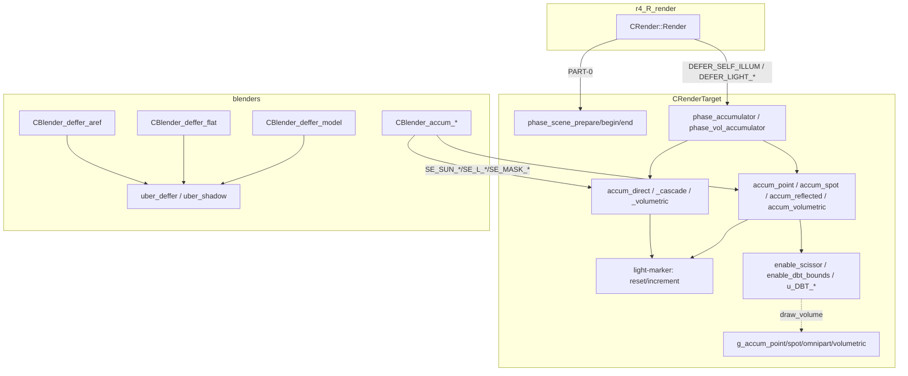
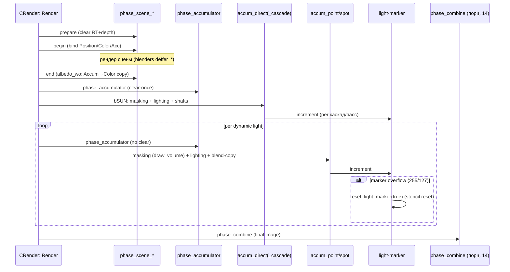

# Renderer: R4 deferred / накопление

## Ответственность

`CRenderTarget` — **содержатель состояния deferred-пайплайна R4**
(`src/Layers/xrRenderPC_R4/r4_rendertarget.h/.cpp`): все MRT/depth-тартгеты
кадра, light-marker stencil-схема, accumulate-фазы (солнце, каскады,
point/spot/reflected/volumetric), scene-фазы, geometry для occlusion-query
объёмов света и блэндеры deferred-геометрии (`uber_deffer`,
`blender_deffer_aref/flat/model`).

Файлы порциона: `r4_rendertarget.{h,cpp}`, `r4_rendertarget_accum_direct.cpp`,
`r4_rendertarget_accum_point.cpp`, `r4_rendertarget_accum_spot.cpp`,
`r4_rendertarget_accum_point_geom.cpp`, `r4_rendertarget_accum_spot_geom.cpp`,
`r4_rendertarget_accum_omnipart_geom.cpp`, `r4_rendertarget_accum_reflected.cpp`,
`r4_rendertarget_enable_scissor.cpp`, `r4_rendertarget_phase_accumulator.cpp`,
`r4_rendertarget_phase_scene.cpp`, `r4_rendertarget_mark_msaa_edges.cpp`,
`r4_rendertarget_create_minmaxSM.cpp`, `r4_rendertarget_draw_volume.cpp`,
`src/Layers/xrRender/uber_deffer.{h,cpp}`,
`src/Layers/xrRenderPC_R4/blender_deffer_{aref,flat,model}.cpp`.

**Чего он НЕ делает**:

- **вызовы** фаз из `CRender::Render` (порядок, флаги, условия) —
  [R4: scene/lighting](r4-scene.md) (порцион 12);
- постпроцесс-фазы `phase_bloom`/`phase_combine`/`phase_pp`/`phase_ssfx_*`/
  `phase_smap_*` — [R4: post-process](r4-postprocess.md) (порцион 14);
- internals blenders (pass-машины `SE_*`) — [Blenders](blenders.md) (порцион 15);
- SMAP packing/раскладка каскадов — [VSM / SMAP](vsm-smap.md) (порцион 6);
- репрезентация и vis-тесты светов — [Свет](lights.md) (порцион 11).

## Место в архитектуре

`CRenderTarget : IRender_Target` — единственный экземпляр
(`RImplementation.Target`, аллоцируется в `CRender::create`). Blenders
deferred-геометрии рендерят в RT, созданные здесь; accumulate-фазы вызываются
из `render_lights`/`render_sun_cascades` (см. [Свет](lights.md),
[VSM / SMAP](vsm-smap.md)) и из `CRender::Render` (см.
[R4: scene/lighting](r4-scene.md)).

## Публичный API

### `CRenderTarget` (`r4_rendertarget.h`)

| Метод                                                                                                                                          | Назначение                                                                                                           |
| ---------------------------------------------------------------------------------------------------------------------------------------------- | -------------------------------------------------------------------------------------------------------------------- |
| **Scene-фазы**                                                                                                                                 |                                                                                                                      |
| `phase_scene_prepare()`                                                                                                                        | Bind scene-RT (Position + base/MSAA depth), clear RT+depth+stencil, сброс volumetric-флагов                          |
| `phase_scene_begin()`                                                                                                                          | Bind MRT (Position/Color-или-Accumulator/Heat/motion_vectors), stencil REPLACE 0x01, cull CCW                        |
| `phase_scene_end()`                                                                                                                            | При `albedo_wo`: копирует `rt_Accumulator` → `rt_Color` (masker-quad, `SE_MASK_ALBEDO`)                              |
| `disable_aniso()`                                                                                                                              | `SSManager.SetMaxAnisotropy(1)`                                                                                      |
| **Accumulator-фазы**                                                                                                                           |                                                                                                                      |
| `phase_accumulator()`                                                                                                                          | Bind `rt_Accumulator` (+`_temp` при `!fp16_blend`), clear-once, stencil `LESSEQUAL 0x01`                             |
| `phase_vol_accumulator()`                                                                                                                      | Bind `rt_Generic_2` (volumetric) либо base depth, clear-once per frame                                               |
| `shadow_direct(L, dls_phase)`                                                                                                                  | Shadow-фаза для динамического солнца (legacy TSM-путь, [VSM / SMAP](vsm-smap.md))                                    |
| **Accumulate-функции**                                                                                                                         |                                                                                                                      |
| `accum_direct(sub_phase)`                                                                                                                      | Солнце: masking + lighting + (advancedpp) volumetric sun shafts                                                      |
| `accum_direct_cascade(sub_phase, xform, xform_prev, fBias)`                                                                                    | Солнечный каскад (CSC): cuboid-рендер + lighting                                                                     |
| `accum_direct_f(sub_phase)`                                                                                                                    | `sunfilter`: multi-tap в `rt_Generic_0`/`_r`                                                                         |
| `accum_direct_lum()`                                                                                                                           | Luminance-пасс солнца (`g_aa_AA`)                                                                                    |
| `accum_direct_blend()`                                                                                                                         | Legacy blend-copy `rt_Accumulator` → `rt_Accumulator_temp` (**мёртвый путь**, `VERIFY(0)`)                           |
| `accum_direct_volumetric(sub_phase, Offset, mShadow)`                                                                                          | Sun shafts в `rt_sunshafts_*` (только `advancedpp`)                                                                  |
| `accum_point(L)`                                                                                                                               | Point/omnipart-свет: Carmack-reverse masking + lighting + blend-copy                                                 |
| `accum_spot(L)`                                                                                                                                | Spot-свет: то же + `m_Shadow`/`m_Lmap` матрицы + scissor                                                             |
| `accum_reflected(L)`                                                                                                                           | Fake REFLECTED (GI): фиксированные маски 0x01/0x81, без light-marker                                                 |
| `accum_volumetric(L)`                                                                                                                          | Volumetric spot (SSS-fade), цель `rt_ssfx_volumetric`/`rt_Generic_2`                                                 |
| **Light-marker API**                                                                                                                           |                                                                                                                      |
| `reset_light_marker(bResetStencil)`                                                                                                            | `dwLightMarkerID = 5`; при `bResetStencil` — full-screen quad сброс stencil                                          |
| `increment_light_marker()`                                                                                                                     | `+= 2`; overflow 255/127 → `reset_light_marker(true)`                                                                |
| `need_to_render_sunshafts()`                                                                                                                   | true, если `sunshafts_0/1` RT и `b_sunshafts` существуют                                                             |
| `use_minmax_sm_this_frame()`                                                                                                                   | true, если `rt_smap_depth_minmax` создана (`o.dx10_minmax_sm`) и frame par-сменён                                    |
| **u\_*-хелперы**                                                                                                                               |                                                                                                                      |
| `u_setrt(...)` (4 перегрузки)                                                                                                                  | Bind RT 0–3 + ZB в `RCache`, трекинг `dwWidth/dwHeight`                                                              |
| `u_stencil_optimize(eSOM)`                                                                                                                     | NV-stencil-оптимизация: full-screen quad `s_occq->E[1]` (только `o.nvstencil`)                                       |
| `u_compute_texgen_screen(Fmatrix&)`                                                                                                            | Screen-UV texgen-матрица                                                                                             |
| `u_compute_texgen_jitter(Fmatrix&)`                                                                                                            | Jitter-UV (из `t_noise`, по кадру)                                                                                   |
| `u_calc_tc_noise` / `u_calc_tc_duality_ss`                                                                                                     | UV-расчёты для noise/duality (postprocess, порцион 14)                                                               |
| `u_need_PP` / `u_need_CM` / `u_DBT_enable` / `u_DBT_disable`                                                                                   | PP/colormap-нуждаемость; NV-DBT — **no-op** (DX10 не портирован)                                                     |
| **Volumetric-геометрия**                                                                                                                       |                                                                                                                      |
| `accum_point_geom_create/destroy`, `accum_spot_geom_create/destroy`, `accum_omnip_geom_create/destroy`, `accum_volumetric_geom_create/destroy` | Создание/освобождение VB/IB для `g_accum_point/spot/omnipart/volumetric` (из `du_sphere`/`du_cone`/`du_sphere_part`) |
| `draw_volume(L)`                                                                                                                               | Рендер объёма света в occlusion query (диспетчер по `L->flags.type`)                                                 |
| **Прочее**                                                                                                                                     |                                                                                                                      |
| `enable_scissor(L)` / `enable_dbt_bounds(L)`                                                                                                   | Near-plane тест + scissor-флаги (scissor-код закомментирован)                                                        |
| `create_minmax_SM()`                                                                                                                           | Full-screen quad → `rt_smap_depth_minmax` (`CBlender_createminmax`)                                                  |
| `mark_msaa_edges()`                                                                                                                            | Full-screen quad → 0x80 в stencil `rt_MSAADepth` (разметка MSAA-краёв)                                               |
| `set_viewport_size(dev, w, h)`                                                                                                                 | Viewport-обновление                                                                                                  |
| `DoAsyncScreenshot()`                                                                                                                          | Асинхронный скриншот через `t_ss_async` (staging R8G8B8A8_SNORM)                                                     |
| `set_blur/gray/duality_h/v/noise/noise_scale/noise_fps/color_base/color_add`                                                                   | `IRender_Target` виртуалы: параметры postprocess (порцион 14)                                                        |
| `set_cm_imfluence/interpolate/textures`, `get_width/height`                                                                                    | `IRender_Target` виртуалы: colormapping, размеры RT                                                                  |
| `dbg_addline/dbg_addplane`                                                                                                                     | DEBUG: отладочные линии/плоскости (в release — no-op)                                                                |

## Внутреннее устройство

### `CRenderTarget` — конструктор/деструктор (`r4_rendertarget.cpp`)

Конструктор — **вся карта RT кадра**. Условное создание (флаг → RT):

| RT                          | Условие создания                                                           | Назначение                       |
| --------------------------- | -------------------------------------------------------------------------- | -------------------------------- |
| `rt_Position`               | всегда (A16B16G16R16F, eye-space)                                          | позиция сцены                    |
| `rt_Color`                  | всегда; A8R8B8B8 по умолчанию; A16B16G16R16F при `fp16_blend`/`dx11_hdr10` | albedo/gloss                     |
| `rt_Heat`                   | всегда (fork DSR HeatVision)                                               | heatvision-слой                  |
| `rt_Accumulator`            | всегда (A16B16G16R16F)                                                     | deferred-накопитель              |
| `rt_Accumulator_temp`       | `!mrtmixdepth && !fp16_blend`; `VERIFY(albedo_wo)`                         | HW без fp16-blend                |
| `rt_MSAADepth`              | `o.dx10_msaa` (D24S8)                                                      | MSAA depth                       |
| `rt_Depth`                  | `o.mrt` (base ZB-аналог)                                                   | Z-buffer                         |
| `rt_Generic_0`/`_1`         | всегда (A8R8G8B8); при `dx11_hdr10` — A2R10G10B10                          | PP-межданные                     |
| `rt_Generic_0_r`/`_1_r`     | `o.sunfilter`                                                              | filtered sun                     |
| `rt_Generic_2`              | `o.advancedpp` (L651–652)                                                  | volumetric lights + PP           |
| `rt_ssfx_*`                 | per-эффект: `ssfx_ao/water/ssr/ao/il/waves`                                | SSS-эффекты (порцион 14)         |
| `rt_ssfx_sss/ext/tmp`       | `o.ssfx_sss` (L606)                                                        | SSS                              |
| `rt_ssfx_bloom1/emissive`   | `o.ssfx_bloom` (L614) + `bloom_tmp2..64` (+`_2`)                           | bloom pipeline                   |
| `rt_ssfx_volumetric`/`_tmp` | `o.ssfx_volumetric`                                                        | volumetric spot                  |
| `rt_ssao_temp`              | `ssao_hdao && ssao_ultra` (L966)                                           | HDAO                             |
| `rt_smap_depth_minmax`      | `o.dx10_minmax_sm` (L718, size/4, R32F)                                    | min/max shadow map               |
| `rt_HDR10_HalfRes[2]`       | `o.dx11_hdr10` (L564)                                                      | HDR10 bloom/flare                |
| `rt_secondVP`/`rt_ui_pda`   | всегда; при `dx11_hdr10` — A2R10G10B10                                     | secondary viewport / PDA         |
| `rt_dof`                    | всегда; при `dx11_hdr10` — fp16                                            | DoF                              |
| `rt_ssfx_prev_frame`        | при `dx11_hdr10` — fp16                                                    | TAA                              |
| `rt_ssfx_motion_vectors`    | всегда (A8R8G8B8)                                                          | motion vectors                   |
| `rt_smaa_edgetex/blendtex`  | всегда                                                                     | SMAA (порцион 14)                |
| `rt_blur_2/4/8` (+`_h`)     | всегда                                                                     | blur chain (порцион 14)          |
| `rt_LUM_64/8`/`LUM_pool`    | всегда                                                                     | luminance-адаптация (порцион 14) |
| `rt_tempzb`                 | всегда (fork Redotix99, 3D shader scopes)                                  | ZB-копия                         |
| `rt_Bloom_1/2`              | всегда (dim/4)                                                             | legacy bloom                     |

Также в конструкторе: `t_material_surf` (3D-текстура, см. ниже),
`t_noise[TEX_jitter_count]` + `t_noise_mipped` (jitter-текстуры,
`generate_jitter`), `t_ss_async` (staging для скриншотов), geometry
`g_KD/g_combine/g_combine_VP/g_combine_2UV/g_combine_cuboid/g_aa_blur/g_aa_AA/
g_postprocess/g_menu/g_bloom_build/g_bloom_filter`; accumulate-шейдеры
(L727–865):

| Шейдер                                            | Имя                                         | Условие                     |
| ------------------------------------------------- | ------------------------------------------- | --------------------------- |
| `s_accum_mask`/`s_accum_mask_msaa[8]`             | `r3\accum_mask`                             | всегда                      |
| `s_accum_direct`/`_msaa[8]`                       | `r3\accum_direct`                           | всегда                      |
| `s_accum_point`/`_msaa[8]`                        | `r2\accum_point_s`                          | всегда                      |
| `s_accum_spot`/`_msaa[8]`                         | `r2\accum_spot_s` + `lights\lights_spot01`  | всегда                      |
| `s_accum_volume`/`_msaa[8]`                       | `accum_volumetric` + `lights\lights_spot01` | всегда                      |
| `s_accum_reflected`/`_msaa[8]`                    | `r2\accum_refl`                             | всегда                      |
| `s_accum_direct_volumetric` + `_minmax`           | `accum_volumetric_sun_nomsaa` (+`_minmax`)  | `o.advancedpp`              |
| `s_accum_direct_volumetric_msaa[8]`               | `accum_volumetric_sun_msaa0..7`             | `o.advancedpp && dx10_msaa` |
| `s_accum_direct_volumetric_sun_msaa[8]`           | **закомментирован** (L467, L1424)           | —                           |
| `s_mark_msaa_edges`                               | `mark_msaa_edges`                           | `o.dx10_msaa`               |
| `s_create_minmax_sm`                              | `CBlender_createminmax`                     | `o.dx10_minmax_sm`          |
| `s_occq` (E[0..3]: occq test, full-screen, reset) | `s_occq`                                    | всегда                      |
| `s_sunshafts`                                     | `sunshafts`                                 | всегда                      |

MSAA-массивы blenders/шейдеров размещаются по `dx10_msaa_samples` (кап 8);
при `o.dx10_msaa_opt` bound = 1. MSAA-варианты получают `SetDefine("ISAMPLE",
0..7)` (L473–484, 807–816). `t_material_surf` — 3D
`TEX_material_LdotN × TEX_material_LdotH × 4` среза R8G8_UNORM immutable:
срез 0 = OrenNayar-подобный, 1 = Blinn-подобный, 2 = Phong-подобный,
3 = metal approximation; адрес `u16 = s*256+d`.

Деструктор освобождает всё в обратном порядке (VB/IB accum-геометрии,
шейдеры, RT).

### `phase_scene_*` (`r4_rendertarget_phase_scene.cpp`)

**`phase_scene_prepare`** (вызов: `CRender::Render` PART-0,
[r4-scene](r4-scene.md)): bind `rt_Position` + base или `rt_MSAADepth`
(через `u_setrt(W, H, ...)`), clear `rt_Position` и `rt_Heat` в 0, clear
depth+stencil (MSAA: оба — `rt_MSAADepth` и `HW.pBaseZB`); сброс
`m_bHasActiveVolumetric`/`_spot` = false.

**`phase_scene_begin`**: `SSManager.SetMaxAnisotropy(ps_r__tf_Anisotropic)`;
bind MRT: `rt_Position` + (`rt_Color` или `rt_Accumulator` при `albedo_wo`) +
`rt_Heat` + `rt_ssfx_motion_vectors` + pZB; stencil
`ALWAYS 0x01, 0xff, 0x7f, REPLACE` (write 0x01 в позицию пиксела);
`set_CullMode(CULL_CCW)`, color-write on.

**`phase_scene_end`**: `disable_aniso()`; сброс 4-го RT (motion vectors);
если `!albedo_wo` — выход. При `albedo_wo`: bind `rt_Color` + depth,
`CULL_NONE`, stencil `LESSEQUAL 0x01` (только «зарисованные» пиксели,
`>=1`), `u_stencil_optimize(SO_Combine)` при `nvstencil`; full-screen quad
`g_combine` (`FVF::TL`, 4 вершины, UV `.5/w..(w+.5)/w`) через
`s_accum_mask->E[SE_MASK_ALBEDO]` — копирует `rt_Accumulator` → `rt_Color`
(в этой конфигурации сценный блэндер писал albedo в `rt_Accumulator`).

### `phase_accumulator` / `phase_vol_accumulator` (`r4_rendertarget_phase_accumulator.cpp`)

**`phase_accumulator`** — bind deferred-накопителя перед каждым световым
пассом (вызовы: `DEFER_SELF_ILLUM`, `DEFER_LIGHT_NO_OCCQ` из
`CRender::Render`, и пер-свет из `render_lights` — см. [Свет](lights.md)):

- clear-once: `if (dwAccumulatorClearMark != Device.dwFrame)` — clear
  `rt_Accumulator` (и `rt_Accumulator_temp` при `!fp16_blend`) в 0,
  `dwAccumulatorClearMark = dwFrame`;
- AMD-bug workaround: `OMSetRenderTargets`-обход (прямая установка через
  `HW.pContext` без `RCache`, чтобы AMD-драйвер не сбрасывал state);
- bind `rt_Accumulator` (+`_temp`) + base или `rt_MSAADepth`;
- stencil: `LESSEQUAL 0x01, 0xff, 0x00` (накопление только там, где сцена
  «была» — маркер 1);
- завершение: `rmNormal()`.

**`phase_vol_accumulator`** — аналог для volumetric-цели:

- цель: `rt_Generic_2` **без depth** при `o.ssfx_volumetric`, иначе
  `rt_Generic_2` + base/MSAA depth;
- clear-once per frame: `m_bHasActiveVolumetric` latch;
- **TODO L82–96**: задокументированный bug — в D3D debug layer MSAA-цель
  без depth не проходит validate; workaround не введён (flag).

### `accum_direct*` (`r4_rendertarget_accum_direct.cpp`)

**`accum_direct(sub_phase)`** — основной солнечный accumulate (вызов:
`CRender::Render` при `bSUN`, после `render_sun*` — см.
[VSM / SMAP](vsm-smap.md)):

1. `sun = RImplementation.Lights.sun_adapted`; `o.sunfilter` →
   `accum_direct_f` (в `rt_Generic_0`/`_r`) и return;
2. **masking-фаза**: bind `rt_Accumulator`, stencil
   `REPLACE` при `stencil>=1 && aref_pass` (только «новые» пиксели),
   элемент `s_accum_mask->E[SE_MASK_DIRECT]` — пишет `dwLightMarkerID` в
   stencil пикселей, которые солнце освещает (Z-test на);
3. **lighting-фаза**: `m_shadow = m_TexelAdjust * sun->X.D.combine *
mInvView` (+TSM-bias для `SE_SUN_FAR`), `m_sunmask` — матрица
   анимированных облачных теней (`static w_shift` из env wind);
   jitter-UVs (`u_compute_texgen_jitter`); элемент:
   `SE_SUN_NEAR` → `SE_SUN_NEAR_MINMAX`, если `use_minmax_sm_this_frame()`;
   **MSAA**: per-sample цикл `for (i < samples) StateManager.SetSampleMask(1<<i)`
   - `s_accum_direct_msaa[i]` (`m_MSAASample`);
4. `accum_direct_volumetric` (только `advancedpp && ps_sunshafts_mode`) —
   sun shafts.

**`accum_direct_cascade(sub_phase, xform, xform_prev, fBias)`** — каскад CSC
(вызов: `render_sun_cascade(i)`, [VSM / SMAP](vsm-smap.md)):

- геометрия — **cuboid** `g_combine_cuboid` (16 граней, 8 углов),
  трансформируется обратным `xform`/`xform_prev` каскада — рендерится
  именно объём каскада, а не frustum;
- `m_texgen` — texgen-матрица position-текстуры; `view_shadow_proj` —
  константа для FAR;
- ZFunc per каскад: `GREATEREQUAL` near/mid, `ALWAYS`/`LESS` far
  (`R2FLAGEXT_SUN_ZCULLING`);
- FAR: `st_mask 0x00` + pass-op `KEEP` (без записи маркера);
- bias из `init_cacades` (`size * -0.0000025f`).

**`accum_direct_f`** — `sunfilter`: multi-tap солнца в
`rt_Generic_0`/`_r` (32-bit). **`accum_direct_lum`** — luminance-пасс
(`v_aa` 7-UV vertex struct, `g_aa_AA`), для `SE_SUN_LUMINANCE` (legacy
`R2FLAG_SUN_TSM`-путь). **`accum_direct_blend`** — legacy blend-copy
`rt_Accumulator` → `rt_Accumulator_temp`; **мёртвый путь**: защита
`VERIFY(0)` — вызывается только из legacy-ветки `render_sun`, которая в
активном CSC-пути не используется.

**`accum_direct_volumetric(sub_phase, Offset, mShadow)`** — sun shafts
(только `advancedpp`): bind `rt_sunshafts_0`/`_1`, `s_accum_direct_volumetric`
(+`_minmax`), noise-текстура `fx\fx_noise`; MSAA — per-sample
`s_accum_direct_volumetric_msaa[i]`.

### `accum_point` (`r4_rendertarget_accum_point.cpp`)

Point/omnipart-свет (вызов: `render_lights` → `Target->accum_point(L)`
per unshadowed point — [Свет](lights.md)):

1. **Carmack-reverse masking**: `draw_volume(L)` в occlusion query — рендер
   **обратных** граней объёма (back-faces → front-faces по глубине),
   stencil-запись маркера; видимые пиксели = «свет сюда попадает»;
2. выбор элемента по shadow-флагам: `SE_L_TRANSLUENT`/`FULLSIZE`/`NORMAL`/
   `UNSHADOWED` (s_smap только для NORMAL/FULLSIZE);
3. `sss_id` константа: `−1` во фрейме `SecondViewport` (SSS выключен);
4. lighting: `m_shadow` = `X.S.combine * mInvView`;
5. **blend-copy pass**: копирование «нового» вклада (по stencil-маркеру)
   в `rt_Accumulator` — накопление поверх предыдущих светов;
6. `increment_light_marker()`;
7. `u_DBT_disable()` — no-op в DX10 (NV DBT не портирован).

### `accum_spot` + `accum_volumetric` (`r4_rendertarget_accum_spot.cpp`)

**`accum_spot(L)`** — то же, что `accum_point`, но:

- матрицы `m_Shadow`/`m_Lmap` (projective texture `L->s_spot`);
- `enable_scissor(L)` + `enable_dbt_bounds(L)` перед рендером;
- **OMNIPART** обрабатывается теми же шейдерами (point-шейдеры,
  L15–24) — геометрия `g_accum_omnipart` (`du_sphere_part`).

**`accum_volumetric(L)`** — volumetric spot (SSS fade):

- шейдер `ps_ssfx_volumetric`; fade по `L->m_volumetric_intensity`;
- frustum-clip: массив `FrustumClipPlane`, AABB в camera-space;
- slice count: vanilla — `VOLUMETRIC_SLICES(100) * quality`, min 10;
  SSS — `24 * ps_ssfx_volumetric.z`;
- цель: `rt_ssfx_volumetric` (+`_tmp` при w=8) если `o.ssfx_volumetric`,
  иначе `rt_Generic_2` через `phase_vol_accumulator()`;
- геометрия `g_accum_volumetric` (`du_cone`, slice-сетка);
- пишет **только RGB** (alpha-канал выключен, L622);
- MSAA: **TODO** (см. `phase_vol_accumulator`).

### `accum_reflected` (`r4_rendertarget_accum_reflected.cpp`)

Fake REFLECTED-свет для GI (вызов: `render_indirect`, [Свет](lights.md)):

- **без light-marker** — фиксированные маски `0x01`/`0x81` (отдельный
  stencil-канал, не конфликтует с динамическими светами);
- RT `s_accum_reflected` (+`msaa[8]`);
- cull: near-plane intersection теста (свет вне near → skip);
- blend-copy pass в `rt_Accumulator`.

### Geometry-файлы (`accum_*_geom.cpp`)

Три файла создают/освобождают VB/IB для volumetric-геометрии через
`dx10BufferUtils::CreateVertexBuffer/IndexBuffer` (см. [Ресурсы](resources.md)):

| Файл                               | Геометрия            | Источник данных    | Использование                          |
| ---------------------------------- | -------------------- | ------------------ | -------------------------------------- |
| `accum_point_geom.cpp`             | `g_accum_point`      | `du_sphere`        | point/omnipart masking (`draw_volume`) |
| `accum_spot_geom.cpp`              | `g_accum_spot`       | `du_cone`          | spot masking + volumetric              |
| `accum_omnipart_geom.cpp`          | `g_accum_omnipart`   | `du_sphere_part`   | omnipart masking                       |
| (`accum_volumetric_geom` — там же) | `g_accum_volumetric` | `du_cone` (slices) | `accum_volumetric`                     |

Большая vertex-таблица **закомментирована** в файлах — реальные данные
в `du_sphere.h`/`du_cone.h`/`du_sphere_part.h` (общий каталог
`xrRender/`). VB создаётся с CPU-копией (DX10/11).

### `draw_volume` (`r4_rendertarget_draw_volume.cpp`)

Диспетчер masking-объёмов (вызов: `light::vis_prepare` (occlusion query,
[Occlusion](occlusion.md)) и `accum_point/spot`):

| `L->flags.type`      | Геометрия          | DU-данные        |
| -------------------- | ------------------ | ---------------- |
| `REFLECTED`, `POINT` | `g_accum_point`    | `DU_SPHERE`      |
| `SPOT`               | `g_accum_spot`     | `DU_CONE`        |
| `OMNIPART`           | `g_accum_omnipart` | `DU_SPHERE_PART` |

REFLECTED и POINT — одна геометрия (sphere). Рендер в текущем RT (в
occlusion query — только счёт фрагментов, color/depth write off).

### `enable_scissor` / `u_DBT_*` (`r4_rendertarget_enable_scissor.cpp`)

- **`enable_scissor(L)`**: near-plane тест только (пересечение frustum
  света с near); scissor-код **закомментирован** (`#if 0`) — bug при
  multi-portal;
- **`enable_dbt_bounds(L)`**: устанавливает DBT-границы (depth bounds test)
  из frustum света;
- **`u_DBT_enable(zMin, zMax)`**: **возвращает FALSE** — NV depth-bounds-test
  не перенесён на DX10;
- **`u_DBT_disable()`**: no-op.

### `mark_msaa_edges` (`r4_rendertarget_mark_msaa_edges.cpp`)

Full-screen quad → пишет `0x80` в stencil `rt_MSAADepth` (depth disabled,
color write 0). Разметка «краёв» MSAA для postprocess-resolve (порцион 14).
GSC-комментарий (L3–16): в MS Beta runtime утечка ресурса, если
`DepthEnable=0 + DepthFunc=NEVER` — обход через полный state-setup.

### `create_minmax_SM` (`r4_rendertarget_create_minmaxSM.cpp`)

Full-screen quad → `rt_smap_depth_minmax` (size/4, R32F) через
`s_create_minmax_sm` (`CBlender_createminmax`) — создаёт min/max-версию
солнечной SMAP для `SE_SUN_NEAR_MINMAX` (только `o.dx10_minmax_sm`).

### `u_stencil_optimize` / light-marker

**`u_stencil_optimize(eSOM)`** (`VERIFY(o.nvstencil)`): full-screen quad
`s_occq->E[1]`; `SO_Light` — ref = текущий маркер; `SO_Combine` — ref 0x01.
NV-stencil-оптимизация: «пропускает» пиксели, которые точно не изменятся.

**Light-marker** (`reset_light_marker`/`increment_light_marker`):

- `dwLightMarkerID` старт = 5 (`reset_light_marker`), `+= 2` per свет;
- overflow: 255 (non-MSAA) / 127 (MSAA, высокий бит 0x80 занят
  per-sample) → `reset_light_marker(true)` — full-screen quad
  `s_occq->E[2]` сбрасывает stencil;
- MSAA: per-sample passes пишут `dwLightMarkerID | 0x80`, ref mask
  0x81/0x7f.

`use_minmax_sm_this_frame()` — true, если `rt_smap_depth_minmax` создана и
frame par-сменён (чередование minmax/полная SMAP).

`need_to_render_sunshafts()` — true, если `rt_sunshafts_0/1` + `b_sunshafts`.

### `uber_deffer` / `uber_shadow` (`src/Layers/xrRender/uber_deffer.{h,cpp}`)

**Общий** (не R4-specific!) конструктор shader-имён для deferred-блэндеров:

- **`uber_deffer(...)`**: lmap detection (по текстурам `E`),
  bump/flat, steep/detail/aref/tessellation-варианты; DX11 tessellation —
  `C.r_TessPass` + варианты `TESS_PN`/`TESS_HM` + опции
  `USE_LM_HEMI`/`USE_TDETAIL`/`USE_TDETAIL_BUMP`; флаг `DO_NOT_WRITE`;
  имена вида `deffer_<name>_<bump/flat>_<lmap>[_tess...]`;
- **`uber_shadow`**: DX11-only — shadow-pass + tessellation
  (`shadow_direct_*`).

R4-компиляция блэндеров идёт через `#else` (R3-ветка = активна в R3+R4).

### `CBlender_deffer_aref` (`blender_deffer_aref.cpp`)

`SE_R2_NORMAL_HQ/LQ` + AREF:

- **forward-путь** (при `oBlend`): `lmapE`/`vert` passes — обычный forward
  alpha-blend;
- **deferred-путь** (иначе): `uber_deffer(..., "base", "base", true)` +
  ATOC second pass при `MSAA_ATEST_DX10_0_ATOC` (alpha-test-on-color);
- stencil write 0x01 (position-маркер).

### `CBlender_deffer_flat` (`blender_deffer_flat.cpp`)

`B_DEFAULT`/`B_VERT`: `uber_deffer("base")` (flat, без bump) + stencil
write 0x01. Самый простой deferred-блэндер.

### `CBlender_deffer_model` (`blender_deffer_model.cpp`)

`B_MODEL` (динамические модели):

- **forward**: `oBlend && oAREF<16` или `oStrictSorting` — `model_def_lq`
  (legacy LQ-путь);
- **deferred**: `uber_deffer("model")` + ATOC two-pass;
- **HUD-вариант**: `model_hud`/`base_hud` + `s_hud_rain` (дождь на HUD);
- `SE_R2_SHADOW` → `shadow_direct_model(_aref)` (aref 220).

## Взаимодействие

| Кто вызывает                                        | Что                                                                            | Где покрыто                                  |
| --------------------------------------------------- | ------------------------------------------------------------------------------ | -------------------------------------------- |
| `CRender::Render` (PART-0)                          | `phase_scene_prepare/begin/end`                                                | [R4: scene/lighting](r4-scene.md)            |
| `CRender::Render` (DEFER_SELF_ILLUM, DEFER_LIGHT_*) | `phase_accumulator` + emissive/`render_lights`                                 | [R4: scene/lighting](r4-scene.md)            |
| `render_lights` (per light)                         | `phase_accumulator`, `accum_point/spot`, `accum_volumetric`, `accum_reflected` | [Свет](lights.md)                            |
| `render_sun_cascade(i)`                             | `accum_direct_cascade`                                                         | [VSM / SMAP](vsm-smap.md)                    |
| `CRender::Render` (bSUN)                            | `accum_direct(_f/_lum/_blend)`                                                 | [R4: scene/lighting](r4-scene.md)            |
| `light::vis_prepare`                                | `draw_volume` (occlusion query)                                                | [Occlusion](occlusion.md), [Свет](lights.md) |
| Deferred-блэндеры (`deffer_aref/flat/model`)        | Рендер в `rt_Position/Color/Accumulator` + stencil 0x01                        | [Blenders](blenders.md) (порцион 15)         |
| `phase_combine` (завершает кадр)                    | Читает все RT, создаёт final image                                             | [R4: post-process](r4-postprocess.md) (14)   |
| `CRender::mark_msaa_edges` wrapper                  | `mark_msaa_edges` (после occq flush)                                           | [R4: scene/lighting](r4-scene.md)            |

## Потоки данных / управления

## Конфигурация

| Cvar / флаг                    | Влияние на `CRenderTarget`                                              |
| ------------------------------ | ----------------------------------------------------------------------- |
| `o.dx10_msaa` + `ps_r3_msaa`   | `rt_MSAADepth`, MSAA-массивы blenders/шейдеров, per-sample accumulate   |
| `o.dx10_msaa_opt`              | MSAA blender bound = 1 (один shader для всех samples)                   |
| `o.dx11_hdr10`                 | HDR10-RT (halfres, A2R10G10B10), **отключает MSAA**                     |
| `o.advancedpp`                 | `rt_Generic_2`, `accum_direct_volumetric*` (sun shafts)                 |
| `o.ssfx_volumetric`            | `rt_ssfx_volumetric` (+`_tmp`), цель `accum_volumetric`                 |
| `o.ssfx_sss`                   | `rt_ssfx_sss/ext/tmp`, `sss_id` константа                               |
| `o.ssfx_bloom`                 | bloom-RT chain (`bloom1`/`emissive`/`tmp2..64` +`_2`)                   |
| `o.dx10_minmax_sm`             | `rt_smap_depth_minmax`, `s_create_minmax_sm`, `SE_SUN_NEAR_MINMAX`      |
| `o.sunfilter`                  | `accum_direct_f` вместо `accum_direct` (`rt_Generic_0_r`/`_1_r`)        |
| `o.albedo_wo`                  | Сцена пишет в `rt_Accumulator`, `phase_scene_end` копирует → `rt_Color` |
| `o.nvstencil`                  | `u_stencil_optimize` активен (иначе no-op, `VERIFY`)                    |
| `o.fp16_blend`/`o.mrtmixdepth` | Формат `rt_Color`/`rt_Accumulator_temp` (fp16 blend или нет)            |
| `ps_sunshafts_mode`            | Sun shafts on/off (`accum_direct_volumetric`)                           |
| `ps_ssfx_volumetric.x/y/z`     | Volumetric: enable/intensity/slices                                     |
| `ps_r__tf_Anisotropic`         | `phase_scene_begin` anisotropy                                          |

Shaders-`#define` (через `shader_compile`, [R4: scene/lighting](r4-scene.md)):
`ISAMPLE` (MSAA 0..7), `USE_MINMAX_SM`, `SUN_SHAFTS_QUALITY`,
`SSFX_SSR_QUALITY`, `SSFX_WATER_QUALITY` — влияют на accumulate-шейдеры.

## Известные ограничения / дебаг

1. **`b_accum_direct_volumetric_sun_msaa[8]` закомментирован** (L467 ctor,
   L1424 dtor) — volumetric sun shafts MSAA не создаётся (по
   `s_accum_direct_volumetric_msaa[8]` — рабочий).
2. **`u_DBT_enable` — no-op** (возвращает FALSE): NV depth-bounds-test не
   перенесён на DX10; `enable_dbt_bounds` устанавливает границы, но
   hardware-тест не работает.
3. **`enable_scissor` — scissor-код закомментирован** (`#if 0`): bug при
   multi-portal; остаётся только near-plane тест.
4. **`accum_direct_blend` — мёртвый путь** (`VERIFY(0)`): legacy blend-copy,
   вызывается только из неиспользуемой TSM-ветки.
5. **`vpack` — асимметрия DEBUG/release**: search radius `d=0` в DEBUG,
   `d=3` в release (brute-force поиск texture-position).
6. **`generate_jitter` — недетерминирован**: использует глобальный
   `::Random.randI` (не per-frame seed); min manhattan distance 32,
   упакованные пары в RGBA.
7. **`accum_volumetric` пишет только RGB** (alpha disabled, L622) —
   volumetric-цель без alpha-канала.
8. **MSAA per-sample циклы дублируют работу** per sample (нет общего
   optimize, кроме `dx10_msaa_opt` bound=1).
9. **`mark_msaa_edges` — GSC MS-Beta-leak comment**: `DepthEnable=0 +
DepthFunc=NEVER` вызывал утечку в MS Beta runtime; обход — полный
   state-setup.
10. **`phase_vol_accumulator` — TODO L82–96**: D3D debug layer не
    валидирует MSAA-цель без depth; workaround не введён.
11. **`t_ss_async`** (async screenshot staging, R8G8B8A8_SNORM
    `D3D_CPU_ACCESS_READ`) — декларация в `r4_rendertarget.h` L531;
    реализация `DoAsyncScreenshot()` — в `r4.cpp` (порцион 12,
    [R4: scene/lighting](r4-scene.md)), не в файлах порциона 13.
12. **`#ifdef DEBUG`** `dbg_spheres/dbg_lines/dbg_planes` — отладочные
    примитивы (в release — no-op `dbg_addline/plane`).

## Не покрыто

- `phase_bloom`/`phase_combine`/`phase_pp`/`phase_ssfx_*`/`phase_smap_*` —
  **порцион 14** ([R4: post-process](r4-postprocess.md));
- internals `CBlender_deffer_*` (pass-машины `SE_*`) — **порцион 15**
  ([Blenders](blenders.md));
- `render_lights`/`render_indirect`/`render_sun_cascades` — уже покрыты
  ([Свет](lights.md), [VSM / SMAP](vsm-smap.md));
- `DoAsyncScreenshot()` реализация — `r4.cpp` (порцион 12,
  [R4: scene/lighting](r4-scene.md)).

**Закрыто кросс-обязательство итерации 2**: `SPPInfo`-применение
`IRender_Target` (порционы 12–14) — здесь internals
`phase_accumulator`/`phase_vol_accumulator`/`phase_scene_*`.
**Закрыто обещание порционов 4/11**: `CRenderTarget::draw_volume` (см.
[Occlusion](occlusion.md), [Свет](lights.md)).
