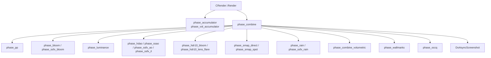
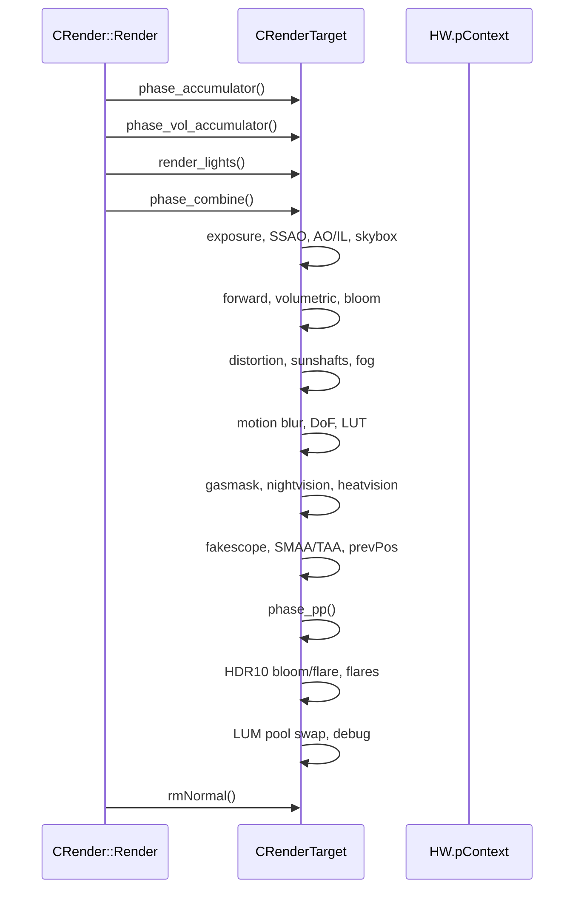

# Renderer: R4 post-process

`r4_rendertarget_phase_*` — фазы постобработки `CRenderTarget` (DX11-бэкенд). Завершают deferred-кадр: читают `rt_Color`/`rt_Position`/`rt_Accumulator` и пишут финальное изображение (или промежуточные ssfx-RT). Историческое ядро, переиспользуемое в R4.

## 1. Ответственность

- Сборка финального изображения из deferred-буферов (`phase_combine` — 800+ строк, основная фаза).
- Post-process эффекты: SSAO/HD AO, bloom (legacy + ssfx), HDR10 bloom/lens flare, DoF, LUT, gasmask, nightvision, heatvision, fakescope, SMAA/TAA, motion blur, rain, fog scattering, sunshafts, distortion.
- SMAP-фазы (direct/spot) — подготовка shadow map'ов для светов.
- Occlusion query setup (`phase_occq`).
- Compute shader инфраструктура (`ComputeShader`, `CSCompiler`) — HDAO и др.
- Асинхронный скриншот (`DoAsyncScreenshot`).
- Final post-process (`phase_pp`) — blur/gray/noise/duality/colormap.

## 2. Место в архитектуре

Вызывается из `CRender::Render` (`r4_R_render.cpp`, см. [R4: scene/lighting](r4-scene.md)) после `render_lights` и до `rmNormal()`.

## 3. Публичный API

Все функции — методы `CRenderTarget` (`r4_rendertarget.h`). Вызовятся из `CRender::Render` и `render_lights`.

| Функция                    | Файл                                         | Назначение                                            |
| -------------------------- | -------------------------------------------- | ----------------------------------------------------- |
| `phase_combine`            | `r4_rendertarget_phase_combine.cpp`          | Основная фаза: сборка из deferred-буферов             |
| `phase_pp`                 | `r4_rendertarget_phase_PP.cpp`               | Final post-process (blur/gray/noise/duality/colormap) |
| `phase_bloom`              | `r4_rendertarget_phase_bloom.cpp`            | Legacy bloom (luminance→filter)                       |
| `phase_ssfx_bloom`         | `r4_rendertarget_phase_bloom.cpp`            | Новый ssfx bloom (downsample→Kawase→upsample)         |
| `phase_luminance`          | `r4_rendertarget_phase_luminance.cpp`        | 3 прохода (256→64→8→1) + tonemap-adaptation           |
| `phase_hdao`               | `r4_rendertarget_phase_hdao.cpp`             | HD AO (compute shader)                                |
| `phase_ssao`               | `r4_rendertarget_phase_ssao.cpp`             | Legacy SSAO                                           |
| `phase_ssfx_ao`            | `r4_rendertarget_phase_ssao.cpp`             | Новый AO (4 blur-фазы)                                |
| `phase_ssfx_il`            | `r4_rendertarget_phase_ssao.cpp`             | Новый IL (4 blur-фазы)                                |
| `phase_hdr10_bloom`        | `r4_rendertarget_phase_hdr10_bloom.cpp`      | HDR10 bloom (Kawase)                                  |
| `phase_hdr10_lens_flare`   | `r4_rendertarget_phase_hdr10_lens_flare.cpp` | HDR10 lens flare (Kawase)                             |
| `phase_smap_direct`        | `r4_rendertarget_phase_smap_D.cpp`           | SMAP direct (sun)                                     |
| `phase_smap_spot`          | `r4_rendertarget_phase_smap_S.cpp`           | SMAP spot                                             |
| `phase_rain`               | `r4_rendertarget_phase_rain.cpp`             | Rain setup                                            |
| `phase_ssfx_rain`          | `r4_rendertarget_phase_rain.cpp`             | SSFX rain                                             |
| `phase_occq`               | `r4_rendertarget_phase_occq.cpp`             | Occlusion query setup                                 |
| `phase_combine_volumetric` | `r4_rendertarget_phase_combine.cpp`          | Volumetric light combine                              |
| `phase_wallmarks`          | `r4_rendertarget_phase_combine.cpp`          | Wallmarks setup                                       |
| `DoAsyncScreenshot`        | `r4_rendertarget_phase_combine.cpp`          | Async screenshot                                      |
| `phase_downsamp`           | `r4_rendertarget_phase_ssao.cpp`             | Downsample для SSAO                                   |

## 4. Внутреннее устройство

### 4.1 `phase_combine()` — основная фаза (L40–854)

Самая длинная функция в R4 (~814 строк). Структура по логическим блокам:

1. **Exposure pipeline**: `u_calc_tc_noise()`, `u_calc_tc_duality_ss()`, `u_need_PP()`, `u_need_CM()` — подготовка tone-mapping.
2. **SSAO/HD AO**: `phase_hdao()` (compute shader, group 56, overlap 12) или `phase_ssao()` (legacy).
3. **AO/IL**: `phase_ssfx_ao()` / `phase_ssfx_il()` (4 blur-фазы каждая).
4. **Skybox**: `Environment().RenderSky(true)`.
5. **Forward rendering**: `render_forward()` (second-order geometry, distortion on).
6. **Volumetric**: `phase_combine_volumetric()` if `ssfx_volumetric`.
7. **Bloom**: `phase_bloom()` (legacy) или `phase_ssfx_bloom()` (new: build→lens→downsample×6→upsample×5→combine).
8. **Distortion**: `o.distortion = o.distortion_enabled`.
9. **Sunshafts**: if `advancedpp && ps_sunshafts_mode`.
10. **Fog scattering**: `ssfx_fog_scattering`.
11. **Motion blur**: `ssfx_motion_blur`.
12. **3D scope**: `scope_3D_fake_enabled` (Redotix99 fork).
13. **Blur**: `ps_pp_blur`.
14. **SSFX bloom**: `phase_ssfx_bloom()` (если не legacy).
15. **DoF**: `rt_dof`.
16. **LUT**: `ps_pp_colormap` / `ColorMapManager`.
17. **Gasmask**: `ps_pp_gasmask`.
18. **Nightvision**: `ps_pp_nightvision`.
19. **Heatvision**: `ps_pp_heatvision` (fork DSR: `rt_Heat`).
20. **Fakescope**: `ps_pp_fakescope`.
21. **SMAA/TAA**: `ps_r__smaa` / `ssfx_taa`.
22. **prevPos**: motion vectors.
23. **PP**: `phase_pp()` — final post-process.
24. **HDR10 bloom/flare**: `phase_hdr10_bloom()` / `phase_hdr10_lens_flare()` if `dx11_hdr10`.
25. **Flares**: `Environment().RenderFlares()`.
26. **LUM pool swap**: `rt_bloom1/2` ping-pong.
27. **Debug**: `rsShowLuminance` и др.

**Важно**: `PP_Complex` — хардкод `TRUE` (L592, HOLGER HACK), игнорирует `u_need_PP()`.

### 4.2 `phase_pp()` — final post-process (L1–100)

- `ps_pp_blur` → blur pass.
- `ps_pp_gray` → grayscale.
- `ps_pp_noise` → noise/grain.
- `ps_pp_duality` → duality (horizontal/vertical).
- `ps_pp_colormap` → colormap (LUT).
- `ps_pp_gasmask` → gasmask.
- `ps_pp_nightvision` → nightvision.
- `ps_pp_heatvision` → heatvision (fork DSR).
- `ps_pp_fakescope` → fakescope.
- `u_calc_tc_noise()` — пересчёт noise-текстуры.
- `u_calc_tc_duality_ss()` — duality SS.
- `u_need_PP()` — проверка, нужен ли PP.
- `u_need_CM()` — проверка, нужен ли colormap.

### 4.3 `phase_bloom()` — legacy bloom

- `phase_luminance()` — 256→64→8→1.
- `phase_downsamp()` — downsample.
- `CalcGauss_k7()` / `CalcGauss_wave()` — blur.
- `v_build` / `v_filter` — структуры.

### 4.4 `phase_ssfx_bloom()` — новый ssfx bloom

- Build → lens → downsample×6 → upsample×5 → combine.
- Kawase blur (ping-pong).
- `rt_ssfx_bloom*` (только `ssfx_bloom`).

### 4.5 `phase_luminance()` — 3 прохода

- 256→64→8→1 (4 уровня).
- Tonemap-adaptation (EMA).
- `s_luminance_1` / `s_luminance_2` (см. [R4: scene/lighting](r4-scene.md) — `CBlender_luminance`).

### 4.6 `phase_hdao()` — HD AO (compute shader)

- Compute shader, group 56, overlap 12 (static).
- `dx11HDAOCSBlender` — compile CS blenders.
- `rt_ssao_temp` (только `ssao_hdao && ssao_ultra`).

### 4.7 `phase_ssao()` / `phase_downsamp()` — legacy SSAO

- `rt_ssao_temp` (только `ssao_hdao && ssao_ultra`).
- `phase_downsamp()` — downsample.

### 4.8 `phase_ssfx_ao()` / `phase_ssfx_il()` — новый AO/IL

- 4 blur-фазы каждая.
- `ssfx_ao` / `ssfx_il` (детект по shader-файлам, см. [R4: scene/lighting](r4-scene.md)).

### 4.9 `phase_hdr10_bloom()` / `phase_hdr10_lens_flare()` — HDR10-эффекты

- Downsample→Kawase blur→upsample.
- `rt_HDR10_HalfRes[2]` (только `dx11_hdr10`).

### 4.10 `phase_occq()` — occlusion query setup

- Установка RT/stencil для occlusion query.
- `HWOCC.occq_begin/end` (см. [Occlusion](occlusion.md)).

### 4.11 `phase_smap_direct()` / `phase_smap_spot()` — SMAP phases

- `phase_smap_direct()` — direct sun.
- `phase_smap_spot()` — spot lights.
- `phase_smap_direct_tsh()` / `phase_smap_spot_tsh()` — tshadows.
- **`phase_smap_spot_tsh()`** — `VERIFY(!"Implement clear of the buffer for tsh!")` (L39) — не реализовано.
- `SMAP_Allocator` — см. [VSM/SMAP](vsm-smap.md) (порцион 6), не дублируем.

### 4.12 `phase_rain()` / `phase_ssfx_rain()` — rain

- `phase_rain()` — rain setup.
- `phase_ssfx_rain()` — ssfx rain.
- `CEffect_Rain` — см. [Визуальные эффекты](../xr-engine/effects.md) (итерация 2).

### 4.13 `phase_combine_volumetric()` — volumetric light combine

- Volumetric light combine.
- `rt_ssfx_volumetric` (только `ssfx_volumetric`).

### 4.14 `phase_wallmarks()` — wallmarks setup

- Wallmarks setup.
- `Wallmarks->Render()` (см. [Частицы и wallmarks](particles-wallmarks.md) — порцион 16).

### 4.15 `DoAsyncScreenshot()` — async screenshot

- TODO: won't work in DX11 with HDR (format incompat).
- `t_ss_async` (staging R8G8B8A8_SNORM).

### 4.16 `dx11HDAOCSBlender` — compile CS blenders

- `CBlender_CS_HDAO::Compile()` — HDAO compute shader.
- `CBlender_CS_HDAO_MSAA::Compile()` — HDAO MSAA.

### 4.17 `dx11MinMaxSMBlender` — minmax SM blender

- `CBlender_createminmax::Compile()` — minmax shadow map.
- `s_smap` = `r2_RT_smap_depth`.
- `smp_nofilter` — point filter.

### 4.18 `ComputeShader` / `CSCompiler` — compute shader инфраструктура

- `ComputeShader::Construct()` — инициализация (cs, ctable, samplers, textures, outputs).
- `ComputeShader::set_c()` — установка констант (Fvector4 или x,y,z,w).
- `ComputeShader::Dispatch()` — flush CBs, bind resources, dispatch.
- `CSCompiler::begin()` — компиляция `.cs` шейдера (`cs_5_0`, entry `main`).
- `CSCompiler::defSampler()` — создание sampler state (smp_nofilter, smp_rtlinear, smp_linear, smp_base, smp_material, smp_smap, smp_jitter).
- `CSCompiler::defOutput()` — UAV (unordered access view).
- `CSCompiler::defTexture()` — SRV (shader resource view).
- `CSCompiler::end()` — AddRef текстур/outputs, `Construct`.

## 5. Взаимодействие

- **`CRender::Render`** — вызывает все `phase_*` в определённом порядке (см. [R4: scene/lighting](r4-scene.md)).
- **`CRenderTarget`** — владелец RT (см. [R4: deferred](r4-deferred.md)).
- **`Environment()`** — skybox, flares (см. [Окружение](../xr-engine/environment.md)).
- **`Wallmarks`** — wallmarks (см. [Частицы и wallmarks](particles-wallmarks.md)).
- **`HWOCC`** — occlusion query (см. [Occlusion](occlusion.md)).
- **`SMAP_Allocator`** — shadow map allocation (см. [VSM/SMAP](vsm-smap.md)).
- **`CEffect_Rain`** — rain (см. [Визуальные эффекты](../xr-engine/effects.md)).
- **`ColorMapManager`** — colormap (см. [Ресурсы и модели](resources.md)).

## 6. Потоки данных/управления

## 7. Конфигурация

- `ps_pp_*` — post-process параметры (blur, gray, noise, duality, colormap, gasmask, nightvision, heatvision, fakescope).
- `ps_r__smaa` — SMAA.
- `ssfx_taa` — TAA.
- `ps_ssfx_*` — ssfx-эффекты (bloom, volumetric, motion blur, rain, fog scattering, sunshafts).
- `dx11_hdr10` — HDR10.
- `ssao_hdao` / `ssao_ultra` — HD AO.
- `advancedpp` — advanced post-processing.

## 8. Известные ограничения/дебаг

- **`PP_Complex`** — хардкод `TRUE` (L592, HOLGER HACK), игнорирует `u_need_PP()`.
- **`phase_luminance()`** — 3 прохода (256→64→8→1), tonemap-adaptation EMA.
- **`phase_hdao()`** — compute shader, group 56, overlap 12 (static).
- **`phase_ssfx_bloom()`** — новый ssfx bloom (6 downsample + 5 upsample + lens + combine).
- **`phase_hdr10_bloom()` / `phase_hdr10_lens_flare()`** — Kawase blur (ping-pong).
- **`DoAsyncScreenshot()`** — TODO: won't work in DX11 with HDR (format incompat).
- **`phase_smap_spot_tsh()`** — `VERIFY(!"Implement clear of the buffer for tsh!")` (L39) — не реализовано.
- **`CSCompiler::defSampler()`** — `smp_base` — `MaxAnisotropy = 16` с комментарием «Danila chto ty crazy?! We can use max anisotropy 16.»

## Перекрёстные ссылки

- [R4: scene/lighting phase](r4-scene.md) — `CRender::Render`, `render_lights`, `shader_compile`.
- [R4: deferred / накопление](r4-deferred.md) — `CRenderTarget`, RT-карта, `phase_scene_*`, `accum_*`.
- [VSM / SMAP](vsm-smap.md) — `SMAP_Allocator`, `render_sun_cascades`.
- [Occlusion](occlusion.md) — `HWOCC`, `occq_*`.
- [Частицы и wallmarks](particles-wallmarks.md) — `Wallmarks`, `CEffect_Rain`.
- [Визуальные эффекты](../xr-engine/effects.md) — `CEffect_Rain`, `CEffect_Thunderbolt`, `CLensFlare`.
- [Ресурсы и модели](resources.md) — `ColorMapManager`, `CTexture`.
- [Окружение](../xr-engine/environment.md) — `Environment()`, skybox, flares.
