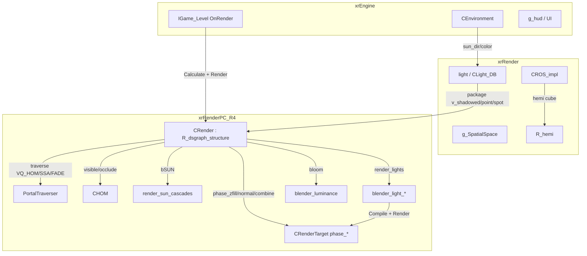
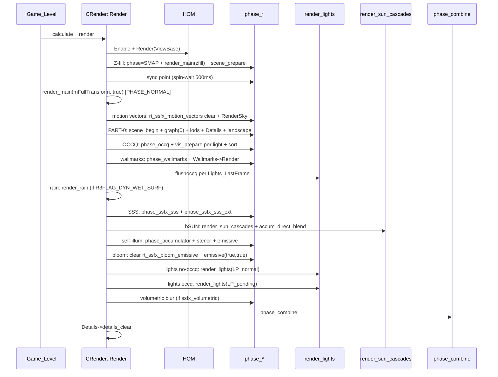
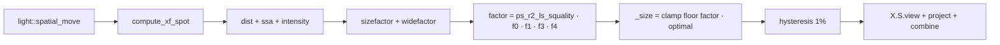

# Renderer: R4 scene / lighting phase

## Ответственность

Сценный слой R4 (`xrRenderPC_R4`) — **главный диспетчер кадра**: сборка сцены
(frustum + HOM-culling + spatial), полный deferred-пайплайн от Z-fill до
combine, солнечный VSM-путь, wallmarks, SSS, motion vectors, menu-render и
загрузка уровня. Файлы: `r4.cpp`, `r4_loader.cpp`, `r4_R_render.cpp`,
`r2_blenders.cpp`, `Light_Render_Direct*.cpp`, `blender_light_*.cpp`,
`blender_luminance.cpp`.

**Чего он НЕ делает**:

- конкретные deferred-фазы `CRenderTarget::phase_*` (RT-создание, stencil,
  MSAA resolve) — порционы 13–14 ([Deferred](r4-deferred.md),
  [Postprocess](r4-postprocess.md)); здесь только **вызовы** фаз;
- solar VSM internals (`render_sun_cascades`, `FixedConvexVolume`,
  `SMAP_Allocator`) — [VSM / SMAP](vsm-smap.md) (порцион 6);
- репрезентация/реестр/vis-тесты светов — [Свет](lights.md) (порцион 11);
- dsgraph-обход, HOM, occq — [dsgraph](dsgraph.md), [Occlusion](occlusion.md),
  [Секторы](sector.md).

## Место в архитектуре

`CRender` — единственный экземпляр (`RImplementation`), реализуемый поверх
`R_dsgraph_structure` (наследование) и `IRender_interface`. Связывает
xrEngine-интерфейсы с GPU-бэкендом DX10/11 (`dxRenderDeviceRender`).

## Публичный API

### `CRender` (`src/Layers/xrRenderPC_R4/r4.h`, `: R_dsgraph_structure, IRender_interface`)

| Метод                                                                                  | Назначение                                                                                                         |
| -------------------------------------------------------------------------------------- | ------------------------------------------------------------------------------------------------------------------ |
| `create/destroy`                                                                       | Инициализация/освобождение (см. «Конфигурация»); `destroy` — `reset_end` + деаллокация                             |
| `reset_begin/reset_end`                                                                | Device-reset: `svis.resetoccq`, Details reload если size/density/height изменились, `m_bFirstFrameAfterReset=true` |
| `level_Load/level_Unload`                                                              | Загрузка/выгрузка уровня (см. `r4_loader.cpp` ниже)                                                                |
| `calculate`                                                                            | Обёртка `R_dsgraph_structure::calculate` + lights (`r2_R_calculate.cpp`, [Свет](lights.md))                        |
| `render`                                                                               | Полный кадр: `rmNormal` → menu либо `Render()`                                                                     |
| `add_Visual/add_Geometry`                                                              | Динамический визуал (`add_leafs_Dynamic`) / статический (`add_Static`, mask `View->getMask()`)                     |
| `wallmark_add/add_SkeletonWallmark`                                                    | Wallmark-примитивы (demonized: `random_rotation` → `randF(-20,20)`)                                                |
| `clear_static_wallmarks`                                                               | Очистка статических wallmarks                                                                                      |
| `blender_create`                                                                       | Фабрика blenders (см. «Blender-фабрика»)                                                                           |
| `ros_create/destroy`                                                                   | ROS (heatvision/silencer) → `CROS_impl`                                                                            |
| `light_create/glow_create`                                                             | `CLight_DB::Create` / `CGlow` (заглушка)                                                                           |
| `GetSunPosition/Color/Intensity`                                                       | Из `Lights.sun_adapted`                                                                                            |
| `model_Create/CreateChild/Duplicate/Delete/CreateDM/CreatePE/CreateParticles`          | `CModelPool` (`Models`), `PSLibrary.OnCreate`                                                                      |
| `getShader/getPortal/getSector/getSectorActive/getVisual/getVB/getIB/getSWI/getTarget` | Геттеры пулов                                                                                                      |
| `occ_visible`                                                                          | `HOM.visible` (Fbox2+depth — быстрый 2D-тест)                                                                      |
| `add_Occluder`                                                                         | `HOM.occlude` — **заглушка** (см. [Occlusion](occlusion.md))                                                       |
| `RenderToTarget`                                                                       | Рендер в RT для `rtPDA`/`rtSVP` (secondary viewport)                                                               |
| `TakeScreenshot`                                                                       | Screenshot (см. ниже)                                                                                              |
| `set_Object`                                                                           | `val_pObject` (текущий renderable)                                                                                 |
| `flush`                                                                                | `r_dsgraph_render_graph(0)`                                                                                        |
| `addShaderOption/clearAllShaderOptions`                                                | Динамические `#define` для `shader_compile`                                                                        |
| `m_ShaderOptions`, `m_file_set`                                                        | Поля: macro-вектор, fileset для shader-cache match                                                                 |

### Enums / константы (`r4.h`)

- `PHASE_NORMAL` / `PHASE_SMAP` — фазы `CRenderTarget` (smap-RT vs scene-RT);
- `MSAA_ATEST_DX10_0_ATOC` / `MSAA_ATEST_DX10_1_ATOC` / `MSAA_ATEST_DX10_1_NATIVE` —
  режимы alpha-test для MSAA (0/1/2 → ATOC/NATIVE);
- `MMSM_*` — mode mask sun (legacy);
- `SMAP_adapt_max/optimal` — adaptive smap sizing (см. `compute_xf_spot`).

### `struct _options o` (`r4.h`)

| Поле                                                                                                                                                                   | Назначение                                                                          |
| ---------------------------------------------------------------------------------------------------------------------------------------------------------------------- | ----------------------------------------------------------------------------------- |
| `ssfx_*`                                                                                                                                                               | Флаги ssfx-эффектов, **детект по существованию шейдер-файлов** (см. «Конфигурация») |
| `smapsize`                                                                                                                                                             | Размер SMAP (def 2048, `-smap1536..4096`)                                           |
| `depth16`                                                                                                                                                              | D16 vs D24/32F                                                                      |
| `mrt`                                                                                                                                                                  | Multiple render targets                                                             |
| `dx10_msaa*`                                                                                                                                                           | MSAA enable/samples/opt/hybrid/alphatest                                            |
| `dx11_hdr10`                                                                                                                                                           | HDR10 (`ps_r4_hdr10_on`) — **отключает MSAA**                                       |
| `tessellation`                                                                                                                                                         | DX11 tessellation (`R2FLAGEXT`)                                                     |
| `forcegloss`                                                                                                                                                           | `-gloss N`                                                                          |
| `sunstatic`, `sunfilter`, `Tshadows`, `sjitter`, `HW_smap*`, `fp16_*`, `ssao_*`, `dx10_sm4_1`, `dx10_minmax_sm`, `disasm`, `forceskinw`, `advancedpp`, `volumetricfog` | Свойства GPU/качества (см. `create()`)                                              |

### `struct _stats`

`l_total/l_visible/l_shadowed/l_unshadowed` — счётчики светов; `s_used/s_merged/s_finalclip` —
SMAP; `o_queries/o_culled` — occq; `ic_total/ic_culled` — internal culling.
Печатает `Statistics(CGameFont*)` (вызов — из [CStats](../xr-engine/stats.md),
итерация 2).

## Внутреннее устройство

### `CRender::render_main` (`r4_R_render.cpp`)

Ядро сборки кадра; вызывается **дважды** за кадр (Z-fill `PHASE_SMAP` + main
`PHASE_NORMAL`) — не путать:

1. `q_frustum(STYPE_RENDERABLE + STYPE_LIGHTSOURCE, ViewBase)` — frustum-query
   spatial;
2. `std::sort` по `pred_sp_sort` — **front-to-back**;
3. `uID_LTRACK = uLastLTRACK % lstRenderables.size()` — ротация одного
   renderable-объекта для ROS-update (каждый кадр — другой объект);
4. `PortalTraverser.traverse(pLastSector, ViewBase, camPos, m_ViewProjection,
VQ_HOM | VQ_SSA | VQ_FADE)` — `VQ_SCISSOR` закомментирован;
5. Статика per sector per frustum → `add_Geometry(root)`;
6. Динамика: per spatial → `spatial_updatesector`;
   - light: `L->get_LOD() > EPS` → `HOM.visible(L->get_homdata())` →
     `Lights.add_light(L)`;
   - renderable: HOM `v_copy` (xform box) → `HOM.visible` → `renderable_Render()`.
7. HUD: `g_hud->Render_Last()` + `r_dsgraph_render_hud_ui/cam_ui`
   (только `PHASE_NORMAL`).

### `CRender::Render` (`r4_R_render.cpp`)

Полный deferred-кадр (вызывается из `render` при `!bMenu`):

- `rmNormal()`; `OnRenderPPUI_query()` → `render_menu()` (menu-RT — отдельный
  путь, см. ниже);
- `m_bFirstFrameAfterReset` → skip кадра;
- `bSUN = R2FLAG_SUN && sun_color > EPS && !"-r4_dev" && !o.sunstatic`;
- `HOM.Enable/Render(ViewBase)` (skip при `R2FLAG_EXP_MT_CALC`);
- **Z-prefill** (`R2FLAG_ZFILL`): `phase = PHASE_SMAP` → `render_main(m_zfill,
false)` → `phase_scene_prepare` + `set_ColorWriteEnable(FALSE)` +
  `r_dsgraph_render_graph(0)`; sync point `q_sync_point[q_sync_count]`
  (spin-wait 500 мс, `SwitchToThread`);
- Main calc: `r_pmask(true,false,true)` (wmarks capture);
  `set_Recorder(&main_coarse_structure)` если `bSUN`; `phase = PHASE_NORMAL` →
  `render_main(mFullTransform, true)`;
- **Motion vectors** (`ssfx_motionvectors`): RT `rt_ssfx_motion_vectors` clear 0,
  `Environment().RenderSky(true)`;
- `R2FLAG_TERRAIN_PREPASS` → `r_dsgraph_render_landscape(0, false)`;
- **PART-0**: `phase_scene_begin` + `r_dsgraph_render_hud/graph(0)/lods(true,
true)` + `Details->Render()` + landscape(1, true) + `phase_scene_end`
  (split-вариант `R2FLAG_EXP_SPLIT_SCENE`);
- `scope_3D_fake_enabled` → copy ZB → `rt_tempzb` (Redotix99);
- **OCCQ lights**: `phase_occq()`; `LP_normal/LP_pending.clear()`; per light
  `vis_prepare()` → pending/normal; sort both;
- **PART-1** (split): skybox `if(0)` (закомментирован), scene again;
- **Wallmarks**: `phase_wallmarks` + `Wallmarks->Render()`;
- **Flush occq**: per `Lights_LastFrame` → `svis.flushoccq()` (try/catch);
  `mark_msaa_edges()` если `dx10_msaa`;
- **Rain** (`R3FLAG_DYN_WET_SURF`): `render_rain()`;
- Matrices: `Matrix_previous = mm_saved * mInvView`,
  `Matrix_current = mProject` (static `mm_saved_viewproj`, skip SVP frame);
- **SSS** (`ssfx_sss`): `phase_ssfx_sss()` если `ps_ssfx_sss_quality.z > 0`
  (иначе clear `rt_ssfx_sss`); `phase_ssfx_sss_ext(Lights.package)` если
  `ps_ssfx_sss_quality.w > 0` (иначе clear `rt_ssfx_sss_tmp`);
- **SUN** (`bSUN`): `stats.l_visible++`; `R2FLAGEXT_SUN_OLD` off →
  `render_sun_cascades()`, else `render_sun_near()` + `render_sun()` +
  `render_self_illum` → `render_sun_filtered()`; `accum_direct_blend()`;
- **Self-illum**: `phase_accumulator`; stencil (non-MSAA: 0x01/0xff/0xff, MSAA:
  0x01/0xff/**0x7f**); `r_dsgraph_render_emissive(ssfx_bloom ? false : true)`;
- **Bloom**: clear `rt_ssfx_bloom_emissive` → `r_dsgraph_render_emissive(true,
true)`;
- **Lights no-occq**: `phase_accumulator`, `HOM.Disable()`,
  `render_lights(LP_normal)`;
- **Lights occq**: `render_lights(LP_pending)`;
- `phase_ssfx_volumetric_blur()` если `ssfx_volumetric`;
- **Combine**: `phase_combine()`;
- `Details->details_clear()`;
- VERIFY `mapDistort/mapHUDDistort` empty.

### `render_forward`

Second-order geometry (priority 1), distortion on:

`o.distortion = o.distortion_enabled` → `r_pmask(false, true)` (priority 1) →
`render_main(mFullTransform, false)` → `mapLOD.clear()` →
`r_dsgraph_render_graph(1)` → `PortalTraverser.fade_render()` →
`r_dsgraph_render_sorted()` → distortion off.

### `render_menu`

`rt_Generic_0` (LDR) → `OnRenderPPUI_main`; `rt_Generic_1` clear `(127,127,0,
127)/255` → `OnRenderPPUI_PP` (distortion mask); base RT: `s_menu/g_menu`
(4-вершинный quad, `FVF::TL`).

### Viewport-режимы (`rm*`)

`rmNear` — viewport `minZ=0.02`; `rmFar` — `minZ=0.99999`; `rmNormal` —
`minZ=0` (полный). `RSSetViewports` через `HW.pContext`.

### `CRender::Statistics(CGameFont*)`

Печатает: `LT/LV` (light total/visible), `S/NS` (shadowed/unshadowed), smap
use/merge/finalclip, `Occ-Q` (`o_culled/o_queries` %), `iCULL`
(`ic_culled/(ic_total+ic_culled)` %); DEBUG: `HOM.stats()`. Счётчики сбрасываются
после печати.

### `blender_create` (`r2_blenders.cpp`)

| Mode                 | Blender                      |
| -------------------- | ---------------------------- |
| `B_DEFAULT`          | `CBlender_deffer_flat`       |
| `B_DEFAULT_AREF`     | `CBlender_deffer_aref(true)` |
| `B_VERT`             | `deffer_flat`                |
| `B_VERT_AREF`        | `deffer_aref(false)`         |
| `B_SCREEN_SET`       | `CBlender_Screen_SET`        |
| `B_SCREEN_GRAY`      | **0** (не реализован)        |
| `B_EDITOR_WIRE/SEL`  | editor-blenders              |
| `B_LIGHT`            | **0**                        |
| `B_LmBmmD/B_BmmD`    | `CBlender_BmmD`              |
| `B_LaEmB`            | **0**                        |
| `B_LmEbB`            | `CBlender_LmEbB`             |
| `B_B`                | **0**                        |
| `B_SHADOW_TEX/WORLD` | **0**                        |
| `B_BLUR`             | **0**                        |
| `B_MODEL`            | `CBlender_deffer_model`      |
| `B_MODEL_EbB`        | `CBlender_Model_EbB`         |
| `B_DETAIL`           | `CBlender_Detail_Still`      |
| `B_TREE`             | `CBlender_Tree`              |
| `B_PARTICLE`         | `CBlender_Particle`          |

### Blenders света (R4)

Все — `Compile(CBlender_Compile&)` + `C.iElement` switch + `r_Pass` +
`r_dx10Texture`/`r_dx10Sampler`; MSAA-варианты читают/сбрасывают global
`::Render->m_MSAASample` (quirk — см. «Ограничения»).

- **`CBlender_accum_direct`** (SE_SUN_NEAR/MIDDLE: `accum_sun` /
  `accum_sun_near_nomsaa_nominmax`, Z-test, s_position/s_diffuse/s_material/
  s_accumulator/s_lmap/s_smap/s_smap_minmax/s_ssfx_sss, jitter; SE_SUN_FAR:
  `accum_sun_far_nomsaa`, smp_smap BORDER white; SE_SUN_LUMINANCE:
  `stub_notransform_aa_AA`/`accum_sun_nomsaa`; SE_SUN_NEAR_MINMAX:
  `accum_sun_near_nomsaa_minmax`), `_msaa` (msaa-варианты, `m_MSAASample`),
  `_volumetric_msaa` (case 0: `accum_volumetric_sun_msaa`, s_lmap/s_smap/s_noise
  `fx\fx_noise`), `_volumetric_sun_msaa` (case 0: blend ONE/ONE).
- **`CBlender_accum_point`** (SE_L_FILL: `copy_nomsaa` s_base; SE_L_UNSHADOWED:
  `accum_omni_unshadowed_nomsaa`; SE_L_NORMAL: `accum_omni_normal_nomsaa` +
  s_smap + s_ssfx_sss_tmp + jitter; SE_L_FULLSIZE: тот же shader; SE_L_TRANSLUENT:
  `accum_omni_translucent_nomsaa`), `_msaa`.
- **`CBlender_accum_spot`** (SE_L_FILL: `copy_nomsaa`; SE_L_UNSHADOWED:
  `accum_spot_unshadowed_nomsaa`; SE_L_NORMAL: `accum_spot_normal_nomsaa` +
  s_smap + jitter; SE_L_FULLSIZE: `accum_spot_fullsize_nomsaa`), `_msaa`.
- **`CBlender_accum_reflected`** (+`_msaa`): `accum_volume` /
  `accum_indirect_nomsaa`/`_msaa`, s_position/s_diffuse/s_material/s_accumulator
  (без s_lmap/s_smap).
- **`CBlender_accum_direct_mask`** (+`_msaa`): SE_MASK_SPOT/POINT: `accum_mask`/
  `dumb` color-write off; SE_MASK_DIRECT: `accum_sun_mask_nomsaa/msaa`
  (s_position/s_diffuse, color off, blend ZERO/ONE alpha 1); SE_MASK_ACCUM_VOL:
  `copy_p_nomsaa/msaa` (s_generic = `r2_RT_accum_temp`); SE_MASK_ACCUM_2D:
  `copy_nomsaa/msaa` (s_generic = accum_temp); SE_MASK_ALBEDO: `copy_nomsaa`
  (s_generic = `r2_RT_accum`).
- **`CBlender_luminance`** (`blender_luminance.cpp`): case 0 —
  `bloom_luminance_1` (s_image = `r2_RT_bloom1`, 256→64); case 1 —
  `bloom_luminance_2` (64→8).

### `Light_Render_Direct` (заглушка)

`Light_Render_Direct.h/.cpp` — **пустые** (7/2 стр.). Объявлен
`CLight_Compute_XFORM_and_VIS { void compute_xf_spot(light*); }` — реализация в
`Light_Render_Direct_ComputeXFS.cpp`.

### `compute_xf_spot` (`Light_Render_Direct_ComputeXFS.cpp`)

EYE-space xform + adaptive SMAP sizing (подробно в [Свет](lights.md) порцион 11):

- `L_dir` normalize; right/up: если `L->right ≠ 0` — ortho-normalize; иначе auto
  up (0,1,0) или (0,0,1) если параллелен dir;
- `L->X.S.posX = posY = 0`, `size = SMAP_adapt_max`, `translucent = FALSE`;
- `dist = vCameraPosition.distance_to(spatial.sphere.P) − sphere.R` (clamp ≥ 0);
- `ssa = clampr(range² / (1 + dist²), 0, 1)`;
- `intensity0 = avg(rgb)`, `intensity1 = 0.2125r + 0.7154g + 0.0721b`,
  `intensity = (0 + 1)/2`;
- `sizefactor = range / 8` (8 m = optimal); `widefactor = cone / deg2rad(90)`;
- `factor = ps_r2_ls_squality · ssa^0.5 · intensity^1/16 · sizefactor^0.25 ·
widefactor^0.5` (duel_dot закомментирован);
- `max_size = min(o.smapsize, ps_ssfx_shadows.y)`; `_size = floor(factor ·
SMAP_adapt_optimal)`, clamp `[ps_ssfx_shadows.x, max_size]`;
- **Hysteresis**: `_epsilon = ceil(_size · 0.01)`; `|_size − cached| < epsilon`
  → cached (anti-flicker);
- `L->X.S.view.build_camera_dir(L_pos, L_dir, L_up)`;
- **`tan_shift`** («Ray Twitty»): OMNIPART 0.3, POINT 0.2007129
  (deg2rad 11.5°), SPOT 0.0610865 (deg2rad 3.5°) — расширение frustum для
  displaced pixels;
- `L->X.S.project.build_projection(cone + tan_shift, 1, virtual_size, range +
EPS_S)`; `combine = project · view`.

### `r4_loader.cpp` — загрузка уровня

- **`level_Load`**: shaders из `fsL_SHADERS` chunk; `Wallmarks/Details` alloc;
  `level.geom` (nVB/xVB) + `level.geomx` (alt); `LoadSWIs`; `LoadVisuals` (OGF
  chunks → `Models->Instance_Create`); `Details->Load`; `LoadSectors`
  (`fsL_PORTALS`: `b_portal{u16 front/back, svector<Fvector,6> verts}` →
  `CPortal::Setup` + `CDB::Collector` → `rmPortals` model; если < 2 tris → dummy
  face (-20000,−20000,−20000)); `Load3DFluid` (volumetricfog, `level.fog_vol`
  v3 → `dx103DFluidVolume` → sector root children); `HOM.Load`; `LoadLights`
  (`Lights.Load` + `LoadHemi`);
- **`level_Unload`**;
- **`LoadBuffers`**: VB — `D3DXGetDeclLength` + `dx10BufferUtils::
CreateVertexBuffer`; IB — u16 indices;
- **`LoadSWIs`**: `fsL_SWIS`: `FSlideWindowItem{reserved[4], count, sw}`.

### `shader_compile` (`r4.cpp`)

Компиляция HLSL → binary + cache:

- **Defines** (из `m_ShaderOptions` + авто): `SMAP_size` (4 цифры),
  `FP16_FILTER/BLEND`, `USE_HWSMAP(_PCF/_FETCH4)`, `USE_SJITTER`,
  `USE_BRANCHING` (raster ≥ 3), `USE_VTF`, `USE_TSHADOWS`, `USE_MBLUR`,
  `USE_SUNFILTER`, `USE_R2_STATIC_SUN`, `SKIN_COLOR`, `USE_SSAO_BLUR`,
  `HDAO`/`USE_HBAO`+`SSAO_OPT_DATA`+`VECTORIZED_CODE`, `ISAMPLE` (MSAA),
  `SKIN_NONE/0..4`, `USE_SOFT_WATER/PARTICLES/DOF`, `SUN_SHAFTS_QUALITY`,
  `SSAO_QUALITY`, `SUN_QUALITY`, `ALLOW_STEEPPARALLAX`, `USE_REFLECTIONS`,
  `SMAA_QUALITY`, `INT_RENDER_AMD/NVIDIA` (vendor), `SM_4_1`, `SM_5`
  (FeatureLevel ≥ 11.0), `USE_MINMAX_SM`, `SSFX_RAIN_QUALITY`,
  `SSFX_INT_GRASS`, `SSFX_SSR_QUALITY`, `SSFX_WATER_QUALITY/PARALLAX`,
  `SSFX_IL_QUALITY`, `SSFX_AO_QUALITY`, `SSFX_POM_REFINE`,
  `SSFX_TERRA_POM_REFINE`, `SSFX_SSS_DIR_QUALITY` (1..24),
  `SSFX_SSS_OMNI_QUALITY` (1..12), `SSFX_MODEXE`, `USE_MSAA`+`MSAA_SAMPLES`+
  `MSAA_OPTIMIZATION`+`MSAA_ALPHATEST_DX10_0_ATOC/DX10_1_ATOC/DX10_1`.
  Каждый define + цифра в `sh_name` (cache-имя).
- **Target** per FeatureLevel: VS `vs_4_0/4_1/5_0`, PS `ps_4_0/4_1/5_0`, GS
  `gs_4_0/4_1/5_0`, CS `cs_5_0` (только 11.0);
- **Cache-пути**: `$game_shaders$/r3\objects/r4/<name>.<ext>/<sh_name>` (
  precompiled) либо `$app_data_root$/shaders_cache/r4/<name>.<ext>/<sh_name>`
  (generated); CRC-проверка (4 bytes header = crc32; generated + source_crc32
  = 8 bytes); mismatch → recompile;
- **`create_shader`** (2 overload): `pTarget[0]` dispatch: `p` → PS +
  `D3DReflect` + `constants.parse(RC_dest_pixel)`; `v` → VS +
  `D3DGetInputSignatureBlob` → `Resources->_CreateInputSignature` +
  `constants.parse(RC_dest_vertex)`; `g` → GS + `RC_dest_geometry`; `c` → CS;
  `h` → HS; `d` → DS; `disasm` → `D3DDisassemble` → `$logs$/disasm/`;
- **`includer`** (`ID3DInclude`): `Open` — `$game_shaders$/<path>/<file>` или
  fallback `$game_shaders$/<file>`; duplicate + zero-terminate;
- **`match_shader`/`match_shader_id`**: cache-match по `sh_name` (маска `_` =
  wildcard); DEBUG — ищет все matches + VERIFY; RELEASE — первый.

### `CRender::CRender()` / `~CRender()`

Конструктор: `init_cacades()` (создание 3 каскадов, [VSM / SMAP](vsm-smap.md));
`m_bFirstFrameAfterReset = false`. Деструктор: освобождение SWIs
(`xr_free(it.sw)`).

### `CGlow` (заглушка)

Пустая заглушка: все setters no-op. Используется как тип `glow_create` —
funktionalno мёртвый в R4.

## Взаимодействие

| Компонент                        | Направление                                      | Что передаётся                                |
| -------------------------------- | ------------------------------------------------ | --------------------------------------------- |
| [Секторы](sector.md)             | `PortalTraverser.traverse`                       | `VQ_HOM/SSA/FADE` → vis-список                |
| [Occlusion](occlusion.md)        | `HOM.visible/Enable/Render`; `HWOCC.occq_*`      | Fbox2+depth; `Lights_LastFrame` → `flushoccq` |
| [dsgraph](dsgraph.md)            | `r_dsgraph_render_graph/hud/lods/emissive`       | Phase masks, renderables                      |
| [VSM/SMAP](vsm-smap.md)          | `render_sun_cascades`; `SMAP_Allocator`          | `bSUN`, `smapsize`                            |
| [Свет](lights.md)                | `Lights.add_light`; `render_lights(LP_*)`        | `light_Package`; `vis_prepare`                |
| [Ресурсы](resources.md)          | `Models->Instance_Create`; `PSLibrary.OnCreate`  | OGF chunks                                    |
| [Визуалы](visuals.md)            | `add_Visual/Geometry`; `renderable_Render`       | `IRenderable`                                 |
| [Скелеты](kinematics.md)         | `add_SkeletonWallmark` (CKinematics/IKinematics) | Wallmark-примитивы                            |
| [Детали](detail.md)              | `Details->Render/details_clear/Load`             | Grass, `ps_ssfx_grass_*`                      |
| [Blenders](blenders.md)          | `blender_create`; `Compile`/`Render`             | `CBlender_Compile`                            |
| [Postprocess](r4-postprocess.md) | `phase_combine/scene_begin/...`                  | RT-состояние                                  |
| [Deferred](r4-deferred.md)       | `phase_accumulator/occq/ssfx_sss/...`            | RT-состояние                                  |
| [Устройство](render-device.md)   | `HW.pContext/pDevice`; `DX10BufferUtils`         | GPU-контекст                                  |
| [Константы](constants.md)        | `RCache.*`; `R_constant_setup`                   | Uniform-блоки                                 |
| [Фабрика](factory.md)            | `IRender_interface`                              | Выходной API                                  |

## Потоки данных / управления

### Кадр (Render)

### SMAP sizing per light

## Конфигурация

### Console variables

| Variable                                            | Назначение                                                  |
| --------------------------------------------------- | ----------------------------------------------------------- |
| `ps_r2_ls_squality`                                 | Множитель SMAP sizing (в `compute_xf_spot`)                 |
| `ps_ssfx_shadows`                                   | x = min size, y = max size (`max_size`)                     |
| `ps_r2_sun_lumscale` / `ps_r2_sun_lumscale_color`   | Солнечная яркость/цвет (в `CLight_DB::Update`)              |
| `ps_r2_slight_fade`                                 | SSA fade dynamic lights (`light::get_LOD`)                  |
| `ps_r2_wait_sleep`                                  | Sleep в `occq_get` spin-wait                                |
| `ps_r3_msaa`                                        | MSAA samples (`dx10_msaa = ps_r3_msaa && !hdr10`)           |
| `ps_r4_hdr10_on`                                    | HDR10 enable (отключает MSAA)                               |
| `ps_sunshafts_mode` / `ps_r_sun_shafts`             | Sun shafts quality                                          |
| `ps_r_ssao` / `ps_r_sun_quality`                    | SSAO/sun quality                                            |
| `ps_smaa_quality`                                   | SMAA quality                                                |
| `ps_ssfx_sss_quality`                               | SSS: x=dir, y=omni, z=main, w=ext                           |
| `ps_ssfx_rain_1.w`                                  | Rain quality (0 = off)                                      |
| `ps_ssfx_grass_interactive.y`                       | Interactive grass quality                                   |
| `ps_ssfx_ssr_quality`                               | SSR quality (0..5)                                          |
| `ps_ssfx_water_quality.x/.y`                        | Water quality/parallax                                      |
| `ps_ssfx_il_quality`                                | Image-based lighting quality (0..64)                        |
| `ps_ssfx_ao_quality`                                | AO quality (2..8)                                           |
| `ps_ssfx_pom_refine` / `ps_ssfx_terrain_pom_refine` | POM refine (0/1)                                            |
| `ps_r2_anomaly_flags`                               | MBLUR / WATER_REFLECTIONS                                   |
| `ps_r2_ls_flags`                                    | R1LIGHTS / GI / DOF / SOFT_WATER/PARTICLES / STEEP_PARALLAX |
| `ps_r2_sun_static`                                  | Sun static (в `o.sunstatic`)                                |
| `ps_r2_advanced_pp`                                 | `o.advancedpp`                                              |
| `R3FLAG_VOLUMETRIC_SMOKE`                           | `o.volumetricfog`                                           |
| `R2FLAGEXT`                                         | Tessellation / HDAO / HBAO                                  |
| `R2FLAG_SUN`                                        | Sun enable                                                  |
| `R2FLAG_ZFILL`                                      | Z-prefill enable                                            |
| `R2FLAG_TERRAIN_PREPASS`                            | Terrain prepass                                             |
| `R2FLAG_EXP_MT_CALC`                                | MT calc (HOM skip)                                          |
| `R2FLAG_EXT_SPLIT_SCENE`                            | Split scene render                                          |
| `R3FLAG_DYN_WET_SURF`                               | Dynamic wet surfaces (rain)                                 |
| `R2FLAGEXT_SUN_OLD`                                 | Legacy sun path (near+far vs cascades)                      |
| `psDeviceFlags2.rsPrecompiledShaders`               | Use precompiled shader cache                                |

### Command-line options (в `create()`)

| Option                | Эффект                                |
| --------------------- | ------------------------------------- |
| `-smap1536/2048/4096` | `o.smapsize`                          |
| `-gloss N`            | `o.forcegloss`                        |
| `-sunfilter`          | `o.sunfilter`                         |
| `-r4_dev`             | Disable sun (dev mode)                |
| `-noshadows`          | `R2FLAG_SUN` off                      |
| `-tsh`                | `o.Tshadows`                          |
| `-nodistort`          | Distortion off                        |
| `-disasm`             | `o.disasm` (shader disasm в `$logs$`) |
| `-skinw`              | `o.forceskinw`                        |
| `-r4xx`               | Emulate R4 на R3-железе               |
| `-no_occq`            | `HWOCC.enabled = false`               |

### SSFX-детекция (по шейдер-файлам)

`o.ssfx_*` флаги **не** детектятся по GPU-caps, а по **существованию файлов**
в `$game_shaders$/r3\`: `screenspace_common.h`, `effects_rain_splash`,
`effects_wallmark_blood`, `deffer_tree_branch_aref_bump-hq`,
`deffer_base_hud_bump`, `ssfx_ssr`, `deffer_terrain_high_flat_d`,
`ssfx_volumetric_blur`, `ssfx_water`, `ssfx_ao`, `ssfx_il`, `ssfx_sss`,
`ssfx_bloom`, `ssfx_taa`, `ssfx_fog_scattering`, `ssfx_motion_blur`,
`screenspace_mvectors.h`, `ssfx_glass`. Msg-dump SSS-флагов при `create()`.

## Известные ограничения / дебаг

- **`CGlow`** — пустая заглушка (все setters no-op); функционально мёртвый в R4;
- **`Light_Render_Direct.cpp/.h`** — пустые (2/7 стр.); реализация — в
  `Light_Render_Direct_ComputeXFS.cpp`;
- **`render_sun*`/`init_cacades`** — в `r_sun_cascades.cpp` (порцион 6,
  [VSM/SMAP](vsm-smap.md)), НЕ в `r4-scene` — не дублировать;
- **`r2_R_calculate.cpp`/`r2_R_lights.cpp`/`r2_R_sun.cpp`** — историческое
  ядро R2, переиспользуемое в R4 (решение §3 плана); `r2_R_calculate`/
  `r2_R_lights` уже покрыты в [Свет](lights.md) порцион 11;
- **`render_main`** вызывается 2 раза (Z-fill `PHASE_SMAP` + main
  `PHASE_NORMAL`) — не путать;
- **`render_forward`** — second-order geometry (priority 1), distortion on —
  отдельный путь;
- **`m_MSAASample`** — global на `::Render`; MSAA-blenders читают/сбрасывают;
- **HDR10 отключает MSAA**: `dx10_msaa = ps_r3_msaa && !o.dx11_hdr10`;
- **`q_sync_point`** — per-GPU (iGPUNum), ring `q_sync_count`, spin-wait 500 мс;
- **`shader_compile`** — cache-match `sh_name` (маска `_` = wildcard); DEBUG
  ищет все matches + VERIFY;
- **`create_shader`** — `pTarget[0]` dispatch (p/v/g/c/h/d); CS — только DX11;
- **`blender_create`** — `B_SCREEN_GRAY`/`B_LIGHT`/`B_LaEmB`/`B_B`/
  `B_SHADOW_TEX/WORLD`/`B_BLUR` → **0** (не реализованы);
- **`HOM.occlude`** — заглушка (см. [Occlusion](occlusion.md));
- **`CRender::Statistics`** — вызывается из [CStats](../xr-engine/stats.md)
  (итерация 2), не из `Render`;
- **`m_bFirstFrameAfterReset`** — skip первого кадра после device-reset;
- **`bSUN`** — требует `R2FLAG_SUN && sun_color > EPS && !"-r4_dev" &&
!o.sunstatic`;
- **`phase_combine`** — завершает deferred-кадр; internals — порционы 13–14.
