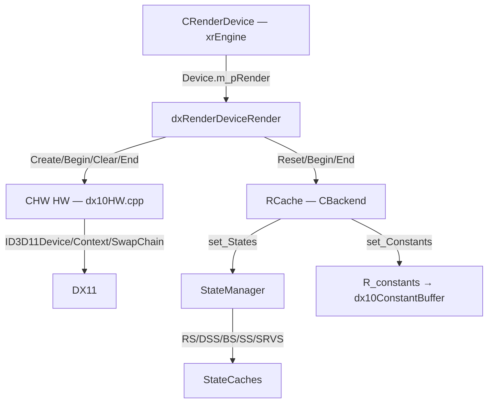
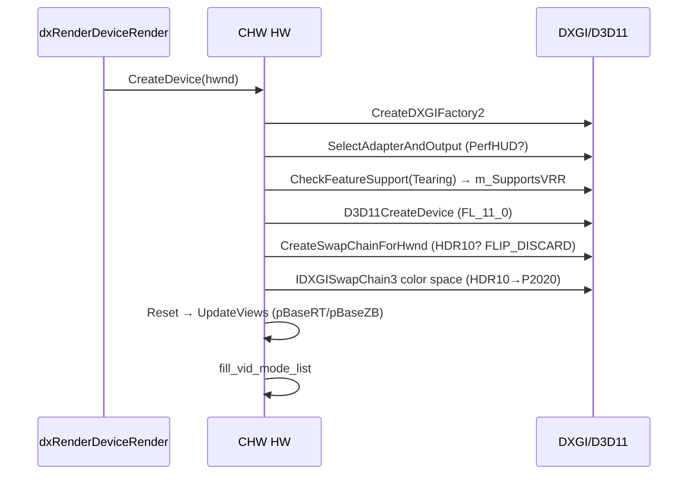
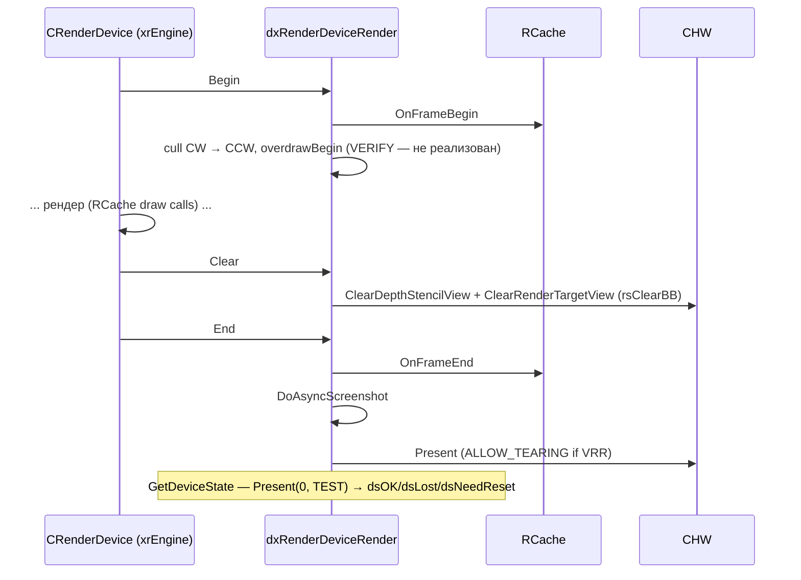
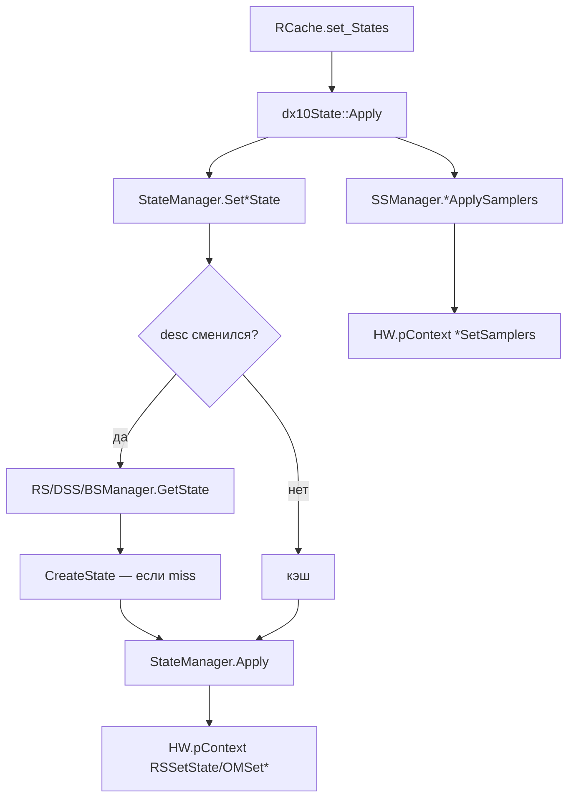

# Renderer: устройство рендера и GPU-состояния

## 1. Ответственность

Владеет DX11-устройством, swap chain и окном (`CHW`), реализует `IRenderDeviceRender` (`dxRenderDeviceRender` — цикл кадра на GPU-уровне), управляет GPU-состояниями через кэши (`StateManager`, `RS/DSS/BS/SS/SRVSManager`), предоставляет динамические вершинные/индексные потоки (`R_DStreams`) и аппаратное gamma (`xr_effgamma`).

Страница покрывает «железный» слой R4: всё, что ниже `R_Backend` (см. [Пайплайн](index.md), порционы 3–14) — выше идёт только через `RCache` и `Resources`. Сопутствующая страница — [Шейдерные константы](constants.md) (CB-кодирование, `R_constant*`, `SH_*`).

## 2. Место в архитектуре

См. [Архитектура](../../architecture/overview.md), [Зависимости](../../architecture/dependencies.md), [Точка входа и фабрика](factory.md).



- `dxRenderDeviceRender` создаётся фабрикой ([factory.md](factory.md), `RenderFactoryImpl::CreateRenderDeviceRender`) и живёт в `Device.m_pRender`. Доступ — макрос `DEV` или `dxRenderDeviceRender::Instance()`.
- `CHW HW` — **глобальный** объект (`src/Layers/xrRenderDX10/dx10HW.cpp`), владеет factory/adapter/output/device/context/swapchain и back buffer views (`pBaseRT`/`pBaseZB`).
- Активный путь устройства — `dx10HW.cpp`. `src/Layers/xrRender/HW.cpp` — D3D9-legacy, в R4 не используется.

## 3. Публичный API

| Класс/функция | Назначение |
|---|---|
| `dxRenderDeviceRender` | `IRenderDeviceRender`: `Reset`, `SetupStates`, `OnDeviceCreate/Destroy`, `Create`, `GetDeviceState`, `Begin`, `Clear`, `End`, `SwitchOutputMonitor` |
| `CHW HW` | Глобал: `CreateDevice/DestroyDevice/Reset/UpdateViews`, `selectResolution`, `selectRefresh`, `OnAppActivate/Deactivate`, `updateWindowProps`, `Caps`, `pDevice`/`pContext`/`pSwapChain` |
| `CHWCaps` | `Update()`, `GetGpuNum()` — **номинальные** в DX11 (см. §4) |
| `dx10StateManager StateManager` | Трейкер RS/DS/B-состояний: `Set*State`, `SetStencil/DepthFunc/DepthEnable/ColorWriteEnable/FillMode/CullMode/Multisample/EnableScissoring`, `Apply()` |
| `RSManager`/`DSSManager`/`BSManager` | Кэши `ID3DRasterizerState`/`ID3DDepthStencilState`/`ID3DBlendState` (`GetState(desc)`) |
| `dx10SamplerStateCache SSManager` | Кэш sampler-state по хэндлам, `SetMaxAnisotropy`, `SetMipLODBias`, `VS/PS/GS/HS/DS/CSApplySamplers` |
| `SRVSManager` | Кэш SRV-привязок по слотам шейдерных стадий, `Set*Resource`, `Apply()` |
| `dx10State` | Номенклатурный «бандл» состояний (RS+DS+B + sampler-хэндлы + stencil/alpha ref), `Create`/`Apply` |
| `_VertexStream`/`_IndexStream` | Динамические ring-буферы вершин/индексов в `RCache` |
| `CGammaControl` | Hardware LUT gamma: `Update()`, `fGamma/fBrightness/fContrast`, `cBalance` |
| `fill_vid_mode_list` | Заполнение `vid_mode_token` (режимы ≥800px, дедуп «WxH») |

## 4. Внутреннее устройство

### `dxRenderDeviceRender` (`src/Layers/xrRender/dxRenderDeviceRender.h/.cpp`)

`class dxRenderDeviceRender : IRenderDeviceRender`. Поля: `m_Gamma`, `m_WireShader`, `m_SelectionShader`. Макрос `DEV` (L5–9 заголовка) — доступ к глобальному экземпляру через `Device.m_pRender`.

| Метод | Что делает (DX11) |
|---|---|
| `Reset` | `Resources.reset_begin/end` + `Memory.mem_compact` + обновление `DXGI_SWAP_CHAIN_DESC` width/height |
| `SetupStates` | DX10/11: только `HW.Caps.Update()` + `SSManager.SetMaxAnisotropy(ps_r__tf_Anisotropic)`/`SetMipLODBias`. (В DX9 — полный setup sampler/render/fog.) |
| `OnDeviceCreate` | `RCache` init, gamma (`m_Gamma.Update`), `Resources`, `::Render->create()`, `Device.Statistic`; wire/selection-шейдеры — если не dedicated |
| `Create` | `HW.CreateDevice` + `Resources = xr_new<CResourceManager>` |
| `GetDeviceState` | `Present(0, DXGI_PRESENT_TEST)`: `DXGI_ERROR_DEVICE_REMOVED` → `dsLost`; `DEVICE_RESET` → `dsNeedReset`; иначе `dsOK` |
| `Begin` | `RCache.OnFrameBegin`, cull CW, затем CCW, `overdrawBegin` (только SceneMode) |
| `Clear` | `ClearDepthStencilView` + `ClearRenderTargetView`, если `rsClearBB` |
| `End` | `overdrawEnd`, `RCache.OnFrameEnd`, `DoAsyncScreenshot()`, `Present` (VRR/tearing, см. ниже) |
| `SwitchOutputMonitor` | `FindOutputOnCurrentAdapter` → `SetStartupMonitor` → swap `m_pOutput`, `fill_vid_mode_list`, `FinalizeMonitorGeometry` |

**Present в `End`** — ключевая логика tearing:

```cpp
// окно + vsync выключен + GPU поддерживает VRR → ALLOW_TEARING
UINT presentFlags = 0;
if (windowed && !vsync && m_SupportsVRR)
    presentFlags = DXGI_PRESENT_ALLOW_TEARING;
// SVP-кадр или «камера готова» → Present пропускается вовсе
if (!IsSVPFrame() && !isCamReady)
    HW.pSwapChain->Present(1, presentFlags);
```

**`overdrawBegin/End`** — в DX10/11 **не реализованы**: `VERIFY(!"not implemented")`. Stencil-based overdraw (как в DX9) в R4 отсутствует — ограничение.

### `CHW` (`src/Layers/xrRenderDX10/dx10HW.cpp`)

Глобал `CHW HW` (L35). Конструктор регистрирует `Device.seqAppActivate/Deactivate`. Параметр `--dxgi-old` (`LPCSTR dxgiOld = "--dxgi-old"`, L44) переключает legacy-путь reset.

**`CreateD3D()` (DX11-ветка):**

1. `CreateDXGIFactory2(0, &m_pFactory)`.
2. **NVIDIA PerfHUD**: если в аргументах `--perf-hud`-связанная адаптерная метка найдена → `m_bUsePerfhud = true`, тип драйвера становится **REFERENCE** (reference-драйвер NVIDIA). Иначе — `SelectAdapterAndOutput(MonitorFromWindow(m_hWnd, MONITOR_DEFAULTTOPRIMARY))` (L102): перебор adapters×outputs, выбор output, владеющего целевым монитором; fallback — адаптер 0 + output 0.
3. **VRR**: `IDXGIFactory5::CheckFeatureSupport(DXGI_FEATURE_PRESENT_ALLOW_TEARING, &m_SupportsVRR)` (L252–268). Комментарий в коде: quirk DWM vsync на Win10 LTSC 21H2 + драйвер NVIDIA 560.94.

**`CreateDevice(hwnd, move_window)` (L304):**

- `bWindowed = (g_screenmode != 2)`.
- Драйвер REF если `Caps.bForceGPU_REF` или PerfHUD.
- Лог: GPU vendor/device/desc из `DXGI_ADAPTER_DESC`; `Caps.id_vendor/id_device` заполняются здесь.
- **Hardcoded**: `fTarget = D3DFMT_X8R8G8B8`; глубина — всегда `D3DFMT_D24S8` (`selectDepthStencil`).
- **Swap chain desc** (L448–539): `AlphaMode=IGNORE`; **`Format = ps_r4_hdr10_on ? R10G10B10A2_UNORM : R8G8B8A8_UNORM`** (HDR10 флаг); `BufferCount=2`; `SwapEffect=DXGI_SWAP_EFFECT_FLIP_DISCARD` (комментарий: лучше перфоманс windowed/borderless для HDR); refresh — windowed hardcoded **60/1** (TODO в коде), fullscreen — `selectRefresh()`; флаги `ALLOW_MODE_SWITCH` + `ALLOW_TEARING` (если VRR).
- **Device**: `D3D11CreateDevice(nullptr, HARDWARE, nullptr, D3D11_CREATE_DEVICE_BGRA_SUPPORT (+D3D11_CREATE_DEVICE_DEBUG при `--dxgi-dbg`), {D3D_FEATURE_LEVEL_11_0}, 1, ...)` → `QueryInterface` на `ID3D11Device1`/`ID3D11DeviceContext1` → `HW.pDevice`/`HW.pContext`.
- Swap chain через `m_pFactory->CreateSwapChainForHwnd`.
- **Color space** (`IDXGISwapChain3`): HDR10 → `RGB_FULL_G2084_NONE_P2020` (если `CheckColorSpaceSupport` проходит, иначе лог + SDR `RGB_FULL_G22_NONE_P709`).
- `pAnnotation` — `ID3DUserDefinedAnnotation` (для Profiler).
- Хвост: `--dxgi-old` → `UpdateViews()` + `updateWindowProps` + `fill_vid_mode_list`; иначе `Reset(hwnd)` + `fill_vid_mode_list`.

**`Reset(hwnd)` (L783):** `SetFullscreenState`, `selectResolution`, refresh (windowed 60 / FS `selectRefresh`), `ResizeTarget` (`DXGI_MODE_DESC`), release + recreate `pBaseZB`/`pBaseRT`, `ResizeBuffers` (флаги + `ALLOW_TEARING` если VRR), `UpdateViews()`, `updateWindowProps`.

**`UpdateViews()` (L1459):** back buffer 0 → `pBaseRT` (RTV); **новая** depth-текстура `DXGI_FORMAT_D24_UNORM_S8_UINT` → `pBaseZB` (DSV).

**`DestroyDevice()` (L713):** `StateManager.Reset()`, `RS/DSS/BS/SSManager.ClearStateArray()`, release `pBaseZB`/`pBaseRT`, FS → windowed, release swapchain/context/device/annotation, `DestroyD3D()`, `free_vid_mode_list`.

**`selectResolution` (L955):** заполняет список режимов; screenmode 0 — client rect окна; 1 — `psCurrentVidMode`; 2 (fullscreen) — `psCurrentVidMode`, fallback — первый `vid_mode_token`.

**`selectRefresh` (L1026):** `-60hz` в аргументах или `psDeviceFlags.is(rsRefresh60hz)` → 60 Hz, `refresh_rate = 1/60`; иначе максимум из `m_pOutput->GetDisplayModeList`; записывает глобал `refresh_rate`.

**`OnAppActivate/Deactivate` (L1083/1127):** только exclusive-FS: restore/enter fullscreen, `ResizeBuffers` + `UpdateViews` (если не `--dxgi-old`), reshade init/unregister.

**`updateWindowProps` (L1185):** стили окна — borderless `WS_POPUP` (screenmode 1) или overlapped + dialog frame (если не `-no_dialog_header`); центрирование на мониторе; fullscreen `WS_POPUP|WS_VISIBLE`; `ShowCursor(FALSE)`; `ClipCursor`.

**`fill_vid_mode_list` (L1356, свободная функция):** режимы с шириной ≥800px, дедуп по строке «WxH» → массив `vid_mode_token`.

**Заглушки:** `CHW::support` (L1173) — `VERIFY(!"Implement CHW::support")` — **не реализован**.

### `CHWCaps` (`src/Layers/xrRender/HWCaps.h/.cpp`)

В DX10/11 `Update()` **полностью хардкод**: VS 4.0 / PS 4.0, 16 константных регистров, MRT 4, `dwVertexCache=24` (помечено «unrecognized»), `bStencil=TRUE`, `bScissor=TRUE`. Реальные caps запрашиваются только в D3D9-ветке. **В R4 caps — номинальные, не запрашиваются** — код, опирающийся на `HW.Caps.*`, работает с фиксированными значениями.

`GetGpuNum()`: NVAPI SLI-детект (ATI — заглушка), `res = _max(res, 2)`, потолок `MAX_GPUS=8`.

### Типовые shim-обёртки (`xrD3DDefs.h` / `DXCommonTypes.h`)

- `src/Layers/xrRender/xrD3DDefs.h`: под `USE_DX10`/`USE_DX11` включает `DXCommonTypes.h`; иначе — D3D9-тидеффы.
- `src/Layers/xrRenderDX10/DXCommonTypes.h` — shim, позволяющий писать DX9-имена в DX11-коде: `ID3DTexture2D`, `ID3DRenderTargetView`, `ID3DDepthStencilView`, `ID3DShaderResourceView`, `ID3DDevice`, `ID3DDeviceContext`, `ID3DVertexShader` и пр. (→ `ID3D11Texture2D*` и т.д.), `D3D_TEXTURE2D_DESC`/`D3D_BUFFER_DESC`/`D3D_SAMPLER_DESC`/`D3D_RASTERIZER_DESC` (→ DXGI/D3D11-дескрипторы), `#define` для `D3D_USAGE_DYNAMIC/STAGING`, `D3D_BIND_*`, `D3D_MAP_WRITE_DISCARD`, primitive topologies, filter/cull/comparison enum'ов, рефлексии (`ID3DShaderReflection`, IID L262). Благодаря ему код компилируется и под DX10, и под DX11 без `#ifdef` в местах обращения к ресурсам.

### StateManager (`src/Layers/xrRenderDX10/StateManager/` — 11 файлов)

Шесть файловых глобалов: `StateManager`, `RSManager`, `DSSManager`, `BSManager`, `SSManager`, `SRVSManager`.

**`dx10StateManager`** (`dx10StateManager.h/.cpp`, глобал `StateManager`):

- Три трекируемых состояния: Rasterizer / DepthStencil / Blend (weak links на `ID3DRasterizerState*` и т.п.).
- Флаги: `m_bRS/DSS/BSNeedApply` (указатель сменился), `m_bRS/DSS/BSChanged` (описание сменилось → ре-создать объект через кэш), `m_bRD/DSD/BDInvalid` (кэшированный desc устарел).
- **Fast path**: `Set*State` (прямая установка существующего объекта).
- **Slow path**: `SetStencil/SetDepthFunc/SetDepthEnable/SetColorWriteEnable/SetFillMode/SetCullMode/SetMultisample/EnableScissoring` — модификация кэшированного desc + флаг Changed.
- `Apply()` (L164): по каждому из трёх — если Changed → `RSManager/DSSManager/BSManager.GetState(desc)` (создание из кэша); затем `HW.pContext->RSSetState / OMSetDepthStencilState(st, m_uiStencilRef) / OMSetBlendState(bs, {0,0,0,0}, m_uiSampleMask)`.
- `SetAlphaRef/BindAlphaRef` — alpha-ref мапится в шейдерную константу через `RCache.set_c` (трюк «alpha ref как константа»).
- `OverrideScissoring` — принудительное включение/отключение scissor независимо от state-объектов.

**Кэши состояний** (`dx10StateCache.h/.cpp` + `dx10StateCacheImpl.h`):

- Шаблон `dx10StateCache<IDeviceState, StateDecs>` — линейный массив записей `{u32 crc, IDeviceState*}`; `GetState(desc)` → `ValidateState` (`dx10StateUtils`) → `GetHash` → линейный `FindState` (crc совпадает + `operator==` **поле-в-поле**, **не** memcmp — из-за padding'а) → miss: `CreateState` (например, `HW.pDevice->CreateRasterizerState`) + push.
- Глобалы: `RSManager` (`ID3DRasterizerState`/`D3D_RASTERIZER_DESC`), `DSSManager`, `BSManager`. `ClearStateArray` — при destroy устройства.

**`dx10StateUtils`** (`dx10StateUtils.h/.cpp`): namespace с DX9→DX11 конвертерами enum'ов (`ConvertFillMode`, `ConvertCullMode`, `ConvertCmpFunction`, `ConvertStencilOp`, `ConvertBlendArg/Op`, `ConvertTextureAddressMode`), `ResetDescription` (дефолты по типу desc), `operator==` поле-в-поле, `GetHash` (u32-хэш desc), `ValidateState` (нормализация desc под auto-modifications DX10).

**`dx10SamplerStateCache`** (`dx10SamplerStateCache.h/.cpp`, глобал `SSManager`):

- Тот же паттерн кэша, но хранит **хэндлы** (`SHandle u32`, `hInvalidHandle = 0xFFFFFFFF`) на `D3D_SAMPLER_DESC → ID3DSamplerState`.
- Массивы хэндлов по shader type: `m_aVSSamplers`, `m_aPSSamplers`, `m_aGSSamplers` (+`m_aHSSamplers`, `m_aDSSamplers`, `m_aCSSamplers` под DX11), по `D3D_COMMONSHADER_SAMPLER_SLOT_COUNT` слотов.
- `VSApplySamplers/PSApplySamplers/GSApplySamplers` (+HS/DS/CS) — сравнение текущих хэндлов, применение диапазона [min..max] через `HW.pContext->VSSetSamplers/PSSetSamplers/...`.
- `SetMaxAnisotropy`/`SetMipLODBias` — глобальные override'ы на все самплеры (вызываются из `dxRenderDeviceRender::SetupStates`).
- `ResetDeviceState`.

**`dx10ShaderResourceStateCache`** (`dx10ShaderResourceStateCache.h/.cpp`, глобал `SRVSManager`):

- Кэш SRV-указателей по слотам стадии: `m_PSViews[16]`, `m_GSViews[16]`, `m_VSViews[4]` (+HS/DS/CS под DX11), min/max-диапазон + dirty-флаги.
- `SetPSResource(slot, srv)` и т.п.; `Apply()` — выгрузка изменившихся диапазонов в контекст (`PSSetShaderResources`...). Используется привязкой текстур из `RCache`.

**`dx10State`** (`dx10State.h/.cpp`) — «номенклатурный» бандл: RS+DS+B state-объекты (weak links) + массивы sampler-хэндлов по стадиям + `m_uiStencilRef`/`m_uiAlphaRef`.

- `Create(SimulatorStates&)` (L23): `state_code.UpdateState(*pState)`, RS/DS/BS — из трёх кэшей, `InitSamplers` на shader type (базовые оффсеты `CTexture::rstVertex/rstPixel/rstGeometry/rstHull/rstDomain/rstCompute`).
- `Apply()` (L50): маршрутизация через `StateManager.Set*` + `SSManager.*ApplySamplers`.
- `Release()` = `xr_delete`.

### Динамические потоки (`src/Layers/xrRender/R_DStreams.h/.cpp`)

`_VertexStream` и `_IndexStream` — динамические ring-буферы. Глобалы: `rsDVB_Size = 4096` (KB), `rsDIB_Size = 512` (KB).

- DX11: `CreateBuffer` — `D3D_USAGE_DYNAMIC`, `D3D_CPU_ACCESS_WRITE`, `D3D_BIND_VERTEX_BUFFER`/`INDEX_BUFFER`.
- `Lock(Count, Stride, vOffset)`:
  - если `(vl_Count + vl_mPosition) >= vl_mSize` → **FLUSH-LOCK**: `D3D_MAP_WRITE_DISCARD`, `mDiscardID++`, vOffset=0;
  - иначе → **APPEND-LOCK**: `D3D_MAP_WRITE_NO_OVERWRITE`, offset = `vl_mPosition*Stride`.
- `Unlock` → Unmap, продвигает `mPosition`.
- `reset_begin/reset_end` — Destroy/Create (при device reset; `old_pVB/old_pIB` сохраняются).
- `DEV->Evict()` вызывается перед `Create`.
- Оба потока живут в `RCache` (`CBackend`).

Полный API `CBackend` (`R_Backend.h/.cpp`) — порционы 3/5; здесь только то, что нужно порциону 2: потоки, CB-массивы (`m_aPixelConstants[14]` и т.п. — см. [constants.md](constants.md)), `SRVSManager`-взаимодействие.

### Gamma (`src/Layers/xrRender/xr_effgamma.h/.cpp`)

`CGammaControl` (fGamma/fBrightness/fContrast/Fcolor cBalance). DX10/11 `Update()`:

```
m_pSwapChain->GetContainingOutput
  → GetGammaControlCapabilities
  → GenLUT(GC, G)  для каждой точки управления:
        c = (C+.5)*pow(pos, 1/(gamma+EPS)) + (B-.5)*.5 - C*.5 + .25
        (B = brightness/2, C = contrast/2)
  → масштаб в MinConvertedValue..MaxConvertedValue, × cBalance по каналам, clamp
  → SetGammaControl
```

D3D9-ветка: 256-записный `D3DGAMMARAMP` (та же формула, 0–65535).

## 5. Взаимодействие

**Кто вызывает это:**

- `CRenderDevice` (xrEngine) — `m_pRender->Create/Reset/Begin/Clear/End/GetDeviceState` ([device.md](../xr-engine/device.md) — обещание итерации 2 закрыто: `IRenderDeviceRender` здесь).
- `RCache::OnFrameBegin/End` (порционы 3/5) — через `DEV->Begin/End`.
- `dxRenderFactory` (factory.md) — создание `dxRenderDeviceRender`.

**Кто это вызывает:**

- `CResourceManager` (`Resources`) — `reset_begin/end`, `Evict` (порцион 7).
- `StateManager.Apply` → `HW.pContext`.
- `CGammaControl.Update` → `HW.pSwapChain`/`IDXGIOutput`.

## 6. Потоки данных и управления

### Создание устройства



### Кадр



### Применение состояний



## 7. Конфигурация

| Параметр | Тип | Действие |
|---|---|---|
| `ps_r4_hdr10_on` | cvar | Swap chain: `R10G10B10A2_UNORM` + color space `RGB_FULL_G2084_NONE_P2020` (иначе SDR) |
| `--dxgi-dbg` | arg | `D3D11_CREATE_DEVICE_DEBUG` |
| `--dxgi-old` | arg | Legacy reset: `UpdateViews`+`updateWindowProps` вместо `Reset` |
| `-60hz` | arg | `selectRefresh` → 60 Hz, `refresh_rate = 1/60` |
| `-no_dialog_header` | arg | Окно без dialog frame |
| `rsRefresh60hz` | device flag | то же, что `-60hz` |
| `ps_r__tf_Anisotropic` | cvar | `SSManager.SetMaxAnisotropy` в `SetupStates` |
| `dx10_msaa_opt` | cvar | `D3D_STANDARD_MULTISAMPLE_PATTERN` для MSAA-RT (см. [constants.md](constants.md), `CRT`) |
| `g_screenmode` | global | 0 = windowed, 1 = borderless, 2 = exclusive FS (стили окна, refresh) |
| `rsClearBB` | device flag | `Clear` → `ClearRenderTargetView` |
| `rsDVB_Size` / `rsDIB_Size` | cvar | Размер dynamic VB/IB (KB) |

## 8. Известные ограничения и дебаг

1. **Caps хардкод** — `CHWCaps::Update()` в DX11 не запрашивает GPU: VS/PS 4.0, 16 константных регистров, MRT 4, cache 24. Любой код, опирающийся на реальные caps, в R4 не работает.
2. **Overdraw не реализован** — `overdrawBegin/End` → `VERIFY(!"not implemented")` (DX9-стencil-метод не перенесён).
3. **`CHW::support` — заглушка** — `VERIFY(!"Implement CHW::support")`.
4. **`SPrimitiveBuffer::CreateFromData`** — пустой stub в DX10/11 (тело только для D3D9) → DU debug-буферы (solid/wire box/sphere и т.д.) **никогда не создаются** в R4; `DrawIdentBox` и пр. ничего не отрисуют.
5. **Windowed refresh** — hardcoded 60/1 (TODO в `dx10HW.cpp`); реальный refresh windowed-режима не определяется.
6. **`--dxgi-old`** — legacy-путь reset; в обычном режиме `Reset()` пересоздаёт back buffer views целиком.
7. **NVIDIA PerfHUD** — принудительно переключает на REFERENCE-драйвер; логировать как причину «reference-рендера».
8. **DWM vsync quirk** — Win10 LTSC 21H2 + NVIDIA 560.94 (комментарий в `CreateD3D`); tearing-путь зависит от `m_SupportsVRR`.
9. **Depth** — всегда `D3DFMT_D24S8` / `D32_FLOAT` (R32_TYPELESS); 32-bit float-глубина как опция не выбирается.
10. **SVP/Screenshot** — `Present` пропускается при `IsSVPFrame() || isCamReady`; асинхронный скриншот (`DoAsyncScreenshot`) в `End`.
