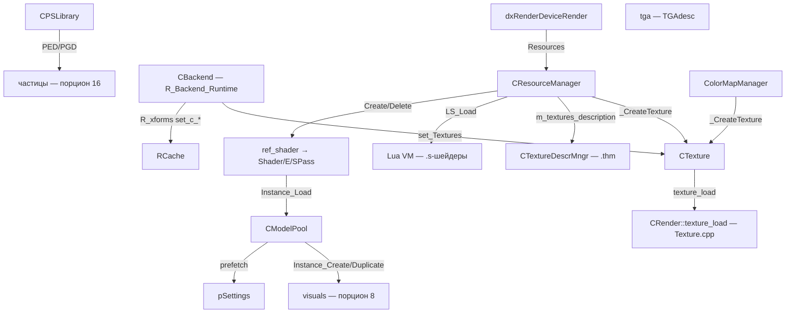
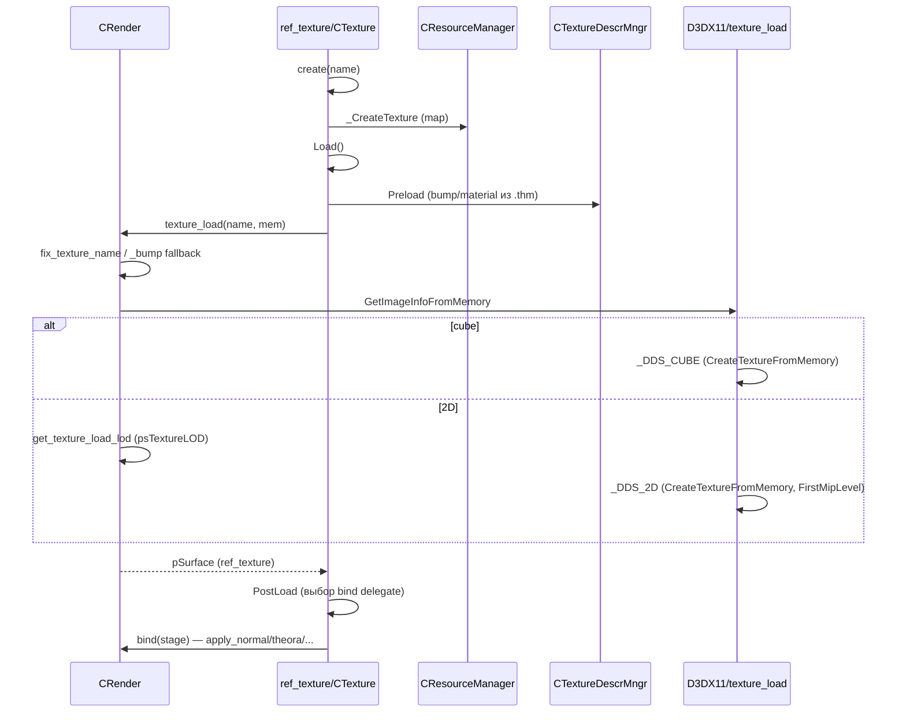
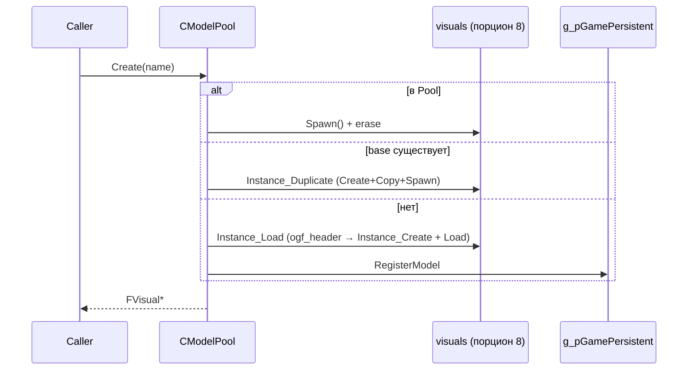
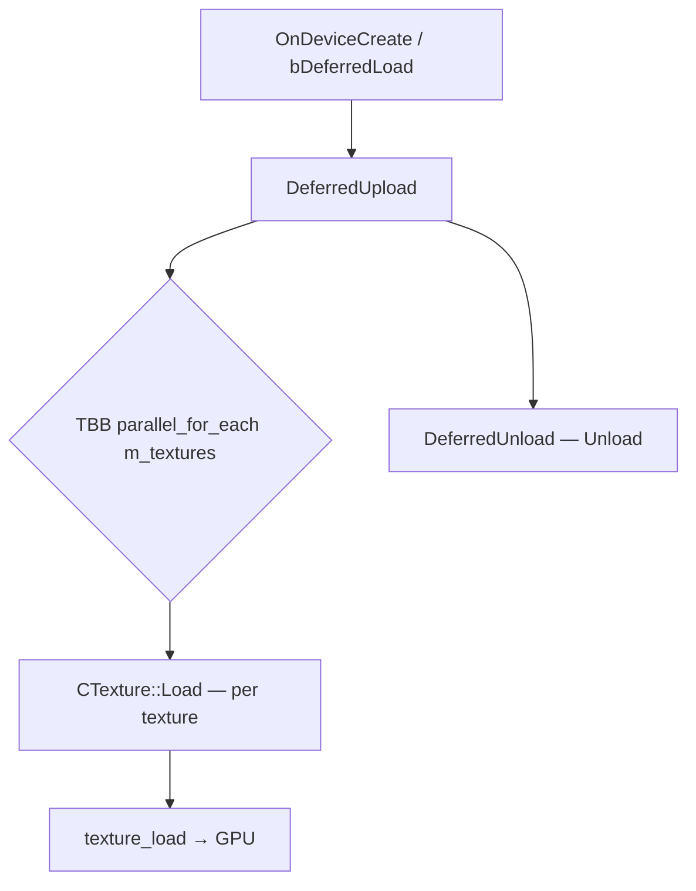

# Renderer: ресурсы и модели

## 1. Ответственность

Слой ресурсных пулов движка: единая точка создания/дедупликации/свободных GPU-объектов (`CResourceManager` — blenders, VS/PS/GS/HS/DS/CS, состояния, декларации, геометрия, константные таблицы и CB, RT, текстуры, матрицы/константы), пул моделей-визуалов с ре-использованием (`CModelPool`), описания текстурных параметров (`.thm` — `CTextureDescrMngr`/`STextureParams`), библиотека частиц (`CPSLibrary`), колормапы (`ColorMapManager`), TGA-сейвер (`tga`) и runtime-часть бэкенда (`R_Backend_Runtime`: xform-константы, `OnFrameBegin/End`, `Invalidate`, `set_Textures`).

Чего здесь **нет**: конкретных blenders (порцион 15), dsgraph-структур и state-sorting (порционы 5/6), RT-фаза deferred/постпроцесса (порционы 12–14), визуалов/скелетов (порционы 8–9), CB-кодирования и `R_constants` (порцион 2, [constants](constants.md)). Bэкенды R1–R3 не документируются — только активный R4/DX11.

## 2. Место в архитектуре

См. [Архитектура](../../architecture/overview.md), [Зависимости](../../architecture/dependencies.md), [Обзор xrRender](index.md).

- `CResourceManager` — член `dxRenderDeviceRender` (`Resources`); живёт на весь период жизни устройства.
- `CModelPool` — член `CRender` (`Models`, `RImplementation`); аллоцирует глобал `g_pMotionsContainer` (подтверждено: это xrRender, а не xrEngine — см. итерацию 2, порцион 7).
- `CTexture` — обёртка `xr_resource_named`; `ref_texture` typedef в `SH_Texture.h`.

## 3. Публичный API

| Класс / функция                      | Назначение                                                                                                                                                                                                                                                                                                                                                                                                                                                           |
| ------------------------------------ | -------------------------------------------------------------------------------------------------------------------------------------------------------------------------------------------------------------------------------------------------------------------------------------------------------------------------------------------------------------------------------------------------------------------------------------------------------------------- |
| `CResourceManager`                   | Пул всех GPU-ресурсов: `Create/Delete` (shader), `_CreateTexture/Matrix/Constant/RT/VS/PS/GS/HS/DS/CS/State/Decl/Geom/ConstantTable/ConstantBuffer/InputSignature`, `_CreateTextureList/MatrixList/ConstantList`, `_cpp_Create/_lua_Create/_lua_HasShader`, `_GetBlender/_FindBlender`, `OnDeviceCreate/Destroy`, `reset_begin/end`, `DeferredUpload/Unload`, `Evict`, `StoreNecessaryTextures/DestroyNecessaryTextures`, `_GetMemoryUsage/_DumpMemoryUsage`, `Dump` |
| `CModelPool`                         | Пул визуалов: `Instance_Load/Find/Duplicate/Register/Create/CreateChild/Delete/Destroy/Discard`, `Prefetch/Prefetch_One`, `Exists`, `CreatePE/CreatePG`, `memory_stats`, `dump`                                                                                                                                                                                                                                                                                      |
| `CTexture`                           | Обёртка текстуры: `Load/Unload/Preload/PostLoad`, `surface_set/get`, `apply_load/theora/avi/seq/gif/normal` (delegate `bind`), `get_Width/Height`, `video_Play/Pause/Stop`, `get_SRView`, `ResourceShaderType` enum                                                                                                                                                                                                                                                  |
| `STextureParams`                     | Бинарный формат `.thm`: `ETType/ETFormat/ETBumpMode/ETMaterial`, mip-фильтры (15), флаги, `detail_name/detail_scale`, `bump_name/bump_mode/bump_virtual_height`, `material/weight`, `Load/Save`, `Clear`, `HasAlpha/HasAlphaChannel`                                                                                                                                                                                                                                 |
| `CTextureDescrMngr`                  | Загрузчик `.thm`: `Load` (2 потока), `GetBumpName/GetMaterial/GetTextureUsage/GetDetailTexture/UseSteepParallax`                                                                                                                                                                                                                                                                                                                                                     |
| `CPSLibrary`                         | Библиотека частиц: `OnCreate/OnDestroy`, `Load/Load2/Save/Save2/Reload`, `FindPED/FindPGD`, `RenamePED/PGD`, `Remove`, `particles_group_*`                                                                                                                                                                                                                                                                                                                           |
| `ColorMapManager`                    | Колормапы: `SetTextures(tex0,tex1)`, кэш `m_TexCache`                                                                                                                                                                                                                                                                                                                                                                                                                |
| `CRender::texture_load`              | Загрузка DDS → GPU (2D/cube, LOD-reduce, bump-fallback)                                                                                                                                                                                                                                                                                                                                                                                                              |
| `R_xforms` (Runtime)                 | `set_c_w/invw/v/p/wv/vp/wvp` + `_prev` — запись xform-констант в `RCache`                                                                                                                                                                                                                                                                                                                                                                                            |
| `CBackend` (Runtime)                 | `OnFrameBegin/End`, `Invalidate`, `set_States/Element/Shader/Textures/ClipPlanes`, `set_xform_*`, `get_RT/get_ZB`                                                                                                                                                                                                                                                                                                                                                    |
| `dx10TextureUtils`/`dx10BufferUtils` | DX10/11-утилиты: `ConvertTextureFormat`, `CreateVertexBuffer/IndexBuffer/ConstantBuffer`, `ConvertVertexDeclaration`                                                                                                                                                                                                                                                                                                                                                 |
| `tga`/`TGAdesc`                      | TGA-сейвер (24/32bpp, flip)                                                                                                                                                                                                                                                                                                                                                                                                                                          |

## 4. Внутреннее устройство

### `CResourceManager` — core (`ResourceManager.h/.cpp`)

Контейнеры: `map_Blender/Texture/Matrix/Constant/RT/VS/PS/GS/HS/DS/CS` (ключ — имя, `str_pred` = `xr_strcmp`), `v_states/declarations/geoms/constant_tables/constant_buffer/input_signature`, списки `lst_textures/matrices/constants`, `v_passes/elements/shaders`, `m_necessary` (ref_texture), `creationGuard` (`xrCriticalSection`), `bDeferredLoad` (по умолчанию `TRUE`), `LSVM` (lua_State), `m_textures_description` (`CTextureDescrMngr`).

**Blenders:** `_GetBlender(Name)` → `_FindBlender` (map lookup); в DX10/11 при отсутствии — `Msg` + `NULL` (не fatal). `_ParseList(sh_list&, LPCSTR)` — comma-split, `strlwr`, `fix_texture_name` (срезает `.tga/.dds/.bmp/.ogm/.gif`).

**`_cpp_Create(IBlender*, s_shader, s_textures, s_constants, s_matrices)`** — компиляция 6 элементов `Shader::E[0..5]`:

- `E[0]` LOD0-HQ: `bDetail` из `m_textures_description.GetDetailTexture` (detail-текстура + scaler),
- `E[1]` LOD1, `E[2..3]` без detail, `E[4]` `bDetail=TRUE` (комментарий `HACK :)`), `E[5]` — пятый.
- HUD-lens hack: `hud_loading && strstr(s_shader,"lens")` → `ps->hud_disabled`.
- Dedup: `Shader::equal` по `E[*]` (сравнение `passes`, `flags`); `creationGuard`.

**`_cpp_Create(LPCSTR s_shader, ...)`** (по имени): DX10/11 — `_GetBlender` → miss = `NULL`, **fallback отсутствует**; non-DX10 — `_lua_HasShader` → `_lua_Create`, иначе CPP, иначе `stub_default`, иначе `FATAL`.

**`_CreateElement`** — dedup по `equal`, `creationGuard`. **`_DeleteElement`** — check `RF_REGISTERED`, `reclaim` (vector erase).

**`_CreateTexture/Matrix/Constant/RT/VS/PS/GS/HS/DS/CS`** — map-lookup по имени, при отсутствии — `xr_new`, `RF_REGISTERED`, insert. DX10/11-версии VS/PS/GS/HS/DS/CS — в `dx10ResourceManager_Resources.cpp` (см. ниже).

**Deferred:** `DeferredUpload`/`DeferredUnload` — TBB `parallel_for_each` по `m_textures` → `Load()/Unload()`; upload gated `RDEVICE.b_is_Ready`. `Evict()` — DX9-only `EvictManagedResources`, в DX10/11 **no-op**.

**Память:** `_GetMemoryUsage(m_base, c_base, m_lmaps, c_lmaps)` — split по подстроке `lmap` в имени; `_DumpMemoryUsage` — sorted multimap по размеру.

### `CResourceManager` — Loader (`ResourceManager_Loader.cpp`)

**`OnDeviceCreate(IReader* F)`** (gated `!RDEVICE.b_is_Ready`): `LS_Load`; чанки 0=константы, 1=матрицы, 2=blenders (`B_SHADOW_WORLD` skip при `RENDER != R_R1`; version conflict → `Msg`; duplicate name → `R_ASSERT2`); `m_textures_description.Load()`.

**`OnDeviceCreate(LPCSTR name)`** — check `shENGINE` magic → `FATAL "Compressed?"`.

**`OnDeviceDestroy(bKeepTextures)`** (gated `!RDEVICE.b_is_Ready`): unload `m_textures_description`, delete матрицы/константы (`R_ASSERT ref==1`), blenders, TD, `LS_Unload`.

**`StoreNecessaryTextures`** — все текстуры с `\` в имени (кроме `\levels\`) → `m_necessary`. **`DestroyNecessaryTextures`** — очистка.

### `CResourceManager` — Reset (`ResourceManager_Reset.cpp`)

**`reset_begin`** — `::Render->reset_begin()`, release state-blocks, RTs `reset_begin`, save `RCache.old_QuadIB` + decrement `stats_ib`, DStreams `reset_begin`.

**`reset_end`** — DStreams `reset_end`, `Evict`, `CreateQuadIB`, rebind geoms на новые dynamic VB/IB/QuadIB, RTs recreated sorted by `_order`, state-blocks recreated: `ID3DState::Create` (DX10/11) / `record()` (DX9), `::Render->reset_end()`, `Dump(true)`.

**`~CResourceManager`** — `DestroyNecessaryTextures` + `Dump(false)`. **`Dump(bBrief)`** — счётчики всех контейнеров.

### `CResourceManager` — Scripting (`ResourceManager_Scripting.cpp`, DX10-версия в `dx10ResourceManager_Scripting.cpp`)

**`LS_Load`** — `lua_newstate(lua_alloc, NULL)` (gated `USE_GSC_MEM_ALLOC` — `Memory.mem_realloc` или doug-lea `g_render_lua_allocator`; иначе `luaL_newstate()`); `luaopen_base/table/string/math/jit` + `luaopen_lua_extensions` + `luabind::open`; error callback → `LuaError` (fatal); `log` function; регистрация классов:

- `adopt_dx10options` — `_dx10_msaa_alphatest_atoc`, `getLevel`,
- `adopt_dx10sampler` — `_clamp` (остальные — закомментированы: `texture/project/wrap/mirror/f_*`),
- `adopt_compiler` — полный API: `begin`/`sorting`/`emissive`/`distort`/`wmark`/`fog`/`zb`/`blend`/`aref`/`scopelense` (Redotix99), `color_write_enable`, `dx10texture`, `dx10sampler`, `dx10stencil`, `dx10stencil_ref`, `dx10cullmode`, `dx10atoc`, `dx10zfunc`, `dx10Options`,
- `adopt_blend/cmp_func/stencil_op` — enum'ы (D3DBLEND__, D3DCMP__, D3DSTENCILOP_*).

Потом — все `*.s` из `$game_shaders$/<getShaderPath()>` в namespace (имя файла без ext, `_G` если пустое) через `Script::bfLoadFileIntoNamespace`; ошибки → `Log`, не fatal.

**`_lua_HasShader(name)`** — undecorate `\`→`_`; non-editor: есть функция `normal` или `l_special`; editor: `editor`.

**`_lua_Create(s_shader, s_textures)`** — компиляция элементов 0–4 при наличии lua-функций `normal_hq`/`normal`/`l_point`/`l_spot`/`l_special`; detail через `GetDetailTexture`; dedup; `RF_REGISTERED`.

**`CBlender_Compile::_lua_Compile`** — вызов lua-функции с `(compiler, t0, t1, td)`, `r_End()`, `_CreateElement`.

### `CResourceManager` — Resources (DX10/11-версии, `dx10ResourceManager_Resources.cpp`)

**`_CreateVS(name)`** — skinning suffix (`_0.._4` по `::Render->m_skinning`); map lookup; `stricmp("null")` → пустой; имя без `(...)`; файл `$game_shaders$/<path>/<name>.vs`; **miss → `stub_default.vs`** (Msg); `c_target/c_entry`: по умолчанию `vs_2_0`/`main`, override по `strstr(data, "main_vs_1_1"/"main_vs_2_0")`; `::Render->shader_compile(..., D3D10_SHADER_PACK_MATRIX_ROW_MAJOR, ...)`.

**`_CreatePS(name)`** — MSAA suffix (`_0.._7` по `::Render->m_MSAASample`); аналогично; `c_target`: `ps_2_0` default, override по `main_ps_1_1/1_2/1_3/1_4/2_0`.

**`_CreateGS(name)`** — `gs_4_0`/`main`, miss → `stub_default.gs`.

**`_CreateHS/DS/CS`** (USE_DX11) — template `CreateShader<T>`/`DestroyShader<T>` (общий путь для HS/DS/CS).

**`_DeleteVS`** — удаляет из map + из всех `v_declarations[*].vs_to_layout` (input layout по signature).

**`_CreateState(SimulatorStates&)`** — dedup по `state_code.equal`; DX10/11: `ID3DState::Create(state_code)`; DX9: `state_code.record()`.

**`_CreatePass(SPass& proto)`** — dedup по `equal`; копирует `state/ps/vs/gs/hs/ds/cs/constants/T/M(EDITOR)/C`.

**`_CreateDecl(D3DVERTEXELEMENT9*)`** — `dcl_equal` (size + `memcmp`); DX10/11: `ConvertVertexDeclaration` → `ID3DInputLayout` (cache по VS).

**`_CreateConstantTable`/`_CreateRT`** (USE_DX11: +`useUAV`), **`_CreateConstantBuffer`** (dedup по `Similar` — CRC+type; см. [constants](constants.md)), **`_CreateInputSignature`** (dedup по `ID3DBlob*`).

**`CreateGeom`** (2 overload: decl или FVF) — dedup по `SGeometry::equal` (dcl + vb/ib + stride).

**`_CreateTextureList/MatrixList/ConstantList`** — dedup по `equal`/`bEmpty`; `cmp_tl` — сравнение `STextureList`.

**`ED_UpdateMatrix/Constant`** (editor) — замена в map.

### `CModelPool` (`ModelPool.h/.cpp`)

Структуры: `ModelDef {name, model, refs}`, `Models` (загруженные base/reference), `ModelsToDelete` (deferred), `Registry` (visual ptr → name), `Pool` (multimap name → неиспользуемые/неактивные visuals), `bLogging/bForceDiscard/bAllowChildrenDuplicate`.

**`Instance_Create(type)`** — switch `MT_*` → `Fvisual`/`FHierrarhyVisual`/`FProgressive`/`CKinematicsAnimated`/`CKinematics`/`CSkeletonX_PM`/`ST`/`PS::CParticleEffect`/`PS::CParticleGroup`/`FLOD`/`FTreeVisual_ST`/`PM`; `FATAL` при неизвестном.

**`Instance_Load(file, allow_register)`** (2 overload) — файл из `$level$`/`$game_meshes$` (fallback), добавление `.ogf` если нет; `ogf_header` → `Instance_Create(H.type)`; `V->Load`; `g_pGamePersistent->RegisterModel`; register если `allow_register`.

**`Instance_Duplicate`** — `Create` + `Copy` + `Spawn` + `refs++`.

**`Create(name)`** — normalize (lowercase, strip ext); search `Pool` → `Spawn()` + erase; иначе `Instance_Find` base → если нет — load (с `bAllowChildrenDuplicate=FALSE` на время load) → `Instance_Duplicate` + `Registry.insert`.

**`CreateChild(name, parent)`** — **без поиска в Pool**; если нет base — load с `allow_register=FALSE`; `bAllowChildrenDuplicate ? Duplicate : Base`.

**`Delete(name, bDiscard)`** — если `g_bRendering` → `ModelsToDelete.push_back` + `VERIFY(!bDiscard)` (deferred); иначе `DeleteInternal`.

**`DeleteInternal`** — `VERIFY(!g_bRendering)`; `Depart()`; если discard → `Discard`; иначе если в `Registry` → reset shader/texture (self + children) → `Pool.insert`; иначе `xr_delete`; `V=NULL`.

**`Discard`** — найти base по имени; если `b_complete || name contains '#'` → `refs--`, если 0 → `bForceDiscard=TRUE` + Release+delete base; иначе `refs--`; `xr_delete(V)` + `Registry.erase`.

**`Prefetch`** — секция `prefetch_visuals_<game_type>` из `pSettings`; per item: `Create` + `Delete(V, FALSE)` — загрузка в pool. **`Prefetch_One`** — один.

**`Exists`** — pool или base или try-create с `assert=false`.

**`CreatePE/CreatePG`** — particle defs → `Instance_Create` + `Compile`.

**`Destroy`** — clear `Pool`, `DeleteInternal` all `Registry`, Release+delete all `Models`, `g_pMotionsContainer->clean(false)`.

**`memory_stats`** — DX9: split по pool (video/system); **DX10/11: video и system = одно и то же `ByteWidth`** (quirk — не split).

**`dump`** — лог `Models` (refs + mem_usage), `Registry` (free/used status).

Конструктор — аллоцирует `g_pMotionsContainer` (подтверждение: это xrRender, а не xrEngine).

### `CTexture` + `texture_load` (`SH_Texture.h/.cpp`, `Texture.cpp`)

**`CTexture`** — обёртка `xr_resource_named`: `pSurface` (`ID3DBaseTexture*`), `bind` (fastdelegate → `apply_load/theora/avi/seq/gif/normal`), `pAVI/pTheora/gifPlayer`, `seqDATA` (анимационные кадры), `desc_cache/desc` (кэш описания), `m_material`, `m_bumpmap`, `m_is_hot/m_is_glowing` (DSR mod flags), `m_pSRView` + `m_seqSRView` (DX10/11).

**`ResourceShaderType`** enum: `rstPixel=0`, `rstVertex=D3DVERTEXTEXTURESAMPLER0`, `rstGeometry=rstVertex+256`, `rstHull=+256`, `rstDomain=+256`, `rstCompute=+256`, `rstInvalid=+256` — расстояние ≥ 256 (DX10: до 128 текстур на стадию).

**`Load()`** — `Preload` (bump/material из `m_textures_description`); `$null` → return; `$user$` → `bUser=TRUE`, return; `$game_textures$`:

- `.ogm` → `CTheoraSurface` (video),
- `.avi` → `CAviPlayerCustom`,
- `.seq` → последовательность `ID3DBaseTexture*` (FPS, cycled),
- `.gif` → `CGIFAnimationPlayer`,
- иначе → `::RImplementation.texture_load(*cName, mem)`.

**`PostLoad`** — выбор `bind` delegate по типу (theora/avi/seq/gif/normal).

**`apply_load(stage)`** — если `!bLoaded` → `Load()`, иначе `PostLoad()`; `bind(stage)`.

**`apply_theora/avi/seq/gif`** — обновление поверхности (LockRect, DecompressFrame, CopyMemory) + `SetTexture(stage, pSurface)`.

**`apply_normal`** — просто `SetTexture(stage, pSurface)`.

**`Unload`** — release seqDATA, gifPlayer, pAVI, pTheora, pSurface; `bind = apply_load`.

**`surface_set/get`** — AddRef/Release.

**`CRender::texture_load(fRName, ret_msize, bStaging)`** (активный путь в `Texture.cpp` — DX10/11-версия):

- `fix_texture_name` (срезает `.tga/.dds/.bmp/.ogm/.gif`).
- `_bump` — special: если нет `.dds` → `_BUMP_from_base` (fallback: `ed_dummy_bump(.dds)` или `ed_dummy_bump#`); если есть — `_DDS_2D`.
- Поиск: `$level$`/`$game_saves$`/`$game_textures$` (`.dds`); miss → `ed_not_existing_texture.dds` (non-editor) / `ELog.Msg` (editor).
- `D3DX10/11GetImageInfoFromMemory` → `IMG`; cube (`D3D_RESOURCE_MISC_TEXTURECUBE`) → `_DDS_CUBE` (D3DX10/11CreateTextureFromMemory, `bStaging ? STAGING+WRITE : IMMUTABLE+SHADER_RESOURCE`).
- `_DDS_2D` — `get_texture_load_lod(fn)` (LOD-reduce по `psTextureLOD` + секция `reduce_lod_texture_list` + `is_enough_address_space_available`); `D3DX10/11CreateTextureFromMemory` с `FirstMipLevel=img_loaded_lod`, `MipLevels=IMG.MipLevels`, `Width/Height` (reduce при `img_loaded_lod > 0`).
- `calc_texture_size(lod, mip_cnt, orig_size)` — оценка памяти (mip-chain).
- `_BUMP_from_base` — fallback на dummy-бамп (не генерация, а замена).

**`get_texture_load_lod(fn)`** — секция `reduce_lod_texture_list` из `pSettings`; per item: `strstr(fn, item)` → `psTextureLOD < 1` ? (enough address space ? 0 : 1) : (`psTextureLOD < 3` ? 1 : 2); иначе: `psTextureLOD < 2` ? 0 : (`psTextureLOD < 4` ? 1 : 2).

**`calc_texture_size`** — if `mip_cnt==1` → `orig_size`; иначе `res -= res/1.333f` per LOD level (мip-chain).

**`TW_Save`** — debug: `D3DX10/11SaveTextureToFile` в `debug/`.

### `STextureParams` + `CTextureDescrMngr` (`ETextureParams.h/.cpp`, `TextureDescrManager.h/.cpp`)

**`STextureParams`** (`#pragma pack(1)` — бинарно-чувствительный layout):

- `ETType` (ttImage/CubeMap/BumpMap/NormalMap/Terrain),
- `ETFormat`: tfDXT1/ADXT1/DXT3/DXT5/4444/1555/565/RGB/RGBA/NVHS/NVHU/A8/L8/A8L8,
- `ETBumpMode`: tbmNone/Use/UseParallax; `ETMaterial`: 4 типа; mip-фильтры — 15 enum (Box=0 … Kaiser=14),
- флаги: `flDiffuseDetail`=1<<23, `flBumpDetail`=1<<26, `flGenerateMipMaps`, `flHasAlpha`=1<<25, `flDitherColor` и др.,
- поля: `fmt/flags/border_color/fade_*/mip_filter/width/height/detail_name/detail_scale/type/material/material_weight/bump_virtual_height/bump_mode/bump_name/ext_normal_map_name`.

**`Clear()`** — дефолты: `flGenerateMipMaps|flDitherColor`, `mip_filter=Box`, `detail_scale=1`, `bump_mode=tbmNone`, `material=tmBlin_Phong`, `bump_virtual_height=0.05f`.

**`CTextureDescrMngr::LoadTHM`** — per `.thm`: читает `THM_CHUNK_TYPE` + `STextureParams::Load`; для ttImage/ttTerrain/ttNormalMap: `texture_assoc{detail_name, usage bits 1<<0=flDiffuseDetail, 1<<1=flBumpDetail}` + `cl_dt_scaler` (наследует `R_constant_setup`; `setup` → `RCache.set_c(C, scale, scale, scale, 1/r__dtex_range)`); `texture_spec{m_bump_name, m_material (material + weight если material<4), m_use_steep_parallax}`.

**`CTextureDescrMngr::Load()`** — **запускает 2 потока** (`thread_spawn` "X-Ray THM Loader 1/2"), пишущие в **одни и те же** `m_texture_details`/`m_detail_scalers` maps **без локов** + только `Sleep(5)` — реальная гонка (см. §8). Глобал `r__dtex_range=50`.

**`fix_texture_thm_name`** — срезает `.tga/.thm/.dds/.bmp/.ogm/.gif`.

**Accessors:** `GetBumpName`, `GetMaterial` (дефолт 1.0f), `GetTextureUsage`, `GetDetailTexture`, `UseSteepParallax`.

### `ColorMapManager` (`ColorMapManager.h/.cpp`)

Конструктор создаёт текстуры `$user$cmap0`/`$user$cmap1` через `dxRenderDeviceRender::Instance().Resources->_CreateTexture`.

**`SetTextures(tex0, tex1)`** → `UpdateTexture`; при смене имени: пустое → `surface_set(0)`; иначе lookup в `m_TexCache` → `surface_get`/`surface_set` существующей, либо `ref_texture tmp; tmp.create(name)` + insert в кэш + set. Комментарий в коде: «Reduces amount of work if the texture was not changed. Stores used textures in a separate map to avoid removal of color map textures from memory» (отдельный кэш-мап, чтобы колормэпы не удалялись пулом текстур).

### `CPSLibrary` (`PSLibrary.h/.cpp`, `: particles_systems::library_interface`)

Контейнеры: `m_PEDs`/`m_PGDs` (sorted vectors).

**`OnCreate`** — non-editor: `Load($game_data$/particles.xr)`; editor с `pCreateEAction`: `Load2()` = `$game_particles$/*.pe,*.pg` как `CInifile`.

**`OnDestroy`** — `DestroyShader` + delete all.

**`FindPEDIt/FindPGDIt`** — editor: линейный; non-editor: `std::lower_bound` (sorted); `FindPED/FindPGD`; `RenamePED/PGD`; `Remove` (пробует PED, потом PGD).

**`Load2`** — per-file `CInifile`, `.pe` → `CPEDef::Load2`, `.pg` → `CPGDef::Load2`, sort, `CreateShader` на все PEDs, прогресс-бар в editor.

**`Load(nm)`** — **сначала** `$game_particles$/*.pe,*.pg` (путь `Load2`), **потом** LTX-файл (overlay, не единственный источник): `PS_CHUNK_VERSION` (u16, должен быть `PS_VERSION 0x0001`), `PS_CHUNK_SECONDGEN` (вложенные 0..N → `CPEDef::Load`, dedup по имени), `PS_CHUNK_THIRDGEN` (→ `CPGDef::Load`, dedup); sort; `CreateShader`.

**`Reload`** — `OnDestroy`+`OnCreate`. **`particles_group_*`** — итераторы.

**`Save/Save2`** — **`Save2` сначала удаляет всю директорию `$game_particles$`** (`FS.dir_delete(..., TRUE)` — деструктивно!), затем пишет `.pe`/`.pg` per item.

Константы: `PS_LIB_SIGN "PS_LIB"`, `PS_VERSION 0x0001`, chunk id 0x0001–0x0004.

### `tga` (`tga.h/.cpp`)

`tgaHeader`/`tgaImgSpecHeader` (`pack(1)`), `IMG_24B`/`IMG_32B`, `TGAdesc{format, scanlenght, width, height, data; maketga(IWriter&)}`, `tga_save(name, w, h, data, alpha)` — тривиальный сейвер 24/32bpp с flip (`tgaImgDesc=32`); 24bpp — padding до 4-byte rows.

### `R_Backend_Runtime` (`R_Backend_Runtime.h/.cpp`)

**`R_xforms`** — `set_c_w/invw/v/p/wv/vp/wvp` + `_prev` варианты (каждый: сохраняет `R_constant*` хэндл + `RCache.set_c(C, matrix)`; `set_c_invw` вызывает `apply_invw()`).

**`CBackend`**:

- `set_xform_world/view/project(+_prev)`, `get_xform_*`, `get_RT(u32 ID)` (`pRT[0..3]`, `VERIFY ID<4`), `get_ZB` (`pZB`),
- `set_States(ID3DState*)` — DX10/11: Apply при смене (PGO+stat); DX9: аналогично,
- `_EDITOR set_Matrices`,
- `set_Element(ShaderElement*, pass)` — state/PS/VS/GS/HS/DS/CS/constants/textures/matrices,
- **`set_Shader(Shader* S, u32 pass)` — хардкод `S->E[0]`** (всегда LOD0-элемент!),
- `OnFrameEnd` — DX10/11: `HW.pContext->ClearState()`+`Invalidate()`; DX9: clear stages/streams/shaders+Invalidate,
- `OnFrameBegin` — Invalidate; DX10/11: `RImplementation.rmNormal()`+`set_RT(pBaseRT)`+`set_ZB(pBaseZB)`; zero stat; Vertex.Flush/Index.Flush; `set_Stencil(FALSE)`,
- `Invalidate` — все pRT/pZB/decl/vb/ib/state/ps/vs/gs/hs/ds/cs/ctable/T/M/C=NULL, stencil/fill/cull/z/alpha_ref/colorwrite=u32(-1), `xforms.unmap()`; DX10/11: input layout/primitive topology/bChangedRTorZB/input signature/`m_a*Constants[14]` per stage all zero, `StateManager.Reset()`+`UnmapConstants()`, `SSManager.ResetDeviceState()`, `SRVSManager.ResetDeviceState()`, все `textures_*` arrays zero,
- `set_ClipPlanes` — **DX10/11 STUB: возвращается сразу** (TODO «Implement in the corresponding vertex shaders»); DX9: полная реализация (worldToClipMatrixIT inverse+transpose, D3DXPlaneTransform, SetClipPlane); также overload по Fmatrix-frustum,
- `set_Textures(STextureList*)` — большая функция: итерация (load_id, ref_texture), роутинг по диапазонам `CTexture::ResourceShaderType` enum (`<rstVertex`→PS, `<rstGeometry`→VS, `<rstHull`→GS, `<rstDomain`→HS, `<rstCompute`→DS, `<rstInvalid`→CS); per-stage `textures_*[remapped]` cache + `load_surf->bind(load_id)` при смене; затем очистка неиспользуемых стадий per pipeline через `SRVSManager.Set*Resource` (DX10/11) или `SetTexture` (DX9); `VERIFY("Invalid enum")` на неизвестном диапазоне.

### `dx10TextureUtils` / `dx10BufferUtils` (`xrRenderDX10/`)

`dx10TextureUtils::ConvertTextureFormat(D3DFORMAT) → DXGI_FORMAT` (единственная функция).

`dx10BufferUtils`: `CreateVertexBuffer`, `CreateIndexBuffer` (`bImmutable` default true), `CreateConstantBuffer`, `ConvertVertexDeclaration` (D3DVERTEXELEMENT9 → D3D_INPUT_ELEMENT_DESC).

> `dx10ConstantBuffer` не документируется — см. [constants](constants.md) (порцион 2).

## 5. Взаимодействие

**Кто вызывает меня:**

- `CRender` → `Resources->_CreateTexture/_CreateVS/...` (фабрика GPU-объектов).
- `CTexture::Load` → `CRender::texture_load`.
- dsgraph-рендер (порционы 5/6) → `CBackend`/`R_Backend_Runtime` (`set_Element`, `set_Shader`, `set_Textures`, `OnFrameBegin/End`).
- Частицы (порцион 16) → `CPSLibrary`.
- Postprocess/`IRender_Target` (порционы 12–14) → `ColorMapManager`.

**Кого я вызываю:**

- `CModelPool` создаётся `CRender` (`Models`), вызывает `g_pGamePersistent->RegisterModel` (xrEngine) и визуалы (порцион 8).
- `CTexture` → `dxRenderDeviceRender`/`HW` для `SetTexture`, `D3DX10/11*` для загрузки.
- `CResourceManager` → Lua VM (`*.s`), `$game_shaders$`, `$game_particles$`, `pSettings`.

Закрыт кросс-обязательство итерации 2: **`CModelPool`** (порцион 7).

## 6. Потоки данных/управления

### Загрузка текстуры

### Создание модели

### Deferred texture upload

## 7. Конфигурация

| Конфигурация                                       | Назначение                                                 |
| -------------------------------------------------- | ---------------------------------------------------------- |
| `-no_bump_mode1`/`-no_bump_mode2` (console)        | dummy-бамп вместо генерации                                |
| `psTextureLOD` (console)                           | LOD-reduce при загрузке текстур (0/1/2)                    |
| ini-секция `reduce_lod_texture_list` (`pSettings`) | список подстрок имён → forced LOD-reduce                   |
| `prefetch_visuals_<game_type>` (`pSettings`)       | список визуалов для `CModelPool::Prefetch`                 |
| `$game_particles$`                                 | директория `.pe`/`.pg` (editor + `Save2`)                  |
| `particles.xr` (`$game_data$`)                     | LTX-библиотека частиц (non-editor)                         |
| `$game_shaders$`                                   | `.s` (Lua), `.vs`/`.ps`/`.gs`/`.hs`/`.ds`/`.cs` (compiled) |
| `no_ram_textures`/`bStaging`                       | staging-буферы при загрузке текстур                        |

## 8. Известные ограничения/дебаг

**Ограничения и квокс:**

1. **`CTextureDescrMngr::Load` — гонка**: 2 потока (`thread_spawn` "X-Ray THM Loader 1/2") пишут в одни `m_texture_details`/`m_detail_scalers` **без локов** + только `Sleep(5)` — data race.
2. **`CModelPool::memory_stats` DX10/11**: video и system получают **одинаковый** `ByteWidth` (в DX9 — split) — quirk.
3. **`CBackend::set_Shader`** — хардкод `S->E[0]`: всегда LOD0-элемент, `pass`-параметр не влияет на выбор элемента.
4. **`set_ClipPlanes`** — DX10/11 stub (возврат сразу, TODO); clip-плоскости не работают в R4.
5. **`Evict()`** — no-op в DX10/11 (только DX9 `EvictManagedResources`).
6. **`_cpp_Create`** — компилирует **6** элементов (`E[4]` `bDetail=TRUE`, комментарий `HACK :)`); Lua-путь — ≤5 элементов.
7. **`PSLibrary::Save2`** — деструктивно: `FS.dir_delete($game_particles$, TRUE)` перед записью.
8. **`CPSLibrary::Load`** — файлы `$game_particles$` загружаются **сначала**, затем LTX-файл как overlay (не единственный источник).
9. **`g_pMotionsContainer`** — аллоцируется в конструкторе `CModelPool` (xrRender; подтверждено из итерации 2).
10. **`STextureParams`** — `#pragma pack(1)`: бинарно-чувствительный layout, не менять порядок полей.
11. **`set_Textures`/`Invalidate`** — полный сброс DX10/11-состояния через `StateManager`/`SRVSManager`/`SSManager`.
12. **`_CreateVS/PS/GS`** — miss → fallback на `stub_default.*` (не fatal).

**Дебаг:** `Dump(bBrief)` (счётчики), `memory_stats`, `dump` (ModelPool), `DBG_VerifyGeoms/Textures`, `TW_Save` (debug/ текстуры), DEBUG-`Msg` в `texture_load`.
