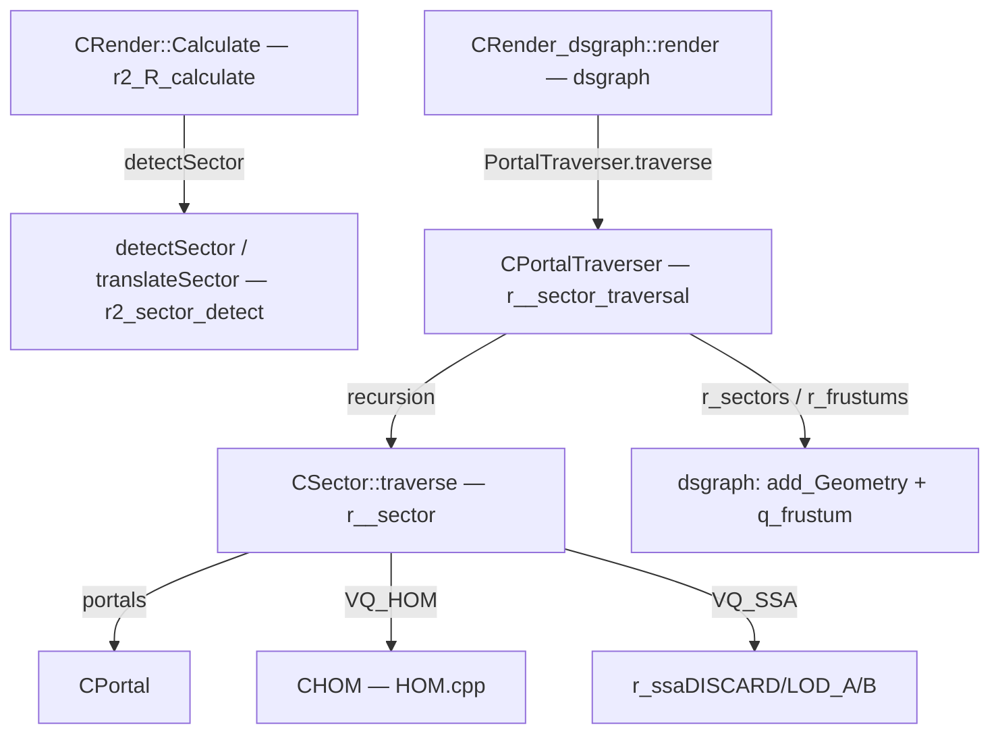

# Renderer: пайплайн — секторы и traversal

## 1. Ответственность

Статический портальный пайплайн R4: модель «сектор + портал» (`CSector`/`CPortal`), рекурсивный traversal по порталам с culling'ом (frustum, SSA, scissor, HOM) и определение сектора камеры. Не рендерит сам — только собирает список видимых секторов и их frustum'ов/scissor'ов, с которыми дальше работает [dsgraph](dsgraph.md).

Историческое ядро (D3D9-эпоха, `xrRender/`), переиспользуемое в R4.

## 2. Место в архитектуре

См. [Архитектура](../../architecture/overview.md), [Зависимости](../../architecture/dependencies.md), [Точка входа и фабрика](factory.md).

- Модель «сектор/портал» загружается из level-данных (`CSector::load` — чанки `fsP_Portals`/`fsP_Root`) и живёт в `CRender::Sectors`/`Portals`.
- `PortalTraverser` — глобальный трейсер, вызывается из `CRender_dsgraph::render` (R4, [dsgraph](dsgraph.md)) и из `FStaticRender` (R1 — не активен).
- Определение сектора камеры (`detectSector`) — из `CRender::Calculate` (исторический `r2_R_calculate.cpp`, переиспользуемый в R4).



## 3. Публичный API

| Класс/функция | Назначение |
|---|---|
| `CSector` (`IRender_Sector`) | Сектор: `root()` (dxRender_Visual всей геометрии), `traverse(CFrustum&, _scissor&)`, `load(IReader&)`; `r_frustums`/`r_scissors`/`r_scissor_merged`/`r_marker` |
| `CPortal` (`IRender_Portal`) | Портал: `Setup(V, vcnt, face, back)`, `getPoly()`, `Front()/Back()/getSector(from)/getSectorFacing(V)/getSectorBack(V)`, `distance(V)`, `P` (плоскость), `S` (сфера), `bDualRender` |
| `_scissor` | `Fbox2` + `depth` (viewport-прямоугольник секции в 0..1) |
| `CPortalTraverser` (глобал `PortalTraverser`) | `traverse(start, F, vBase, mXFORM, options)`, `fade_portal(p, ssa)`, `fade_render()`, `initialize()/destroy()` (fade-шейдер); флаги `VQ_HOM/VQ_SSA/VQ_SCISSOR/VQ_FADE` |
| `CRender::detectSector(P)` / `detectSector(P, dir)` | Определение сектора по позиции (ray-запрос в порталы + статику) |
| `CRender::translateSector(IRender_Sector*)` | Идентификатор сектора в `Sectors` (для `OnSectorChanged`) |
| `r_pixel_calculator` | **D3D9-only** (не компилируется в R4): расчёт SSA-карты визуала |
| `QueryHelper` | `CreateQuery/GetData/BeginQuery/EndQuery` (обёртки DX11/10/9) |

## 4. Внутреннее устройство

### `CPortal` (`src/Layers/xrRender/r__sector.h/.cpp`)

Поля: `svector<Fvector,8> poly` (полигон портала, ≤8 вершин), `CSector* pFace/pBack`, `Fplane P` (плоскость), `Fsphere S`, `u32 marker` (маркер кадра traversal), `BOOL bDualRender` (двусторонний рендер, форсится при близости камеры).

`Setup(V, vcnt, face, back)`:
1. Сфера из bounding box полигона → `S.P`, `S.R`.
2. `poly.assign(V, vcnt)`, `marker = 0xffffffff`.
3. Нормаль: усреднение нормалей триангуляций `(poly[0], poly[i-1], poly[i])` для `i=2..vcnt-1` (`mknormal_non_normalized` + normalize); `_cnt == 0` → `R_ASSERT2("Invalid portal detected")`. `P.build(poly[0], N)`.

`getSectorFacing(V)` — сектор, «смотрящий» на `V` (`P.classify(V) > 0` → face); `getSectorBack(V)` — противоположный. `distance(V)` = `|P.classify(V)|`.

DEBUG: `OnRender` (`rsOcclusionDraw`) — рисует портал (fan + wire) через `m_SelectionShader`/`m_WireShader` с `rmNear()` (viewport zmin=0.02).

### `CSector` (`r__sector.cpp`)

Поля: `dxRender_Visual* m_root`, `xr_vector<CPortal*> m_portals`, `xr_vector<CFrustum> r_frustums`, `xr_vector<_scissor> r_scissors`, `_scissor r_scissor_merged`, `u32 r_marker`.

**`traverse(CFrustum& F, _scissor& R_scissor)`** — рекурсивный обход:

1. **Регистрация**: если `r_marker != PortalTraverser.i_marker` — новый сектор для этого кадра: `r_marker = i_marker`, `push_back(this)` в `PortalTraverser.r_sectors`, `r_frustums/r_scissors.clear()`. Затем `r_frustums.push_back(F)`, `r_scissors.push_back(R_scissor)`.
2. **По каждому порталу** `m_portals[I]`:
   - `marker == i_marker` → уже посещён, skip.
   - Выбор целевого сектора: `bDualRender` → `getSector(this)` (противоположный текущему); иначе → `getSectorBack(i_vBase)`, и skip, если `pSector == this` или `== i_start`.
   - **Early-out сфера**: `!F.testSphere_dirty(PORTAL->S.P, PORTAL->S.R)` → skip.
   - **SSA** (`VQ_SSA`): `ssa = R²/d² · |P.n·dir|`; `ssa < r_ssaDISCARD` → skip. При `VQ_FADE`: `ssa < r_ssaLOD_A` → `fade_portal(PORTAL, ssa)`; `ssa < r_ssaLOD_B` → skip (не рекурсируем, рисуем fade-заглушку).
   - **Frustum clip**: `S.assign(poly)`, `F.ClipPoly(S, D)` → `0 == P` → skip.
   - **Scissor + HOM** (`VQ_SCISSOR && !bDualRender`): проекция вершин клипнутого полигона через `i_mXFORM_01` (combined × viewport-матрица) → `bb` (min/max x/y) + `depth` (min z):
     - `depth < EPS` (портал пересекает near-плоскость) → `scissor = R_scissor` + HOM-test медленным алгоритмом `HOM.visible(*P)` (3D-полигон).
     - иначе → пересечение `bb` с `R_scissor` (scissor = max(min)/min(max) по осям, `depth` сохраняется); пустой box → skip; HOM-test быстрым алгоритмом `HOM.visible(scissor, depth)` (2D-прямоугольник).
   - Иначе (без `VQ_SCISSOR`): `scissor = R_scissor` + HOM-test медленный.
   - **Рекурсия**: `Clip.CreateFromPortal(P, PORTAL->P.n, i_vBase, i_mXFORM)` — новый frustum, обрезанный полигоном портала; `PORTAL->marker = i_marker`, `bDualRender = FALSE` (сбрасывается после первого обхода); `pSector->traverse(Clip, scissor)`.

**`load(IReader& fs)`**: чанк `fsP_Portals` — список `u16` ID порталов (`getPortal(ID)`); чанк `fsP_Root` (`size == 4`) — `u32` ID визуала → `m_root` (`getVisual`). Для `g_dedicated_server` — `m_root = 0`.

### `CPortalTraverser` (`src/Layers/xrRender/r__sector_traversal.cpp`)

Глобал `PortalTraverser` (`i_marker` init `0xffffffff`).

**`traverse(start, F, vBase, mXFORM, options)`**:
1. Строит `m_viewport_01` (NDC → 0..1: `x' = 0.5x+0.5`, `y' = -0.5y+0.5`, z pass-through) и `i_mXFORM_01 = m_viewport_01 * mXFORM`.
2. `VQ_FADE` → `f_portals.clear()` + `reserve(16)`.
3. `i_marker++`, сохраняет `i_options/i_vBase/i_mXFORM`, `r_sectors.clear()`.
4. `i_start->traverse(F, scissor(0,0,1,1, depth=0))`.
5. `VQ_SCISSOR` → для каждого `r_sectors[s]`: `r_scissor_merged` = merge всех `r_scissors[it]` (min depth).

**`fade_render()`** (fade-заглушки порталов вместо рекурсии):
1. `f_portals` сортируется back-to-front (`psort_pred` — по `distance_to_sqr` от `i_vBase`, descending).
2. Вершины: для каждого портала `poly.size()-2` треугольника (fan из `poly[0]`); один `FVF::L`-вертекс на вершину (позиция + `alpha`-цвет).
3. `alpha` портала: `ssaScale = (ssa - r_ssaLOD_B) / (r_ssaLOD_A - r_ssaLOD_B)`, `iA = (1 - ssaScale) * 255` (clamp 0..255); цвет = ambient (`Environment().CurrentEnv->ambient`) с этим альфой.
4. `RCache`: world=identity, `set_Shader(f_shader)` ("portal"), `set_Geometry(f_geom)`, `CULL_NONE`, `Render(TRIANGLELIST)`, restore `CULL_CCW`. `f_portals.clear()`.

`initialize()/destroy()` — создание/уничтожение `f_shader` ("portal") и `f_geom` (FVF::L в `RCache.Vertex`). В R4 вызываются из `FStaticRender` (R1, не активен) — в R4-пайплайне fade-путь не используется (`traverse(..., 0)` — options 0).

### `CRender::Calculate` — часть секторов (`src/Layers/xrRenderPC_R4/r2_R_calculate.cpp`, историческое ядро в R4)

До traversal'а в каждом кадре:

1. **SSA-пороги**: `g_fSCREEN = W*H * (90/FOV)² * (EPS_S + ps_r__LOD)`; `r_ssaDISCARD = ps_r__ssaDISCARD²/g_fSCREEN`, `r_ssaDONTSORT`, `r_ssaLOD_A = ps_r2_ssaLOD_A²/(3·g_fSCREEN)`, `r_ssaLOD_B = ps_r2_ssaLOD_B²/(3·g_fSCREEN)`, `r_ssaGLOD_start/end`, `r_ssaHZBvsTEX`, `r_dtex_range`.
2. **Сектор камеры**: при смещении камеры (`!vLastCameraPos.similar`) — `detectSector(Device.vCameraPosition)`; `pSector != pLastSector` → `g_pGamePersistent->OnSectorChanged(translateSector(pSector))` (Lua-хук смены сектора).
3. **DualRender-принудитель**: box-query в `rmPortals` с радиусом `eps = VIEWPORT_NEAR + EPS_L` вокруг камеры → для всех попавшихся порталов `bDualRender = TRUE` (порталы, в которые камера «залипает», рендерятся с обеих сторон).
4. `Lights.Update()` + сбор светов в радиусе камеры (`q_sphere` `STYPE_LIGHTSOURCE`).

### `detectSector` / `translateSector` (`src/Layers/xrRenderPC_R4/r2_sector_detect.cpp`)

**`translateSector(IRender_Sector*)`** — линейный поиск в `Sectors` → индекс; не найден → `FATAL("Sector was not found!")`.

**`detectSector(P)`** — ray вниз `(0,-1,0)` из `P`, при miss — вверх `(0,1,0)`; `OPT_ONLYNEAREST`, range 500.

**`detectSector(P, dir)`** — два ray-модели:
1. **Порталы**: `Sectors_xrc.ray_query(rmPortals, P, dir, range1=500)` → `id1/range1` (tri из `rmPortals`, `dummy` = индекс портала).
2. **Статика**: `Sectors_xrc.ray_query(ObjectSpace.GetStaticModel(), P, dir, range2)` → `id2/range2`.
3. Выбор: ближайший (`range1 <= range2 + EPS` → порталы). Портал → `Portals[tri->dummy]->getSectorFacing(P)`; статика → `getSector(tri->sector)`.

`Sectors_xrc` — `xrXRC` (ray/box-query контейнер), `rmPortals` — `CDB::MODEL*` (треугольники порталов).

### `CHOM` / `occRasterizer` — HOM-culling (используется `VQ_HOM`)

`CHOM` (`HOM.h/.cpp`): «home-oriented» occlusion — оффскрин-рендер сцены в мип-пирамиду (64×64, 4 уровня), с которой делаются 2D/3D-видимость-тесты:
- `visible(vis_data&)`, `visible(Fbox3&)`, `visible(sPoly&)` — медленный 3D-алгоритм (полигон/box → projection → rasterize).
- `visible(Fbox2& B, float depth)` — быстрый 2D-алгоритм (прямоугольник в viewport-пространстве 0..1 + глубина).
- `MT_RENDER()`/`MT_SYNC()` — параллельный поток (рендер HOM-буфера асинхронно; `MT_SYNC` — перед использованием; skip в main menu).
- `occlude(Fbox2&)` — **пустая заглушка**.

`occRasterizer` (`occRasterizer.h/.cpp`, `occRasterizer_core.cpp`): CPU-rasterizer для HOM-пирамиды — `occTri` (треугольники с `adjacent[3]`), квантование глубины `occQ_s32/s16` ([-2..2] в s32/s16), `rasterize`/`test` (Hiz-style: 4 уровня 64/32/16/8), `propagade` (mip-пропагация). Глобал `Raster`.

### `r_pixel_calculator` (`r__pixel_calculator.cpp`) — **D3D9-only, в R4 не компилируется**

`#if !defined(USE_DX10) && !defined(USE_DX11)`: оффскрин-рендер визуала в 6 кубических направлений (`cmNorm`/`cmDir`), occlusion query на каждый face → `r_aabb_ssa` (6 × `u8` SSA-значений). В R4 мёртв.

### `QueryHelper` (`QueryHelper.h`)

Инлайн-обёртки GPU-запросов (используются `R_occlusion` — [occlusion](occlusion.md)):
- DX11: `HW.pDevice->CreateQuery(&desc, ppQuery)`, `HW.pContext->GetData(pQuery, pData, DataSize, 0)`, `Begin/End` через `HW.pContext->Begin/End`.
- DX10: то же через `pQuery->Begin/End/GetData` (context-less).
- DX9: `Issue(D3DISSUE_BEGIN/END)`, `GetData(D3DGETDATA_FLUSH)`.
- Только `D3DQUERYTYPE_OCCLUSION` → `D3D_QUERY_OCCLUSION` (иначе `VERIFY(!"No default.")`).

## 5. Взаимодействие

- **Вызывает**: `CHOM::visible` (VQ_HOM), `RCache` (fade-рендер), `Environment().CurrentEnv->ambient` (fade-цвет), `CDB::MODEL` (`rmPortals`), `ObjectSpace.GetStaticModel()` (detectSector), `xrXRC` (`Sectors_xrc`), `CGamePersistent::OnSectorChanged`.
- **Вызывается из**: `CRender::Calculate` (r2_R_calculate — detectSector, SSA-пороги, dual-render), `CRender_dsgraph::render` (r__dsgraph_render — `PortalTraverser.traverse(..., 0)` + `r_sectors` → `add_Geometry`), `FStaticRender` (R1, не активен), `CSector::load` ← `CRender::level_Load`.

## 6. Потоки данных/управления

```mermaid
sequenceDiagram
    participant Calc as CRender::Calculate
    participant Det as detectSector (r2_sector_detect)
    participant R as CRender_dsgraph::render
    participant Trv as PortalTraverser
    participant Sec as CSector::traverse
    participant HOM as CHOM
    participant DSG as dsgraph (add_Geometry)
    Calc->>Det: detectSector(vCameraPosition)
    Det-->>Calc: pLastSector (+ OnSectorChanged)
    Calc->>Calc: box_query rmPortals → bDualRender
    R->>Trv: traverse(_sector, frustum, cop, mCombined, 0)
    loop пока не все порталы посещены
        Trv->>Sec: recurse (Clip frustum, scissor)
        Sec->>Sec: testSphere → SSA → ClipPoly → scissor∩HOM
        Sec->>HOM: visible(sPoly / Fbox2+depth)
        HOM-->>Sec: visible?
        Sec->>Sec: PORTAL->marker = i_marker; recurse
    end
    Trv-->>R: r_sectors[] + r_frustums[] per sector
    R->>DSG: per sector/frustum: set_Frustum + add_Geometry(root)
    R->>DSG: q_frustum(STYPE_RENDERABLE) → renderable_Render (динамические, только в видимых секторах)
```

## 7. Конфигурация

- `ps_r__ssaDISCARD`, `ps_r2_ssaLOD_A`, `ps_r2_ssaLOD_B` — SSA-пороги (пересчитываются в `Calculate` → `r_ssa*`).
- `ps_r2_df_parallax_range` — `r_dtex_range`.
- `ps_r__GLOD_ssa_start/end`, `ps_r__ssaHZBvsTEX` — LOD-пороги.
- `rsOcclusionDraw` — DEBUG-отрисовка порталов.
- `ps_r2_wait_sleep` — sleep-интервал в `R_occlusion::occq_get` (см. [occlusion](occlusion.md)).

## 8. Известные ограничения/дебаг

- `CPortalTraverser::fade_render`/`initialize`/`destroy` — в R4 **не используются** (`traverse` вызывается с `options = 0`); fade-путь жив только в R1 (`FStaticRender`).
- `CSector::traverse` — рекурсивный без явного ограничения глубины (законченность — по `marker` порталов).
- `detectSector` — `FATAL` при неудачном `translateSector`; ray-запрос с range 500 — магическое число.
- `rmPortals`/`Sectors_xrc` — модель порталов как `CDB::MODEL` (tri с `dummy`-индексом портала) — legacy-репрезентация.
- `r_pixel_calculator` — D3D9-only, в R4 не компилируется (не описывать как активный).
- `CHOM::occlude` — пустая заглушка.
- DEBUG: `CPortal::OnRender` (порталы), `CPortalTraverser::dbg_draw` (scissor-прямоугольники), `CHOM::stats` (счётчики `tris_in_frame_visible`).
