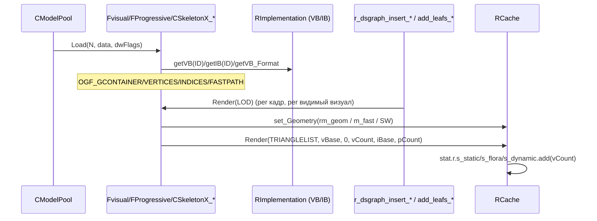

# Renderer: визуалы

## 1. Ответственность

Деревья рендеримой геометрии: базовый `dxRender_Visual` (OGF-загрузка, shader/texture, vis-data), конкретные типы геометрии — статика/прогрессивный LOD/скиннинг/деревья/LOD-импостеры — и утилиты оптимизации индексов (stripify, vertex cache). Не управляет видимостью (это [dsgraph](dsgraph.md) / [sector](sector.md)) и не считает кости (это [Скелеты и анимация](kinematics.md)) — только «что лежит в вершинном/индексном буфере и как это нарисовать одним `RCache.Render`».

Историческое ядро (`xrRender/`), переиспользуемое в R4.

## 2. Место в архитектуре

См. [Архитектура](../../architecture/overview.md), [Зависимости](../../architecture/dependencies.md), [dsgraph](dsgraph.md).

- `dxRender_Visual` — реализация `IRenderVisual` (xrEngine, [render.md](../xr-engine/render.md)); создаётся через `CModelPool` / `::Render->model_Create*` ([Ресурсы и модели](resources.md)).
- Вставка в state-sorting иерархию — `r_dsgraph_insert_*` ([dsgraph](dsgraph.md)); выбор, _что_ видно — traversal/occlusion.
- Скinned-визуалы (`CSkeletonX_ST/PM`) — связка с `CKinematics` (кости, `mRenderTransform`) — [Скелеты и анимация](kinematics.md).

```mermaid
graph TD
    MP[CModelPool / model_CreateChild] --> Base[dxRender_Visual: Load OGF header + shader/texture]
    Base --> FV[Fvisual: verts/indices/IB, m_fast]
    Base --> FH[FHierrarhyVisual: children]
    FV --> FP[FProgressive: FSlideWindow]
    FV --> FS[CSkeletonX_ST/PM: skinning 1W..4W]
    FV --> FT[FTreeVisual_ST/PM: wind/wave consts]
    FH --> LOD[FLOD: 8-гранной импостер]
    FV -.PHASE_SMAP.-> FAST[m_fast fast-vertices]
    SUB[r_dsgraph_insert_* / add_leafs_*] -->|Render(LOD)| FV
    STRIP[xrStripify / VertexCache] -.load-time.-> FV
```

## 3. Публичный API

| Класс/функция                                       | Назначение                                                                                                                                                                                               |
| --------------------------------------------------- | -------------------------------------------------------------------------------------------------------------------------------------------------------------------------------------------------------- |
| `dxRender_Visual`                                   | База: `Load/Release/Copy/Spawn/Depart`, `SetShaderTexture`/`ResetShaderTexture`, `getVisData`/`getType`, `GetTexture`, `MarkAsHot`/`MarkAsGlowing`, поля `Type`/`vis`/`shader`/`skinning`/`hud`, `dbg_*` |
| `IRender_Mesh`                                      | Миксин: `rm_geom` + `p_rm_Vertices`/`vBase`/`vCount` + `p_rm_Indices`/`iBase`/`iCount`/`dwPrimitives`                                                                                                    |
| `Fvisual`                                           | `IRender_Mesh` + `m_fast` (fast-vertices); `Load` (OGF_GCONTAINER/VERTICES/INDICES/FASTPATH), `Render`                                                                                                   |
| `FHierrarhyVisual`                                  | `children`/`children_invisible`, `bDontDelete`; `Load` (OGF_CHILDREN_L/OGF_CHILDREN), `get_children*`, `MarkAsHot` (рекурсивно)                                                                          |
| `FProgressive`                                      | `Fvisual` + `nSWI`/`xSWI` (`FSlideWindowItem`), `last_lod`; прогрессивный LOD по `LOD`                                                                                                                   |
| `CSkeletonX_ST` / `CSkeletonX_PM`                   | `Fvisual`/`FProgressive` + `CSkeletonX_ext` + `CSkeletonX`: `AfterLoad`, `EnumBoneVertices`, `PickBone`, `FillVertices`, `Render` (skin 1W..4W/soft/single)                                              |
| `FTreeVisual` / `FTreeVisual_ST` / `FTreeVisual_PM` | `dxRender_Visual` + `IRender_Mesh`: wind/wave/hemi-sun константы; ST — статичный, PM — slide-window LOD                                                                                                  |
| `FLOD`                                              | `FHierrarhyVisual` + `facets[8]`, `geom`, `lod_factor`; LOD-импостер (рендер в [dsgraph](dsgraph.md))                                                                                                    |
| `xrStripify` / `xrSimulate`                         | Периодизация индексов под vertex cache (load-time); `xrSimulate` — оценка misses                                                                                                                         |

## 4. Внутреннее устройство

### `dxRender_Visual` — база (`FBasicVisual.h/.cpp`)

- Поля: `Type` (`MT_*` из [Fmesh](../xr-engine/fmesh.md)), `vis` (`vis_data`), `ref_shader shader`, `skinning` (s32, из `::Render->m_skinning`), `hud` (bool, из `::Render->hud_loading`), `dbg_*` (имя/shader/texture + `_def`-копии), `flags` (`IRenderVisualFlags`).
- `Load(N, data, dwFlags)`: читает `OGF_HEADER` (`xrOGF_FormatVersion`, `Type`, `shader = getShader(hdr.shader_id)`, `vis.box/sphere` из `hdr.bb/bs`); `OGF_TEXTURE` → `dbg_shader_def`/`dbg_texture_def` + `ResetShaderTexture()`; `_EDITOR`: `OGF_S_DESC` → `desc.Load`.
- `SetShaderTexture(s_shader, s_texture)`: копирует shader-name; подстрока `$no_shadows` → `flags.eNoShadow` + обрезка имени; создаёт `shader.create(*dbg_shader, *dbg_texture)` с сохранённым `hud_loading`.
- `ResetShaderTexture()`: если текущий `dbg_shader/texture` ≠ `_def` → `SetShaderTexture(def)`.
- `GetTexture()` (fork-DSR): `shader.E[0].passes[0].T[0]` (первая текстура первого пасса первого элемента).
- `MarkAsHot`/`MarkAsGlowing` (fork-DSR): `texture->m_is_hot` / `m_is_glowing` (HeatVision / SilencerOverheat).
- `Copy(pFrom)`: копирует `Type/shader/vis/flags/dbg_*/skinning/hud` (через `PCOPY`).

### `Fvisual` — базовая геометрия (`FVisual.cpp`)

- `Load` (наследует `dxRender_Visual::Load`):
  - `OGF_GCONTAINER`: `ID/vBase/vCount` → `RImplementation.getVB(ID)` + `getVB_Format`; `ID/iBase/iCount` → `getIB`; `dwPrimitives = iCount/3`.
  - `OGF_FASTPATH` (R2/R3/R4): `m_fast = new IRender_Mesh` — отдельные fast-vertices/indices (`getVB(ID, true)`/`getIB(ID, true)`) + `rm_geom`.
  - Если `!loaded_v && !(dwFlags & VLOAD_NOVERTICES)`:
    - `OGF_VCONTAINER` → `R_ASSERT2(0, "pls notify andy about this.")` (legacy-путь, контейнер вершин).
    - иначе `OGF_VERTICES`: `fvf` + `D3DXDeclaratorFromFVF`; `vStride = D3DXGetFVFVertexSize`; **DX10/11**: `dx10BufferUtils::CreateVertexBuffer` (managed→default, CPU-копия в reader); **DX9**: `CreateVertexBuffer(MANAGED)` + `Lock/CopyMemory`.
  - Индексы: `OGF_ICONTAINER` → assert; иначе `OGF_INDICES`: `dx10BufferUtils::CreateIndexBuffer` (DX10/11) / `CreateIndexBuffer(16-bit, MANAGED)` (DX9).
  - `VLOAD_NOVERTICES` → return без `rm_geom` (используется скinned-путь: вершины загружаются отдельно `_Load_hw`).
  - иначе → `rm_geom.create(vFormat, p_rm_Vertices, p_rm_Indices)`.
- `Render(LOD)`:
  - R2/R3/R4: `m_fast && phase == PHASE_SMAP && !RCache.is_TessEnabled()` → `m_fast->rm_geom` (fast-vertices для теней); иначе → `rm_geom`. `RCache.stat.r.s_static.add(vCount)`.
- `~Fvisual`: `HW.stats_manager.decrement_stats_vb/ib` (учёт VRAM, см. [Устройство рендера](render-device.md)).

### `FHierrarhyVisual` — контейнер children (`FHierrarhyVisual.cpp`)

- `Load`:
  - `OGF_CHILDREN_L` (from link): `cnt` × `ID` → `::Render->getVisual(ID)` + `setID(i+1)`; `bDontDelete = TRUE`.
  - `OGF_CHILDREN` (from stream): `OBJ = open_chunk(OGF_CHILDREN)`; `O = OBJ->open_chunk(0)`; цикл `count = 1..`: имя = `<N>:<count>`, `::Render->model_CreateChild(name_load, O)`; `bDontDelete = FALSE`.
  - иначе → `FATAL("Invalid visual")`.
- Деструктор: если `!bDontDelete` → `::Render->model_Delete(children[i])`.
- `Release`: если `!bDontDelete` → `Release()` каждого child.
- `MarkAsHot` (fork-DSR): рекурсивно в `children` + `children_invisible`.

### `FProgressive` — прогрессивный LOD (`FProgressive.cpp`)

- `Load`: `OGF_SWIDATA` → `nSWI` (reserved[4], `count`, `sw = FSlideWindow[count]`); если `m_fast` (R≠R1) → `OGF_FASTPATH/OGF_SWIDATA` → `xSWI`.
- `Render(LOD)`:
  - R≠R1, `m_fast && phase == PHASE_SMAP`: `lod_id = floor((1-LOD)*(xSWI->count-1)+0.5)` → `m_fast->rm_geom` + `xSWI->sw[lod_id]` (num_verts/offset/num_tris).
  - иначе: `lod_id = last_lod` (если `LOD < 0` — ignore, кэш); иначе `floor((1-LOD)*(nSWI.count-1)+0.5)` → `nSWI.sw[lod_id]`. `RCache.stat.r.s_static.add(SW.num_verts)`.
- `Release`: `xr_free(nSWI.sw)` + `xr_free(xSWI->sw)` + `xr_delete(xSWI)`.

### `FTreeVisual` — деревья/трава (`FTreeVisual.cpp`)

- `Load`: `OGF_GCONTAINER` (verts/indices как `Fvisual`, без fast-path); `OGF_TREEDEF2` → `xform` (локальный), `c_scale`/`c_bias` (`_5color {rgb, hemi, sun}`) — каждый компонент × 0.5; `rm_geom.create`.
- Shader-константы (глобал-`shared_str`): `m_xform`/`m_xform_v`, `consts`, `wave`, `wind`, `c_bias`/`c_scale`/`c_sun`, `prev_wave`/`prev_wind`, `benders_prevpos`/`benders_pos`/`benders_setup`.
- `FTreeVisual_setup` (static, once-per-frame): `tm_rot = 2π·fTimeGlobal/ps_r__Tree_w_rot`; `wind = normalize((sin,0,cos,0))·amp` (amp: `TREE_WIND_EFFECT` → `E.m_fTreeAmplitudeIntensity`, иначе `ps_r__Tree_w_amp`); `scale = 1/FTreeVisual_quant`; `wave = ps_r__Tree_Wave/2π` + `fTimeGlobal·ps_r__Tree_w_speed`.
- `Render(LOD)` (база, не рисует):
  - `tvs.dwFrame != Device.dwFrame` → `prev_tvs = tvs; tvs.calculate()`.
  - R≠R1: `xform_v = view * xform` → `RCache.tree.set_m_xform_v`.
  - `s = ps_r__Tree_SBC`; R≠R1: `s *= 1.3333`.
  - `RCache.tree.set_m_xform/set_consts/set_wave/set_wind`; `set_c(prev_wave, prev_tvs.wave)`, `set_c(prev_wind, prev_tvs.wind)`.
  - `set_c_scale(s·c_scale)`, `set_c_bias(s·c_bias)` (R1: + `desc.ambient`); `set_c_sun(s·c_scale.sun, s·c_bias.sun, 0, 0)`.
  - **R3/R4**: `ps_ssfx_grass_interactive.y > 0` → interactive grass: `BendersQty = min(16, y+1)`; `c_grass[0]` = player (если `x>0`, `w=-1`) / `c_grass[16]` = sentinel `(0,-99,0,1)`; `Bend 1..Qty-1`: `GData.pos/radius_curr` (pos) + `GData.dir/str` (dir); `prev_benders` из `GData.prev_pos/prev_dir`.
- `FTreeVisual_ST::Render`: `inherited::Render` (константы) + `RCache.Render(TRIANGLELIST, vBase, 0, vCount, iBase, dwPrimitives)`; `stat.r.s_flora.add(vCount)`.
- `FTreeVisual_PM`: `OGF_SWICONTAINER` → `pSWI = getSWI(ID)`; `Render`: `inherited` + slide-window LOD (как `FProgressive`, но `pSWI`), `stat.r.s_flora`.

### `FLOD` — LOD-импостер (`FLOD.cpp`)

- `Load` (наследует `FHierrarhyVisual::Load`): `OGF_LODDEF2` → 8 × `_face {v[4] {v,t,c_rgb_hemi,c_sun}, N}`; норма́ль грани = среднее 4 `mknormal`-нормалей квадро (инвертирована); `geom.create(dwDecl, RCache.Vertex.Buffer(), RCache.QuadIB)` (9-компонентный `dwDecl`: pos×2, normal×2, color, uv×2, rgbh×2 — для импостер-вершин).
- `lod_factor`: `Sf = 4·(0.5·r²·asin(a/r) + a·√(r²-a²))` (сфера-кап), `Ss = π·r²`, `lod_factor = Sf/Ss` (коррекция SSA для импостера).
- `Render(LOD)` — **закомментирован** (legacy R1); активный рендер — `r_dsgraph_render_lods` ([dsgraph](dsgraph.md)).

### `CSkeletonX_ST` / `CSkeletonX_PM` — скиннинг (`FSkinned.cpp` + [SkeletonX](kinematics.md))

- `CSkeletonX_ext` — shared-код для наследников `CSkeletonX`: `_Load_hw`, `_CollectBoneFaces`, `_EnumBoneVertices`, `_FillVerticesHW1W..4W` (wallmarks), `_PickBoneHW1W..4W`.
- `CSkeletonX_ST : Fvisual, CSkeletonX_ext`; `CSkeletonX_PM : FProgressive, CSkeletonX_ext`.
- `Load`:
  1. `_Load(N, data, vCount)` (в `CSkeletonX`): `OGF_VERTICES` → `hw_bones_cnt = (HW.Caps.geometry.dwRegisters - 22 - 3)/3` (лимит костяных констант); выбор `RenderMode` (RM_SKINNING_SOFT/1B/2B/3B/4B/RM_SINGLE) по весам; `bids` — используемые кости; `sbones_array`/`sbones_array_prev` (shared_str для `set_ca`).
  2. `inherited::Load(N, data, dwFlags | VLOAD_NOVERTICES)` — геометрия без вершин.
  3. `::Render->shader_option_skinning(-1)`.
  4. **DX10/11**: `_DuplicateIndices(N, data)` — копия IB (DX10 не читает IB на CPU); `VERIFY(!OGF_ICONTAINER)`.
  5. `vBase = 0`; `_Load_hw(*this, _verts_)`.
- `_Load_hw` (DX10/11): CRC-дедуп `vertBoned1W..4W` → `vertHW_1W..4W` (pack(1): `q_P`/`q_N`/`q_tc` — квантование позиции `-12..+12` (s16), нормали `-1..+1` (u8), tangent `-1..+1` (u8); bone-index в alpha-канале `color_rgba(q_N(N), u8(index))`; `get_bone = color_get_A(_N_I)/3`). `dx10BufferUtils::CreateVertexBuffer`.
- `_Render(hGeom, vCount, iOffset, pCount)` (в `CSkeletonX`):
  - **DX11 motion-vectors** (`o.ssfx_motionvectors`): save `Matrix_Prev`/`mRenderTransform_prev`, `set_c("m_wvp_prev", p_WVP)`.
  - `RM_SKINNING_SOFT`: `_Render_soft` — CPU skinning через `PSGP.skin1W..4W` (ring-buffer `_VertexStream`, cache по `DiscardID`), `stat.r.s_dynamic_sw`.
  - `RM_SINGLE`: `W = m_w · bone[RMS_boneid]` → `set_xform_world(W)` + `Render`, `stat.r.s_dynamic_inst`.
  - `RM_SKINNING_1B..4B`: `set_ca(s_bones_array, id, M)` per bone (4×3 колонки), DX11: + `s_bones_array_prev`; `Render`, `stat.r.s_dynamic_1B..4B`.
- `PickBone`/`EnumBoneVertices`/`FillVertices` — делегаты в `CSkeletonX_ext` (wallmarks, bone-pick — [Скелеты и анимация](kinematics.md)).

### `xrStripify` / `xrSimulate` (`xrStripify.cpp`)

- `xrSimulate(indices, cacheSize)`: `VertexCache C(cacheSize)`; per index: `!C.InCache(id)` → `count++; C.AddEntry(id)`; return misses (оценка VRAM-трафика).
- `xrStripify(indices, perturb, cacheSize, minStripLength)`:
  - `SetCacheSize(cacheSize)`, `SetMinStripSize(minStripLength)`, `SetListsOnly(true)`.
  - `GenerateStrips(indices)` → 1 × `PT_LIST` (оптимизированный список индексов под cache).
  - `RemapIndices(PGROUP, numVerts)` → `xPGROUP` (remap для spatial locality).
  - `perturb[newIndex] = oldIndex` (таблица перестановки); `indices = xPGROUP[0].indices`.
  - **Load-time** (не runtime): используется при упаковке моделей для оптимизации index-buffer под vertex cache.

### `NvTriStrip` / `VertexCache` (`NvTriStrip.cpp`, `NvTriStripObjects.cpp`, `VertexCache.cpp`)

- `NvStripifier` — NVIDIA-style stripifier: `BuildStripifyInfo` (face/edge-граф), `FindStartPoint`, `FindGoodResetPoint`, `CreateStrips` (CW/CCW traversal, `GetUniqueVertexInB`/`GetSharedVertex`), `FindAllStrips` (эвристики: `avgStripSizeWeight`/`numTrisWeight`), `SplitUpStripsAndOptimize` (split по cache, `CalcNumHitsStrip`/`CalcNumHitsFace`, `VertexCache`-симуляция), `RemoveSmallStrips` (короткие → list).
- API: `SetCacheSize` (16/24 — GeForce1/2/3), `SetStitchStrips` (degenerate-стitches), `SetMinStripSize`, `SetListsOnly`, `GenerateStrips` → `PrimitiveGroup {type, numIndices, indices}`, `RemapIndices`.
- `VertexCache`: ring `entries[size]` (init -1); `InCache` (linear scan), `AddEntry` (shift right, new at 0, return removed), `Clear`, `At`/`Set`, `Copy`.

## 5. Взаимодействие

- **Вызывает**: `RImplementation.getVB/IB/Format/SWI` ([Ресурсы и модели](resources.md)), `RCache.set_Geometry/Render/set_c/set_ca/set_xform_world/tree.*` ([Шейдерные константы](constants.md)), `HW.stats_manager.increment/decrement_stats_vb/ib` ([Устройство рендера](render-device.md)), `::Render->model_CreateChild/model_Delete/getVisual` ([Ресурсы и модели](resources.md)), `PSGP.skin1W..4W` ([Цикл кадра](../xr-engine/frame-loop.md)), `g_pGamePersistent->grass_shader_data`/`Environment()` ([Окружение](../xr-engine/environment.md)).
- **Вызывается из**: `r_dsgraph_insert_*`/`add_leafs_*` ([dsgraph](dsgraph.md)) — `Render(LOD)` per визуал; `CModelPool`/`model_Create*` (создание); `CSector::traverse`/`HOM.visible` (vis-data — [sector](sector.md)/[occlusion](occlusion.md)); `CKinematics::CalculateBones` (skinned — [Скелеты и анимация](kinematics.md)).
- Зависимости: `xrEngine/render.h` (`IRenderVisual`, `vis_data`), `xrEngine/fmesh.h` (`OGF_*` чанки, `FSlideWindow`), `xrEngine/igame_persistent.h`/`environment.h` (grass, wind), `xrRenderDX10/dx10BufferUtils.h` (VB/IB create).

## 6. Потоки данных/управления



## 7. Конфигурация

- `ps_r__Tree_w_rot`/`ps_r__Tree_w_amp`/`ps_r__Tree_w_speed`/`ps_r__Tree_Wave`/`ps_r__Tree_SBC` — параметры деревьев (wind/wave/scale).
- `ps_ssfx_grass_interactive` (x: player, y: count) / `ps_ssfx_int_grass_params_1` — interactive grass (R3/R4).
- `ps_r__common_flags` `RFLAG_NO_RAM_TEXTURES` — влияет на texture-load (не на визуалы напрямую).
- `VLOAD_NOVERTICES` (1<<0) — флаг `Load`: пропустить загрузку вершин (skinned-путь).
- `FTreeVisual_tile = 16`, `FTreeVisual_quant = 32768/16 = 2048` — квантование tree-вершин.
- `CACHESIZE_GEFORCE1_2 = 16`, `CACHESIZE_GEFORCE3 = 24` — дефолт vertex cache.

## 8. Известные ограничения/дебаг

- `Fvisual::Load` `OGF_VCONTAINER`/`OGF_ICONTAINER` → `R_ASSERT2(0, "pls notify andy about this.")` — legacy-контейнеры, не ожидаются в R4 (но assert не fatal в release).
- `Fvisual::Load` `OGF_FASTPATH` — только R2/R3/R4; `m_fast` используется **только** в `PHASE_SMAP` (fast-vertices для теней) и в `FProgressive::Render` SMAP-ветке.
- `FLOD::Render` — **закомментирован** (legacy R1); активный импостер-рендер — `r_dsgraph_render_lods` ([dsgraph](dsgraph.md)).
- `dxRender_Visual::GetTexture` — берёт **первую** текстуру **первого** пасса **первого** элемента (`E[0].passes[0].T[0]`); для multi-pass/multi-element — не полная карта текстур.
- `MarkAsHot`/`MarkAsGlowing` (fork-DSR) — `texture->m_is_hot/m_is_glowing` (DSR mod flags, см. [Шейдерные константы](constants.md)); `FHierrarhyVisual::MarkAsHot` рекурсивен, `FTreeVisual`/`Fvisual` — нет (только своя текстура).
- `FTreeVisual::Render` — `static FTreeVisual_setup tvs/prev_tvs` — **один** для всех деревьев (once-per-frame по `Device.dwFrame`); `prev_tvs` = значения **прошлого** кадра (для motion-vector-сглаживания ветра).
- `FTreeVisual` R3/R4 interactive grass: `BendersQty = min(16, ps_ssfx_grass_interactive.y + 1)`; `c_grass[16]` = sentinel `(0,-99,0,1)`; `GData` — 16 слотов ([Окружение](../xr-engine/environment.md)).
- `CSkeletonX::hw_bones_cnt = (HW.Caps.geometry.dwRegisters - 22 - 3)/3` — в DX11 caps **номинальные** (16 регистров, см. [Устройство рендера](render-device.md)) → `hw_bones_cnt = (16-25)/3` = **отрицательный** → `u16`-wrap (огромный) → фактически не ограничивает; skinning-лимит по костям в DX11 **не работает** как в DX9.
- `CSkeletonX::_Load_hw` (DX10/11) — `vertHW_1W..4W` pack(1): `q_P` (s16, `-12..+12`), `q_N` (u8, `-1..+1`), `q_tc` (s16, `-16..+16`); bone-index в alpha: `color_get_A(_N_I)/3` (÷3 — 8-бит на bone, 2 бита padding).
- `xrStripify`/`NvTriStrip` — **load-time** (упаковка моделей), не runtime; в R4 используются только для оптимизации index-buffer при экспорте/загрузке OGF.
- `VertexCache::InCache` — linear scan O(n) (n = cache size, 16/24) — не оптимизирован (load-time, не критично).
- `dxRender_Visual::hud` (bool) — `::Render->hud_loading` на момент `Load`; влияет на `shader.create` (HUD vs world shader).
- `FProgressive::last_lod` — кэш LOD-индекса: при `LOD < 0` (ignore) использует прошлый `last_lod` (без пересчёта) — экономия на скрытых визуалах.
- `FTreeVisual_PM::pSWI` — `RImplementation.getSWI(ID)` (shared slide-window, как VB/IB) — не аллоцируется per-визуал.
- DEBUG: `dbg_id`/`dbg_name`/`dbg_shader`/`dbg_texture` — для отладки (`CStats::Show`, `ObjectDump`); `setID(i+1)` per child в `FHierrarhyVisual::Load`.
- `Fvisual::Copy` — `PCOPY(p_rm_Vertices)` + `AddRef` (ref-counting на VB/IB); `m_fast` — **не** копируется (остается nullptr в копии) — потенциальный bug при дублировании fast-mesh.
