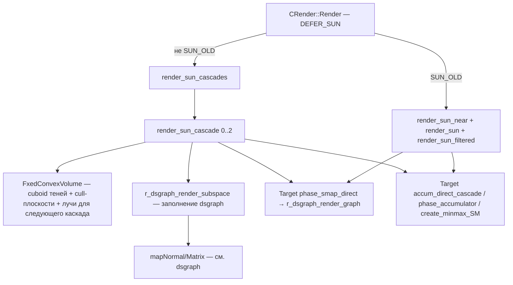
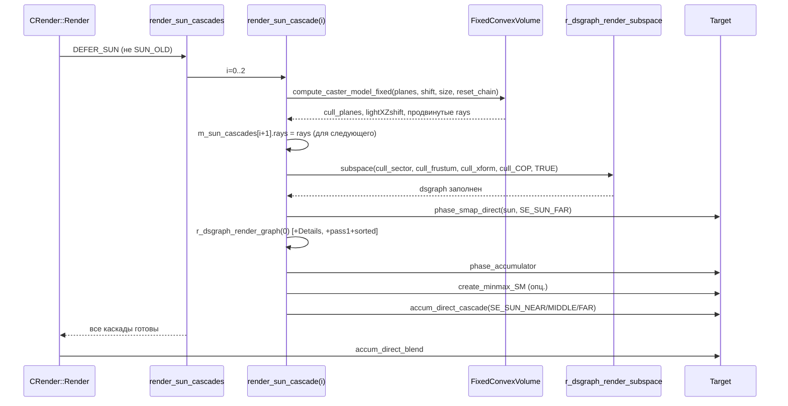

# Renderer: VSM / SMAP

## 1. Ответственность

Система теней от солнца (shadow-map / SMAP): построение ортogonal-проекции на бесконечный направленный свет, заполнение dsgraph-сцены теневиками и рендер SMAP в отдельную текстуру, накопление (accumulation) солнечного вклада в deferred-буферы. Активный путь — **cascade shadow maps** (3 каскада, `render_sun_cascades`); legacy-путь (near/far/filtered) — историческое ядро D3D9-эпохи, переиспользуемое в R4 и переключаемое флагом `R2FLAGEXT_SUN_OLD`.

Не считает освещение (это [R4: scene](r4-scene.md) и [Свет](lights.md)), не управляет RT-самостоятельно (фазы `phase_smap_direct`/`accum_direct*` — [R4: deferred](r4-deferred.md)/[R4: post-process](r4-postprocess.md)).

## 2. Место в архитектуре

См. [Архитектура](../../architecture/overview.md), [Зависимости](../../architecture/dependencies.md), [Пайплайн: секторы](sector.md), [Динамическая сцена](dsgraph.md).

- Точка входа — `CRender::Render()` (`r4_R_render.cpp`), блок `DEFER_SUN` после wallmarks и до self-illumination.
- Заполнение сцены — через `r_dsgraph_render_subspace` ([dsgraph](dsgraph.md)) с кастомным cull-фрустумом.
- Occlusion queries для теневиков динамических светов — через `R_occlusion` ([occlusion](occlusion.md)).



## 3. Публичный API

| Класс/функция                                                     | Назначение                                                                                          |
| ----------------------------------------------------------------- | --------------------------------------------------------------------------------------------------- |
| `CRender::render_sun_cascades`                                    | Активный путь: рендер 3 каскадов SMAP солнца                                                        |
| `CRender::render_sun_cascade(i)`                                  | Один каскад: cuboid, cull-плоскости, SMAP-рендер, accumulation                                      |
| `CRender::init_cacades`                                           | Инициализация каскадов (размеры из cvar, bias, `reset_chain`) — вызывается в конструкторе `CRender` |
| `CRender::render_sun` / `render_sun_near` / `render_sun_filtered` | Legacy-путь (D3D9): дальние / близкие / luminance-фильтр                                            |
| `sun::cascade` / `sun::ray`                                       | Структуры каскада (xform, rays, size, bias, reset_chain) и луча (P, D)                              |
| `SMAP_Allocator` / `SMAP_Rect`                                    | Аллокатор atlas-прямоугольников (first-fit по critical points) — `RImplementation.LP_smap_pool`     |
| `smapvis`                                                         | Инкрементальная видимость теневиков **динамических** светов (GPU occlusion queries)                 |
| `FixedConvexVolume<T>` / `DumbConvexVolume<T>`                    | Построительные объёмы: cuboid света с ray-chain / «тупой» неограниченный объём                      |
| `R_xforms`                                                        | Кэшированный бандл матриц w/v/p + производные + `_prev` копии + `R_constant*`-хэндлы                |
| `R_hemi`                                                          | Контейнер hemi-констант (`c_pos_faces`/`c_neg_faces`/`c_material`, `c_hotness`, `c_glowing`)        |

## 4. Внутреннее устройство

### Диспетчеризация (`r4_R_render.cpp`, `CRender::Render`, блок `DEFER_SUN`)

```cpp
if (bSUN) {
    stats.l_visible++;
    if (!ps_r2_ls_flags_ext.is(R2FLAGEXT_SUN_OLD))
        render_sun_cascades();       // АКТИВНЫЙ путь по умолчанию
    else {
        render_sun_near();           // legacy: near SMAP
        render_sun();                // legacy: far SMAP
        render_sun_filtered();       // legacy: luminance-фильтр
    }
    Target->accum_direct_blend();
}
```

По умолчанию `ps_r2_ls_flags_ext = R2FLAGEXT_SSAO_HALF_DATA | R2FLAGEXT_ENABLE_TESSELLATION` — `SUN_OLD` **не** установлен, каскады активны. Консоль: `r2_shadow_cascede_old` (toggle `R2FLAGEXT_SUN_OLD`), `r2_shadow_cascede_zcul` (`R2FLAGEXT_SUN_ZCULLING`).

### `render_sun_cascade(i)` — активный путь

1. **View-frustum в world**: `ex_project = Device.mProject`, `ex_full = mProject * mView`, inverse.
2. **Sector/COP**: `largest_sector` — сектор с максимальным `vis.box.getvolume()` (хак: «самый большой = outdoor»); `cull_COP = vCameraPosition - sun->direction * tweak_COP_initial_offs` (1200, комментарий «100 km away» — устаревший).
3. **Вид-матрица света**: `L_pos = sun->position`, `L_dir = sun->direction`; `L_right` = (1,0,0) (или (0,0,1) при параллели), `L_up`/`L_right` — cross; `mdir_View = build_camera_dir(L_pos, L_dir, L_up)`.
4. **Лучи каскада**: если `cascade_ind == 0 || reset_chain` — 4 луча из углов near-плоскости view-frustum (мировые); иначе — `m_sun_cascades[i].rays` (продвинутые предыдущим каскадом). `view_ray` = камера (P, D), `light_ray` = солнце (P, D).
5. **Орто-проекция**: `dist = plane(L_pos, L_dir).classify(camPos)`; `D3DXMatrixOrthoOffCenterLH(-size/2..size/2, -size/2..size/2, 0.1, dist+size)`.
6. **Cuboid**: 8 точек cuboid = NDC-углы через `cull_xform_inv`; 4 боковых полигона из `facetable[0..3]`.
7. **`FixedConvexVolume::compute_caster_model_fixed(cull_planes, lightXZshift, size, reset_chain)`** — см. ниже.
8. **Лучи для следующего каскада**: `m_sun_cascades[i+1].rays = light_cuboid.view_frustum_rays`.
9. **Сдвиг и pixel-snap**: `mdir_View` перестраивается с `cam_shifted = L_pos + lightXZshift`; камера снапится к `align_aim_step_coef = 4` (мировые координаты), пиксель к `align_granularity = 4` (anti-swimming); `sign_test = -1` (static); `m_sun_cascades[i].xform = cull_xform`. Scissor = весь SMAP (0..limit).
10. **SMAP-рендер**: `HOM.Disable()`, `phase = PHASE_SMAP`, `r_pmask(true, o.Tshadows)`; `r_dsgraph_render_subspace(cull_sector, &cull_frustum, cull_xform, cull_COP, TRUE)`; `sun->X.D.combine = cull_xform`; `Target->phase_smap_direct(sun, SE_SUN_FAR)`; `RCache` xform'ы (world=I, view=I, project=combine); `r_dsgraph_render_graph(0)`; **тени травы**: `rsGrassShadow && cascade_ind <= ps_ssfx_grass_shadows.x` → `Details->fade_distance = dm_fade² * ps_ssfx_grass_shadows.y`, `Details->Render()`; при `bSpecial` — pass 1 + `r_dsgraph_render_sorted()`.
11. **Accumulation**: `Target->phase_accumulator()`; опц. `create_minmax_SM()` (Hiz min-max); затем:
    - `cascade_ind == 0` → `accum_direct_cascade(SE_SUN_NEAR, xform_i, xform_i, bias_i)`
    - `0 < i < last` → `accum_direct_cascade(SE_SUN_MIDDLE, xform_i, xform_{i-1}, bias_i)`
    - `last` → `accum_direct_cascade(SE_SUN_FAR, xform_i, xform_{i-1}, bias_i)`
    - Восстановление `RCache` xform'ов.

> `PIX_EVENT(SE_SUN_NEAR)` используется для **всех** каскадов (quirk debug-названий).

### `FixedConvexVolume<T>` (`r4_R_sun_support.h`)

Кубоид света (4 боковых полигона, 8 точек). `compute_caster_model_fixed(dest, translation, map_size, clip_by_view_near)`:

- Если `|view·light| ≈ 1` (параллельны) — return (ничего не строится).
- **Align**: находит 1–2 полигона cuboid, ориентированные «против» view-ray; сдвигает cuboid так, чтобы ближайшие к view-frustum-лучам точки легли на эти полигоны (`min_dist` по `classify`).
- **Push planes**: для каждого align-полигона — максимальное пересечение с view-frustum-лучами; сдвигает плоскость на `dist * max_mag`.
- **Cull-плоскости по лучам**: per `view_frustum_rays[i]` — плоскость через `P` с нормалью `D_ray × D_light`; валидность — `check_cull_plane_valid` (все лучи по одну сторону).
- **View-near clip**: при `clip_by_view_near && |view·light| < 0.8` — плоскость view-near сдвинута на `max_dist` по точкам лучей (обрезка «за спину» камере).
- **4 боковых плоскости cuboid** — в `dest` (нормали инвертированы).
- **Продвижение лучей**: per `view_frustum_rays[i]` — минимальное пересечение с 4 плоскостями cuboid (или `map_size` если `dot > -0.1`); `ray.P += ray.D * min_dist` — **это вход для следующего каскада**.

### `DumbConvexVolume<T>` (`r4_R_sun_support.h`)

«Тупой» построитель неограниченного объёма (комментарий: «naive builder… really slow, but it works for our simple usage»). `compute_caster_model(dest, direction)`:

- COG → orient polys (нормали наружу).
- Удаляет faceforward polys (по `planeN · direction <= 0`), строит список рёбер с counter'ом.
- **Open edges** (counter == 0) — расширяет объём на бесконечность вдоль `-direction` (2 новые точки + polygon).
- Reorient + export плоскостей в `dest`.

Используется в legacy-пути (`render_sun`/`render_sun_near`) для построения cull-frustum из view-frustum.

### `SMAP_Allocator` (`SMAP_Allocator.h`)

Atlas-аллокатор прямоугольников:

- `psize` — размер пула; `stack` — размещённые rects; `cpoint` — **critical points** (правый и нижний соседи каждого rect).
- `push(R, size)`: `VERIFY(size <= psize && size > 4)`; пустой stack → (0,0); иначе **first-fit** по `cpoint`: `R.setup(cpoint[it], size)`, проверка `max.x/y < psize`, пересечение со всем `stack` → skip; placement → `cpoint.erase(it)` + `_add(R)` (2 новых cp).
- `SMAP_Rect::setup` — `min = max = p`, `max += size-1`; `get_cp` — `(max.x+1, min.y)` и `(min.x, max.y+1)`; `intersect` — AABB.

Глобал: `RImplementation.LP_smap_pool` (см. [Точка входа и фабрика](factory.md)).

### `smapvis` (`light_smapvis.cpp`, `: R_feedback`)

Инкрементальная видимость теневиков **динамических** светов (солнечные пути `svis.begin()/end()` **закомментированы** — механизм жив только для dynamic lights, см. [Свет](lights.md)):

- Состояния: `state_counting`(0) → `state_working`(1) → `state_usingTC`(3).
- `invalidate()`: `state = counting`, `frame_sleep = dwFrame + ps_r__LightSleepFrames`(10), `invisible.clear()`.
- `begin()`: `clear_Counters()`; working → `mark()` (штампуем `vis.marker` на известные невидимые → они пропускаются в `r_dsgraph_insert_static`) + `set_Feedback(this, test_current)` (breakpoint в dsgraph); usingTC → только `mark()`.
- `end()`: `get_Counters` → `stats.ic_total`; `set_Feedback(0,0)`; counting → working при `sleep()` (запоминает `test_count = ts`); working → если `testQ_V` (забран через `rfeedback_static` в breakpoint) → `occq_begin` + `marker++` + `r_dsgraph_insert_static(testQ_V)` + `r_dsgraph_render_graph(0)` + `occq_end`; результат — на следующий кадр.
- `flushoccq()` (вызывается из `CRender::Render` по `Lights_LastFrame`): `occq_get` → 0 фрагментов → `invisible.push_back`, `test_count--`; иначе `test_current++`; конец списка → `state_usingTC`.
- `mark()`: `stats.ic_culled += invisible.size()`; `vis.marker = marker+1` на каждый `invisible` (effectively disable).
- `resetoccq()`: при device reset — коррекция `testQ_frame` + flush.

Feedback-механизм: `R_dsgraph_structure::set_Feedback(V, id)` → `val_feedback`/`val_feedback_breakp`; `r_dsgraph_insert_static` при `counter_S == breakp` вызывает `val_feedback->rfeedback_static(V)` (см. [dsgraph](dsgraph.md)).

### `R_xforms` (`R_Backend_xform`)

Кэшированный бандл матриц:

- Базовые: `m_w`/`m_v`/`m_p`.
- Производные: `m_wv`/`m_vp`/`m_wvp` (пересчитываются при `set_W/V/P`).
- `_prev` копии: `m_w_prev`/`m_v_prev`/`m_p_prev`/`m_wv_prev`/`m_vp_prev`/`m_wvp_prev` (temporal).
- `R_constant*` хэндлы: `c_w`/`c_invw`/`c_v`/`c_p`/`c_wv`/`c_vp`/`c_wvp` + `_prev` (устанавливаются `set_c_*`).
- `m_invw` — ленивый inverse world (flag `m_bInvWValid`, `apply_invw()`).
- `unmap()` — сброс всех `c_*`.
- Применение в `RCache`: `set_W` → `RCache.set_xform(D3DTS_WORLD, m_w)` + `RCache.set_c(c_w, m_w)` и т.д.

### `R_hemi` (`R_Backend_hemi`)

Контейнер hemi-констант:

- `c_pos_faces`/`c_neg_faces` — hemi-направления (3 float'а).
- `c_material` — hemi-цвет (4 float'а).
- `c_hotness` (HeatVision, `//--DSR--`) / `c_glowing` (SilencerOverheat) — 4 float'а.
- `set_*` → `RCache.set_c`.
- `unmap()` — сброс всех.

### `sun::cascade` / `sun::ray` (`r_sun_cascades.h`)

```cpp
struct ray  { Fvector3 D, P; };
struct cascade { Fmatrix xform; xr_vector<ray> rays; float size, bias; bool reset_chain; };
```

- `xform` — финальный cull_xform каскада (для accumulation).
- `rays` — лучи view-frustum, продвинутые этим каскадом (вход для следующего).
- `size` — размер карты (из `ps_ssfx_shadow_cascades`).
- `bias` — `size * -0.0000025f`.
- `reset_chain` — рестарт ray chain (первый каскад = true; последний форсируется true при `need_to_render_sunshafts`).

### Legacy-путь (`r2_R_sun.cpp` — «историческое ядро, переиспользуемое в R4»)

**`render_sun()`** (far): far = `min(100, env->far_plane)`; TSM (trapezoidal sheared matrix, LSPSM-вариант, большой D3DX-блок) при `|cosγ| < 0.99` && `R2FLAG_SUN_TSM`; «refit/focusing» `R2FLAG_SUN_FOCUS` (trapezoidUnitCube rescale); `R2FLAG_SUN_IGNORE_PORTALS` — добавляет все секторы без учёта порталов; `SE_SUN_FAR`.

**`render_sun_near()`**: near..`ps_r2_sun_near`(20); `VERIFY(!bSpecialFull)`; pixel-snap камеры к SMAP-пикселю + scissor rect (`X.D.minX..maxY`); `R2FLAG_SUN_DETAILS` → `Details->Render()` в SMAP-pass; `SE_SUN_NEAR`.

**`render_sun_filtered()`**: только если `o.sunfilter` — luminance accumulation `SE_SUN_LUMINANCE`.

Общие для всех путей: `HOM.Disable()`, `phase = PHASE_SMAP`, `r_pmask`, `r_dsgraph_render_subspace`, `phase_smap_direct`, `r_dsgraph_render_graph(0)` (+pass 1 + sorted), `phase_accumulator`, опц. `create_minmax_SM()`, `accum_direct`, восстановление xform'ов. `svis.begin()/end()` — **закомментированы** во всех.

### Константы (`r2_R_sun.cpp`)

| Имя                                  | Значение | Назначение                                        |
| ------------------------------------ | -------- | ------------------------------------------------- |
| `tweak_COP_initial_offs`             | 1200     | COP-сдвиг от камеры                               |
| `tweak_ortho_xform_initial_offs`     | 1000     | Начальный ortho offset                            |
| `tweak_guaranteed_range`             | 20       | Гарантированный range для focus                   |
| `OLES_SUN_LIMIT_27_01_07`            | 100      | Far-лимит (исходно 180)                           |
| `MAP_SIZE_START` / `MAP_GROW_FACTOR` | 6 / 4    | Growth-loop **закомментирован** (размеры из cvar) |

## 5. Взаимодействие

- **Вызывает**: `r_dsgraph_render_subspace` / `r_dsgraph_render_graph` / `r_dsgraph_render_sorted` ([dsgraph](dsgraph.md)), `HOM.Disable()` ([occlusion](occlusion.md)), `Target->phase_smap_direct/phase_accumulator/create_minmax_SM/accum_direct/accum_direct_cascade` ([R4: deferred](r4-deferred.md)/[R4: post-process](r4-postprocess.md)), `Details->Render()` ([Детали](detail.md)), `RCache` ([Устройство рендера](render-device.md)), `occq_begin/end/get` ([occlusion](occlusion.md)), `set_Feedback`/`rfeedback_static` ([dsgraph](dsgraph.md)).
- **Вызывается из**: `CRender::Render` (блок `DEFER_SUN`, `r4_R_render.cpp`), `CRender::CRender` (`init_cacades`).
- Зависимости: `r4_R_sun_support.h` (FixedConvexVolume/DumbConvexVolume), `r_sun_cascades.h` (sun::cascade/ray), `SMAP_Allocator.h`, `light_smapvis.h`, `R_Backend_xform.h`, `R_Backend_hemi.h`, `r2_R_sun.cpp` (legacy).

## 6. Потоки данных/управления



## 7. Конфигурация

| Cvar/флаг                   | Значение по умолчанию                                                                                                                                                                           | Назначение                                                                             |
| --------------------------- | ----------------------------------------------------------------------------------------------------------------------------------------------------------------------------------------------- | -------------------------------------------------------------------------------------- |
| `ps_r2_ls_flags`            | `R2FLAG_SUN \| R2FLAG_EXP_DONT_TEST_UNSHADOWED \| R2FLAG_USE_NVSTENCIL \| R2FLAG_EXP_SPLIT_SCENE \| R2FLAG_EXP_MT_CALC \| R3FLAG_DYN_WET_SURF \| R3FLAG_VOLUMETRIC_SMOKE \| R2FLAG_DETAIL_BUMP` | Legacy-флаги солнца (FOCUS/TSM/DETAILS/IGNORE_PORTALS **не** установлены по умолчанию) |
| `ps_r2_ls_flags_ext`        | `R2FLAGEXT_SSAO_HALF_DATA \| R2FLAGEXT_ENABLE_TESSELLATION`                                                                                                                                     | `SUN_OLD`(1<<9) отключён → каскады активны; `SUN_ZCULLING`(1<<8)                       |
| `ps_ssfx_shadow_cascades`   | `{20, 40, 160}`                                                                                                                                                                                 | Размеры каскадов (Fvector3)                                                            |
| `ps_ssfx_grass_shadows`     | `{0, .35, 30, 0}`                                                                                                                                                                               | `.x <= 0` — тени травы выключены; `.y` — fade multiplier                               |
| `ps_r2_sun_near`            | 20                                                                                                                                                                                              | Far-граница near-SMAP (legacy)                                                         |
| `ps_r2_sun_tsm_projection`  | 0.3                                                                                                                                                                                             | TSM projection delta (legacy)                                                          |
| `ps_r2_sun_tsm_bias`        | -0.01                                                                                                                                                                                           | TSM bias (legacy)                                                                      |
| `ps_r2_sun_depth_far_scale` | 1.0                                                                                                                                                                                             | Far depth scale (legacy)                                                               |
| `ps_r2_sun_depth_far_bias`  | -0.00002                                                                                                                                                                                        | Far depth bias (legacy)                                                                |
| `ps_r2_ls_depth_bias`       | -0.001                                                                                                                                                                                          | Общий depth bias                                                                       |
| `ps_r__LightSleepFrames`    | 10                                                                                                                                                                                              | Sleep для smapvis (dynamic lights)                                                     |
| `r2_shadow_cascede_old`     | off                                                                                                                                                                                             | Toggle `R2FLAGEXT_SUN_OLD` (legacy-путь)                                               |
| `r2_shadow_cascede_zcul`    | off                                                                                                                                                                                             | Toggle `R2FLAGEXT_SUN_ZCULLING`                                                        |
| `rsGrassShadow`             | off                                                                                                                                                                                             | Тени травы в SMAP                                                                      |

Флаги `R2FLAG_SUN`(1<<0), `R2FLAG_SUN_FOCUS`(1<<1), `R2FLAG_SUN_TSM`(1<<2), `R2FLAG_SUN_DETAILS`(1<<3), `R2FLAG_SUN_IGNORE_PORTALS`(1<<11) — legacy.

## 8. Известные ограничения/дебаг

- **`largest_sector`** — хак: сектор с максимальным `vis.box.getvolume()` считается «outdoor». Нет гарантии для уровней с несколькими крупными секторами.
- **`cull_COP`** — комментарий «100 km away», значение `1200` (мировые единицы) — устаревший комментарий.
- **`svis.begin()/end()`** — закомментированы во всех солнечных путях; `smapvis` жив только для динамических светов ([Свет](lights.md)).
- **`PIX_EVENT(SE_SUN_NEAR)`** — используется для всех каскадов в `render_sun_cascade` (quirk debug-названий).
- **`MAP_SIZE_START`/`MAP_GROW_FACTOR`** — growth-loop закомментирован; размеры берутся из `ps_ssfx_shadow_cascades`.
- **`fuckingsun`** — локальная переменная в `render_sun*` (название сохранено как в коде).
- **Legacy-флаги** `R2FLAG_SUN_FOCUS`/`TSM`/`DETAILS`/`IGNORE_PORTALS` — не установлены по умолчанию; legacy-путь включается только `r2_shadow_cascede_old`.
- **`align_aim_step_coef = 4`** — магическое число (мировой snap камеры).
- **`sign_test = -1`** (static) — в anti-swimming snap; не переопределяется.
- **`Target->phase_smap_direct/accum_direct_cascade/create_minmax_SM`** — внутренности [R4: deferred](r4-deferred.md)/[R4: post-process](r4-postprocess.md) (порционы 12–14), здесь не разобраны.
- **`SMAP_Allocator`** — first-fit без defragmentation; при большом числе динамических светов atlas может фрагментировать (но `VERIFY(size > 4)` защищает от микроскопических rects).
