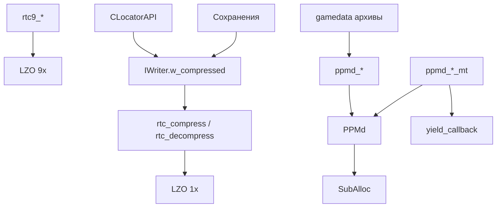
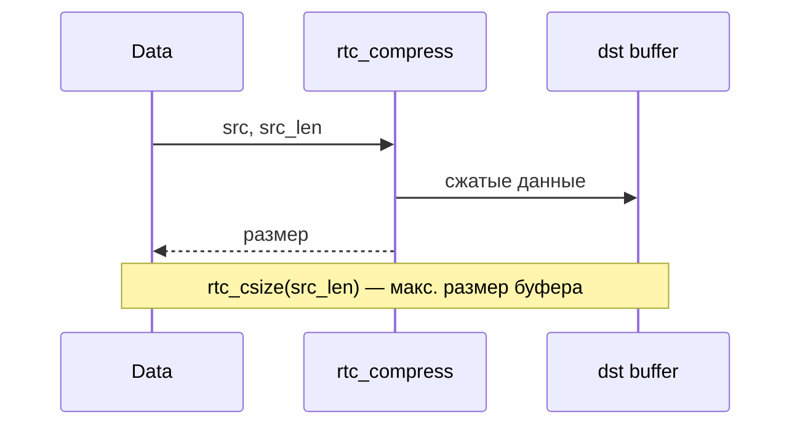

# xrCore: Сжатие

LZO (основной), LZHUF, PPMd (включая multi-thread и trained).

## Ответственность

- **LZO** (`rt_compressor`) — основной алгоритм сжатия для LTX-чунков, сохранений, сети.
- **LZO 9x** (`rtc9_*`) — высококомпрессивный вариант (медленнее).
- **LZHUF** (`lzhuf.h`) — старый алгоритм (наследие).
- **PPMd** (`ppmd_compressor.h`) — PPMd-сжатие, включая multi-thread (`ppmd_*_mt`) и trained model.

## Место в архитектуре

Нижний слой. `rtc_compress/decompress` — используется `CLocatorAPI` (chunk'ы LTX), `IWriter::w_compressed`, сохранения. PPMd — для **архивов gamedata** (высокая компрессия).

## Публичный API

### LZO (основной)

```cpp
// rt_compressor.h
extern XRCORE_API void rtc_initialize();
extern XRCORE_API u32 rtc_compress(void* dst, u32 dst_len, const void* src, u32 src_len);
extern XRCORE_API u32 rtc_decompress(void* dst, u32 dst_len, const void* src, u32 src_len);
extern XRCORE_API u32 rtc_csize(u32 in);   // максимальный размер после сжатия
```

### LZO 9x (высокая компрессия)

```cpp
extern XRCORE_API void rtc9_initialize();
extern XRCORE_API void rtc9_uninitialize();
extern XRCORE_API u32 rtc9_compress(void* dst, u32 dst_len, const void* src, u32 src_len);
extern XRCORE_API u32 rtc9_decompress(void* dst, u32 dst_len, const void* src, u32 src_len);
extern XRCORE_API u32 rtc9_csize(u32 in);
```

### LZHUF (наследие)

```cpp
// lzhuf.h
extern XRCORE_API unsigned _writeLZ(int hf, void* d, unsigned size);
extern XRCORE_API unsigned _readLZ(int hf, void*& d, unsigned size);
extern XRCORE_API void _compressLZ(u8** dest, unsigned* dest_sz, void* src, unsigned src_sz);
extern XRCORE_API void _decompressLZ(u8** dest, unsigned* dest_sz, void* src, unsigned src_sz);
```

### PPMd

```cpp
// ppmd_compressor.h
namespace compression { namespace ppmd { class stream; } }

XRCORE_API u32 ppmd_compress(void* dest_buffer, u32 dest_buffer_size, const void* source_buffer, u32 source_buffer_size);
XRCORE_API u32 ppmd_trained_compress(void* dest_buffer, u32 dest_buffer_size, const void* source_buffer, u32 source_buffer_size, compression::ppmd::stream* tmodel);
XRCORE_API u32 ppmd_decompress(void* dest_buffer, u32 dest_buffer_size, const void* source_buffer, u32 source_buffer_size);
XRCORE_API u32 ppmd_trained_decompress(void* dest_buffer, u32 dest_buffer_size, const void* source_buffer, u32 source_buffer_size, compression::ppmd::stream* tmodel);

typedef fastdelegate::FastDelegate<void()> ppmd_yield_callback_t;
XRCORE_API u32 ppmd_compress_mt(void* dest_buffer, u32 dest_buffer_size, const void* source_buffer, u32 source_buffer_size, ppmd_yield_callback_t ycb);
XRCORE_API u32 ppmd_decompress_mt(void* dest_buffer, u32 dest_buffer_size, const void* source_buffer, u32 source_buffer_size, ppmd_yield_callback_t ycb);
```

### PPMd stream

```cpp
// compression_ppmd_stream.h
namespace compression { namespace ppmd {
    class stream {
        u32 m_buffer_size;
        u8* m_buffer;
        u8* m_pointer;
    public:
        inline stream(const void* buffer, u32 buffer_size);
        inline void put_char(u8 object);
        inline int get_char();
        inline void rewind();
        inline u8* buffer() const;
        inline u32 tell() const;
    };
}}
```

## Внутреннее устройство

### Файлы

| Файл | Назначение |
|---|---|
| `rt_compressor.h/.cpp` | LZO-обёртка |
| `rt_compressor9.cpp` | LZO 9x |
| `rt_lzo1x.h`, `rt_lzo1x_1.cpp`, `rt_lzo1x_9x.cpp` | LZO 1x (компрессия/декомпрессия) |
| `rt_lzo1x_c.ch`, `rt_lzo1x_d.ch` | LZO (C) |
| `rt_lzo1x_d1/2/3.cpp` | LZO decomp (варианты) |
| `rt_lzo_init.cpp` | инициализация |
| `rt_lzo_conf.h`, `rt_lzodefs.h`, `rt_lzo_config.h`, `rt_lzodict.h` | LZO-конфиги |
| `rt_lzo_ptr.h`, `rt_lzo_swd.ch`, `rt_lzo_mchw.ch`, `rt_lzoconf.h` | LZO internals |
| `rt_miniacc.h`, `rt_config1x.h` | LZO miniacc |
| `lzhuf.h`, `LzHuf.cpp` | LZHUF |
| `PPMd.h`, `PPMdType.h` | PPMd-типы |
| `ppmd_compressor.h/.cpp` | PPMd-обёртка |
| `compression_ppmd_stream.h/.cpp` | PPMd stream |
| `SubAlloc.hpp` | PPMd sub-allocator |
| `lzo_compressor.h/.cpp` | альтернативная LZO-обёртка |

### LZO

- `rtc_initialize()` — вызывается из `xrCore::_initialize` (после `Memory._initialize`).
- `rtc_csize(in)` — **максимальный** размер после сжатия (буфер должен быть таким).
- LZO 1x — быстрый, ~2-3x компрессия. LZO 9x — медленный, ~4-5x.

### PPMd

- **PPMd** — PPM (Prediction by Partial Matching), высокая компрессия.
- **Trained model** — `tmodel` (`compression::ppmd::stream*`) — предобученная модель. `ppmd_trained_compress/decompress` — используют её.
- **Multi-thread** — `ppmd_*_mt` с `yield_callback` (кооперативная многопоточность).
- **Sub-allocator** (`SubAlloc.hpp`) — аллокатор PPMd (UNIT_SIZE=12, N_INDEXES, free-list).

### Интеграция с FS

`IWriter::w_compressed(ptr, count)` → `rtc_compress` (LZO). Chunk ID помечается `CFS_CompressMark` (бит 31). При чтении `find_chunk` возвращает `bCompressed=TRUE` → `r_chunk` распаковывает.

## Взаимодействие



- **Кто использует**: `IWriter`/`IReader` (chunk сжатие), `CLocatorAPI` (LTX), PPMd — для архивов gamedata (высокая компрессия).
- **Зависимости**: `Memory`, `fastdelegate` (PPMd mt).

## Потоки данных



## Конфигурация

- `rtc_initialize()` — из `xrCore::_initialize`.
- `rtc9_initialize/uninitialize` — вручную (по необходимости).
- PPMd — `ppmd_compress_mt` с `yield_callback` (кооперативная).
- `trained_model` (глобальная) — инициализируется/уничтожается в `xrCore::_initialize/_destroy` (не `_EDITOR`).

## Ограничения / дебаг

- **`rtc_csize(in)`** — всегда вызывай перед сжатием, чтобы выделить буфер.
- LZO — **быстрый**, но компрессия ~2-3x. PPMd — **медленный**, 4-5x+.
- PPMd mt — кооперативный (yield callback), не preemptive.
- `SubAlloc.hpp` — статические переменные (не thread-safe для PPMd без синхронизации).
- LZHUF — устаревший, не использовать для новых данных.
