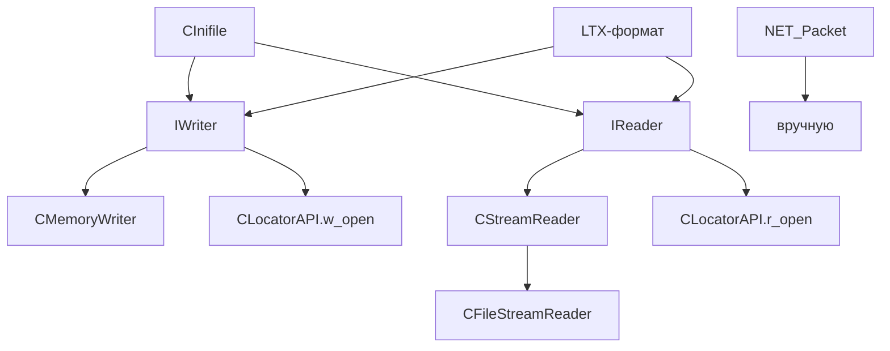
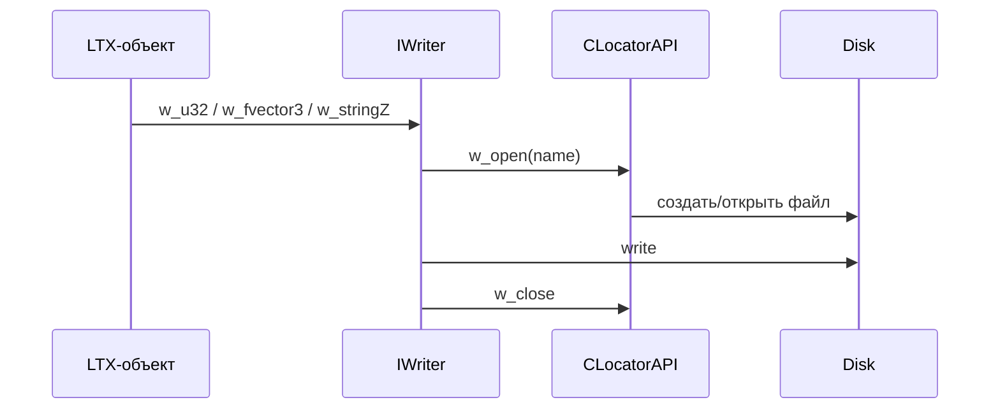

# xrCore: Файловая система

`IWriter`/`IReader` — бинарный сериализатор. `CLocatorAPI` (см. [Локализатор](locator.md)) — виртуальная ФС поверх LTX-архивов. `EFS_Utils` — утилиты путей.

## Ответственность

- **`IWriter` / `IReaderBase` / `IReader`**: бинарный сериализатор с chunking, квантованием, сжатием. Фундамент форматов LTX.
- **`CMemoryWriter`**: writer в память.
- **`CVirtualFileRW`**: reader по memory-mapped файлу.
- **`CStreamReader`**: reader с «окном» (для больших файлов).
- **`EFS_Utils`**: утилиты имён/путей.
- **`CInifile`**: INI/LTX (см. [INI / конфиги](inifile.md)).

## Место в архитектуре

Нижний слой. `IWriter`/`IReader` — **язык бинарных форматов** всего движка (LTX, сохранения, сеть — см. [Формат LTX](../../data/ltx-format.md)).

## Публичный API

### Константы

```cpp
#define CFS_CompressMark (1ul << 31ul)   // бит 31 в chunk ID = сжатый
#define CFS_HeaderChunkID (666)          // ID header chunk
```

### `IWriter`

```cpp
class XRCORE_API IWriter {
    xr_stack<u32> chunk_pos;
    xr_string fName;
public:
    virtual void seek(u32 pos) = 0;
    virtual u32 tell() = 0;
    virtual void w(const void* ptr, u32 count) = 0;
    virtual void flush() = 0;
    virtual bool valid() { return true; }

    // типизированное
    IC void w_u64(u64), w_u32(u32), w_u16(u16), w_u8(u8);
    IC void w_s64(s64), w_s32(s32), w_s16(s16), w_s8(s8);
    IC void w_float(float);
    IC void w_string(const char* p);       // + CRLF (13,10)
    IC void w_stringZ(const char* p);      // + \0
    IC void w_stringZ(const shared_str& p);
    IC void w_stringZ(shared_str& p);
    IC void w_stringZ(const xr_string& p);
    IC void w_fcolor(Fcolor), w_fvector4/3/2, w_ivector4/3/2;

    // квантование
    IC void w_float_q16(float a, float min, float max);
    IC void w_float_q8(float a, float min, float max);
    IC void w_angle16(float a);  // = w_float_q16(angle_normalize(a), 0, 2*PI)
    IC void w_angle8(float a);
    IC void w_dir(const Fvector& D);   // 16-bit packed direction
    void w_sdir(const Fvector& D);     // dir + scale (float)
    void __cdecl w_printf(const char* format, ...);

    // chunking
    u32 align();
    void open_chunk(u32 type);
    void close_chunk();
    u32 chunk_size();
    void w_compressed(void* ptr, u32 count);
    void w_chunk(u32 type, void* data, u32 size);
};
```

**Chunk-формат** (запись): `[u32 type][u32 size][data...]`. При сжатии — `type | CFS_CompressMark` + сжатый блок (LZO).

### `IReaderBase<impl>` (шаблон)

```cpp
template <typename implementation_type>
class IReaderBase {
    IC BOOL eof() const;
    IC void r(void* p, int cnt);
    IC Fvector r_vec3(); IC Fvector4 r_vec4();
    IC u64 r_u64(); IC u32 r_u32(); IC u16 r_u16(); IC u8 r_u8();
    IC s64 r_s64(); IC s32 r_s32(); IC s16 r_s16(); IC s8 r_s8();
    IC float r_float();
    IC void r_fvector4/3/2, r_ivector4/3/2, r_fcolor;
    IC float r_float_q16(min, max); IC float r_float_q8(min, max);
    IC float r_angle16(); IC float r_angle8();
    IC void r_dir(Fvector& A); IC void r_sdir(Fvector& A);
    IC void rewind();
    u32 find_chunk(u32 ID, BOOL* bCompressed);
    IC BOOL r_chunk(u32 ID, void* dest);
    IC BOOL r_chunk_safe(u32 ID, void* dest, u32 dest_size);
};
```

### `IReader` (in-memory)

```cpp
class XRCORE_API IReader : public IReaderBase<IReader> {
    char* data; int Pos, Size, iterpos;
public:
    IReader();
    IReader(void* _data, int _size, int _iterpos = 0);
    IC int elapsed() const; IC int tell() const;
    IC void seek(int ptr); IC int length() const;
    IC void* pointer() const; IC void advance(int cnt);
    void r(void* p, int cnt);
    void r_string(char* dest, u32 tgt_sz);
    void r_string(xr_string& dest);
    void skip_stringZ();
    void r_stringZ(char* dest, u32 tgt_sz);
    void r_stringZ(shared_str& dest);
    void r_stringZ(xr_string& dest);
    void close();
    IReader* open_chunk(u32 ID);
    IReader* open_chunk_iterator(u32& ID, IReader* previous = NULL);
    u32 find_chunk(u32 ID, BOOL* bCompressed = 0);
protected:
    IC u32 correction(u32 p);  // 16-byte alignment
};
```

**Коррекция выравнивания**: `correction(p)` — если `p % 16 != 0`, возвращает сдвиг до ближайшего 16-байтного.

### `CMemoryWriter`

```cpp
class XRCORE_API CMemoryWriter : public IWriter {
    u8* data; u32 position, mem_size, file_size;
public:
    virtual void w(const void* ptr, u32 count);
    virtual void seek(u32 pos); virtual u32 tell();
    IC u8* pointer(); IC u32 size() const;
    IC void clear();
    IC void free();
    bool save_to(LPCSTR fn);
    virtual void flush() {};
};
```

### `CVirtualFileRW`

```cpp
class XRCORE_API CVirtualFileRW : public IReader {
    void *hSrcFile, *hSrcMap;
public:
    CVirtualFileRW(const char* cFileName);
    virtual ~CVirtualFileRW();
};
```

Memory-mapped read.

### `CStreamReader` (windowed reader)

```cpp
class XRCORE_API CStreamReader : public IReaderBase<CStreamReader> {
    HANDLE m_file_mapping_handle;
    u32 m_start_offset, m_file_size, m_archive_size, m_window_size;
    u32 m_current_offset_from_start, m_current_window_size;
    u8* m_current_map_view_of_file;
    u8* m_start_pointer, *m_current_pointer;
public:
    virtual void construct(HANDLE, u32 start_offset, u32 file_size, u32 archive_size, u32 window_size);
    virtual void destroy();
    IC u32 elapsed() const; IC u32 length() const;
    IC void seek(int offset); IC u32 tell() const;
    IC void close();
    void advance(int offset);
    void r(void* buffer, u32 buffer_size);
    CStreamReader* open_chunk(u32 chunk_id);
    u32 find_chunk(u32 ID, BOOL* bCompressed = 0);
    void r_stringZ(shared_str& dest);
};
```

Для **больших файлов** — читает «окном» (window) через `CreateFileMapping`/`MapViewOfFile`, перематываясь по мере чтения.

### `CFileStreamReader`

```cpp
class CFileStreamReader : public CStreamReader {
    HANDLE m_file_handle;
public:
    virtual void construct(LPCSTR file_name, u32 window_size);
    virtual void destroy();
};
```

Обёртка: открывает файл + `CStreamReader`.

### `EFS_Utils` (singleton `xr_EFS`, макрос `EFS`)

```cpp
class XRCORE_API EFS_Utils {
public:
    LPCSTR GenerateName(LPCSTR base_path, LPCSTR base_name, LPCSTR def_ext, LPSTR out_name, u32 out_name_size);
    bool GetOpenName(LPCSTR initial, string_path& buffer, int sz_buf, bool bMulti = false, LPCSTR offset = 0, int start_flt_ext = -1);
    bool GetOpenName(LPCSTR initial, xr_string& buf, bool bMulti = false, LPCSTR offset = 0, int start_flt_ext = -1);
    bool GetSaveName(LPCSTR initial, string_path& buffer, LPCSTR offset = 0, int start_flt_ext = -1);
    bool GetSaveName(LPCSTR initial, xr_string& buf, LPCSTR offset = 0, int start_flt_ext = -1);
    void MarkFile(LPCSTR fn, bool bDeleteSource);
    xr_string AppendFolderToName(xr_string& tex_name, int depth, BOOL full_name);
    LPCSTR AppendFolderToName(LPSTR, u32, int, BOOL);
    LPCSTR AppendFolderToName(LPCSTR src, LPSTR dest, u32, int, BOOL);
    xr_string ChangeFileExt(LPCSTR src, LPCSTR ext);
    xr_string ChangeFileExt(const xr_string& src, LPCSTR ext);
    xr_string ExtractFileName(LPCSTR src);
    xr_string ExtractFilePath(LPCSTR src);
    xr_string ExtractFileExt(LPCSTR src);
    xr_string ExcludeBasePath(LPCSTR full_path, LPCSTR excl_path);
};
extern XRCORE_API EFS_Utils* xr_EFS;
#define EFS (*xr_EFS)
```

### `VerifyPath`

```cpp
XRCORE_API void VerifyPath(LPCSTR path);
```

Проверка пути (debug: `FS_DEBUG` → `g_file_mapped_memory`, `dump_file_mappings`).

## Внутреннее устройство

### Файлы

| Файл | Назначение |
|---|---|
| `FS.h` | `IWriter`, `IReaderBase`, `IReader`, `CMemoryWriter`, `CVirtualFileRW` |
| `FS.cpp` | реализация |
| `FS_impl.h` | альтернативные реализации `IReader` |
| `FS_internal.h` | внутренние |
| `FileSystem.h/.cpp` | `EFS_Utils` |
| `FileSystem_borland.cpp` | Borland-вариант |
| `stream_reader.h/.cpp` | `CStreamReader` |
| `stream_reader_inline.h` | inline-методы |
| `file_stream_reader.h/.cpp` | `CFileStreamReader` |

### Chunking

Запись:
```
open_chunk(type) → [u32 type][u32 size=0] (заполняется в close_chunk)
... data ...
close_chunk() → переписать size
```

Чтение:
- `find_chunk(ID, &compressed)` — сканирует, возвращает размер.
- `open_chunk(ID)` — ставит `Pos` на начало данных chunk.
- `open_chunk_iterator(ID, prev)` — итерация по chunk'ам.

### Квантование

`w_float_q16(a, min, max)` — `u16(iFloor(((a-min)/(max-min))*65535 + 0.5))`. Обратное: `val*(max-min)/65535 + min`. `w_dir` — `pvCompress` (16-bit packed direction, см. `_compressed_normal.h`).

### Сжатие chunk'ов

`w_compressed(ptr, count)` — сжимает LZO, пишет с `CFS_CompressMark` в ID. При чтении `find_chunk` возвращает `bCompressed=TRUE` → `r_chunk` распаковывает.

## Взаимодействие



- **Кто использует**: `CInifile` (save_as), `CLocatorAPI` (r_open/w_open), все сериализаторы LTX-объектов (xrEngine, xrGame, xrParticles).
- **Зависимости**: `Memory`, `shared_str`, `rt_compressor` (LZO), `Fvector`/`Fmatrix`.

## Потоки данных



## Конфигурация

- `FS_DEBUG` — ручная отладка (mapped memory stats).
- `TESTING_IREADER` — альтернативная реализация `IReader` (test).
- `BACKUP_FILE_LEVEL 5` — уровень бэкапов (FileSystem.h).

## Ограничения / дебаг

- **`IReader` — in-memory**. Для больших файлов — `CStreamReader` (windowed).
- **16-byte alignment** — `correction(p)` в `IReader`. Если chunk-данные не выровнены — сдвиг.
- `w_string` добавляет **CRLF** (13,10) — не `w_stringZ`!
- `r_stringZ(shared_str&)` — интернирует (см. [Строки](strings.md)).
- `CMemoryWriter::free()` — `xr_free(data)` — **не вызывать дважды**.
- `EFS_Utils` — не thread-safe (глобальный singleton).
