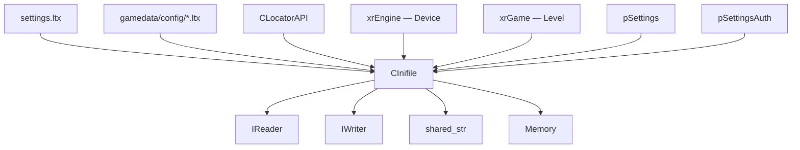
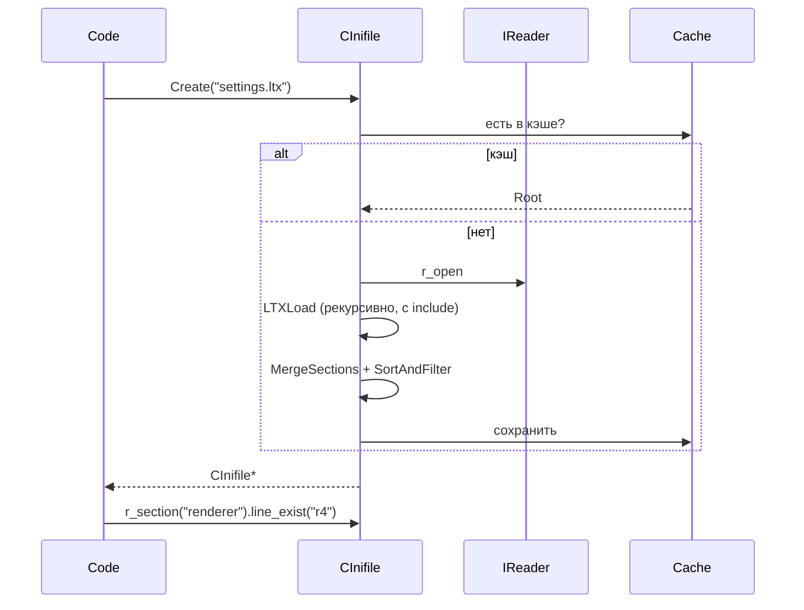

# xrCore: INI / конфиги

`CInifile` — парсер INI и LTX (с DLTX-override, include, кэшем).

## Ответственность

- Парсинг `.ini` и `.ltx` (текстовые секции + key=value).
- **DLTX** (Distributive LTX) — система override: mod-файлы переопределяют base-файлы, с учётом глубины include.
- Кэширование (`CachedData`) — повторное чтение того же файла не парсит заново.
- Чтение/запись типизированных значений (u8..u64, float, Fvector, Fmatrix, color, bool, token, CLSID).

## Место в архитектуре

Нижний слой. `CInifile` — **основной формат конфигурации** движка: `settings.ltx`, `gamedata\config\*.ltx`, конфиги уровней, скриптов, шейдеров. Глобальные указатели `pSettings`, `pSettingsAuth`.

## Публичный API

### `CInifile::Item`

```cpp
struct XRCORE_API Item {
    shared_str first;    // ключ
    mutable shared_str second;   // значение
    mutable shared_str filename; // файл DLTX (для override)
    int depth;           // глубина DLTX (меньше = важнее)
    u32 insertionIndex;  // порядок вставки (при равном depth)
    bool operator<(const Item& other) const;  // по *first
};
```

**DLTX-логика**:
- `depth` — порядок загрузки: `DLTX mod_file -> its includes -> Base file -> its includes`. **Меньший depth = важнее**.
- `insertionIndex` — при равном depth, кто вставлен раньше — тот и побеждает.

### `CInifile::Sect`

```cpp
struct XRCORE_API Sect {
    shared_str Name;
    Items Data;   // xr_vector<Item>
    BOOL line_exist(LPCSTR L, LPCSTR* val = 0);
};
```

### `CInifile` (основные методы)

```cpp
class XRCORE_API CInifile {
    static CInifile* Create(LPCSTR szFileName, BOOL ReadOnly = TRUE);
    static void Destroy(CInifile*);
    static IC BOOL IsBOOL(LPCSTR B);  // "on","yes","true","1"

    enum { eSaveAtEnd = (1<<0), eReadOnly = (1<<1), eOverrideNames = (1<<2) };
    Flags8 m_flags;

    CInifile(IReader* F, LPCSTR path = 0, allow_include_func_t allow_include_func = NULL);
    CInifile(LPCSTR szFileName, BOOL ReadOnly = TRUE, BOOL bLoadAtStart = TRUE, BOOL SaveAtEnd = TRUE, u32 sect_count = 0, allow_include_func_t allow_include_func = NULL);
    virtual ~CInifile();

    bool save_as(LPCSTR new_fname = 0);
    void save_as(IWriter& writer, bool bcheck = false) const;

    // DLTX
    void DLTX_print(LPCSTR sec, LPCSTR line);
    LPCSTR DLTX_getFilenameOfLine(LPCSTR sec, LPCSTR line);
    bool DLTX_isOverride(LPCSTR sec, LPCSTR line);

    // cache
    static void InvalidateCache(LPCSTR path = nullptr);
    static void GetCacheStats(u64& files_cached, u64& total_bytes, u64& section_count);

    LPCSTR fname() const;
    void set_override_names(BOOL b);
    void save_at_end(BOOL b);

    // секции
    Sect& r_section(LPCSTR S) const;
    Sect& r_section(const shared_str& S) const;
    BOOL line_exist(LPCSTR S, LPCSTR L) const;
    u32 line_count(LPCSTR S) const;
    u32 section_count() const;
    BOOL section_exist(LPCSTR S) const;
    Root& sections();   // Root = xr_vector<Sect>

    // чтение типизированное
    CLASS_ID r_clsid(LPCSTR S, LPCSTR L) const;
    LPCSTR r_string(LPCSTR S, LPCSTR L) const;      // оставляет кавычки
    shared_str r_string_wb(LPCSTR S, LPCSTR L) const; // убирает кавычки
    u8 r_u8, u16, u32, u64;
    s8 r_s8, s16, s32, s64;
    float r_float;
    Fcolor r_fcolor;
    u32 r_color;
    Ivector2/3/4 r_ivector2/3/4;
    Fvector2/3/4 r_fvector2/3/4;
    BOOL r_bool;
    int r_token(LPCSTR S, LPCSTR L, const xr_token* token_list) const;
    BOOL r_line(LPCSTR S, int L, LPCSTR* N, LPCSTR* V) const;

    // запись
    void w_string, w_u8, w_u16, w_u32, w_u64, w_s64, w_s8, w_s16, w_s32, w_float,
         w_fcolor, w_color, w_ivector2/3/4, w_fvector2/3/4, w_bool;
    void remove_line(LPCSTR S, LPCSTR L);
};
```

### `allow_include_func_t`

```cpp
#ifndef _EDITOR
typedef fastdelegate::FastDelegate1<LPCSTR, bool> allow_include_func_t;
#endif
```

Фильтр include (не в редакторе). Возвращает `true` — include разрешён.

### Глобальные

```cpp
extern XRCORE_API CInifile const* pSettings;      // settings.ltx
extern XRCORE_API CInifile const* pSettingsAuth;  // auth
```

## Внутреннее устройство

### Файлы

| Файл | Назначение |
|---|---|
| `xr_ini.h` | интерфейс |
| `Xr_ini.cpp` | реализация |

### Кэш

```cpp
static xr_unordered_flat_map<xr_string, Root> CachedData;
static xrCriticalSection CacheCS;
```

`InvalidateCache(path)` — удаляет из кэша. `GetCacheStats` — статистика.

### DLTX-структуры

```cpp
xr_unordered_flat_map<shared_str, xr_unordered_flat_set<shared_str>> OverrideToFilename;
xr_unordered_flat_map<shared_str, shared_str> SectionToFilename;
xr_unordered_flat_set<shared_str> SectionsToDelete;
xr_unordered_flat_map<shared_str, RStringVec> BaseParentDataMap;
xr_unordered_flat_map<shared_str, Sect> BaseData;
xr_unordered_flat_map<shared_str, RStringVec> OverrideParentDataMap;
xr_unordered_flat_map<shared_str, Sect> OverrideData;
xr_unordered_flat_map<shared_str, Items> OverrideModifyListData;
```

`EvaluationsContext` — DFS-обход секций (черной/серый set) для разрешения циклов include.

### Механика DLTX

1. **Load**: `LTXLoad(IReader*, path, bIsRootFile, currentFileName, depth)` — рекурсивный parse с учётом include.
2. **Include**: `[section:include "file.ltx"]` — подгружает файл на глубину `depth+1`.
3. **Override**: mod-файл (меньший depth) переопределяет base-файл. `insertionIndex` — порядок вставки.
4. **Modify list**: `>` (Insert) / `<` (Remove) — добавление/удаление элементов.
5. **Merge**: `MergeSections(BaseItems, OverrideItems, DeletedItems, IsMergingBaseAndMod)` — слияние.
6. **SortAndFilterSection** — финальная сортировка.

### Формат LTX (текстовый)

```
[section_name]
key = value
key2 = value2
[other:include "other.ltx"]   ← include
[section:override "mod.ltx"]  ← override
```

`r_string` — оставляет кавычки (`"value"`), `r_string_wb` — убирает.

## Взаимодействие



- **Кто использует**: `CEngine` (settings), `CLocatorAPI` (header LTX-архива — `CInifile*`), все LTX-конфиги.
- **Зависимости**: `IReader`/`IWriter`, `shared_str`, `Memory`, `fastdelegate`.

## Потоки данных



## Конфигурация

- `_EDITOR` — выключает `allow_include_func_t`.
- `eSaveAtEnd` — сохранять при выходе.
- `eReadOnly` — только чтение.
- `eOverrideNames` — имена override.
- `XRCORE_STATIC` — `NO_FS_SCAN` → `ELocatorAPI.h` (см. [Локализатор](locator.md)).

## Ограничения / дебаг

- **Кэш** — `InvalidateCache(path)` при изменении файла (редактор). В игре — кэш на всё время.
- **DLTX** — сложная система; `depth`/`insertionIndex` — неочевидны. См. `DLTX_print` для отладки.
- `r_string` vs `r_string_wb` — кавычки.
- `r_token` — список `xr_token` (см. `xrCore.h`).
- **Не thread-safe** — один `CInifile` на поток.
- `Create`/`Destroy` — статические (управление памятью).
