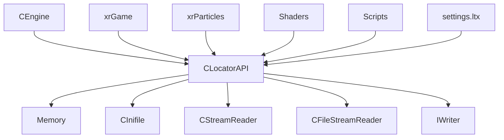
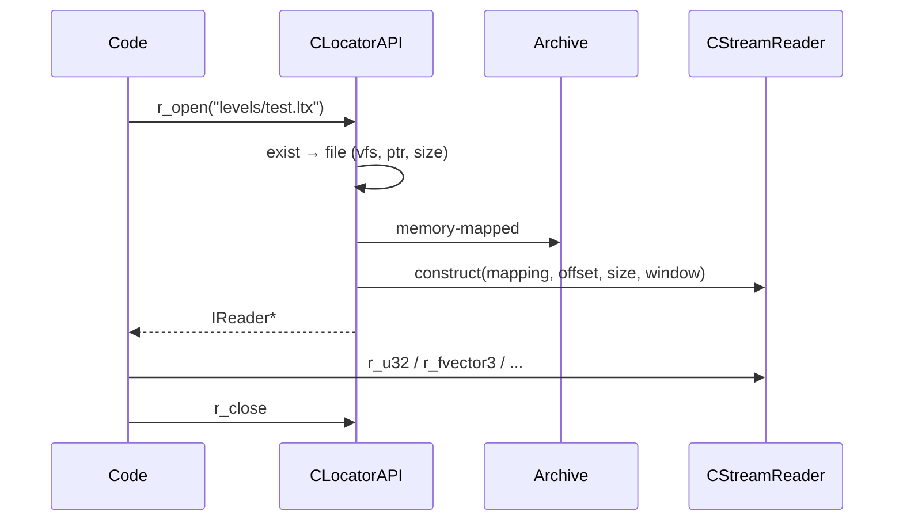

# xrCore: Локализатор (архивы)

`CLocatorAPI` — виртуальная файловая система поверх LTX-архивов.

## Ответственность

- Виртуальная ФС: объединяет **разные архивы** (`.ltx`) и **папки** в единое пространство имён.
- Разрешение имён файлов: `path/name.ext` → поиск в архивах/папках по приоритету.
- Reading/Writing: `r_open`/`w_open` (возвращают `IReader*`/`IWriter*`).
- **Auth** — генерация/проверка кода авторизации (антипират).
- **Cache** — кэширование файлов в памяти (debug).
- **Rescan** — пересканирование папок (редактор).

## Место в архитектуре

Нижний слой. `CLocatorAPI` — **единственный способ** читать/писать файлы в движке. Все LTX-объекты, скрипты, конфиги, шейдеры — через `FS.r_open`/`FS.w_open`.

## Публичный API

### Singleton

```cpp
extern XRCORE_API CLocatorAPI* xr_FS;
#define FS (*xr_FS)
```

Создаётся в `xrCore::_initialize`: `xr_FS = xr_new<CLocatorAPI>();` → `FS._initialize(flags, 0, fs_fname);`

### `CLocatorAPI::file`

```cpp
struct file {
    LPCSTR name;             // low-case имя
    u32 vfs;                 // 0xffffffff = стандартный файл (не из архива)
    u32 crc;                 // CRC32 содержимого
    u32 ptr;                 // смещение внутри vfs
    u32 size_real;
    u32 size_compressed;     // size_real == size_compressed → не сжат
    u32 modif;               // для редактора
};
```

### `CLocatorAPI::archive`

```cpp
struct archive {
    shared_str path;
    void *hSrcFile, *hSrcMap;
    u32 size;
    CInifile* header;        // header LTX (список файлов)
    u32 vfs_idx;
    void open();
    void close();
};
```

### Основные методы

```cpp
class XRCORE_API CLocatorAPI {
public:
    CLocatorAPI();
    ~CLocatorAPI();
    void _initialize(u32 flags, LPCSTR target_folder = 0, LPCSTR fs_name = 0);
    void _destroy();

    // reading
    CStreamReader* rs_open(LPCSTR initial, LPCSTR N);
    IReader* r_open(LPCSTR initial, LPCSTR N);
    IC IReader* r_open(LPCSTR N) { return r_open(0, N); }
    void r_close(IReader*& S);
    void r_close(CStreamReader*& fs);

    // writing
    IWriter* w_open(LPCSTR initial, LPCSTR N);
    IC IWriter* w_open(LPCSTR N) { return w_open(0, N); }
    IWriter* w_open_ex(LPCSTR initial, LPCSTR N);
    IC IWriter* w_open_ex(LPCSTR N) { return w_open_ex(0, N); }
    void w_close(IWriter*& S);

    // existence
    const file* exist(LPCSTR N);
    const file* exist(LPCSTR path, LPCSTR name);
    const file* exist(string_path& fn, LPCSTR path, LPCSTR name);
    const file* exist(string_path& fn, LPCSTR path, LPCSTR name, LPCSTR ext);

    // permissions
    BOOL can_write_to_folder(LPCSTR path);
    BOOL can_write_to_alias(LPCSTR path);
    BOOL can_modify_file(LPCSTR fname);
    BOOL can_modify_file(LPCSTR path, LPCSTR name);

    // file ops
    BOOL dir_delete(LPCSTR path, LPCSTR nm, BOOL remove_files);
    void file_delete(LPCSTR path, LPCSTR nm);
    void file_delete(LPCSTR full_path);
    void file_copy(LPCSTR src, LPCSTR dest);
    void file_rename(LPCSTR src, LPCSTR dest, bool bOwerwrite = true);
    int file_length(LPCSTR src);
    u32 get_file_age(LPCSTR nm);
    void set_file_age(LPCSTR nm, u32 age);

    // listing
    xr_vector<LPSTR>* file_list_open(LPCSTR initial, LPCSTR folder, u32 flags = FS_ListFiles);
    xr_vector<LPSTR>* file_list_open(LPCSTR path, u32 flags = FS_ListFiles);
    void file_list_close(xr_vector<LPSTR>*& lst);
    int file_list(FS_FileSet& dest, LPCSTR path, u32 flags = FS_ListFiles, LPCSTR mask = 0);

    // paths
    bool path_exist(LPCSTR path);
    FS_Path* get_path(LPCSTR path);
    FS_Path* append_path(LPCSTR path_alias, LPCSTR root, LPCSTR add, BOOL recursive);
    LPCSTR update_path(string_path& dest, LPCSTR initial, LPCSTR src);

    // archives
    bool load_all_unloaded_archives();
    void unload_archive(archive& A);

    // auth
    void auth_generate(xr_vector<shared_str>& ignore, xr_vector<shared_str>& important);
    u64 auth_get();
    void auth_runtime(void*);

    // rescan (editor)
    void rescan_path(LPCSTR full_path, BOOL bRecurse);
    void rescan_pathes();
    void lock_rescan();
    void unlock_rescan();

    // flags
    enum {
        flNeedRescan = (1<<0), flBuildCopy = (1<<1), flReady = (1<<2),
        flEBuildCopy = (1<<3), flEventNotificator = (1<<4), flTargetFolderOnly = (1<<5),
        flCacheFiles = (1<<6), flScanAppRoot = (1<<7), flNeedCheck = (1<<8),
        flDumpFileActivity = (1<<9), flPrintLTX = (1<<10),
    };
    Flags32 m_Flags;
    u32 dwAllocGranularity;
    u32 dwOpenCounter;
};
```

### Внутренние структуры

```cpp
private:
    DEFINE_VECTOR(archive, archives_vec, archives_it);
    archives_vec m_archives;
    void LoadArchive(archive& A, LPCSTR entrypoint = NULL);

    DEFINE_MAP_PRED(LPCSTR, FS_Path*, PathMap, PathPairIt, pred_str);
    PathMap pathes;   // имя пути → FS_Path*

    DEFINE_SET_PRED(file, files_set, files_it, file_pred);
    files_set m_files;  // все файлы (по имени)

    int m_iLockRescan;
    void check_pathes();

    BOOL bNoRecurse;
    xrCriticalSection m_auth_lock;
    u64 m_auth_code;

    void Register(LPCSTR name, u32 vfs, u32 crc, u32 ptr, u32 size_real, u32 size_compressed, u32 modif);
    void ProcessArchive(LPCSTR path);
    void ProcessOne(LPCSTR path, const _finddata_t& entry);
    bool Recurse(LPCSTR path);
    files_it file_find_it(LPCSTR n);
```

## Внутреннее устройство

### Файлы

| Файл | Назначение |
|---|---|
| `LocatorAPI.h/.cpp` | основной |
| `LocatorAPI_defs.h/.cpp` | определения (`FS_Path`, `FS_FileSet`, константы) |
| `LocatorAPI_auth.cpp` | auth |
| `LocatorAPI_Notifications.h/.cpp` | уведомления (event) |

### Механика

1. **`_initialize(flags, target_folder, fs_name)`**:
   - Скан `target_folder` (по умолчанию — корень gamedata).
   - Поиск всех `.ltx`-архивов (рекурсивно, если `!bNoRecurse`).
   - Для каждого: `ProcessArchive` → `LoadArchive` (читать header `CInifile` → список файлов) → `Register` (добавить в `m_files`).
   - `check_pathes` — построить `pathes` map.

2. **`r_open(path, name)`**:
   - `exist(path, name)` → поиск в `m_files` (low-case).
   - Если `vfs == 0xffffffff` — стандартный файл (папка) → `CFileStreamReader`.
   - Иначе — из архива: `file_from_archive` (memory-mapped, windowed `CStreamReader`).
   - Если `flCacheFiles` — `file_from_cache_impl`.

3. **`w_open(path, name)`**:
   - `can_write_to_folder` / `can_modify_file` — проверка прав.
   - `IWriter*` (файл или память).

4. **Auth**:
   - `auth_generate(ignore, important)` — CRC всех важных файлов → `m_auth_code`.
   - `auth_get()` — вернуть код.
   - `auth_runtime(void*)` — runtime-проверка.

5. **Rescan** (редактор):
   - `rescan_path(full_path, bRecurse)` — пересканировать папку.
   - `lock_rescan`/`unlock_rescan` — блокировка (мьютекс).

### Приоритет файлов

Порядок в `m_files` (set по имени):
1. **Папки** (standard, `vfs=0xffffffff`) — **высший** приоритет (переопределяют архив).
2. **Архивы** — в порядке сканирования (обычно по глубине/алфавиту).

`exist` возвращает **первый** найденный (высший приоритет).

## Взаимодействие



- **Кто использует**: весь движок — `FS.r_open`/`FS.w_open`.
- **Зависимости**: `Memory`, `CInifile` (header архива), `CStreamReader`, `IReader`/`IWriter`, `shared_str`, `CRC32`.

## Потоки данных



## Конфигурация

- **Flags** (см. enum выше):
  - `flBuildCopy` — `-build` (копировать в build).
  - `flEBuildCopy` — `-ebuild`.
  - `flCacheFiles` — `-cache` (debug, кэширование).
  - `flScanAppRoot` — сканировать корень приложения.
  - `flDumpFileActivity` — `-file_activity`.
  - `flPrintLTX` — печать LTX.
- **`fs_name`** — имя основного файла (settings).
- **`XRCORE_STATIC`** → `NO_FS_SCAN` → `ELocatorAPI.h` (упрощённый, без сканирования).

## Ограничения / дебаг

- **Low-case**: имена файлов — всегда в нижнем регистре (`name` в `file`).
- **Priority**: папки > архивы. Если файл есть и в папке, и в архиве — берётся из папки.
- **Memory-mapped**: `CStreamReader` — windowed (не читает весь файл в память).
- **Auth** — не для отладки (антипират). `m_auth_code` — `u64`.
- **Rescan** — только редактор (`_EDITOR`).
- **Thread-safety**: `m_auth_lock` — только для auth. Остальное — **не thread-safe** (один поток).
- **`bNoRecurse`** — не рекурсивный скан (для производительности).
