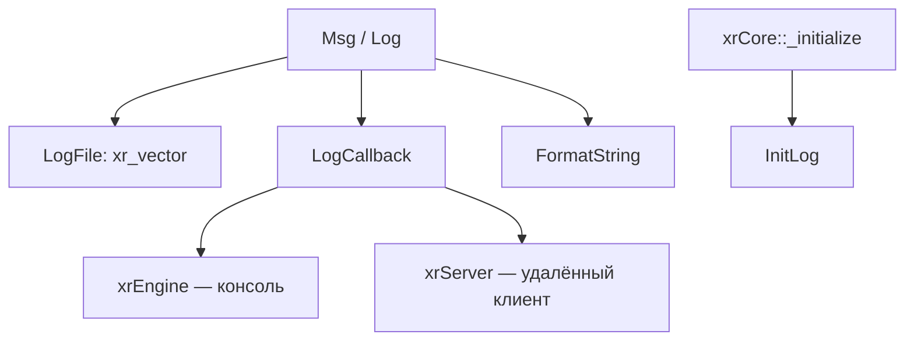
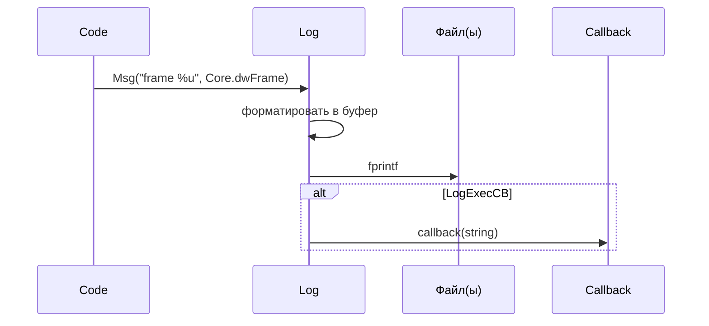

# xrCore: Логирование

`Msg`/`Log` — единственный канал вывода в консоль и файл.

## Ответственность

- Форматированный вывод в **два** канала одновременно: файл логирования и (опционально) callback.
- Утилиты: `FormatString`, `LogWinErr`.
- Управление: `CreateLog`/`InitLog`/`CloseLog`/`FlushLog`, `SetLogCB`.

## Место в архитектуре

Нижний слой. `Msg`/`Log` — **самые используемые функции** во всём движке. Вызываются из `xrCore::_initialize` (до инициализации FS) и из любого модуля.

## Публичный API

```cpp
// log.h
void XRCORE_API __cdecl Msg(LPCSTR format, ...);
void XRCORE_API Log(LPCSTR msg);
void XRCORE_API Log(LPCSTR msg, LPCSTR dop);
void XRCORE_API Log(LPCSTR msg, u32 dop);
void XRCORE_API Log(LPCSTR msg, int dop);
void XRCORE_API Log(LPCSTR msg, float dop);
void XRCORE_API Log(LPCSTR msg, const Fvector& dop);
void XRCORE_API Log(LPCSTR msg, const Fmatrix& dop);
void XRCORE_API LogWinErr(LPCSTR msg, long err_code);

typedef void (*LogCallback)(LPCSTR string);
LogCallback XRCORE_API SetLogCB(LogCallback cb);
void XRCORE_API CreateLog(BOOL no_log = FALSE);
void InitLog();
void CloseLog();
void XRCORE_API FlushLog();

extern XRCORE_API xr_vector<xr_string> LogFile;   // список файлов логирования
extern XRCORE_API BOOL LogExecCB;                 // флаг: использовать callback

xr_string FormatString(LPCSTR fmt, ...);
```

**Макрос**: `VPUSH(a)` = `((a).x), ((a).y), ((a).z)` — для `Msg("vec: %f %f %f", VPUSH(v))`.

## Внутреннее устройство

### Файлы

| Файл | Назначение |
|---|---|
| `log.h` | интерфейс |
| `log.cpp` | реализация |

### Механика

1. `Msg(format, ...)` — `__cdecl` (varargs), форматирует в буфер, пишет:
   - в каждый файл из `LogFile` (если `LogFile` не пуст);
   - в callback (если `SetLogCB` установлен, `LogExecCB == TRUE`).
2. `Log(msg, dop)` — аналогично, но `msg` + форматированный `dop` (u32/int/float/Fvector/Fmatrix).
3. `CreateLog(no_log)` — создаёт/открывает файлы. `InitLog()` — вызывается из `xrCore::_initialize` (после `Memory._initialize`).
4. `FlushLog()` — `fflush` всех файлов.
5. `SetLogCB(cb)` — возвращает предыдущий callback.

### Файлы логирования

`LogFile` — `xr_vector<xr_string>`. Имена задаются:
- `fs_fname` (аргумент `xrCore::_initialize`) — основной файл;
- `commandline.txt` — см. [Временны́е/системные](system.md).

### Взаимосвязь с `xrCore::_initialize`

```cpp
// xrCore.cpp
Memory._initialize(strstr(Params, "-mem_debug") ? TRUE : FALSE);
DUMP_PHASE;
InitLog();            // ← лог инициализируется ДО FS
_initialize_cpu();
rtc_initialize();
```

То есть `Msg`/`Log` работают **до** `FS._initialize`.

## Взаимодействие



- **Кто устанавливает callback**: `CEngine::Initialize` (xrEngine) — выводит в консоль; `xrServer` — в удалённый клиент.
- **Зависимости**: `Memory` (буферы), `xr_string`.

## Потоки данных



## Конфигурация

- `no_log` (аргумент `CreateLog`) — не создавать файлы (только callback).
- `-no_log` (в `Core.Params`) — см. [Временны́е/системные](system.md).
- `commandline.txt` — доп. параметры.

## Ограничения / дебаг

- `Msg` — `__cdecl` (не `__stdcall`) — varargs.
- `Log` **не форматирует** `msg` — только `dop`. Для форматирования — `Msg` или `FormatString`.
- `FormatString` — буфер 4096 (через `make_string`-подобный механизм).
- `LogWinErr` — `FormatMessage` + код ошибки.
- `LogFile` — глобальный вектор, **не thread-safe** (защищается вызовом `FlushLog` в точке синхронизации).
- `Msg` до `InitLog` — выводит только в callback (если установлен).
