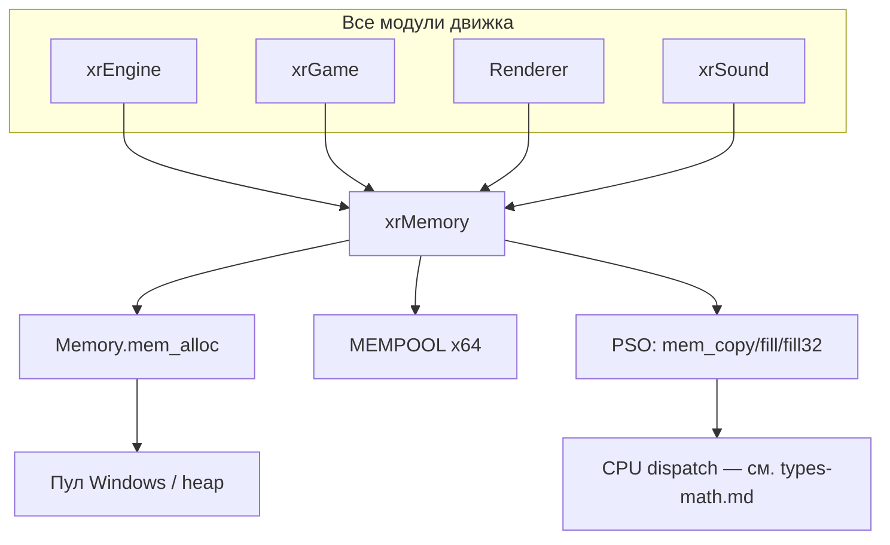
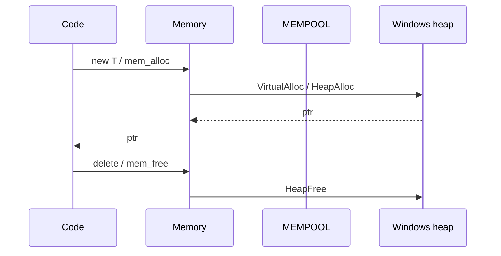

# xrCore: Память

Единый аллокатор, пулы, отладочный учёт выделений.

## Ответственность

- Единая точка выделения памяти для всего движка (глобальный `operator new/delete`).
- Подсистема «именованных» выделений (`DEBUG_MEMORY_NAME`) и отладочного учёта.
- Фиксированные пулы `MEMPOOL` (64 шт.) для частых мелких объектов.
- PSO-функции `mem_copy`/`mem_fill`/`mem_fill32` (выбираются по CPU — см. [Типы и математика](types-math.md)).
- Мониторинг памяти (debug) — `memory_monitor.h`.

## Место в архитектуре

Нижний слой — [Карта модулей](../../architecture/module-map.md). Ни от кого внутри движка не зависит; **все** другие модули включают `xrMemory.h` (прямая или через `xrCore.h`).

## Публичный API

### Singleton `Memory` (тип `xrMemory`)

```cpp
extern XRCORE_API xrMemory Memory;
```

| Метод | Назначение |
|---|---|
| `_initialize(BOOL debug_mode=FALSE)` | вызывается из `xrCore::_initialize` |
| `_destroy()` | обратная очистка |
| `mem_alloc(size, name?)` / `mem_realloc(p, size, name?)` / `mem_free(p)` | базовые операции (с именем при `DEBUG_MEMORY_NAME`) |
| `mem_usage()` | текущее занятое |
| `mem_compact()` | компактизация |
| `mem_statistic(LPCSTR fn)` | дамп статистики в файл (debug) |
| `dbg_register(p, size, name)` / `dbg_unregister(p)` / `dbg_check()` | отладочный учёт (только `DEBUG_MEMORY_MANAGER`) |
| `mem_copy`, `mem_fill`, `mem_fill32` | PSO-указатели (`pso_MemCopy`/`pso_MemFill`/`pso_MemFill32` — `xrMemory_pso.h`) |
| `mem_counter_set/get` | счётчик (debug) |

### Глобальный `operator new/delete`

```cpp
// xrMemory.h, MSVC
IC void* operator new(size_t size) { return Memory.mem_alloc(size ? size : 1, "C++ NEW"); }
IC void operator delete(void* p) { xr_free(p); }
IC void* operator new[](size_t size) { return Memory.mem_alloc(size ? size : 1, "C++ NEW"); }
IC void operator delete[](void* p) { xr_free(p); }
```

**Важно**: все `new`/`delete` в движке уходят в `Memory`. Отключается `NO_XRNEW` или под Borland.

### Макросы и функции

| Макрос / функция | Что делает |
|---|---|
| `ZeroMemory(a,b)` | `Memory.mem_fill(a, 0, b)` |
| `FillMemory(a,b,c)` | `Memory.mem_fill(a, c, b)` |
| `CopyMemory(a,b,c)` | `memcpy(a,b,c)` |
| `xr_alloc<T>(count)` | `Memory.mem_alloc(count*sizeof(T), typeid(T).name())` (имя при `DEBUG_MEMORY_NAME`) |
| `xr_free<T*&>(P)` | `Memory.mem_free`, ставит `P = NULL` |
| `xr_malloc(size)` / `xr_realloc(P, size)` | C-подобные |
| `xr_strdup(const char*)` | `new char[n]` + copy |

### Пулы

```cpp
const u32 mem_pools_count = 64;
const u32 mem_pools_ebase = 32;
const u32 mem_generic = mem_pools_count + 1;
extern MEMPOOL mem_pools[mem_pools_count];
```

`MEMPOOL` (`xrMEMORY_POOL.h`):

```cpp
class MEMPOOL {
    xrCriticalSection cs;
    u32 s_sector;   // размер сектора (крупных) выделений
    u32 s_element;  // размер элемента
    u32 s_count;    // = s_sector / s_element
    u32 s_offset;   // размер заголовка
    u32 block_count;
    u8* list;       // free list

    void _initialize(u32 element, u32 sector, u32 header);
    void* create();
    void destroy(void*& P);
};
```

Внутри — классический free list: первый `u32` элемента = указатель на следующий свободный.

### Окружение и статистика

| Функция | Назначение |
|---|---|
| `vminfo(size_t* free, size_t* reserved, size_t* committed)` | Windows VirtualMemory info |
| `log_vminfo()` | лог виртуальной памяти |
| `memory_monitor` (debug) | `monitor_alloc`, `monitor_free`, `make_checkpoint`, `flush_each_time` |

## Внутреннее устройство

### Файлы

| Файл | Назначение |
|---|---|
| `xrMemory.h` | интерфейс |
| `xrMemory.cpp` | реализация |
| `xrMemory_align.cpp/h` | выравнивание |
| `xrMemory_DEBUG.cpp` | отладочный учёт |
| `xrMemory_pso.h` | PSO-типы |
| `xrMemory_pso_Copy.cpp` | реализация `mem_copy` |
| `xrMemory_pso_Fill.cpp` | реализация `mem_fill` |
| `xrMemory_pso_Fill32.cpp` | реализация `mem_fill32` |
| `xrMemory_pure.h` | «чистая» реализация |
| `xrMEMORY_POOL.h` + `xrMemory_POOL.cpp` | `MEMPOOL` |
| `xrMemory_subst_msvc.h/.cpp` | подмена `new/delete` |
| `xrMemory_subst_borland.h/.cpp` | аналогично для Borland |
| `memory_allocation_stats.cpp` | статистика |
| `memory_monitor.cpp/h` | debug-мониторинг |
| `memory_usage.cpp` | учёт |

### Режимы

| Режим | Определитель | Что даёт |
|---|---|---|
| `USE_MEMORY_MONITOR` | `DEBUG` + `!_EDITOR` | включение `DEBUG_MEMORY_NAME` |
| `DEBUG_MEMORY_NAME` | auto + `DEBUG_MEMORY_MANAGER` | имена выделений |
| `DEBUG_MEMORY_MANAGER` | вручную (`#if 0` по умолчанию) | полный учёт + `dbg_*` |
| `PROFILE_CRITICAL_SECTIONS` | вручную | профилирование мьютексов |
| `NO_XRNEW` | вручную | отключить подмену `new/delete` |

### Отладочный учёт (`DEBUG_MEMORY_MANAGER`)

```cpp
struct mdbg { void* _p; size_t _size; const char* _name; u32 _dummy; };
// xrMemory::debug_info — std::vector<mdbg>, защищён debug_cs
```

`dbg_check()` — проверка на утечки/повторы. `dump_phase()` — дамп фазы.

## Взаимодействие



- **Кто использует**: буквально весь код движка. Любой `new`/`delete` → `Memory.mem_alloc/free`.
- **Зависимости**: только Windows API.
- **Взаимосвязь с PSO**: `mem_copy`/`mem_fill` — указатели на функции, выбранные по CPU в runtime.

## Потоки данных



## Конфигурация

- Команда `-mem_debug` (в `Core.Params`) → `Memory._initialize(TRUE)`.
- `USE_MEMORY_MONITOR` — `DEBUG`-сборки (не `_EDITOR`).
- Пулы: размер секторов/элементов задаётся в `xrMemory.cpp` (таблица `_initialize` для каждого из 64).

## Ограничения / дебаг

- **Не использовать `malloc/free` напрямую** — только через `Memory` или `xr_alloc/xr_free`. Иначе отладочный учёт не увидит.
- `xr_free<T*&>(P)` принимает **ссылку на указатель** и обнуляет его — не передавать временный.
- Пулы `MEMPOOL` — только фиксированный размер элемента; для переменной длины — обычный аллокатор.
- `DEBUG_MEMORY_MANAGER` по умолчанию выключен (`#if 0`) — включать осторожно, замедляет.
- `memory_monitor` (debug) — `make_checkpoint(name)` + `flush_each_time(true)` перед выходом (см. `xrCore::_destroy` / `DllMainXrCore`).
