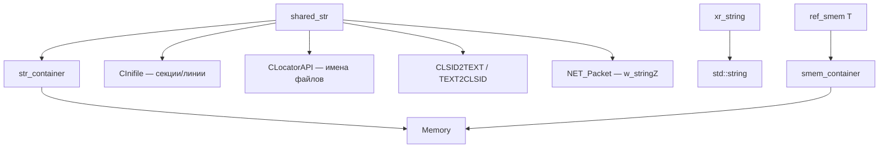
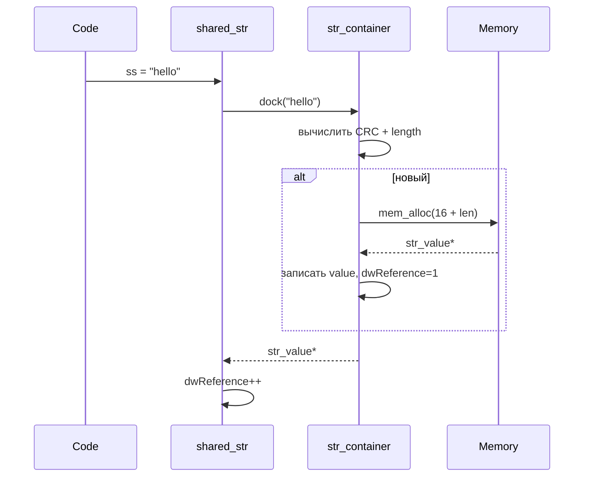

# xrCore: Строки

Два разных механизма: `shared_str` (interned, CRC-based) и `xr_string` (обычный `std::string`).

## Ответственность

- **`shared_str`**: интернированные строки с CRC-идентификатором. Сравнение = сравнение указателей. Основной механизм имён в движке.
- **`xr_string`**: обёртка над `std::string` (см. [Типы и математика](types-math.md) — `vector.h`/`_stl_extensions.h`). Для временных строк и буферов.
- **`smem_container`** (`xrsharedmem.h`): аналогичный механизм, но для **байтовых буферов** (не строк) — `ref_smem<T>`.
- Конкатенации: `strconcat`, `STRCONCAT`, `xr_strconcat` (`string_concatenations.h`).
- Утилиты: `_Trim`, `_GetItem`, `_SequenceToList`, `xr_strlwr`, `IsUTF8`, `UTF8_to_CP1251`.

## Место в архитектуре

Нижний слой. `shared_str` — **фундаментальный тип** для имён файлов, секций INI, секций LTX, CLSID-имён и т.д. (см. [Модель объектов](../../architecture/object-model.md), [INI / конфиги](inifile.md), [Локализатор](locator.md)).

## Публичный API

### `str_value` (внутреннее представление)

```cpp
struct XRCORE_API str_value {
    u32 dwReference;   // счётчик ссылок
    u32 dwLength;      // длина
    u32 dwCRC;         // CRC32 содержимого
    str_value* next;   // для free-list
    char value[];      // Flexible Array Member
};
```

Сравнение: `str_value_cmp` — по `dwCRC` (для set/map). `str_hash_function` — `dwCRC`.

### `str_container` (singleton `g_pStringContainer`)

```cpp
class XRCORE_API str_container {
    xrCriticalSection cs;
    str_container_impl* impl;
public:
    str_value* dock(str_c value);   // интернирование (возвращает nullptr, если value==nullptr)
    void clean();                  // очистить
    void dump();
    void dump(IWriter* W);
    void verify();
    u32 stat_economy(u32& count);
};
extern XRCORE_API str_container* g_pStringContainer;
```

`dock(value)` — находит или создаёт `str_value` в контейнере. **CRC + length** — ключ.

### `shared_str`

```cpp
class shared_str {
    str_value* p_;
    void _set(str_c rhs);       // интернирование через g_pStringContainer->dock
    void _set(shared_str const& rhs);
    const str_value* _get() const;

    shared_str();
    shared_str(str_c rhs);
    shared_str(shared_str const& rhs);
    ~shared_str();

    shared_str& operator=(str_c rhs);
    shared_str& operator=(shared_str const& rhs);

    str_c operator*() const;    // p_->value
    bool operator!() const;     // p_ == 0
    char operator[](size_t id);
    str_c c_str() const;
    u32 size() const;
    void swap(shared_str& rhs);
    bool equal(const shared_str& rhs) const { return (p_ == rhs.p_); }
    shared_str& __cdecl printf(const char* format, ...);  // буфер 4096
};
```

**Важные свойства**:
- **Сравнение операторами `==`/`!=`/`<`/`>` — по указателям** (interned). Разные `shared_str` с одинаковым содержимым **равны** (один `str_value`).
- `xr_strcmp(a, b)` — сначала `equal` (быстрый путь), иначе по содержимому.
- `std::hash<shared_str>` — хеш по `str_value*`.

### Свободные функции

| Функция | Назначение |
|---|---|
| `xr_strlen(shared_str&)` | размер |
| `xr_strcmp(a, b)` (4 перегрузки) | сравнение |
| `xr_strlwr(xr_string&)` | нижний регистр (std) |
| `xr_strlwr(shared_str&)` | нижний регистр (через `xr_strdup`/`xr_free`) |
| `IsUTF8(const char*)` | проверка UTF-8 |
| `UTF8_to_CP1251(xr_string const&)` | конвертация UTF-8 → CP1251 |
| `str_c` | `typedef const char*` |

### `smem_container` / `ref_smem<T>` (`xrsharedmem.h`)

Аналогичный механизм, но для **байтовых массивов** (не строк). `smem_value` — `xr_atomic_u32 dwReference` (атомарный), `dwCRC`, `dwLength`, `u8 value[]`. `ref_smem<T>` — шаблонная обёртка: `create(CRC, length, ptr)`, `operator*` → `T*`, `operator[]` → `T&`.

### Конкатенации (`string_concatenations.h`)

| Функция / макрос | Назначение |
|---|---|
| `strconcat(dest_sz, dest, S1..S6)` | до 6 строк, фиксированный буфер |
| `STRCONCAT(dest, ...)` | variadic, `_alloca`, проверка stack overflow |
| `xr_strconcat(receiver, args...)` | variadic template (C++11), `static_assert` на `char[N]` |

### Утилиты (`xr_trims.h`)

`_Trim`, `_TrimLeft`, `_TrimRight`, `_ChangeSymbol`, `_GetItem`, `_GetItems`, `_SetPos`, `_CopyVal`, `_ParseItem` (token list), `_ReplaceItem(s)`, `_SequenceToList`, `_ListToSequence`, `FloatTimeToStrTime`/`StrTimeToFloatTime`.

## Внутреннее устройство

### Файлы

| Файл | Назначение |
|---|---|
| `xrstring.h` | `shared_str`, `str_value`, `str_container` |
| `xrstring.cpp` | реализация |
| `xrsharedmem.h/.cpp` | `smem_container`, `ref_smem<T>` |
| `string_concatenations.h/.cpp` | конкатенации |
| `xr_trims.h/.cpp` | утилиты строк |
| `dump_string.h/.cpp` | дамп строк (debug) |
| `mezz_stringbuffer.h/.cpp` | буфер строк |

### Механизм интернирования

1. `shared_str::operator=(const char*)` → `_set(str_c)` → `g_pStringContainer->dock(value)`.
2. `dock` вычисляет CRC32 + length, ищет `str_value` с тем же CRC+length (и содержимым — при коллизии CRC).
3. Если не найдена — создаёт новую (выделяет через `Memory.mem_alloc`).
4. `dwReference++`.

### CRC-идентификация

`dwCRC` — CRC32 содержимого. **Коллизии CRC разрешены** (разные строки с одинаковым CRC — разные `str_value`, но `str_value_cmp` по одному только CRC). Точное сравнение — по содержимому (`smem_equal`-подобная логика).

## Взаимодействие



- **Кто использует**: `CInifile` (имена секций/линий), `CLocatorAPI` (имя файла в `archive.path`), `NET_Packet` (`w_stringZ`/`r_stringZ`), `CLASS_ID` (текстовое представление), Lua-биндинг (имена).
- **Зависимости**: `Memory`, `CRC32` (`crc32.cpp`), `xrSyncronize` (critical section).

## Потоки данных



## Конфигурация

- Глобальный: `g_pStringContainer` — инициализируется при загрузке DLL (конструктор).
- `PROFILE_CRITICAL_SECTIONS` — именованный критсек `str_container`.

## Ограничения / дебаг

- **`shared_str` — не для временных строк**. Каждое присваивание = `dock` (CRC + поиск). Для буферов — `xr_string` или `string16..string4096`.
- **Сравнение `==` = указатель**. Если строка ещё не интернирована (другой `shared_str` с тем же содержимым, но созданный до интернирования первого) — **могут быть разные указатели**. На практике: одинаковое содержимое → один `str_value` → один указатель.
- `operator[]` **без проверки границ** — `p_->value[id]`.
- `printf` — буфер 4096, обрезка без ошибки.
- `UTF8_to_CP1251` — если строка не UTF-8 или конвертация не удалась → возвращает исходную.
- `smem_container` — `dwReference` атомарный (`xr_atomic_u32`), т.е. `ref_smem<T>` thread-safe по счётчику.
