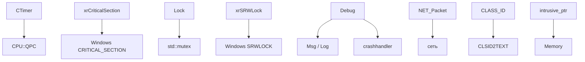
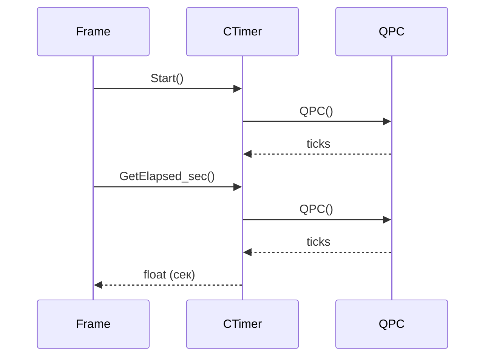

# xrCore: Временны́е/системные

Таймеры, синхронизация, CPU, отладка, misc.

## Ответственность

- **Таймеры** (`FTimer.h`): `CTimerBase`, `CTimer`, `CTimer_paused`, `CStatTimer`, `pauseMngr`.
- **Синхронизация** (`xrSyncronize.h`, `Lock.hpp`, `ScopeLock.hpp`): критические секции, RAII-guard'ы, SRW-locks.
- **CPU** (`_math.h`, `cpuid.h`): `CPU::QPC()`, `CPU::GetCLK()`, `_processor_info`, `_initialize_cpu`.
- **Отладка** (`xrDebug.h`, `xrDebug_macros.h`): `Debug.fail`, `R_ASSERT`, `VERIFY`, `FATAL`, `soft_fail`.
- **Misc**: `clsid.h` (CLASS_ID), `intrusive_ptr.h`, `net_utils.h` (NET_Packet), `profiler.h`, `crc32.cpp`, `xrPool.h`, `SubAlloc.hpp`.

## Место в архитектуре

Нижний слой. Эти компоненты — **инфраструктура**, используемая всеми другими модулями.

## Публичный API

### Таймеры

#### `CTimerBase`

```cpp
class XRCORE_API CTimerBase {
    u64 qwStartTime, qwPausedTime, qwPauseAccum;
    bool bPause;
public:
    ICF void Start();
    ICF u64 GetElapsed_ticks() const;
    ICF u32 GetElapsed_ms() const;
    ICF float GetElapsed_sec() const;  // FPU m64 → float
    ICF void Dump() const;  // Msg
};
```

Основано на `CPU::QPC()` (QueryPerformanceCounter).

#### `CTimer` (с time factor)

```cpp
class XRCORE_API CTimer : public CTimerBase {
    float m_time_factor;  // масштаб времени (1.0 = реалтайм)
    u64 m_real_ticks, m_ticks;
public:
    ICF void Start();
    ICF const float& time_factor() const;
    ICF void time_factor(const float& tf);  // изменить масштаб
    ICF u64 GetElapsed_ticks() const;
    ICF u32 GetElapsed_ms() const;
    ICF float GetElapsed_sec() const;
};
```

`time_factor(2.0)` — время идёт в 2 раза быстрее.

#### `CTimer_paused_ex` / `CTimer_paused`

```cpp
class XRCORE_API CTimer_paused_ex : public CTimer {
    u64 save_clock;
public:
    ICF bool Paused() const;
    ICF void Pause(bool b);  // пауза/резюме
};

class XRCORE_API CTimer_paused : public CTimer_paused_ex {
public:
    CTimer_paused() { g_pauseMngr().Register(*this); }
    ~CTimer_paused() { g_pauseMngr().UnRegister(*this); }
};
```

#### `pauseMngr`

```cpp
class XRCORE_API pauseMngr {
    xr_vector<CTimer_paused*> m_timers;
    bool m_paused;
public:
    bool Paused() { return m_paused; }
    void Pause(bool b);  // пауза всех зарегистрированных
    void Register(CTimer_paused& t);
    void UnRegister(CTimer_paused& t);
};
extern XRCORE_API pauseMngr& g_pauseMngr();
```

#### `CStatTimer`

```cpp
extern XRCORE_API BOOL g_bEnableStatGather;
class XRCORE_API CStatTimer {
    CTimer T;
    u64 accum; float result; u32 count;
public:
    void FrameStart(); void FrameEnd();
    ICF void Begin();  // если g_bEnableStatGather
    ICF void End();
    ICF u64 GetElapsed_ticks() const;
    ICF u32 GetElapsed_ms() const;
    ICF float GetElapsed_sec() const;
};
```

Счётчик времени по кадрам (статистика).

### Синхронизация

#### `xrCriticalSection`

```cpp
class XRCORE_API xrCriticalSection : xray::noncopyable {
    void* pmutex;
public:
    class raii {  // RAII
        xrCriticalSection* critical_section;
    public:
        raii(xrCriticalSection*);
        ~raii();
    };
    xrCriticalSection();  // или с id при PROFILE_CRITICAL_SECTIONS
    ~xrCriticalSection();
    void Enter();
    void Leave();
    BOOL TryEnter();
    bool IsValid();
};
```

#### `xrCriticalSectionGuard` (RAII)

```cpp
class xrCriticalSectionGuard : xray::noncopyable {
    xrCriticalSection* critical_section;
public:
    void Enter(); void Leave();
    xrCriticalSectionGuard(xrCriticalSection* cs);
    xrCriticalSectionGuard(xrCriticalSection& cs);
    ~xrCriticalSectionGuard();  // Leave
};
```

#### `xrCriticalSectionTryGuard` (non-blocking)

```cpp
class xrCriticalSectionTryGuard : xray::noncopyable {
    xrCriticalSection* critical_section;
    bool owned;
public:
    xrCriticalSectionTryGuard(xrCriticalSection* cs);
    xrCriticalSectionTryGuard(xrCriticalSection& cs);
    bool owns_lock() const;
    ~xrCriticalSectionTryGuard();  // Leave если owned
};
```

#### `xrSRWLock` (Reader-Writer)

```cpp
class XRCORE_API xrSRWLock {
    SRWLOCK smutex;
public:
    void AcquireExclusive(); void ReleaseExclusive();
    void AcquireShared(); void ReleaseShared();
    BOOL TryAcquireExclusive(); BOOL TryAcquireShared();
};

class XRCORE_API xrSRWLockGuard {
    xrSRWLock* lock; bool shared;
public:
    xrSRWLockGuard(xrSRWLock& lock, bool shared = false);
    xrSRWLockGuard(xrSRWLock* lock, bool shared = false);
    ~xrSRWLockGuard();
};
```

#### `Lock` (простой)

```cpp
class Lock : xray::noncopyable {
    struct LockImpl* impl;
    std::atomic_int lockCounter;
public:
    Lock();
    ~Lock();
    void Enter();
    bool TryEnter();
    void Leave();
    bool IsLocked() const;
};

class ScopeLock : xray::noncopyable {  // RAII
    Lock* syncObject;
public:
    ScopeLock(Lock* SyncObject);
    ~ScopeLock();
};
```

### CPU

#### `CPU` namespace (`_math.h`)

```cpp
namespace CPU {
    extern u32 clk_per_second;
    extern u32 clk_per_milisec;
    extern u32 clk_per_microsec;
    extern u32 qpc_freq;
    extern u32 qpc_overhead;
    extern _processor_info ID;

    IC u64 QPC();      // QueryPerformanceCounter
    IC u64 GetCLK();   // RDTSC
}
```

#### `_processor_info` (`cpuid.h`)

Заполняется `CPUID` при старте:
- VENDOR, Family, Model, Stepping
- Флаги: SSE, SSSE3, SSE2, SSE3, SSE4.1, SSE4.2, AVX, AVX2
- `clk_per_second`, `clk_per_milisec`, `clk_per_microsec`
- `qpc_freq`, `qpc_overhead`

`_initialize_cpu()` — вызывается из `xrCore::_initialize` (после `Memory._initialize`).

### Отладка

#### `xrDebug` (singleton `Debug`)

```cpp
class XRCORE_API xrDebug {
    crashhandler* handler;
    on_dialog* m_on_dialog;
public:
    void _initialize(const bool& dedicated);
    void _destroy();
    crashhandler* get_crashhandler();
    void set_crashhandler(crashhandler* _handler);
    on_dialog* get_on_dialog();
    void set_on_dialog(on_dialog* on_dialog);
    LPCSTR error2string(long code);
    void gather_info(...);
    void fail(const char* e1, const char* file, int line, const char* function, bool& ignore_always);
    // ... перегрузки fail (e2, e3, e4)
    void soft_fail(LPCSTR e1, ...);  // не падает, только лог
    void error(long code, ...);
    void _cdecl fatal(const char* file, int line, const char* function, const char* F, ...);
    void backend(const char* reason, ...);
    void do_exit(const std::string& message);
};
extern XRCORE_API xrDebug Debug;
XRCORE_API void LogStackTrace(LPCSTR header);
```

#### Макросы (`xrDebug_macros.h`)

| Макрос | Назначение |
|---|---|
| `R_ASSERT(expr)` | `Debug.fail` при `!expr` |
| `R_ASSERT2/3/4(expr, e2, ...)` | с доп. сообщениями |
| `R_CHK(expr)` | `Debug.error` при `FAILED(hr)` (HRESULT) |
| `FATAL(desc)` | `Debug.fatal` |
| `VERIFY(expr)` | debug: `Debug.fail`; release: `soft_fail` или пустой (см. ниже) |
| `VERIFY2/3/4` | с доп. сообщениями |
| `CHK_DX(expr)` | debug: `Debug.error`; release: пустой |
| `NODEFAULT` | `FATAL("nodefault reached")` или `__assume(0)` |
| `CHECK_OR_EXIT(expr, msg)` | `Debug.do_exit` |
| `TODO(x)`, `FIXME(x)` | `#pragma message` |
| `STATIC_CHECK(expr, msg)` | compile-time |

**Режимы `VERIFY`**:
- `DEBUG` + `NON_FATAL_VERIFY` → `soft_fail` (не падает).
- `DEBUG` (без `NON_FATAL_VERIFY`) → `fail` (падает).
- Release + `USE_VERIFY_IN_RELEASE` → `soft_fail`.
- Release (без) → пустой.

### Misc

#### `CLASS_ID` (`clsid.h`)

```cpp
typedef u64 CLASS_ID;
#define MK_CLSID(a,b,c,d,e,f,g,h) CLASS_ID(...)
#define MK_CLSID_INV(a,b,c,d,e,f,g,h) MK_CLSID(h,g,f,e,d,c,b,a)
extern XRCORE_API void __stdcall CLSID2TEXT(CLASS_ID id, LPSTR text);
extern XRCORE_API CLASS_ID __stdcall TEXT2CLSID(LPCSTR text);
```

8-байтовый ID (8 × u8). `CLSID2TEXT`/`TEXT2CLSID` — текстовое представление.

#### `intrusive_ptr` (`intrusive_ptr.h`)

См. [Строки](strings.md) — `intrusive_ptr<T>` — intrusive smart pointer (C++17). `intrusive_base`, `intrusive_base_deferred`, `intrusive_base_strict`.

#### `NET_Packet` (`net_utils.h`)

```cpp
const u32 NET_PacketSizeLimit = 16 * 1024;
struct NET_Buffer { BYTE data[NET_PacketSizeLimit]; u32 count; };

class XRCORE_API NET_Packet {
    IIniFileStream* inistream;
    NET_Buffer B;
    u32 r_pos; u32 timeReceive; bool w_allow;
public:
    void construct(const void* data, unsigned size);
    IC void write_start();
    IC void w_begin(u16 type);
    IC void w(const void* p, u32 count);
    void w_seek(u32 pos, const void* p, u32 count);
    IC u32 w_tell();
    IC void w_float, w_vec3, w_vec4, w_u64, w_s64, w_u32, w_s32, w_u16, w_s16, w_u8, w_s8;
    IC void w_float_q16, w_float_q8, w_angle16, w_angle8, w_dir, w_sdir;
    IC void w_stringZ(LPCSTR S); IC void w_stringZ(const shared_str& p);
    IC void w_matrix(Fmatrix& M);
    IC void w_clientID(ClientID& C);
    IC void w_chunk_open8/16(u32& position);
    IC void w_chunk_close8/16(u32 position);
    void read_start();
    u32 r_begin(u16& type);
    void r_seek(u32 pos); u32 r_tell();
    IC void r(void* p, u32 count);
    BOOL r_eof(); u32 r_elapsed(); void r_advance(u32 size);
    void r_vec3, r_vec4, r_float, r_u64, r_s64, r_u32, r_s32, r_u16, r_s16, r_u8, r_s8;
    Fvector r_vec3(); Fvector4 r_vec4(); float r_float(); u64 r_u64(); ...
    void r_stringZ(LPSTR S); void r_stringZ(xr_string&); void r_stringZ(shared_str&);
    void skip_stringZ();
    void r_matrix(Fmatrix& M); void r_clientID(ClientID& C);
};
```

Бинарный пакет для сети (16 КБ лимит). `w_*`/`r_*` — аналогично `IWriter`/`IReader`, но с `INI_W` (дублирование в INI-файл для отладки).

#### `ClientID` (`client_id.h`)

```cpp
class ClientID {
    u32 id;
public:
    u32 value() const; void set(u32 v);
    bool compare(u32 v) const;
    bool operator ==, !=, <;
};
```

#### `profiler.h`

```cpp
#define PROFILER_NONE   (0)
#define PROFILER_OPTICK (1)
#if !defined(XRCORE_PROFILER)
    #define XRCORE_PROFILER PROFILER_NONE
#endif
// макросы: PROF_THREAD, PROF_FRAME, PROF_EVENT, START_PROFILE, STOP_PROFILE
```

#### `crc32.cpp`

```cpp
XRCORE_API u32 crc32(const void* P, u32 len);
XRCORE_API u32 crc32(const void* P, u32 len, u32 starting_crc);
XRCORE_API u32 path_crc32(const char* path, u32 len);
```

#### `xrPool.h`

```cpp
template <class T, int granularity>
class poolSS {
    T* list;
    xr_vector<T*> blocks;
public:
    T* create();  // placement new
    void destroy(T*& P);
    void clear();
};
```

Pool с фиксированным размером (granularity).

## Внутреннее устройство

### Файлы

| Файл | Назначение |
|---|---|
| `FTimer.h/.cpp` | таймеры |
| `xrSyncronize.h/.cpp` | критические секции |
| `Lock.hpp/.cpp` | `Lock` |
| `ScopeLock.hpp/.cpp` | `ScopeLock` |
| `_math.h/.cpp` | `CPU`, `_initialize_cpu`, FPU |
| `cpuid.h/.cpp` | `_processor_info` |
| `xrDebug.h/.cpp` | `xrDebug` |
| `xrDebug_macros.h` | макросы |
| `xrDebugNew.cpp` | альтернативная реализация |
| `clsid.h/.cpp` | CLASS_ID |
| `intrusive_ptr.h` | intrusive smart pointer |
| `net_utils.h/.cpp` | NET_Packet |
| `client_id.h` | ClientID |
| `profiler.h` | profiler |
| `crc32.cpp` | CRC32 |
| `xrPool.h` | pool |
| `SubAlloc.hpp` | PPMd sub-allocator |
| `memory_monitor.h/.cpp` | debug-мониторинг |
| `xrMEMORY_POOL.h`, `xrMemory_POOL.cpp` | MEMPOOL (см. [Память](memory.md)) |
| `xrMemory_pso.h` + `pso_*.cpp` | PSO (см. [Память](memory.md)) |
| `xr_shared.h/.cpp` | misc |
| `xr_resource.h` | ресурс |
| `xrCore_platform.h` | платформенные определения |
| `ChooseTypes.H` | выбор типов |
| `resource.h` | ресурс |
| `FixedMap.h`, `FixedSet.h`, `FixedVector.h` | фиксированные контейнеры |
| `buffer_vector.h/.inline` | буферный вектор |
| `_noncopyable.h` | `xray::noncopyable` |
| `_type_traits.h` | type traits |
| `_thread_types.h` | атомарные типы |
| `_flags.h` | `Flags8/16/32/64` |
| `_random.h` | RNG |
| `_bitwise.h` | bitwise операции |
| `_color.h` | Fcolor |
| `_compressed_normal.h/.cpp` | `pvCompress`/`pvDecompress` |

## Взаимодействие



- **Кто использует**: все модули (таймеры, синхронизация, отладка).
- **Зависимости**: Windows API, `CPU`, `Memory`, `Msg`.

## Потоки данных



## Конфигурация

- `PROFILE_CRITICAL_SECTIONS` — именованные критсек'ы (профилирование).
- `CONFIG_PROFILE_LOCKS` — профилирование `Lock`.
- `XRCORE_PROFILER` — `PROFILER_NONE` / `PROFILER_OPTICK`.
- `NON_FATAL_VERIFY` — `VERIFY` не падает (debug).
- `USE_VERIFY_IN_RELEASE` — `VERIFY` в release (soft_fail).
- `ANONYMOUS_BUILD` — скрыть имена файлов/функций в отладке.

## Ограничения / дебаг

- **`CTimer`** — не thread-safe (один таймер на поток).
- **`pauseMngr`** — глобальный (все `CTimer_paused` в одном менеджере).
- **`xrCriticalSection`** — Windows CRITICAL_SECTION (не рекурсивный).
- **`Lock`** — `std::mutex` (C++11), рекурсивный (через `lockCounter`).
- **`NET_Packet`** — 16 КБ лимит, не thread-safe.
- **`Debug.fail`** — падает (crash). `soft_fail` — только лог.
- **`CPU::QPC`** — `QueryPerformanceCounter` (высокая точность, но `qpc_overhead` — калибровка).
- **`intrusive_ptr`** — C++17, `static_assert` на `intrusive_base_marker`.
