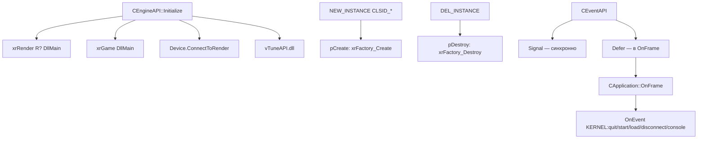
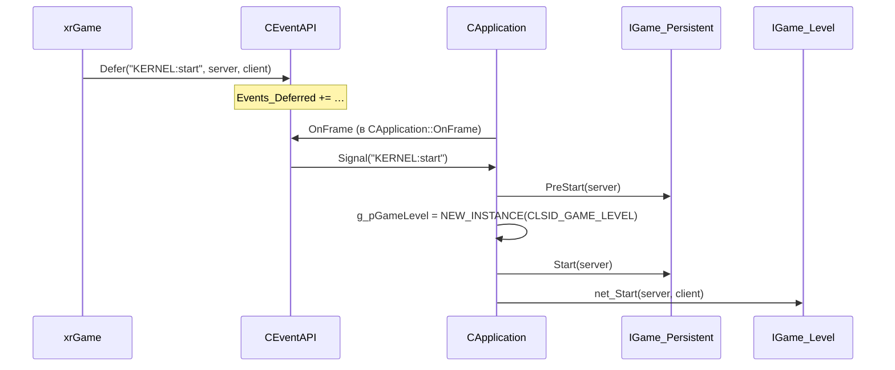

# xrEngine: API и события

`CEngineAPI` — загрузка расширений (рендерер, игра, тюнер) и фабрика объектов. `CEventAPI` — событийная шина с defer.

## Ответственность

- `CEngineAPI` (`EngineAPI.h` / `EngineAPI.cpp`) — поднимает `xrRender_R?` и `xrGame`, выставляет `pCreate`/`pDestroy` (фабрика), опрашивает поддержку рендереров, подключает Intel vTune.
- `CEventAPI` (`EventAPI.h` / `EventAPI.cpp`) — именованные события с реф-счётчиком, `Signal` (синхронно) и `Defer` (до `OnFrame`).

## Место в архитектуре

- `CEngineAPI` — **мост между ядром и расширениями**. Всё, что живёт в `xrRender`/`xrGame`/`xrServer`, поднимается через него.
- `CEventAPI` — **межмодульная шина**: `xrGame`/`xrServer` шлют `KERNEL:*`, `CApplication` (см. [Ядро](engine.md)) и рендерер принимают.

## Публичный API

### CEngineAPI

```cpp
// EngineAPI.h
class ENGINE_API CEngineAPI
{
    HMODULE hTuner;
public:
    Factory_Create* pCreate;        // xrFactory_Create
    Factory_Destroy* pDestroy;       // xrFactory_Destroy
    BOOL tune_enabled;
    VTPause*  tune_pause;
    VTResume* tune_resume;
    void Initialize();
#ifndef DEDICATED_SERVER
    void InitializeNotDedicated();
#endif
    void Destroy();
    void CreateRendererList();
};

#define NEW_INSTANCE(a) Engine.External.pCreate(a)
#define DEL_INSTANCE(a) { Engine.External.pDestroy(a); a=NULL; }
```

```cpp
// тип фабричных функций (EngineAPI.h)
typedef DLL_API DLL_Pure* __cdecl Factory_Create(CLASS_ID CLS_ID);
typedef DLL_API void __cdecl Factory_Destroy(DLL_Pure* O);
typedef void __cdecl VTPause(void);
typedef void __cdecl VTResume(void);
```

### CEventAPI

```cpp
// EventAPI.h
class ENGINE_API IEventReceiver
{
public:
    virtual void OnEvent(EVENT E, u64 P1, u64 P2) = 0;
};

class ENGINE_API CEventAPI
{
    xr_vector<EVENT> Events;
    xr_vector<Deferred> Events_Deferred;
    xrCriticalSection CS;
public:
    EVENT Create(const char* N);
    void  Destroy(EVENT& E);

    EVENT Handler_Attach(const char* N, IEventReceiver* H);
    void  Handler_Detach(EVENT& E, IEventReceiver* H);

    void  Signal(EVENT E, u64 P1 = 0, u64 P2 = 0);
    void  Signal(LPCSTR E, u64 P1 = 0, u64 P2 = 0);
    void  Defer(EVENT E, u64 P1 = 0, u64 P2 = 0);
    void  Defer(LPCSTR E, u64 P1 = 0, u64 P2 = 0);

    void  OnFrame();
    void  Dump();
    BOOL  Peek(LPCSTR EName);
    void  _destroy();
};
```

## Внутреннее устройство

### Файлы

| Файл | Назначение |
|---|---|
| `EngineAPI.h` / `EngineAPI.cpp` | `CEngineAPI`, `DLL_Pure`, `Factory_*`, `VTPause/VTResume` |
| `EventAPI.h` / `EventAPI.cpp` | `CEventAPI`, `CEvent`, `IEventReceiver` |

### DLL_Pure — базовый тип фабрики

```cpp
// EngineAPI.h
class ENGINE_API DLL_Pure
{
public:
    CLASS_ID CLS_ID;
    DLL_Pure(void* params) { CLS_ID = 0; }
    DLL_Pure() { CLS_ID = 0; }
    virtual DLL_Pure* _construct() { return this; }
    virtual ~DLL_Pure();
};
```

Любой объект, создаваемый через `NEW_INSTANCE(CLSID_*)`, наследует `DLL_Pure` (прямой или через промежуточные классы). `CLS_ID` — 32-битный идентификатор класса (см. `std_classes.h` в [Ядре](engine.md)).

### CEngineAPI::Initialize

```cpp
void CEngineAPI::Initialize(void)
{
    // 1. рендерер (R1..R4) — зависит от STATIC_RENDERER_R?
#ifndef DEDICATED_SERVER
    InitializeNotDedicated();      // R2/R3/R4
#endif
#ifdef STATIC_RENDERER_R1
    DllMainXrRenderR1(NULL, DLL_PROCESS_ATTACH, NULL);
    g_current_renderer = 1;
#endif
    Device.ConnectToRender();      // Device <-> IRenderDeviceRender

    // 2. игра
    DllMainXrGame(NULL, DLL_PROCESS_ATTACH, NULL);
    pCreate  = xrFactory_Create;
    pDestroy = xrFactory_Destroy;
    R_ASSERT(pCreate && pDestroy);

    // 3. vTune (опционально, -tune)
    tune_enabled = FALSE;
    if (strstr(Core.Params, "-tune"))
    {
        hTuner = LoadLibrary("vTuneAPI.dll");
        R_ASSERT2(hTuner, "Intel vTune is not installed");
        tune_enabled = TRUE;
        tune_pause  = (VTPause*)  GetProcAddress(hTuner, "VTPause");
        tune_resume = (VTResume*) GetProcAddress(hTuner, "VTResume");
    }
}
```

`g_current_renderer` — `ENGINE_API int`, читается из консоли (`renderer …`).

### CEngineAPI::InitializeNotDedicated

Поднимает один из R2/R3/R4 (по `STATIC_RENDERER_R?`) и выставляет `psDeviceFlags.rsR2/rsR3/rsR4`. В Monolith рендерер выбирается **компиляцией** (один `STATIC_RENDERER_R?`), а не рантайм-поиском.

### CEngineAPI::CreateRendererList

Заполняет `vid_quality_token` (`xr_alloc<xr_token>(N)`) — список доступных рендереров для меню. Для dedicated-сборки — только `renderer_r1`. Для клиентской сборки опрашивает каждый поднятый рендерер через `Supports*Rendering()`:

```cpp
extern "C" bool SupportsAdvancedRendering();  // R2
extern "C" bool SupportsDX10Rendering();      // R3
extern "C" bool SupportsDX11Rendering();      // R4
```

Флаг `-perfhud_hack` принудительно включает все режимы.

### CEngineAPI::Destroy

```cpp
void CEngineAPI::Destroy(void)
{
    DllMainXrGame(NULL, DLL_PROCESS_DETACH, NULL);
    DLL_MAIN_RENDERER(NULL, DLL_PROCESS_DETACH, NULL);
    pCreate = pDestroy = 0;
    Engine.Event._destroy();
    XRC.r_clear_compact();   // сброс кэша .xrc
}
```

### CEvent — внутренняя структура

```cpp
// EventAPI.cpp
class ENGINE_API CEvent
{
    char* Name;                 // _strupr
    xr_vector<IEventReceiver*> Handlers;
    u32 dwRefCount;
public:
    LPCSTR GetFull();
    u32    RefCount();
    BOOL   Equal(CEvent& E);    // stricmp
    void   Attach(IEventReceiver* H);   // без дублей
    void   Detach(IEventReceiver* H);
    void   Signal(u64 P1, u64 P2);       // для всех Handlers
};
```

Имя события **нормализуется в верхний регистр** (`_strupr`). Поэтому `KERNEL:quit` и `kernel:quit` — одно и то же.

### CEventAPI: Create / Destroy / Handler_Attach / Handler_Detach

```cpp
EVENT CEventAPI::Create(const char* N)
{
    CS.Enter();
    CEvent E(N);
    for (auto& I : Events)
        if (I->Equal(E)) { I->dwRefCount++; CS.Leave(); return I; }
    EVENT X = xr_new<CEvent>(N);
    Events.push_back(X);
    CS.Leave();
    return X;
}

void CEventAPI::Destroy(EVENT& E)
{
    CS.Enter();
    E->dwRefCount--;
    if (E->dwRefCount == 0)
    {
        auto I = std::find(Events.begin(), Events.end(), E);
        R_ASSERT(I != Events.end());
        Events.erase(I);
        xr_delete(E);
    }
    CS.Leave();
}
```

Реф-счётчик = количество активных `Handler_Attach` + количество `Defer` + временные `Create`/`Signal(LPCSTR)`/`Destroy`. Пока > 0 — событие живёт.

### Signal vs Defer

- `Signal(E, P1, P2)` — **синхронно** вызывает `OnEvent` у всех обработчиков. Блокирует `CS`.
- `Defer(E, P1, P2)` — кладёт в `Events_Deferred`, обработчик вызовется в `OnFrame` (т.е. в следующем кадре, в `CApplication::OnFrame`).

```cpp
void CEventAPI::OnFrame()
{
#ifdef DEBUG
    msRead();   // чтение из файла консоли (debug)
#endif
    CS.Enter();
    if (Events_Deferred.empty()) { CS.Leave(); return; }
    for (auto& DEF : Events_Deferred)
    {
        Signal(DEF.E, DEF.P1, DEF.P2);
        Destroy(Events_Deferred[I].E);   // сброс дефер-рефа
    }
    Events_Deferred.clear();
    CS.Leave();
}
```

`Peek(name)` — проверяет, есть ли отложенное событие с таким именем (без удаления).

### Типичный поток: «открыть уровень»

```
xrGame (или консоль)
  └─ Engine.Event.Defer("KERNEL:start", server, client)
CApplication::OnFrame (в следующем кадре)
  └─ Engine.Event.OnFrame
       └─ Signal("KERNEL:start")
            └─ CApplication::OnEvent(eStart)
                 └─ g_pGamePersistent->PreStart/Start
                 └─ g_pGameLevel = NEW_INSTANCE(CLSID_GAME_LEVEL)
                 └─ g_pGameLevel->net_Start(server, client)
```

## Взаимодействие



- **Кто вызывает `CEngineAPI::Initialize`**: `WinMain_impl` (см. [Ядро](engine.md)).
- **Кто вызывает `NEW_INSTANCE`**: `Startup` (`CLSID_GAME_PERSISTANT`), `CApplication::OnEvent` (`CLSID_GAME_LEVEL`), `xrGame` (объекты уровня, HUD-менеджер).
- **Кто шлёт `KERNEL:*`**: `xrGame`, `xrServer`, консоль (`Console->Execute`).
- **Кто принимает `KERNEL:*`**: `CApplication` (всегда), `xrGame` (опционально, через `Handler_Attach`).

## Потоки данных



## Конфигурация

- `-tune` — подключить `vTuneAPI.dll` (Intel VTune).
- `-perfhud_hack` — `CreateRendererList` включает все режимы.
- `STATIC_RENDERER_R1..R4` — **компиляционный** выбор рендерера (один).
- `DEDICATED_SERVER` — отключает `InitializeNotDedicated` и весь клиентский путь.

## Ограничения / дебаг

- `pCreate`/`pDestroy` — **одни на процесс**; фабрика не расширяется в рантайме.
- `CEventAPI` — **thread-safe** (защищено `CS`), но `OnEvent` вызывается **под** критсекцией: длинный `OnEvent` блокирует всю шину.
- `Signal(LPCSTR)` создаёт временное событие и сразу уничтожает — не для частого использования.
- `Defer` **не гарантирует порядок** относительно других `Defer` в том же кадре — порядок = порядок вызова `Defer`.
- `Peek` — только по `Events_Deferred`, не по `Events`.
- `CEventAPI::Dump` — сортирует `Events` по имени (не по реф-счётчику).
- `DLL_Pure` — **не** `COM IUnknown`: нет `AddRef/Release`, только `CLS_ID`.
- `NEW_INSTANCE` / `DEL_INSTANCE` — макросы, не функции: `DEL_INSTANCE` обнуляет указатель.
- `vid_quality_token` — глобальный буфер, освобождается в `~CEngineAPI` (то есть в конце процесса).
