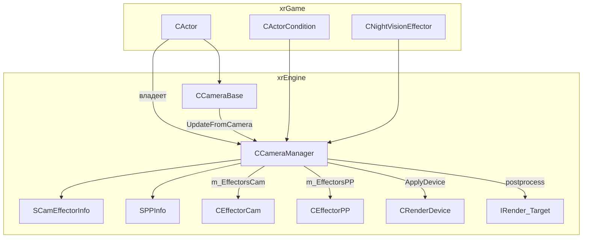
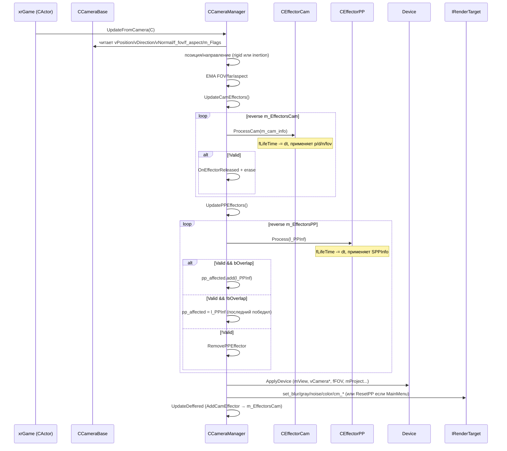
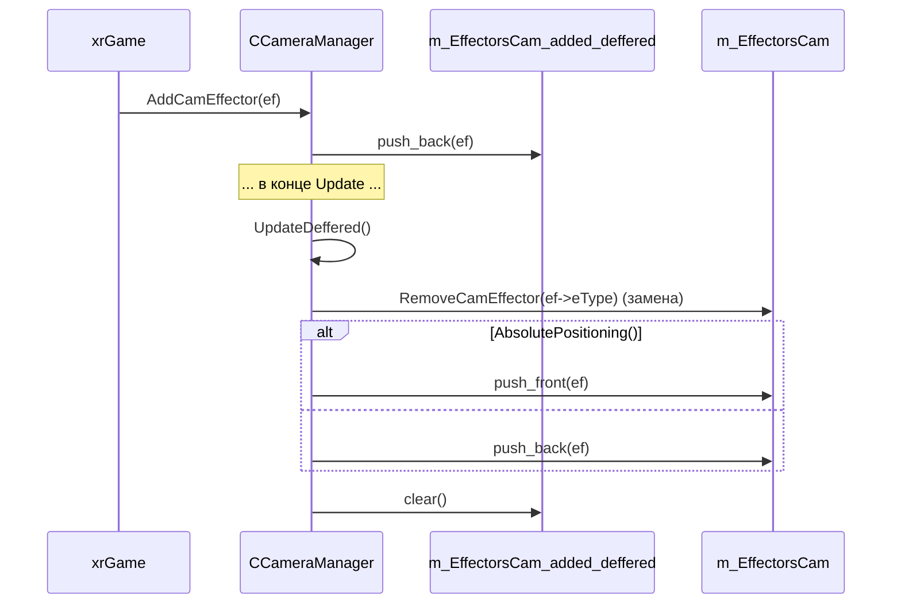

# Камера

**Камера** — подсистема `xrEngine`, которая превращает «сценарную» камеру (`CCameraBase`, задаёт позицию/направление/FOV из игровой логики) в фактические матрицы и параметры рендера (`CCameraManager` → `Device`). Здесь же — **эффекторы**: временные модификаторы камеры и постобработки (полный разбор эффекторов — [Эффекторы](effector.md)).

`CCameraManager` живёт **на актёра** (xrGame): один экземпляр — один «взглядуемый» персонаж. Сам `CCameraBase` — лёгкая обёртка над `CObject`-родителем: хранит yaw/pitch/roll + ограничения + флаги инерции.

См. [Эффекторы](effector.md), [Device](device.md), [HUD](hud.md), [Цикл кадра](frame-loop.md).

## Ответственность

- **`CCameraBase`** (`src/xrEngine/CameraBase.h/.cpp`) — «сценарная» камера: позиция/направление/normal, yaw/pitch/roll + clamp-ограничения из `pSettings`, стиль (`ECameraStyle`), флаги `flPositionRigid`/`flDirectionRigid` (жёсткая позиция/направление без инерции).
- **`CCameraManager`** (`src/xrEngine/CameraManager.h/.cpp`) — оркестратор кадра: берёт состояние `CCameraBase`, применяет **камерные эффекторы** к `SCamEffectorInfo`, суммирует **PP-эффекторы** в `SPPInfo`, пишет результат в `Device` (матрицы, FOV, aspect, postprocess → `IRender_Target`).
- **`SCamEffectorInfo`** (`src/xrEngine/CameraDefs.h`) — промежуточное состояние камеры, которое «машинят» эффекторы: `p`/`d`/`n`/`r` + `fFov`/`fFar`/`fAspect` + `dont_apply` + `affected_on_hud`.
- **`SPPInfo`** (`src/xrEngine/CameraManager.h`) — состояние постобработки: blur, gray, duality, noise, цвета, color-mapping (cm_*).
- **Глобалы**: `psCamInert` (инерция позиции/направления, `0.f`), `psCamSlideInert` (`0.25f`), `pp_identity` (нейтральное PP), `pp_zero` (нулевое PP).
- **ID эффекторов**: `effCustomEffectorStartID = 10000` — резерв для пользовательских типов (xrGame).

Чего это **НЕ делает**: не рисует — это `xrRender`; не владеет эффекторами — их создаёт/удаляет xrGame, `CCameraManager` лишь хранит указатели и применяет; не управляет временем жизни эффекторов самостоятельно — только `fLifeTime` (см. [Эффекторы](effector.md)).

## Место в архитектуре

`CCameraManager` — узел между игровой камерой (xrGame) и `Device`. `ApplyDevice` — единственный мост в `Device`/`IRender_Target` (см. [Device](device.md)). Постобработка реально применяется xrRender (итерация 3) — `IRender_Target` здесь только получает значения.

## Публичный API

### `CCameraBase` (`src/xrEngine/CameraBase.h`)

| Поле / метод                                                             | Описание                                                                                             |
| ------------------------------------------------------------------------ | ---------------------------------------------------------------------------------------------------- |
| `parent` (`CObject*`)                                                    | родитель (объект, к которому «пришита» камера)                                                       |
| `bClampYaw` / `bClampPitch` / `bClampRoll`                               | clamp-флаги (ставятся из `lim_*` в `Load`)                                                           |
| `yaw` / `pitch` / `roll`                                                 | текущие углы (рад)                                                                                   |
| `flRelativeLink` / `flPositionRigid` / `flDirectionRigid`                | биты `m_Flags` (см. ниже)                                                                            |
| `lim_yaw` / `lim_pitch` / `lim_roll` (`Fvector2`)                        | диапазоны `[min, max]`                                                                               |
| `rot_speed` (`Fvector`)                                                  | скорость поворота                                                                                    |
| `vPosition` / `vDirection` / `vNormal` (`Fvector`)                       | позиция/направление/«вверх»                                                                          |
| `f_fov` / `f_aspect`                                                     | FOV (градусы) и aspect                                                                               |
| `tag`                                                                    | служебный номер                                                                                      |
| `Position()` / `Direction()` / `Up()` / `Right()` / `Fov()` / `Aspect()` | accessors (константные, `Fvector` по значению)                                                       |
| `SetParent(CObject* p)`                                                  | установка родителя (`VERIFY(p)`)                                                                     |
| `Load(section)`                                                          | читает `rot_speed`, `lim_yaw`, `lim_pitch` из `pSettings`; опционально `lim_deg` (градусы → радианы) |
| `OnActivate` / `OnDeactivate` / `Move` / `Update`                        | виртуальные, по умолчанию no-op (переопределяются в xrGame)                                          |
| `Get(P,D,N)` / `Set(P,D,N)`                                              | bulk-чтение/запись `vPosition`/`vDirection`/`vNormal`                                                |
| `Set(Y,P,R)`                                                             | bulk-запись yaw/pitch/roll                                                                           |
| `GetWorldYaw()` / `GetWorldPitch()`                                      | мировые углы (база: `0`)                                                                             |
| `CheckLimYaw()` / `CheckLimPitch()` / `CheckLimRoll()`                   | «насколько близко к границе» (см. ниже)                                                              |

**Флаги `m_Flags`** (используются в `CCameraManager::Update`):

- `flRelativeLink (1<<0)` — относительная привязка к родителю;
- `flPositionRigid (1<<1)` — позиция **без** инерции (жёсткая);
- `flDirectionRigid (1<<2)` — направление/normal **без** инерции.

**`CheckLim*`** — возвращают `0`, если clamp-флаг не установлен; иначе — `AClamp(lim, v) = (2·v − lim[0] − lim[1]) / (lim[1] − lim[0])`, т.е. нормализованное положение внутри диапазона `[0..1]` (0 — на нижней границе, 1 — на верхней). **Внимание**: `CheckLimPitch` и `CheckLimRoll` проверяют `bClampYaw` (copy-paste, см. «Ограничения»).

### `CCameraManager` (`src/xrEngine/CameraManager.h`)

| Метод                                                                            | Описание                                                            |
| -------------------------------------------------------------------------------- | ------------------------------------------------------------------- |
| `CCameraManager(bool bApplyOnUpdate)`                                            | конструктор; `bApplyOnUpdate` — авто-`ApplyDevice` в конце `Update` |
| `Position()` / `Direction()` / `Up()` / `Right()` / `Fov()` / `Aspect()`         | accessors к `m_cam_info`                                            |
| `camera_Matrix(Fmatrix& M)`                                                      | собирает `M` из `m_cam_info` (r/n/d/p)                              |
| `AddCamEffector(CEffectorCam*)`                                                  | добавляет в **deferred** список (`m_EffectorsCam_added_deffered`)   |
| `GetCamEffector(type)`                                                           | поиск по `eType`                                                    |
| `RemoveCamEffector(type)` / `RemoveCamEffector(CEffectorCam*)`                   | удаление по типу / по указателю (demonized)                         |
| `RemoveHudMotionEffectors()`                                                     | удаляет все `IsHudMotionEffector()` из обоих списков                |
| `RequestCamEffectorId()` / `RequestPPEffectorId()`                               | свободный ID начиная с `10000` (линейный поиск)                     |
| `GetPPEffector(type)` / `AddPPEffector(CEffectorPP*)` / `RemovePPEffector(type)` | PP-эффекторы; `Add` сначала **удаляет** существующий того же типа   |
| `Update(P, D, N, fFOV, fASPECT, fFAR, flags)`                                    | основной проход кадра (см. «Внутреннее устройство»)                 |
| `UpdateFromCamera(const CCameraBase* C)`                                         | `Update` из полей камеры + `far_plane` из `Environment`             |
| `ApplyDevice(_viewport_near)`                                                    | запись в `Device` + postprocess                                     |
| `ResetPP()` (static)                                                             | сброс postprocess в `pp_identity`                                   |
| `Count()`                                                                        | `m_EffectorsCam.size() + m_EffectorsCam_added_deffered.size()`      |
| `Dump()`                                                                         | лог позиции/направления/normal/right из `Device.mView`              |

### `SCamEffectorInfo` (`src/xrEngine/CameraDefs.h`)

| Поле                              | Описание                                                 |
| --------------------------------- | -------------------------------------------------------- |
| `p` / `d` / `n` / `r` (`Fvector`) | позиция / направление / «вверх» / «вправо» (базис)       |
| `fFov`                            | FOV (градусы), по умолчанию `90`                         |
| `fFar`                            | дальняя плоскость, по умолчанию `100`                    |
| `fAspect`                         | aspect, по умолчанию `1`                                 |
| `dont_apply`                      | если `true` — `ApplyDevice` **не** вызывается в `Update` |
| `affected_on_hud`                 | влияет ли на HUD-рендер, по умолчанию `true`             |

Копируемый (определён `operator=` вручную).

### `SPPInfo` (`src/xrEngine/CameraManager.h`)

Структура состояния постобработки. Вложенные `SColor` (r/g/b + `operator u32` / `operator const Fvector&`), `SDuality` (h/v), `SNoise` (intensity/grain/fps).

| Поле                                                      | Описание                                                 |
| --------------------------------------------------------- | -------------------------------------------------------- |
| `blur`, `gray`                                            | размытие / ч/б                                           |
| `duality` (h/v)                                           | дивергенция (chromatic aberration)                       |
| `noise` (intensity, grain, fps)                           | шум; по умолчанию `grain=1`, `fps=10`                    |
| `color_base` / `color_gray` / `color_add`                 | цвета (по умолчанию `.5,.5,.5` / `.333,.333,.333` / `0`) |
| `cm_influence` / `cm_interpolate` / `cm_tex1` / `cm_tex2` | color-mapping (влияние, интерполяция, две текстуры)      |

Методы: `add`/`sub` (компонентно; `noise` — `max`, `cm_tex` — «последний победил»), `lerp` (см. ниже), `normalize` (пустая), `validate` (DEBUG-проверки `_valid`).

**Глобалы**: `pp_identity` (нейтраль: `grain=1`, `fps=30`, `color_base=.5`, `color_gray=.333`), `pp_zero` (всё `0`), `psCamInert = 0`, `psCamSlideInert = 0.25`.

## Внутреннее устройство

### `CCameraBase::Load`

Читает из `pSettings[section]`:

- `rot_speed` (`Fvector3`);
- `lim_yaw` / `lim_pitch` (`Fvector2`);
- опционально `lim_deg` (bool) — если `true`, `lim_yaw`/`lim_pitch` переводятся из градусов в радианы;
- `bClampPitch = (lim_pitch != 0)`, `bClampYaw = (lim_yaw != 0)`;
- если clamp — центрирует: `pitch = (lim_pitch[0]+lim_pitch[1])*0.5`, `yaw = (lim_yaw[0]+lim_yaw[1])*0.5`.

### `CCameraManager::Update`

Основной проход (вызывается xrGame один раз за кадр):

1. **Позиция/направление**: если `flPositionRigid` — `m_cam_info.p = P`, иначе `p.inertion(P, psCamInert)`; аналогично для `d`/`n` с `flDirectionRigid`.
2. **Нормализация базиса**: `d.normalize()`, `n.normalize()`, `r = n×d`, `n = d×r`.
3. **EMA FOV/far/aspect**: `src = clamp(10·fTimeDelta, 0, 1)`, `dst = 1−src`; `fFov = fFov·dst + fFOV_Dest·src` (аналогично `fFar`, `fAspect` — с `fASPECT_Dest·aspect`).
4. `m_cam_info.dont_apply = false`.
5. `UpdateCamEffectors()` → `UpdatePPEffectors()`.
6. Если `!dont_apply && m_bAutoApply` → `ApplyDevice(VIEWPORT_NEAR)`.
7. `UpdateDeffered()` (см. ниже).

DEBUG: `VERIFY(dbg_upd_frame != Device.dwFrame)` — «already updated !!!».

### `UpdateCamEffectors`

Итерация `m_EffectorsCam` **в обратном порядке** (reverse iterator). Для каждого:

- `ProcessCameraEffector(eff)`: если `eff->Valid() && eff->ProcessCam(m_cam_info)` → `true`; иначе если `eff->AllowProcessingIfInvalid()` → `eff->ProcessIfInvalid(m_cam_info)` → `false`.
- `false` → `OnEffectorReleased(eff)` + `erase` (через `r_it.base()−1`).

После цикла — повторная нормализация базиса `d`/`n`/`r`.

### `UpdatePPEffectors`

- `pp_affected.validate("before applying pp")`.
- Если `m_EffectorsPP` пуст → `pp_affected = pp_identity`.
- Иначе: `pp_affected = pp_identity`, обратный цикл по `m_EffectorsPP`:
  - `l_PPInf = pp_zero`;
  - если `eff->Valid() && eff->Process(l_PPInf)` → `++_count`;
    - если ещё нет «non-overlap» победителя (`!b`) → `pp_affected.add(l_PPInf); pp_affected.sub(pp_identity);` (т.е. `pp_affected += l_PPInf − pp_identity`);
    - если `!eff->bOverlap` → `b = true`, `pp_affected = l_PPInf` (последний non-overlap «затягивает»);
  - иначе → `RemovePPEffector(eff->Type())`.
- Если `_count == 0` → `pp_affected = pp_identity`; иначе `pp_affected.normalize()`.
- Если `!positive(pp_affected.noise.grain)` → `grain = pp_identity.noise.grain` (защита от деления).
- `pp_affected.validate("after applying pp")`.

### `ApplyDevice(_viewport_near)`

Запись в `Device`:

- `mView.build_camera_dir(p, d, n)`, `mInvView.invert(mView)`;
- `vCameraPosition/Direction/Top/Right` из `m_cam_info`;
- `fFOV = m_cam_info.fFov`, `fASPECT = m_cam_info.fAspect`;
- **SVP (SecondViewport)**: если `Device.m_SecondViewport.IsSVPFrame()` → `fFOV = g_pGamePersistent->m_pGShaderConstants->hud_params.y` (FOV из HUD-шейдерных констант), `isCamReady = true`; иначе `isCamReady = false`;
- `mProject.build_projection(deg2rad(fFOV), fAspect, _viewport_near, fFar)`, `mProjectHud.build_projection(deg2rad(psHUD_FOV·83), fASPECT, R_VIEWPORT_NEAR, fFar)`;
- `mInvProject.invert`, `mInvProjectHud.invert`;
- **postprocess**: если `g_pGamePersistent->m_pMainMenu->IsActive()` → `ResetPP()`; иначе `IRender_Target* T = ::Render->getTarget()`, `T->set_duality_h/v`, `set_blur`, `set_gray`, `set_noise`, `set_noise_scale` (clamp `grain` в `[EPS_L, 1000]`), `set_noise_fps`, `set_color_base/gray/add`, `set_cm_imfluence`, `set_cm_interpolate`, `set_cm_textures(cm_tex1, cm_tex2)`.

### `ResetPP` (static)

Сброс postprocess в `pp_identity`: все `set_*` на `IRender_Target` с полями `pp_identity`, `cm_imfluence=0`, `cm_interpolate=1`, `cm_textures("","")`.

### `UpdateDeffered`

Перенос из `m_EffectorsCam_added_deffered` в `m_EffectorsCam`:

- для каждого `RemoveCamEffector(eff->eType)` (замена старого того же типа);
- `AbsolutePositioning()` → `push_front`, иначе `push_back`;
- `clear()` deferred-список.

**Почему deferred**: `AddCamEffector` кладёт в отдельный список, чтобы не ломать итерацию в `UpdateCamEffectors` (которая идёт по `m_EffectorsCam` reverse). Реальный «вход» в активный список — в конце кадра.

### Жизненный цикл эффекторов

- **Добавление (cam)**: `AddCamEffector` → deferred → `UpdateDeffered` (в конце `Update`) → `m_EffectorsCam` (front если `AbsolutePositioning`, иначе back).
- **Добавление (pp)**: `AddPPEffector` → `RemovePPEffector(ef->Type())` (замена) → `push_back` в `m_EffectorsPP`.
- **Удаление (cam)**: `RemoveCamEffector` (по типу/указателю) или `ProcessCameraEffector` вернул `false` → `OnEffectorReleased` + `erase`.
- **Удаление (pp)**: `RemovePPEffector` → если `FreeOnRemove()` → `OnEffectorReleased` (callback + `xr_delete`), иначе только `erase`; **`xr_delete` в `RemovePPEffector` закомментирован** (см. «Ограничения»).
- **`OnEffectorReleased(e)`**: если `m_on_b_remove_callback` не пуст → вызов; затем `xr_delete(e)`.

### `RequestCam/PPEffectorId`

Линейный поиск свободного ID начиная с `effCustomEffectorStartID = 10000`: `for (index = 10000; GetXxxEffector(index); ++index) ;` → вернуть `index`. **Нет верхней границы** — если заняты все подряд с 10000, поиск идёт до `u32`-переполнения (на практике — нет).

## Взаимодействие

**Кто вызывает `CCameraManager`**:

- **xrGame** (`CActor` и пр.): `Update`/`UpdateFromCamera` (один раз за кадр), `AddCamEffector`/`AddPPEffector` (создание эффекторов), `RemoveCamEffector`/`RemovePPEffector` (явное удаление), `RequestCam/PPEffectorId` (выдача ID), `ApplyDevice` (если `m_bAutoApply == false`), `ResetPP` (статичный), `Dump` (debug).
- **`CCameraBase`** (xrGame-наследники): `UpdateFromCamera(C)` — подаёт `vPosition`/`vDirection`/`vNormal`/`f_fov`/`f_aspect`/`m_Flags`.

**Кого вызывает `CCameraManager`**:

- **`Device`** (`CRenderDevice`): `fTimeDelta`, `fHeight_2`/`fWidth_2` (aspect), `mView`/`mInvView`/`mProject`/`mProjectHud`/`mInvProject`/`mInvProjectHud`, `vCamera*`, `fFOV`/`fASPECT`, `m_SecondViewport`, `Paused()` (DEBUG).
- **`IRender_Target`** (`::Render->getTarget()`): все `set_*` postprocess (реально применяются xrRender, итерация 3).
- **`g_pGamePersistent`**: `Environment().CurrentEnv->far_plane` (в `UpdateFromCamera`), `m_pGShaderConstants->hud_params.y` (SVP FOV), `m_pMainMenu->IsActive()` (в `ApplyDevice`).
- **`CEffectorCam` / `CEffectorPP`**: `ProcessCam`/`Process`, `Valid`, `AllowProcessingIfInvalid`, `ProcessIfInvalid`, `AbsolutePositioning`, `IsHudMotionEffector`, `FreeOnRemove`, `Type`, `eType`.
- **`SPPInfo`**: `add`/`sub`/`lerp`/`validate`/`normalize`.

**`CCameraBase`**:

- **Вызывает**: `pSettings` (в `Load`), `deg2rad` (конвертация `lim_deg`).
- **Его вызывают**: xrGame-наследники (переопределение `OnActivate`/`OnDeactivate`/`Move`/`Update`/`Get`/`Set`), `CCameraManager::UpdateFromCamera`.

## Потоки данных

### Кадр (Update → ApplyDevice)

### Добавление камерного эффектора (deferred)

## Конфигурация

**`CCameraBase::Load(section)`** — читает из `pSettings[section]`:

| Ключ        | Тип           | Описание                                                                  |
| ----------- | ------------- | ------------------------------------------------------------------------- |
| `rot_speed` | `Fvector3`    | скорость поворота                                                         |
| `lim_yaw`   | `Fvector2`    | диапазон `[min, max]` для yaw                                             |
| `lim_pitch` | `Fvector2`    | диапазон для pitch                                                        |
| `lim_deg`   | `bool` (опц.) | если `true` — `lim_yaw`/`lim_pitch` в градусах (конвертируются в радианы) |

**PP-эффекторы** не читают конфиги напрямую — параметры задаются xrGame (через `pSettings`, `CInifile` и т.п.). В `xrEngine` — только каркас. Типичные секции в `pSettings` (xrGame): `effector_psy_health_<level>`, `effector_nightvision`, `pp_eff_*` — см. [Эффекторы](effector.md) → «Конфигурация».

**SVP** (SecondViewport): `Device.m_SecondViewport.IsSVPFrame()` + `g_pGamePersistent->m_pGShaderConstants->hud_params.y` — FOV второго вьюпорта берётся из HUD-шейдерных констант (xrGame), не из `m_cam_info.fFov`.

## Известные ограничения / дебаг

- **`CheckLimPitch` / `CheckLimRoll`** — оба проверяют `bClampYaw` (copy-paste из `CheckLimYaw`), а не свой флаг. Т.е. если `bClampPitch == true` и `bClampYaw == false` → `CheckLimPitch` вернёт `0` (хотя clamp-флаг pitch установлен). Вероятно, исторический баг — на практике `lim_*` ставятся вместе, так что `bClamp*` часто совпадают и баг не проявляется.
- **`RemovePPEffector`** — `xr_delete` **закомментирован**; освобождение идёт только через `OnEffectorReleased`, если `FreeOnRemove()`. При `bFreeOnRemove == false` эффект **не** освобождается при удалении (владелец обязан удалить сам, иначе — утечка; см. [Эффекторы](effector.md)).
- **`RequestCam/PPEffectorId`** — линейный поиск свободного ID с `10000` **без верхней границы**.
- **DEBUG**: `Update` — `VERIFY(dbg_upd_frame != Device.dwFrame)` («already updated !!!»); `SPPInfo::validate` — проверки `_valid` в DEBUG.
- **BENCH_SEC_SCRAMBLE*** — античит-маркеры (секреты), в `CCameraManager` присутствуют только для бенчмарка/античита, в обычной работе не участвуют.
