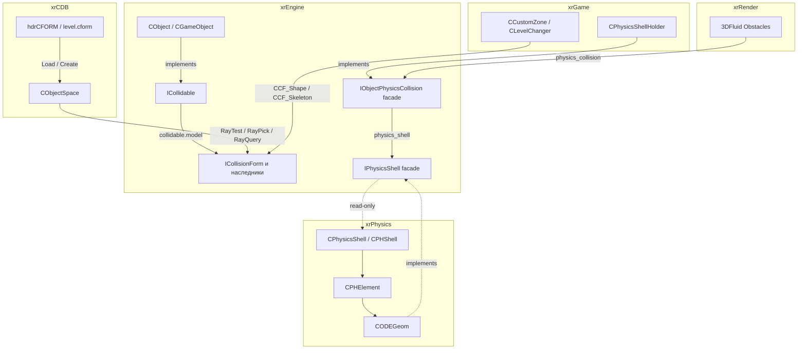
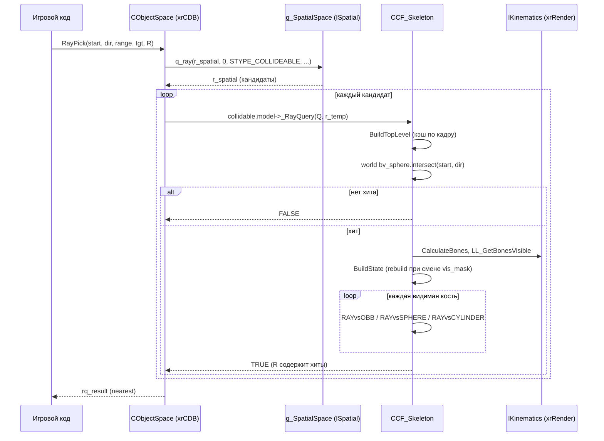
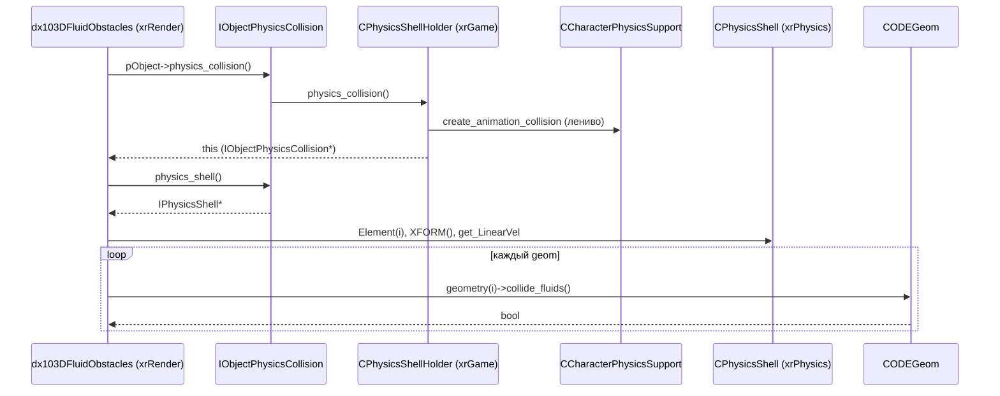

# Коллизии и физика (интерфейсы)

`xr_collide_form` — **формы коллизии** движка: «как объект сталкивается со сценами», не «как объект движется». Два независимых слоя:

- **Collision forms** (`ICollisionForm` и наследники) — примитивная геометрия (кости скелета, шары/боксы), с которой объект участвует в **ray-pick и ray-query** через `CObjectSpace` (xrCDB).
- **Physics-интерфейсы** (`IObjectPhysicsCollision`, `IPhysicsShell`, `IPhysicsElement`, `IPhysicsGeometry`) — узкие read-only фасады к полному ODE-миру `xrPhysics` (`CPhysicsShell`/`CPHShell`), через которые `xrRender` (3D fluids) и `xrGame` (анимационная коллизия персонажей) получают геометрию/скорости без прямого доступа к ODE-объектам.

Чего это **НЕ делает**: не считает траектории, не решает ODE-контакты, не хранит состояние движения — это [Физика (xrPhysics)](../game/physics.md). Не строит статическую модель уровня (`level.cform`) — это xrCDB. Не рисует — только отвечает на «что/где лежит».

## Место в архитектуре



- **`ICollisionForm`** — «коллизия для ray-pick»: грубый тест по bounding-volume, затем точный тест по форме. Используется xrCDB при ray-query'ах.
- **`IPhysicsShell`** — «коллизия для ODE»: read-only фасад на `CPhysicsShell` (полный ODE-объект с элементами, массами, скоростями). Не путать с `ICollisionForm`.

См. [Карта модулей](../../architecture/module-map.md), [Модель объектов](../../architecture/object-model.md), [Рендер-слой](render.md), [Fmesh](fmesh.md), [Физика (xrGame)](../game/physics.md).

## Публичный API

### Классы

| Класс / struct                   | Файл                        | Назначение                                                                                                                          |
| -------------------------------- | --------------------------- | ----------------------------------------------------------------------------------------------------------------------------------- |
| `ICollidable`                    | `ICollidable.h`             | Mixin-обёртка: владеет указателем `collidable.model` на `ICollisionForm`, ставит `STYPE_COLLIDEABLE` в `ISpatial`                   |
| `ICollisionForm`                 | `xr_collide_form.h`         | Абстрактная база формы: `owner`, `bv_box`/`bv_sphere` (local bounding volume), виртуальный `_RayQuery`                              |
| `CCF_Skeleton`                   | `xr_collide_form.h/.cpp`    | Форма для скелетов: по костям (`SBoneShape`: box / sphere / cylinder), ленивое rebuild, грубый + точный ray-pick                    |
| `CCF_EventBox`                   | `xr_collide_form.h/.cpp`    | «Событийный» бокс 1×1×1: 6 плоскостей для `Contact(O)`, `_RayQuery` — заглушка                                                      |
| `CCF_Shape`                      | `xr_collide_form.h/.cpp`    | Форма из произвольных шаров и боксов (локальные), `_RayQuery` и `Contact(O)`                                                        |
| `clQueryCollision`, `clQueryTri` | `xr_collide_form.h`         | Контейнер результатов box/sphere/frustum-запроса: `objects`, `tris`, `boxes`, `spheres`; флаги `clGET_*` / `clQUERY_*`              |
| `IObjectPhysicsCollision`        | `IObjectPhysicsCollision.h` | Фасад: `physics_shell()`, `physics_character()` (deprecated)                                                                        |
| `IPhysicsShell`                  | `IPhysicsShell.h`           | Read-only фасад на ODE shell: `XFORM()`, `Element(i)`, `get_ElementsNumber()`                                                       |
| `IPhysicsElement`                | `IPhysicsShell.h`           | Read-only фасад на ODE element: `XFORM()`, `get_LinearVel/AngularVel`, `get_Box`, `mass_Center()`, `numberOfGeoms()`, `geometry(i)` |
| `IPhysicsGeometry`               | `IPhysicsGeometry.h`        | Read-only фасад на ODE geom: `get_Box(form, sz)`, `collide_fluids()`                                                                |

### Флаги `clQuery*`

```cpp
const u32 clGET_TRIS       = (1 << 0);
const u32 clGET_BOXES      = (1 << 1);
const u32 clGET_SPHERES    = (1 << 2);
const u32 clQUERY_ONLYFIRST = (1 << 3); // stop if was any collision
const u32 clQUERY_TOPLEVEL = (1 << 4); // get only top level of model box/sphere
const u32 clQUERY_STATIC   = (1 << 5); // static
const u32 clQUERY_DYNAMIC  = (1 << 6); // dynamic
const u32 clCOARSE         = (1 << 7); // coarse test (triangles vs obb)
```

### Типы форм

```cpp
enum ECollisionFormType
{
    cftObject,  // CCF_Skeleton — «модель объекта» (кости)
    cftShape,   // CCF_Shape / CCF_EventBox — произвольная форма
};
```

## Внутреннее устройство

### `ICollidable` (mixin)

```cpp
class ENGINE_API ICollidable
{
public:
    struct { ICollisionForm* model; } collidable;
    ICollidable();          // model = NULL; если this — ISpatial → spatial.type |= STYPE_COLLIDEABLE
    virtual ~ICollidable(); // xr_delete(model)
};
```

- Конструктор: `xr_dynamic_cast<ISpatial*>(this)` — если объект уже spatial, сразу помечает его `STYPE_COLLIDEABLE`, чтобы `CObjectSpace::q_box/q_ray` его видели.
- Деструктор: освобождает `collidable.model`.

### `ICollisionForm` (база)

```cpp
class ENGINE_API ICollisionForm
{
    friend class CObjectSpace;
protected:
    CObject* owner;
    u32 dwQueryID;
    Fbox bv_box;       // local BBox
    Fsphere bv_sphere; // local Sphere
private:
    ECollisionFormType m_type;
public:
    ICollisionForm(CObject* _owner, ECollisionFormType tp);
    virtual ~ICollisionForm();

    virtual BOOL _RayQuery(const collide::ray_defs& Q, collide::rq_results& R) = 0;
    //virtual void _BoxQuery(const Fbox& B, const Fmatrix& M, u32 flags) = 0; // закомментировано

    IC CObject* Owner() const { return owner; }
    const Fbox& getBBox() const { return bv_box; }
    float getRadius() const { return bv_sphere.R; }
    const Fsphere& getSphere() const { return bv_sphere; }
    const ECollisionFormType Type() const { return m_type; }
};
```

- `bv_box` / `bv_sphere` — **в локальных координатах объекта** (model space). При ray-query xrCDB сам трансформирует.
- `_RayQuery` — единственный обязательный метод. Флаги `CDB::OPT_CULL`, `CDB::OPT_ONLYFIRST`, `CDB::OPT_ONLYNEAREST` приходят в `Q.flags`.
- `_BoxQuery` — закомментирован (устаревший API, см. `clQueryCollision`).

### `CCF_Skeleton`

Коллизия по **костям скелета** (`IKinematics::LL_GetData(i).shape`).

```cpp
class ENGINE_API CCF_Skeleton : public ICollisionForm
{
public:
    struct ENGINE_API SElement
    {
        union
        {
            struct { Fmatrix b_IM; Fvector b_hsize; };   // box: world-2-bone
            struct { Fsphere s_sphere; };
            struct { Fcylinder c_cylinder; };
        };
        u16 type;     // SBoneShape::stBox | stSphere | stCylinder
        u16 elem_id;  // bone id
    };
    DEFINE_VECTOR(SElement, ElementVec, ElementVecIt);
private:
    u64 vis_mask;        // кэш mask видимых костей
    ElementVec elements; // по видимым костям, отсортирован по elem_id
    u32 dwFrame;         // кадр, на котором построено
    u32 dwFrameTL;       // кадр top-level BV
    void BuildState();     // rebuild по LL_GetData
    void BuildTopLevel();  // усреднение vis_data → bv_box/bv_sphere
public:
    CCF_Skeleton(CObject* _owner);
    virtual BOOL _RayQuery(const collide::ray_defs& Q, collide::rq_results& R);
    bool _ElementCenter(u16 elem_id, Fvector& e_center);
    const ElementVec& _GetElements();
};
```

Конструктор: `bv_box.set(pVisual->getVisData().box)`, `bv_sphere` из `bv_box.getsphere()`. `vis_mask = 0`.

**`BuildTopLevel`** (ленивое, по кадру): усредняет `vis_data.box/sphere` модели, `grow(0.05)`, `bv_sphere.R *= 0.5`. Это «грубый» bounding volume, который xrCDB проверяет **до** вызова `_RayQuery`.

**`BuildState`** (ленивое, по кадру):

1. `K->CalculateBones()` — пересчёт бонных матриц.
2. Если `vis_mask != K->LL_GetBonesVisible()` — перечитывает список видимых костей, строит `elements` (только `shape.type != stNone` и не `sfNoPickable`).
3. Для каждого элемента:
   - `stBox`: `B.xform_get(ME)` (bone-local OBB), `T = Mbone * ME`, `TW = L2W * T`, `b_IM = invert_b(TW)`. Если инверсия не удалась — `Msg("! ERROR: invalid bone xform")`, `elem_id = u16(-1)` (кость отключена).
   - `stSphere`: `s_sphere.P = L2W * Mbone * S.P`, `s_sphere.R = S.R`.
   - `stCylinder`: центр и направление через `Mbone`, затем `L2W`; `m_height`, `m_radius` копируются.

**`_RayQuery`** (двухфазный):

1. `BuildTopLevel()` (если кадр изменился).
2. `w_bv_sphere` = world-transform'ed `bv_sphere`. Если луч не попадает в `w_bv_sphere` (или попадает только «сзади», если `Q.flags & CDB::OPT_CULL`) — `return FALSE`.
3. `BuildState()` (если кадр изменился или `LL_GetBonesVisible()` сменился).
4. Итерирует `elements`, для каждого — `RAYvsOBB` / `RAYvsSPHERE` / `RAYvsCYLINDER` с `Q.flags & CDB::OPT_CULL`.
5. При хите: `R.append_result(owner, range, I->elem_id, Q.flags & CDB::OPT_ONLYNEAREST)`; если `Q.flags & CDB::OPT_ONLYFIRST` — `break`.

Хелперы `RAYvsOBB` / `RAYvsSPHERE` / `RAYvsCYLINDER` — статические, в `xr_collide_form.cpp`.

### `CCF_EventBox`

```cpp
class ENGINE_API CCF_EventBox : public ICollisionForm
{
private:
    Fplane Planes[6];
public:
    CCF_EventBox(CObject* _owner);
    virtual BOOL _RayQuery(...) { return FALSE; }  // заглушка
    BOOL Contact(CObject* O);
};
```

- Конструктор: строит 8 углов `A[i] = (±.5, ±.5, ±.5)`, трансформирует в `B[i]` через `owner->XFORM()`, строит 6 плоскостей из троек углов. `bv_box = (-0.5..0.5)³`, `bv_sphere.R = |transformed_corner|`.
- `Contact(O)`: берёт `vis_data.sphere` объекта `O`, трансформирует центр в world, проверяет все 6 плоскостей: если `Planes[i].classify(PT) > R` — объект **вне** бокса. Иначе — `TRUE` (контакт).
- **`_RayQuery` — заглушка**, всегда `FALSE`. Форма используется только через `Contact`.

### `CCF_Shape`

Произвольная форма из **шаров и боксов** (локальные координаты владельца).

```cpp
class ENGINE_API CCF_Shape : public ICollisionForm
{
public:
    union shape_data
    {
        Fsphere sphere;
        struct { Fmatrix box; Fmatrix ibox; };
    };
    struct shape_def { int type; shape_data data; };
    xr_vector<shape_def> shapes;

    CCF_Shape(CObject* _owner);
    virtual BOOL _RayQuery(const collide::ray_defs& Q, collide::rq_results& R);
    void add_sphere(Fsphere& S);
    void add_box(Fmatrix& B);
    void ComputeBounds();
    BOOL Contact(CObject* O);
    xr_vector<shape_def>& Shapes() { return shapes; }
};
```

- **`add_sphere`** / **`add_box`** — просто push в `shapes` (`type = 0` / `type = 1`). Для бокса `ibox = invert(B)` хранится рядом.
- **`ComputeBounds`** — пересчитывает `bv_box` (modify по всем вершинам боксов и центрам±радиусам шаров) и `bv_sphere` (если больше одного shape — `bv_box.getsphere`).
- **`_RayQuery`** — трансформирует луч в локальные координаты (`temp.invert(owner->XFORM())`), быстрый тест по `bv_sphere`, затем по каждому shape: `Fsphere::intersect` / `Fbox::Pick2` (через `ibox`). При хите — `append_result`, при `OPT_ONLYFIRST` — `return TRUE`.
- **`Contact(O)`** — world-space сфера объекта `O` (из `Visual()` → `vis_data.sphere`, либо из `CFORM()->getSphere()`), затем по каждому shape:
  - sphere: `S.intersect(Q)` (пересечение двух сфер).
  - box: 6 плоскостей из 8 углов `Q = XF * T`; если `Planes[i].classify(S.P) > S.R` — `break` (вне бокса); иначе — `TRUE`.

### `clQueryCollision` (container для box/sphere/frustum)

```cpp
struct clQueryCollision
{
    xr_vector<CObject*> objects;
    xr_vector<clQueryTri> tris;       // (p[3] world, T*)
    xr_vector<Fobb> boxes;            // box/ellipsoid
    xr_vector<Fvector4> spheres;      // (P, R)
    IC void Clear();
    IC void AddTri(const Fmatrix& m, const CDB::TRI* one, const Fvector* verts);
    IC void AddTri(const CDB::TRI* one, const Fvector* verts);
    IC void AddBox(const Fmatrix& M, const Fbox& B);
    IC void AddBox(const Fobb& B);
};
```

Используется в `CObjectSpace` (xrCDB) для накопления результатов box/frustum-запросов. В текущем билде основной потребитель — `CObjectSpace::BoxQuery` (frustum через 6 плоскостей + `CDB::OPT_FULL_TEST`).

### `IObjectPhysicsCollision` (фасад)

```cpp
xr_pure_interface IObjectPhysicsCollision
{
public:
    virtual const IPhysicsShell* physics_shell() const = 0;
    virtual const IPhysicsElement* physics_character() const = 0; // deprecated
};
```

Объявлен в `xrEngine` (заголовок), **реализуется только в xrGame** (`CPhysicsShellHolder`). В `xrEngine` — только forward-декларации `class IPhysicsShell; class IPhysicsElement;`.

### `IPhysicsShell` / `IPhysicsElement` / `IPhysicsGeometry` (read-only фасады)

```cpp
class IPhysicsGeometry
{
public:
    virtual void get_Box(Fmatrix& form, Fvector& sz) const = 0;
    virtual bool collide_fluids() const = 0;
};

class IPhysicsElement
{
public:
    virtual const Fmatrix& XFORM() const = 0;
    virtual void get_LinearVel(Fvector& velocity) const = 0;
    virtual void get_AngularVel(Fvector& velocity) const = 0;
    virtual void get_Box(Fvector& sz, Fvector& c) const = 0;
    virtual const Fvector& mass_Center() const = 0;
    virtual u16 numberOfGeoms() const = 0;
    virtual const IPhysicsGeometry* geometry(u16 i) const = 0;
};

class IPhysicsShell
{
public:
    virtual const Fmatrix& XFORM() const = 0;
    virtual const IPhysicsElement& Element(u16 index) const = 0;
    virtual u16 get_ElementsNumber() const = 0;
};
```

Это **узкие read-only фасады** на `xrPhysics`:

- `IPhysicsShell` ↔ `CPhysicsShell` (`CPhysicsBase`-наследование, `CPHShell` реализация).
- `IPhysicsElement` ↔ `CPHElement` (наследует `CPhysicsElement`, `CPHGeometryOwner`).
- `IPhysicsGeometry` ↔ `CODEGeom` (базовый ODE-geom).

В `xrPhysics` **нет** прямого наследования от этих интерфейсов — `CPhysicsShell` / `CPHElement` / `CODEGeom` реализуют **совпадающие сигнатуры**. Это «структурное совпадение» (duck typing через `static_cast` / `reinterpret_cast` на границе), а не полиморфизм. Фасады позволяют `xrRender` (3DFluid) и `xrGame` обращаться к ODE-объектам **без** прямого `#include` внутренних заголовков `xrPhysics`.

### `CObjectSpace` (xrCDB) — кто вызывает `_RayQuery`

```cpp
class XRCDB_API CObjectSpace
{
    CDB::MODEL Static;          // level.cform
    xrXRC xrc;                  // collider (ray/box/frustum)
    collide::rq_results r_temp; // MT: dangerous
    xr_vector<ISpatial*> r_spatial;
public:
    BOOL RayTest(...);    // occluded/No
    BOOL RayPick(...);    // game raypick (nearest)
    BOOL RayQuery(...);   // general collision query
    bool BoxQuery(...);   // frustum через 6 плоскостей + OPT_FULL_TEST
    int GetNearest(...);
};
```

Путь: `g_SpatialSpace->q_ray / q_box / q_sphere` (spatial DB) → `dcast_CObject()` → `collidable.model->_RayQuery(Q, r_temp)` → результат в `rq_results`. Статическая часть — `xrc.ray_query(&Static, ...)` / `xrc.frustum_query(&Static, frustum)`.

`hdrCFORM` (в `xrLevel.h`, xrEngine):

```cpp
struct hdrCFORM
{
    u32 version;     // CFORM_CURRENT_VERSION = 4
    u32 vertcount;
    u32 facecount;
    Fbox aabb;
};
```

`CObjectSpace::Load` читает `level.cform`, `Create` вызывает `Static.build(verts, H.vertcount, tris, H.facecount, build_callback)`.

## Взаимодействие

```mermaid
graph TD
    subgraph xrEngine
        Obj[CObject / CGameObject]
        IC[ICollidable]
        CF[ICollisionForm и наследники]
        IFacade[IObjectPhysicsCollision]
        PShell[IPhysicsShell / Element / Geometry]
    end
    subgraph xrCDB
        Space[CObjectSpace]
        Spatial[ISpatial / g_SpatialSpace]
    end
    subgraph xrPhysics
        CPH[CPhysicsShell / CPHShell]
        CPE[CPHElement]
        CG[CODEGeom]
    end
    subgraph xrRender
        Fluid[3DFluid Obstacles]
    end
    subgraph xrGame
        Holder[CPhysicsShellHolder]
        Zone[CCustomZone / CLevelChanger / smart_cover]
        Phys[CPhysicObject / BreakableObject / Torch]
        Support[CCharacterPhysicsSupport]
    end

    Obj --implements--> IC
    IC -->|collidable.model| CF
    Obj -->|CFORM()| CF
    Space -->|q_ray / q_box| Spatial
    Space -->|collidable.model->_RayQuery| CF
    Zone -->|CCF_Shape / CCF_Skeleton| CF
    Phys -->|CCF_Skeleton / CCF_DynamicMesh| CF
    Holder --implements--> IFacade
    IFacade -->|physics_shell| PShell
    PShell -.read-only.-> CPH
    CPH --> CPE
    CPE --> CG
    CG -.implements.-> PShell
    Fluid -->|physics_collision| IFacade
    Fluid -->|geometry collide_fluids| PShell
    Support -->|create_animation_collision| Holder
    Holder -->|physics_shell| CPH
```

**Кто вызывает меня**:

- `CObjectSpace::RayTest / RayPick / RayQuery` (xrCDB) — `collidable.model->_RayQuery`.
- `CObject::CFORM()` / `CObject::BoundingBox` (xrEngine) — `getBBox` / `getSphere` / `getRadius`.
- `CObject::get_last_local_point_on_mesh` (xrEngine) — `CFORM()->getBBox()`.
- `CCustomZone::Contact` (xrGame) — `(CCF_Shape*)CFORM()->Contact(O)`.
- `CLevelChanger::Contact` (xrGame) — `(CCF_Shape*)CFORM()->Contact(O)`.
- `CCharacterPhysicsSupport::physics_collision` (xrGame) — `IObjectPhysicsCollision` фасад.
- `dx103DFluidObstacles` (xrRender) — `physics_collision()->physics_shell()`, `physics_character()`, `geometry(i)->collide_fluids()`.

**Кого вызываю я**:

- `IKinematics::CalculateBones` / `LL_GetBonesVisible` / `LL_GetData` / `LL_GetTransform` (xrRender) — `CCF_Skeleton::BuildState`.
- `Fbox::Pick2`, `Fsphere::intersect`, `Fcylinder::intersect`, `Fplane::build/classify` (xrCore) — все ray/box/sphere тесты.
- `CDB::TestRayTri` (xrCDB) — кэш в `CObjectSpace::RayTest`.
- `CCharacterPhysicsSupport::create_animation_collision` (xrGame) — ленивая анимационная коллизия персонажей.

## Потоки данных

### Ray-pick на скелете



### Physics-фасад (3DFluid)



## Конфигурация

- **`CFORM_CURRENT_VERSION = 4`** — версия `hdrCFORM` (`xrLevel.h`). `CObjectSpace::Create` делает `R_ASSERT(CFORM_CURRENT_VERSION == H.version)`.
- **`level.cform`** — бинарный файл: `hdrCFORM` + `Fvector[vertcount]` + `CDB::TRI[facecount]`. Загружается `CObjectSpace::Load` при загрузке уровня.
- **`collide.mesh = true`** (в OGF-модели, секция `collide`) — переключает `CPhysicObject::create_collision_model` на `CCF_DynamicMesh` вместо `CCF_Skeleton`.
- **`SBoneShape::sfNoPickable`** — флаг в `IKinematics::LL_GetData(i).shape.flags`: кость исключается из `CCF_Skeleton::BuildState`.
- **`CBULLETMANAGER_EX`** (define) — включает `CObject::BulletCheckVisual` (проверка по меши, не по костям). Влияет на `CObject::Load` и на bullet-trace.

## Известные ограничения / дебаг

- **`_BoxQuery`** — закомментирован в `ICollisionForm` и всех наследниках. API устарел, основной путь — через `CObjectSpace::BoxQuery` (frustum + `CDB::OPT_FULL_TEST`).
- **`CCF_EventBox::_RayQuery`** — всегда `FALSE`. Форма используется только через `Contact(O)` (6 плоскостей).
- **`IPhysicsShell` / `IPhysicsElement` / `IPhysicsGeometry`** — **не** полиморфные с `xrPhysics`: сигнатуры совпадают, но наследования нет. На границе `xrRender ↔ xrPhysics` идёт `static_cast` / `reinterpret_cast`. Это уязвимость к изменениям сигнатур.
- **`IPhysicsElement::get_Box(Fvector& sz, Fvector& c)`** (в `IPhysicsElement`) vs **`IPhysicsGeometry::get_Box(Fmatrix& form, Fvector& sz)`** — разные сигнатуры, разные семантики. Не путать.
- **`CObject::CFORM()`** может вернуть `NULL` (объект без формы). Все пользователи обязаны проверять.
- **`CObject::BoundingBox()`** — по умолчанию берёт из `renderable.visual->getVisData().box`, **не** из `CFORM()->getBBox()`. Два разных bounding volume.
- **`CObject::get_last_local_point_on_mesh`** — использует `CFORM()->getBBox()` как OBB; если `CFORM()` — `NULL`, будет crash.
- **`CCF_Skeleton::BuildState`** — при невалидной bone-matrix (детерминанта ≤ EPS в DEBUG) — `Msg("! ERROR: invalid bone xform")` + `elem_id = u16(-1)` (кость отключена до следующего rebuild).
- **`CCF_Skeleton`** — rebuild только по кадру (`dwFrame`) и по смене `vis_mask`. Если `IKinematics` пересчитал кости **внутри** кадра без смены `vis_mask` — форма будет устаревшей до следующего кадра.
- **`CPhysicsShellHolder::physics_shell()`** — const-версия возвращает shell анимационной коллизии, если `m_pPhysicsShell == NULL` (ленивое создание через `CCharacterPhysicsSupport`). Non-const — только `m_pPhysicsShell`.
- **`IObjectPhysicsCollision::physics_character()`** — помечен как deprecated в заголовке.
- **`clQueryCollision`** — в `xr_area.h` закомментирован (`q_debug`). Основной потребитель — `CObjectSpace::BoxQuery`.
- **`hdrCFORM`** — `#pragma pack(push,8)`, размер зависит от `u32`/`Fbox`. Не нарушать выравнивание при сериализации.
