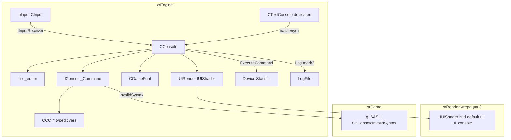

# Консоль

**Консоль** — подсистема `xrEngine` для интерактивного ввода команд во время игры/загрузки. Есть две реализации:

- **`CConsole`** (`src/xrEngine/XR_IOConsole.h/.cpp`) — «обычная» консоль, рисует текст на экране через `CGameFont` + `UIRender` (HUD-шейдер), редактор строки — `line_editor` (см. [UI-примитивы](ui-primitives.md)).
- **`CTextConsole`** (`src/xrEngine/Text_Console.h/.cpp`) — **dedicated-server** версия: два дочерних Win32-окна (`TEXT_CONSOLE` + `TEXT_CONSOLE_LOG_WND`), double-buffered DC, `OnRender` переопределён пустым (рендер не нужен), `OnPaint` перерисовывает каждый второй кадр.

Команды описываются классами `IConsole_Command` + обёртки `CCC_*` (`src/xrEngine/xr_ioc_cmd.h/.cpp`) — типизированные cvar'ы (bool/float/int/string/token/vector/color) + встроенные команды (quit, memstat, help, dump_cvars, ...).

См. [Цикл кадра](frame-loop.md), [Ввод](input.md), [Статистика](stats.md), [UI-примитивы](ui-primitives.md), [HUD](hud.md).

## 1. Ответственность

- **`CConsole`** — хранение списка команд (`m_commands`), редактор строки (`m_editor`), история (64 записи), подсказки (`update_tips`), отрисовка (`OnRender`), обработка клавиш (`OnKeyboard*`), выполнение команд (`ExecuteCommand`).
- **`CTextConsole`** — dedicated-server: Win32-окна, `OnPaint` (перерисовка), `DrawLog` (лог + редактор + `CServerInfo`), `OnFrame` (`InvalidateRect` + курсор).
- **`IConsole_Command`** — базовый класс команды: `TInfo[512]`/`TStatus[256]` (инфо/статус), `vecTips` (подсказки), LRU 10, `InvalidSyntax` (лог + `g_SASH.OnConsoleInvalidSyntax`).
- **`CCC_*`** — обёртки типизированных cvar'ов: `CCC_Mask`/`CCC_ToggleMask`/`CCC_Token`/`CCC_Float`/`CCC_Vector3/4`/`CCC_IVector3/4`/`CCC_Color`/`CCC_Integer`/`CCC_String`/`CCC_LoadCFG`/`CCC_LoadCFG_custom`.
- **Глобалы**: `Console` (указатель на активную консоль), `ioc_prompt = ">>> "`, `ch_cursor = "_"`, `s_script_caller` (`thread_local`, + `ScriptCallerScope`).

Чего это **НЕ делает**: не парсит аргументы сам (это `CCC_*`); не рисует фон (это `UIRender`/`IUIShader`, xrRender, итерация 3); не хранит конфиги (это `pSettings`/`CInifile`).

## 2. Место в архитектуре

`CConsole` — `pureRender` + `pureFrame` + `pureScreenResolutionChanged`. Регистрация в `seqFrame`/`seqRender` — при `Show()` (priority 1), снятие — при `Hide()`. `CTextConsole` переопределяет `OnRender` пустым (dedicated: рендер не нужен).

## 3. Публичный API

### `CConsole` (`src/xrEngine/XR_IOConsole.h`)

| Поле / метод                                                                                 | Описание                                                                                                                                                                                                                                                                                                                                                                                                        |
| -------------------------------------------------------------------------------------------- | --------------------------------------------------------------------------------------------------------------------------------------------------------------------------------------------------------------------------------------------------------------------------------------------------------------------------------------------------------------------------------------------------------------- |
| `m_editor` (`line_editor*`)                                                                  | Редактор строки (`line_editor` из [UI-примитивы](ui-primitives.md), `CONSOLE_BUF_SIZE=1024`).                                                                                                                                                                                                                                                                                                                   |
| `m_commands` (`xr_vector<IConsole_Command*>`)                                                | Список зарегистрированных команд.                                                                                                                                                                                                                                                                                                                                                                               |
| `m_history` (64)                                                                             | История команд (дедуп, `Log` mark2).                                                                                                                                                                                                                                                                                                                                                                            |
| `m_tips` / `m_tips_mode`                                                                     | Подсказки: `mode 2` (параметры команды) vs `mode 1` (поиск по имени).                                                                                                                                                                                                                                                                                                                                           |
| `Show()` / `Hide()`                                                                          | Показать/скрыть: capture/release редактора, `seqFrame`/`seqRender` priority 1, восстановить курсор если exclusive.                                                                                                                                                                                                                                                                                              |
| `Execute(cmd)` / `ExecuteCommand(cmd, args)`                                                 | Выполнить команду (по строке или с аргументами): `remove_spaces`, история, `split_cmd`, lookup, `bEnabled`/`bLowerCaseArgs`/`bEmptyArgsHandled`, `add_to_LRU`.                                                                                                                                                                                                                                                  |
| `GetBool/GetFloat/GetInteger/GetString/GetToken/GetXRToken/GetFVector(Ptr)/GetCommand(name)` | Типизированные геттеры: `fast_dynamic_cast` на `CCC_*`.                                                                                                                                                                                                                                                                                                                                                         |
| `OnRender()`                                                                                 | Отрисовка: шейдер `hud\default`/`ui\ui_console`, шрифты `hud_font_di`/`hud_font_di2` (`SetHeightI(0.025)`), `bGame`-детекция, stats (если `rsCameraPos`/`rsStatistic`/`errors` — вызов `Device.Statistic->Show()`, см. [Статистика](stats.md)), prompt + tips + редактор + курсор + `LogFile`-строки (цвет по mark-символу, word-wrap `1.98*fWidth_2`) + `[N]` счётчик.                                         |
| `OnFrame()`                                                                                  | `m_editor->on_frame()` + `update_tips()` каждые 10 кадров.                                                                                                                                                                                                                                                                                                                                                      |
| `update_tips()`                                                                              | Подсказки: `mode 2` (параметры: `cc->fill_tips` + `select_for_filter`) vs `mode 1` (имя команды: `stricmp`-префикс HL 0..in_sz + внутренний `strstr`-match HL; `add_next_cmds` **мёртвый** — вызов закомментирован).                                                                                                                                                                                            |
| `find_next_cmd(prefix)`                                                                      | `lower_bound` + префикс `ra ` (radmin-style).                                                                                                                                                                                                                                                                                                                                                                   |
| `DrawBackgrounds()`                                                                          | UI-фон: `UIRender` triList, `VIEW_TIPS_COUNT=14`, `MAX_TIPS_COUNT=220`.                                                                                                                                                                                                                                                                                                                                         |
| `OnKeyboardPress/Release/Hold`                                                               | Обработка клавиш: TAB/TAB+Shift (автодополнение), UP/DOWN (tips, история если пусто), Ctrl+UP/DOWN (история), Alt+TAB (`GamePause` — пустая заглушка), PgUp/PgDn (скролл лога), Ctrl+PgUp/Dn (начало/конец), Alt+Home/End/PgUp/PgDn (навигация по tips), Enter/NumpadEnter (выполнить: если выбран tip → вставить), Esc (disable tips → hide), F12 (скриншот). Numpad-ремапы gated by `ks_NumLock` (Antglobes). |

### `IConsole_Command` (`src/xrEngine/xr_ioc_cmd.h`)

| Поле / метод                  | Описание                                              |
| ----------------------------- | ----------------------------------------------------- |
| `TInfo[512]` / `TStatus[256]` | Инфо/статус команды (для `dump_cvars`).               |
| `vecTips`                     | Список подсказок (для `update_tips` mode 2).          |
| `LRU` (10)                    | Last-Recently-Used кэш аргументов.                    |
| `InvalidSyntax(args)`         | Лог + `g_SASH.OnConsoleInvalidSyntax` (xrGame).       |
| `CCC_Register()`              | Регистрация всех cvar'ов (см. Внутреннее устройство). |

### `CCC_*` — типизированные cvar'ы

| Класс                                | Описание                                 |
| ------------------------------------ | ---------------------------------------- |
| `CCC_Mask`                           | Бит-маска (базовый для toggle).          |
| `CCC_ToggleMask`                     | Toggle-бит (on/off).                     |
| `CCC_Token`                          | Enum/токен (строковый).                  |
| `CCC_Float`                          | `float` cvar.                            |
| `CCC_Vector3` / `CCC_Vector4`        | `Fvector` / `Fvector4`.                  |
| `CCC_IVector3` / `CCC_IVector4`      | Интегральные векторы.                    |
| `CCC_Color`                          | `Ivector4` temp (обёртка).               |
| `CCC_Integer`                        | `int` cvar.                              |
| `CCC_String`                         | Строковый cvar (`(NULL)` → `""`).        |
| `CCC_LoadCFG` / `CCC_LoadCFG_custom` | Загрузка конфига (с фильтром `allow()`). |

> **Примечание**: `CCC_Color`/`CCC_Vector4`/`CCC_IVector3`/`CCC_IVector4`/`CCC_LoadCFG_custom` **не имеют** `ENGINE_API` (не экспортируются из DLL).

## 4. Внутреннее устройство

**Конструктор `CConsole`**: `m_editor = line_editor(CONSOLE_BUF_SIZE=1024)` + `Register_callbacks()` + `seqResolutionChanged.Add`. `Initialize`: `CCC_Register()` + `Debug.set_crashhandler(&DumpConsoleVariablesOnCrash)`.

**`OnFrame`**: `m_editor->on_frame()` + `update_tips()` каждые 10 кадров.

**`OnRender`**: шейдер `hud\default`/`ui\ui_console`, шрифты `hud_font_di`/`hud_font_di2` (`SetHeightI(0.025)`), `bGame`-детекция (игра vs загрузка), stats (если `rsCameraPos`/`rsStatistic`/`errors` — `Device.Statistic->Show()`, см. [Статистика](stats.md)), prompt + tips + редактор-текст + курсор + `LogFile`-строки (цвет по mark-символу: `mark0`~yellow, `mark1`!red, `mark2`@, `mark3`#, `mark4`$, `mark5`%, `mark6`^, `mark7`&, `mark8`*, `mark9`-, `mark10`+, `mark11`=, `mark12`/; word-wrap `1.98*fWidth_2`) + `[N]` счётчик. `DrawBackgrounds` — UI-фон (`UIRender` triList, `VIEW_TIPS_COUNT=14`, `MAX_TIPS_COUNT=220`).

**`ExecuteCommand`**: `remove_spaces`, история (max 64, дедуп, `Log` mark2), `split_cmd` (команда + аргументы по первому пробелу), lookup в `m_commands`, `bEnabled`/`bLowerCaseArgs`/`bEmptyArgsHandled` (флаги команды), `add_to_LRU`.

**`Show`/`Hide`**: capture/release редактора, `seqFrame`/`seqRender` priority 1 (dedicated: no-op), восстановить курсор если exclusive.

**`update_tips`**: `mode 2` (параметры команды: `cc->fill_tips` + `select_for_filter`) vs `mode 1` (имя команды: `stricmp`-префикс HL 0..in_sz + внутренний `strstr`-match HL). `add_next_cmds` — **мёртвый** (единственный вызов закомментирован). `find_next_cmd` — `lower_bound` + префикс `ra ` (radmin-style имена команд).

**`CCC_Register()`** (L1030–1259 в `xr_ioc_cmd.cpp`): полная регистрация cvar'ов:

- **general**: `help`/`quit`/`start`/`disconnect`/`cfg_save`/`cfg_load`/`dump_cvar` (DEBUG: `stat_motions`/`stat_textures`/`dbg_str_check`/`dbg_str_dump`/`mt_particles`/`mt_sound`/`mt_physics`/`mt_network`/`e_list`/`e_signal`/`rs_wireframe`/`rs_clear_bb`/`rs_occlusion`/`rs_detail`/`rs_render_statics`/`rs_render_dynamics`; DEBUG_MEMORY_MANAGER: `dbg_mem_dump`/`dbg_mem_check`).
- **render**: `r__supersample`/`r2_sunshafts_min`/`value`/`rs_v_sync`/`rs_screenmode`/`rs_stats`/`rs_vis_distance`/`rs_cam_pos`/`rs_occ_draw`/`stats` (DEBUG)/`rs_c_gamma`/`brightness`/`contrast` (CCC_Gamma)/`texture_lod`/`vid_mode`/`vid_monitor` (не DEDICATED)/`vid_bpp` (DEBUG)/`part_export`/`import`/`vid_restart`.
- **sound**: `snd_volume_eff`/`music`/`snd_restart`/`snd_acceleration`/`efx`/`snd_efx_environment_change_time`/`snd_targets`/`snd_cache_size`/`soundSmoothingParams` (`distanceBasedDelayPower`/`MinDistance`, `pitchVariationPower`, `doppler` power/steps, ~25 `snd_efx_reverb_overwrite_*`)/`snd_stats*` (DEBUG: 6 флагов `st_sound*`)/`error_line_count` (DEBUG).
- **mouse**: `mouse_invert`/`mouse_sens` (default 0.12)/`mouse_sens_vertical` (1.0)/`cam_inert`/`cam_slide_inert`.
- **renderer**: `CCC_r2` (смена рендерера), `snd_device`, `psSoundOcclusionScale` (read-only из settings).
- **прочее**: `dump_open_files` (DEBUG)/`hide`/`r__framelimit`/`rs_refresh_60hz`/`g_crosshair_color` (CCC_Color)/`mouse_sens_aim`/`g_freelook_z_offset_factor` (только `-dbgdev`)/`g_ironsights_zoom_factor`/`ssfx_wetness_multiplier` (CCC_Vector3)/`scope_*` (blur_outer/inner, factor, brightness, fog_interp/travel/swayAim/swayMove, ca, radius, fog_radius, fog_sharp, scope_2dtexactive)/`rs_editor`/`debug_destroy` (DEBUG).

**`CTextConsole`** (dedicated-server):

- Два дочерних Win32-окна: `TEXT_CONSOLE` (редактор + лог) + `TEXT_CONSOLE_LOG_WND` (только лог).
- Double-buffered DC (offscreen bitmap → `BitBlt`).
- `OnRender` переопределён **пустым** (рендер не нужен).
- `OnPaint` — перерисовка **каждый второй кадр** (`Device.dwFrame % 2`): `DrawLog` (лог-строки с mark-цветами, редактор-строка, `ioc_prompt`, `CServerInfo m_server_info` — обновление каждые 500 мс через `g_pGameLevel->GetLevelInfo`).
- `OnFrame` — `InvalidateRect` + стрелка-курсор.
- `g_svTextConsoleUpdateRate = 1`.

**`Text_Console_WndProc.cpp`**:

- `TextConsole_WndProc` — все случаи пустые (`WM_PAINT`/`WM_ERASEBKGND`/`WM_NCPAINT` → no-op, `DefWindowProc`).
- `TextConsole_LogWndProc` — `WM_ERASEBKGND` → 1, `WM_PAINT` → `Console->OnPaint()`.

**Глобалы**: `Console` (указатель на активную консоль), `ioc_prompt = ">>> "`, `ch_cursor = "_"`, `s_script_caller` (`thread_local`, + `ScriptCallerScope` — RAII для «кто вызвал скрипт»).

## 5. Взаимодействие

**Кто меня вызывает**:

- `CApplication::InitConsole` — создание `CConsole`/`CTextConsole` (dedicated) + `Console = this`.
- `pInput` (`CInput`) — `IInputReceiver`: `IR_OnKeyboardPress/Release/Hold` → `OnKeyboard*`.
- Пользователь — `Show()`/`Hide()` (F4, или из меню).
- `Engine.Event` — `KERNEL:console` (toggle).

**Кого я вызываю**:

- `line_editor` (`m_editor`) — редактор строки (см. [UI-примитивы](ui-primitives.md)).
- `IConsole_Command` / `CCC_*` — выполнение команд.
- `CGameFont` (`hud_font_di`/`hud_font_di2`) — отрисовка текста (см. [HUD](hud.md)).
- `UIRender` + `IUIShader` — отрисовка фона/текста (xrRender, итерация 3).
- `Device.Statistic->Show()` — stats (см. [Статистика](stats.md)).
- `LogFile` / `Log` — лог (xrCore).
- `Debug.set_crashhandler(&DumpConsoleVariablesOnCrash)` — дамп cvar'ов при крахе.
- `g_SASH.OnConsoleInvalidSyntax` — invalid syntax (xrGame).

## 6. Потоки

Консоль — **только main-поток**: `OnFrame`/`OnRender` вызываются из `seqFrame`/`seqRender` (main). `s_script_caller` — `thread_local` (для скриптов, которые могут вызываться из других потоков). `line_editor` — main-поток. `CTextConsole` — Win32-окна (main-поток, `WndProc` на main).

## 7. Конфигурация

| cvar / настройка                         | Описание                                                   |
| ---------------------------------------- | ---------------------------------------------------------- |
| `CONSOLE_BUF_SIZE`                       | Размер буфера редактора (1024).                            |
| `ioc_prompt` / `ch_cursor`               | Промпт (`">> "`) и курсор (`"_"`).                         |
| `VIEW_TIPS_COUNT` / `MAX_TIPS_COUNT`     | Число подсказок на экране (14) / макс (220).               |
| `g_svTextConsoleUpdateRate`              | Частота обновления `CTextConsole` (1).                     |
| `rsStatistic` / `rsCameraPos` / `errors` | Флаги показа stats в консоли (см. [Статистика](stats.md)). |

## 8. Ограничения / дебаг

- **`CConsole::OnRender` переопределён `CTextConsole::OnRender` (пустой)** — dedicated-server использует Win32-окна, **не** HUD-рендер. Не описывать оба как одновременно активные.
- **`add_next_cmds`** — мёртвый код (единственный вызов закомментирован в `update_tips`).
- **`find_next_cmd`** — префикс `ra ` — для radmin-style имён команд (историческое).
- **`CCC_Color`/`CCC_Vector4`/`CCC_IVector3`/`CCC_IVector4`/`CCC_LoadCFG_custom`** — **не имеют** `ENGINE_API` (не экспортируются).
- **`Alt+TAB` → `GamePause`** — пустая заглушка (не реализовано).
- **`F12`** — скриншот (через `Device.Screenshot` или аналог).
- **Numpad-ремапы** — gated by `ks_NumLock` (Antglobes: NumLock off → numpad как стрелки).
- **Диагностика**: `dump_cvars` (DEBUG), `dbg_mem_check`/`dbg_str_check` (DEBUG), `dump_open_files` (DEBUG), `error_line_count` (DEBUG, по умолчанию 15 — см. [Статистика](stats.md)).

См. [Цикл кадра](frame-loop.md), [Ввод](input.md), [Статистика](stats.md), [UI-примитивы](ui-primitives.md), [HUD](hud.md), [Device](device.md).
