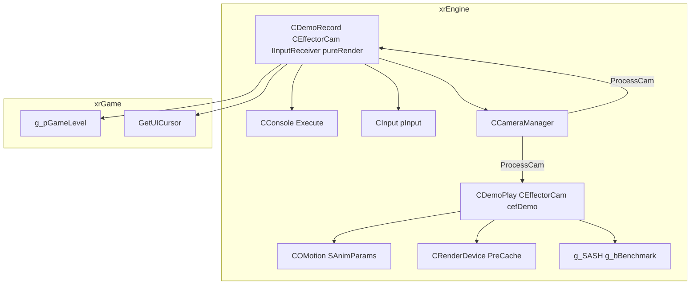

# Демо

**Демо** — подсистема `xrEngine` для **воспроизведения** (`.anm`/raw-матрицы) и **записи** демо. Две независимые классы-«камеры»:

- **`CDemoPlay`** (`src/xrEngine/FDemoPlay.h/.cpp`) — `CEffectorCam(cefDemo)`: проигрывает запись — либо `.anm` (`COMotion` из `$level$`/`$game_anims$`), либо raw-последовательность `Fmatrix` (Catmull-Rom spline). Режим **benchmark**: `g_bBenchmark` → пишет `<name>.result` ini, затем `Console->Execute("quit")`.
- **`CDemoRecord`** (`src/xrEngine/FDemoRecord.h/.cpp`) — `CEffectorCam` + `IInputReceiver` + `pureRender`: записывает позиции камеры в файл (`Fmatrix` на кадр), управляет камерой от клавиатуры/мыши (WASD + mouse look), делает скриншоты/кубемапы/карты уровня.

См. [Эффекторы](effector.md), [Камера](camera.md), [Скелет и анимация](skeleton-motion.md), [Ввод](input.md), [Консоль](console.md), [Device](device.md).

## 1. Ответственность

- **`CDemoPlay`** — проигрывание: `COMotion` (`.anm`) или raw `Fmatrix` (spline), `stat_Start/Stop` (benchmark), `ProcessCam` (skip при `Device.dwPrecacheFrame`), конструктор (`hud_weapon 0`, `Device.PreCache(50, true, false)`), деструктор (восстановление hud).
- **`CDemoRecord`** — запись: `IR_OnKeyboard*`/`IR_OnMouse*` (управление камерой), `ProcessCam` (движение + границы + `fLifeTime`), `RecordKey` (запись `Fmatrix`), `MakeCubemap`/`MakeScreenshot`/`MakeLevelMapScreenshot` (state machines), `OnRender` (шрифты).
- **Глобалы**: `xrDemoRecord` (указатель на активный рекордер), `g_position`/`g_direction` (принудительные структуры позиции/направления), `SetGlobalPosition`/`SetGlobalDirection`.

Чего это **НЕ делает**: не рисует сам (это `xrRender`); не управляет игровыми объектами (это xrGame); не хранит конфиги (это `pSettings`).

## 2. Место в архитектуре

Оба класса — `CEffectorCam` (см. [Эффекторы](effector.md)), применяются через `CCameraManager::ProcessCam` (см. [Камера](camera.md)). `CDemoPlay` — `cefDemo` (тип эффектора), `CDemoRecord` — тоже `CEffectorCam` + `IInputReceiver` + `pureRender`.

## 3. Публичный API

### `CDemoPlay` (`src/xrEngine/FDemoPlay.h`)

| Поле / метод               | Описание                                                                                                                                                                                                                              |
| -------------------------- | ------------------------------------------------------------------------------------------------------------------------------------------------------------------------------------------------------------------------------------- |
| `m_Motion` (`COMotion*`)   | Анимация (`.anm`) — для режима `COMotion`.                                                                                                                                                                                            |
| `m_Params` (`SAnimParams`) | Параметры анимации (`t_current`, `bWrapped`).                                                                                                                                                                                         |
| `m_Matrices` (`Fmatrix*`)  | Raw-матрицы — для режима `Fmatrix`.                                                                                                                                                                                                   |
| `m_Size` / `dwCyclesLeft`  | Размер / оставшиеся циклы.                                                                                                                                                                                                            |
| `stat_Start` / `stat_Stop` | Benchmark: старт/стоп таймера, `stat_table`, `WindowSize = max(16, avgFPS/2)`.                                                                                                                                                        |
| `ProcessCam`               | Вызывается `CCameraManager`: skip при `Device.dwPrecacheFrame`; `COMotion` → `_Evaluate` → p/R + `mRotate.setXYZi` + `bWrapped` → restart; `Fmatrix` → Catmull-Rom `spline1` (4 keyframes/row), инверсия `Device.mView` → info.p/d/n. |
| Конструктор                | `hud_weapon 0` (+`hud_draw 0` если benchmark/SASH), `Device.PreCache(50, true, false)`.                                                                                                                                               |
| Деструктор                 | Восстановление hud.                                                                                                                                                                                                                   |

### `CDemoRecord` (`src/xrEngine/FDemoRecord.h`)

| Поле / метод                                                          | Описание                                                                                                                                                                                                                                                                                                                                                                                                                                                                                                                                         |
| --------------------------------------------------------------------- | ------------------------------------------------------------------------------------------------------------------------------------------------------------------------------------------------------------------------------------------------------------------------------------------------------------------------------------------------------------------------------------------------------------------------------------------------------------------------------------------------------------------------------------------------ |
| `m_Camera` (`Fmatrix`)                                                | Текущая матрица камеры (инвертированная `Device.mView`).                                                                                                                                                                                                                                                                                                                                                                                                                                                                                         |
| `m_Position` / `m_vVelocity`                                          | Позиция / скорость (lerp 0.3).                                                                                                                                                                                                                                                                                                                                                                                                                                                                                                                   |
| `m_fCameraBoundary` (100)                                             | Граница камеры (clamp).                                                                                                                                                                                                                                                                                                                                                                                                                                                                                                                          |
| `m_b_redirect_input_to_level`                                         | Перенаправить ввод в уровень (toggle: MULTIPLY/RCONTROL/TAB + `return_ctrl_inputs`).                                                                                                                                                                                                                                                                                                                                                                                                                                                             |
| `m_Starting_Position`                                                 | Начальная позиция (для clamp).                                                                                                                                                                                                                                                                                                                                                                                                                                                                                                                   |
| `m_fGroundPosition`                                                   | Фейковый ground (для clamp).                                                                                                                                                                                                                                                                                                                                                                                                                                                                                                                     |
| `m_Stage`                                                             | Stage state machine (screenshot/cubemap/levelmap).                                                                                                                                                                                                                                                                                                                                                                                                                                                                                               |
| Конструктор `(name, life_time, return_ctrl_inputs)`                   | `FS.w_open(name)`, `IR_Capture()`, инверсия `Device.mView` → `m_Camera`, `m_fCameraBoundary=100`, HPB из камеры; `return_ctrl_inputs` → камера 3 м позади актёра; скорости из `pSettings->r_float("demo_record", "speed0..3"/"ang_speed0..3")`; если нет файла → `fLifeTime=-1`.                                                                                                                                                                                                                                                                 |
| Конструктор (второй)                                                  | Добавляет в `pDemoRecords` (set), `isInputBlocked`, `GetUICursor().Hide()`, `StopDemo()` если нет файла.                                                                                                                                                                                                                                                                                                                                                                                                                                         |
| `StopDemo`                                                            | `fLifeTime=-1`, erase из set.                                                                                                                                                                                                                                                                                                                                                                                                                                                                                                                    |
| `EnableReturnCtrlInputs` / `SetCameraBoundary`                        | Включить возврат ввода / задать границу.                                                                                                                                                                                                                                                                                                                                                                                                                                                                                                         |
| `ProcessCam`                                                          | F1 → help overlay; `m_vVelocity.lerp(0.3)`; скорость по LSHIFT/ALTC/LCONTROL (speed0/1/2/3); движение через `m_Camera.k/i/j`; `g_position`/`g_direction` override; `m_CameraBoundaryEnabled` → clamp + fake ground; `info.n/d/p`; `fLifeTime -= dt` → `StopDemo()`.                                                                                                                                                                                                                                                                              |
| `IR_OnKeyboardPress`                                                  | `isInputBlocked` → только PAUSE (`Device.Pause`), GRAVE (`Console->Show`), ESC (`Console->Execute("main_menu on")`); иначе: MULTIPLY/RCONTROL/TAB + `return_ctrl_inputs` → toggle `m_b_redirect_input_to_level` (→ `g_pGameLevel->IR_*`, show/hide UICursor), GRAVE/ESC (StopDemo + вернуть ESC в уровень), RETURN (`-dbg` → `CurrentEntity()->ForceTransform(m_Camera)` + StopDemo), PAUSE, skip при `Device.imgui_shown()`, SPACE → `RecordKey()`, BACK → `MakeCubemap()`, F11 → `MakeLevelMapScreenshot(LCONTROL)`, F12 → `MakeScreenshot()`. |
| `IR_OnKeyboardRelease`                                                | F12 → вернуть ввод в уровень если `return_ctrl_inputs`.                                                                                                                                                                                                                                                                                                                                                                                                                                                                                          |
| `IR_OnKeyboardHold`                                                   | WASD/стрелки/numpad123456789 + C/Z → `vT_delta`/`vR_delta` (±1, tilt ±2), `update_whith_timescale` (÷ `Device.time_factor()`).                                                                                                                                                                                                                                                                                                                                                                                                                   |
| `IR_OnMouseMove`                                                      | dx→yaw, dy→pitch (×0.75, `psMouseInvert`), scale 0.5 hardcoded.                                                                                                                                                                                                                                                                                                                                                                                                                                                                                  |
| `IR_OnMouseHold`                                                      | btn0 back, btn1 forward.                                                                                                                                                                                                                                                                                                                                                                                                                                                                                                                         |
| `RecordKey`                                                           | `file->w(&g_matView, sizeof(Fmatrix))`.                                                                                                                                                                                                                                                                                                                                                                                                                                                                                                          |
| `MakeCubemap` / `MakeScreenshot` / `MakeLevelMapScreenshot(LCONTROL)` | State machines (см. Внутреннее устройство).                                                                                                                                                                                                                                                                                                                                                                                                                                                                                                      |
| `OnRender`                                                            | `pApp->pFontSystem->OnRender()`.                                                                                                                                                                                                                                                                                                                                                                                                                                                                                                                 |
| Деструктор                                                            | `IR_Release`, `FS.w_close`, восстановить `g_bDisableRedText`, `seqRender.Remove`.                                                                                                                                                                                                                                                                                                                                                                                                                                                                |

### Свободные функции

| Функция                        | Описание                                                                           |
| ------------------------------ | ---------------------------------------------------------------------------------- |
| `setup_lm_screenshot_matrices` | Ортогональная top-down матрица для карты уровня.                                   |
| `get_level_screenshot_bound`   | Bounding box уровня (`ObjectSpace` BV + `level_map` секция `bound_rect` override). |
| `GetLM_BBox`                   | Разбиение на квадранты (4 фрагмента).                                              |

## 4. Внутреннее устройство

**`CDemoPlay`**:

- **Два режима**: `.anm` (`COMotion` из `$level$`/`$game_anims$`, `SAnimParams`, `_Evaluate` → p/R, `mRotate.setXYZi`, `bWrapped` → restart) или raw `Fmatrix` (size % sizeof(Fmatrix), Catmull-Rom `spline1` по 4 keyframes/row, инверсия `Device.mView` → info.p/d/n, `dwCyclesLeft`).
- **Конструктор**: `hud_weapon 0` (+`hud_draw 0` если benchmark/SASH), `Device.PreCache(50, true, false)`.
- **`stat_Start/Stop`**: per-frame `stat_table`, `WindowSize = max(16, avgFPS/2)`, `g_bBenchmark` → пишет `<name>.result` ini, затем `Console->Execute("quit")`.
- **`ProcessCam`**: skip при `Device.dwPrecacheFrame` (precache-кадры не проигрываются).
- **Деструктор**: восстановление hud.

**`CDemoRecord`**:

- **Конструктор**: `FS.w_open(name)`, `IR_Capture()`, инверсия `Device.mView` → `m_Camera`, `m_fCameraBoundary=100`, HPB из камеры; `return_ctrl_inputs` → камера 3 м позади актёра; скорости из `pSettings`; если нет файла → `fLifeTime=-1`.
- **`ProcessCam`**: F1 → help overlay (`pApp->pFontSystem` OutNext); `m_vVelocity.lerp(0.3)`; скорость по модификаторам (LSHIFT/ALTC/LCONTROL → speed0/1/2/3); движение через `m_Camera.k/i/j`; `g_position`/`g_direction` override; `m_CameraBoundaryEnabled` → clamp + fake ground; `info.n/d/p`; `fLifeTime -= dt` → `StopDemo()`.
- **`RecordKey`**: запись `Fmatrix` в файл (1 запись на кадр).
- **`MakeCubemap`** (7 stages): 6 граней (`cmNorm[6]`/`cmDir[6]`) + последняя = направление камеры, `SM_FOR_CUBEMAP`.
- **`MakeScreenshot`** (2 stages): сохранить HUD-флаги → `Render->Screenshot()` + восстановить.
- **`MakeLevelMapScreenshot`** (stage 0: сохранить device/HUD-флаги + `rsClearBB|rsDrawStatic`; stage `DEVICE_RESET_PRECACHE_FRAME_COUNT+30`: `setup_lm_screenshot_matrices()` + `SM_FOR_LEVELMAP` в `map_<level>` или `map_<level>#<frag>` (4 фрагмента через `GetLM_BBox`), восстановить).

## 5. Взаимодействие

**Кто меня вызывает**:

- `CCameraManager::UpdateCamEffectors` — `ProcessCam` (каждый кадр, см. [Камера](camera.md)).
- `CInput` (`pInput`) — `IInputReceiver`: `IR_OnKeyboard*`/`IR_OnMouse*` (для `CDemoRecord`).
- Пользователь — `CDemoRecord(name, life_time, return_ctrl_inputs)` (создание рекордера).
- `Engine.Event` — `KERNEL:start_mp_demo` (запуск демо, см. [API и события](api.md)).

**Кого я вызываю**:

- `CEffectorCam` / `CCameraManager` — применение к камере (см. [Эффекторы](effector.md), [Камера](camera.md)).
- `COMotion` / `SAnimParams` — анимация (см. [Скелет и анимация](skeleton-motion.md)).
- `Device.PreCache` — precache (см. [Device](device.md)).
- `Console->Execute` — выполнение команд (см. [Консоль](console.md)).
- `g_SASH` / `g_bBenchmark` — benchmark (см. [UI-примитивы](ui-primitives.md)).
- `IInputReceiver` — ввод (см. [Ввод](input.md)).
- `g_pGameLevel->IR_*` — перенаправление ввода в уровень.
- `GetUICursor().Hide/Show` — курсор (xrGame).

## 6. Потоки

Демо — **только main-поток**: `ProcessCam` вызывается из `CCameraManager::Update` (main), `IR_On*` из `CInput::OnFrame` (main). `FS.w_open/w_close` — main-поток. `MakeCubemap`/`MakeScreenshot` — state machines на main-потоке.

## 7. Конфигурация

| Настройка                                            | Описание                                         |
| ---------------------------------------------------- | ------------------------------------------------ |
| `pSettings->r_float("demo_record", "speed0..3")`     | Скорости движения (4 уровня).                    |
| `pSettings->r_float("demo_record", "ang_speed0..3")` | Скорости вращения (4 уровня).                    |
| `m_fCameraBoundary` (100)                            | Граница камеры (clamp).                          |
| `DEVICE_RESET_PRECACHE_FRAME_COUNT`                  | Число precache-кадров (для levelmap screenshot). |

## 8. Ограничения / дебаг

- **`CDemoPlay` конструктор может `return` early** (нет файла) после удаления себя из эффекторов — задокументировать self-removal.
- **`Device.dwPrecacheFrame`**: precache-кадры **не проигрываются** (skip в `ProcessCam`).
- **`g_bBenchmark`**: benchmark-режим — пишет `<name>.result` ini, затем `Console->Execute("quit")`.
- **`return_ctrl_inputs`**: если `true` — камера 3 м позади актёра, ESC/GRAVE возвращают ввод в уровень.
- **`m_fGroundPosition`**: фейковый ground (не реальная физика, только для clamp).
- **Scale 0.5 hardcoded** в `IR_OnMouseMove` — магическое число.
- **F1** — help overlay (только в `CDemoRecord`).
- **F11/F12** — скриншоты/кубемапы/карты (state machines).

См. [Эффекторы](effector.md), [Камера](camera.md), [Скелет и анимация](skeleton-motion.md), [Ввод](input.md), [Консоль](console.md), [Device](device.md), [API и события](api.md).
