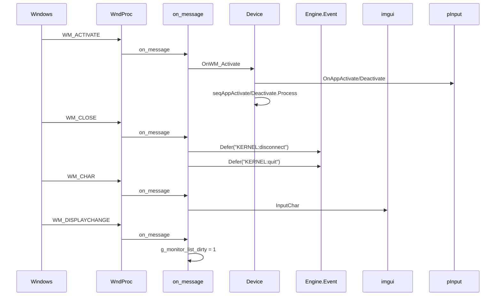

# Окно и WndProc

Обработка сообщений Windows, утилиты устройства (`DumpFlags`), overdraw-заглушки, D3D-структуры (`_d3d_extensions.h`) и полусфера (`xrHemisphere`).

См. [Device](device.md), [Ядро](engine.md).

## Ответственность

- **`WndProc`** (Device_wndproc.cpp) — статический обработчик сообщений окна; передаёт их в `Device.on_message`, затем в `DefWindowProc`.
- **`on_message`** — переключение по `uMsg`: `WM_ACTIVATE`, `WM_SETCURSOR`, `WM_SYSCOMMAND`, `WM_CLOSE`, `WM_HOTKEY`, `WM_SYSCHAR`, `WM_CHAR`, `WM_INPUTLANGCHANGE`, `WM_DISPLAYCHANGE`.
- **`OnWM_Activate`** — смена `b_is_Active`, `seqAppActivate`/`seqAppDeactivate`, курсор, `app_inactive_time`.
- **`DumpFlags`** (Device_Misc.cpp) — логирование `psDeviceFlags` (rsClearBB, rsVSync, rsWireframe).
- **`overdrawBegin/End`** (Device_overdraw.cpp) — заглушки (`VERIFY(0)`), делегируют в `m_pRender`.
- **`_d3d_extensions.h`** — структуры `Flight` (аналог `D3DLIGHT9`), `Fmaterial` (аналог `D3DMATERIAL9`), `VDeclarator` (обёртка `D3DVERTEXELEMENT9`).
- **`xrHemisphere`** — табличные полусферы (3 качества) для hemisphere-освещения.

## Место в архитектуре

Нижний слой окна. `WndProc` регистрируется в `Device_Initialize` (→ [Device](device.md)) как callback класса `_XRAY_1.5`. Сообщения от Windows → `on_message` → либо обработка (и `return true`), либо `DefWindowProc`.

`_d3d_extensions.h` — устаревшие D3D9-структуры, в основном **не используются** в современном рендер-слое (рендер-бэкенд — итерация 3). `xrHemisphere` — математическая утилита для hemisphere-ликов.

## Публичный API

### WndProc / on_message

```cpp
// Device_wndproc.cpp
LRESULT CALLBACK WndProc(HWND hWnd, UINT uMsg, WPARAM wParam, LPARAM lParam);

// device.h — CRenderDevice
bool xr_stdcall on_message(HWND hWnd, UINT uMsg, WPARAM wParam, LPARAM lParam, LRESULT& result);
void OnWM_Activate(WPARAM wParam, LPARAM lParam);
```

### Misc

```cpp
// device.h
void DumpFlags();
void overdrawBegin();
void overdrawEnd();
```

### _d3d_extensions.h

```cpp
struct Flight {
  u32 type;
  Fcolor diffuse, specular, ambient;
  Fvector position, direction;
  float range, falloff;
  float attenuation0, attenuation1, attenuation2;
  float theta, phi;
  void set(u32 ltType, float x, float y, float z);
  void mul(float brightness);
};

struct Fmaterial {
  Fcolor diffuse, ambient, specular, emissive;
  float power;
  void set(float r, float g, float b);
  void set(float r, float g, float b, float a);
  void set(Fcolor& c);
};

struct VDeclarator : public svector<D3DVERTEXELEMENT9, MAXD3DDECLLENGTH + 1> {
  void set(u32 FVF);
  void set(D3DVERTEXELEMENT9* dcl);
  void set(const VDeclarator& d);
  u32 vertex();
  BOOL equal(VDeclarator& d);
};
```

Включаются при отсутствии `NO_XR_LIGHT`, `NO_XR_MATERIAL`, `NO_XR_VDECLARATOR` соответственно.

### xrHemisphere

```cpp
// xrHemisphere.h
typedef void __stdcall xrHemisphereIterator(float x, float y, float z, float energy, LPVOID param);

void ECORE_API xrHemisphereBuild(int quality, float energy, xrHemisphereIterator* it, LPVOID param);
int ECORE_API xrHemisphereVertices(int quality, const Fvector*& verts);
int ECORE_API xrHemisphereIndices(int quality, const u16*& indices);
```

## Внутреннее устройство

### Файлы

| Файл                                  | Назначение                           |
| ------------------------------------- | ------------------------------------ |
| `Device_wndproc.cpp`                  | `WndProc`, `on_message`              |
| `Device_Misc.cpp`                     | `DumpFlags`                          |
| `Device_overdraw.cpp`                 | `overdrawBegin/End` (заглушки)       |
| `_d3d_extensions.h`                   | `Flight`, `Fmaterial`, `VDeclarator` |
| `xrHemisphere.h` / `xrHemisphere.cpp` | полусферы                            |

### `on_message` — сообщения

```cpp
// Device_wndproc.cpp
bool CRenderDevice::on_message(HWND hWnd, UINT uMsg, WPARAM wParam, LPARAM lParam, LRESULT& result) {
  switch (uMsg) {
  case WM_SYSKEYDOWN:   return true;  // поглощаем
  case WM_ACTIVATE:     OnWM_Activate(wParam, lParam); return false;
  case WM_SETCURSOR:    result = 1; return true;  // скрываем курсор
  case WM_SYSCOMMAND:   // SC_MOVE/SC_SIZE/SC_MAXIMIZE/SC_MONITORPOWER → result=1, return true
                        // остальное → return false
  case WM_CLOSE:
    Engine.Event.Defer("KERNEL:disconnect");
    Engine.Event.Defer("KERNEL:quit");
    result = 0; return true;
  case WM_HOTKEY:
  case WM_SYSCHAR:      result = 0; return true;  // глушим «дзынь» Alt+key
  case WM_CHAR:         Device.imgui().InputChar(wParam); return false;
  case WM_INPUTLANGCHANGE: Device.imgui().UpdateInputLang(); return false;
  case WM_DISPLAYCHANGE: InterlockedExchange(&g_monitor_list_dirty, 1); return false;
  }
  return false;
}
```

Ветка `INGAME_EDITOR`: если `editor()` — `WM_ACTIVATE`/`WM_SETCURSOR`/`WM_SYSCOMMAND`/`WM_CLOSE` обрабатываются иначе (или пропускаются).

### `OnWM_Activate`

```cpp
// device.cpp L832
void CRenderDevice::OnWM_Activate(WPARAM wParam, LPARAM lParam) {
  u16 fActive = LOWORD(wParam);
  BOOL fMinimized = (BOOL)HIWORD(wParam);
  BOOL bActive = (fActive != WA_INACTIVE && !fMinimized);

  // rsAlwaysActive: всегда активен (кроме g_screenmode == 2)
  if (psDeviceFlags2.test(rsAlwaysActive) && g_screenmode != 2) {
    Device.b_is_Active = TRUE;
    if (Device.b_hide_cursor != bActive) {
      Device.b_hide_cursor = bActive;
      if (bActive) { ShowCursor(FALSE); ClipCursor(&winRect); pInput->OnAppActivate(); }
      else { ShowCursor(TRUE); ClipCursor(NULL); pInput->OnAppDeactivate(); }
    }
    return;
  }

  if (bActive != Device.b_is_Active) {
    Device.b_is_Active = bActive;
    if (bActive) {
      Device.seqAppActivate.Process(rp_AppActivate);
      app_inactive_time += TimerMM.GetElapsed_ms() - app_inactive_time_start;
      ShowCursor(FALSE); ClipCursor(&winRect);
    } else {
      app_inactive_time_start = TimerMM.GetElapsed_ms();
      Device.seqAppDeactivate.Process(rp_AppDeactivate);
      ShowCursor(TRUE); ClipCursor(NULL);
    }
  }
}
```

`app_inactive_time` — накопленное время неактивности окна; вычитается из `dwTimeContinual` в `FrameMove` (→ [Device](device.md)).

### `DumpFlags`

```cpp
// Device_Misc.cpp
static struct { char* name; u32 mask; } DF[] = {
  {"rsClearBB", rsClearBB}, {"rsVSync", rsVSync}, {"rsWireframe", rsWireframe}, {NULL, 0}
};
void CRenderDevice::DumpFlags() {
  Log("- Dumping device flags");
  for (auto* p = DF; p->name; ++p)
    Msg("* %20s %s", p->name, psDeviceFlags.test(p->mask) ? "on" : "off");
}
```

### `overdrawBegin/End`

```cpp
// Device_overdraw.cpp
void CRenderDevice::overdrawBegin() { VERIFY(0); m_pRender->overdrawBegin(); }
void CRenderDevice::overdrawEnd()   { VERIFY(0); m_pRender->overdrawEnd(); }
```

`VERIFY(0)` — намеренная заглушка: функции не должны вызываться в текущем коде (overdraw-режим не используется).

### `_d3d_extensions.h`

Структуры-аналоги D3D9:

- **`Flight`** — источник света: тип, цвета (diffuse/specular/ambient), позиция/направление, range/falloff/attenuation, углы spotlight (`theta`/`phi`). `set()` — инициализация (белый, бесконечный range). `mul(brightness)` — масштабирование яркости.
- **`Fmaterial`** — материал: diffuse/ambient/specular/emissive + `power` (жёсткость блика). `set()` — инициализация.
- **`VDeclarator`** — обёртка `D3DVERTEXELEMENT9`: `set(FVF)` (через D3DXDeclaratorFromFVF), `set(dcl)` (копия), `vertex()` (размер вершины), `equal(d)` (сравнение).

Комментарий `#if sizeof(Flight)!=sizeof(D3DLIGHT9) #error` — гарантирует бинарную совместимость с D3D9.

### `xrHemisphere`

Три табличные полусферы (верхняя полусфера единичного шара):

| Качество | Вершины | Граней                       | Назначение |
| -------- | ------- | ---------------------------- | ---------- |
| 1        | 26      | 40                           | LOW        |
| 2        | 91      | 160                          | HIGH       |
| 3        | 196     | — (индексы закомментированы) | SUPER HIGH |

`xrHemisphereBuild(quality, energy, iterator, param)`:

1. Получает вершины через `xrHemisphereVertices`.
2. Для каждой: инвертирует вектор (`x=-x, y=-y, z=-z`), нормализует, вызывает `iterator(x, y, z, E*energy, param)`, где `E = 1/h_count` (равномерное распределение энергии).

`xrHemisphereIndices(quality, &indices)` — возвращает индексы треугольников (для рендера полусферы). Для quality 3 индексы закомментированы.

Использование: hemisphere-освещение — расчёт направления и энергии для каждого «луча» полусферы (→ [Окружение](environment.md)).

## Взаимодействие

- **`Device`** (глобал) — `on_message` вызывается из `WndProc`; `OnWM_Activate` обновляет `b_is_Active`, `app_inactive_time`, `b_hide_cursor`.
- **`Engine.Event`** — `WM_CLOSE` → `Defer("KERNEL:disconnect")` + `Defer("KERNEL:quit")` (→ [API и события](api.md)).
- **`Device.imgui()`** — `WM_CHAR` → `InputChar`, `WM_INPUTLANGCHANGE` → `UpdateInputLang` (→ порцион 11).
- **`pInput`** — `OnAppActivate`/`OnAppDeactivate` в `OnWM_Activate` (→ порцион 12).
- **`m_pRender`** — `overdrawBegin/End` делегируют (→ итерация 3).
- **`g_monitor_list_dirty`** — `WM_DISPLAYCHANGE` → флаг; сбрасывается в `FrameMove` (→ [Device](device.md)).
- **`psDeviceFlags2`** — `rsAlwaysActive` в `OnWM_Activate`.
- **`xrHemisphere`** — используется в hemisphere-освещении (→ [Окружение](environment.md)).

## Потоки данных



## Конфигурация

| Источник            | Поле             | Назначение                                                    |
| ------------------- | ---------------- | ------------------------------------------------------------- |
| `psDeviceFlags2`    | `rsAlwaysActive` | `OnWM_Activate`: всегда активен                               |
| `g_screenmode`      | (глобал)         | 0=окно, 1=fullscreen, 2=borderless; влияет на `OnWM_Activate` |
| `NO_XR_LIGHT`       | (препроцессор)   | отключает `Flight` в `_d3d_extensions.h`                      |
| `NO_XR_MATERIAL`    | (препроцессор)   | отключает `Fmaterial`                                         |
| `NO_XR_VDECLARATOR` | (препроцессор)   | отключает `VDeclarator`                                       |

## Ограничения и дебаг

- **`WM_SYSCOMMAND`**: блокируются `SC_MOVE`/`SC_SIZE`/`SC_MAXIMIZE`/`SC_MONITORPOWER` — окно нельзя переместить/изменить размер/свернуть в fullscreen.
- **`WM_CLOSE`**: шлёт **два** отложенных события (`KERNEL:disconnect`, `KERNEL:quit`) — порядок важен: сначала отключение, затем выход.
- **`WM_HOTKEY`/`WM_SYSCHAR`**: поглощаются, чтобы не было «дзыня» от Alt+key.
- **`rsAlwaysActive`**: при `g_screenmode == 2` (borderless) флаг **не** действует — окно всё же реагирует на `WM_ACTIVATE`.
- **`app_inactive_time`**: при `rsAlwaysActive` early return — время неактивности **не** накапливается.
- **`overdrawBegin/End`**: `VERIFY(0)` — в DEBUG упадёт, если вызваны; в RELEASE просто делегируют.
- **`xrHemisphere` quality 3**: индексы закомментированы — только вершины.
- **`Flight`/`Fmaterial`/`VDeclarator`**: устаревшие D3D9-структуры; современный рендер-бэкенд (итерация 3) их не использует.
- **INGAME_EDITOR**: `WM_ACTIVATE`/`WM_SETCURSOR`/`WM_SYSCOMMAND`/`WM_CLOSE` обрабатываются иначе (редактор управляет окном).
