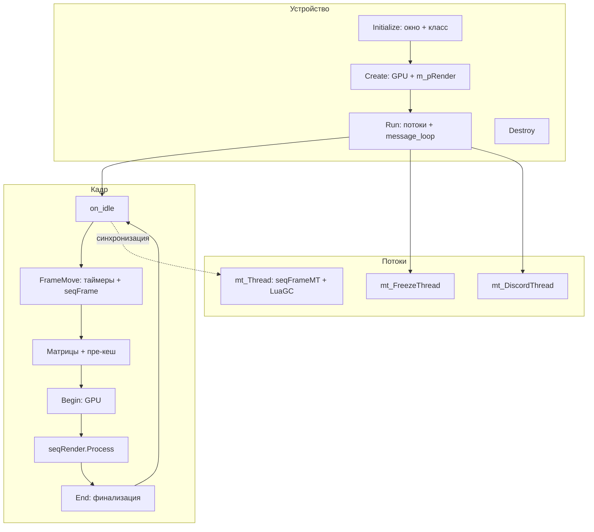

# Device

`CRenderDevice` (глобальный `Device`) — «устройство» движка: окно, таймеры, матрицы камеры, жизненный цикл рендер-контекста, пре-кеширование текстур и точка входа в цикл кадра.

См. [Ядро](engine.md), [Цикл кадра](frame-loop.md), [Окно и WndProc](device-window.md).

## Ответственность

- **Окно**: регистрация класса `_XRAY_1.5`, создание `HWND` (`Device_Initialize.cpp`), обработчик сообщений (`Device_wndproc.cpp`).
- **Жизненный цикл устройства**: `Initialize → Create → Run → Destroy` (+ `Reset`, `ChangeOutputMonitor`).
- **Таймеры**: `Timer` (кадр, с паузой), `TimerGlobal` (глобальное время, с паузой), `TimerMM` (Windows `timeGetTime`), вычисление `fTimeDelta`/`dwTimeDelta`/`dwTimeGlobal`.
- **Матрицы**: `mView`, `mProject`, `mProjectHud`, `mFullTransform(=mProject*mView)`, обратные, `_saved`-копии для синхронизации с GPU-кешем.
- **Камера**: `vCameraPosition/Direction/Top/Right`, FOV/ASPECT, `ViewportNear`.
- **Пауза**: `Pause`/`Paused` через `g_pauseMngr()`.
- **Пре-кеширование**: `PreCache` — вращение камеры по окружности на `dwPrecacheFrame` кадров для загрузки текстур уровня.
- **Потоки**: запуск `mt_Thread` (второй поток), `mt_FreezeThread` (детектор фриза), `mt_DiscordThread`; синхронизация `mt_csEnter`/`mt_csLeave`.
- **Второй вьюпорт**: `CSecondVPParams` (SVP — split/second viewport).
- **Скриншоты**: `Screenshot()`.

## Место в архитектуре

`CRenderDevice` — центральный узел между «окном/системой» и рендер-слоем (`m_pRender`, `IRenderDeviceRender`). Цикл кадра описан в [Цикл кадра](frame-loop.md): `Run`/`message_loop`/`on_idle`/`FrameMove`/`mt_Thread`. Здесь — всё, что **не** про сам проход кадра: данные, жизненный цикл, таймеры, матрицы, пауза, пре-кеширование.

Наследование:

```cpp
// device.h
class IRenderDevice            // виртуальный API: StatPhysics, AddSeqFrame, RemoveSeqFrame
class CRenderDeviceData : ...  // данные: размеры, флаги, тайм-поля, матрицы, регистраторы, m_hWnd
class CRenderDeviceBase : public IRenderDevice, public CRenderDeviceData
class CRenderDevice : public CRenderDeviceBase
```

`extern ENGINE_API CRenderDevice Device;` — единственный экземпляр (глобал).

## Публичный API

### Жизненный цикл

```cpp
// device.h — CRenderDevice
void Initialize(void);   // Device_Initialize.cpp: таймеры, окно, m_imgui в seqAppStart/End
void Create(void);       // Device_create.cpp: статистика, GPU, окно в режим, m_pRender->Create, _Create, PreCache(0)
void Run(void);          // device.cpp: запуск потоков + message_loop (→ frame-loop.md)
void Destroy(void);      // Device_destroy.cpp
void Reset(bool precache = true);          // Device_destroy.cpp: сброс рендер-контекста
bool ChangeOutputMonitor(HMONITOR hTargetMon); // Device_destroy.cpp: живой перенос на другой монитор
void Pause(BOOL bOn, BOOL bTimer, BOOL bSound, LPCSTR reason);
bool Paused();
```

### Кадр (внутренности — в [Цикл кадра](frame-loop.md))

```cpp
BOOL Begin();       // проверка состояния GPU, m_pRender->Begin, FPU::m24r, g_bRendering=TRUE
void Clear();       // m_pRender->Clear()
void End();         // финализация пре-кеша, SASH, m_pRender->End
void FrameMove();   // таймеры + ShaderBus::frame_latch + seqFrame.Process
void PreCache(u32 amount, bool b_draw_loadscreen, bool b_wait_user_input);
```

### Таймеры

```cpp
IC CTimer_paused* GetTimerGlobal() { return &TimerGlobal; }
u32 TimerAsync() { return TimerGlobal.GetElapsed_ms(); }
u32 TimerAsync_MMT() { return TimerMM.GetElapsed_ms() + Timer_MM_Delta; }
void time_factor(const float& time_factor); // множитель времени (Timer и TimerGlobal)
IC u32 frame_elapsed();                     // frame_timer.GetElapsed_ms() (AVO)
```

### Матрицы / камера / HUD

```cpp
Fvector& hud_to_world(Fvector& v [, const Fmatrix& p]);
Fvector& hud_to_world_dir(Fvector& v [, const Fmatrix& p]);
Fmatrix& hud_to_world(Fmatrix& m [, const Fmatrix& p]);
Fvector& world_to_hud(Fvector& v [, const Fmatrix& p]);
Fvector& world_to_hud_dir(Fvector& v [, const Fmatrix& p]);
Fmatrix& world_to_hud(Fmatrix& m [, const Fmatrix& p]);
void SetNearer(BOOL enabled);    // сдвиг mProject._43 на ±EPS_L (ближе/дальше)
IC float GetPerceivedDist(const Fvector& p, float* real_dist = nullptr); // «воспринимаемая» дистанция от FOV
IC float CalcSSADynamic(const Fvector& C, float R);  // динамический SSAO-радиус
```

Макросы: `VIEWPORT_NEAR` = `Device.ViewportNear`, `R_VIEWPORT_NEAR` = `0.005f`.

### Прочее

```cpp
void Screenshot();
void DumpFlags();
void ConnectToRender();
IRenderDeviceRender* m_pRender;   // текущий бэкенд
CStats* Statistic;                 // статистика (→ порцион 12)
xr_imgui::ide& imgui();            // imgui-окружение (→ порцион 11)
bool isRendering;                  // TRUE между Begin и End
CSecondVPParams m_SecondViewport;  // SVP
```

## Внутреннее устройство

### Файлы

| Файл                      | Назначение                                                                                                                 |
| ------------------------- | -------------------------------------------------------------------------------------------------------------------------- |
| `device.h` / `device.cpp` | класс, `Begin/Clear/End`, `PreCache`, `Run/on_idle/FrameMove`, `Pause`, мониторы, `CLoadScreenRenderer`, `CSecondVPParams` |
| `Device_Initialize.cpp`   | `Initialize` — окно + класс + `m_imgui`                                                                                    |
| `Device_create.cpp`       | `Create`, `SetupGPU`, `_Create`, `_SetupStates`, `ConnectToRender`                                                         |
| `Device_destroy.cpp`      | `Destroy`, `_Destroy`, `Reset`, `ChangeOutputMonitor`                                                                      |
| `Device_wndproc.cpp`      | `WndProc`, `on_message` (→ [Окно](device-window.md))                                                                       |
| `Device_Misc.cpp`         | `DumpFlags`                                                                                                                |
| `Device_overdraw.cpp`     | `overdrawBegin/End` (заглушки)                                                                                             |

### `CRenderDeviceData` — поля

```cpp
// device.h
u32 dwWidth, dwHeight, clientWidth, clientHeight;
u32 dwPrecacheFrame;        // оставшиеся кадры пре-кеша
BOOL b_is_Ready;            // устройство создано
BOOL b_is_Active;           // окно активно
BOOL b_hide_cursor;

u32 dwFrame;                // счётчик кадров
float fTimeDelta;           // сглаженное время кадра, сек
float fTimeGlobal;          // глобальное время, сек
u32 dwTimeDelta;            // дельта кадра, мс
u32 dwTimeGlobal;           // глобальное время, мс
u32 dwTimeContinual;        // TimerMM − app_inactive_time

Fvector vCameraPosition, vCameraDirection, vCameraTop, vCameraRight;
Fmatrix mView, mProject, mProjectHud, mFullTransform, mFullTransformHud;
Fmatrix mView_prev, mProject_prev;
Fvector4 wind_anim_prev, wind_anim_saved;
Fvector vCameraPosition_saved; Fmatrix mView_saved, mProject_saved, mFullTransform_saved;
float fFOV, fASPECT;
float ViewportNear = 0.2f;

// protected
u32 Timer_MM_Delta;
CTimer_paused Timer;        // время кадра (пауза)
CTimer_paused TimerGlobal;  // глобальное время (пауза)
CTimer frame_timer;         // AVO: elapsed frame

// public — регистраторы (→ engine.md / pure.h)
CRegistrator<pureRender> seqRender;
CRegistrator<pureAppActivate> seqAppActivate;
CRegistrator<pureAppDeactivate> seqAppDeactivate;
CRegistrator<pureAppStart> seqAppStart;
CRegistrator<pureAppEnd> seqAppEnd;
CRegistrator<pureFrame> seqFrame;
CRegistrator<pureScreenResolutionChanged> seqResolutionChanged;
HWND m_hWnd;
```

`CRenderDevice` добавляет: `dwPrecacheTotal`, `fWidth_2/fHeight_2`, `m_bNearer`, `m_pRender`, `seqFrameMT`, `seqDeviceReset`, `seqParallel`, `isRendering`, `Statistic`, `mInvView/mInvProject/mInvProjectHud/mInvFullTransform`, `m_SecondViewport`, `mt_csEnter/mt_csLeave/mt_bMustExit`, `m_imgui`, `LuaGC*`.

### Таймеры и `FrameMove`

`FrameMove` (device.cpp L694) вычисляет время кадра:

1. `dwFrame++`; `Core.dwFrame = dwFrame`; `dwTimeContinual = TimerMM.GetElapsed_ms() − app_inactive_time`.
2. **Режим `rsConstantFPS`**: жёсткие `fTimeDelta=0.033`, `dwTimeDelta=33`, `dwTimeGlobal += 33` (30 fps).
3. **Иначе**: `fPreviousFrameTime = Timer.GetElapsed_sec(); Timer.Start();` — EMA `fTimeDelta = 0.1f*fTimeDelta + 0.9f*fPreviousFrameTime`; клэмпы `>0.1f → 0.1f` (минимум ~15 fps), `<=0 → 2*EPS_S`; при `Paused()` — `0.0f`. `fTimeGlobal = TimerGlobal.GetElapsed_sec()`; `dwTimeGlobal = TimerGlobal.GetElapsed_ms()`; `dwTimeDelta = dwTimeGlobal − old`.
4. `Statistic->EngineTOTAL.Begin()`; **`ShaderBus::frame_latch()`** (→ итерация 3); `Device.seqFrame.Process(rp_Frame)`; `g_bLoaded = TRUE`; `Statistic->EngineTOTAL.End()`.

`app_inactive_time` / `app_inactive_time_start` — глобалы (device.cpp L691-692), обновляются в `OnWM_Activate`: время, пока окно неактивно, вычитается из «непрерывного» таймера, чтобы пауза окна не считалась игровым временем.

### Матрицы и пре-кеширование в `on_idle`

После `FrameMove` в `on_idle` (device.cpp L441-492):

- **Пре-кеш**: если `dwPrecacheFrame != 0`, камера вращается по окружности: `angle = 2π * (dwPrecacheFrame/dwPrecacheTotal)`, `vCameraDirection = (sin, 0, cos)`, `mView.build_camera_dir(...)`.
- **Матрицы**: `mFullTransform = mProject * mView`; `mFullTransformHud = mProjectHud * mView`; `m_pRender->SetCacheXform(mView, mProject)`.
- **Предыдущий кадр**: `mView_prev = mView_saved`, `mProject_prev = mProject_saved`, `SetCacheXform_prev(...)`.
- **Трава**: `g_pGamePersistent->grass_shader_data` — `prev_pos[0]` = позиция камеры, `prev_dir[0] = (0,-99,0,1)`; до 16 бендеров из `ps_ssfx_grass_interactive.y`.
- **Ветер**: `wind_anim_prev = wind_anim_saved; wind_anim_saved = g_pGamePersistent->Environment().wind_anim;`
- `mInvFullTransform` = обратная (D3DXMatrixInverse).
- Копии: `vCameraPosition_saved`, `mFullTransform_saved`, `mView_saved`, `mProject_saved`.

### `Begin` / `End`

```cpp
// device.cpp L64
BOOL CRenderDevice::Begin() {
  switch (m_pRender->GetDeviceState()) {
    case dsOK:          break;
    case dsLost:        Sleep(33); return FALSE;   // устройство потеряно — не рендерим
    case dsNeedReset:   Reset(); break;            // сброс и рендерим
    default:            R_ASSERT(0);
  }
  m_pRender->Begin();
  FPU::m24r();
  g_bRendering = TRUE;
  return TRUE;
}

// device.cpp L105
void CRenderDevice::End() {
  if (dwPrecacheFrame) {
    ::Sound->set_master_volume(0.f);
    dwPrecacheFrame--;
    if (!dwPrecacheFrame) {  // пре-кеш закончился
      m_pRender->updateGamma();
      if (precache_light) { precache_light->set_active(false); precache_light.destroy(); }
      ::Sound->set_master_volume(1.f);
      m_pRender->ResourcesDestroyNecessaryTextures();
      Memory.mem_compact();
      CheckPrivilegySlowdown();
      if (g_pGamePersistent->GameType() == 1)  // haCk: пауза при старте, если окно не активно
        if (GetWindowInfo(...) != WS_ACTIVECAPTION) Pause(TRUE, TRUE, TRUE, "application start");
    }
  }
  g_bRendering = FALSE;
  if (g_SASH.IsBenchmarkRunning()) g_SASH.DisplayFrame(Device.fTimeGlobal);
  m_pRender->End();
}
```

`precache_light` (device.cpp L46) — глобальная `ref_light`, создаётся в `PreCache`, уничтожается в `End`.

### `PreCache`

```cpp
// device.cpp L241
void CRenderDevice::PreCache(u32 amount, bool b_draw_loadscreen, bool b_wait_user_input) {
#ifdef DEDICATED_SERVER
    amount = 0;
#else
  if (m_pRender->GetForceGPU_REF()) amount = 0;
#endif
  dwPrecacheFrame = dwPrecacheTotal = amount;
  if (amount && !precache_light && g_pGameLevel && g_loading_events.empty()) {
    precache_light = ::Render->light_create();
    precache_light->set_shadow(false);
    precache_light->set_position(vCameraPosition);
    precache_light->set_color(255,255,255);
    precache_light->set_range(5.0f);
    precache_light->set_active(true);
  }
  if (amount && b_draw_loadscreen && !load_screen_renderer.b_registered)
    load_screen_renderer.start(b_wait_user_input);
}
```

`DEVICE_RESET_PRECACHE_FRAME_COUNT 10` — константа для `Reset` (на самом деле `Reset` вызывает `PreCache(20, true, false)`).

### `Pause`

```cpp
// device.cpp L760
void CRenderDevice::Pause(BOOL bOn, BOOL bTimer, BOOL bSound, LPCSTR reason) {
  if (g_bBenchmark) return;
  if (bOn) {
    if (!Paused()) bShowPauseString = TRUE;  // (исключения: редактор, "li_pause_key_no_clip")
    if (bTimer && (!g_pGamePersistent || g_pGamePersistent->CanBePaused()))
      g_pauseMngr().Pause(true);
    if (bSound && ::Sound) snd_emitters_ = ::Sound->pause_emitters(true);
  } else {
    if (bTimer && g_pauseMngr().Paused()) { fTimeDelta = 2*EPS_S; g_pauseMngr().Pause(false); }
    if (bSound) {
      if (snd_emitters_ > 0) snd_emitters_ = ::Sound->pause_emitters(false);
      else Log("Sound->pause_emitters underflow");  // DEBUG
    }
  }
}
bool CRenderDevice::Paused() { return g_pauseMngr().Paused(); }
```

`bShowPauseString` (ENGINE_API) — флаг показа надписи «пауза».

### `Create` / `Destroy` / `Reset`

**`Create`** (Device_create.cpp L168):

1. Запрет двойного вызова (`if (b_is_Ready) return;`).
2. `GetMonitorResolution/Position` → размер/позиция окна; `g_screenmode` (0=окно, 1=fullscreen, 2=borderless) → `WS_OVERLAPPEDWINDOW` / `WS_POPUP`.
3. `Statistic = xr_new<CStats>()`.
4. `m_pRender = RenderFactory->CreateRenderDeviceRender()` (если нет); `SetupGPU(m_pRender)` — читает `-gpu_sw`/`-gpu_nopure`/`-gpu_ref` из `Core.Params`.
5. `m_pRender->Create(m_hWnd, dwWidth, dwHeight, fWidth_2, fHeight_2, true)`.
6. `DisableProcessWindowsGhosting()`; `ClipCursor` на клиентскую область; `SetActiveWindow`.
7. `_Create(fname)` — `Memory.mem_compact`, `b_is_Ready=TRUE`, `_SetupStates()`, `m_pRender->OnDeviceCreate`, `m_imgui.OnDeviceCreate`, `dwFrame=0`.
8. `PreCache(0, false, false)`.

**`Destroy`** (Device_destroy.cpp L25): `ShowCursor(TRUE)`, `ClipCursor(NULL)`, `m_pRender->ValidateHW()`, `_Destroy(FALSE)` (→ `b_is_Ready=FALSE`, `Statistic->OnDeviceDestroy`, `m_imgui.OnDeviceDestroy`, `::Render->destroy()`, `m_pRender->OnDeviceDestroy`, `Memory.mem_compact`), `m_pRender->DestroyHW()`, очистка всех `seq*`, `RenderFactory->DestroyRenderDeviceRender`, `xr_delete(Statistic)`.

**`Reset`** (Device_destroy.cpp L68): `unregister_reshade`, `m_imgui.OnDeviceResetBegin`, `m_pRender->Reset(...)`, `g_pGamePersistent->Environment().bNeed_re_create_env = TRUE`, `_SetupStates`, `PreCache(20, true, false)`, `seqDeviceReset.Process`, (если разрешение изменилось) `seqResolutionChanged.Process`, пересчёт `ClipCursor`, `init_reshade`.

**`ChangeOutputMonitor`** (Device_destroy.cpp L128): живой перенос окна на другой монитор. Guards: `b_is_Ready`, `s_swap_in_progress`, `IsIconic`. `m_pRender->SwitchOutputMonitor(...)`, затем та же последовательность, что в `Reset`.

### `CSecondVPParams` (SVP)

```cpp
// device.h
class CSecondVPParams {
  bool isActive;   // второй вьюпорт активен
  u8 frameDelay;   // период: на каждом N-м кадре
  bool isCamReady; // камера готова (FOV, сдвиг и т.п.)
public:
  IC bool IsSVPActive() { return isActive; }
  void SetSVPActive(bool bState);  // также пишет g_pGamePersistent->m_pGShaderConstants->m_blender_mode.z
  bool IsSVPFrame();               // IsSVPActive() && (Device.dwFrame % frameDelay == 0)
  IC u8 GetSVPFrameDelay() { return frameDelay; }
  void SetSVPFrameDelay(u8 iDelay); // clamp [2, 255]
};
```

Конструктор `CRenderDevice`: `m_SecondViewport.SetSVPActive(false); SetSVPFrameDelay(2); isCamReady = false;`

### `CLoadScreenRenderer`

```cpp
// device.cpp L920
class CLoadScreenRenderer : public pureRender {
  bool b_registered;
  bool b_need_user_input;
public:
  void start(bool b_user_input);  // Device.seqRender.Add(this, 0)
  void stop();                    // Remove + pApp->destroy_loading_shaders
  void OnRender() override;       // pApp->load_draw_internal()
};
extern ENGINE_API CLoadScreenRenderer load_screen_renderer;
```

### `mt_FreezeThread`

```cpp
// device.cpp L374
CTimer FreezeTimer;  // глобал
void mt_FreezeThread(void*) {
  while (true) {
    float freezetime = g_loading_events.size() ? 25000.f : 5000.f;
    if (FreezeTimer.GetElapsed_sec()*1000.f > freezetime) { FlushLog(); repeatcheck = 5000.f; }
    Sleep(repeatcheck);  // 500 мс обычно, 5000 после фриза
  }
}
```

`FreezeTimer.Start()` вызывается в начале каждого `on_idle`. Если кадр не завершается `freezetime` мс (5 с, 25 с при загрузке) — `FlushLog()` (разбор зависания).

### Мониторы

```cpp
// device.cpp
static HMONITOR g_StartupMonitor;
ENGINE_API void SetStartupMonitor(HMONITOR h);
ENGINE_API HMONITOR GetStartupMonitor();  // InitMonitor() → ResolveSelectedMonitor() или монитор под курсором
ENGINE_API void ResetStartupMonitor();
void GetMonitorResolution(u32& w, u32& h);  // GetMonitorInfoA → rcMonitor
void GetMonitorPosition(int& x, int& y);
float GetMonitorRefresh();  // EnumDisplaySettings → 1/dmDisplayFrequency (default 1/60)
```

`g_monitor_list_dirty` — атомарный флаг, сбрасывается в `FrameMove` → `refresh_vid_monitor_list()`.

### Глобалы device.cpp

```cpp
ENGINE_API CRenderDevice Device;
ENGINE_API CLoadScreenRenderer load_screen_renderer;
ENGINE_API BOOL g_bRendering = FALSE;
BOOL g_bLoaded = FALSE;
ref_light precache_light = 0;
BOOL psLua_ParallelGC = TRUE;
BOOL psLua_ParallelGC_debug = FALSE;
int psLua_ParallelGC_CallAmount = 25;
int g_svDedicateServerUpdateReate = 100;  // DEDICATED_SERVER: тик-реат
ENGINE_API xr_list<LOADING_EVENT> g_loading_events;
u32 app_inactive_time, app_inactive_time_start;
ENGINE_API BOOL bShowPauseString = TRUE;
CTimer FreezeTimer;
#ifdef ECO_RENDER
ENGINE_API float refresh_rate = 0;
#endif
volatile u32 mt_Thread_marker = 0x12345678;
```

## Взаимодействие

- **`CEngine`** (`Engine.h`) — `Device` не член `CEngine`, но `Engine.External` (`CEngineAPI`) и `Engine.Event` тесно связаны: `Device.on_message` шлёт `Engine.Event.Defer("KERNEL:quit")` при `WM_CLOSE`.
- **`CApplication` (`pApp`)** — `pApp->LoadDraw()` при загрузке, `pApp->load_draw_internal()` в `CLoadScreenRenderer::OnRender`, `pApp->destroy_loading_shaders()` в `stop()`.
- **`IGame_Persistent` (`g_pGamePersistent`)** — `grass_shader_data`, `Environment().wind_anim`, `Environment().bNeed_re_create_env`, `CanBePaused()`, `m_pGShaderConstants` (SVP).
- **`IRenderDeviceRender` (`m_pRender`)** — бэкенд рендера (→ итерация 3, [Renderer](../renderer/index.md)): `Create/Destroy/Reset/Begin/End/Clear/SetupStates/OnDeviceCreate/OnDeviceDestroy/UpdateGamma/ResourcesDestroyNecessaryTextures/SetCacheXform/SetCacheXform_prev/GetDeviceState/GetForceGPU_REF/SwitchOutputMonitor/ValidateHW/DestroyHW/overdrawBegin/overdrawEnd`.
- **`CStats` (`Statistic`)** — `EngineTOTAL`, `RenderTOTAL_Real`, `Sheduler`, `Show()`, `errors` (→ порцион 12).
- **`g_pauseMngr()`** — менеджер паузы (→ порцион 12/6).
- **`g_SASH`** — бенчмарк (→ порцион 11).
- **`ShaderBus`** — `frame_latch()` в `FrameMove` (→ итерация 3).
- **`pInput`** — `OnAppActivate`/`OnAppDeactivate` в `OnWM_Activate` (→ порцион 12).
- **`::Render`** — `light_create()` в `PreCache`, `Screenshot()`.
- **`::Sound`** — `set_master_volume` в `End`/`PreCache`, `pause_emitters` в `Pause`.
- **`discord_core`** — `mt_DiscordThread` (→ [Ядро](engine.md)).

## Потоки данных



## Конфигурация

| Источник                        | Поле                               | Назначение                                          |
| ------------------------------- | ---------------------------------- | --------------------------------------------------- |
| `psDeviceFlags`                 | `rsConstantFPS`                    | жёсткие 30 fps в `FrameMove`                        |
| `psDeviceFlags`                 | `rsStatistic`                      | сбор статистики в `on_idle`                         |
| `psDeviceFlags`                 | `rsCameraPos`                      | показ статистики в `on_idle`                        |
| `psDeviceFlags2`                | `rsAlwaysActive`                   | `OnWM_Activate` не зависит от `WA_INACTIVE`         |
| `psDeviceFlags2`                | `rsDiscord`                        | `mt_DiscordThread` активен                          |
| `Core.Params`                   | `-gpu_sw`/`-gpu_nopure`/`-gpu_ref` | `SetupGPU`                                          |
| `ps_framelimiter`               | (глобал)                           | ECO_RENDER: лимит FPS                               |
| `psCurrentVidMode[2]`           | (глобал)                           | текущее разрешение                                  |
| `g_screenmode`                  | (глобал)                           | 0=окно, 1=fullscreen, 2=borderless                  |
| `ps_ssfx_grass_interactive`     | (глобал)                           | количество трав-бендеров (до 16)                    |
| `psLua_ParallelGC*`             | (глобалы)                          | параллельный Lua GC (→ [Цикл кадра](frame-loop.md)) |
| `g_svDedicateServerUpdateReate` | (глобал)                           | тик-реат DEDICATED_SERVER                           |

## Ограничения и дебаг

- **`Begin` при `dsLost`**: `Sleep(33)` + `return FALSE` — рендер пропускается, пока устройство не восстановлено.
- **`dsNeedReset`**: `Reset()` прямо в `Begin` — может быть дорого.
- **`app_inactive_time`**: при `rsAlwaysActive` (и `g_screenmode != 2`) `OnWM_Activate` **не** обновляет `app_inactive_time` (early return) — «непрерывное» время не сдвигается.
- **`precache_light`**: создаётся только если `g_pGameLevel` существует и `g_loading_events` пуст.
- **`Pause` при `g_bBenchmark`**: игнорируется.
- **`ChangeOutputMonitor`**: отклоняется, если окно свёрнуто (`IsIconic`) — «отложен до перезапуска».
- **`mt_FreezeThread`**: `FreezeTimer` стартует в `on_idle`; если `g_loading_events` не пуст — порог 25 с, иначе 5 с. После срабатывания — `FlushLog()` + пауза 5 с.
- **SVP**: `frameDelay` клампится `[2, 255]`; `IsSVPFrame` — `dwFrame % frameDelay == 0`.
- **`ViewportNear`**: `0.2f` по умолчанию; `VIEWPORT_NEAR` макрос → `Device.ViewportNear`.
- **`SetNearer`**: сдвигает `mProject._43` на `±EPS_L` — влияет на ближнюю плоскость.
- **DEDICATED_SERVER**: `Begin`/`End`/`Pause`/`Create` (частично) обёрнуты в `#ifndef DEDICATED_SERVER`; `on_idle` спит до фиксированного тика `g_svDedicateServerUpdateReate`.
- **INGAME_EDITOR**: `Initialize` грузит `editor.dll`, `m_hWnd = m_editor->view_handle()`; `message_loop` → `message_loop_editor` → `m_editor->run()`; `Create` передаёт `editor() ? false : true` в `m_pRender->Create`.
