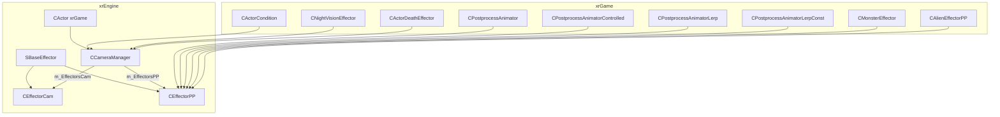
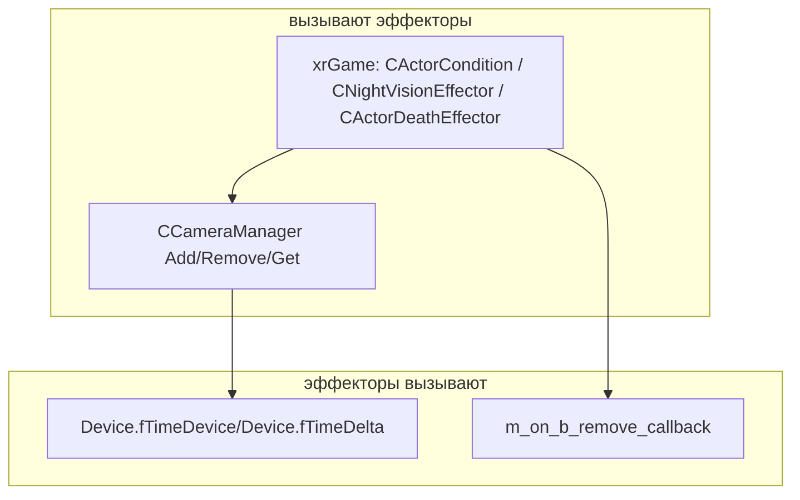
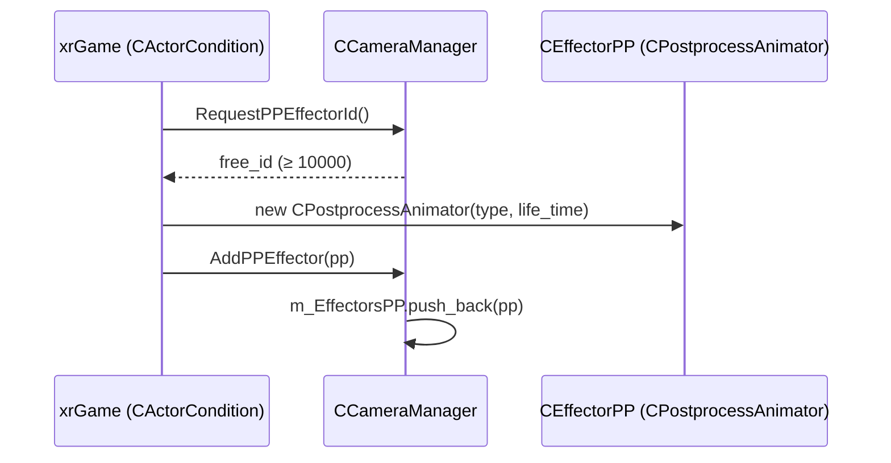
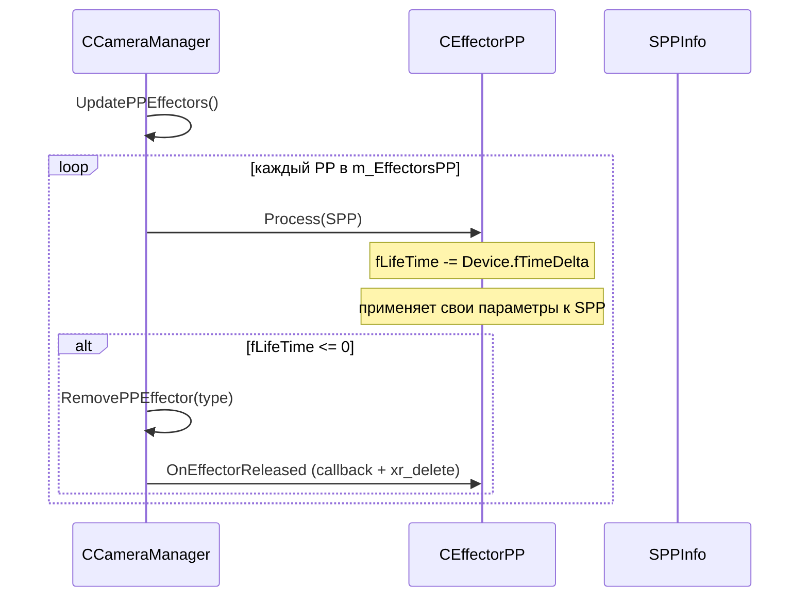
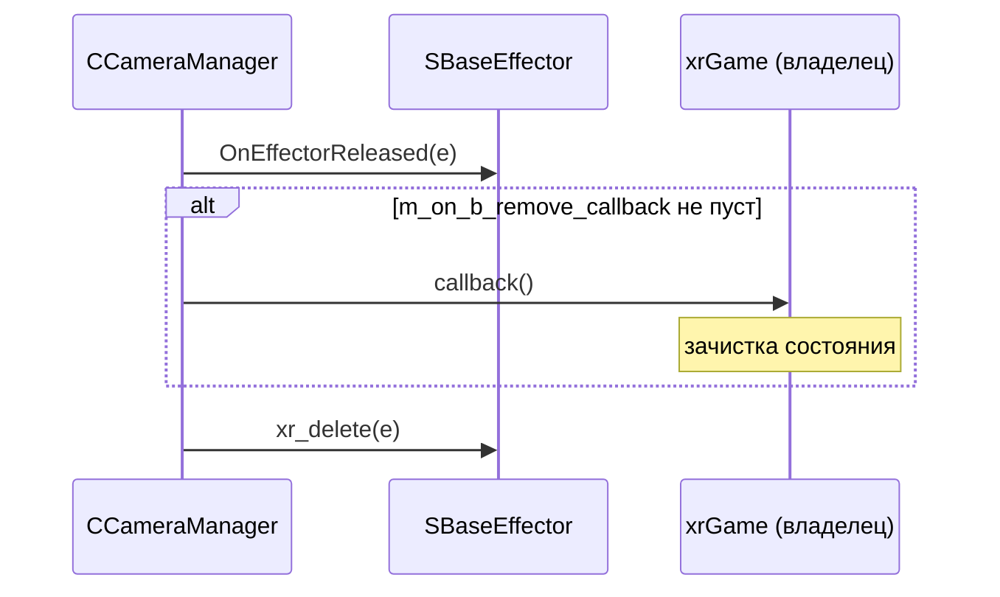

# Эффекторы

**Эффекторы** — временные модификаторы камеры и постобработки, привязанные к **актору** (через `CCameraManager` актёра). Две ветки:

- **Камерные** (`CEffectorCam`) — влияют на параметры камеры (`SCamEffectorInfo`): тряска, zoom, recoil и т.п.
- **Пост-эффекторы** (`CEffectorPP`) — влияют на постобработку (`SPPInfo`): ночное зрение, «умираю», «удар», психоз и т.п.

Оба наследуют `SBaseEffector` (объявлен в `src/xrEngine/CameraDefs.h`):

```cpp
struct ENGINE_API SBaseEffector
{
    typedef fastdelegate::FastDelegate0<> CB_ON_B_REMOVE;
    CB_ON_B_REMOVE m_on_b_remove_callback;
    virtual ~SBaseEffector() {}
};
```

`m_on_b_remove_callback` — **обратный вызов при удалении** эффектора из `CCameraManager` (`OnEffectorReleased`): вызывается **до** `xr_delete`. Позволяет владельцу (например, `CActorDeathEffector`) зачистить своё состояние.

Чего это **НЕ делает**: не хранит эффекты в движке глобально (нет «глобального реестра эффекторов»); каждый экземпляр живёт в `m_EffectorsCam`/`m_EffectorsPP` конкретного `CCameraManager` (актёра). Не реализует саму постобработку — это xrRender (итерация 3). Не управляет временем жизни самостоятельно — только `fLifeTime` (таймер обратного отсчёта).

См. [Камера](camera.md) (порцион 11), [Окружение](environment.md), [Device](device.md).

## Место в архитектуре



## Публичный API

### `CEffectorCam` (`src/xrEngine/Effector.h`)

Наследник `SBaseEffector`. Камерный эффект с таймером.

| Поле / метод                            | Описание                                                                                                                                          |
| --------------------------------------- | ------------------------------------------------------------------------------------------------------------------------------------------------- |
| `eType` (`ECamEffectorType`)            | тип эффекта (`cefDemo = 0`, `cefNext = 1`; реальные типы — в xrGame, см. ниже)                                                                    |
| `fLifeTime`                             | оставшееся время (с); минусуется в `ProcessCam`                                                                                                   |
| `bHudAffect`                            | влияет ли на HUD (по умолчанию `true`)                                                                                                            |
| `SetType(type)` / `GetType()`           | смена/чтение типа                                                                                                                                 |
| `SetHudAffect(bool)` / `GetHudAffect()` | смена/чтение влияния на HUD                                                                                                                       |
| `Valid()`                               | `fLifeTime > 0`                                                                                                                                   |
| `ProcessCam(SCamEffectorInfo&)`         | **чистый виртуальный в базе** — только минусует `fLifeTime -= Device.fTimeDelta` и возвращает `Valid()`. Реальная работа — в наследниках (xrGame) |
| `ProcessIfInvalid(info)`                | вызывается, когда `Valid() == false` (база — пустая)                                                                                              |
| `AllowProcessingIfInvalid()`            | `false` (база) — не обрабатывать невалидные                                                                                                       |
| `AbsolutePositioning()`                 | `false` (база)                                                                                                                                    |
| `IsHudMotionEffector()`                 | `false` (база)                                                                                                                                    |

Конструкторы:

- `CEffectorCam()` — дефолт: `eType = 0`, `fLifeTime = 0`, `bHudAffect = true`;
- `CEffectorCam(ECamEffectorType type, float tm)` — с типом и временем жизни.

### `CEffectorPP` (`src/xrEngine/EffectorPP.h`)

Наследник `SBaseEffector`. Пост-эффект с таймером.

| Поле / метод                | Описание                                                                    |
| --------------------------- | --------------------------------------------------------------------------- |
| `eType` (`EEffectorPPType`) | тип (`ppeNext = 0`; реальные — в xrGame)                                    |
| `fLifeTime`                 | оставшееся время (с)                                                        |
| `bFreeOnRemove`             | освободить ли память при удалении из `CCameraManager` (по умолчанию `true`) |
| `bOverlap`                  | можно ли наслаивать (по умолчанию `true`)                                   |
| `Process(SPPInfo&)`         | минусует `fLifeTime -= Device.fTimeDelta`, возвращает `TRUE` (база)         |
| `Valid()`                   | `fLifeTime > 0`                                                             |
| `Type()` / `SetType(t)`     | чтение/смена типа                                                           |
| `FreeOnRemove()`            | чтение `bFreeOnRemove`                                                      |
| `Stop(float speed)`         | `fLifeTime = 0` (параметр `speed` не используется в базе)                   |

Конструкторы:

- `CEffectorPP()` — дефолт: `bFreeOnRemove = true`, `fLifeTime = 0`, `bOverlap = true`;
- `CEffectorPP(EEffectorPPType type, f32 lifeTime, bool free_on_remove = true)`.

### Типы эффекторов (xrGame, `src/xrGame/CameraEffector.h`)

Объявлены **в xrGame** (не в xrEngine):

**Камерные** (`ECamEffectorType`):

| Имя                   | Значение                        |
| --------------------- | ------------------------------- |
| `cefDemo`             | 0 (в xrEngine)                  |
| `cefNext`             | 1 (в xrEngine)                  |
| `eCEFall`             | `cefNext+1` (падение)           |
| `eCENoise`            | `cefNext+2` (шум)               |
| `eCEShot`             | `cefNext+3` (выстрел)           |
| `eCEZoom`             | `cefNext+4`                     |
| `eCERecoil`           | `cefNext+5` (отдача)            |
| `eCEBobbing`          | `cefNext+6` (покачивание)       |
| `eCEHit`              | `cefNext+7` (удар)              |
| `eCEUser`             | `cefNext+11`                    |
| `eCEControllerPsyHit` | `cefNext+12`                    |
| `eCEVampire`          | `cefNext+13`                    |
| `eCEPseudoGigantStep` | `cefNext+14`                    |
| `eCEMonsterHit`       | `cefNext+15`                    |
| `eCEDOF`              | `cefNext+16` (глубина резкости) |
| `eCEWeaponAction`     | `cefNext+17`                    |
| `eCEActorMoving`      | `cefNext+18`                    |

**Пост-эффекторы** (`EEffectorPPType`):

| Имя                                   | Значение                                      |
| ------------------------------------- | --------------------------------------------- |
| `effHit`                              | 51                                            |
| `effAlcohol`                          | 52                                            |
| `effFireHit`                          | 53                                            |
| `effExplodeHit`                       | 54                                            |
| `effNightvision`                      | 55                                            |
| `effPsyHealth`                        | 56                                            |
| `effControllerAura`                   | 57                                            |
| `effControllerAura2`                  | 58                                            |
| `effBigMonsterHit`                    | 59                                            |
| `effActorDeath`                       | 60                                            |
| `effPoltergeistTeleDetectStartEffect` | 2048 (резерв для полтергейстов, ~50 констант) |
| `effCustomEffectorStartID`            | 10000 (резерв для пользовательских)           |

`eStartEffectorID = 50` — базовый сдвиг для PP-эффекторов.

## Внутреннее устройство

### `SBaseEffector`

Минимальная база: только `m_on_b_remove_callback` (fastdelegate) и виртуальный деструктор. Никакого состояния — вся логика в наследниках.

### `CEffectorCam`

- **`ProcessCam`** в базе — только таймер. Наследники (xrGame) переопределяют и **вызывают `inherited::ProcessCam(info)`** (минусуют `fLifeTime`), а затем применяют свои изменения к `info` (позиция, FOV, far и т.п.).
- **`bHudAffect`** — флаг, влияет ли эффект на HUD-рендер (например, при смене камеры). По умолчанию `true`.
- **`ProcessIfInvalid`** — вызывается `CCameraManager`, когда эффект уже невалиден (таймер истёк), но ещё не удалён. Позволяет «гасить» эффект плавно.
- **`AllowProcessingIfInvalid`** — если `false` (база), `CCameraManager` не вызывает `ProcessIfInvalid`.
- **`AbsolutePositioning`** — если `true`, эффект задаёт абсолютную позицию камеры (не относительную).
- **`IsHudMotionEffector`** — если `true`, эффект считается «движением HUD» (для HUD-рендера).

### `CEffectorPP`

- **`Process`** в базе — только таймер. Наследники (xrGame: `CPostprocessAnimator` и др.) переопределяют и применяют свои параметры к `SPPInfo` (ночное зрение, психоз, смерть и т.п.).
- **`bFreeOnRemove`** — при удалении из `CCameraManager` (`RemovePPEffector`): если `true` → `OnEffectorReleased` (вызов callback + `xr_delete`), если `false` → только `erase` из контейнера (вещь владеет памятью).
- **`bOverlap`** — если `true`, эффект может наслаиваться на другие PP-эффекты (не исключает их).
- **`Stop(speed)`** — мгновенная остановка (`fLifeTime = 0`). Параметр `speed` в базе не используется (наследники могут его интерпретировать).

### `CCameraManager` (управление эффекторами)

Из `src/xrEngine/CameraManager.h` (устройство — [Камера](camera.md), порцион 11):

- `m_EffectorsCam` (`xr_vector<CEffectorCam*>`) — камерные эффекты;
- `m_EffectorsPP` (`xr_vector<CEffectorPP*>`) — пост-эффекты;
- `AddCamEffector(CEffectorCam*)` / `AddPPEffector(CEffectorPP*)` — добавление;
- `GetCamEffector(type)` / `GetPPEffector(type)` — поиск по типу;
- `RemoveCamEffector(type)` / `RemovePPEffector(type)` — удаление (с `OnEffectorReleased`);
- `RequestCamEffectorId()` / `RequestPPEffectorId()` — поиск свободного `ID` начиная с `effCustomEffectorStartID = 10000`;
- `OnEffectorReleased(SBaseEffector* e)` — вызывает `m_on_b_remove_callback` (если не пуст) + `xr_delete(e)`.

## Взаимодействие



**Вызывает эффекторы**:

- `CCameraManager` — `AddCamEffector`/`AddPPEffector` (из xrGame: `CActorCondition::UpdateCondition`, `CNightVisionEffector`, `CActorDeathEffector`, `CPostprocessAnimator` и др.);
- `CCameraManager` — `ProcessCam`/`Process` (в `UpdatePPEffectors`/`ProcessCameraEffector`);
- xrGame — `Stop` (например, `CNightVisionEffector::Stop`).

**Эффекторы вызывают**:

- `Device.fTimeDelta` — для таймера;
- `m_on_b_remove_callback` — при удалении из `CCameraManager` (обратный вызов владельцу).

## Потоки данных

### Добавление PP-эффекта (xrGame)



### Кадр (UpdatePPEffectors)



### Удаление (OnEffectorReleased)



## Конфигурация

Эффекторы **не читают конфиги напрямую** — их параметры задаются xrGame (через `pSettings`, `CInifile` и т.п.). В xrEngine — только каркас (таймер + тип + callback).

Типичные секции в `pSettings` (xrGame):

- `effector_psy_health_<level>` — параметры психоза (уровень);
- `effector_nightvision` — параметры ночного зрения;
- `pp_eff_*` — параметры пост-эффектов (цикл, overlap, имя шейдера и т.п.).

## Известные ограничения / дебаг

- **`CEffectorCam::ProcessCam`** в базе — только таймер. Если наследник **не** вызывает `inherited::ProcessCam(info)` — `fLifeTime` не минусуется (эффект живёт вечно).
- **`CEffectorPP::Stop(speed)`** — параметр `speed` в базе **не используется** (игнорируется). Наследники могут его интерпретировать (например, для плавного затухания).
- **`bFreeOnRemove = false`** — эффект **не** освобождается при удалении из `CCameraManager` (только `erase`). Владелец **должен** сам удалить его (иначе — утечка).
- **`effCustomEffectorStartID = 10000`** — пользовательские типы начинаются с 10000. Если в xrGame объявлено > 10000 типов — `RequestPPEffectorId` может вернуться с уже занятым `ID` (нет проверки границ).
- **`m_on_b_remove_callback`** — вызывается **до** `xr_delete`. В callback нельзя обращаться к уже удалённому объекту (только к владельцу).
- **`SPPInfo`** — forward-декларация в xrEngine (`struct SPPInfo;`), полная определение — в xrRender (итерация 3).
- **`SCamEffectorInfo`** — полный struct в `CameraDefs.h`: `p` (позиция), `d` (направление), `n` (normal), `r` (right), `fFov`, `fFar`, `fAspect`, `dont_apply`, `affected_on_hud`.
- Не покрыто: `CPostprocessAnimator`/`CPostprocessAnimatorControlled`/`CPostprocessAnimatorLerp`/`CPostprocessAnimatorLerpConst` (xrGame), `CActorDeathEffector` (xrGame), `CNightVisionEffector` (xrGame), `CCameraManager` подробно (порцион 11 — [Камера](camera.md)), `SPPInfo`/`IRender_Target` (xrRender, итерация 3).
