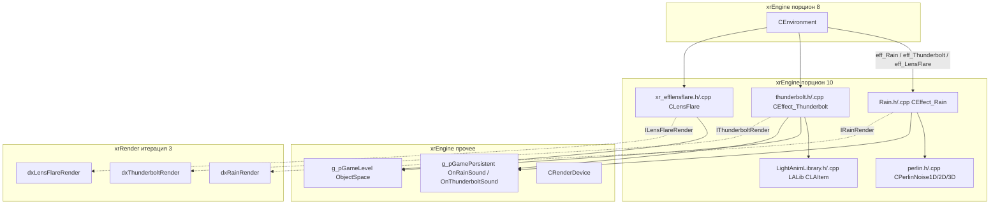
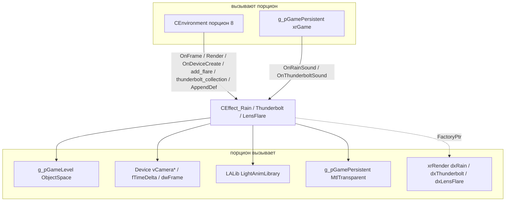
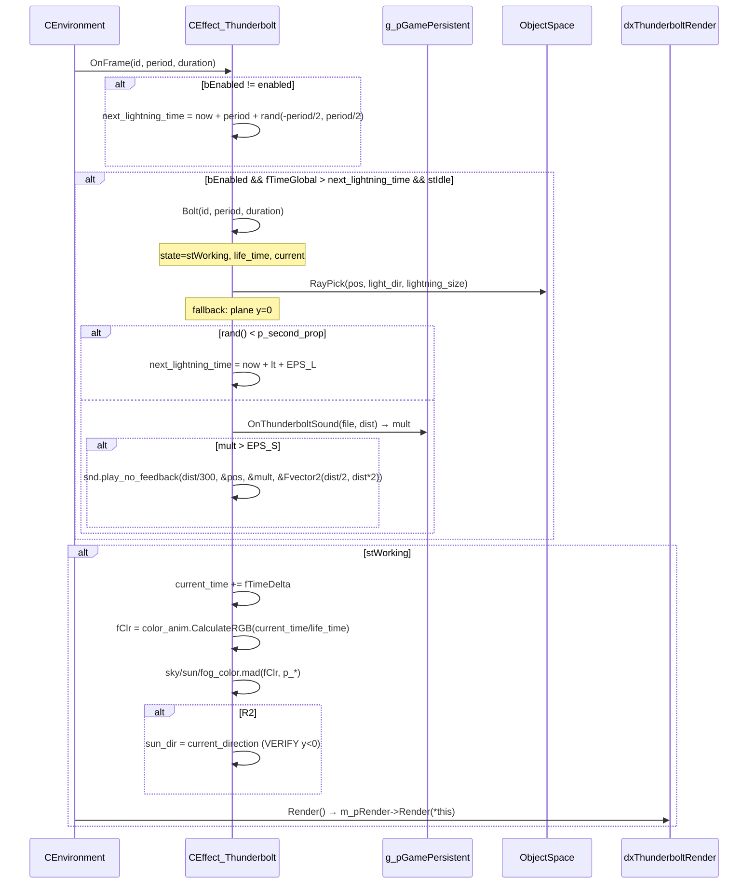

# Визуальные эффекты

Порцион покрывает пять файлов xrEngine, из которых состоит «внешний» слой погодной визуализации:

- **`perlin.h/.cpp`** — когерентный шум (Ken Perlin) в 1D/2D/3D; в рантайме живьём используется только `CPerlinNoise1D` (порывы ветра и дождя);
- **`thunderbolt.h/.cpp`** — `CEffect_Thunderbolt`: молнии (модель + два градиента + звук грома), состояние `stIdle/stWorking`;
- **`Rain.h/.cpp`** — `CEffect_Rain`: дождь (амбиентный звук + пул частиц-«брызг»), состояние `stIdle/stWorking`;
- **`LightAnimLibrary.h/.cpp`** — `CLAItem`/`ELightAnimLibrary` (`LALib`): библиотека цветовых keyframe-анимаций, формат `$game_data$\lanims.xr`;
- **`xr_efflensflare.h/.cpp`** — `CLensFlare`/`CLensFlareDescriptor`: линзовые флэры (source/flare/gradient) с ray-occlusion по 5 лучам.

Все три эффекта (дождь, молнии, флэры) **не рисуют сами**: визуализация делегирована рендер-бэкендам через `FactoryPtr` (`IRainRender`/`IThunderboltRender`/`ILensFlareRender`/`IFlareRender`, реализованы `dxRainRender`/`dxThunderboltRender`/`dxLensFlareRender` в xrRender, итерация 3). В xrEngine — данные, состояние, тайминги, геометрия лучей и звук; старая D3D9-визуализация в каждом файле **закомментирована**.

Чего это **НЕ делает**: не управляет циклами погоды и описанием погоды (`CEnvironment`, [Окружение](environment.md)); не хранит шейдеры/текстуры (они в рендер-слое); не читает `pSettings` (параметры `p_*` читаются `CEnvironment::load`).

См. [Окружение](environment.md) (владелец эффектов, параметры `p_*`, `add_flare`, `thunderbolt_collection`), [Device](device.md), [Рендер-слой](render.md), [Renderer](../renderer/index.md).

## Место в архитектуре



## Публичный API

### `CPerlinNoiseCustom` / `CPerlinNoise1D` / `2D` / `3D` (`src/xrEngine/perlin.h`)

| Поле / метод                                                                 | Описание                                                                                 |
| ---------------------------------------------------------------------------- | ---------------------------------------------------------------------------------------- |
| `mSeed` (`int`, protected)                                                   | Зёрно ГПСЧ; `init()` вызывается лениво при первом `noise()` через `srand(mSeed)`         |
| `mReady` (`bool`, protected)                                                 | Флаг «инициализирован»; до первого `noise()` — `false`                                   |
| `p[SAMPLE_SIZE*2+2]` (protected)                                             | Таблица перестановок, `SAMPLE_SIZE = 256`, дублируется для безшовности (`p[B+i] = p[i]`) |
| `mOctaves = 2`, `mFrequency = 1`, `mAmplitude = 1`                           | Параметры октавного суммирования                                                         |
| `mTimes` (`xr_vector<float>`)                                                | Накопительное время на октаву (только `GetContinious`)                                   |
| `SetParams(oct, freq, amp)` / `SetOctaves` / `SetFrequency` / `SetAmplitude` | Настройка; `SetOctaves` ресайзит `mTimes`                                                |

| Класс            | Методы                                                                                 |
| ---------------- | -------------------------------------------------------------------------------------- |
| `CPerlinNoise1D` | `Get(x)` — stateless-октавы; `GetContinious(v)` — сглаженный по времени шум (см. ниже) |
| `CPerlinNoise2D` | `Get(x, y)`                                                                            |
| `CPerlinNoise3D` | `Get(x, y, z)`                                                                         |

### `SThunderboltDesc` / `SThunderboltCollection` / `CEffect_Thunderbolt` (`src/xrEngine/thunderbolt.h`)

`SThunderboltDesc` — описание **одного** типа молнии:

| Поле                                 | Тип                                                                                                 | Описание                                                   |
| ------------------------------------ | --------------------------------------------------------------------------------------------------- | ---------------------------------------------------------- |
| `m_pRender`                          | `FactoryPtr<IThunderboltDescRender>`                                                                | Создание/уничтожение модели (`CreateModel`/`DestroyModel`) |
| `snd`                                | `ref_sound`                                                                                         | Звук грома (`st_Effect`), создаётся в `load`               |
| `m_GradientTop` / `m_GradientCenter` | `SFlare*` (внутри: `fOpacity`, `Fvector2 fRadius`, `texture`, `shader`, `FactoryPtr<IFlareRender>`) | Два градиента-подсветки неба                               |
| `name`                               | `shared_str`                                                                                        | Имя секции                                                 |
| `color_anim`                         | `CLAItem*`                                                                                          | Цветовая анимация (`LALib.FindItem`)                       |

| Метод                                            | Описание                                                                                                                 |
| ------------------------------------------------ | ------------------------------------------------------------------------------------------------------------------------ |
| `SThunderboltDesc()` / `~SThunderboltDesc()`     | Деструктор: `m_pRender->DestroyModel()`, `DestroyShader()` для обоих градиентов, `snd.destroy()`, `xr_delete` градиентов |
| `load(CInifile&, shared_str const&)`             | Загрузка секции (см. Конфигурация); **`color_anim->fFPS = (float)iFrameCount`** (перекрывает FPS анимации)               |
| `create_top_gradient` / `create_center_gradient` | Читают `gradient_top_*`/`gradient_center_*` + `CreateShader`                                                             |

`SThunderboltCollection` — палитра (секция-контейнер):

| Поле / метод                     | Описание                                                                                   |
| -------------------------------- | ------------------------------------------------------------------------------------------ |
| `palette` (`DescVec`)            | Набранные `SThunderboltDesc*`                                                              |
| `section`                        | Имя секции-контейнера                                                                      |
| `load(pIni, thunderbolts, sect)` | Читает строки секции → для каждой `Environment().thunderbolt_description(thunderbolts, N)` |
| `GetRandomDesc()`                | `palette[Random.randI(size)]` (`VERIFY(size > 0)`)                                         |

`CEffect_Thunderbolt` — эффект молний (friend `dxThunderboltRender`):

| Поле / метод                                                                                   | Описание                                                  |
| ---------------------------------------------------------------------------------------------- | --------------------------------------------------------- |
| `collection` (`CollectionVec`), `current` (`SThunderboltDesc*`)                                | Кэш коллекций + текущее описание                          |
| `current_xform`, `current_direction`, `lightning_center`, `lightning_size`, `lightning_phase`  | Геометрия/фаза текущего разряда                           |
| `state` (`stIdle`/`stWorking`), `life_time`, `current_time`, `next_lightning_time`, `bEnabled` | Состояние                                                 |
| `m_pRender` (`FactoryPtr<IThunderboltRender>`)                                                 | Делегирование рендера                                     |
| `OnFrame(id, period, duration)`                                                                | Тик (см. Внутреннее устройство)                           |
| `Render()`                                                                                     | Делегат `m_pRender->Render(*this)` (только в `stWorking`) |
| `AppendDef(environment, pIni, thunderbolts, sect)`                                             | Кэш коллекций по имени секции                             |
| `Bolt(id, period, life_time)` (private)                                                        | Генерация разряда                                         |
| `RayPick(s, d, dist)` (private)                                                                | Мир-луч (`_EDITOR`: `Tools->RayPick`)                     |

### `CEffect_Rain` (`src/xrEngine/Rain.h`)

| Поле / метод                                                                | Описание                                                              |
| --------------------------------------------------------------------------- | --------------------------------------------------------------------- |
| `m_pRender` (`FactoryPtr<IRainRender>`)                                     | Делегирование визуализации (friend `dxRainRender`)                    |
| `items` (`xr_vector<Item>`)                                                 | Старый D3D9-вектор капель; **не используется** активной визуализацией |
| `state` (`stIdle`/`stWorking`)                                              | Состояние                                                             |
| `particle_pool` / `particle_active` / `particle_idle`                       | Интрузивный пул частиц (связные списки поверх вектора)                |
| `snd_Ambient` (`ref_sound`), `rain_volume`, `rain_hemi`, `rain_volume_mult` | Звук дождя + громкость                                                |
| `RainPerlin` (`CPerlinNoise1D*`)                                            | Порывы ветра (seed `randI(0,0xFFFF)`, 2 октавы, amp 0.66666)          |
| `Render()` / `OnFrame()`                                                    | Делегат рендера / тик                                                 |
| `InvalidateState()`                                                         | Стоп звука + сброс в `stIdle`                                         |
| `GetRainVolume()` / `GetRainHemi()`                                         | Геттеры громкости/освещения                                           |
| `Born` / `Hit` / `RayPick` / `RenewItem` / `Prepare` (private)              | Логика капель; `Hit` живьём (частицы), остальное — legacy             |

### `CLAItem` / `ELightAnimLibrary` (`src/xrEngine/LightAnimLibrary.h`)

| Поле / метод (`CLAItem`)                                                      | Описание                                                                   |
| ----------------------------------------------------------------------------- | -------------------------------------------------------------------------- |
| `cName` (`shared_str`), `fFPS` (def 15), `def_fFPS`                           | Имя + частота кадров анимации                                              |
| `Keys` (`KeyMap` = `map<int frame, u32 color>`), `iFrameCount`                | Ключи + длина в кадрах                                                     |
| `Load` / `Save`                                                               | LTX-чанки `CHUNK_ITEM_COMMON`/`CHUNK_ITEM_KEYS`                            |
| `Length_sec()` / `Length_ms()`                                                | `iFrameCount / fFPS`                                                       |
| `InterpolateRGB(frame)` / `InterpolateBGR`                                    | Точный ключ или lerp между скобками; после последнего — последний          |
| `CalculateRGB(T, frame&)` / `CalculateBGR`                                    | `frame = floor(fmod(T, iFrameCount/fFPS) * fFPS)` (T — секунды, зациклено) |
| `SetFramerate` / `ResetFramerate`                                             | Смена/восстановление FPS                                                   |
| `Resize(len)`                                                                 | При росте переносит последний ключ, при сжатии отбрасывает хвост           |
| `InsertKey` / `DeleteKey` (0-й — нет) / `MoveKey` / `IsKey`                   | Управление ключами                                                         |
| `PrevKeyFrame` / `NextKeyFrame` / `FirstKeyFrame` / `LastKeyFrame` / `GetKey` | Навигация                                                                  |

| Метод (`ELightAnimLibrary`)           | Описание                                                       |
| ------------------------------------- | -------------------------------------------------------------- |
| `Load` / `Save` / `Reload` / `Unload` | Файл `$game_data$\lanims.xr` (см. Конфигурация)                |
| `OnCreate` / `OnDestroy`              | Делегаты `Load`/`Unload`                                       |
| `FindItem(name)` / `FindItemI(name)`  | Линейный `xr_strcmp` по `cName`                                |
| `AppendItem(name, src)`               | `VERIFY2` без дубликатов; копирование `*src` или `InitDefault` |
| `RemoveObject` / `RenameObject`       | Только `#ifdef _EDITOR`                                        |

Глобал: `extern ENGINE_API ELightAnimLibrary LALib;` (определён в `LightAnimLibrary.cpp`).

### `CLensFlareDescriptor` / `CLensFlare` (`src/xrEngine/xr_efflensflare.h`)

`CLensFlareDescriptor` — описание **одного** пресета флэров:

| Поле / метод                                                                                     | Описание                                                                                     |
| ------------------------------------------------------------------------------------------------ | -------------------------------------------------------------------------------------------- |
| `m_Flares` (`FlareVec`), `m_Source` (`SSource : SFlare {ignore_color}`), `m_Gradient` (`SFlare`) | Элементы: `SFlare {fOpacity, fRadius, fPosition, texture, shader, FactoryPtr<IFlareRender>}` |
| `m_Flags` (`Flags32`: `flFlare=1`, `flSource=2`, `flGradient=4`)                                 | Какие элементы присутствуют                                                                  |
| `m_StateBlendUpSpeed` / `m_StateBlendDnSpeed` (def 0.1)                                          | Скорости блenda состояния                                                                    |
| `section`                                                                                        | Имя секции                                                                                   |
| `SetSource` / `SetGradient` / `AddFlare`                                                         | Программная сборка                                                                           |
| `load(pIni, section)`                                                                            | Загрузка секции (см. Конфигурация); **в конце — `OnDeviceCreate()`**                         |
| `OnDeviceCreate` / `OnDeviceDestroy`                                                             | `CreateShader`/`DestroyShader` для gradient+source+все flares                                |

`CLensFlare` — эффект линзовых флэров (friend `dxLensFlareRender`):

| Поле / метод                                                                 | Описание                                                                |
| ---------------------------------------------------------------------------- | ----------------------------------------------------------------------- |
| `MAX_RAYS = 5`, `m_ray_cache[5]` (`collide::ray_cache`, `#ifndef _EDITOR`)   | Кэш окклюзии                                                            |
| `fBlend`, `dwFrame` (лatch, init `0xfffffffe`), `LightColor`                 | Плавная видимость + once-per-frame                                      |
| `fGradientValue`, `m_pRender` (`ILensFlareRender`), `m_Palette`, `m_Current` | Градиент + палитра                                                      |
| `m_State` (`LFState`: `lfsNone/lfsIdle/lfsHide/lfsShow`), `m_StateBlend`     | Машина состояний                                                        |
| `OnFrame(id)`                                                                | Тик (см. Внутреннее устройство)                                         |
| `Render(bSun, bFlares, bGradient)`                                           | Делегат `m_pRender->Render` (early out при `!bRender` или `!m_Current`) |
| `OnDeviceCreate` / `OnDeviceDestroy`                                         | Делегаты для всех описаний палитры + `m_pRender`                        |
| `AppendDef(environment, pIni, sect)`                                         | Кэш палитры по секции                                                   |
| `Invalidate()`                                                               | `m_State = lfsNone`                                                     |

## Внутреннее устройство

### `perlin.h/.cpp`

Классический шум Кена Перлина. `init()` заполняет `p` перестановкой `0..255` (Фisher–Yates через `rand()`), градиенты `g1`/`g2`/`g3` — случайные, в 2D/3D — нормализованные. Таблица дублируется: `p[B+i] = p[i]` (`B = SAMPLE_SIZE = 256`), чтобы `& BM` давал безшовное зацепление.

`noise()` — одна октава: для каждой координаты `setup(i, b0, b1, r0, r1)` считает целую/дробную часть (`t = vec[i] + N`, `N = 0x1000` — смещение от отрицательных), затем `lerp(s_curve(rx), dot(rx, g), dot(rx1, g1))` по всем углам куба/квадрата. `s_curve(t) = t*t*(3-2*t)` — плавная кривая, `lerp(t, a, b) = a + t*(b-a)`.

`Get(...)` — stateless-октавы:

```cpp
float amp = mAmplitude;
v *= mFrequency;
for (int i = 0; i < mOctaves; i++) {
    result += noise(v) * amp;
    v *= 2.0f;   // частота удваивается
    amp *= 0.5f; // амплитуда гасится
}
```

`GetContinious(v)` — **сглаженный** шум для анимаций (ветер/дождь): вычитает `mPrevContiniousTime` (чтобы входил **инкремент**, а не абсолютное время) и продвигает `mTimes[i]` на октаву:

```cpp
if (mPrevContiniousTime != 0.f) v -= mPrevContiniousTime;
mPrevContiniousTime = t_v;
...
for (int i = 0; i < mOctaves; i++) {
    mTimes[i] += v;
    result += noise(mTimes[i]) * amp;
    v *= 2.0f; amp *= 0.5f;
}
```

Именно `GetContinious` используется в `Rain.cpp` (`Wind_Gust = RainPerlin->GetContinious(fTimeGlobal * 0.3f) * 2.0f`) и в `CEnvironment` (`wind_strength_factor`, см. [Окружение](environment.md)).

### `thunderbolt.h/.cpp`

**`SThunderboltDesc::load`** читает секцию из `m_thunderbolts_config`: `gradient_top_*`/`gradient_center_*` (см. Конфигурация), `name = sect`, `color_anim = LALib.FindItem(r_string("color_anim"))` (`VERIFY`), **`color_anim->fFPS = (float)iFrameCount`** (перекрывает FPS), `lightning_model` → `m_pRender->CreateModel`, `sound` → `snd.create(name, st_Effect, sg_Undefined)`.

**`SThunderboltCollection::load`**: `line_count(sect)` строк → для каждой `r_line` → `Environment().thunderbolt_description(thunderbolts, N)` (кэш по имени, порцион 8).

**`CEffect_Thunderbolt::Bolt(id, period, lt)`** (генерация разряда):

1. `state = stWorking`; `life_time = lt + rand(-lt/2, lt/2)`; `current_time = 0`.
2. `current = thunderbolt_collection(collection, id)->GetRandomDesc()`.
3. Позиция: `sun_dir.getHP(sun_h, sun_p)`; `lng = rand(sun_h - p_var_long + PI, sun_h + p_var_long + PI)` (за солнцем); `dist = rand(FAR_DIST*p_min_dist, FAR_DIST*0.95)`; `current_direction.setHP(lng, alt)` (`alt = p_var_alt`); `pos = vCameraPosition + current_direction * dist`.
4. Наклон: `dev = (rand(-p_tilt, p_tilt), rand(0, 2π), rand(-p_tilt, p_tilt))`; `XF.setXYZi(dev)`.
5. `light_dir = (0,-1,0)` трансформируется `XF`; `lightning_size = FAR_DIST * 2`; `RayPick(pos, light_dir, lightning_size)` (мировой луч; **fallback: горизонтальная плоскость y=0**, если нет хита). `lightning_center = pos + light_dir * (lightning_size*0.5)`.
6. `S.scale(lightning_size)`, `current_xform = XF * S` (`mul_43`).
7. Второй разряд: `rand() < p_second_prop` → `next_lightning_time = now + lt + EPS_L`; иначе — clap-звук:
   - **volume gate**: `clap_volume_mult = g_pGamePersistent->OnThunderboltSound(file_name, dist)` (дополнение Monolith: `0` — пропустить, `<1` — приглушить);
   - `snd.play_no_feedback(0, 0, dist/300, &pos, (mult<1)?&mult:0, 0, &Fvector2(dist/2, dist*2))` — дистанция `dist/300` (специфичное масштабирование), диапазон `(dist/2, dist*2)`.
8. `current_direction.invert()` — для env-sun.

**`CEffect_Thunderbolt::OnFrame(id, period, duration)`**:

- `enabled = id.size()`; при смене `bEnabled` — `next_lightning_time = now + period + rand(-period/2, period/2)`.
- Если `bEnabled && fTimeGlobal > next_lightning_time && state == stIdle` → `Bolt(...)`.
- В `stWorking`:
  - `current_time > life_time` → `stIdle`; `current_time += fTimeDelta`.
  - `fClr = color_anim->CalculateRGB(current_time / life_time)` (кламп `[0,1]`).
  - `lightning_phase = clamp(1.5 * (current_time / life_time), 0, 1)`.
  - Подсветка: `sky_color.mad(fClr, p_sky_color)` (+ кламп XYZ), `sun_color.mad(fClr, p_sun_color)`, `fog_color.mad(fClr, p_fog_color)`.
  - **Только `GENERATION_R2`**: `sun_dir = current_direction` + `VERIFY(sun_dir.y < 0)`.

**`Render()`**: только `state == stWorking` → `m_pRender->Render(*this)`. Старая D3D9-инлайн (модель + два градиента через `RCache`) закомментирована.

### `Rain.h/.cpp`

**Конструктор**: `state = stIdle`; `snd_Ambient.create("ambient\\rain", st_Effect, sg_Undefined)`; `rain_volume = 0`; `RainPerlin = xr_new<CPerlinNoise1D>(randI(0, 0xFFFF))`, 2 октавы, amp `0.66666f`; `p_create()` (пул частиц). Старое создание модели/шейдеров закомментировано («Moved to p_Render»).

**`OnFrame()`**:

- `DEDICATED_SERVER` → return; без `g_pGameLevel` → return.
- `rain_density = CurrentEnv->rain_density`; `wind_velocity = wind_velocity * 0.001` (кламп `[0,1]`), **`wind_velocity *= (rain_density > 0 ? 1 : 0)`** (только при дожде).
- `factor = rain_density * 0.5 + wind_velocity * 0.5`.
- `hemi_factor`: из ROS игрока `get_luminocity_hemi_cube()` — `max` по слотам `{0,1,2,3,5}` → EMA: `hemi_factor = hemi_factor * (1 - t) + f * t` (`t = clamp(fTimeDelta, 0.001, 1)`); `rain_hemi = hemi_val`.
- Машина состояний:
  - `stIdle`: `factor < EPS_L` → return; иначе `stWorking`; **`rain_volume_mult = g_pGamePersistent->OnRainSound(file_name)`** (дополнение Monolith: `0` — вето на звук, `<1` — приглушение, **один раз** на включении, зеркало `COnBeforePlayHudSound`); `snd_Ambient.play(0, sm_Looped)`, `set_position(0,0,0)`, `set_range(source_offset, source_offset*2)`.
  - `stWorking`: `factor < EPS_L` → `stIdle`, `snd_Ambient.stop()`, `rain_volume = 0`, return.
- `snd_Ambient._feedback()`: `rain_volume = clamp(factor * hemi_factor, 0.1, 1) * rain_volume_mult`; `set_volume(rain_volume * rain_volume_mult)`.

**`Hit(pos)`** (частицы-«брызги»): 50% шанс (`randI(2)`), иначе return; `p_allocate()` (интрузивный пул: `particle_idle` → `particle_active`); `P->time = particles_time`; `mXForm.rotateY(rand(0,2π))` + `translate_over(pos)`; `bounds` из `m_pRender->GetDropBounds()` (сфера из рендер-слоя).

**`Render()`**: guard `!g_pGameLevel` → return; **`m_pRender->Render(*this)`** — вся старая D3D9-визуализация (капли: born/hit/wrap + строки через `RCache`, частицы) **закомментирована**.

**Legacy-код (жив в заголовке/реализации, но не используется активной визуализацией)**:

- `Item {P, Phit, D, fSpeed, dwTime_Life, dwTime_Hit, uv_set}` + `Born(dest, radius, speed)` — генерация капли (позиция от камеры, направление от ветра через `Prepare`, скорость `rand(40,80) * speed * clamp(wind*1.5, 0.5, 1)`, `RenewItem` по `RayPick`).
- `RenewItem(dest, height, bHit)` — времена жизни/хита.
- `RayPick(s, d, range, tgt)` — мир-луч (`ObjectSpace.RayPick`, `rqtBoth`; `_EDITOR`: `Tools->RayPick`).
- `Prepare(offset, axis, W_Vel, W_Dir)` — ветер: `Wind_Gust = RainPerlin->GetContinious(fTimeGlobal*0.3) * 2`; `pitch = drop_max_angle * W_Vel`; `axis.setHP(W_Dir, pitch - π/2)`; `offset` из геометрии.

Эти методы **не вызываются** из `OnFrame`/`Render` (визуализация капель перенесена в `dxRainRender`); остаются для совместимости/возможного возврата.

### `LightAnimLibrary.h/.cpp`

**`CLAItem`** — цветовая keyframe-анимация. `fFPS` по умолчанию 15; `Keys` — `map<int frame, u32 color>`; `iFrameCount` — длина в кадрах.

`Load`/`Save` — LTX-чанки:

- `CHUNK_ITEM_COMMON (0x0001)`: `stringZ(cName)`, `float(fFPS)`, `u32(iFrameCount)`.
- `CHUNK_ITEM_KEYS (0x0002)`: `u32 count` + пары `(u32 frame, u32 color)`.

`InterpolateRGB(frame)`: точный ключ → цвет; иначе — `upper_bound(frame)` (следующий ключ) и предыдущий, `Fcolor::lerp` с `t = (frame - a0) / (a1 - a0)`; после последнего ключа → последний цвет. `InterpolateBGR` — то же с `color_rgba(B, G, R, A)`.

`CalculateRGB(T, frame&)`: `frame = floor(fmod(T, iFrameCount / fFPS) * fFPS)` — **T — абсолютные секунды**, зациклено длиной анимации.

`Resize(new_len)`: при росте — `MoveKey(old_len, new_len)` (переносит последний ключ); при сжатии — `erase(upper_bound(new_len-1), end())` (отбрасывает хвост). `DeleteKey(0)` — запрещён (`R_ASSERT`).

**`ELightAnimLibrary`** — глобал `LALib`. `Load` читает `$game_data$\lanims.xr`:

- `CHUNK_VERSION (0x0000)`: `u16 version` (если нет чанка — `version = 0`).
- `CHUNK_ITEM_LIST (0x0001)`: вложенные чанки `0, 1, 2, ...` (по одному `CLAItem` каждый).
- **Версия 0 хранит BGR**: при загрузке `it->second = subst_alpha(bgr2rgb(it->second), color_get_A(...))` (конвертация в RGBA).
- `Save` пишет `LANIM_VERSION = 0x0001` (то есть новые файлы — RGBA, без BGR-конвертации).

`FindItem(name)` — линейный `xr_strcmp` по `cName`. `AppendItem` — `VERIFY2` без дубликатов. `RemoveObject`/`RenameObject` — только `#ifdef _EDITOR`.

### `xr_efflensflare.h/.cpp`

**`CLensFlareDescriptor::load`**: `section = sect`; `sun` (bool) → `flSource` + `sun_shader/sun_texture/sun_radius/sun_ignore_color`; `flares` (bool) → `flFlare` + **параллельные comma-списки** `flare_shader/flare_textures/flare_radius/flare_opacity/flare_position` (через `_GetItemCount`/`_GetItem`, `string256` + `atof`); `gradient` через `CInifile::IsBOOL` → `flGradient` + `gradient_shader/texture/radius/opacity`; `blend_rise_time`/`blend_down_time` → `m_StateBlendUpSpeed = 1/(t + EPS_S)`, `m_StateBlendDnSpeed = 1/(t + EPS_S)`. **В конце — `OnDeviceCreate()`** (создание шейдеров).

`OnDeviceCreate`/`OnDeviceDestroy` — `CreateShader`/`DestroyShader` для `m_Gradient`, `m_Source` и всех `m_Flares`.

**`CLensFlare::OnFrame(id)`**:

- **Once-per-frame latch**: `if (dwFrame == Device.dwFrame) return;` (`dwFrame` init `0xfffffffe`); затем `dwFrame = Device.dwFrame`.
- `vSunDir = -CurrentEnv->sun_dir` (`R_ASSERT(_valid)`); `LightColor = CurrentEnv->sun_color`.
- `desc = id.size() ? Environment().add_flare(m_Palette, id) : 0` (кэш по секции, порцион 8).
- Машина состояний `m_State`:
  - `lfsNone` → `lfsShow`, `m_Current = desc`.
  - `lfsIdle`: `desc != m_Current` → `lfsHide`.
  - `lfsShow`: `m_StateBlend += m_StateBlendUpSpeed * fTimeDelta * fTimeFactor`; `>= 1` (или `Environment().m_paused`) → `lfsIdle`, `m_StateBlend = 1`.
  - `lfsHide`: `m_StateBlend -= m_StateBlendDnSpeed * fTimeDelta * fTimeFactor`; `<= 0` (или `m_paused`) → `lfsShow`, `m_Current = desc`, `m_StateBlend = m_StateBlendUpSpeed * fTimeDelta * fTimeFactor` (crossfade).
  - `clamp(m_StateBlend, 0, 1)`.
- Early out: `!m_Current` или `LightColor.magnitude_rgb() == 0` → `bRender = false`.
- Геометрия: `matEffCamPos` (right/top/direction); `vecDir` = направление взгляда; `fDot = vSunDir · vecDir`; **`fDot <= 0.01f` → `bRender = false`** (магическое пороговое значение). `vecCenter = pos + vecDir * (FAR_DIST * 0.75)`; `vecLight = pos + sunDir * (FAR_DIST * 0.75 / fDot)`; `vecAxis = vecLight - vecCenter`.
- **Occlusion**: `vecSx/vecSy` = camera right/top × **`fScale = 0.02f`** (hardcoded, комментарий `HACK: it must be read from the weather!`); 5 лучей через `static RayDeltas[5] = {(0,0),(1,0),(-1,0),(0,-1),(0,1)}`.
  - Для каждого луча: `TP.vis = 1`; кэш: `similar(TP.P, TP.D, TP.f)` → `vis = 0`; `TestRayTri` по закешированным вершинам статического треугольника → `vis = 0` (если хит); иначе — реальный `ObjectSpace.RayQuery(r_dest, RD, material_callback, &TP, NULL, o_main)`.
  - `material_callback`: динамический объект → `MtlTransparent(K->LL_GetData(element).game_mtl_idx)`; статический треугольник → `MtlTransparent(T->material)`; если **полностью непрозрачный** → кэширует вершины треугольника в `pray_cache`; возвращает `vis > vis_threshold` (`EPS_L`); умножает накопленный `TP.vis`.
  - `fVisResult = avg(vis)`; `blend_lerp(fBlend, fVisResult, BLEND_DEC_SPEED=4.0f, fTimeDelta)` (lerp с постоянной скоростью, кламп `0..1`).
- **Gradient**: если `flGradient` — `vecLight` проецируется через `Device.mFullTransform` в экран, `y` инвертируется; `kx/ky` — линейный falloff между `sun_blend = 0.5` и `sun_max = 2.5`; `fGradientValue = kx * ky * m_StateBlend * m_Gradient.fOpacity * fBlend` (иначе `0`).

**`Render(bSun, bFlares, bGradient)`**: early out `!bRender || !m_Current` → `m_pRender->Render(*this, bSun, bFlares, bGradient)`. Старая D3D9-инлайн (source + flares + gradient через `RCache`) **закомментирована**.

**`AppendDef(environment, pIni, sect)`**: кэш по секции — если есть `section == sect` → вернуть; иначе `environment.add_flare(m_Palette, sect)`.

**`OnDeviceCreate`/`OnDeviceDestroy`**: `m_pRender->OnDeviceCreate/Destroy` + по всем описаниям палитры.

`#ifdef _EDITOR`: `Tools->RayPick` для blend, `UI->ZFar()`.

## Взаимодействие



**Вызывают порцион**:

- `CEnvironment` (порцион 8, [Окружение](environment.md)) — владеет `eff_Rain`, `eff_Thunderbolt`, `eff_LensFlare`; вызывает `OnFrame`/`Render`/`OnDeviceCreate`/`OnDeviceDestroy`/`add_flare`/`thunderbolt_description`/`thunderbolt_collection`/`AppendDef` из своего `OnFrame`/`RenderLast`/device-hook.
- `g_pGamePersistent->OnRainSound(file_name)` / `OnThunderboltSound(file_name, dist)` (xrGame, `IGame_Persistent`) — хуки громкости (дополнение Monolith).

**Порцион вызывает**:

- `CRenderDevice` (`Device.vCameraPosition/Right/Top/Direction`, `Device.fTimeDelta`, `Device.fTimeGlobal`, `Device.dwFrame`, `Device.mFullTransform`).
- `g_pGameLevel->ObjectSpace` (`RayPick`/`RayQuery`, `GetStaticTris`/`GetStaticVerts`).
- `g_pGamePersistent->MtlTransparent(mtl_idx)`.
- `LALib` (`FindItem`).
- Рендер-бэкенды: `IRainRender`/`IThunderboltRender`/`IThunderboltDescRender`/`ILensFlareRender`/`IFlareRender` (определены в `src/Include/xrRender/*`, реализованы xrRender, итерация 3).
- `ref_sound` (гром), `Random`, `CInifile`, `FactoryPtr`.

`perlin.h` также включается `Rain.cpp` и `Environment.cpp` (ветер `CPerlinNoise1D` в `CEnvironment`).

## Потоки данных

### Молнии (Bolt → OnFrame → Render)



### Линзовые флэры (OnFrame → Render)

```mermaid
sequenceDiagram
    participant Env as CEnvironment
    participant LF as CLensFlare
    participant ObjSpace as ObjectSpace
    participant Rnd as dxLensFlareRender

    Env->>LF: OnFrame(id)
    Note over LF: once-per-frame latch (dwFrame)
    LF->>LF: vSunDir = -sun_dir, LightColor = sun_color
    LF->>Env: add_flare(m_Palette, id) → desc
    Note over LF: state machine lfsNone/Idle/Hide/Show
    alt !m_Current || LightColor.magnitude_rgb()==0
        LF->>LF: bRender = false
    end
    LF->>LF: fDot = vSunDir·vecDir
    alt fDot <= 0.01
        LF->>LF: bRender = false
    end
    loop 5 rays
        LF->>LF: cache similar() / TestRayTri
        alt cache miss
            LF->>ObjSpace: RayQuery(r_dest, RD, material_callback, &TP, NULL, o_main)
            Note over ObjSpace: MtlTransparent, cache static tri verts
        end
    end
    LF->>LF: fVisResult = avg(vis); blend_lerp(fBlend, fVisResult, 4.0, dt)
    alt flGradient
        LF->>LF: project vecLight to screen; fGradientValue
    end
    Env->>Rnd: Render(bSun, bFlares, bGradient) → m_pRender->Render(...)
```

## Конфигурация

Порцион читает конфиги **только** через `CInifile` (делегированные секции); глобальные `p_*`-параметры читаются `CEnvironment::load` (см. [Окружение](environment.md)).

**Молнии** (`m_thunderbolts_config`, секции-описания):

```ini
[<bolt_name>]
gradient_top_shader = ...
gradient_top_texture = ...
gradient_top_radius = x y
gradient_top_opacity = f
gradient_center_shader = ...
gradient_center_texture = ...
gradient_center_radius = x y
gradient_center_opacity = f
color_anim = <name in lanims.xr>
lightning_model = <model>
sound = <sound>
```

Коллекции (`m_thunderbolt_collections_config`): секция-контейнер со строками `<key> = <bolt_name>` → `thunderbolt_description`.

**Линзовые флэры** (секции, через `add_flare`/`AppendDef`):

```ini
[<flare_name>]
sun = true|false
sun_shader = ...
sun_texture = ...
sun_radius = f
sun_ignore_color = true|false
flares = true|false
flare_shader = ...
flare_textures = tex0, tex1, ...
flare_radius = r0, r1, ...
flare_opacity = o0, o1, ...
flare_position = p0, p1, ...
gradient = true|false
gradient_shader = ...
gradient_texture = ...
gradient_radius = f
gradient_opacity = f
blend_rise_time = f
blend_down_time = f
```

**`lanims.xr`** (`$game_data$\lanims.xr`, LTX): `CHUNK_VERSION (0x0000)` (`u16 version`, нет → 0/BGR), `CHUNK_ITEM_LIST (0x0001)` → вложенные чанки `0..N` (каждый `CLAItem`: `CHUNK_ITEM_COMMON` + `CHUNK_ITEM_KEYS`). `Save` пишет `LANIM_VERSION = 0x0001` (RGBA).

**Параметры `CEnvironment` (порцион 8)**, используемые порционом: `p_var_alt`, `p_var_long`, `p_min_dist`, `p_tilt`, `p_second_prop`, `p_sky_color`, `p_sun_color`, `p_fog_color` (молнии); `rain_density`, `wind_velocity`, `wind_direction`, `far_plane`, `sun_dir`, `sun_color`, `fTimeFactor`, `m_paused` (дождь/флэры).

## Известные ограничения / дебаг

- **Старая D3D9-визуализация закомментирована** в `Rain.cpp` (капли + частицы), `thunderbolt.cpp` (модель + градиенты), `xr_efflensflare.cpp` (source/flares/gradient). Активная визуализация — в рендер-бэкендах (`dxRainRender`/`dxThunderboltRender`/`dxLensFlareRender`, xrRender, итерация 3). В xrEngine — только данные/состояние/геометрия/звук.
- **`Rain.items` / `Born` / `RenewItem` / `Prepare`** — живы в заголовке/реализации, но **не вызываются** активной визуализацией (перенесена в `dxRainRender`). Константы `max_desired_items`, `source_radius`, `source_offset`, `max_distance`, `sink_offset`, `drop_*` — `static const` в `Rain.cpp` с комментарием «duplicated in dxRainRender» (дублирование).
- **`color_anim->fFPS = (float)iFrameCount`** (в `SThunderboltDesc::load`) — перекрывает FPS анимации длиной в кадрах; `CalculateRGB` использует этот `fFPS`.
- **`LANIM_VERSION = 0x0001`** при записи; файлы **без** чанка версии читаются как версия 0 (BGR) и конвертируются в RGBA при загрузке. Не путать с `hdrLEVEL`-версиями.
- **`fScale = 0.02f`** (в `CLensFlare::OnFrame`) — hardcoded, комментарий `HACK: it must be read from the weather!`.
- **`fDot <= 0.01f`** (cull) и **`FAR_DIST * 0.75f`** — магические числа в `CLensFlare::OnFrame`.
- **Once-per-frame latch** (`dwFrame`) в `CLensFlare::OnFrame` — тик выполняется **один раз** за кадр (`dwFrame = 0xfffffffe` init).
- **R2-only**: `sun_dir = current_direction` + `VERIFY(sun_dir.y < 0)` в `CEffect_Thunderbolt::OnFrame` — только при `GENERATION_R2`.
- **`Bolt` clap-звук**: дистанция `dist / 300.f` (специфичное масштабирование), диапазон `Fvector2(dist/2, dist*2)` — описать как есть, не «исправлять».
- **`OnRainSound`/`OnThunderboltSound`** — хуки громкости xrGame (дополнение Monolith); `0` — вето, `<1` — приглушение. `OnRainSound` вызывается **один раз** на включении дождя; `OnThunderboltSound` — на каждый clap.
- Не покрыто: реализация `dxRainRender`/`dxThunderboltRender`/`dxLensFlareRender`/`IFlareRender`/`IThunderboltDescRender` (xrRender, итерация 3); `OnRainSound`/`OnThunderboltSound` в xrGame (`CGamePersistent`).
