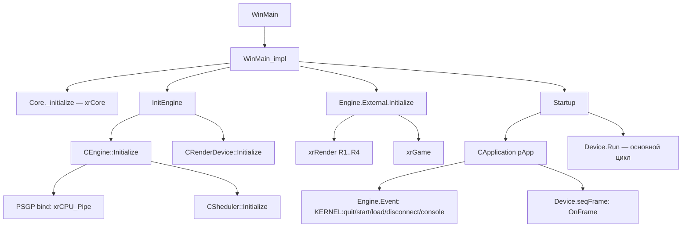
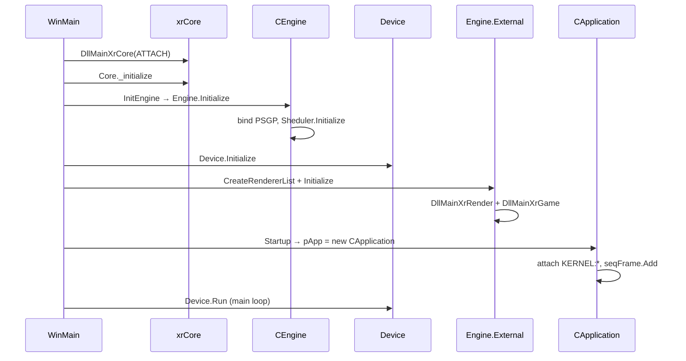

# xrEngine: Ядро (CEngine) и точка входа

`CEngine` — корневой объект движка; `x_ray.cpp` — точка входа процесса (`WinMain` → `Startup`).

## Ответственность

- `CEngine` (`src/xrEngine/Engine.h` / `Engine.cpp`) — агрегирует три подсистемы и владеет циклом их жизни:
  - `CEngineAPI External` — загрузка расширений (рендерер, игра, тюнер), фабрика объектов;
  - `CEventAPI Event` — событийная шина (см. [API и события](api.md));
  - `CSheduler Sheduler` — планировщик обновлений (см. [Sheduler](scheduler.md)).
- `CEngine::Initialize` / `CEngine::Destroy` — корневые точки инициализации и разборки.
- `x_ray.cpp` — всё, что окружает ядро на уровне процесса: DPI-режим, загрузка DllMain-сов, `system.ltx`/`game.ltx`, консоль, ввод, выбор рендерера, splash, основной цикл, разборка.

## Место в архитектуре

`CEngine` — **корень дерева**. Единственный экземпляр — глобальный `Engine` (singleton). `Device` (см. [Device](device.md)) и `CApplication pApp` (см. ниже) живут на том же уровне и координируются через `Engine`.

- `Engine.External` поднимает `xrRender` и `xrGame` (см. [API и события](api.md)).
- `Engine.Event` — межмодульная шина: `xrGame`/`xrServer` шлют `KERNEL:*`, `CApplication` и рендерер принимают.
- `Engine.Sheduler` — каркас для `ISheduled`-объектов (уровень, ALIFE, звук — см. [Цикл кадра](frame-loop.md)).

## Публичный API

```cpp
// Engine.h
class ENGINE_API CEngine
{
    HMODULE hPSGP;
public:
    CEngineAPI External;   // DLL-расширения, фабрика
    CEventAPI  Event;      // событийная шина
    CSheduler  Sheduler;   // планировщик

    void Initialize();
    void Destroy();

    CEngine();
    ~CEngine();
};

ENGINE_API extern xrDispatchTable PSGP; // таблица скиннинга/освещения
ENGINE_API extern CEngine Engine;       // singleton
```

Точка входа (из `x_ray.cpp`):

```cpp
int APIENTRY WinMain(HINSTANCE, HINSTANCE, char* lpCmdLine, int nCmdShow);
int APIENTRY WinMain_impl(...);  // фактическая логика
void Startup();                  // после загрузки DllMain-сов: основной цикл
void InitEngine();               // Engine.Initialize() → Device.Initialize()
```

Глобальные, доступные всему движку:

```cpp
ENGINE_API CApplication* pApp;      // текущее «приложение» (уровень/меню)
ENGINE_API CInifile*     pGameIni;  // game.ltx
```

## Внутреннее устройство

### Файлы

| Файл | Назначение |
|---|---|
| `Engine.h` / `Engine.cpp` | `CEngine`, `PSGP`, `Engine` |
| `EngineAPI.h` / `EngineAPI.cpp` | `CEngineAPI` — см. [API и события](api.md) |
| `EventAPI.h` / `EventAPI.cpp` | `CEventAPI` / `CEvent` — см. [API и события](api.md) |
| `xrSheduler.h` / `xrSheduler.cpp` | `CSheduler` — см. [Sheduler](scheduler.md) |
| `x_ray.h` / `x_ray.cpp` | `CApplication`, `WinMain`, `Startup`, `pApp` |
| `pure.h` | «pure»-сообщения + `CRegistrator<T>` |
| `pure_relcase.h` / `.cpp` | `pure_relcase` (регистр relcase-колбэков уровня) |
| `defines.h` / `.cpp` | флаги `psDeviceFlags`/`psDeviceFlags2`, пути `$game_*$` |
| `std_classes.h` | стандартные CLSID |
| `mp_logging.h` | условная `MP_LOGGING` |
| `no_single.h` / `dedicated_server_only.h` | `PROTECT_API`, `NO_SINGLE` (сборка dedicated) |

### CEngine::Initialize / Destroy

```cpp
// Engine.cpp
PROTECT_API void CEngine::Initialize(void)
{
    hPSGP = 0;                                  // xrCPU_Pipe.dll больше не грузится динамически
    xrBinder* bindCPU = xrBind_PSGP;            // статический биндер
    R_ASSERT(bindCPU);
    bindCPU(&PSGP, &CPU::ID);                   // выбирает реализацию скиннинга под CPU
    Engine.Sheduler.Initialize();
#ifdef DEBUG
    msCreate("game");
#endif
}

void CEngine::Destroy()
{
    Engine.Sheduler.Destroy();
    Engine.External.Destroy();                  // DllMainXrGame / DllMainXrRender DETACH
    ttapi_Done();                              // финализация xrCPU_Pipe
    ZeroMemory(&PSGP, sizeof(PSGP));
}
```

`PSGP` — `xrDispatchTable` из `xrCPU_Pipe`: указатели на `skin1W..4W` и `PLC_calc3` (см. `src/xrCPU_Pipe/xrCPU_Pipe.h`). Это **таблица диспетчеризации** CPU-операций (скиннинг, point-light-calculation), а не «general-purpose» API. Выбор реализации делает `xrBind_PSGP` по `CPU::ID` (SSE/SSE2/SSE4/AVX).

### Точка входа: WinMain → WinMain_impl → Startup

```
WinMain
 ├─ XR_EARLY_INIT()                    // LuaJIT low-memory pool (до любых DLL)
 ├─ SetProcessDpiAwarenessContext/-Awareness   // per-monitor DPI
 ├─ DllMainXrCore(ATTACH)              // xrCore
 ├─ DllMainXrPhysics(ATTACH)           // xrPhysics
 ├─ DllMainXrCore(THREAD_ATTACH)
 └─ __try WinMain_impl(...) __except (stack_overflow)
      └─ WinMain_impl
          ├─ Debug._initialize(dedicated)
          ├─ HeapSetInformation(HEAP_COMPAT)   // low-frag heap
          ├─ [NO_MULTI_INSTANCES] mutex «Local\STALKER-COP_<hash>»
          ├─ logoWindow (splash, IDD_STARTUP)
          ├─ Core._initialize("xray", …, fsgame?)   // xrCore: Memory, Log, FS, CPU
          ├─ compute_build_id(); InitSettings()     // system.ltx, game.ltx, pGameIni
          ├─ FPU::m24r(); InitEngine()              // Engine.Initialize + Device.Initialize
          ├─ InitInput(); InitConsole()
          ├─ Engine.External.CreateRendererList()   // опрос R1..R4
          ├─ [bench|sash|launcher] — ранние выходы
          ├─ Console->Execute("renderer …")
          ├─ Engine.External.Initialize()           // DllMainXrRender + DllMainXrGame
          ├─ Startup()                                 // основной цикл
          └─ Core._destroy()
```

Ключевые функции инициализации из `x_ray.cpp`:

```cpp
void InitEngine()
{
    Engine.Initialize();
    while (!g_bIntroFinished) Sleep(100);
    Device.Initialize();
}

PROTECT_API void InitSettings()
{
    pSettings = xr_new<CInifile>("$game_config$/system.ltx", TRUE);
    pSettingsAuth = xr_new<CInifile>(… /* с allow_include_func_t */);
    pGameIni  = xr_new<CInifile>("$game_config$/game.ltx", TRUE);
    g_fTimeFactor = pSettings->r_float("alife", "time_factor");
}
```

### Startup()

```cpp
void Startup()
{
    InitSound1();  execUserScript();  InitSound2();
    // [не DEDICATED] разбор -vid_monitor, ResetStartupMonitor
    // [не DEDICATED] -start … / -load … → Console->Execute(…)
    Device.Create();                 // см. Device
    LALib.OnCreate();
    pApp = xr_new<CApplication>();
    g_pGamePersistent = (IGame_Persistent*)NEW_INSTANCE(CLSID_GAME_PERSISTANT);
    g_SpatialSpace        = xr_new<ISpatial_DB>();
    g_SpatialSpacePhysic  = xr_new<ISpatial_DB>();
    DestroyWindow(logoWindow);
    Init_Discord();                  // Rich Presence
    use_reshade = init_reshade();

    Device.Run();                    // ← главный цикл (см. Цикл кадра)

    // разборка: Spatial, Persistent, pApp, input, settings, console, sound
    Engine.Event.Dump();
    destroyEngine();
}
```

### CApplication

`CApplication` (`x_ray.h` / `x_ray.cpp`) — «приложение» на уровне процесса: владеет уровнем, шрифтом, списком уровней, загрузочными стадиями и Discord-присутствием. Наследует `pureFrame` (участник `Device.seqFrame`) и `IEventReceiver` (участник `Engine.Event`).

```cpp
class ENGINE_API CApplication : public pureFrame, public IEventReceiver
{
    FactoryPtr<IApplicationRender> m_pRender;
    int max_load_stage, load_stage; u32 ll_dwReference;
    EVENT eQuit, eStart, eStartLoad, eDisconnect, eConsole, eStartMPDemo;

    CGameFont* pFontSystem;
    xr_vector<sLevelInfo> Levels;
    u32 Level_Current;

public:
    void Level_Scan();
    int  Level_ID(LPCSTR name, LPCSTR ver, bool bSet);
    void Level_Set(u32 ID);
    void LoadAllArchives();
    CInifile* GetArchiveHeader(LPCSTR name, LPCSTR ver);

    void LoadBegin();
    void LoadEnd();
    void LoadTitleInt(LPCSTR str1, LPCSTR str2, LPCSTR str3);
    void LoadStage();
    void LoadSwitch();
    void LoadDraw();

    virtual void OnEvent(EVENT E, u64 P1, u64 P2);
    virtual void _BCL OnFrame();
};
```

Конструктор:

```cpp
CApplication::CApplication()
{
    eQuit         = Engine.Event.Handler_Attach("KERNEL:quit",            this);
    eStart        = Engine.Event.Handler_Attach("KERNEL:start",           this);
    eStartLoad    = Engine.Event.Handler_Attach("KERNEL:load",            this);
    eDisconnect   = Engine.Event.Handler_Attach("KERNEL:disconnect",      this);
    eConsole      = Engine.Event.Handler_Attach("KERNEL:console",         this);
    eStartMPDemo  = Engine.Event.Handler_Attach("KERNEL:start_mp_demo",   this);

    Level_Current = u32(-1);
    Level_Scan();

    Device.seqFrame.Add(this, REG_PRIORITY_HIGH + 1000);   // поздний OnFrame
    if (psDeviceFlags.test(mtSound))
        Device.seqFrameMT.Add(&SoundProcessor);
    else
        Device.seqFrame.Add(&SoundProcessor);

    Console->Show();
}
```

`OnFrame` — самый короткий участник цикла, но **первый** по времени (см. [Цикл кадра](frame-loop.md)):

```cpp
void CApplication::OnFrame()
{
    Engine.Event.OnFrame();          // обработать отложенные события
    g_SpatialSpace->update();
    g_SpatialSpacePhysic->update();
    if (g_pGameLevel)
        g_pGameLevel->SoundEvent_Dispatch();
}
```

`OnEvent` — обработка `KERNEL:*`:

| Событие | Действие |
|---|---|
| `KERNEL:quit` | `PostQuitMessage(0)`, сброс списка уровней |
| `KERNEL:start` | `g_pGamePersistent->PreStart/Start`, `NEW_INSTANCE(CLSID_GAME_LEVEL)`, `LoadBegin/End`, `g_pGameLevel->net_Start(server, client)` |
| `KERNEL:load` | переключение уровня (см. `LoadDraw`) |
| `KERNEL:disconnect` | `net_Stop`, `DEL_INSTANCE(g_pGameLevel)`, `Persistent->Disconnect` |
| `KERNEL:console` | `Console->ExecuteCommand(P1, false)` |
| `KERNEL:start_mp_demo` | `OpenDemoFile`, `PreStart/Start`, `net_StartPlayDemo` |

### pure-сообщения и CRegistrator

`pure.h` объявляет набор «pure»-сообщений — классов с одним чистым виртуальным методом, которые `CRegistrator<T>` доставляет по приоритету:

```cpp
// pure.h
DECLARE_MESSAGE_CL(Frame, _BCL);          // OnFrame (с вызовом _BCL)
DECLARE_MESSAGE(Render);                  // OnRender
DECLARE_MESSAGE(AppActivate);
DECLARE_MESSAGE(AppDeactivate);
DECLARE_MESSAGE(AppStart);
DECLARE_MESSAGE(AppEnd);
DECLARE_MESSAGE(DeviceReset);
DECLARE_MESSAGE(ScreenResolutionChanged);

struct _REG_INFO { void* Object; int Prio; u32 Flags; };

template <class T> class CRegistrator
{
    xr_vector<_REG_INFO> R;
    struct { u32 in_process:1; u32 changed:1; };
public:
    void Add(T* obj, int priority = REG_PRIORITY_NORMAL, u32 flags = 0);
    void Remove(T* obj);
    void Process(RP_FUNC* f);   // вызов f(obj) по убыванию priority
    void Resort();              // qsort + удаление INVALID
};
```

Приоритеты (число = «выше»):

```cpp
#define REG_PRIORITY_LOW      0x11111111ul
#define REG_PRIORITY_NORMAL   0x22222222ul
#define REG_PRIORITY_HIGH     0x33333333ul
#define REG_PRIORITY_CAPTURE  0x7ffffffful   // единственный, получает Process
#define REG_PRIORITY_INVALID  0xfffffffful
```

`CRegistrator` — **не** планировщик: это просто упорядоченный список «кто и в каком порядке получает сообщение». Планированием по времени занимается `CSheduler` (см. [Sheduler](scheduler.md)). В `Device` (см. [Device](device.md)) живёт `seqRender`, `seqFrame`, `seqFrameMT`, `seqAppStart`, `seqAppEnd`, `seqAppActivate`, `seqAppDeactivate`, `seqResolutionChanged`, `seqDeviceReset` — все на базе `CRegistrator`.

### pure_relcase

`pure_relcase` — маркер-база для «relcase»-колбэков уровня (см. `xr_object_list.h`):

```cpp
class ENGINE_API pure_relcase
{
    int m_ID;
public:
    template <typename class_type>
    pure_relcase(void (xr_stdcall class_type::*fn)(CObject*));
    virtual ~pure_relcase();
};
```

Регистрирует член-функцию объекта в `CObjectList::RELCASE_CALLBACK`.

### defines.h

```cpp
// флаги устройства (psDeviceFlags)
rsFullscreen, rsClearBB, rsVSync, rsWireframe, rsOcclusion, rsStatistic,
rsDetails, rsRefresh60hz, rsConstantFPS, rsDrawStatic, rsDrawDynamic,
rsDisableObjectsAsCrows, rsOcclusionDraw, rsOcclusionStats,
mtSound, mtPhysics, mtNetwork, mtParticles,
rsCameraPos, rsR2, rsR3, rsR4;

// psDeviceFlags2
rsClearModels, rsPrecompiledShaders, rsGrassShadow, rsNoScale, rsFxaa,
rsDiscord, rsKeypress, rsCODPickup, rsFeelGrenade, rsOptShadowGeom,
rsAimSway, rsAlwaysActive, rsBlendMoveAnims;

// виртуальные пути
#define _game_data_     "$game_data$"
#define _game_levels_   "$game_levels$"
#define _game_textures_ "$game_textures$"
#define _game_sounds_   "$game_sounds$"
#define _game_meshes_   "$game_meshes$"
#define _game_shaders_  "$game_shaders$"
```

### std_classes.h

```cpp
#define CLSID_HUDMANAGER      MK_CLSID('H','U','D','_','M','N','G','R')
#define CLSID_GAME_LEVEL      MK_CLSID('G','_','L','E','V','E','L',' ')
#define CLSID_GAME_PERSISTANT MK_CLSID('G','_','P','E','R','S','I','S')
#define CLSID_OBJECT          MK_CLSID('O','B','J','E','C','T',' ',' ')
```

Эти CLSID — ключи фабрики `Engine.External.pCreate` (см. [API и события](api.md)). `CLSID_GAME_LEVEL` и `CLSID_GAME_PERSISTANT` создаются в `Startup` и `CApplication::OnEvent`.

### no_single / dedicated_server_only

```cpp
// dedicated_server_only.h
#ifdef DEDICATED_SERVER_ONLY
#  define PROTECT_API
#else
#  define PROTECT_API          // __declspec(dllexport) в release
#endif
#ifdef BENCHMARK_BUILD
#  undef PROTECT_API
#  define PROTECT_API
#endif
```

`PROTECT_API` — макрос для функций, которые должны быть `__declspec(dllexport)` в release, но в dedicated-сборке могут быть локальными. `NO_SINGLE` (в `no_single.h`) — включает только мультиплеерный путь в `CApplication::OnEvent` (`main_menu on` по умолчанию).

### mp_logging.h

```cpp
#define MP_DEBUG_AUTH 0x7ebf746e
#ifdef DEBUG
#define MP_LOGGING
#endif
```

`MP_LOGGING` — условная сетевая диагностика (авторизация).

## Взаимодействие



- **Кто вызывает `CEngine::Initialize`**: `InitEngine()` в `WinMain_impl`.
- **Кто вызывает `CSheduler::Initialize`**: только `CEngine::Initialize`.
- **Кто читает `PSGP`**: рендерер (скиннинг) и `xrPhysics`/`xrCPU_Pipe`.
- **Кто шлёт `KERNEL:*`**: `xrGame` / `xrServer` / консоль.
- **Кто принимает `KERNEL:*`**: `CApplication` (и, опционально, `xrGame`).

## Потоки данных



## Конфигурация

- `system.ltx` — `$game_config$/system.ltx` → `pSettings` (видео, звук, `alife.time_factor` и др.).
- `game.ltx` — `$game_config$/game.ltx` → `pGameIni` (параметры игры).
- `user.ltx` — конфиг консоли (см. [Консоль](console.md)).
- Командная строка:
  - `-tune` — подключить Intel vTune (см. [API и события](api.md)).
  - `-start …` / `-load …` — автозапуск команды в консоли.
  - `-vid_monitor <name>` — выбор монитора.
  - `-fsltx <name>` — альтернативный `system.ltx`.
  - `-batch_benchmark <name>` — бенчмарк (ранний выход до `Startup`).
  - `-openautomate <arg>` — SASH/автоматизация (ранний выход).
  - `-launcher` — запуск внешнего лаунчера.
  - `-r2` / `-r2a` — принудительный рендерер.
  - `-nosplashwindow` — не показывать splash.
  - `-dbgdev` — выключить `ignore_verify`.
- `NO_MULTI_INSTANCES` (через `MASTER_GOLD`) — блокирует второй запуск через mutex.

## Ограничения / дебаг

- `Engine` и `pApp` — **глобальные singleton'ы**; их нельзя «пересоздать» без перезапуска процесса.
- `PSGP` — статическая таблица, не расширяется в рантайме.
- `CRegistrator::Process` **не рекурсивен**: во время `Process` изменения списка коятся в `changed` и применяются после.
- `REG_PRIORITY_CAPTURE` — единственный, кто получает `Process` (остальные игнорируются).
- `CApplication::OnFrame` — **первый** участник `Device.seqFrame` (приоритет `REG_PRIORITY_HIGH + 1000`), поэтому `Engine.Event.OnFrame` (отложенные события) выполняется до остальных.
- `WinMain_impl` обёрнут в `__try/__except` — стек-оверфлоу перехватывается как FATAL.
- `g_bBenchmark` и `g_SASH.IsRunning()` — меняют порядок разборки в `Startup` (консоль/настройки не разрушаются).
- `NO_MULTI_INSTANCES` — mutex `Local\STALKER-COP_<crc32(exedir)>`; второй запуск получает код возврата `1`.
- `PROTECT_API` — в `BENCHMARK_BUILD` отключает `__declspec(dllexport)`.
