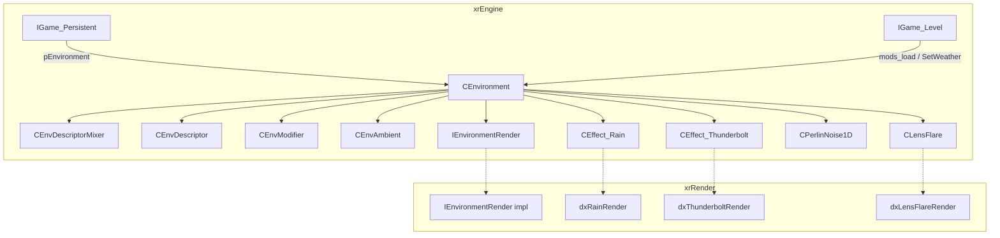
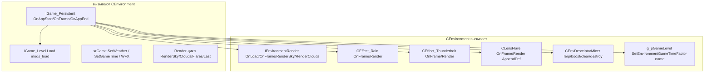
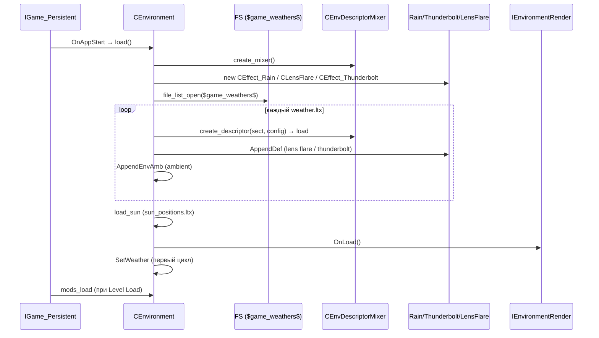
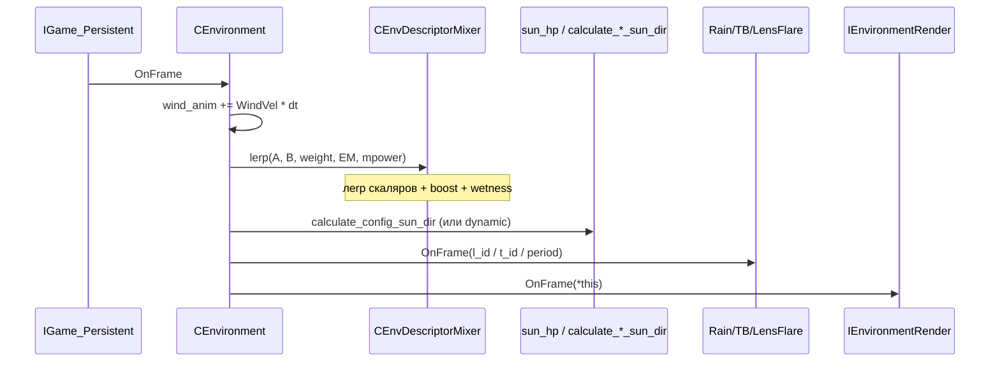
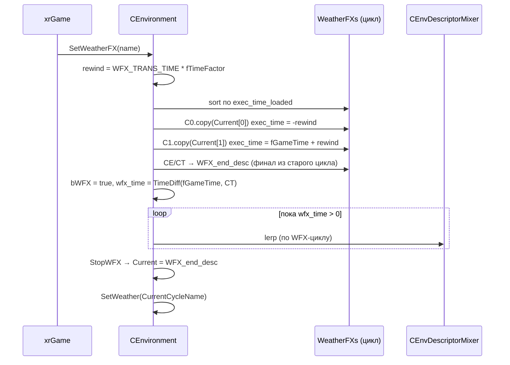

# Окружение

`CEnvironment` — **глобальная атмосфера** игры: небо, облака, туман, освещение, ветер, дождь, молнии, линзовые флэры. Держит **циклы погоды** (weather cycles — наборы описаний на сутки) и **погодные эффекты** (WFX — короткие сценарии типа «набег»), плавно перемешивает два соседних описания во времени, применяет **локальные модификаторы** уровня (`level.env_mod`) и **амбиентные звуки/эффекты** по расписанию.

Чего это **НЕ делает**: не рисует сами облака/дождь/молнии — рендеринг делегируется `IEnvironmentRender` (xrRender, итерация 3), а дождь/молнии/флэры — `CEffect_Rain`/`CEffect_Thunderbolt`/`CLensFlare` (их устройство — [Визуальные эффекты](effects.md), порцион 10). Не управляет объектами уровня. Не является `IEventReceiver`.

См. [Persistent](persistent.md) (владелец), [Device](device.md), [Цикл кадра](frame-loop.md), [Эффекторы](effector.md).

## Место в архитектуре

## Публичный API

### `CEnvironment` (`src/xrEngine/Environment.h`)

| Группа            | Методы / поля                                                                                                                                                                          |
| ----------------- | -------------------------------------------------------------------------------------------------------------------------------------------------------------------------------------- |
| Жизненный цикл    | `load()`, `unload()`, `Reload()` (перезагрузка погоды из файлов), `mods_load()`/`mods_unload()` (`level.env_mod`), `OnDeviceCreate()`/`OnDeviceDestroy()`, `Invalidate()`, `OnFrame()` |
| Время             | `GetGameTime()`, `ChangeGameTime(dt)`, `SetGameTime(t, time_factor)`, `fTimeFactor` (1 с реального времени = `fTimeFactor` с игрового)                                                 |
| Погода            | `SetWeather(name, forced)`, `GetWeather()`, `SetWeatherFX(name)`, `StartWeatherFXFromTime(name, time)`, `IsWFXPlaying()`, `StopWFX()`                                                  |
| Рендер (делегаты) | `RenderSky(only_MV)`, `RenderClouds()`, `RenderFlares()`, `RenderLast()` — всё через `m_pRender` (кроме `eff_Rain/Thunderbolt/LensFlare`)                                              |
| Смешивание        | `lerp(current_weight&)`, `set_lerp(weight)` (сдвигает `exec_time` текущей пары), `CurrentEnv` (миксер), `Current[2]` (текущая пара описаний)                                           |
| Ветер             | `wind_anim` (`Fvector4`, накапливается в `OnFrame`), `wind_strength_factor`, `wind_gust_factor`, `wetness_factor` (накопление влажности от дождя)                                      |
| Файлы конфигов    | `m_ambients_config`, `m_sound_channels_config`, `m_effects_config`, `m_suns_config`, `m_sun_pos_config`, `m_thunderbolt_collections_config`, `m_thunderbolts_config`                   |
| Глобалы           | `psEnvFlags` (`Flags32`), `psVisDistance` (`float`, множитель `far_plane`)                                                                                                             |

### `CEnvDescriptor` (`Environment.h`)

Одно «снимок погоды» на момент времени `exec_time`. Все поля — плоские данные:

| Поле                                                                                                                         | Назначение                                                                                                           |
| ---------------------------------------------------------------------------------------------------------------------------- | -------------------------------------------------------------------------------------------------------------------- |
| `exec_time` / `exec_time_loaded`                                                                                             | время в секундах суток (`0..86400`); `exec_time_loaded` — как было в файле, `exec_time` — текущее (WFX его сдвигает) |
| `sky_texture_name` / `sky_texture_env_name` / `clouds_texture_name`                                                          | имена текстур; `env`-вариант — `sky_texture + "#small"`                                                              |
| `clouds_color` (`Fvector4`, w=интенсивность), `sky_color`, `sky_rotation`                                                    | небо                                                                                                                 |
| `far_plane`, `fog_color`, `fog_density`, `fog_distance`                                                                      | дальний план и туман                                                                                                 |
| `rain_density` (0..1), `rain_color`                                                                                          | дождь                                                                                                                |
| `bolt_period`, `bolt_duration`, `tb_id`                                                                                      | молнии                                                                                                               |
| `wind_velocity`, `wind_direction`                                                                                            | ветер                                                                                                                |
| `ambient`, `hemi_color` (`Fvector4`, w = R2-коррекция), `sun_color`, `sun_dir`, `m_fSunShaftsIntensity`, `m_fWaterIntensity` | освещение                                                                                                            |
| `m_fHemiVibrance`, `m_fHemiContrast`, `m_fWetSurfaces`, `volumetric_intensity/distance_factor`                               | доп. параметры R2                                                                                                    |
| `bloom_threshold/exposure/sky_intensity`                                                                                     | bloom                                                                                                                |
| `lens_flare_id`, `tb_id` (shared_str)                                                                                        | ссылки на описания флеров/молний                                                                                     |
| `env_ambient` (`CEnvAmbient*`)                                                                                               | амбиент (звук/эффекты), `0` если нет                                                                                 |
| `m_pDescriptor` (`FactoryPtr<IEnvDescriptorRender>`)                                                                         | рендер-часть (текстуры и т.д.), итерация 3                                                                           |
| `copy(src)`                                                                                                                  | копирует все поля **кроме** `exec_time*` (сохраняет своё время)                                                      |
| `load(CEnvironment&, CInifile&)`                                                                                             | чтение секции (имя секции = `HH:MM:SS`), `exec_time` парсится из имени                                               |

### `CEnvDescriptorMixer` (`Environment.h`)

Наследник `CEnvDescriptor` — **результат смешения** двух описаний, то, что реально попадает в рендер:

- `weight` (вес B в lerp), `fog_near`/`fog_far` (вычисляются в `lerp`);
- `m_pDescriptorMixer` (`FactoryPtr<IEnvDescriptorMixerRender>`) — лerp'ит текстуры A и B на рендер-уровне;
- `lerp(env, A, B, f, M, m_power)` — смешивает все скаляры/цвета, применяет модификаторы, считает `wetness_factor`, вызывает `boost(env)`;
- `boost(env)` — аддитивная корректировка яркости через `CEnvironment::env_boost` (7 полей: sky/clouds/ambient/hemi/rain/sun/fog color), клампится в `[0,1]`;
- `clear()`/`destroy()` — сброс/уничтожение рендер-части.

### `CEnvModifier` (`Environment.h`)

Локальный модификатор окружения (сферы-зона в уровне):

- `position`, `radius`, `power`, `use_flags` (`eViewDist`, `eFogColor`, `eFogDensity`, `eAmbientColor`, `eSkyColor`, `eHemiColor`);
- `sum(M, view)` — находит вклад модификатора `M` в накопитель `this` для позиции `view`: затухание `att = 1 - dist/radius`, если `dist > radius` — `0`; возвращает `_power`;
- `load(IReader*, version)` — из `level.env_mod`; версия `>= 0x0016` читает `use_flags`, до неё все флаги `one()`.

### `CEnvAmbient` (`Environment.h`)

Набор амбиентных звуков/эффектов, привязанных к описанию погоды:

- `SSndChannel` — канал звуков: `m_sound_dist` (min/max), `m_sound_period` (4 int: first_min/first_max/period_min/period_max, мс), `m_sounds` (`xr_vector<ref_sound>`, тип `st_Effect`); `get_rnd_sound*/get_rnd_sound_dist()` — случайные значения;
- `SEffect` — эффект: `life_time` (мс), `ref_sound sound`, `particles` (имя партикла), `offset`, `wind_gust_factor`, параметры **ветрового порыва** (`wind_blast_in/out_time`, `strength`, `direction`);
- `load(ambients_config, sound_channels_config, effects_config, section)` — читает секцию из трёх конфигов;
- `get_rnd_effect()` / `get_rnd_effect_time()` — случайный эффект/время;
- `m_effect_period` (min/max мс).

### `CPerlinNoise1D` (`perlin.h`)

Шум Перлина для порывов ветра: `CPerlinNoiseCustom` (seed, `mOctaves`, `mFrequency`, `mAmplitude`, таблица `p[258]`), `CPerlinNoise1D::Get(x)` / `GetContinious(v)` (последняя — сглаженная по времени, возвращает `[-0.5, 0.5]`), `CPerlinNoise2D/3D` — аналоги. В `CEnvironment` — 2 октавы, амплитуда `0.66666`, частота = `wind_gust_factor * 0.03`.

## Внутреннее устройство

### Конструктор `CEnvironment()`

- `fGameTime = 0`, `fTimeFactor = 12` (по умолчанию 1 мин игрового времени = 5 с реального);
- создаётся `PerlinNoise1D` (seed = `Random.randI(0, 0xFFFF)`, 2 октавы, amp 0.66666);
- `CloudsVerts`/`CloudsIndices` — заготовлены из `xrHemisphere` quality 2 (`xrHemisphereVertices/Indices`), но **не используются**: рендер облаков закомментирован (см. `Environment_render.cpp`);
- читаются 7 конфигов из `$game_config$environment\` + основной `environment.ltx` (параметры `environment`: `altitude`, `delta_longitude`, `min_dist_factor` (clamp ≤ 0.95), `tilt`, `second_propability`, `sky_color`, `sun_color`, `fog_color` — множители цвета в `boost`);
- `OnDeviceCreate()` вызывается из конструктора (создаёт рендер-объекты).

### Загрузка погоды

- `load()` — ленивая: создаёт миксер (`create_mixer`), `eff_Rain/LensFlare/Thunderbolt`, вызывает `load_weathers()`, `load_weather_effects()`, `load_sun()`, `m_pRender->OnLoad()`.
- `load_weathers()` — сканирует `$game_weathers$\*.ltx`; каждый файл = цикл погоды: секции с именами `HH:MM:SS` → `create_descriptor` → `EnvVec`. Требуется **≥ 2** описаний (`R_ASSERT3`). Сортировка по `exec_time_loaded`. После — `SetWeather` на первый по алфавиту цикл.
- `load_weather_effects()` — сканирует `$game_weather_effects$\*.ltx`; WFX-файл оборачивается в **два синтетических** дескриптора: `00:00:00` (пустой) в начале и `24:00:00` (`exec_time_loaded = DAY_LENGTH`) в конце — чтобы WFX был замкнутым.
- `load_sun()` — из `$game_config$environment\sun_positions.ltx`: 24 секции `HH:00:00`, поля `sun_altitude`/`sun_longitude` → `sun_hp[24]` (для `calculate_config_sun_dir`).
- `mods_load()` — `level.env_mod`: бинарные чанки, чанк 0 = версия (по умолчанию `0x0015`), остальные — `CEnvModifier::load`. Затем `load_level_specific_ambients()`.
- `load_level_specific_ambients()` — если существует `$game_config$environment\ambients\<level_name>.ltx`, переопределяет амбиенты (для каждого `CEnvAmbient` проверяется, что имя файла источника изменилось, иначе `destroy` + `load` заново).
- `AppendEnvAmb(sect)` — поиск по имени, если нет — `xr_new<CEnvAmbient>` + `load`.
- `add_flare(collection, id)` — кэш `CLensFlareDescriptor` по `section` (читает из `m_suns_config`); `thunderbolt_collection` — кэш по `id` (`thunderbolt_description`/`thunderbolt_collection` создают новые).

### Время и выбор описаний

- `DAY_LENGTH = 86400` с; `NormalizeTime` — зацикливание `[0, DAY_LENGTH)`.
- `TimeDiff(prev, cur)` — расстояние по кругу (с учётом пересечения `0`); `TimeWeight(val, min_t, max_t)` — вес `[0..1]` внутри интервала (корректно при `min > max`, т.е. интервал, обёртывающий полночь).
- `SelectEnvs(envs, e0, e1, gt)` — `lower_bound` по `exec_time`: `e1` = первое ≥ `gt`, `e0` = предыдущее (или `end-1`, если `e1` = `begin`). Если `gt` после всех — `e0 = end-1`, `e1 = front` (обёртка).
- `SelectEnvs(gt)` — **прогрессия** текущего интервала: если время ушло за `Current[1]->exec_time` — сдвиг: `Current[0] = Current[1]`, `Current[1] = SelectEnv(...)`.
- `SetWeather(name, forced)` — устанавливает `CurrentCycleName`/`CurrentWeather`; при `forced` — `Invalidate()` + `SelectEnvs` (сброс пары). Если WFX играет — текущий цикл запоминается, но `CurrentWeather` **не** меняется (WFX продолжается).
- `SetGameTime(t, factor)` — жёсткая установка; при `m_paused` — `g_pGameLevel->SetEnvironmentGameTimeFactor(iFloor(fGameTime*1000), fTimeFactor)` и возврат (серверный синхронизатор); при WFX — корректировка `wfx_time`.

### WFX (погодный эффект)

- `SetWeatherFX(name)`:
  1. `WFX_TRANS_TIME = 5` с (× `fTimeFactor`) — время на «перематывание» от текущего момента к началу эффекта;
  2. вычисляется `current_weight` текущего интервала `Current[0]/Current[1]`;
  3. WFX-цикл сортируется по `exec_time_loaded`; берутся `C0` (первый), `C1` (второй), `CE` (предпоследний), `CT` (последний);
  4. `C0->copy(*Current[0])` + `exec_time` = перематывание назад; `C1->copy(*Current[1])` + `exec_time = fGameTime + rewind_tm`; остальные — `start_tm + exec_time_loaded`;
  5. `WFX_end_desc[0/1]` — **финальное** состояние (из **старого** цикла, `CE->exec_time` и `+0.5` с) — чтобы после WFX погода плавно вернулась;
  6. `CT->copy(*WFX_end_desc[0])` + `exec_time = CE->exec_time + rewind_tm` — «приземление»;
  7. `wfx_time = TimeDiff(fGameTime, CT->exec_time)` — остаток эффекта; `bWFX = true`.
- `lerp()` — при `wfx_time <= 0` → `StopWFX()`.
- `StopWFX()` — `bWFX = false`, `SetWeather(CurrentCycleName, false)`, `Current[0/1] = WFX_end_desc[0/1]` (продолжение от финального состояния).
- `StartWeatherFXFromTime(name, time)` — `SetWeatherFX` + сдвиг всех `exec_time` так, чтобы `wfx_time = time`.

### `lerp(current_weight&)` — сердце каждого кадра

1. Проверка завершения WFX;
2. `SelectEnvs(fGameTime)` — прогрессия интервала;
3. `current_weight = TimeWeight(...)`;
4. Суммирование модификаторов: `CEnvModifier EM` (нулевой), для каждого `Modifiers` — `EM.sum(*mit, view)` → `mpower` (сумма мощностей);
5. Если **не** `m_paused` — `CurrentEnv->lerp(this, *Current[0], *Current[1], weight, EM, mpower)`;
   при `m_paused` mиксер **не** пересчитывается (сохраняется предыдущее состояние).

### `CEnvDescriptorMixer::lerp`

- `modif_power = 1/(mpower+1)` — доля «чистого» окружения; `fi = 1-f`;
- `m_pDescriptorMixer->lerp(&A, &B)` — рендер-часть (текстуры);
- скаляры: `lerp` + вклад `Mdf.*` (умноженный на `modif_power`); `far_plane` дополнительно × `psVisDistance`;
- `fog_distance` clamp `[1, far_plane-10]`; `fog_near = (1-fog_density)*0.85*fog_distance`, `fog_far = 0.99*fog_distance`;
- `sun_shafts` — корректировка глобалами `ps_r2_sun_shafts_min/value`;
- **wetness**: `rain_density > 0` → `env->wetness_factor += rain_density*ssfx_wetness_multiplier.x/10000`, иначе `-= 0.0001*ssfx_wetness_multiplier.y`; clamp `[0,1]`;
- `boost(env)` — аддитивные бусты цвета из `CEnvironment::env_boost` (см. выше).

### Солнце

- `calculate_config_sun_dir()` — из `sun_hp[24]` (alt/long на каждый час): `fGameTime/3600` → час + вес → lerp между `sun_hp[h]` и `sun_hp[h+1]` → `CurrentEnv->sun_dir.setHP(deg2rad(alt), deg2rad(long))`.
- `calculate_dynamic_sun_dir()` (под `#ifdef DYNAMIC_SUN_MOVEMENT`, вызывается только при `fGameTime ∈ (18000, 79000)` и `!Render->is_sun_static()`): полный астрономический расчёт — склонение `D` (Фурье-ряд), уравнение времени `TC`, SHA (солнечный часовой угол) с `Longitude=-30.4°`, `Latitude=50.27°` (hardcoded), SZA/SEA/AZ; минимальный SEA = 1° (см. `minAngle`), `sun_color` умножается на `fSunBlend` (плавное затухание при низком солнце).
- В `OnFrame`: при `m_paused` — `sun_dir`/`lens_flare_id`/`tb_id` берутся из `CurrentEnv` (без пересчёта), иначе — `calculate_config_sun_dir()` + выбор `l_id/t_id` по `current_weight < 0.5`.

### Ветер в `OnFrame`

- `WindVel = max(CurrentEnv->wind_velocity, ps_ssfx_wind_trees.w * 1000)`; `max(WindVel, 200) * 0.001` (мин. 0.2, чтобы не было «замедления»);
- `WindDir = -wind_direction + PI/2`; `wind_anim.x += WindVel * cos(WindDir) * dt` и т.п. (`z` = вертикальная составляющая, `w` = время);
- `wind_strength_factor = clampr(PerlinNoise1D->GetContinious(fTimeGlobal) + 0.5, 0, 1)` — порывистость.

### Рендер-делегаты (`Environment_render.cpp`)

- `RenderSky(only_MV)` → `m_pRender->RenderSky(*this, only_MV)` (весь старый D3D9-код закомментирован);
- `RenderClouds()` — выход, если `fis_zero(CurrentEnv->clouds_color.w)`; иначе `m_pRender->RenderClouds(*this)`;
- `RenderFlares()` → `eff_LensFlare->Render(FALSE, TRUE, TRUE)`;
- `RenderLast()` → `eff_Rain->Render()` + `eff_Thunderbolt->Render()`.

### Device lifecycle

- `OnDeviceCreate()` — `m_pRender->OnDeviceCreate()`, для **всех** описаний в `WeatherCycles` и `WeatherFXs` — `on_device_create()` (создаёт текстуры), `Invalidate()`, `OnFrame()` (первичный расчёт);
- `OnDeviceDestroy()` — обратное + `CurrentEnv->destroy()` (уничтожение миксера).
- `ED_Reload()` (только `_EDITOR`) — `OnDeviceDestroy` + `OnDeviceCreate`.

### `set_lerp(weight)`

Сдвигает `exec_time` текущей пары так, чтобы `fGameTime` соответствовал заданному `weight` (сохраняя длину интервала, включая обёртку через полночь). Используется для «ручного» позиционирования внутри интервала (например, при загрузке сейва).

## Взаимодействие

**Вызывает `CEnvironment`**:

- `IGame_Persistent` — `load`/`unload` (`OnAppStart`/`OnAppEnd`), `OnFrame` (`IGame_Persistent::OnFrame`, приоритет `HIGH+1`, см. [Persistent](persistent.md));
- `IGame_Level::Load` — `mods_load` (после `Render->level_Load`);
- xrGame — `SetWeather`/`SetWeatherFX`/`SetGameTime` (по сценарию), `RenderSky/RenderClouds/RenderFlares/RenderLast` из рендер-цикла уровня.

**`CEnvironment` вызывает**:

- `IEnvironmentRender` — `OnLoad`/`OnUnload`/`OnFrame`/`RenderSky`/`RenderClouds` (реализация — итерация 3);
- `CEffect_Rain`/`CEffect_Thunderbolt`/`CLensFlare` — `OnFrame` + `Render` (устройство — [Визуальные эффекты](effects.md), порцион 10);
- `CEnvDescriptorMixer` — `lerp`/`boost`/`clear`/`destroy`;
- `g_pGameLevel` — `SetEnvironmentGameTimeFactor` (пауза), `name()` (level ambients).

## Потоки данных

### Загрузка (старт приложения)

### Кадр (OnFrame)

### WFX (набег погоды)

## Конфигурация

Все пути — относительно `$game_config$environment\`:

| Файл                                               | Назначение                                                                                                                                              |
| -------------------------------------------------- | ------------------------------------------------------------------------------------------------------------------------------------------------------- |
| `environment.ltx`                                  | секция `environment`: `altitude`, `delta_longitude`, `min_dist_factor`, `tilt`, `second_propability`, `sky_color`, `sun_color`, `fog_color` (множители) |
| `suns.ltx`                                         | описания линзовых флеров (по `lens_flare_id`)                                                                                                           |
| `sun_positions.ltx`                                | 24 секции `HH:00:00`: `sun_altitude`, `sun_longitude`                                                                                                   |
| `ambients.ltx`                                     | амбиенты: `sound_channels`, `effects`, `min/max_effect_period`                                                                                          |
| `sound_channels.ltx`                               | каналы звуков: `min/max_distance`, `period0..3`, `sounds`                                                                                               |
| `effects.ltx`                                      | эффекты: `life_time`, `particles`, `offset`, `wind_gust_factor`, `wind_blast_*`                                                                         |
| `thunderbolt_collections.ltx` / `thunderbolts.ltx` | коллекции и описания молний                                                                                                                             |
| `$game_weathers$\<name>.ltx`                       | циклы погоды: секции `HH:MM:SS`                                                                                                                         |
| `$game_weather_effects$\<name>.ltx`                | WFX-циклы (оборачиваются `00:00:00`/`24:00:00`)                                                                                                         |
| `level.env_mod` (в уровне)                         | бинарные `CEnvModifier` (версия в чанке 0)                                                                                                              |
| `ambients\<level>.ltx`                             | переопределение амбиентов для уровня                                                                                                                    |

Секция описания погоды (`HH:MM:SS`): `sky_texture`, `clouds_texture`, `clouds_color` (5 float: r,g,b,w,multiplier), `sky_color`, `sky_rotation`, `far_plane`, `fog_color`, `fog_density`, `fog_distance`, `rain_density`, `rain_color`, `wind_velocity`, `wind_direction`, `ambient_color`, `hemisphere_color` (4), `sun_color`, `sun` (lens flare id), `thunderbolt_collection`, `thunderbolt_period/duration`, `ambient` (имя амбиента), `sun_shafts_intensity`, `water_intensity`, `hemi_vibrance/contrast`, `wet_surface_factor`, `volumetric_intensity/distance_factor`, `tree_amplitude_intensity`, `bloom_threshold/exposure/sky_intensity`.

Проверка `C_CHECK` — цвета в `[0, 5]` (иначе `Msg`).

## Известные ограничения / дебаг

- **Рендер облаков и skybox'а** — полностью **закомментирован** в `Environment_render.cpp` (старый D3D9-код); реальная отрисовка — через `IEnvironmentRender` (итерация 3). `CloudsVerts`/`CloudsIndices` в конструкторе заполняются, но **не используются** ни в одном активном коде.
- **`CEnvDescriptor::load`** парсит `exec_time` из **имени секции** (`%d:%d:%d`), а не из поля — секция без корректного имени → `R_ASSERT3`.
- **WFX требует ≥ 2 описаний** в файле (`R_ASSERT3` в `load_weather_effects`); синтетические `00:00:00`/`24:00:00` — не читаются из файла (пустые дескрипторы, `create_descriptor(id, false)`).
- **`SetWeatherFX`** — `VERIFY(PrevWeather)` (если WFX вызван без активной погоды — assert); пустое имя → `FATAL` (не в `_EDITOR`).
- **`calculate_dynamic_sun_dir`** — `Latitude=50.27°`, `Longitude=-30.4°` **hardcoded** (география не настраивается); вызывается только при `fGameTime ∈ (18000, 79000)` (5:00–21:56) и под `#ifdef DYNAMIC_SUN_MOVEMENT`.
- **`m_paused`** — при паузе `lerp` **не** пересчитывает миксер (сохраняется предыдущее состояние); `SetGameTime` при паузе → `SetEnvironmentGameTimeFactor` (серверный синк) + возврат.
- **`boost`** — клампит цвета в `[0,1]`, но `hemi_color.w` (R2-коррекция) **не** клампится (сохраняется `adj`).
- **`thunderbolt_collection(collection, id)`** — при отсутствии `id` → `NODEFAULT` + `return 0` (только `DEBUG`); в release — UB.
- **`CEnvAmbient::load`** — `R_ASSERT(!m_sound_channels.empty() || !m_effects.empty())`; пустой амбиент не допускается.
- **`mods_load`** — версия `level.env_mod` по умолчанию `0x0015`; чанк 0 = версия (`sz == sizeof(u32)`), иначе — `CEnvModifier`.
- **`psEnvFlags`** — `Flags32`, инициализируется `0`; используется как общий переключатель окружения.
- **`psVisDistance`** — множитель `far_plane` (1.0 по умолчанию).
- Не покрыто: `IEnvironmentRender`/`IEnvDescriptorRender`/`IEnvDescriptorMixerRender` (xrRender, итерация 3), устройство `CEffect_Rain`/`CEffect_Thunderbolt`/`CLensFlare` (порцион 10 — [Визуальные эффекты](effects.md)), `CPostprocessAnimator` (xrGame, наследник `CEffectorPP`).
