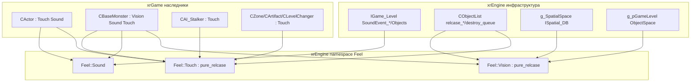
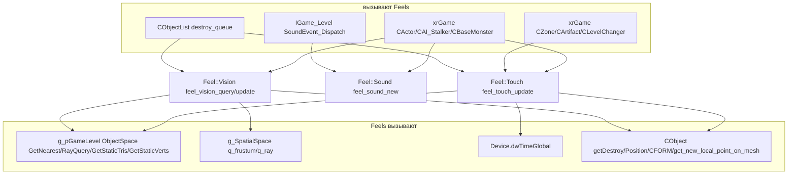
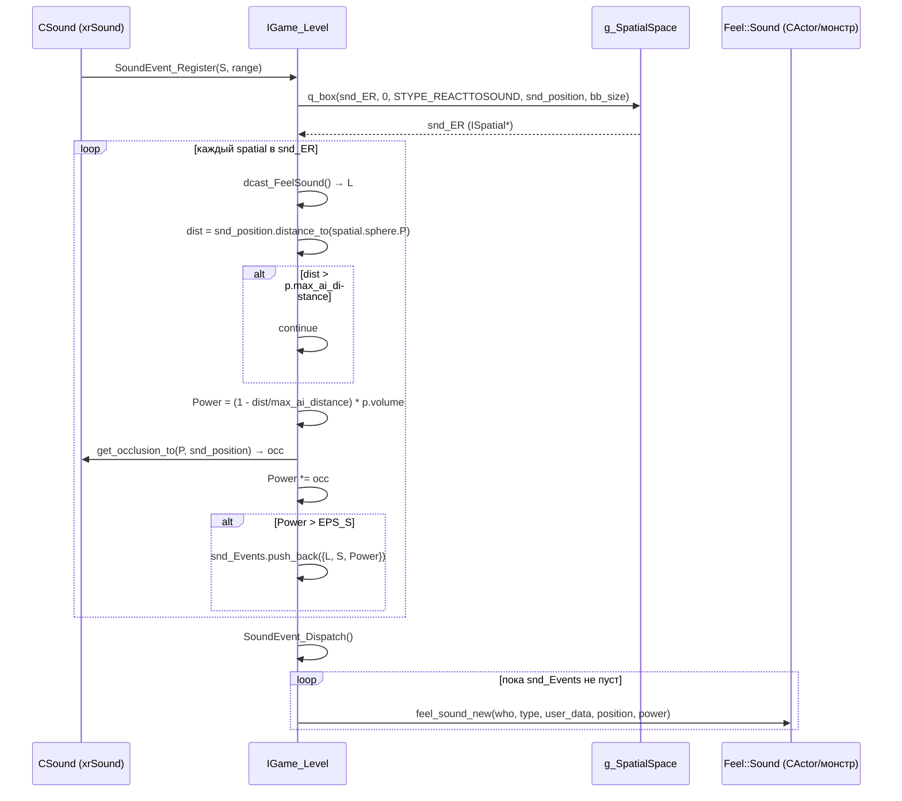
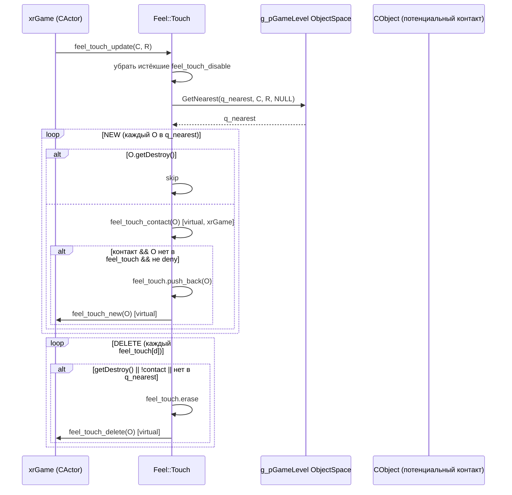
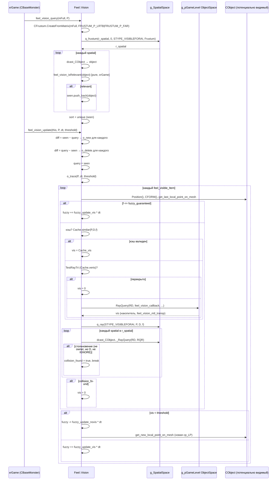
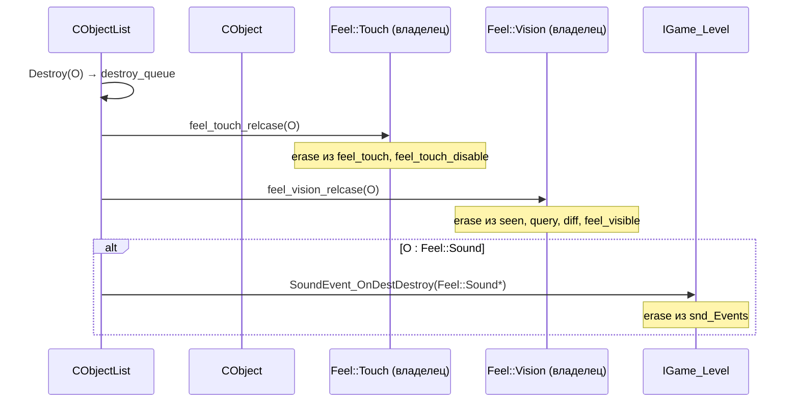

# Feels

**Feels** — механизм «сенсоров» движка: набор микросмешанных базовых классов (`Feel::Sound`, `Feel::Touch`, `Feel::Vision`) в `namespace Feel`, которые дают наследнику (обычно `CObject`-объекту из xrGame) способность **ощущать** мир:

- **звук** — реакция на звуки, пущенные в уровне (владельцы — `CActor`, монстры);
- **касание** — реакция на объекты, вошедшие в сферу вокруг владельца (pickup, артефакты, зоны);
- **зрение** — fuzzy-логика видимости: что из объектов, попавших во frustum «глаз» владельца, реально видно (с учётом прозрачности материалов и перекрытия).

Все три — **микросмешения** (multiple inheritance): xrGame-объект наследует от `CObject` и от одного или нескольких `Feel::*`. Реализация в xrEngine — только каркас; вся игровая логика («что делать, когда увидел/услышал/потрогал») — в наследниках xrGame.

Чего это **НЕ делает**: не генерирует звуки/касания/зрение глобально — диспетчеризацию звуков ведёт `IGame_Level::SoundEvent_*` (см. [Уровень](level.md)); не хранит «память» о прошлом — состояние (кто в контакте, кто виден) живёт в векторах конкретного экземпляра; не реализует AI-решения по полученным ощущениям — только предоставляет `feel_*`-события и списки.

См. [Эффекторы](effector.md) (камерные/PP-эффекты — то, что «делает» с восприятием актёра), [Объекты](xr-object.md), [Уровень](level.md), [Коллизии/физика](collide-physics.md).

## Место в архитектуре



## Публичный API

### `Feel::Sound` (`src/xrEngine/Feel_Sound.h`)

Пустой маркер с одним виртуальным методом:

| Метод                                                                                                                     | Описание                                                                         |
| ------------------------------------------------------------------------------------------------------------------------- | -------------------------------------------------------------------------------- |
| `virtual void feel_sound_new(CObject* who, int type, CSound_UserDataPtr user_data, const Fvector& Position, float power)` | Вызывается, когда на владельца «долетел» звук. База — пустая реализация (no-op). |

Регистрация в диспетчеризации происходит **не** через `pure_relcase`, а по пространственному флагу `STYPE_REACTTOSOUND`: `IGame_Level::SoundEvent_Register` спрашивает `g_SpatialSpace->q_box(..., STYPE_REACTTOSOUND, ...)`, затем `dcast_FeelSound()` (см. Взаимодействие).

### `Feel::Touch` (`src/xrEngine/Feel_Touch.h/.cpp`)

| Поле                 | Тип                                | Описание                                                                          |
| -------------------- | ---------------------------------- | --------------------------------------------------------------------------------- |
| `feel_touch`         | `xr_vector<CObject*>`              | Объекты, **в контакте** прямо сейчас                                              |
| `q_nearest`          | `xr_vector<CObject*>`              | Результат последнего запроса «кто в радиусе» (scratch-буфер, `clear_not_free()`)  |
| `feel_touch_disable` | `xr_vector<DenyTouch>` (protected) | Запреты касания: `{ CObject* O; DWORD Expire; }` (время по `Device.dwTimeGlobal`) |

| Метод                                                 | Описание                                                                                                                                                   |
| ----------------------------------------------------- | ---------------------------------------------------------------------------------------------------------------------------------------------------------- |
| `Touch()`                                             | Регистрация `pure_relcase(&Touch::feel_touch_relcase)`                                                                                                     |
| `virtual ~Touch()`                                    | Деструктор (отрегистрировывает relcase через `pure_relcase`)                                                                                               |
| `virtual bool feel_touch_contact(CObject* O)`         | **Виртуальный фильтр «есть ли вообще контакт»**. База: `true`. Наследник (xrGame) определяет, что считается «потрогал» (pickup-радиус, тип объекта и т.п.) |
| `virtual void feel_touch_update(Fvector& C, float R)` | **Главный вход**. Вызывается наследником каждый кадр с центром и радиусом. См. Внутреннее устройство                                                       |
| `virtual void feel_touch_deny(CObject* O, DWORD T)`   | Запретить касание `O` на `T` мс (по `Device.dwTimeGlobal`). Неубирает `O` из `feel_touch`, если он уже там — только блокирует **новые** касания            |
| `virtual void feel_touch_new(CObject* O)`             | Событие «объект вошёл в контакт». База — пустая                                                                                                            |
| `virtual void feel_touch_delete(CObject* O)`          | Событие «объект вышел из контакта». База — пустая                                                                                                          |
| `void __stdcall feel_touch_relcase(CObject* O)`       | Relcase-колбэк (см. `pure_relcase`): удаляет `O` из `feel_touch` и `feel_touch_disable` при уничтожении `O`                                                |

### `Feel::Vision` (`src/xrEngine/Feel_Vision.h/.cpp`)

Константы модуля (в namespace `Feel`):

```cpp
const float fuzzy_update_vis   = 1000.f;  // скорость роста fuzzy (видимость)
const float fuzzy_update_novis = 1000.f;  // скорость падения fuzzy (невидимость)
const float fuzzy_guaranteed   = 0.001f;  // расстояние, при котором «100% видно»
const float lr_granularity     = 0.1f;    // допуск «похожие позиции»
```

| Поле           | Тип                                     | Описание                                                  |
| -------------- | --------------------------------------- | --------------------------------------------------------- |
| `seen`         | `xr_vector<CObject*>` (private)         | Объекты, попавшие во frustum на этом `feel_vision_query`  |
| `query`        | `xr_vector<CObject*>` (private)         | Объекты из **предыдущего** `feel_vision_query` (для diff) |
| `diff`         | `xr_vector<CObject*>` (private)         | Временный буфер для `std::set_difference`                 |
| `RQR`          | `collide::rq_results` (private)         | Scratch-результаты ray query                              |
| `r_spatial`    | `xr_vector<ISpatial*>` (private)        | Scratch-результат пространственных запросов               |
| `m_owner`      | `CObject const*` (private)              | Владелец (для `#ifdef SPATIAL_CHANGE`)                    |
| `feel_visible` | `xr_vector<feel_visible_Item>` (public) | **Главное состояние**: fuzzy-видимость каждого объекта    |

`feel_visible_Item`:

```cpp
struct feel_visible_Item
{
    collide::ray_cache Cache;    // кэш последнего ray query (P, D, f)
    Fvector cp_LP;               // локальная точка на меже (последний «попробованный»)
    Fvector cp_LR_src;           // src последнего ray (позиция наблюдателя)
    Fvector cp_LR_dst;           // dst последнего ray (позиция объекта)
    Fvector cp_LAST;             // последняя точка, признанная видимой
    CObject* O;
    float fuzzy;                 // (-1[no]..1[yes])
    float Cache_vis;             // vis, соответствующий Cache
    u16 bone_id;                 // кость для local point
};
```

| Метод                                                                                 | Описание                                                                                                                                   |
| ------------------------------------------------------------------------------------- | ------------------------------------------------------------------------------------------------------------------------------------------ |
| `Vision(CObject const* owner)`                                                        | Регистрация `pure_relcase(&Vision::feel_vision_relcase)`                                                                                   |
| `virtual ~Vision()`                                                                   | Деструктор (отрегистрировывает relcase)                                                                                                    |
| `void feel_vision_clear()`                                                            | Очистить `seen`, `query`, `diff`, `feel_visible`                                                                                           |
| `void feel_vision_query(Fmatrix& mFull, Fvector& P)`                                  | **Шаг 1**: frustum-запрос. Заполняет `seen` из `g_SpatialSpace->q_frustum(STYPE_VISIBLEFORAI)` и применяет фильтр `feel_vision_isRelevant` |
| `void feel_vision_update(CObject* parent, Fvector& P, float dt, float vis_threshold)` | **Шаг 2**: diff `seen`/`query` → `o_new`/`o_delete`, затем `o_trace` (ray-casts + fuzzy)                                                   |
| `void __stdcall feel_vision_relcase(CObject* object)`                                 | Relcase-колбэк: убирает `object` из `seen`, `query`, `diff`, `feel_visible`                                                                |
| `void feel_vision_get(xr_vector<CObject*>& R)`                                        | Заполнить `R` объектами с `fuzzy > 0`                                                                                                      |
| `Fvector feel_vision_get_vispoint(CObject* _O)`                                       | Вернуть `cp_LAST` объекта (`VERIFY(positive(fuzzy))`); если объект не в `feel_visible` — `VERIFY2` + `(flt_max, flt_max, flt_max)`         |
| `virtual bool feel_vision_isRelevant(CObject* O) = 0`                                 | **Pure**: фильтр «интересен ли объект для зрения» (xrGame)                                                                                 |
| `virtual float feel_vision_mtl_transp(CObject* O, u32 element) = 0`                   | **Pure**: прозрачность материала `element` объекта `O` (xrGame)                                                                            |

## Внутреннее устройство

### `pure_relcase` (`src/xrEngine/pure_relcase.h/.cpp`)

Базовый класс для «relcase-подписки» (relcase = «release case» — «объект уничтожен, сделай что-нибудь»):

```cpp
class ENGINE_API pure_relcase
{
private:
    int m_ID;
public:
    template <typename class_type>
    pure_relcase(void (xr_stdcall class_type::* function_to_bind)(CObject*))
    {
        R_ASSERT(g_pGameLevel);
        class_type* self = static_cast<class_type*>(this);
        g_pGameLevel->Objects.relcase_register(
            CObjectList::RELCASE_CALLBACK(self, function_to_bind),
            &m_ID
        );
    }
    virtual ~pure_relcase();
};
```

- **Конструктор** требует `g_pGameLevel != 0` (`R_ASSERT`) и **регистрацию колбэка** в `CObjectList::relcase_register`. Это значит: **`Feel::Touch`/`Feel::Vision` нельзя создавать до загрузки уровня** (`g_pGameLevel == 0` → crash в debug).
- **Деструктор** (`pure_relcase.cpp`) вызывает `g_pGameLevel->Objects.relcase_unregister(&m_ID)` — т.е. при уничтожении уровня **все `Feel::Touch`/`Vision` должны быть уничтожены до него**.

`CObjectList` (`src/xrEngine/xr_object_list.h/.cpp`):

- `m_relcase_callbacks` — вектор `SRelcasePair { int* m_ID; RELCASE_CALLBACK m_Callback; }`;
- `relcase_register` — `push_back` + `*ID = size`;
- `relcase_unregister` — swap-with-back (порядок не гарантирован, но `m_ID` — индекс в векторе, и `VERIFY(*It->m_ID == index)`);
- при `Destroy` объекта (`xr_object_list.cpp` ~L284) — по всем `destroy_queue` вызываются **все** relcase-колбэки.

### `Feel::Touch::feel_touch_update(Fvector& C, float R)`

Полный алгоритм (по `src/xrEngine/Feel_Touch.cpp`):

1. **Убрать истёкшие запреты**: `Device.dwTimeGlobal >= Expire` → erase.
2. **Спросить пространство**: `g_pGameLevel->ObjectSpace.GetNearest(q_nearest, C, R, NULL)` — `q_nearest` (`clear_not_free()`, `reserve(feel_touch.size())`).
3. **NEW**: для каждого объекта в `q_nearest`:
   - `getDestroy()` → skip;
   - `!feel_touch_contact(O)` → skip (виртуальный фильтр);
   - если `O` **ещё нет** в `feel_touch` → проверить `feel_touch_disable` (совпадение по `O`);
   - если не запрещён → `feel_touch.push_back(O)` + `feel_touch_new(O)`.
4. **DELETE**: по всем `feel_touch[d]`:
   - `getDestroy()` **или** `!feel_touch_contact(O)` **или** `O` **нет** в `q_nearest` →
   - `feel_touch.erase` + `feel_touch_delete(O)`.

**Важно**: `feel_touch` и `feel_touch_disable` — `xr_vector<CObject*>` (сырые указатели). Утечка ссылок исключена **только** благодаря `feel_touch_relcase` (relcase-колбэк) — он убирает `O` из обоих векторов при уничтожении `O`. Если наследник обходит `pure_relcase` (не вызывает базовый конструктор) — сырые указатели станут висячими.

### `Feel::Touch::feel_touch_deny(CObject* O, DWORD T)`

- `Expire = Device.dwTimeGlobal + T` (T — **миллисекунды**);
- **не** удаляет `O` из `feel_touch`, если он там уже — только запрещает **новые** касания;
- **не** чистит `feel_touch_disable` автоматически — только в `feel_touch_update` (по `Expire`) и в `feel_touch_relcase` (по совпадению `O`).

### `Feel::Touch::feel_touch_relcase(CObject* O)`

- ищет `O` в `feel_touch` → erase + `feel_touch_delete(O)`;
- ищет `O` в `feel_touch_disable` → erase (первое совпадение).

### `Feel::Vision::feel_vision_query(Fmatrix& mFull, Fvector& P)`

1. `CFrustum Frustum; Frustum.CreateFromMatrix(mFull, FRUSTUM_P_LRTB | FRUSTUM_P_FAR)`;
2. `g_SpatialSpace->q_frustum(r_spatial, 0, STYPE_VISIBLEFORAI, Frustum)`;
3. `seen.clear_and_reserve()`;
4. по каждому `spatial` в `r_spatial`:
   - `dcast_CObject()` → `CObject*`;
   - `feel_vision_isRelevant(object)` (pure, xrGame) → `seen.push_back`.
5. **Дедупликация**: `std::sort` + `std::unique` + `erase` (только если `seen.size() > 1`).

### `Feel::Vision::feel_vision_update(CObject* parent, Fvector& P, float dt, float vis_threshold)`

1. **B − A** (новые объекты): `seen` → убрать `parent` (`std::remove`), затем `std::set_difference(seen, query, diff)` → `o_new` для каждого.
2. **A − B** (исчезнувшие): `std::set_difference(query, seen, diff)` → `o_delete` для каждого.
3. `query = seen` (копия, не move).
4. `o_trace(P, dt, vis_threshold)`.

**Порядок важен**: сначала diff → `o_new`/`o_delete`, потом `o_trace`. Если сделать наоборот — `o_trace` пройдёт по устаревшему `feel_visible`.

### `Feel::Vision::o_new(CObject* O)` / `o_delete(CObject* O)`

- `o_new`: `feel_visible.push_back(feel_visible_Item())`, заполнить: `O`, `Cache_vis = 1.f`, `Cache.verts[i] = (0,0,0)`, `fuzzy = -EPS_S`, `cp_LP = O->get_new_local_point_on_mesh(bone_id)`, `cp_LAST = O->get_last_local_point_on_mesh(cp_LP, bone_id)`.
- `o_delete`: линейный поиск по `feel_visible` (по `O`) → erase. **Нет** проверки, что объект действительно в `feel_visible` (если `o_new` не вызывался — ничего не происходит, но и не падает).

### `Feel::Vision::o_trace(Fvector& P, float dt, float vis_threshold)`

По каждому `feel_visible_Item`:

1. `CFORM() == 0` → `fuzzy = -1`, `continue`.
2. Обновить `cp_LR_dst = O->Position()`, `cp_LR_src = P`, `cp_LAST = O->get_last_local_point_on_mesh(cp_LP, bone_id)`.
3. `D = cp_LAST − P`. Если `magnitude(D) ≈ 0` → `fuzzy = 1.f`, `continue`.
4. `f = magnitude(D) + 0.2f`.
5. Если `f > fuzzy_guaranteed` (0.001):
   - `D /= f` (normalization);
   - `collide::ray_defs RD(P, D, f, CDB::OPT_CULL, rqtStatic | rqtObject | rqtObstacle)`;
   - `SFeelParam feel_params(this, &*I, vis_threshold)`;
   - **Кэш**:
     - `Cache.result && Cache.similar(P, D, f)` → `feel_params.vis = Cache_vis` (без ray query);
     - иначе → `CDB::TestRayTri(P, D, Cache.verts, _u, _v, _range, false)` и `_range ∈ (0, f)` → `feel_params.vis = 0.f` (прежнее перекрытие всё ещё перекрыто);
     - иначе → **реальный query**: `g_pGameLevel->ObjectSpace.RayQuery(RQR, RD, feel_vision_callback, &feel_params, [NULL | feel_vision_test_callback], const_cast<CObject*>(m_owner))`;
       - успех → `Cache_vis = feel_params.vis`, `Cache.set(P, D, f, TRUE)`;
       - провал → `Cache.set(P, D, f, FALSE)` (без `Cache_vis` — не кэшируем «пусто»).
   - **Доп. ray по spatial**: `g_SpatialSpace->q_ray(r_spatial, 0, STYPE_VISIBLEFORAI, P, D, f)`; `RD.flags = CDB::OPT_ONLYFIRST`; по каждому `spatial` в `r_spatial`:
     - `== m_owner` → skip;
     - `== I->O` → skip;
     - `#ifdef SPATIAL_CHANGE`: `STYPE_FEELVISIONIGNORE` → skip;
     - `collidable.model && !_RayQuery(RD, RQR)` → skip (нет столкновения);
     - иначе → `collision_found = true`, `break`.
     - Если `collision_found` → `feel_params.vis = 0.f`.
6. **Fuzzy-обновление**:
   - `feel_params.vis < vis_threshold` → `fuzzy -= fuzzy_update_novis * dt`, `clamp(fuzzy, -0.5f, 1.f)`, `cp_LP = O->get_new_local_point_on_mesh(bone_id)` (попробовать другую точку);
   - иначе → `fuzzy += fuzzy_update_vis * dt`, `clamp(fuzzy, -0.5f, 1.f)`.
7. Если `f <= fuzzy_guaranteed` → `fuzzy += fuzzy_update_vis * dt`, `clamp` (без ray query — слишком близко).

**Замечание по fuzzy-шкале**: `clamp` в обоих случаях — `[-0.5f, 1.f]`. В комментарии к полю `fuzzy` сказано `(-1[no]..1[yes])`, но на практике нижняя граница — `-0.5`. `feel_vision_get` считает «видимым» только `fuzzy > 0` — т.е. переход через 0 занимает `0.5 / 1000 = 0.5` мс (при `fuzzy_update_novis = 1000`).

### `feel_vision_callback` (`IC BOOL`, статический)

```cpp
IC BOOL feel_vision_callback(collide::rq_result& result, LPVOID params)
{
    SFeelParam* fp = (SFeelParam*)params;
    float vis = fp->parent->feel_vision_mtl_transp(result.O, result.element);
    fp->vis *= vis;
    if (NULL == result.O && fis_zero(vis))
    {
        // статический треугольник
        CDB::TRI* T = g_pGameLevel->ObjectSpace.GetStaticTris() + result.element;
        Fvector* V = g_pGameLevel->ObjectSpace.GetStaticVerts();
        fp->item->Cache.verts[0].set(V[T->verts[0]]);
        fp->item->Cache.verts[1].set(V[T->verts[1]]);
        fp->item->Cache.verts[2].set(V[T->verts[2]]);
    }
    return (fp->vis > fp->vis_threshold);
}
```

- `vis` — **накопитель** (умножается на прозрачность каждого встреченного элемента);
- при статическом треугольнике с `vis == 0` — запоминаем его вершины в `Cache.verts` (для `TestRayTri` в следующий раз);
- возвращает `TRUE`, пока `vis > vis_threshold` (иначе query останавливается).

### `#ifdef SPATIAL_CHANGE`

Два блока под этим макросом:

1. `feel_vision_test_callback(const collide::ray_defs& rd, CObject* object, LPVOID user_data)` — пред-фильтр для `RayQuery`: `object->spatial.type & STYPE_FEELVISIONIGNORE` → `FALSE` (не учитывать).
2. В `o_trace` — та же проверка в цикле по `r_spatial`.

Без `SPATIAL_CHANGE` — объекты с `STYPE_FEELVISIONIGNORE` **не пропускаются** (участвуют в ray query).

## Взаимодействие



**Вызывают Feels** (xrGame):

- `Feel::Sound::feel_sound_new` — из `IGame_Level::SoundEvent_Dispatch()` (см. [Уровень](level.md)). Диспетчеризация: `SoundEvent_Register` → `g_SpatialSpace->q_box(STYPE_REACTTOSOUND)` → `dcast_FeelSound()` → push в `snd_Events` → `SoundEvent_Dispatch` (пока `snd_Events` не пуст) → `feel_sound_new(who, type, user_data, position, power)`.
- `Feel::Touch::feel_touch_update` — из наследников xrGame каждый кадр (например, `CActor::feel_touch_update(Position(), m_fPickupInfoRadius)` — pickup; `CBaseMonster::feel_touch_update` — зона монстра; `CArtifact::feel_touch_update` — артефакты; `CZone::feel_touch_update` — зоны).
- `Feel::Vision::feel_vision_query` + `feel_vision_update` — из наследников xrGame каждый кадр (например, `CBaseMonster` (AI-зрение), `CVisionClient` (клиентское зрение для отладки)).
- `feel_touch_deny` — из xrGame (например, `CAI_Stalker` при «я его уже потрогал, не трогай 2 сек»).
- `Feel::Touch::feel_touch_relcase` / `Feel::Vision::feel_vision_relcase` — из `CObjectList` при `Destroy` объекта (relcase-колбэки).
- `SoundEvent_OnDestDestroy(Feel::Sound*)` — из `IGame_Level` при уничтожении объекта-наследника `Feel::Sound`: убирает из `snd_Events` все делегаты с этим `dest`.

**Feels вызывают**:

- `Feel::Touch` → `g_pGameLevel->ObjectSpace.GetNearest(q_nearest, C, R, NULL)`, `Device.dwTimeGlobal`, `CObject::getDestroy`, виртуальные `feel_touch_contact`/`feel_touch_new`/`feel_touch_delete` (в xrGame).
- `Feel::Vision` → `g_SpatialSpace->q_frustum(STYPE_VISIBLEFORAI)`, `g_SpatialSpace->q_ray(STYPE_VISIBLEFORAI)`, `g_pGameLevel->ObjectSpace.RayQuery` (+ `GetStaticTris`/`GetStaticVerts` в `feel_vision_callback`), `CObject::getDestroy`/`Position`/`CFORM`/`get_new_local_point_on_mesh`/`get_last_local_point_on_mesh`, виртуальные `feel_vision_isRelevant`/`feel_vision_mtl_transp` (в xrGame), `CDB::TestRayTri`.

## Потоки данных

### Звук (SoundEvent_Register → feel_sound_new)



### Касание (feel_touch_update, кадр)



### Зрение (feel_vision_query + feel_vision_update, кадр)



### Relcase (уничтожение объекта)



## Конфигурация

Feels **не читают конфиги напрямую**. Все параметры задаются xrGame (через `pSettings`, `CInifile` и т.п.):

- **Звук**: `max_ai_distance`, `volume` — из `CSound_UserData` (xrGame). `STYPE_REACTTOSOUND` — флаг `ISpatial` (задаётся xrGame при создании объекта).
- **Касание**: радиус (`m_fPickupInfoRadius` у `CActor`, `m_fAfDetectRadius` у `CAfList`, радиусы артефактов/зон) — xrGame.
- **Зрение**: `transparency_threshold` (в `CVisionClient` — `visual().transparency_threshold()`), `mFull` (eye matrix) — xrGame. `STYPE_VISIBLEFORAI` / `STYPE_FEELVISIONIGNORE` — флаги `ISpatial` (задаются xrGame).
- Константы `fuzzy_update_vis`/`fuzzy_update_novis`/`fuzzy_guaranteed`/`lr_granularity` — хардкод в `Feel_Vision.h` (не в конфиге).

## Известные ограничения / дебаг

- **`Feel::Touch`/`Feel::Vision` нельзя создавать до загрузки уровня** — конструктор `pure_relcase` требует `g_pGameLevel != 0` (`R_ASSERT`). И наоборот: при уничтожении уровня **все** `Feel::Touch`/`Vision` должны быть уничтожены **до** `g_pGameLevel` (деструктор `pure_relcase` обращается к `g_pGameLevel`).
- **`feel_touch` и `feel_touch_disable`** — `xr_vector<CObject*>` (сырые указатели). Безопасность — только через `pure_relcase` (`feel_touch_relcase`). Если наследник не вызывает базовый конструктор `Touch()` — висячие указатели.
- **`Feel::Sound`** — **не** `pure_relcase` (маркер-класс без конструктора-регистрации). Диспетчеризация — через `STYPE_REACTTOSOUND` + `dcast_FeelSound()`, а не через relcase. `SoundEvent_OnDestDestroy` — отдельная функция в `IGame_Level` (вызывается xrGame при уничтожении объекта-наследника `Feel::Sound`).
- **`feel_touch_deny`** — **не** удаляет объект из `feel_touch`, если он уже там. Только блокирует **новые** касания. Чтобы «снять запрет» раньше — нужно ждать `Expire` или уничтожить объект.
- **`Feel::Vision::feel_visible`** — `public` (не private). xrGame-наследники (например, `CAI_Stalker` в отладке, `CVisionClient` в `visual_memory_manager.cpp`) читают его напрямую. Изменение структуры `feel_visible_Item` ломает xrGame.
- **`feel_vision_get_vispoint`** — если объект не в `feel_visible` → `VERIFY2(0, ...)` (crash в debug) + возврат `(flt_max, flt_max, flt_max)`. В release — UB-подобное поведение (возврат «бесконечной» точки).
- **`fuzzy`** — комментарий говорит `(-1[no]..1[yes])`, но `clamp` — `[-0.5f, 1.f]`. Нижняя граница на практике `-0.5`.
- **`#ifdef SPATIAL_CHANGE`** — без этого макроса объекты с `STYPE_FEELVISIONIGNORE` **участвуют** в ray query (не пропускаются). Включение/выключение меняет поведение AI-зрения.
- **Кэш `ray_cache`** (`Cache.similar(P, D, f)`) — если наблюдатель или объект «сдвинулись» на расстояние, превышающее допуск кэша — пересчёт. `Cache.verts` (3 вершины) — только для **статических** треугольников (из `feel_vision_callback`). Для динамических объектов кэш только по `P, D, f`.
- **`TestRayTri`** — быстрая проверка «прежнее перекрытие всё ещё перекрыто». Если `_range ∈ (0, f)` → `vis = 0` **без** реального ray query. Это оптимизация, но она **не учитывает** изменение прозрачности материала (если треугольник стал прозрачным — `TestRayTri` всё равно вернёт `vis = 0`).
- **`o_trace`** — `r_spatial.clear_not_free()` **внутри** цикла по `feel_visible_Item` (для каждого объекта — свой `q_ray`). Это дорого при большом числе видимых объектов.
- **`m_owner`** (`CObject const*`) — используется только под `#ifdef SPATIAL_CHANGE` (для `feel_vision_test_callback` и в цикле `r_spatial`). Без `SPATIAL_CHANGE` — не используется.
- Не покрыто: реализация `feel_touch_contact`/`feel_vision_isRelevant`/`feel_vision_mtl_transp`/`feel_touch_new`/`feel_touch_delete`/`feel_sound_new` в xrGame (наследники: `CActor`, `CBaseMonster`, `CAI_Stalker`, `CArtifact`, `CZone`, `CLevelChanger`, `CPDA`, `CPsyAura` и т.п.) — это игровая логика, не xrEngine.
