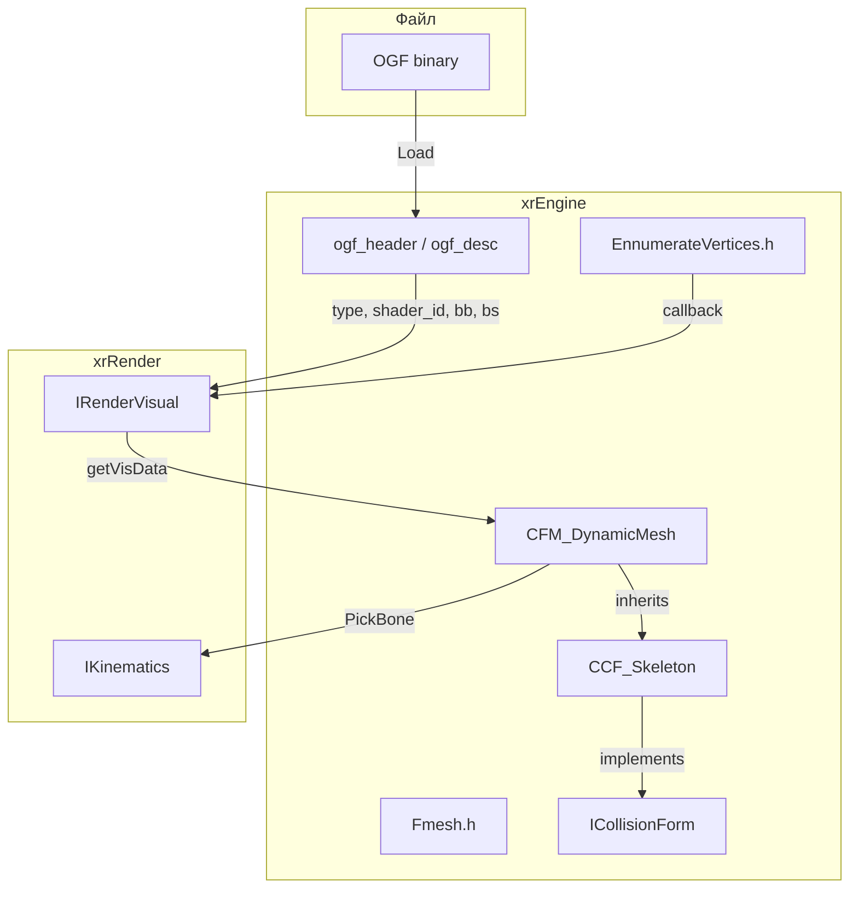
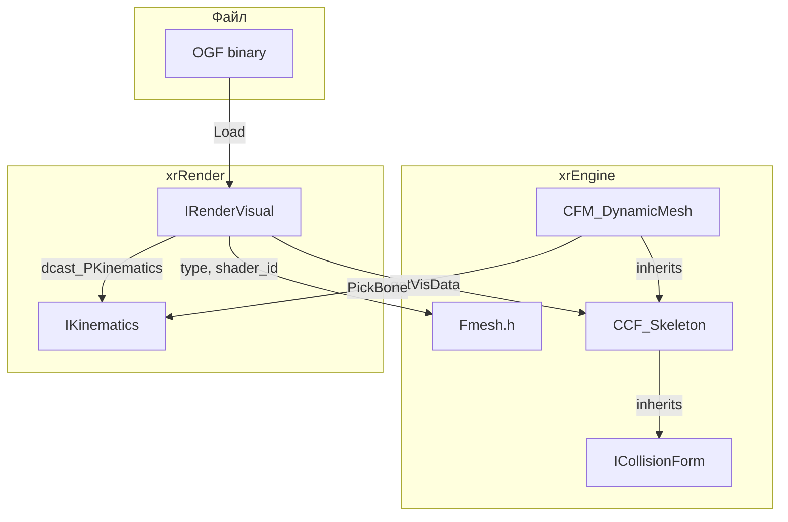
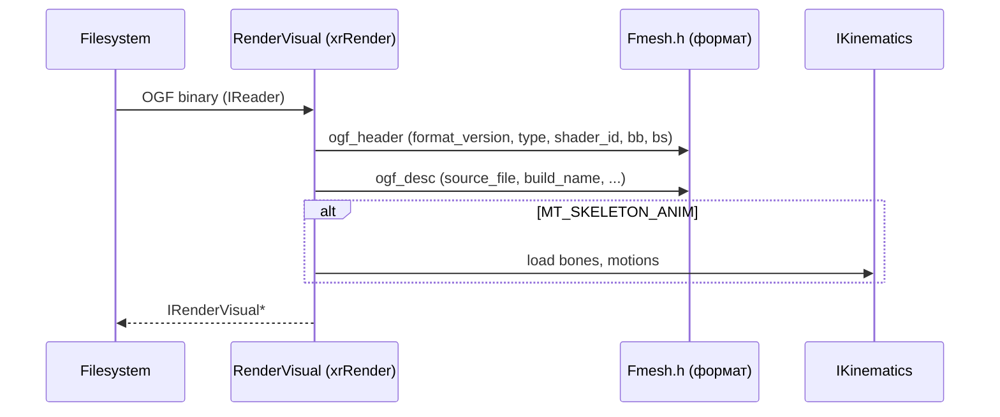
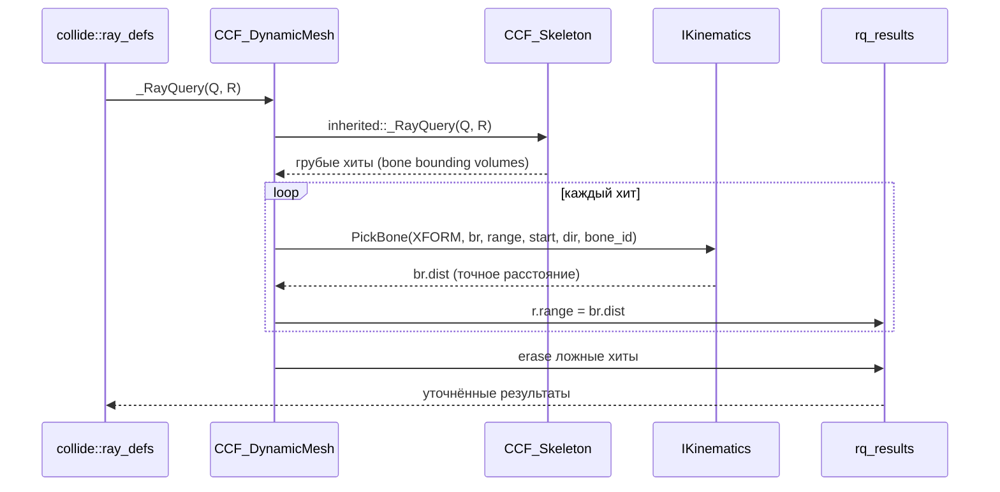

# Fmesh

`Fmesh` — формат описания меши в файле (OGF), плюс `cf_dynamic_mesh` (коллизия для динамического скелета) и `EnnumerateVertices`.

## Ответственность

- Определить формат OGF (Object Graph File): заголовок, текстуры, вершины, индексы, контейнеры, скелеты.
- Определить типы меши (`MT_*`) и чанки OGF (`OGF_*`).
- Предоставить `ogf_desc` (метаданные: файл, имя сборки, время), `ogf_bbox`, `ogf_bsphere`.
- Определить `FSlideWindow` / `FSlideWindowItem` (sliding window для прогрессивных меши).
- `CFM_DynamicMesh` — коллизия для динамического скелета (ray query через `PickBone`).
- `SEnumVerticesCallback` — callback для перечисления вершин.

## Место в архитектуре



`Fmesh` — **описание формата**, не реализация. Загрузка/рендер OGF — в `xrRender` (`RenderVisual`, `Kinematics`). `CFM_DynamicMesh` — единственная реализация в `xrEngine` (коллизия для скелетов с анимацией).

## Публичный API

### `MT` (Mesh Type)

```cpp
// Fmesh.h
enum MT
{
    MT_NORMAL = 0,
    MT_HIERRARHY = 1,
    MT_PROGRESSIVE = 2,
    MT_SKELETON_ANIM = 3,
    MT_SKELETON_GEOMDEF_PM = 4,
    MT_SKELETON_GEOMDEF_ST = 5,
    MT_LOD = 6,
    MT_TREE_ST = 7,
    MT_PARTICLE_EFFECT = 8,
    MT_PARTICLE_GROUP = 9,
    MT_SKELETON_RIGID = 10,
    MT_TREE_PM = 11,
    MT_3DFLUIDVOLUME = 12,
};
```

### `OGF_Chuncks`

```cpp
enum OGF_Chuncks
{
    OGF_HEADER = 1,
    OGF_TEXTURE = 2,
    OGF_VERTICES = 3,
    OGF_INDICES = 4,
    OGF_P_MAP = 5,
    // unused
    OGF_SWIDATA = 6,
    OGF_VCONTAINER = 7,
    OGF_ICONTAINER = 8,
    OGF_CHILDREN = 9,
    // skeletons
    OGF_CHILDREN_L = 10,
    OGF_LODDEF2 = 11,
    OGF_TREEDEF2 = 12,
    OGF_S_BONE_NAMES = 13,
    OGF_S_MOTIONS = 14,
    OGF_S_SMPARAMS = 15,
    OGF_S_IKDATA = 16,
    OGF_S_USERDATA = 17,
    OGF_S_DESC = 18,
    OGF_S_MOTION_REFS = 19,
    OGF_SWICONTAINER = 20,
    OGF_GCONTAINER = 21,
    OGF_FASTPATH = 22,
    OGF_S_LODS = 23,
    OGF_S_MOTION_REFS2 = 24,
    OGF_COLLISION_VERTICES = 25,
    OGF_COLLISION_INDICES = 26,
    OGF_forcedword = 0xFFFFFFFF
};
```

### `ogf_header`

```cpp
const u8 xrOGF_FormatVersion = 4;

struct ogf_header
{
    u8 format_version;  // = xrOGF_FormatVersion (4)
    u8 type;            // MT
    u16 shader_id;      // should not be ZERO
    ogf_bbox bb;
    ogf_bsphere bs;
};
```

### `ogf_desc`

```cpp
struct ECORE_API ogf_desc
{
    shared_str source_file;
    shared_str build_name;
    time_t build_time;
    shared_str create_name;
    time_t create_time;
    shared_str modif_name;
    time_t modif_time;

    ogf_desc() : build_time(0), create_time(0), modif_time(0) {}
    void Load(IReader& F);
    void Save(IWriter& F);
};
```

### `FSlideWindow` / `FSlideWindowItem`

```cpp
struct ENGINE_API FSlideWindow
{
    u32 offset;
    u16 num_tris;
    u16 num_verts;
};

struct ENGINE_API FSlideWindowItem
{
    FSlideWindow* sw;
    u32 count;
    u32 reserved[4];
    FSlideWindowItem() : sw(0), count(0) {};
};
```

### `CFM_DynamicMesh`

```cpp
// cf_dynamic_mesh.h
class ENGINE_API CCF_DynamicMesh : public CCF_Skeleton
{
    typedef CCF_Skeleton inherited;
public:
    CCF_DynamicMesh(CObject* _owner) : CCF_Skeleton(_owner) {};
    virtual BOOL _RayQuery(const collide::ray_defs& Q, collide::rq_results& R);
};
```

### `SEnumVerticesCallback`

```cpp
// EnnumerateVertices.h
struct SEnumVerticesCallback
{
    virtual void operator()(const Fvector& p) = 0;
};
```

## Внутреннее устройство

### `ogf_desc::Load/Save`

```cpp
void ogf_desc::Load(IReader& F)
{
    F.r_stringZ(source_file);
    F.r_stringZ(build_name);
    F.r(&build_time, sizeof(build_time));
    F.r_stringZ(create_name);
    F.r(&create_time, sizeof(create_time));
    F.r_stringZ(modif_name);
    F.r(&modif_time, sizeof(modif_time));
}

void ogf_desc::Save(IWriter& F)
{
    F.w_stringZ(source_file);
    F.w_stringZ(build_name);
    F.w(&build_time, sizeof(build_time));
    F.w_stringZ(create_name);
    F.w(&create_time, sizeof(create_time));
    F.w_stringZ(modif_name);
    F.w(&modif_time, sizeof(modif_time));
}
```

`Z-String` — null-terminated string. Формат: 3 пары `(name, time)`: source, build, create, modif.

### `CFM_DynamicMesh::_RayQuery`

```cpp
BOOL CCF_DynamicMesh::_RayQuery(const collide::ray_defs& Q, collide::rq_results& R)
{
    int s_count = R.r_count();
    BOOL res = inherited::_RayQuery(Q, R);  // CCF_Skeleton::_RayQuery
    if (!res)
        return FALSE;

    VERIFY(owner);
    VERIFY(owner->Visual());
    IKinematics* K = owner->Visual()->dcast_PKinematics();

    struct spick
    {
        const collide::ray_defs& Q;
        const CObject& obj;
        IKinematics& K;

        bool operator()(collide::rq_result& r)
        {
            IKinematics::pick_result br;
            VERIFY(r.O == &obj);
            bool res = K.PickBone(obj.XFORM(), br, Q.range, Q.start, Q.dir, (u16)r.element);
            if (res)
                r.range = br.dist;  // уточняет расстояние
            return !res;  // true → удалить результат
        }
    } pick((collide::ray_defs&)(Q), (const CObject&)(*owner), (IKinematics&)(*K));

    R.r_results().erase(std::remove_if(R.r_results().begin() + s_count, R.r_results().end(), pick),
                        R.r_results().end());
    VERIFY(R.r_count() >= s_count);
    return R.r_count() > s_count;
}
```

Алгоритм:

1. Вызывает `CCF_Skeleton::_RayQuery` — грубый тест по bounding-шарам/боксам костей.
2. Если есть хиты — уточняет каждый через `K.PickBone` (точный ray-triangle тест на меши скелета).
3. `PickBone` возвращает `br.dist` (точное расстояние) — обновляет `r.range`.
4. Убирает результаты, где `PickBone` не нашёл хит (ложные срабатывания грубого теста).
5. Возвращает `TRUE` если остались результаты.

### `OGF_SkeletonVertType`

```cpp
enum OGF_SkeletonVertType
{
    OGF_VERTEXFORMAT_FVF_1L = 1 * 0x12071980,
    OGF_VERTEXFORMAT_FVF_2L = 2 * 0x12071980,
    OGF_VERTEXFORMAT_FVF_3L = 4 * 0x12071980,
    OGF_VERTEXFORMAT_FVF_4L = 5 * 0x12071980,
    OGF_VERTEXFORMAT_FVF_NL = 3 * 0x12071980,
};
```

FVF (Flexible Vertex Format) для скелетных меши: 1-4 lightmap.

### `xrOGF_SMParamsVersion = 4`

Версия skeleton motion parameters.

## Взаимодействие



- **`Fmesh.h`** — описание формата, не реализация. Загрузка OGF — в `xrRender` (`RenderVisual::Load`).
- **`CFM_DynamicMesh`** — наследует `CCF_Skeleton`, переопределяет `_RayQuery` для уточнения через `PickBone`.
- **`IKinematics::PickBone`** — точный ray-triangle тест на меши кости (xrRender).
- **`SEnumVerticesCallback`** — callback для перечисления вершин (используется в `xrRender`).

## Потоки данных

### Загрузка OGF



### Ray query (динамический скелет)



## Конфигурация

- `xrOGF_FormatVersion = 4` — текущая версия формата OGF.
- `xrOGF_SMParamsVersion = 4` — версия skeleton motion parameters.
- `MT_SKELETON_ANIM = 3` — тип для анимированных скелетов.
- `OGF_FASTPATH = 22` — extended/fast geometry (оптимизация).
- `OGF_COLLISION_VERTICES = 25` / `OGF_COLLISION_INDICES = 26` — отдельная коллизионная геометрия.

## Ограничения / дебаг

- `CFM_DynamicMesh::_RayQuery` — **двухэтапный**: грубый (`CCF_Skeleton`) + точный (`PickBone`). Ложные хиты грубого теста отфильтровываются.
- `VERIFY(r.O == &obj)` в `spick::operator()` — результат должен принадлежать тому же объекту.
- `ogf_header::shader_id` — **should not be ZERO** (R_ASSERT в `xrRender`).
- `MT_PARTICLE_EFFECT` / `MT_PARTICLE_GROUP` — для частиц (см. [Рендер-слой](render.md)).
- `MT_3DFLUIDVOLUME` — 3D fluid volume (не используется в текущем билде).
- `OGF_ICONTAINER` / `OGF_CHILDREN` — помечены как "not used ??" в исходниках.
