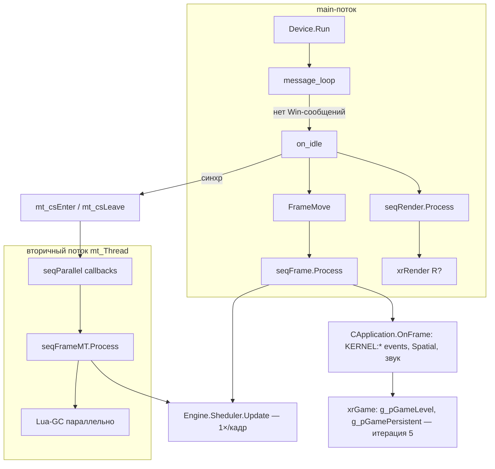

# Цикл кадра

Как `CRenderDevice` живёт после `Device.Create/Initialize` (см. [Device](device.md), порцион 3): поток, очередь Windows-сообщений, тело кадра `on_idle`, `FrameMove`, вторичный поток и registrator'ы.

> Страница-архитектура [Цикл кадра](../../architecture/frame-loop.md) — общий скелет; здесь — точный разбор `device.cpp` на уровне функций.

## Ответственность

- **`Run()`** — старт главного цикла: запуск потоков, `seqAppStart`, `message_loop`, `seqAppEnd`, выход.
- **`message_loop()`** — стандартный `PeekMessage`/`TranslateMessage`/`DispatchMessage`; каждый «пробел» без Windows-сообщений = один кадр (`on_idle`).
- **`on_idle()`** — тело кадра: загрузка, `FrameMove`, матрицы, рендер, синхронизация с вторичным потоком.
- **`FrameMove()`** — тайминги кадра (`fTimeDelta`, `dwTimeGlobal`), `ShaderBus::frame_latch`, `seqFrame.Process`.
- **`mt_Thread`** — вторичный поток: `seqParallel` + `seqFrameMT` + параллельный Lua-GC во время GPU-рендера.
- Потоки сервиса: `mt_FreezeThread` (детект фризов), `mt_DiscordThread` (Discord presence).

## Место в архитектуре

Самый нижний слой runtime'а: всё, что происходит после старта (игровые объекты, скрипты, рендер), выполняется внутри этого цикла. Вход сюда — из `Startup()` ([Ядро](engine.md)). Верхние слои «подключаются» к циклу только через:

- `AddSeqFrame(f, mt)` / `RemoveSeqFrame` — участие в `seqFrame` (main) или `seqFrameMT` (вторичный поток);
- `Engine.Sheduler.Register` — участие через [Sheduler](scheduler.md);
- `Device.seqParallel` — одноразовые callback'и во вторичном потоке.

## Публичный API

```cpp
// device.h — CRenderDevice (глобальный инстанс: Device)
void Run();

// IRenderDevice
void AddSeqFrame(pureFrame* f, bool mt);  // mt == true → seqFrameMT, иначе seqFrame
void RemoveSeqFrame(pureFrame* f);
```

Registrator'ы на `CRenderDevice` (`device.h`):

| Поле                                  | Тип                                     | Когда исполняется                                   |
| ------------------------------------- | --------------------------------------- | --------------------------------------------------- |
| `seqRender`                           | `CRegistrator<pureRender>`              | `on_idle`, внутри `Begin()/End()`                   |
| `seqFrame`                            | `CRegistrator<pureFrame>`               | `FrameMove()` (main) — либо fallback на main-потоке |
| `seqFrameMT`                          | `CRegistrator<pureFrame>`               | вторичный поток `mt_Thread` (или fallback)          |
| `seqAppStart` / `seqAppEnd`           | `pureAppStart` / `pureAppEnd`           | разово в `Run()` — до/после `message_loop`          |
| `seqAppActivate` / `seqAppDeactivate` | `pureAppActivate` / `pureAppDeactivate` | активация/деактивация окна                          |
| `seqResolutionChanged`                | `pureScreenResolutionChanged`           | смена разрешения                                    |
| `seqDeviceReset`                      | `pureDeviceReset`                       | сброс устройства (D3D)                              |

`seqParallel` — `xr_vector` одноразовых callback'ов, исполняется во вторичном потоке (`clear_not_free` после прогона).

Механику `CRegistrator<T>` (приоритеты, `Process`, защита от рекурсии) — см. [Ядро → pure-сообщения](engine.md).

## Внутреннее устройство

### Файлы

| Файл                                                               | Назначение                                                                                                     |
| ------------------------------------------------------------------ | -------------------------------------------------------------------------------------------------------------- |
| `device.cpp`                                                       | `Run`, `message_loop`, `on_idle`, `FrameMove`, `mt_Thread`, `mt_DiscordThread`, `mt_FreezeThread`, `Begin/End` |
| `device.h`                                                         | `CRenderDevice`, registrator'ы, таймеры, матрицы                                                               |
| `Device_wndproc.cpp`                                               | `WndProc` — Windows-сообщения (порцион 3)                                                                      |
| `Device_create.cpp`, `Device_Initialize.cpp`, `Device_destroy.cpp` | жизненный цикл (порцион 3)                                                                                     |

### Run() — старт

Порядок (уровни 1–13):

1. `g_bLoaded = FALSE`; имя потока — «X-RAY Primary thread».
2. Синхронизация таймеров: ожидает границу тика `timeGetTime()` (MM) относительно `TimerAsync()` — чтобы `Timer_MM_Delta` и async-таймер совпали.
3. `mt_csEnter.Enter()`; `mt_bMustExit = FALSE`.
4. Запуск трёх потоков: `mt_FreezeThread` («Freeze detecting thread»), `mt_Thread` («X-RAY Secondary thread», аргумент — `this`), `mt_DiscordThread`.
5. `seqAppStart.Process(rp_AppStart)`; `m_pRender->ClearTarget()`.
6. `SetForegroundWindow(m_hWnd)`.
7. **`message_loop()`** — блокируется здесь до выхода из приложения.
8. `seqAppEnd.Process(rp_AppEnd)`.
9. Выход: `mt_bMustExit = TRUE`, `mt_csEnter.Leave()`, spin-wait `while (mt_bMustExit) Sleep(0)` — дождаться, пока вторичный поток заметит флаг.

### message_loop()

Классический цикл: `PeekMessage` → при наличии: `TranslateMessage` + `DispatchMessage`; **при отсутствии ожидающих сообщений — `on_idle()`** (один кадр). Выход по `WM_QUIT`.

Ветвь ингейм-редактора использует `message_loop_editor` (отдельная реализация, не в этой странице).

Вывод: частота кадров определяется не «покадровым сном», а **размером очереди Windows-сообщений** — при их отсутствии кадрам нет предела (ограничения ниже, в `on_idle`).

### on_idle() — тело кадра

Порядок (полностью):

1. `if (!b_is_Ready) { Sleep(100); return; }` — устройство не готово.
2. Сбор статистики: флаг из `psDeviceFlags.test(rsStatistic)`.
3. **Загрузка**: если `g_loading_events` не пуст — выполнить один callback загрузки, `pApp->LoadDraw()`, **return** (игрового кадра нет).
4. Авто-старт SASH-бенчмарка (условие).
5. **`FrameMove()`** — см. ниже.
6. **Precache**: если `dwPrecacheFrame` — вращать `vCameraDirection` на `angle = 2π * dwPrecacheFrame / dwPrecacheTotal` (камера орбитирует во время precache).
7. **Матрицы**: `mFullTransform = mProject * mView`, `mFullTransformHud`; `m_pRender->SetCacheXform`/`SetCacheXform_prev`; сохранение prev-данных grass-bender'ов (до 16 из `ps_ssfx_grass_interactive.y`), `wind_anim_prev/saved`; инверсия `mInvFullTransform`; снапшоты камеры/матриц.
8. `Device.isRendering = true`; сброс счётчиков Lua-GC.
9. **Разрешить вторичный поток**: `mt_csLeave.Enter()`; `mt_csEnter.Leave()`.
10. `ECO_RENDER` (флаг компиляции): busy-wait до refresh-режима либо `ps_framelimiter` (пауза/меню/лимитер).
11. Non-dedicated: `Statistic->RenderTOTAL_Real` begin; если `b_is_Active && Begin()` → **`seqRender.Process(rp_Render)`** → опц. `Statistic->Show()` → `End()`.
12. `Device.isRendering = false`.
13. **Поставить вторичный поток на паузу**: `mt_csEnter.Enter()`; `mt_csLeave.Leave()`.
14. **Fallback**: если вторичный поток не отработал в этом кадре (`dwFrame != mt_Thread_marker`) — выполнить callback'и `seqParallel` + `seqFrameMT.Process(rp_Frame)` **на main-потоке**.
15. Опц. параллельный Lua-GC debug.
16. `DEDICATED_SERVER`: sleep для поддержания фиксированного тик-рейта `g_svDedicateServerUpdateReate`.
17. `if (!b_is_Active) Sleep(1)` — окно неактивно.

### FrameMove() — тайминги и seqFrame

Порядок:

1. Обновить список мониторов, если dirty.
2. `dwFrame++`; `Core.dwFrame = dwFrame`.
3. `dwTimeContinual = TimerMM.GetElapsed_ms() - app_inactive_time` (время без учёта неактивности).
4. **Два режима тайминга**:
   - `psDeviceFlags.test(rsConstantFPS)` — фиксированный 30 FPS: `fTimeDelta = 0.033`, `dwTimeDelta = 33`, `dwTimeGlobal += 33`.
   - иначе — таймерный: `fPreviousFrameTime = Timer.GetElapsed_sec()`; `Timer.Start()` (перезапуск); **EMA-сглаживание** `fTimeDelta = 0.1*fTimeDelta + 0.9*fPreviousFrameTime`; clamp `[2*EPS_S, 0.1]` (мин ~15 FPS); `fTimeDelta = 0` при `Paused()`.
   - `fTimeGlobal = TimerGlobal.GetElapsed_sec()`; `dwTimeGlobal = TimerGlobal.GetElapsed_ms()`; `dwTimeDelta = dwTimeGlobal - old`.
5. `Statistic->EngineTOTAL.Begin()`.
6. **`ShaderBus::frame_latch()`** — фиксация значений shader-буса на кадр (сам shader bus — итерация 3, [Shader Bus](../renderer/shader-bus.md)).
7. **`Device.seqFrame.Process(rp_Frame)`** — main-пасс всех frame-участников.
8. `g_bLoaded = TRUE`.
9. `Statistic->EngineTOTAL.End()`.

Порядок участников `seqFrame` задаётся приоритетами `CRegistrator`. Первый — `CApplication` (`REG_PRIORITY_HIGH + 1000`), и в его `OnFrame` происходит, в том числе, dispatch defer-событий `Engine.Event.OnFrame` ([API](api.md)) и обновление `g_SpatialSpace`, `g_SpatialSpacePhysic`, `g_pGameLevel->SoundEvent_Dispatch` — то есть «каркас кадра» начинается до всех остальных участников.

### mt_Thread — вторичный поток

Цикл:

1. `mt_csEnter.Enter()` — ждать разрешения (main даёт его в шаге 9 `on_idle`).
2. Если `mt_bMustExit` — снять флаг, `Leave()`, выйти.
3. `mt_Thread_marker = dwFrame` — отметка «я отработал в кадре N».
4. Все callback'и `Device.seqParallel` (одноразовые, `clear_not_free`).
5. **`seqFrameMT.Process(rp_Frame)`** — thread-safe вариант frame-пасса.
6. **Параллельный Lua-GC** (если `psLua_ParallelGC && Device.LuaGC`): многократные `Device.LuaGC()` (по шагам, до `psLua_ParallelGC_CallAmount` раз либо пока не вернёт 1 = цикл завершён), только пока `Device.isRendering` — распределяет стоимость GC на время, пока GPU рендерит кадр.
7. `mt_csEnter.Leave()` (готово), `mt_csLeave.Enter()` (ждать следующего разрешения), `mt_csLeave.Leave()` (подтверждение).

Синхронизация — два критсекции-«дверцы»: main **открывает** поток (`mt_csEnter.Leave`) и **закрывает** его (`mt_csEnter.Enter`) вокруг GPU-рендера; поток подтверждает через `mt_csLeave`.

### Сервисные потоки

- **`mt_DiscordThread`**: цикл; если `pApp == NULL` — лог + выход; если `use_discord && psDeviceFlags2.test(rsDiscord)` — `discord_core->RunCallbacks()`, `updateDiscordPresence()`, `Sleep(discord_update_rate*1000)`; иначе `Sleep(1000)`.
- **`mt_FreezeThread`**: детект фризов через `FreezeTimer` и `CheckPrivilegySlowdown()` (подробнее — порцион 3).

### Begin() / End()

Начало/конец GPU-рендера (clear, swap). Механика — порционы 3–4.

## Взаимодействие



- **Кто подключается**: участники `pureFrame` через `AddSeqFrame(f, mt)` (main) / (thread); участники `pureRender` через `Device.seqRender.Add`; задачи `ISheduled` через [Sheduler](scheduler.md).
- **xrGame**: `g_pGamePersistent`, `g_pGameLevel` — участники `seqFrame` (итерация 5); здесь — только как целевые объекты.
- **Рендер**: `m_pRender` (xrRender R?) — вызывается из `Begin/End` и `seqRender` (итерация 3).
- **Ввод**: `xr_input` — порцион 12; `WndProc` — порцион 3.

## Потоки данных

```mermaid
sequenceDiagram
    participant Win as Windows
    participant Main as Main-поток
    participant Sec as mt_Thread
    participant GPU as Рендер (R?)
    participant Game as xrGame (seqFrame)
    Win->>Main: message
    Main->>Main: DispatchMessage
    loop пока нет Win-сообщений
        Main->>Main: on_idle()
        Main->>Main: FrameMove (таймеры, ShaderBus::frame_latch)
        Main->>Game: seqFrame.Process (OnFrame, Sheduler.Update, …)
        Main->>Sec: открыть mt_csEnter
        Main->>GPU: Begin(); seqRender.Process; End()
        Sec->>Game: seqParallel + seqFrameMT + Lua-GC (параллельно GPU)
        Main->>Sec: закрыть mt_csEnter
        alt Sec не отметился (dwFrame != mt_Thread_marker)
            Main->>Game: seqParallel + seqFrameMT на main-потоке
        end
    end
```

## Конфигурация

- `ps_framelimiter` — жёсткий лимит FPS (busy-wait в `ECO_RENDER`).
- `psDeviceFlags.test(rsConstantFPS)` — режим фиксированного 30 FPS.
- `psLua_ParallelGC` / `psLua_ParallelGC_CallAmount` — включение и размер шага параллельного Lua-GC.
- `g_svDedicateServerUpdateReate` — тик-рейт dedicated server (ветвь `DEDICATED_SERVER`).
- `rsDiscord` (`psDeviceFlags2`) + `discord_update_rate` — Discord-поток.
- `ECO_RENDER` — флаг компиляции busy-wait'а.

## Ограничения / дебаг

- **Частота кадров** ограничена только скоростью Windows-очереди + `rsConstantFPS`/`ps_framelimiter`/`ECO_RENDER`; «сна на кадр» нет.
- **Fallback** `seqFrameMT` на main-потоке (шаг 14 `on_idle`) может произойти в кадре, если вторичный поток не успел — это штатный путь, не ошибка.
- `app_inactive_time` — время, пока окно неактивно, вычитается из `dwTimeContinual`; `dwTimeGlobal` от этого **не** зависит.
- `dwPrecacheFrame` — режим precache: камера орбитирует, контроль бюджета [Sheduler](scheduler.md) отключён.
- `DEDICATED_SERVER` — нет GPU-рендера (ветка 11 `on_idle` пропускается), тик-рейт фиксированный.
- `mt_Thread_marker` — единственный маркер синхронизации «отработал ли поток в кадре N»; fallback определяется только по нему.
- `message_loop_editor` — отдельная реализация для ингейм-редактора, не покрыта этой страницей.
- `g_bRendering`, `refresh_rate`, `psLua_ParallelGC*`, `app_inactive_time*` — глобалы `device.cpp` (см. [Device](device.md), порцион 3).
