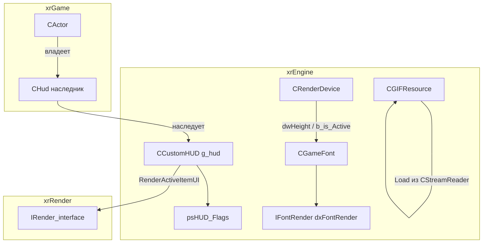
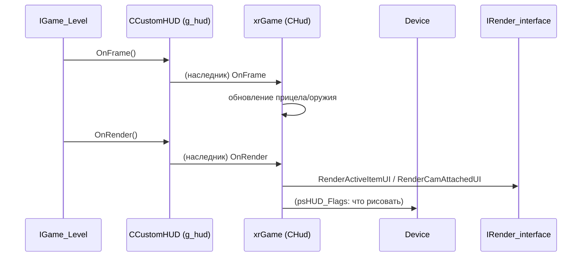
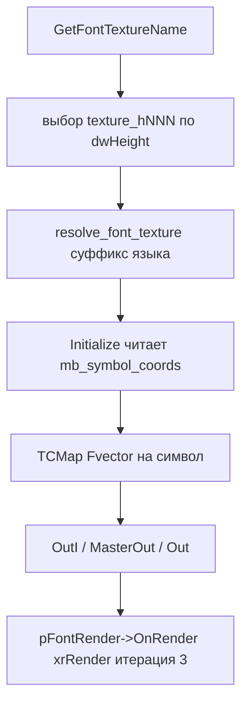

# HUD

**HUD** — подсистема `xrEngine` для наэкранного интерфейса игрока: прицелы, оружие в руках, статусная информация. Здесь — каркас `CCustomHUD` (интерфейс, который xrGame реализует), **шрифт** `CGameFont` (bitmap-атлас + раскладка) и **GIF-ресурс** `CGIFResource` (декодирование анимаций в RAM).

См. [Камера](camera.md), [Device](device.md), [UI-примитивы](ui-primitives.md), [Цикл кадра](frame-loop.md).

## Ответственность

- **`CCustomHUD`** (`src/xrEngine/CustomHUD.h/.cpp`) — чистый каркас (интерфейс) HUD: набор **бит-флагов** `psHUD_Flags` (что рисовать: прицел, оружие, инфо) + **чистые виртуальные** `RenderActiveItemUI`/`RenderCamAttachedUI`/`OnConnected`/`OnDisconnected` и т.п. Сам по себе не рисует — наследник в xrGame (например, `CHud`) реализует. Глобал `g_hud` — единственный активный HUD.
- **`CGameFont`** (`src/xrEngine/GameFont.h/.cpp`) — bitmap-шрифт на основе **атласа** (`mb_symbol_coords` / `symbol_coords` / `char widths` / `font_size` в `.ini`): размеры глифов, расчёт ширины строки, отрисовка через `IFontRender` (xrRender, итерация 3), мультибайт (UTF-8→UTF-16), разбиение по ширине.
- **`CGIFResource`** (`src/xrEngine/GIFResource.h/.cpp`) — декодер GIF в `xr_vector<Image>` (картинки + задержки): GCB (delay/transparent/disposal), interlaced, пиксели в **BGR** для R1/R2, **RGBA** иначе.

Чего это **НЕ делает**: не рисует сам (только задаёт данные для `IFontRender`/`IRender`); не владеет игровыми данными HUD (оружие, прицелы, статус — xrGame); не управляет вводом (ввод — [UI-примитивы](ui-primitives.md)).

## Место в архитектуре

`CCustomHUD` — узел между игровой сценой (xrGame) и `Device`. `CGameFont` — автономный (не зависит от HUD, используется в консоли, меню и т.п.). `CGIFResource` — автономный декодер (используется для анимаций в меню и т.п.).

## Публичный API

### `CCustomHUD` (`src/xrEngine/CustomHUD.h`)

Наследует `DLL_Pure`, `IEventReceiver`, `pureScreenResolutionChanged`. Конструктор устанавливает `g_hud = this` и регистрирует в `Device.seqResolutionChanged`; деструктор — `g_hud = NULL` + `Remove`.

**Бит-флаги `psHUD_Flags`** (глобальный `Flags32`):

| Флаг                    | Значение   | Что                                  |
| ----------------------- | ---------- | ------------------------------------ |
| `HUD_CROSSHAIR`         | `1<<0`     | прицел (обычный)                     |
| `HUD_CROSSHAIR_DIST`    | `1<<1`     | прицел с дистанцией                  |
| `HUD_WEAPON`            | `1<<2`     | оружие (обычный)                     |
| `HUD_INFO`              | `1<<3`     | статусная информация                 |
| `HUD_DRAW`              | `1<<4`     | отрисовка (обычный)                  |
| `HUD_CROSSHAIR_RT`      | `1<<5`     | прицел (RT)                          |
| `HUD_WEAPON_RT`         | `1<<6`     | оружие (RT)                          |
| `HUD_CROSSHAIR_DYNAMIC` | `1<<7`     | динамический прицел                  |
| **`HUD_CROSSHAIR_RT2`** | **`1<<9`** | прицел RT2 (**бит `1<<8` пропущен**) |
| `HUD_DRAW_RT`           | `1<<10`    | отрисовка RT                         |
| `HUD_WEAPON_RT2`        | `1<<11`    | оружие RT2                           |
| `HUD_DRAW_RT2`          | `1<<12`    | отрисовка RT2                        |

**По умолчанию** (конструктор `psHUD_Flags`): `HUD_CROSSHAIR_RT | HUD_WEAPON_RT | HUD_WEAPON_RT2 | HUD_CROSSHAIR_DYNAMIC | HUD_CROSSHAIR_RT2 | HUD_DRAW_RT | HUD_DRAW_RT2`.

**Виртуальные** (база — no-op, наследник реализует): `Render_First`, `Render_Last`, `OnFrame`, `OnEvent`, `Load`. **Чистые виртуальные**: `OnDisconnected`, `OnConnected`, `RenderActiveItemUI`, `RenderCamAttachedUI`, `RenderActiveItemUIQuery`, `RenderCamAttachedUIQuery`, `Render_R1_Attachment_UI`, `net_Relcase`.

### `CGameFont` (`src/xrEngine/GameFont.h`)

| Поле / метод                                          | Описание                                                     |
| ----------------------------------------------------- | ------------------------------------------------------------ |
| `m_Textures` (`TCMap`)                                | `Fvector` на символ (координаты в атласе)                    |
| `m_String` (`String*`)                                | строки (символ, x, y, высота, цвет, выравнивание)            |
| `Initialize(section)`                                 | читает атлас из `pSettings[section]` (4 варианта, см. ниже)  |
| `SetHeightI(S)` / `SetHeight(S)`                      | высота в device-px / DI-px (см. «Ограничения»)               |
| `GetHeight()`                                         | текущая высота                                               |
| `SetAligment(EAligment)`                              | `alLeft` / `alRight` / `alCenter`                            |
| `SetColor(c)`                                         | цвет (r/g/b)                                                 |
| `WidthScale(f)`                                       | масштаб ширины                                               |
| `SetInterval(i)`                                      | интервал между символами                                     |
| `SizeOf_(...)`                                        | ширина строки (3 оверлоада: `LPCSTR` / `wchar_t*` / `char*`) |
| `OutI(x, y, str)` / `Out(x, y, str)` / `OutNext(str)` | отрисовка (device-px / raw / след. строка)                   |
| `OutSkip(x, y)`                                       | пропустить позицию                                           |
| `MasterOut(x, y, str)`                                | отрисовка с DI-масштабом                                     |
| `SplitByWidth(w)` / `GetCutLengthPos(w)`              | разбиение по ширине                                          |
| `OnRender()`                                          | делегат `pFontRender->OnRender(*this)`                       |
| `Clear()`                                             | сброс                                                        |

**Флаги `m_Flags`**: `fsGradient (1<<0)`, `fsDeviceIndependent (1<<1)`, `fsValid (1<<2)`, `fsMultibyte (1<<3)`.

**`EAligment`**: `alLeft` / `alRight` / `alCenter`.

**`GetFontTextureName(section)`** (free-функция): выбор атласа по высоте экрана.

### `CGIFResource` (`src/xrEngine/GIFResource.h`)

| Метод                        | Описание                               |
| ---------------------------- | -------------------------------------- |
| `Load(CStreamReader&)`       | декодирование GIF в `xr_vector<Image>` |
| `GetImages()`                | `xr_vector<Image>*`                    |
| `GetWidth()` / `GetHeight()` | размеры                                |
| `GetImageSize(i)`            | размер i-й картинки (в байтах)         |

`Image` — `{ const u8* data; u32 delay; }` (ms).

## Внутреннее устройство

### `CCustomHUD`

Каркас: конструктор/деструктор + бит-флаги + чистые виртуальные. Вся логика — в наследниках (xrGame).

### `CGameFont::Initialize(section)`

Читает `pSettings[section]` и выбирает **первое** найденное:

1. **`mb_symbol_coords`** — мультибайт (UTF-8→UTF-16), до `0x10000` символов, 5-значные координаты; специальные: `0x0020` (пробел) и `0x3000` (идеогр. пробел) → `(0,0,0)`; `fXStep = ceil(height/2)`. Ставит `fsMultibyte`.
2. **`symbol_coords`** — 7-bit (0..0x100), 3-значные координаты.
3. **`char widths`** — 16 символов на строку, ширины.
4. **`font_size`** — только размер.

**`GetFontTextureName(section)`** — выбор атласа по `Device.dwHeight`:

- собирает «ступени» (`FontRung{key, lo, hi, authored}`) из `texture_h<NNN>` в секции + legacy;
- `s_legacy_rungs[]`: `texture800` (0–601, authored 600), `texture` (601–1024, 768), `texture1600` (1024–1440, 1200), `texture2160` (1440–∞, 2160);
- `LEGACY_DEFAULT_IDX = 1` (`texture`);
- `RUNG_PREFIX = "texture_h"`;
- скоринг: `|log(authored / h)|` — минимум побеждает; при равном — явная ступень (из секции), затем больший `authored`;
- проверка: атлас-`.ini` должен существовать в `$game_textures$`, иначе — legacy default.

**`resolve_font_texture`** — добавляет суффикс языка `font_prefix` (кроме DI-шрифта).

### `CGameFont` — отрисовка

- **`MasterOut`**: если `!RDEVICE.b_is_Active` — skip; DI-масштаб `DI2PX`/`DI2PY`.
- **`OutI`**: координаты в device-px.
- **`Out`**: raw.
- **`OutNext`**: skip.
- **`SizeOf_`** / **`SplitByWidth`** / **`GetCutLengthPos`**: используют `mbhMulti2Wide` (UTF-8→UTF-16, см. [Рендер-слой](render.md)).
- **`OnRender`**: делегат `pFontRender->OnRender(*this)` (реализация — xrRender, итерация 3).

### `CGIFResource::Load`

Декодирование через `gif_lib` (`DGif*`):

- `Read_GIF_Fn` из `CStreamReader`;
- **GCB** (Graphic Control Block): `delay` (×10 → ms), `transparent` (цвет), `disposal` (режим очистки);
- **interlaced**: `InterlacedOffset{0,4,2,1}` / `InterlacedJumps{8,8,4,2}`;
- **порядок пикселей**: **BGR** для `STATIC_RENDERER_R1`/`R2`, **RGBA** иначе (`write_pixel`);
- аллокация: `width * height * 4` на картинку;
- `DEFAULT_DELAY = 10` ms.

## Взаимодействие

**Кто вызывает `CCustomHUD`**:

- **xrGame** (`CHud`-наследник): реализация чистых виртуальных (`RenderActiveItemUI` и т.п.);
- **`IGame_Level`** (`level.md`): `g_hud->OnFrame`, `g_hud->OnRender` (см. [Уровень](level.md)).

**Кого вызывает `CCustomHUD`**:

- **`Device`** (`CRenderDevice`): `seqResolutionChanged` (регистрация), `dwHeight`/`b_is_Active` (для `CGameFont`).

**`CGameFont`**:

- **Вызывает**: `pSettings` (в `Initialize`), `Device.dwHeight`/`b_is_Active`/`dwWidth`, `mbhMulti2Wide` (UTF-8→UTF-16), `pFontRender->OnRender` (xrRender, итерация 3).
- **Его вызывают**: консоль, меню, HUD-наследники (xrGame).

**`CGIFResource`**:

- **Вызывает**: `gif_lib` (`DGifSlurp`/`DGifImageDesc` и т.п.), `CStreamReader` (чтение).
- **Его вызывают**: xrGame (анимации в меню, intro и т.п.).

## Потоки данных

### HUD-кадр

### Шрифт (атлас → отрисовка)

## Конфигурация

**`CGameFont::Initialize(section)`** — читает из `pSettings[section]` (см. «Внутреннее устройство»). Типичные секции в `pSettings` (xrGame): `fonts/<name>`, `console`, `hud`.

**`GetFontTextureName`** — атласы в `$game_textures$/fonts/`, имена `texture_h<NNN>.ini` (+ legacy `texture800`/`texture`/`texture1600`/`texture2160`).

**`CGIFResource`** — нет конфигов; GIF-файлы — `$game_data$` / `$level$` (по пути).

## Известные ограничения / дебаг

- **`HUD_CROSSHAIR_RT2` = `1<<9`** — бит `1<<8` **пропущен** (исторический gap; `1<<8` не используется).
- **`CGameFont::SetHeight`** — имеет `VERIFY(uFlags & fsDeviceIndependent)` (то же, что `SetHeightI`). Подозрительно: `SetHeight` (non-DI) **не должен** требовать DI-флаг. Вероятно, copy-paste из `SetHeightI`.
- **`CGIFResource`** — порядок пикселей зависит от `STATIC_RENDERER_R?` (R1/R2 — BGR, иначе RGBA). При смене рендерера — пересборка.
- **`CGameFont::Initialize`** — 4 варианта атласа; выбор — по первому найденному (порядок: `mb_symbol_coords` → `symbol_coords` → `char widths` → `font_size`).
- **DEBUG**: `CGameFont::SizeOf_` / `SplitByWidth` — `VERIFY` на валидность `m_Flags` (`fsValid`).
