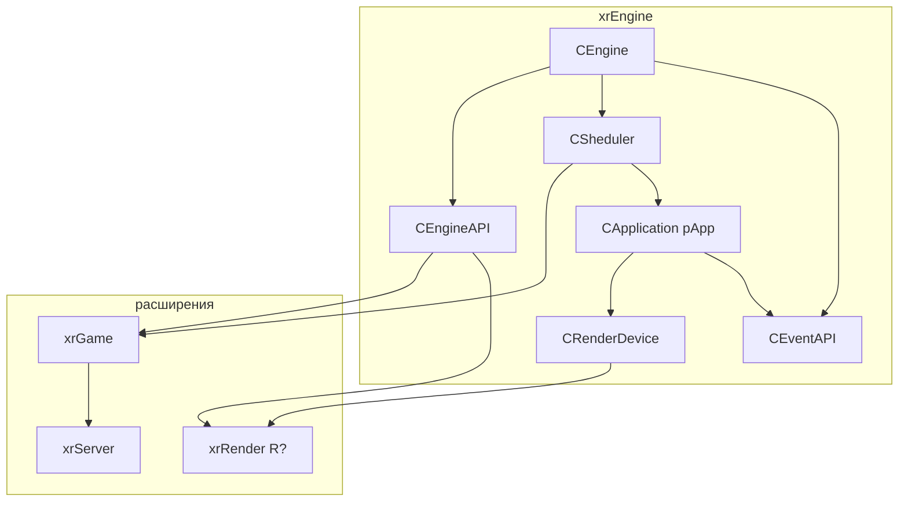

# xrEngine (ядро)

`xrEngine` — ядро движка: `CEngine`, `CSheduler`, `CRenderDevice`, событийная шина, консоль, Lua-биндинг, камера/HUD, окружение, эффекты, ввод.

См. [Карта модулей](../../architecture/module-map.md), [Цикл кадра](../../architecture/frame-loop.md), [Модель объектов](../../architecture/object-model.md).

## Структура

| Страница                                             | Что покрывает                                                                                                                                        |
| ---------------------------------------------------- | ---------------------------------------------------------------------------------------------------------------------------------------------------- |
| [Ядро (CEngine) и точка входа](engine.md)            | `CEngine`, `PSGP`, `WinMain`/`WinMain_impl`/`Startup`, `CApplication`, `pure.h`/`CRegistrator`, `defines.h`, CLSID                                   |
| [API и события](api.md)                              | `CEngineAPI` (рендерер, игра, vTune, фабрика), `CEventAPI`/`CEvent`, `KERNEL:*`                                                                      |
| [Цикл кадра](frame-loop.md)                          | `Device.Run`, `message_loop`, `on_idle`, `FrameMove`, `mt_Thread`, `seqFrame`/`seqRender`/`seqFrameMT`                                               |
| [Sheduler](scheduler.md)                             | `CSheduler`, `ISheduled`, `Register`/`Unregister`/`EnsureOrder`, адаптивный бюджет                                                                   |
| [Device](device.md)                                  | _(порцион 3)_ — `CRenderDevice`, `CRenderDeviceData`, `Device_create/Initialize/destroy`, таймеры, матрицы                                           |
| [Окно и WndProc](device-window.md)                   | _(порцион 3)_ — `Device_wndproc`, `Device_Misc`, `Device_overdraw`, `xrHemisphere`                                                                   |
| [Рендер-слой](render.md)                             | `Render.h/.cpp`, `IRender_Light/Glow/Target`, `CPS_Instance`, `ShadersExternalData`, `Shader_xrLC`, `vis_common`, `MbHelpers`, `imf_Process`, `PAPI` |
| [IRenderable](renderable.md)                         | `IRenderable` — интерфейс рендеруемого объекта, `renderable_ROS`, lifecycle                                                                          |
| [Fmesh](fmesh.md)                                    | `Fmesh.h` (OGF формат), `CFM_DynamicMesh`, `EnnumerateVertices`, `ogf_desc`                                                                          |
| [Коллизии и физика (интерфейсы)](collide-physics.md) | _(порцион 5)_ — `ICollidable`, `IPhysicsGeometry/Shell`, `IObjectPhysicsCollision`                                                                   |
| [Объект (xr_object)](xr-object.md)                   | _(порцион 6)_ — `CGameObject`, `xr_object_list`, `ObjectAnimator`                                                                                    |
| [Уровень](level.md)                                  | _(порцион 6)_ — `IGame_Level`, `xrLevel`, `IGame_Level_check_textures`                                                                               |
| [Пул объектов](object-pool.md)                       | _(порцион 6)_ — `IGame_ObjectPool`                                                                                                                   |
| [Persistent](persistent.md)                          | _(порцион 6)_ — `IGame_Persistent`                                                                                                                   |
| [Скелет и анимация](skeleton-motion.md)              | _(порцион 7)_ — `bone`, `SkeletonMotions`, `motion`, `ObjectAnimator`                                                                                |
| [Окружение](environment.md)                          | _(порцион 8)_ — `CEnvironment`, `Effector`, `envelope`/`interp`                                                                                      |
| [Эффекторы](effector.md)                             | _(порцион 8)_ — `EffectorPP`, постобработка-эффекторы                                                                                                |
| [Feels](feel.md)                                     | _(порцион 9)_ — `Feel_Sound/Touch/Vision`                                                                                                            |
| [Визуальные эффекты](effects.md)                     | _(порцион 10)_ — `perlin`, `thunderbolt`, `Rain`, `LightAnimLibrary`, `xr_efflensflare`                                                              |
| [Камера](camera.md)                                  | _(порцион 11)_ — `CameraBase`, `CameraManager`                                                                                                       |
| [HUD](hud.md)                                        | _(порцион 11)_ — `CustomHUD`, `GameFont`, `GIFResource`                                                                                              |
| [UI-примитивы](ui-primitives.md)                     | _(порцион 11)_ — `imgui_base`, `line_edit_control`, `xrTheora_*`, `xrSASH`, `tntQAVI`                                                                |
| [Ввод](input.md)                                     | _(порцион 12)_ — `xr_input`, `Xr_input`, `xr_input_xinput`                                                                                           |
| [Консоль](console.md)                                | _(порцион 12)_ — `CConsole`/`CTextConsole`, `XR_IOConsole`, `xr_ioc_cmd`                                                                             |
| [Lua-биндинг](lua-binding.md)                        | _(порцион 12)_ — `_scripting`, `ai_script_space`, `ai_script_lua_*`                                                                                  |
| [Демо](demo.md)                                      | _(порцион 12)_ — `FDemoPlay`, `FDemoRecord`                                                                                                          |
| [Статистика](stats.md)                               | _(порцион 12)_ — `CStats`, `StatGraph`                                                                                                               |
| [Прочее](misc.md)                                    | _(порцион 12)_ — `mailSlot`, `trivial_encryptor`, `cl_intersect`                                                                                     |

> `shader_bus.h/.cpp` **не входит** в xrEngine: мигрирует в [Renderer → Shader Bus](../renderer/shader-bus.md) (итерация 3) вместе с `SHADER_BUS.md` из корня репо.

## Карта связей

- **`CEngine`** — корень. Владельцы: `Engine`, `pApp`.
- **`CEventAPI`** — шина `KERNEL:*` между `xrGame`/`xrServer`/консолью и `CApplication`/рендерером.
- **`CSheduler`** — планировщик `ISheduled` (уровень, ALIFE, звук, …). Не путать с `CRegistrator` (упорядоченный список сообщений).
- **`CRenderDevice`** — устройство + окно + матрицы + таймеры. Поднимается через `Device.Create/Initialize/Run`.
- **`CApplication`** — «приложение» на уровне процесса: уровень, шрифт, загрузка, Discord.

## Статус порционов (итерация 2)

| #   | Порцион                                           | Страницы                                                                     | Статус    |
| --- | ------------------------------------------------- | ---------------------------------------------------------------------------- | --------- |
| 1   | Ядро и API                                        | `engine.md`, `api.md`                                                        | ✅ готово |
| 2   | Цикл кадра и планировщик                          | `frame-loop.md`, `scheduler.md`                                              | ✅ готово |
| 3   | Устройство                                        | `device.md`, `device-window.md`                                              | ✅ готово |
| 4   | Рендер-слой                                       | `render.md`, `renderable.md`, `fmesh.md`                                     | ✅ готово |
| 5   | Коллизии/физика                                   | `collide-physics.md`                                                         | ⬜        |
| 6   | Объекты и уровень                                 | `xr-object.md`, `level.md`, `object-pool.md`, `persistent.md`                | ⬜        |
| 7   | Скелет и анимация                                 | `skeleton-motion.md`                                                         | ⬜        |
| 8   | Окружение и эффекторы                             | `environment.md`, `effector.md`                                              | ⬜        |
| 9   | Feels                                             | `feel.md`                                                                    | ⬜        |
| 10  | Визуальные эффекты                                | `effects.md`                                                                 | ⬜        |
| 11  | Камера / HUD / UI                                 | `camera.md`, `hud.md`, `ui-primitives.md`                                    | ⬜        |
| 12  | Ввод / Консоль / Lua / Демо / Статистика / Прочее | `input.md`, `console.md`, `lua-binding.md`, `demo.md`, `stats.md`, `misc.md` | ⬜        |
