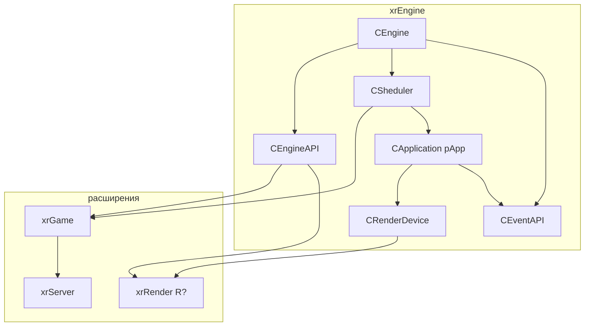

# xrEngine (ядро)

`xrEngine` — ядро движка: `CEngine`, `CSheduler`, `CRenderDevice`, событийная шина, консоль, Lua-биндинг, камера/HUD, окружение, эффекты, ввод.

См. [Карта модулей](../../architecture/module-map.md), [Цикл кадра](../../architecture/frame-loop.md), [Модель объектов](../../architecture/object-model.md).

## Структура

| Страница                                             | Что покрывает                                                                                                                                                                                                                                                                                                                                                                                                                                                                                                                                                                         |
| ---------------------------------------------------- | ------------------------------------------------------------------------------------------------------------------------------------------------------------------------------------------------------------------------------------------------------------------------------------------------------------------------------------------------------------------------------------------------------------------------------------------------------------------------------------------------------------------------------------------------------------------------------------- |
| [Ядро (CEngine) и точка входа](engine.md)            | `CEngine`, `PSGP`, `WinMain`/`WinMain_impl`/`Startup`, `CApplication`, `pure.h`/`CRegistrator`, `defines.h`, CLSID                                                                                                                                                                                                                                                                                                                                                                                                                                                                    |
| [API и события](api.md)                              | `CEngineAPI` (рендерер, игра, vTune, фабрика), `CEventAPI`/`CEvent`, `KERNEL:*`                                                                                                                                                                                                                                                                                                                                                                                                                                                                                                       |
| [Цикл кадра](frame-loop.md)                          | `Device.Run`, `message_loop`, `on_idle`, `FrameMove`, `mt_Thread`, `seqFrame`/`seqRender`/`seqFrameMT`                                                                                                                                                                                                                                                                                                                                                                                                                                                                                |
| [Sheduler](scheduler.md)                             | `CSheduler`, `ISheduled`, `Register`/`Unregister`/`EnsureOrder`, адаптивный бюджет                                                                                                                                                                                                                                                                                                                                                                                                                                                                                                    |
| [Device](device.md)                                  | _(порцион 3)_ — `CRenderDevice`, `CRenderDeviceData`, `Device_create/Initialize/destroy`, таймеры, матрицы                                                                                                                                                                                                                                                                                                                                                                                                                                                                            |
| [Окно и WndProc](device-window.md)                   | _(порцион 3)_ — `Device_wndproc`, `Device_Misc`, `Device_overdraw`, `xrHemisphere`                                                                                                                                                                                                                                                                                                                                                                                                                                                                                                    |
| [Рендер-слой](render.md)                             | `Render.h/.cpp`, `IRender_Light/Glow/Target`, `CPS_Instance`, `ShadersExternalData`, `Shader_xrLC`, `vis_common`, `MbHelpers`, `imf_Process`, `PAPI`                                                                                                                                                                                                                                                                                                                                                                                                                                  |
| [IRenderable](renderable.md)                         | `IRenderable` — интерфейс рендеруемого объекта, `renderable_ROS`, lifecycle                                                                                                                                                                                                                                                                                                                                                                                                                                                                                                           |
| [Fmesh](fmesh.md)                                    | `Fmesh.h` (OGF формат), `CFM_DynamicMesh`, `EnnumerateVertices`, `ogf_desc`                                                                                                                                                                                                                                                                                                                                                                                                                                                                                                           |
| [Коллизии и физика (интерфейсы)](collide-physics.md) | `ICollidable`, `ICollisionForm`/`CCF_Skeleton`/`CCF_EventBox`/`CCF_Shape`, `clQueryCollision`, `IObjectPhysicsCollision`, `IPhysicsShell/Element/Geometry`                                                                                                                                                                                                                                                                                                                                                                                                                            |
| [Объект (xr_object)](xr-object.md)                   | `CObject` (каркас: трансформ, `H_SetParent`, crow, `net_*`), `CObjectList` (active/sleeping/crow/destroy, `net_Export/Import`), `CObjectAnimator` (.anm/.anms)                                                                                                                                                                                                                                                                                                                                                                                                                        |
| [Уровень](level.md)                                  | `IGame_Level` (контейнер + жизненный цикл: `Load`, `OnFrame/OnRender`, `SetEntity/ViewEntity`, `SoundEvent_*`), `CServerInfo`, `xrLevel.h` (бинарные структуры)                                                                                                                                                                                                                                                                                                                                                                                                                       |
| [Пул объектов](object-pool.md)                       | `IGame_ObjectPool` (фабрика + prefetch; не пул — закомментирован)                                                                                                                                                                                                                                                                                                                                                                                                                                                                                                                     |
| [Persistent](persistent.md)                          | `IGame_Persistent` (персистентный слой: `CEnvironment`, `ObjectPool`, партиклы `CPS_Instance`, `GrassBenders`, `params`, `g_pGamePersistent`)                                                                                                                                                                                                                                                                                                                                                                                                                                         |
| [Скелет и анимация](skeleton-motion.md)              | `bone.h/.cpp` (`CBoneInstance`/`CBone`/`CBoneData`/`IBoneData`, `SBoneShape`, `SJointIKData`, `vertBoned1W..4W`), `SkeletonMotions.h/.cpp` (`CMotion`/`CMotionDef`/`CPartition`/`motion_marks`, `shared_motions`/`motions_container`), `motion.h/.cpp` (`CCustomMotion`/`COMotion`/`CSMotion`/`SAnimParams`), `envelope.h/.cpp` (`CEnvelope`/`st_Key`), `ObjectAnimator.h/.cpp`, `cf_dynamic_mesh`                                                                                                                                                                                    |
| [Окружение](environment.md)                          | `CEnvironment` (циклы погоды, WFX, миксер, модификаторы, амбиенты, солнце, ветер), `CEnvDescriptor`/`CEnvDescriptorMixer`, `CEnvModifier`, `CEnvAmbient`, `CPerlinNoise1D`, `envelope`/`interp` (LightWave-огибающие)                                                                                                                                                                                                                                                                                                                                                                 |
| [Эффекторы](effector.md)                             | `SBaseEffector`, `CEffectorCam` (камерные), `CEffectorPP` (пост-эффекты), типы из xrGame, `CCameraManager` (управление)                                                                                                                                                                                                                                                                                                                                                                                                                                                               |
| [Feels](feel.md)                                     | _(порцион 9)_ — `Feel_Sound/Touch/Vision`                                                                                                                                                                                                                                                                                                                                                                                                                                                                                                                                             |
| [Визуальные эффекты](effects.md)                     | `perlin` (Perlin 1D/2D/3D), `CEffect_Thunderbolt` (молнии), `CEffect_Rain` (дождь + частицы), `CLAItem`/`ELightAnimLibrary` (`LALib`, `lanims.xr`), `CLensFlare` (линзовые флэры, ray-occlusion)                                                                                                                                                                                                                                                                                                                                                                                      |
| [Камера](camera.md)                                  | `CCameraBase` (позиция/направление/FOV, clamp-ограничения, флаги инерции), `CCameraManager` (оркестратор кадра: эффекторы, EMA, `ApplyDevice` → `Device`/`IRender_Target`), `SCamEffectorInfo`, `SPPInfo` (postprocess), deferred-добавление эффекторов, SVP FOV override                                                                                                                                                                                                                                                                                                             |
| [HUD](hud.md)                                        | `CCustomHUD` (каркас, `psHUD_Flags` бит-флаги, `g_hud`), `CGameFont` (bitmap-атлас, `GetFontTextureName` по `dwHeight`, `OutI`/`MasterOut`, мультибайт, `SetHeight` bug), `CGIFResource` (GIF-декодер: GCB, interlaced, BGR/RGBA)                                                                                                                                                                                                                                                                                                                                                     |
| [UI-примитивы](ui-primitives.md)                     | `xr_imgui::ide` (ImGui-оверлей, приоритет `-5`, embedded-шрифты, ввод), `line_edit_control` (текстовый редактор: буферы, key-repeat, **инвертированный NumLock**), `line_editor` (`IInputReceiver`-обёртка), `CTheoraStream`/`CTheoraSurface` (Ogg/Theora, YUV420→RGBA CPU/GPU), `CAviPlayerCustom` (AVI, весь `movi` в RAM), `xrSASH` (бенчмарк, native only), `WaveForm` (генератор сигналов)                                                                                                                                                                                       |
| [Ввод](input.md)                                     | `CInput` (DirectInput8 мышь+клавиатура, `cbStack` LIFO-подписчиков, `iCapture/iRelease` стек захвата, `KeyUpdate` (Alt+F4/Alt+Tab/`DIK_PAUSE`), `MouseUpdate` (аккумуляция `offs`, `SM_SWAPBUTTON`, `IR_OnMouseStop` 25 мс), `IInputReceiver` (статические геттеры + виртуальные `IR_On*`), XInput **закомментирован** (gamepad отключён)                                                                                                                                                                                                                                             |
| [Консоль](console.md)                                | `CConsole` (редактор `line_editor`, история 64, tips mode 1/2, `ExecuteCommand`, `OnRender` (шейдер `ui\ui_console`, mark-цвета, stats), `CCC_*` типизированные cvar'ы, `CCC_Register` ~80 cvar'ов), `CTextConsole` (dedicated: Win32-окна, double-buffer, `OnPaint` each 2nd frame), `IConsole_Command` (LRU 10, `InvalidSyntax` → `g_SASH`), `add_next_cmds` **мёртвый**                                                                                                                                                                                                            |
| [Lua-биндинг](lua-binding.md)                        | `ai_script_space.h` (`lua.hpp`/`luabind`, `CLuaVirtualMachine`, `SMemberCallback`), `ai_script_lua_space.h` (`ELuaMessageType`, `LuaOut`), `ai_script_lua_extension` (`bfLoadBuffer`/`bfLoadFileIntoNamespace`/`bfGetNamespaceTable`/`bfIsObjectPresent` — **всегда**; `vfExport*`/`vfLoadStandardScripts`/`LuaPanic` — **`#ifndef ENGINE_BUILD`, xrGame only**), `ai_script_lua_debug` (`bfPrintOutput`, `vfPrintError`, `bfListLevelVars` **закомментирован**), `_scripting.cpp` (10 строк, пустой boost stub)                                                                      |
| [Демо](demo.md)                                      | `CDemoPlay` (`CEffectorCam cefDemo`: `.anm` `COMotion` или raw `Fmatrix` Catmull-Rom spline, benchmark → `<name>.result` + `quit`), `CDemoRecord` (`CEffectorCam` + `IInputReceiver` + `pureRender`: WASD+mouse look, `RecordKey` (`Fmatrix`/кадр), `MakeCubemap` (7 stages)/`MakeScreenshot` (2)/`MakeLevelMapScreenshot` (4 фрагмента), `g_position`/`g_direction` override, `return_ctrl_inputs`)                                                                                                                                                                                  |
| [Статистика](stats.md)                               | `CStats` (`pureRender` + `CStatsPhysics`: ~50 `CStatTimer` (Engine/Render/Sound/Input/AI/Net/...), FPS/RFPS/TPS EMA α=0.3, память EMA, `errors` (DEBUG), `seqStats` (`pureStats`), `Show()` (gated `rsCameraPos` / `rsStatistic` / `errors`, dedicated → early return, PERF ALERT DEBUG), `OnRender` (DEBUG sound overlay)), `CStatGraph` (`EStyle`, `SSubGraph`, `FactoryPtr<IStatGraphRender>`, D3D9 **закомментирован**), `vtune` **мёртвый**                                                                                                                                      |
| [Прочее](misc.md)                                    | `mailSlot` (DEBUG-only Windows mailslots), `trivial_encryptor` (подстановка + XOR, **не шифрование**, seed hardcoded, `RUSSIAN_BUILD`-варианты), `cl_intersect` (`CDB`: `TestRayTri` Möller–Trumbore, `TestSphereTri`, `TestRayOBB`, `MgcSqrDistance`), `Properties.h` (PID-формат редактора), `dedicated_server_only.h` (**мёртвый**: все `PROTECT_API` ветки идентичны), `IPHdebug.h` (`IPhDebugRender` → xrGame `cphdebug_impl`), `GameMtlLib` (`SGameMtl`/`SGameMtlPair`/`CGameMtlLibrary`, `GMLib`), `ObjectDump` (DEBUG), `edit_actions` (см. [UI-примитивы](ui-primitives.md)) |

> `shader_bus.h/.cpp` **не входит** в xrEngine: мигрирует в [Renderer → Shader Bus](../renderer/shader-bus.md) (итерация 3) вместе с `SHADER_BUS.md` из корня репо.

## Карта связей

- **`CEngine`** — корень. Владельцы: `Engine`, `pApp`.
- **`CEventAPI`** — шина `KERNEL:*` между `xrGame`/`xrServer`/консолью и `CApplication`/рендерером.
- **`CSheduler`** — планировщик `ISheduled` (уровень, ALIFE, звук, …). Не путать с `CRegistrator` (упорядоченный список сообщений).
- **`CRenderDevice`** — устройство + окно + матрицы + таймеры. Поднимается через `Device.Create/Initialize/Run`.
- **`CApplication`** — «приложение» на уровне процесса: уровень, шрифт, загрузка, Discord.

## Статус порционов (итерация 2)

| #   | Порцион                                           | Страницы                                                                     | Статус    |
| --- | ------------------------------------------------- | ---------------------------------------------------------------------------- | --------- |
| 1   | Ядро и API                                        | `engine.md`, `api.md`                                                        | ✅ готово |
| 2   | Цикл кадра и планировщик                          | `frame-loop.md`, `scheduler.md`                                              | ✅ готово |
| 3   | Устройство                                        | `device.md`, `device-window.md`                                              | ✅ готово |
| 4   | Рендер-слой                                       | `render.md`, `renderable.md`, `fmesh.md`                                     | ✅ готово |
| 5   | Коллизии/физика                                   | `collide-physics.md`                                                         | ✅ готово |
| 6   | Объекты и уровень                                 | `xr-object.md`, `level.md`, `object-pool.md`, `persistent.md`                | ✅ готово |
| 7   | Скелет и анимация                                 | `skeleton-motion.md`                                                         | ✅ готово |
| 8   | Окружение и эффекторы                             | `environment.md`, `effector.md`                                              | ✅ готово |
| 9   | Feels                                             | `feel.md`                                                                    | ✅ готово |
| 10  | Визуальные эффекты                                | `effects.md`                                                                 | ✅ готово |
| 11  | Камера / HUD / UI                                 | `camera.md`, `hud.md`, `ui-primitives.md`                                    | ✅ готово |
| 12  | Ввод / Консоль / Lua / Демо / Статистика / Прочее | `input.md`, `console.md`, `lua-binding.md`, `demo.md`, `stats.md`, `misc.md` | ✅ готово |
