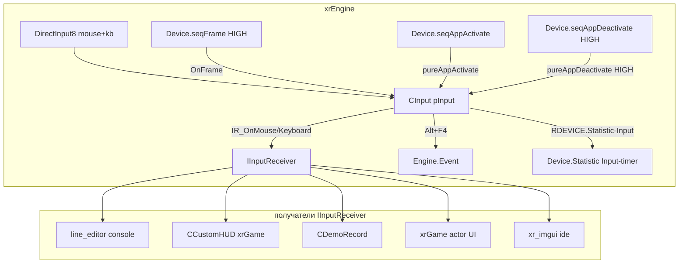

# Ввод

**Ввод** — подсистема `xrEngine`, которая читает мышь и клавиатуру (DirectInput 8), аккумулирует дельты/состояние и раздаёт их **получателям** через интерфейс `IInputReceiver`. Получателей в движке много: консольный редактор строки, HUD, демо-рекордер, `xrGame` (актёр, UI) — все они подписываются на один `CInput` и получают события в порядке LIFO-стопки «захвата».

См. [Цикл кадра](frame-loop.md), [Консоль](console.md), [Демо](demo.md), [UI-примитивы](ui-primitives.md), [Device](device.md).

## 1. Ответственность

- **`CInput`** (`src/xrEngine/xr_input.h`, `src/xrEngine/Xr_input.cpp`, ~780 строк) — единственный активный источник ввода: DirectInput8 для мыши и клавиатуры, аккумулирование `offs[3]` (mouse) и `key_state[256]` (kb), раздача событий подписчикам, захват/отпускание (capture stack), «демонизированные» настраиваемые буферы.
- **`IInputReceiver`** (`src/xrEngine/IInputReceiver.h/.cpp`) — интерфейс получателя: виртуальные `IR_OnMouse*`/`IR_OnKeyboard*` + статические геттеры `IR_GetKeyState`/`IR_GetBtnState`/`IR_GetMouse*`.
- **`xr_input_xinput.h/.cpp`** — **мёртвый код**: весь файл закомментирован (`/* ... */`). Gamepad-поддержка (XInput, `DXUT_GAMEPAD`, `DXUTGetGamepadState`, `set_vibration`, `g_GamePads[4]`, динамический `LoadLibrary(XINPUT_DLL)`) **отключена**, вибрация в `CInput::feedback` тоже закомментирована.
- Глобалы: `pInput` (глобальный `CInput`), `psMouseSens`/`psMouseSensScale`/`psMouseSensVerticalK`/`psMouseInvert` (cvar'ы чувствительности).

Чего это **НЕ делает**: не хранит состояние «кто нажал» дольше кадра (кроме латча `b_altF4`); не реализует геймпады; не управляет imgui (imgui имеет собственный `IR_Capture`, см. [UI-примитивы](ui-primitives.md)); не читает сообщения Windows — это `CRenderDevice::on_message` (см. [Device-окно](device-window.md)).

## 2. Место в архитектуре

`CInput` висит на `Device.seqFrame` с приоритетом `HIGH` (до игровых объектов), на `seqAppActivate` (обычный) и на `seqAppDeactivate` с приоритетом `HIGH` (деактивация раньше остальных). Регистрация — в конструкторе `CInput` (под `#ifdef ENGINE_BUILD` для `seqFrame`).

## 3. Публичный API

### `CInput` (`src/xrEngine/xr_input.h`)

| Поле / метод                                                | Описание                                                                                                                                                         |
| ----------------------------------------------------------- | ---------------------------------------------------------------------------------------------------------------------------------------------------------------- |
| `IR_OnMousePress/Release/Hold` (static)                     | Статические геттеры состояния: кнопка `b` (`MOUSE_1..MOUSE_8`) / дельты `dx/dy` / позиция. Реализация — через `pInput`.                                          |
| `iCapture()` / `iRelease()`                                 | Захват/отпускание ввода: добавляет/снимает **весь текущий** вектор подписчиков в стек; при переходе на пустой/непустой — `IR_OnDeactivate`/`IR_OnActivate` всем. |
| `iGetAsyncKeyState(key)`                                    | Состояние клавиши/кнопки мыши по DIK-коду или `MOUSE_1..8` (`MOUSE_1 = 0xED+100..`).                                                                             |
| `get_dik_name(dik)`                                         | Имя клавиши через `DIPROP_KEYNAME` (DirectInput-property).                                                                                                       |
| `dik_to_text(dik, out)`                                     | Ввод одного символа: `MapVirtualKeyEx` + `ToUnicodeEx` (CP1251, `WC_NO_BEST_FIT_CHARS`), очистка dead-key, фильтр управляющих.                                   |
| `acquire()` / `unacquire()` / `exclusive_mode(g_exclusive)` | Управление DirectInput-устройствами; `g_exclusive` — флаг exclusive-режима.                                                                                      |
| `feedback()`                                                | Заглушка под вибрацию геймпада (вibration-код закомментирован; остаётся `stop_vibration_time`).                                                                  |
| `on_error_dialog(e, pDevice)`                               | Диалог об ошибке DirectInput-устройства.                                                                                                                         |
| `KeyUpdate(dt)`                                             | Обработка клавиатуры за кадр: Alt+F4, Alt+Tab, `DIK_PAUSE` (однокадровый skip через `uAppData=666`).                                                             |
| `MouseUpdate(dt)`                                           | Обработка мыши: аккумуляция `offs`, `IR_OnMouse*` подписчикам, `IR_OnMouseStop` после `mouse_dt` (25 мс) простоя, skip при `Device.dwPrecacheFrame`.             |
| `pureFrame` / `pureAppActivate` / `pureAppDeactivate`       | `OnFrame` (обёртка `KeyUpdate`+`MouseUpdate` в таймер `Statistic->Input`), активация/деактивация (`#ifndef M_BORLAND`).                                          |

### `IInputReceiver` (`src/xrEngine/IInputReceiver.h`)

| Метод                                                                          | Описание                                                                                       |
| ------------------------------------------------------------------------------ | ---------------------------------------------------------------------------------------------- |
| `IR_Capture()` / `IR_Release()` (virtual)                                      | По умолчанию — no-op; наследник может перехватить весь ввод (например, `line_editor` консоли). |
| `IR_OnDeactivate()` / `IR_OnActivate()` (virtual)                              | Сигналы «ввод больше/снова мне доступен» (стек захвата опустел/заполнен).                      |
| `IR_OnMousePress/Release/Hold(b, offs, dt)` (virtual)                          | События мыши: нажатие/отпускание/удержание кнопки `b`, дельта `offs`, время `dt`.              |
| `IR_OnKeyboardPress/Release/Hold(key, mods)` (virtual)                         | События клавиатуры: DIK-код `key`, модификаторы `mods`.                                        |
| `IR_GetLastMouseDelta` / `IR_GetMousePosScreen/Real/Independent/Crop` (static) | Статические геттеры последней дельты и позиции мыши (экран/реальные/независимо/обрезано).      |
| `IR_GetKeyState` / `IR_GetBtnState` (static)                                   | Текущее состояние клавиши/кнопки.                                                              |

### Константы

- `MOUSEBUFFERSIZE = 1024`, `KEYBOARDBUFFERSIZE = 128` — размеры DirectInput-буферов (демонизированы: настраиваются).
- `COUNT_MOUSE_BUTTONS = 8`, `COUNT_KB_BUTTONS = 256`.

## 4. Внутреннее устройство

**Структура `CInput`**: `IDirectInputDevice8*` для мыши и клавиатуры; `cbStack` — `std::vector<IInputReceiver*>` подписчиков (в конструктор пушится `dummyController`, чтобы стек никогда не был пуст); `offs[3]` — аккумуляция дельт мыши; `key_state[256]` — состояние клавиш; `b_altF4` — латч Alt+F4.

**`KeyUpdate`**: читает клавиатуру через DirectInput-буфер; если Alt+F4 и нажаты `RMENU`/`LMENU` — шлёт `Engine.Event.Defer("KERNEL:disconnect")` + `Engine.Event.Defer("KERNEL:quit")`, ставит `b_altF4`; `DIK_PAUSE` — пропуск кадра на один тик (`uAppData=666`); Alt+Tab — шлёт `WM_SYSCOMMAND SC_MINIMIZE`, **только** в fullscreen (`g_screenmode == 2`). Блок XInput полностью закомментирован.

**`MouseUpdate`**: аккумулирует `offs[3]`; кнопки 0 и 1 **меняются местами**, если `SM_SWAPBUTTON`; после `mouse_property.mouse_dt` (25 мс) простоя — `IR_OnMouseStop` подписчикам; skip при `Device.dwPrecacheFrame != 0` (precache-кадры не получают ввод).

**`iCapture`/`iRelease`** — семантика стопки: `iCapture` добавляет **весь** текущий вектор подписчиков; при переходе «стало пусто → непусто» (или обратно) — `IR_OnDeactivate`/`IR_OnActivate` всем. Это позволяет imgui/консоли «перехватить» ввод и вернуть его.

**`OnFrame`** (priority HIGH в `seqFrame`): обёртка `KeyUpdate` + `MouseUpdate` в таймер `RDEVICE.Statistic->Input` (см. [Статистика](stats.md)).

**Глобалы чувствительности**: `psMouseSens`/`psMouseSensScale`/`psMouseSensVerticalK`/`psMouseInvert` — cvar'ы, читаются `xrGame` (актёр) при преобразовании дельты в yaw/pitch.

## 5. Взаимодействие

**Кто меня вызывает**:

- `Device.seqFrame` — `OnFrame` (каждый кадр, priority HIGH).
- `Device.seqAppActivate` / `seqAppDeactivate` — активация/деактивация окна (priority HIGH при деактивации — раньше остальных).
- `xrGame` (актёр) — `IR_GetLastMouseDelta`/`IR_GetMousePos*` для управления камерой.
- Консоль (`line_editor`), HUD, `CDemoRecord`, imgui — подписчики `IInputReceiver`.

**Кого я вызываю**:

- `IInputReceiver::IR_On*` — всем подписчикам в `cbStack` (порядок LIFO).
- `Engine.Event.Defer("KERNEL:disconnect"/"KERNEL:quit")` — при Alt+F4.
- `RDEVICE.Statistic->Input` — таймер в `OnFrame` (см. [Статистика](stats.md)).
- DirectInput8 (Windows) — чтение устройств.

## 6. Потоки

Ввод — **только main-поток** (Windows-сообщения и DirectInput-буферы читаются в `OnFrame` на основном потоке). `cbStack` не защищён локом — все подписчики должны работать в main-потоке. `IInputReceiver`-статические гетторы (`IR_GetKeyState` и т.д.) тоже main-поток.

## 7. Конфигурация

| cvar / настройка                                                              | Описание                                                      |
| ----------------------------------------------------------------------------- | ------------------------------------------------------------- |
| `MOUSEBUFFERSIZE` / `KEYBOARDBUFFERSIZE`                                      | Размеры DirectInput-буферов (демонизированы: можно изменить). |
| `psMouseSens` / `psMouseSensScale` / `psMouseSensVerticalK` / `psMouseInvert` | Чувствительность мыши (cvar'ы, читаются xrGame).              |
| `g_exclusive`                                                                 | Флаг exclusive-режима DirectInput.                            |
| `mouse_property.mouse_dt`                                                     | Порог «простоя» мыши для `IR_OnMouseStop` (25 мс).            |

## 8. Ограничения / дебаг

- **XInput закомментирован**: `xr_input_xinput.cpp/.h` — весь файл в `/* ... */`. Gamepad-поддержка **отключена**. В `CInput::feedback` вибрация тоже закомментирована (остаётся `stop_vibration_time`).
- **`dwPrecacheFrame`**: precache-кадры **не получают ввод** (skip в `KeyUpdate`/`MouseUpdate`).
- **`b_altF4`** — латч: после Alt+F4 ставится, чтобы не повторять `KERNEL:quit`.
- **`SM_SWAPBUTTON`**: кнопки 0/1 мыши меняются местами, если в Windows включён «Invert mouse buttons» — это **ожидается** поведение.
- **Dead-key**: `dik_to_text` использует `ToUnicodeEx` с `WC_NO_BEST_FIT_CHARS` (CP1251) — диакритики/дед-кичи обрабатываются, но могут быть потеряны при некорректном codepage.
- **Диагностика**: `on_error_dialog` — показывает окно об ошибке DirectInput-устройства; `Statistic->Input` — таймер ввода (см. [Статистика](stats.md)).

См. [Цикл кадра](frame-loop.md), [Консоль](console.md), [Демо](demo.md), [UI-примитивы](ui-primitives.md), [Device](device.md), [Device-окно](device-window.md).
