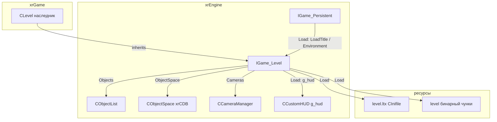
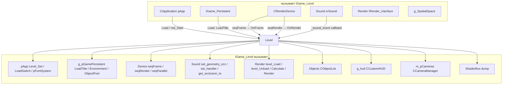
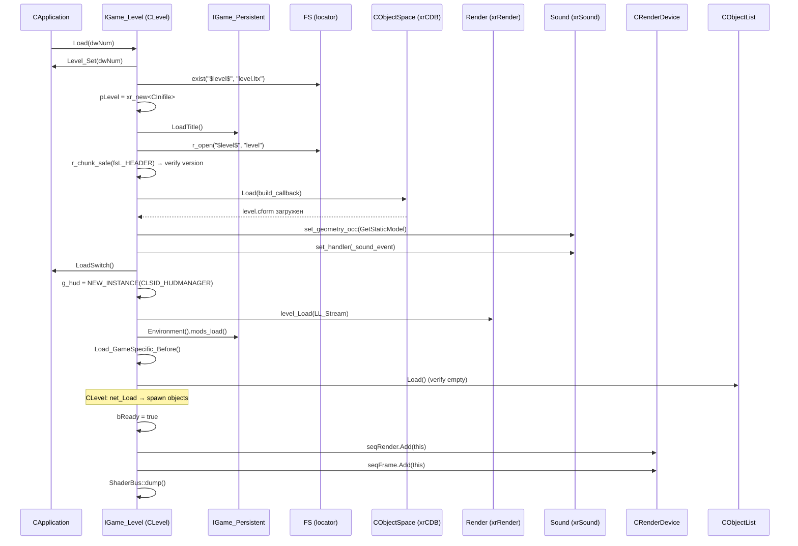
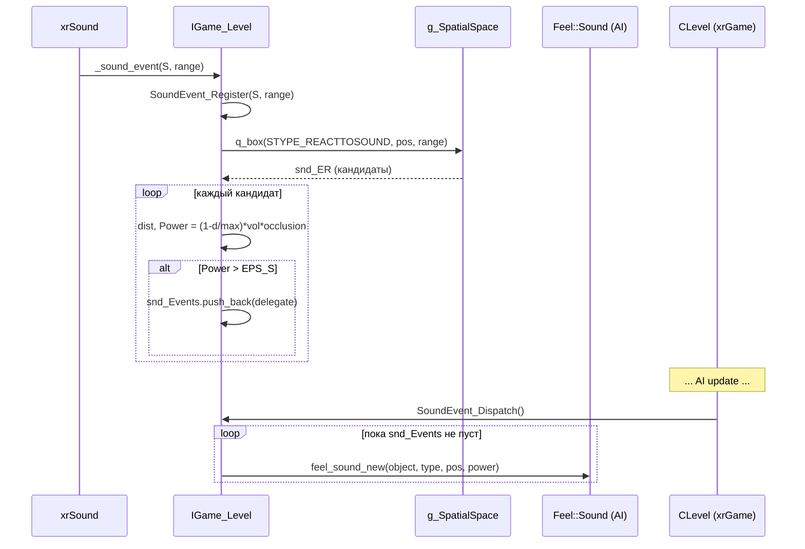

# Уровень

`IGame_Level` — базовый класс **загружаемого уровня** (карты). Один экземпляр на сессию; создаётся через `NEW_INSTANCE(CLSID_GAME_LEVEL)` → в `xrGame` это `CLevel`. Владеет `CObjectList` (все объекты мира), `CObjectSpace` (статическая коллизионная модель), `CCameraManager`, текущим сущностями (entity/view-entity) и deferred-звуковыми событиями.

`IGame_Level` — это **контейнер + жизненный цикл**: `Load(dwNum)` загружает `level.ltx` + бинарный `level` (чунки: header, cform, render-данные), создаёт HUD, регистрирует себя в `Device.seqFrame/seqRender`. `OnFrame` обновляет все объекты, `OnRender` рендерит сцену.

Чего это **НЕ делает**: не хранит игровое состояние (это `CLevel`/`CGamePersistent` в xrGame), не реализует сеть (чистые виртуальные `net_*` — в `CLevel`), не анимирует, не считает физику. `xrLevel.h` — **не** «уровень» в смысле класса; это заголовок с бинарными структурами для формата уровня/уровня-графа (см. ниже).

## Место в архитектуре

- **`IGame_Level`** — «каркас карты»: объекты + коллизии + камеры + сущности + звук.
- **`CLevel`** (xrGame) — реальная карта: сеть, демо, физика-команды, sound-manager, spawn-manager, interpolation.
- **`xrLevel.h`** — бинарные форматы: `hdrLEVEL`, `hdrCFORM`, `hdrNODES`, `fsL_*` чунки, `NodeCompressed` (уровень-граф для AI). Не имеет отношения к классу `IGame_Level` по названию.

См. [Карта модулей](../../architecture/module-map.md), [Модель объектов](../../architecture/object-model.md), [Объект](xr-object.md), [Коллизии и физика](collide-physics.md), [Окружение](environment.md).

## Публичный API

### `IGame_Level` (`src/xrEngine/IGame_Level.h`)

| Группа          | Методы                                                                                                                                                   |
| --------------- | -------------------------------------------------------------------------------------------------------------------------------------------------------- |
| Имя/инфо        | `name()`, `GetLevelInfo(CServerInfo*)` (чистые)                                                                                                          |
| Сеть (чистые)   | `net_Start(op_server, op_client)`, `net_Load(name)`, `net_Save(name)`, `net_Update()`, `net_Stop()` (база: 6×`Objects.Update` + `Unload` + `IR_Release`) |
| Загрузка        | `Load(u32 dwNum)`, `Load_GameSpecific_Before/After`, `Load_GameSpecific_CFORM(CDB::TRI*, u32)` (чистая), `LL_CheckTextures()`                            |
| Кадр            | `_BCL OnFrame(void)`, `OnRender(void)`                                                                                                                   |
| Демо            | `OpenDemoFile(name)`, `net_StartPlayDemo()` (чистые)                                                                                                     |
| Сущности        | `CurrentEntity()`, `CurrentViewEntity()`, `SetEntity(CObject*)`, `SetViewEntity(CObject*)`                                                               |
| Звук (deferred) | `SoundEvent_Register(ref_sound_data_ptr, float range)`, `SoundEvent_Dispatch()`, `SoundEvent_OnDestDestroy(Feel::Sound*)`                                |
| Окружение       | `SetEnvironmentGameTimeFactor(u64, float)` (чистая)                                                                                                      |
| Поля            | `Objects` (CObjectList), `ObjectSpace` (CObjectSpace), `Cameras()` (CCameraManager&), `bReady`, `pLevel` (CInifile*), `Sounds_Random`                    |

### `CServerInfo` (`src/xrEngine/IGame_Level.h`)

| Метод                         | Назначение                                       |
| ----------------------------- | ------------------------------------------------ |
| `AddItem(name, value, color)` | добавить строку «name = value» с цветом (max 15) |
| `Size()`, `operator`   | доступ                                           |
| `ResetData()`                 | очистить                                         |

### `xrLevel.h` — бинарные структуры

| Структура / enum  | Назначение                                                                                                                             |
| ----------------- | -------------------------------------------------------------------------------------------------------------------------------------- |
| `xrGUID`          | `u64 g[2]`, `LoadLTX/SaveLTX` (`_g0`/`_g1`)                                                                                            |
| `fsL_Chunks`      | чунки бинарного `level`: `HEADER=1, SHADERS=2, VISUALS=3, PORTALS=4, LIGHT_DYNAMIC=6, GLOWS=7, SECTORS=8, VB=9, IB=10, SWIS=11`        |
| `fsESectorChunks` | чунки сектора: `Portals=1, Root=2`                                                                                                     |
| `fsSLS_Chunks`    | `Description=1, ServerState=2`                                                                                                         |
| `EBuildQuality`   | `ebqDraft/High/Custom`                                                                                                                 |
| `hdrLEVEL`        | `u16 XRLC_version, XRLC_quality`                                                                                                       |
| `hdrCFORM`        | `u32 version, vertcount, facecount; Fbox aabb`                                                                                         |
| `hdrNODES`        | `u32 version, count; float size, size_y; Fbox aabb; xrGUID guid`                                                                       |
| `NodePosition`    | 5 байт: `xz` (24 бит) + `y` (16 бит); `CLevelGraph` friend                                                                             |
| `NodeCompressed`  | 12 байт: 4×link (23 бит), cover (4×4+4×4 бит), plane (16), position                                                                    |
| `NodeCompressed6` | 11 байт (`AI_COMPILER`): 4×link (21 бит), cover, plane, position                                                                       |
| Версии            | `XRCL_CURRENT_VERSION=18`, `XRCL_PRODUCTION_VERSION=14`, `CFORM_CURRENT_VERSION=4`, `MAX_NODE_BIT_COUNT=23`, `XRAI_CURRENT_VERSION=10` |

## Внутреннее устройство

### `IGame_Level::Load(u32 dwNum)`

Порядок (`src/xrEngine/IGame_Level.cpp`):

1. `pApp->Level_Set(dwNum)` — переключить текущий уровень в `CApplication`.
2. Проверить `FS.exist("$level$", "level.ltx")`, иначе `Debug.fatal`.
3. `pLevel = xr_new<CInifile>(temp)` — открыть `level.ltx`.
4. `g_pGamePersistent->LoadTitle()` — загрузочный экран.
5. `FS.r_open("$level$", "level")` — бинарный поток.
6. `fs.r_chunk_safe(fsL_HEADER, &H, sizeof(H))` — проверить `XRCL_PRODUCTION_VERSION == H.XRLC_version`.
7. `ObjectSpace.Load(build_callback)` — загрузить `level.cform` (статическая коллизия); `build_callback` → `Load_GameSpecific_CFORM` (чистая, в `CLevel`).
8. `Sound->set_geometry_occ(ObjectSpace.GetStaticModel())` + `set_handler(_sound_event)`.
9. `pApp->LoadSwitch()`.
10. Если `!g_hud` — `NEW_INSTANCE(CLSID_HUDMANAGER)`.
11. `Render->level_Load(LL_Stream)` — рендер-данные (чунки `SHADERS/VISUALS/PORTALS/...`).
12. `g_pGamePersistent->Environment().mods_load()` — моды окружения.
13. `Load_GameSpecific_Before()` → `Objects.Load()` (проверка пустоты) → [в `CLevel`: `net_Load` спавнит объекты].
14. `bReady = true`, `IR_Capture()` (если не dedicated), `Device.seqRender.Add(this)`, `Device.seqFrame.Add(this)`, `ShaderBus::dump()`.

### `IGame_Level::OnFrame`

1. `VERIFY(bReady)`.
2. `Objects.Update(false)` — кадр объектов (crow + destroy).
3. `g_hud->OnFrame()`.
4. `Sounds_Random` — каждый 10–20 с воспроизвести случайный ambient-звук в случайной точке (30–100 от камеры).

### `IGame_Level::OnRender`

- Если `!g_dedicated_server`: `Render->Calculate()` + `Render->Render()`.
- Иначе: `Sleep(psNET_DedicatedSleep)` (5 мс по умолчанию).
- Обёрнуто в `TAL_*` (GPA-профилирование, `#ifdef _GPA_ENABLED`).

### `SetEntity` / `SetViewEntity`

- `SetEntity(O)`: если был `pCurrentEntity` → `On_LostEntity()`; если `O` → `On_SetEntity()`; **`pCurrentEntity = pCurrentViewEntity = O`** (одна сущность = и «я», и «глаза»).
- `SetViewEntity(O)`: только `pCurrentViewEntity`; `On_LostEntity/On_SetEntity` аналогично.

### `SoundEvent_Register` / `SoundEvent_Dispatch`

Deferred-система «звук → AI»:

1. `SoundEvent_Register(S, range)`:
   - Проверки: `g_bLoaded`, `S != 0`, `S->g_object` не умирает, `S->feedback != 0`.
   - `clamp(range, 0.1, 500)`.
   - Позиция: для 2D-звука — `listener_position()`.
   - `range = min(range, p->max_ai_distance)`.
   - `g_SpatialSpace->q_box(snd_ER, 0, STYPE_REACTTOSOUND, snd_position, {range,range,range})` — все объекты, реагирующие на звук.
   - Для каждого: `dcast_FeelSound()`, `dcast_CObject()`, не умирает, `dist < max_ai_distance`, `Power = (1 - dist/max_ai_distance) * volume * occlusion`. Если `Power > EPS_S` → push `_esound_delegate{dest, source, power}` в `snd_Events`.
2. `SoundEvent_Dispatch()` (вызывается в `CLevel::OnFrame` после AI-update): пока `snd_Events` не пуст → `dest->feel_sound_new(object, type, userdata, position, power)`, `pop_back`.
3. `SoundEvent_OnDestDestroy(obj)` — удалить все делегаты с `dest == obj` (чтобы не вызывать на умершем).

`_sound_event` (статический callback): вызывается звуковым движком при воспроизведении звука с `feedback`; если `g_pGameLevel && S->feedback` → `SoundEvent_Register`.

### `LL_CheckTextures`

Отчёт по текстурам (не ошибка, только `Msg`):

- base: `m_base > 64MB || c_base > 400` → `bError`.
- lmap: `m_lmaps > 32MB || c_llmaps > 8` → `bError` + `Msg("***FATAL***")` в DEBUG.

### `CServerInfo`

Простой контейнер: `svector<SItem_ServerInfo, 15>`, `AddItem` форматирует `"name = value"`, `color`. Используется `CLevel::GetLevelInfo` для вывода в консоль/HUD.

### `xrLevel.h` — детали

- **`fsL_Chunks`** — порядок чунков в бинарном `level`: `HEADER` обязателен, остальные читаются `Render->level_Load` и `ObjectSpace.Load`. Пропуск `5` (между `PORTALS=4` и `LIGHT_DYNAMIC=6`) — исторический.
- **`hdrLEVEL`** — `#pragma pack(push,8)`; `XRCL_PRODUCTION_VERSION=14` — минимальная совместимая версия.
- **`hdrCFORM`** — заголовок `level.cform`; `CFORM_CURRENT_VERSION=4`.
- **`NodePosition`** (5 байт): `xz` — 24 бита (x = xz/row, z = xz%row), `y` — 16 бит. Для `CLevelGraph` (AI-навигация).
- **`NodeCompressed`** (12 байт): 4 ссылки по 23 бита, cover (2×4×4 бита), plane (16 бит), position (5 байт). Итого 180 бит = 24.5 → 25 байт (комментарий в коде).
- **`NodeCompressed6`** (11 байт, `#ifdef AI_COMPILER`): 4 ссылки по 21 биту — для меньших уровней.
- **`SNodePositionOld`** — `s16 x, u16 y, s16 z` (6 байт), `typedef` как `NodePosition` при `#ifdef _EDITOR`.

## Взаимодействие

**Кто вызывает меня**:

- `CApplication` (`pApp`) — `Load(dwNum)` при загрузке уровня, `Level_Set`, `LoadSwitch`.
- `CRenderDevice` — `Device.seqFrame.Add(this)` → `OnFrame` каждый кадр; `Device.seqRender.Add(this)` → `OnRender`.
- `Sound` (xrSound) — `_sound_event` callback при воспроизведении звука с `feedback`.
- `IGame_Persistent` — `LoadTitle()` при загрузке, `Environment().mods_load()`.
- `xrGame` (`CLevel`) — переопределяет все чистые виртуальные (`net_*`, `name`, `GetLevelInfo`, `Load_GameSpecific_CFORM`, `OpenDemoFile`, `net_StartPlayDemo`, `SetEnvironmentGameTimeFactor`).

**Кого вызываю я**:

- `pApp` — `Level_Set`, `LoadSwitch`.
- `g_pGamePersistent` — `LoadTitle()`, `Environment().mods_load()`, `ObjectPool` (через `CObjectList::Create`).
- `Device` — `seqFrame/seqRender.Add/Remove`, `DumpResourcesMemoryUsage`.
- `Sound` — `set_geometry_occ`, `set_handler`, `get_occlusion_to`, `object_relcase`.
- `Render` — `level_Load`, `level_Unload`, `Calculate`, `Render`.
- `g_SpatialSpace` — `q_box` (для `SoundEvent_Register`).
- `g_hud` — `OnFrame`, `net_Relcase`.
- `CCameraManager` — `Cameras()`, `ResetPP` (при уничтожении).
- `ShaderBus::dump()` — при загрузке.

## Потоки данных

### Загрузка уровня

### Звуковой feedback (deferred)

## Конфигурация

- **`level.ltx`** (`$level$/level.ltx`) — `CInifile`, секции объектов уровня, настройки.
- **`level`** (бинарный, `$level$/level`) — чунки `fsL_*`: `HEADER` (версия), `SHADERS`, `VISUALS`, `PORTALS`, `LIGHT_DYNAMIC`, `GLOWS`, `SECTORS`, `VB`, `IB`, `SWIS`.
- **`level.cform`** — бинарная статическая коллизионная модель (`hdrCFORM` + вершины + треугольники); загружается `CObjectSpace::Load`.
- **`XRCL_PRODUCTION_VERSION = 14`** — минимальная версия `hdrLEVEL.XRLC_version`; `XRCL_CURRENT_VERSION = 18` — текущая (вход).
- **`CFORM_CURRENT_VERSION = 4`** — версия `hdrCFORM`.
- **`psNET_DedicatedSleep = 5`** (мс) — sleep в `OnRender` для dedicated server.
- **`Sounds_Random`** — вектор `ref_sound`, заполняется в `CLevel`; интервал 10–20 с, позиция 30–100 от камеры.

## Известные ограничения / дебаг

- **`IGame_Level::Load`** — если `level.ltx` не найден → `Debug.fatal` (не `Msg`). Это невосстановимая ошибка.
- **`hdrLEVEL`** — `#pragma pack(push,8)`; `XRCL_PRODUCTION_VERSION` — **минимальная** версия, а не текущая. Текущая — `XRCL_CURRENT_VERSION`.
- **`fsL_Chunks`** — пропуск `5` (между `PORTALS=4` и `LIGHT_DYNAMIC=6`) — исторический, не использовать.
- **`IGame_Level::OnFrame`** — `VERIFY(bReady)`; если `OnFrame` вызван до `Load` → assert.
- **`SetEntity`** — устанавливает **оба** `pCurrentEntity` и `pCurrentViewEntity`; `SetViewEntity` — только view. Это асимметрия: `SetEntity` «забивает» view.
- **`SoundEvent_Register`** — `g_SpatialSpace->q_box` с `STYPE_REACTTOSOUND`; если объект не зарегистрирован в spatial DB с этим флагом — не получит звук.
- **`SoundEvent_Dispatch`** — вызывается **в `CLevel::OnFrame`**, а не в `IGame_Level::OnFrame` (база не вызывает).
- **`IGame_Level::~IGame_Level`** — `Device.seqParallel.clear_not_free()` (не `Remove`), `CCameraManager::ResetPP()`, `Sound->set_geometry_occ(NULL)`.
- **`xrLevel.h`** — `NodePosition`/`NodeCompressed` — для `CLevelGraph` (AI-навигация), **не** для рендера. `CLevelGraph` — в xrGame.
- **`CServerInfo`** — max 15 items (`VERIFY(id < max_item)`); `AddItem` при переполнении **молча игнорирует**.
- **`IGame_Level::net_Stop`** — 6×`Objects.Update(false)` + `Unload` + `IR_Release`; это «жёсткий» останов, не «мягкий».
- **`LL_CheckTextures`** — не останавливает загрузку (только `Msg` + `bError` локально, не возвращается наружу).
- **`IGame_Level` не владеет `CObjectList` по указателю** — `Objects` — вложенный объект (value semantics), не указатель.
- **`IGame_Level` не владеет `CObjectSpace` по указателю** — `ObjectSpace` — вложенный объект.
- **`g_pGameLevel`** — глобальный указатель, устанавливается в конструкторе `IGame_Level`; `nullptr` после деструктора.
