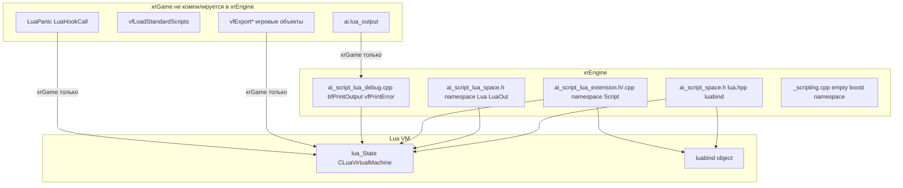

# Lua-биндинг

**Lua-биндинг** — подсистема `xrEngine` для **инфраструктуры** Lua-скриптов: пространства имён, загрузка скриптов, отладка, вывод. **Важно**: в `xrEngine` компилируется **только** инфраструктура (namespace/buffer/print) — сами `vfExport*`-функции (экспорт игровых объектов в Lua) находятся в **xrGame** и **не компилируются** в `xrEngine` (из-за `#ifndef ENGINE_BUILD`).

См. [Граница скриптинга (архитектура)](../../architecture/scripting-boundary.md), [Lua Reference](../../api/lua-reference.md), [Ядро](engine.md).

## 1. Ответственность

- **`ai_script_space.h`** (`src/xrEngine/ai_script_space.h`) — включение `lua.hpp` (AVO lua re-org; старые extern-C `lua`/`lualib`/`lauxlib` закомментированы), `luabind/luabind.hpp` + `object.hpp`, `typedef lua_State CLuaVirtualMachine`, `SMemberCallback` (luabind functor/object + `shared_str` метод-имя).
- **`ai_script_lua_space.h`** (`src/xrEngine/ai_script_lua_space.h`) — `namespace Lua`: `ELuaMessageType` (eLuaMessageTypeInfo=0, eLuaMessageTypeError, eLuaMessageTypeMessage, eLuaMessageTypeHookCall/Return/Line/Count, eLuaMessageTypeHookTailReturn=u32(-1)), `int __cdecl LuaOut(ELuaMessageType, LPCSTR, ...)`.
- **`ai_script_lua_extension.h/.cpp`** (`src/xrEngine/ai_script_lua_extension.h/.cpp`) — `namespace Script`: **под `#ifndef ENGINE_BUILD`** (xrGame, не xrEngine): `vfExportGlobals/Fvector/Fmatrix/Game/Level/Device/Particles/Sound/Hit/Actions/Object/Effector/ArtifactMerger/MemoryObjects/ToLua/ActionManagement/MotivationManagement`, `vfLoadStandardScripts`, `bfLoadFile`, `LuaHookCall`, `LuaPanic`; **всегда** (xrEngine + xrGame): `bfPrintOutput`, `cafEventToString`, `vfPrintError`, `bfListLevelVars`, `bfLoadBuffer`, `bfLoadFileIntoNamespace`, `bfGetNamespaceTable`, `get_namespace_table`, `bfIsObjectPresent` (2 overloads), `lua_namespace_table` (возвращает `::luabind::object`).
- **`ai_script_lua_debug.cpp`** (`src/xrEngine/ai_script_lua_debug.cpp`) — `bfPrintOutput` (итерация стека для строк; «cannot resume dead coroutine» → «Script finished» + true), `vfPrintError` (`Msg ! SCRIPT ...` per error code, затем `bfListLevelVars` per level — **тело `bfListLevelVars` полностью закомментировано**, возвращает false сразу), `cafEventToString` (LUA_HOOK* → строки).
- **`_scripting.cpp`** (`src/xrEngine/_scripting.cpp`) — **10 строк**: пустой `namespace boost { }` с закомментированным `throw_exception` (workaround для /EHsc exclusion).

Чего это **НЕ делает**: не экспортирует игровые объекты (это xrGame, `vfExport*`); не управляет Lua-VM жизненным циклом (это xrGame, `LuaPanic`/`LuaHookCall`); не реализует скриптовые API (см. [Lua Reference](../../api/lua-reference.md)).

## 2. Место в архитектуре

`xrEngine` — только инфраструктура: namespace/buffer/print. `xrGame` — экспорт + VM lifecycle. Граница: `ENGINE_BUILD` (определён renderer DLL'ами `XRRENDER_R?_EXPORTS`).

## 3. Публичный API

### `ai_script_lua_space.h`

| Символ                                 | Описание                                                                                                                                                                                                                 |
| -------------------------------------- | ------------------------------------------------------------------------------------------------------------------------------------------------------------------------------------------------------------------------ |
| `ELuaMessageType`                      | Enum: `eLuaMessageTypeInfo=0`, `eLuaMessageTypeError`, `eLuaMessageTypeMessage`, `eLuaMessageTypeHookCall/Return/Line/Count`, `eLuaMessageTypeHookTailReturn=u32(-1)`.                                                   |
| `LuaOut(ELuaMessageType, LPCSTR, ...)` | Форматированный вывод (prefix per type: `* [LUA] [INFO]`, `! [LUA] [ERROR]`, `[LUA] [MESSAGE]`, `[LUA][HOOK_*]`); `Msg()` + `ai().lua_output().w_string()` если не ENGINE_BUILD; gate `psAI_Flags.test(aiLua)` в xrGame. |

### `ai_script_lua_extension.h` — `namespace Script`

**Всегда** (xrEngine + xrGame):

| Функция                                       | Описание                                                                                                              |
| --------------------------------------------- | --------------------------------------------------------------------------------------------------------------------- |
| `bfPrintOutput`                               | Итерация Lua-стека для строк; «cannot resume dead coroutine» → «Script finished» + true.                              |
| `cafEventToString`                            | LUA_HOOK* → строки.                                                                                                   |
| `vfPrintError`                                | `Msg ! SCRIPT ...` per error code, затем `bfListLevelVars` per level (закомментировано).                              |
| `bfListLevelVars`                             | **Тело полностью закомментировано** — возвращает false сразу.                                                         |
| `bfLoadBuffer`                                | Загрузка Lua-буфера (предваряет `local this = <ns>\n` если namespace, `luaL_loadbuffer`, DEBUG: print error on fail). |
| `bfLoadFileIntoNamespace`                     | Создание namespace → copy globals → dofile → set namespace.                                                           |
| `bfGetNamespaceTable` / `get_namespace_table` | Получение namespace-таблицы.                                                                                          |
| `bfIsObjectPresent` (2 overloads)             | Линейный scan таблицы.                                                                                                |
| `lua_namespace_table`                         | Возврат `::luabind::object` path.                                                                                     |

**Под `#ifndef ENGINE_BUILD`** (xrGame, **не компилируется в xrEngine**):

| Функция                                                                                                                                                                  | Описание                                                                                                                                                  |
| ------------------------------------------------------------------------------------------------------------------------------------------------------------------------ | --------------------------------------------------------------------------------------------------------------------------------------------------------- |
| `vfExportGlobals/Fvector/Fmatrix/Game/Level/Device/Particles/Sound/Hit/Actions/Object/Effector/ArtifactMerger/MemoryObjects/ToLua/ActionManagement/MotivationManagement` | Экспорт игровых объектов в Lua (luabind).                                                                                                                 |
| `vfLoadStandardScripts`                                                                                                                                                  | Чтение `$game_data$/script.ltx` `[common] script` (comma-list) → загрузка каждого из `$game_scripts$` как `.script`, вызов `<ns>_initialize()` если есть. |
| `bfLoadFile`                                                                                                                                                             | Загрузка файла (namespace = имя файла без расширения).                                                                                                    |
| `LuaHookCall`                                                                                                                                                            | Вызов Lua-hook.                                                                                                                                           |
| `LuaPanic`                                                                                                                                                               | Обработка паники Lua (fatal).                                                                                                                             |

## 4. Внутреннее устройство

**`ai_script_space.h`**:

- Warning disables.
- `#include "lua.hpp"` (AVO lua re-org; старые extern-C `lua`/`lualib`/`lauxlib` закомментированы).
- `#include <luabind/luabind.hpp>` + `object.hpp`.
- `typedef lua_State CLuaVirtualMachine`.
- `SMemberCallback` (luabind functor/object + `shared_str` метод-имя).
- `#include "ai_script_lua_space.h"`.

**`ai_script_lua_extension.cpp`**:

- `Lua::LuaOut` (format prefix per type; `Msg()` + `ai().lua_output().w_string()` если не ENGINE_BUILD; gate `psAI_Flags.test(aiLua)` в xrGame).
- **`#ifndef ENGINE_BUILD`**:
  - `vfLoadStandardScripts` (чтение `$game_data$/script.ltx` `[common] script` comma-list → загрузка каждого из `$game_scripts$` как `.script`, вызов `<ns>_initialize()` если есть).
  - `LuaError` (fatal).
  - `vfExportToLua` (luabind open + error callback + atpanic + все `vfExport*` + DEBUG hooks + load standard scripts).
  - `bfLoadFile` (namespace = имя файла без расширения).
- **Всегда**:
  - `bfCreateNamespaceTable` (dot-separated path, создание таблиц, error если non-table).
  - `vfCopyGlobals` (копирование `_G` в новую таблицу).
  - `bfLoadBuffer` (предваряет `local this = <ns>\n` если namespace, `luaL_loadbuffer`, DEBUG: print error on fail).
  - `bfDoFile` (open через FS, имя `@<path>`, load buffer, `lua_call(0,0)` если bCall else `lua_insert`).
  - `vfSetNamespace` (копирование namespace-таблицы globals обратно в `_G`).
  - `bfLoadFileIntoNamespace` (create ns → copy globals → dofile → set namespace).
  - `bfGetNamespaceTable` / `get_namespace_table`.
  - `bfIsObjectPresent` (линейный scan таблицы).
  - `lua_namespace_table` (luabind object path).

**`ai_script_lua_debug.cpp`**:

- `bfPrintOutput` (итерация стека для строк; «cannot resume dead coroutine» → «Script finished» + true).
- `vfPrintError` (`Msg ! SCRIPT ...` per error code, затем `bfListLevelVars` per level — **тело `bfListLevelVars` полностью закомментировано**, возвращает false сразу).
- `cafEventToString` (LUA_HOOK* → строки).

**`_scripting.cpp`**: **10 строк** — пустой `namespace boost { }` с закомментированным `throw_exception` (workaround для /EHsc exclusion).

## 5. Взаимодействие

**Кто меня вызывает**:

- `xrGame` (AI-скрипты) — `vfLoadStandardScripts`, `bfLoadFile`, `LuaHookCall`, `LuaPanic`.
- `xrGame` (экспорт) — `vfExport*` (только xrGame, не xrEngine).
- Lua VM — `LuaOut`, `bfPrintOutput`, `vfPrintError`.

**Кого я вызываю**:

- `lua_State` / `luabind::object` — Lua VM.
- `Msg()` — лог (xrCore).
- `ai().lua_output()` — xrGame (только не ENGINE_BUILD).
- `psAI_Flags.test(aiLua)` — xrGame (gate).

## 6. Потоки

Lua-инфраструктура — **main-поток** (Lua VM не thread-safe по умолчанию). `thread_local s_script_caller` (см. [Консоль](console.md)) — для скриптов, которые могут вызываться из других потоков.

## 7. Конфигурация

| Настройка                                  | Описание                                         |
| ------------------------------------------ | ------------------------------------------------ |
| `$game_data$/script.ltx` `[common] script` | Comma-list скриптов для `vfLoadStandardScripts`. |
| `$game_scripts$`                           | Каталог скриптов.                                |
| `psAI_Flags.test(aiLua)`                   | Gate на Lua-вывод (xrGame).                      |

## 8. Ограничения / дебаг

- **`ENGINE_BUILD`**: определён renderer DLL'ами (`XRRENDER_R?_EXPORTS`), поэтому в `xrEngine` `vfExport*`-функции **не компилируются** — только namespace/buffer/print инфраструктура.
- **`bfListLevelVars`**: тело **полностью закомментировано** (возвращает false сразу) — `vfPrintError` печатает только заголовок ошибки, **не** stack dump.
- **`_scripting.cpp`**: 10 строк — пустой boost namespace stub (workaround для /EHsc), **не** расширять.
- **`LuaOut`**: gate `psAI_Flags.test(aiLua)` в xrGame — если флаг не включён, вывод **не** идёт.
- **`SMemberCallback`**: luabind functor/object + `shared_str` метод-имя — для member-функций.

См. [Граница скриптинга (архитектура)](../../architecture/scripting-boundary.md), [Lua Reference](../../api/lua-reference.md), [Ядро](engine.md), [Консоль](console.md).
